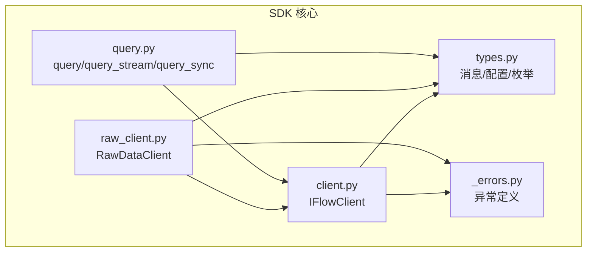
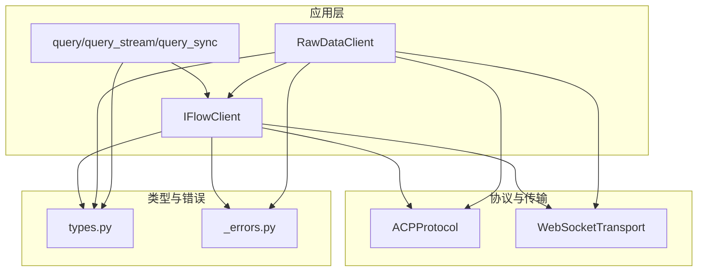
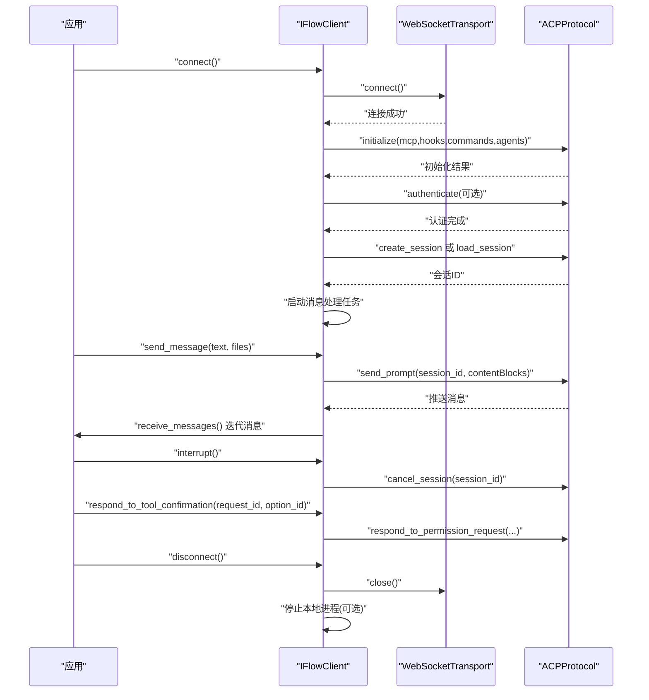
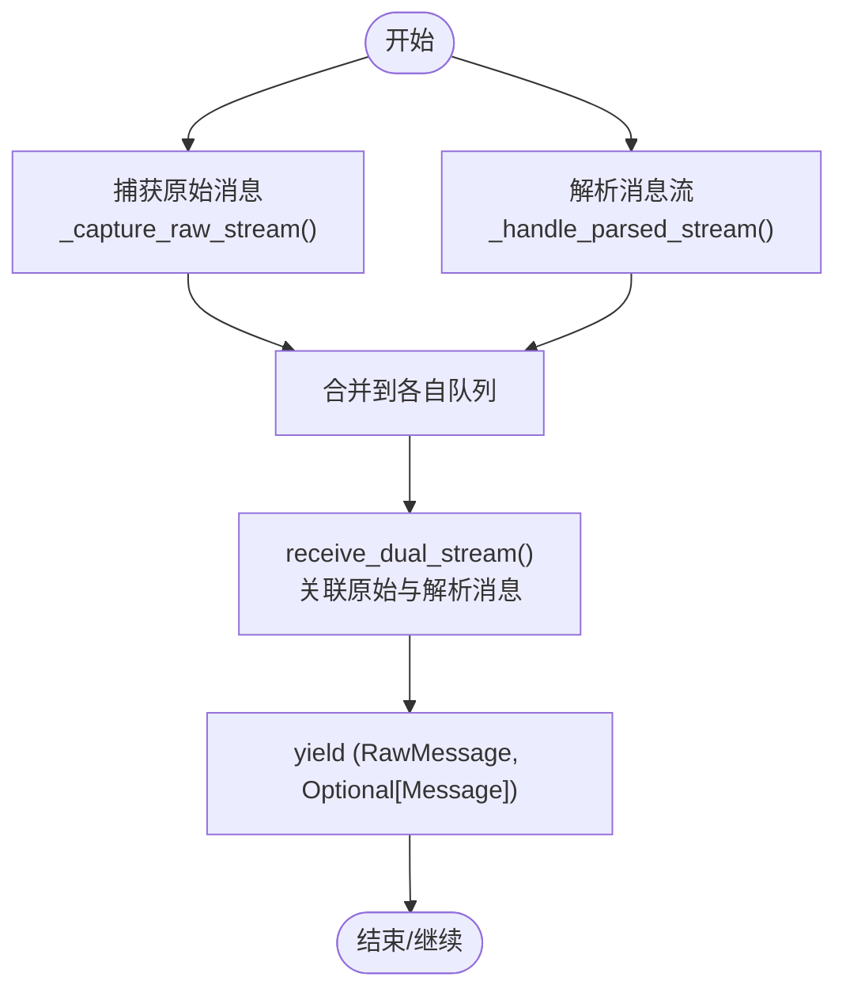
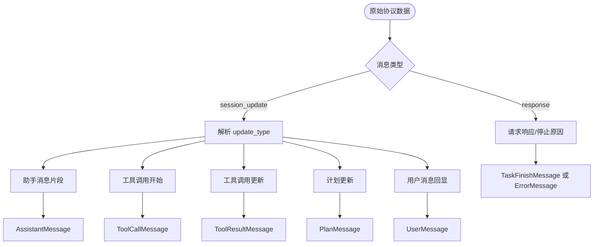
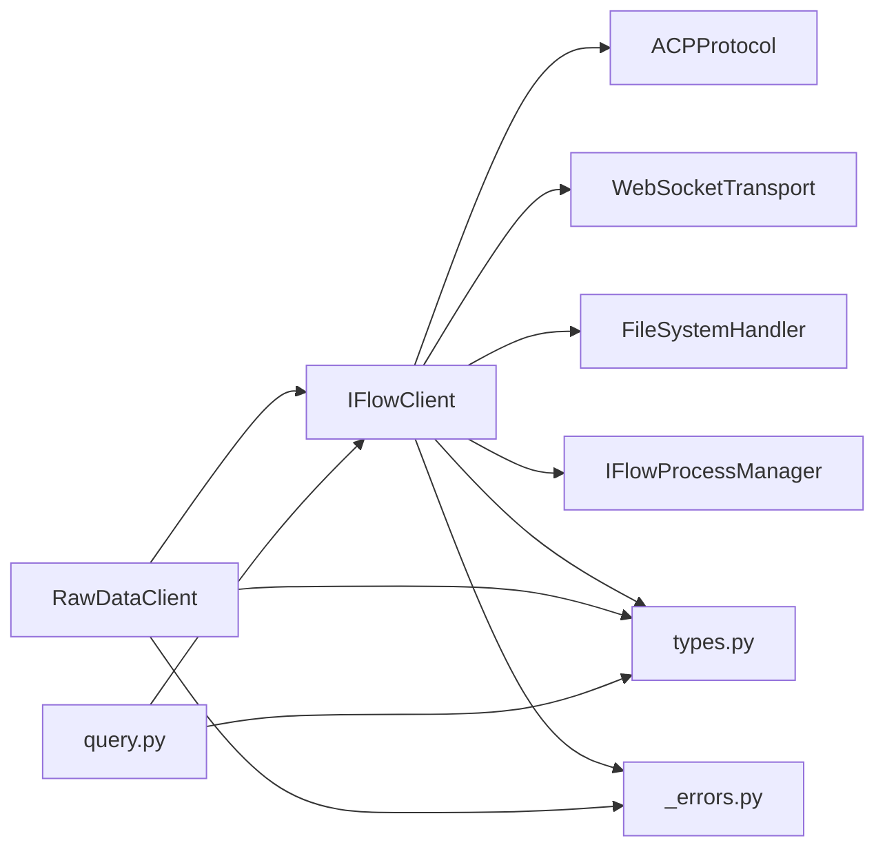

# API参考

<cite>
**本文引用的文件**
- [client.py](file://client.py)
- [raw_client.py](file://raw_client.py)
- [query.py](file://query.py)
- [types.py](file://types.py)
- [_errors.py](file://_errors.py)
</cite>

## 目录
1. [简介](#简介)
2. [项目结构](#项目结构)
3. [核心组件](#核心组件)
4. [架构总览](#架构总览)
5. [详细组件分析](#详细组件分析)
6. [依赖关系分析](#依赖关系分析)
7. [性能考量](#性能考量)
8. [故障排查指南](#故障排查指南)
9. [结论](#结论)
10. [附录](#附录)

## 简介
本文件为 iflow_sdk 的公共 API 参考，覆盖以下内容：
- IFlowClient 类：构造与生命周期管理、连接/断开、消息发送与接收、中断、工具调用确认与取消确认等方法的参数、返回值、异常与使用示例。
- RawDataClient 类：在 IFlowClient 基础上提供原始协议数据访问能力，包括原始消息流、双流（原始+解析）流、历史记录与协议统计、原始发送等。
- query.py 模块：query、query_stream、query_sync 三个便捷查询函数的参数、行为与适用场景。

本参考严格基于仓库源码，所有示例均以“代码片段路径”的形式给出，避免直接粘贴源码。

## 项目结构
- 核心客户端：client.py 提供 IFlowClient；raw_client.py 在其基础上扩展 RawDataClient。
- 查询便捷函数：query.py 提供 query、query_stream、query_sync。
- 类型与错误：types.py 定义消息、配置、枚举等类型；_errors.py 定义异常基类与子类。
- 内部模块：_internal 下包含协议与传输实现，对外不暴露。

图表来源
- [client.py](file://client.py#L1-L120)
- [raw_client.py](file://raw_client.py#L70-L120)
- [query.py](file://query.py#L1-L40)
- [types.py](file://types.py#L1-L60)
- [_errors.py](file://_errors.py#L1-L40)

章节来源
- [client.py](file://client.py#L1-L120)
- [raw_client.py](file://raw_client.py#L70-L120)
- [query.py](file://query.py#L1-L40)
- [types.py](file://types.py#L1-L60)
- [_errors.py](file://_errors.py#L1-L40)

## 核心组件

### IFlowClient 类
- 角色定位：双向、有状态、交互式对话客户端，支持流式响应、中断、动态消息发送与工具调用确认。
- 关键特性：支持 ApprovalMode 控制工具调用权限；自动启动本地 iFlow 进程；文件系统访问控制；会话管理与加载。
- 使用建议：
  - 需要实时交互、流式输出、工具调用确认时使用 IFlowClient。
  - 一次性查询或批处理可考虑 query.py 的便捷函数。

常用方法概览与要点
- 构造函数
  - 参数：options（可选），用于配置 URL、工作目录、MCP 服务器、钩子、命令、代理、会话设置、审批模式、超时、日志级别、文件访问策略、自动启动进程、认证方式等。
  - 返回：无；初始化内部状态（传输、协议、队列、会话管理器等）。
  - 异常：无显式抛出；连接失败时 connect 抛出 ConnectionError。
  - 示例片段路径：[示例 - 基本对话](file://client.py#L69-L81)、[示例 - 工具调用审批](file://client.py#L83-L99)、[示例 - 沙盒模式](file://client.py#L101-L107)

- connect
  - 功能：建立 WebSocket 连接、初始化 ACP 协议、认证（如需）、创建/加载会话、启动消息处理任务。
  - 行为细节：支持自动启动本地 iFlow 进程（当 URL 指向本地且未监听时）；带重试与指数退避；支持传入 MCP 服务器、钩子、命令、代理等配置；根据 ApprovalMode 设置 permission_mode；支持 session_id 加载现有会话。
  - 异常：ConnectionError（连接失败）、ProtocolError（协议初始化失败）。
  - 示例片段路径：[连接流程与配置](file://client.py#L132-L322)

- load_session
  - 功能：尝试加载已有会话；当前版本存在“不支持”提示，建议回退到创建新会话。
  - 异常：ConnectionError（未连接）、ProtocolError（不支持或加载失败）。
  - 示例片段路径：[加载会话示例](file://client.py#L323-L367)

- disconnect
  - 功能：优雅断开，清理资源（取消消息任务、关闭传输、停止本地进程）。
  - 示例片段路径：[断开连接](file://client.py#L368-L398)

- send_message
  - 功能：向会话发送消息，支持文本与多种文件类型（图像、音频、其他资源链接）。
  - 参数：text（必填）、files（可选，文件路径列表）。
  - 文件处理：图片/音频进行 base64 编码并通过协议字段传输；其他文件通过资源链接方式引用。
  - 异常：ConnectionError（未连接）。
  - 示例片段路径：[发送消息（含文件）](file://client.py#L399-L497)

- receive_messages
  - 功能：异步迭代器，从内部队列拉取消息（助手回复、工具调用、计划、完成等）。
  - 异常：ConnectionError（未连接）。
  - 示例片段路径：[接收消息循环](file://client.py#L510-L528)

- interrupt
  - 功能：中断当前生成过程。
  - 异常：ConnectionError（未连接）。
  - 示例片段路径：[中断会话](file://client.py#L498-L509)

- respond_to_tool_confirmation
  - 功能：对工具调用确认请求进行“允许一次/总是/服务器/工具/拒绝”等选项响应。
  - 参数：request_id（来自 ToolConfirmationRequestMessage）、option_id（枚举映射至 iFlow 权限选项）。
  - 异常：ConnectionError（未连接）、ProtocolError（无效 request_id）。
  - 示例片段路径：[批准工具调用确认](file://client.py#L529-L567)

- cancel_tool_confirmation
  - 功能：拒绝/取消工具调用确认请求。
  - 参数：request_id（来自 ToolConfirmationRequestMessage）。
  - 异常：ConnectionError（未连接）、ProtocolError（无效 request_id）。
  - 示例片段路径：[取消工具调用确认](file://client.py#L568-L598)

- approve_tool_call / reject_tool_call（已弃用）
  - 功能：兼容旧 API；建议改用 respond_to_tool_confirmation/cancel_tool_confirmation。
  - 异常：ValueError（未知工具调用 ID）。
  - 示例片段路径：[弃用方法说明](file://client.py#L599-L639)

- 内部处理与消息分发
  - _handle_messages：后台任务，从协议层消费消息，调用 _process_message 转换为高层消息对象，放入队列。
  - _process_message：将原始协议数据映射为 AssistantMessage、ToolCallMessage、ToolResultMessage、PlanMessage、TaskFinishMessage 等高层消息。
  - 示例片段路径：[消息处理与分发](file://client.py#L640-L800)

章节来源
- [client.py](file://client.py#L110-L120)
- [client.py](file://client.py#L132-L322)
- [client.py](file://client.py#L323-L367)
- [client.py](file://client.py#L368-L398)
- [client.py](file://client.py#L399-L497)
- [client.py](file://client.py#L498-L509)
- [client.py](file://client.py#L510-L528)
- [client.py](file://client.py#L529-L567)
- [client.py](file://client.py#L568-L598)
- [client.py](file://client.py#L599-L639)
- [client.py](file://client.py#L640-L800)

### RawDataClient 类
- 继承关系：RawDataClient 扩展自 IFlowClient，提供原始协议数据访问能力。
- 主要能力：
  - 接收原始消息流 receive_raw_messages，包含原始字符串、解析后的 JSON、消息类型、时间戳、是否为控制消息、以及关联的解析消息。
  - 双流 receive_dual_stream：将原始消息与解析消息相关联，便于调试与对照。
  - 历史与统计：get_raw_history 获取历史；get_protocol_stats 统计消息类型、控制消息、JSON 文本、错误数等。
  - 原始发送：send_raw 直接向传输层发送原始数据（绕过协议校验，谨慎使用）。
  - 协议调试：ProtocolDebugger 辅助打印与分析会话。

- 关键方法与要点
  - __init__：在父类基础上增加 capture_raw（默认开启）与内部队列/历史。
  - _handle_messages：在 capture_raw 开启时，同时运行原始流捕获与解析流处理；否则回退到标准处理。
  - receive_raw_messages：异步迭代原始消息。
  - receive_dual_stream：异步迭代（RawMessage, Optional[Message]) 双流。
  - get_raw_history / get_protocol_stats：查看历史与统计。
  - send_raw：直接发送原始字符串或字典。
  - ProtocolDebugger：打印消息摘要、统计与时间线。
  - 示例片段路径：[RawDataClient 初始化与示例](file://raw_client.py#L72-L106)、[原始消息流](file://raw_client.py#L174-L186)、[双流示例](file://raw_client.py#L187-L229)、[历史与统计](file://raw_client.py#L230-L273)、[原始发送](file://raw_client.py#L274-L289)、[协议调试器](file://raw_client.py#L293-L362)

章节来源
- [raw_client.py](file://raw_client.py#L72-L120)
- [raw_client.py](file://raw_client.py#L120-L173)
- [raw_client.py](file://raw_client.py#L174-L229)
- [raw_client.py](file://raw_client.py#L230-L273)
- [raw_client.py](file://raw_client.py#L274-L289)
- [raw_client.py](file://raw_client.py#L293-L362)

### query.py 模块
- query(prompt, files=None, options=None) -> str
  - 行为：一次性查询，返回完整助手响应字符串。
  - 流程：内部创建 IFlowClient 实例，发送消息，遍历 receive_messages，收集 AssistantMessage 的文本片段，遇到 TaskFinishMessage 结束。
  - 异常：ConnectionError（连接失败）、TimeoutError（等待响应超时）。
  - 示例片段路径：[query 函数](file://query.py#L15-L71)

- query_stream(prompt, files=None, options=None)
  - 行为：流式返回响应文本块，适合边到边显示或实时处理。
  - 异常：ConnectionError（连接失败）。
  - 示例片段路径：[query_stream 函数](file://query.py#L73-L109)

- query_sync(prompt, files=None, options=None) -> str
  - 行为：同步包装，阻塞当前线程等待结果，便于在同步代码中使用。
  - 异常：同 query。
  - 示例片段路径：[query_sync 函数](file://query.py#L111-L137)

章节来源
- [query.py](file://query.py#L15-L71)
- [query.py](file://query.py#L73-L109)
- [query.py](file://query.py#L111-L137)

## 架构总览
下图展示 IFlowClient、RawDataClient 与底层协议/传输的关系，以及 query.py 如何复用 IFlowClient。

图表来源
- [client.py](file://client.py#L1-L120)
- [raw_client.py](file://raw_client.py#L70-L120)
- [query.py](file://query.py#L1-L40)
- [types.py](file://types.py#L1-L60)
- [_errors.py](file://_errors.py#L1-L40)

## 详细组件分析

### IFlowClient 方法调用序列（连接与消息收发）

图表来源
- [client.py](file://client.py#L132-L322)
- [client.py](file://client.py#L399-L497)
- [client.py](file://client.py#L510-L528)
- [client.py](file://client.py#L498-L509)
- [client.py](file://client.py#L529-L567)
- [client.py](file://client.py#L368-L398)

章节来源
- [client.py](file://client.py#L132-L322)
- [client.py](file://client.py#L399-L497)
- [client.py](file://client.py#L510-L528)
- [client.py](file://client.py#L498-L509)
- [client.py](file://client.py#L529-L567)
- [client.py](file://client.py#L368-L398)

### RawDataClient 双流处理流程

图表来源
- [raw_client.py](file://raw_client.py#L120-L173)
- [raw_client.py](file://raw_client.py#L174-L229)

章节来源
- [raw_client.py](file://raw_client.py#L120-L173)
- [raw_client.py](file://raw_client.py#L174-L229)

### IFlowClient 消息处理与类型映射

图表来源
- [client.py](file://client.py#L640-L800)

章节来源
- [client.py](file://client.py#L640-L800)

## 依赖关系分析
- IFlowClient 依赖：
  - 协议层：ACPProtocol（负责会话、认证、消息编解码、权限请求响应等）。
  - 传输层：WebSocketTransport（负责 WebSocket 连接与消息收发）。
  - 文件系统：FileSystemHandler（在启用文件访问时提供）。
  - 进程管理：IFlowProcessManager（在 auto_start_process 时启动本地 iFlow）。
  - 类型与错误：types.py 中的消息、配置、枚举；_errors.py 中异常。
- RawDataClient 在 IFlowClient 基础上扩展：
  - 同时维护原始消息队列与解析消息队列，并提供双流聚合。
  - 提供历史与统计、原始发送、调试器。
- query.py 依赖 IFlowClient，封装一次性查询与流式查询。

图表来源
- [client.py](file://client.py#L1-L120)
- [raw_client.py](file://raw_client.py#L70-L120)
- [query.py](file://query.py#L1-L40)
- [types.py](file://types.py#L1-L60)
- [_errors.py](file://_errors.py#L1-L40)

章节来源
- [client.py](file://client.py#L1-L120)
- [raw_client.py](file://raw_client.py#L70-L120)
- [query.py](file://query.py#L1-L40)
- [types.py](file://types.py#L1-L60)
- [_errors.py](file://_errors.py#L1-L40)

## 性能考量
- 连接重试与指数退避：connect 中对传输连接失败进行最多三次重试，每次延时按指数增长，有助于在网络波动时提升成功率。
- 异步消息处理：使用 asyncio.Queue 与后台任务分离消息捕获与解析，避免阻塞主事件循环。
- 文件处理：图片/音频读取与 base64 编码在 send_message 中执行，大文件会增加 CPU 与内存开销；建议限制文件大小或数量。
- 原始消息捕获：RawDataClient 在 capture_raw 开启时并行捕获原始与解析流，注意队列容量与内存占用。
- 流式查询：query_stream 适合长文本或实时展示，避免一次性累积大量中间文本。

[本节为通用指导，无需特定文件引用]

## 故障排查指南
- 连接失败
  - 症状：connect 抛出 ConnectionError。
  - 排查：检查 URL 是否可达、端口是否开放、是否需要认证、网络环境、iFlow 进程是否已启动。
  - 片段路径：[连接异常](file://client.py#L132-L322)

- 协议错误
  - 症状：ProtocolError（如初始化失败、权限请求无效）。
  - 排查：确认会话设置、MCP/Hook/Command/Agent 配置是否正确；检查 ApprovalMode 与 permission_mode 的一致性。
  - 片段路径：[协议错误](file://client.py#L368-L398)

- 未连接调用
  - 症状：send_message、receive_messages、interrupt、respond_to_tool_confirmation、cancel_tool_confirmation 抛出 ConnectionError。
  - 排查：确保先调用 connect 并保持连接状态。
  - 片段路径：[未连接异常](file://client.py#L399-L497)

- 工具调用确认无效
  - 症状：respond_to_tool_confirmation/cancel_tool_confirmation 抛出 ProtocolError。
  - 排查：确认 request_id 来自最近一次 ToolConfirmationRequestMessage，且未过期。
  - 片段路径：[确认响应异常](file://client.py#L529-L598)

- 原始消息调试
  - 使用 RawDataClient.get_protocol_stats 与 ProtocolDebugger 分析消息类型分布、错误数量与时间线。
  - 片段路径：[统计与调试](file://raw_client.py#L230-L273)、[调试器](file://raw_client.py#L293-L362)

章节来源
- [client.py](file://client.py#L132-L322)
- [client.py](file://client.py#L399-L497)
- [client.py](file://client.py#L529-L598)
- [raw_client.py](file://raw_client.py#L230-L273)
- [raw_client.py](file://raw_client.py#L293-L362)

## 结论
- IFlowClient 提供了完整的交互式对话能力，适用于需要实时响应、工具调用确认与中断控制的场景。
- RawDataClient 为高级用户提供原始协议数据访问，便于调试与定制化处理。
- query.py 的三个便捷函数适合一次性查询与流式展示，简化了常见用例。
- 建议在生产环境中结合 ApprovalMode 与文件访问策略，合理配置超时与日志级别，并使用 RawDataClient 的调试能力进行问题定位。

[本节为总结性内容，无需特定文件引用]

## 附录

### IFlowOptions 配置要点
- url：WebSocket 地址，默认本地端口。
- cwd：工作目录。
- mcp_servers、hooks、commands、agents：分别用于配置 MCP 服务、钩子、命令与代理。
- session_settings：包含 allowed_tools、system_prompt、append_system_prompt、permission_mode、max_turns、disallowed_tools、add_dirs 等。
- approval_mode：控制工具调用权限模式（DEFAULT/AUTO_EDIT/YOLO/PLAN）。
- file_access、file_allowed_dirs、file_read_only、file_max_size：文件系统访问策略。
- auto_start_process、process_start_port：自动启动本地 iFlow 进程。
- auth_method_id、auth_method_info：认证方式与凭据。
- 示例片段路径：[配置项说明](file://types.py#L996-L1065)

章节来源
- [types.py](file://types.py#L996-L1065)