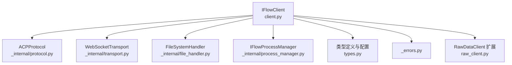
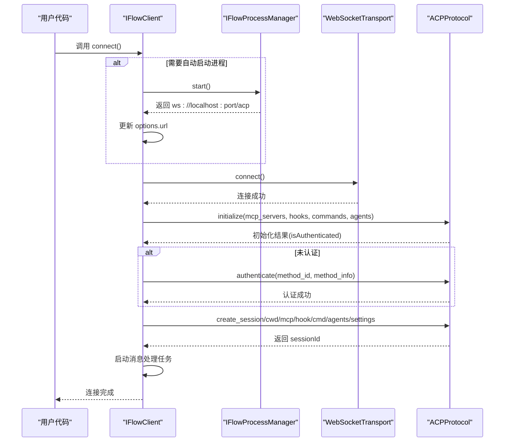
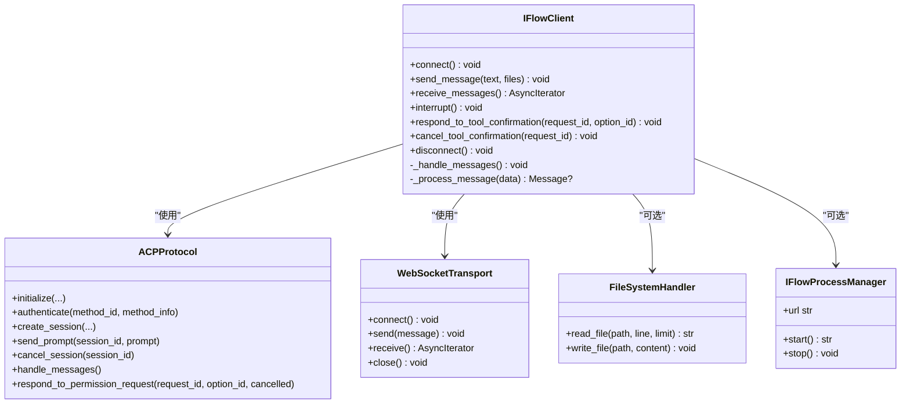

# IFlowClient

<cite>
**本文引用的文件列表**
- [client.py](file://client.py)
- [protocol.py](file://_internal/protocol.py)
- [transport.py](file://_internal/transport.py)
- [file_handler.py](file://_internal/file_handler.py)
- [process_manager.py](file://_internal/process_manager.py)
- [types.py](file://types.py)
- [_errors.py](file://_errors.py)
- [raw_client.py](file://raw_client.py)
</cite>

## 目录
1. [简介](#简介)
2. [项目结构](#项目结构)
3. [核心组件](#核心组件)
4. [架构总览](#架构总览)
5. [详细组件分析](#详细组件分析)
6. [依赖关系分析](#依赖关系分析)
7. [性能考量](#性能考量)
8. [故障排查指南](#故障排查指南)
9. [结论](#结论)
10. [附录](#附录)

## 简介
本文件为 iFlow SDK 中 IFlowClient 类的详细 API 文档。内容覆盖：
- 构造函数 IFlowClient.__init__ 的参数与默认行为
- connect() 连接流程：自动进程启动、WebSocket 连接、协议初始化、认证机制、重试策略与错误处理
- send_message() 发送文本与文件（图像、音频、其他类型）的实现细节与内部机制
- receive_messages() 异步消息流处理：AssistantMessage、ToolCallMessage 等消息类型的解析与消费
- 中断与工具调用确认：interrupt()、respond_to_tool_confirmation()、cancel_tool_confirmation() 及与 ApprovalMode 的关系
- 已弃用方法 approve_tool_call()、reject_tool_call() 的迁移路径
- 最佳实践与常见问题排查

## 项目结构
IFlowClient 位于客户端层，负责高层交互；其下由协议层（ACPProtocol）、传输层（WebSocketTransport）、文件处理器（FileSystemHandler）、进程管理器（IFlowProcessManager）协同工作。

图表来源
- [client.py](file://client.py#L110-L128)
- [protocol.py](file://_internal/protocol.py#L21-L54)
- [transport.py](file://_internal/transport.py#L27-L52)
- [file_handler.py](file://_internal/file_handler.py#L16-L42)
- [process_manager.py](file://_internal/process_manager.py#L25-L57)
- [types.py](file://types.py#L996-L1065)
- [_errors.py](file://_errors.py#L10-L85)
- [raw_client.py](file://raw_client.py#L72-L119)

章节来源
- [client.py](file://client.py#L110-L128)
- [protocol.py](file://_internal/protocol.py#L21-L54)
- [transport.py](file://_internal/transport.py#L27-L52)
- [file_handler.py](file://_internal/file_handler.py#L16-L42)
- [process_manager.py](file://_internal/process_manager.py#L25-L57)
- [types.py](file://types.py#L996-L1065)
- [_errors.py](file://_errors.py#L10-L85)
- [raw_client.py](file://raw_client.py#L72-L119)

## 核心组件
- IFlowClient：面向用户的主入口，封装连接、消息收发、工具调用确认、中断控制等能力
- ACPProtocol：实现 ACP 协议握手、认证、会话创建/加载、消息分发与权限请求响应
- WebSocketTransport：WebSocket 传输层，负责连接、收发、错误处理
- FileSystemHandler：文件系统访问控制与读写
- IFlowProcessManager：自动启动/停止 iFlow 进程，端口选择与 URL 生成
- 类型与配置：IFlowOptions、ApprovalMode、消息类型、工具调用相关数据结构
- 错误体系：ConnectionError、ProtocolError、AuthenticationError、TimeoutError、JSONDecodeError 等

章节来源
- [client.py](file://client.py#L110-L128)
- [protocol.py](file://_internal/protocol.py#L21-L54)
- [transport.py](file://_internal/transport.py#L27-L52)
- [file_handler.py](file://_internal/file_handler.py#L16-L42)
- [process_manager.py](file://_internal/process_manager.py#L25-L57)
- [types.py](file://types.py#L996-L1065)
- [_errors.py](file://_errors.py#L10-L85)

## 架构总览
IFlowClient 在 connect() 中完成“自动进程启动 → WebSocket 连接 → 协议初始化 → 认证 → 创建/加载会话 → 启动消息处理任务”的完整流程；send_message() 将用户输入与文件内容打包为 ACP 协议的 prompt 内容块并发送；receive_messages() 提供异步迭代的消息流；工具调用确认通过 respond_to_tool_confirmation()/cancel_tool_confirmation() 与协议层交互；interrupt() 调用取消会话以中断生成。

图表来源
- [client.py](file://client.py#L132-L318)
- [protocol.py](file://_internal/protocol.py#L64-L171)
- [protocol.py](file://_internal/protocol.py#L176-L256)
- [protocol.py](file://_internal/protocol.py#L257-L346)
- [process_manager.py](file://_internal/process_manager.py#L152-L204)

章节来源
- [client.py](file://client.py#L132-L318)
- [protocol.py](file://_internal/protocol.py#L64-L171)
- [protocol.py](file://_internal/protocol.py#L176-L256)
- [protocol.py](file://_internal/protocol.py#L257-L346)
- [process_manager.py](file://_internal/process_manager.py#L152-L204)

## 详细组件分析

### 构造函数 IFlowClient.__init__
- 参数
  - options: IFlowOptions，若为 None 则使用默认配置
- 关键状态字段
  - _transport、_protocol、_connected、_authenticated、_message_task、_message_queue、_pending_tool_calls、_pending_requests、_session_id、_process_manager、_process_started
- 日志级别
  - 使用 options.log_level 配置日志

最佳实践
- 在构造后立即调用 async with IFlowClient(options) 或显式调用 connect() 建立连接
- 若需要文件访问，确保在 options 中启用 file_access 并设置 allowed_dirs、max_file_size、read_only

章节来源
- [client.py](file://client.py#L110-L128)
- [types.py](file://types.py#L996-L1065)

### 连接流程 connect()
- 自动进程启动
  - 当 auto_start_process 为真且 URL 指向本地默认端口时，先探测端口是否已有服务监听；若无则启动 iFlow 进程，更新 options.url 为实际端口，等待片刻后继续
- WebSocket 连接
  - 使用 WebSocketTransport.connect()，最多重试 3 次，每次指数回退
- 协议初始化与认证
  - 初始化 ACPProtocol，传入 mcp_servers、hooks、commands、agents 等配置
  - 若初始化返回未认证，则按 options.auth_method_id 与 auth_method_info 执行 authenticate
- 会话管理
  - 若提供 session_id 则 load_session，否则 create_session
  - 将 ApprovalMode 映射为 session_settings.permission_mode
- 启动消息处理
  - 创建后台任务 _handle_messages()，从协议层接收消息并入队

重试策略与错误处理
- 连接失败时进行有限次重试并指数回退
- 失败时清理资源并抛出 ConnectionError
- 认证超时抛出 TimeoutError，认证失败抛出 AuthenticationError

章节来源
- [client.py](file://client.py#L132-L318)
- [transport.py](file://_internal/transport.py#L53-L84)
- [protocol.py](file://_internal/protocol.py#L64-L171)
- [protocol.py](file://_internal/protocol.py#L176-L256)
- [process_manager.py](file://_internal/process_manager.py#L152-L204)
- [_errors.py](file://_errors.py#L25-L46)

### 发送消息 send_message()
- 输入
  - text: 文本内容
  - files: 文件路径列表（可选）
- 内容块构建
  - 文本：type="text"
  - 图像：type="image"，data 为 base64，mimeType 基于扩展名推断
  - 音频：type="audio"，data 为 base64，mimeType 基于扩展名推断
  - 其他文件：type="resource_link"，通过 file_path.absolute().as_uri() 生成 URI
- 发送
  - 调用 ACPProtocol.send_prompt(session_id, prompt)，将内容块数组发送给会话

文件处理注意事项
- 不存在或读取失败的文件会被跳过并记录警告
- 图像/音频读取采用二进制 base64 编码
- 其他文件以资源链接形式发送，不内嵌内容

章节来源
- [client.py](file://client.py#L399-L497)
- [protocol.py](file://_internal/protocol.py#L447-L477)
- [file_handler.py](file://_internal/file_handler.py#L90-L159)

### 接收消息 receive_messages()
- 行为
  - 异步迭代器，从内部队列 _message_queue 获取消息
  - 超时短轮询避免阻塞，持续直到连接关闭
- 支持的消息类型
  - AssistantMessage（文本/思考片段）
  - ToolCallMessage（工具调用开始/更新）
  - ToolResultMessage（工具调用结果）
  - PlanMessage（计划条目）
  - TaskFinishMessage（任务结束，含 stop_reason）
  - ErrorMessage（错误包装）

章节来源
- [client.py](file://client.py#L510-L528)
- [client.py](file://client.py#L640-L657)
- [client.py](file://client.py#L658-L800)
- [protocol.py](file://_internal/protocol.py#L499-L533)

### 中断 interrupt()
- 功能
  - 调用 ACPProtocol.cancel_session(session_id) 请求中断当前会话
- 异常
  - 未连接时抛出 ConnectionError

章节来源
- [client.py](file://client.py#L498-L509)
- [protocol.py](file://_internal/protocol.py#L479-L498)

### 工具调用确认 respond_to_tool_confirmation() 与 cancel_tool_confirmation()
- respond_to_tool_confirmation(request_id, option_id)
  - 用于批准工具调用，option_id 可为 "proceed_once"、"proceed_always" 等
  - 调用 ACPProtocol.respond_to_permission_request(request_id, option_id, cancelled=False)
- cancel_tool_confirmation(request_id)
  - 用于拒绝/取消工具调用
  - 调用 ACPProtocol.respond_to_permission_request(request_id, "", cancelled=True)
- ApprovalMode 关系
  - IFlowClient 会将 ApprovalMode 映射为 session_settings.permission_mode，影响 iFlow 是否触发权限请求
  - DEFAULT 模式下会收到 ToolConfirmationRequestMessage，需用户决策；AUTO_EDIT/YOLO/PLAN 模式下通常无需确认

章节来源
- [client.py](file://client.py#L529-L598)
- [protocol.py](file://_internal/protocol.py#L720-L768)
- [types.py](file://types.py#L56-L73)

### 已弃用方法 approve_tool_call() 与 reject_tool_call()
- approve_tool_call(tool_id, outcome)
  - 已弃用，建议改用 respond_to_tool_confirmation()
  - 若 tool_id 不在内部待确认集合中，抛出 ValueError
- reject_tool_call(tool_id)
  - 已弃用，建议改用 cancel_tool_confirmation()
  - 若 tool_id 不在内部待确认集合中，抛出 ValueError

迁移建议
- 从 receive_messages() 中捕获 ToolConfirmationRequestMessage，使用 respond_to_tool_confirmation()/cancel_tool_confirmation() 完成确认

章节来源
- [client.py](file://client.py#L599-L639)

### RawDataClient 与原始消息流（扩展能力）
- RawDataClient 继承自 IFlowClient，提供：
  - receive_raw_messages()：原始 WebSocket 文本/JSON 流
  - receive_dual_stream()：原始消息与解析后的消息对流
  - get_raw_history()/get_protocol_stats()：调试统计
  - send_raw()：直接发送原始数据（谨慎使用）

章节来源
- [raw_client.py](file://raw_client.py#L72-L237)
- [raw_client.py](file://raw_client.py#L238-L362)

## 依赖关系分析
- IFlowClient 依赖
  - ACPProtocol：协议握手、认证、会话、消息分发、权限请求响应
  - WebSocketTransport：连接、收发、错误处理
  - FileSystemHandler：fs/* 方法的本地实现
  - IFlowProcessManager：自动启动/停止 iFlow 进程
  - IFlowOptions/ApprovalMode/types：配置与消息类型
  - _errors：统一异常体系

图表来源
- [client.py](file://client.py#L110-L128)
- [protocol.py](file://_internal/protocol.py#L21-L54)
- [transport.py](file://_internal/transport.py#L27-L52)
- [file_handler.py](file://_internal/file_handler.py#L16-L42)
- [process_manager.py](file://_internal/process_manager.py#L25-L57)

章节来源
- [client.py](file://client.py#L110-L128)
- [protocol.py](file://_internal/protocol.py#L21-L54)
- [transport.py](file://_internal/transport.py#L27-L52)
- [file_handler.py](file://_internal/file_handler.py#L16-L42)
- [process_manager.py](file://_internal/process_manager.py#L25-L57)

## 性能考量
- 连接重试与指数回退：减少瞬时网络波动对首次连接的影响
- 消息处理队列：异步非阻塞，避免主线程阻塞
- 文件读取：二进制 base64 编码可能带来额外内存开销，建议控制文件大小与数量
- 会话设置：合理设置 permission_mode 以减少不必要的权限请求

[本节为通用指导，不涉及具体文件分析]

## 故障排查指南
- 连接失败
  - 检查 URL 是否可达，必要时启用 auto_start_process
  - 查看重试日志与异常类型（ConnectionError/TimeoutError）
- 认证失败
  - 确认 auth_method_id 与 auth_method_info 正确
  - 注意认证超时与错误响应
- 权限请求未出现
  - 检查 ApprovalMode 设置与 session_settings.permission_mode
  - 在 AUTO_EDIT/YOLO/PLAN 模式下可能不会触发权限请求
- 文件无法读取
  - 确认 FileSystemHandler 的 allowed_dirs、read_only、max_file_size 配置
  - 检查文件路径是否存在且未被拒绝

章节来源
- [client.py](file://client.py#L132-L318)
- [protocol.py](file://_internal/protocol.py#L176-L256)
- [file_handler.py](file://_internal/file_handler.py#L90-L159)
- [types.py](file://types.py#L56-L73)

## 结论
IFlowClient 提供了完整的 iFlow 交互能力：自动进程管理、稳健的连接与协议层、灵活的文件发送、丰富的消息类型支持、完善的工具调用确认与中断控制。通过合理的 IFlowOptions 配置与 ApprovalMode 设定，可在安全与自动化之间取得平衡。对于需要深度调试的场景，可借助 RawDataClient 获取原始消息流与统计信息。

[本节为总结性内容，不涉及具体文件分析]

## 附录

### API 一览（方法、参数、返回值、异常）
- IFlowClient.__init__(options: IFlowOptions = None)
  - 参数：options（可选）
  - 返回：无
  - 异常：无
- IFlowClient.connect() -> None
  - 参数：无
  - 返回：无
  - 异常：ConnectionError、ProtocolError
- IFlowClient.disconnect() -> None
  - 参数：无
  - 返回：无
  - 异常：无
- IFlowClient.send_message(text: str, files: List[str|Path] = None) -> None
  - 参数：text、files
  - 返回：无
  - 异常：ConnectionError、ProtocolError
- IFlowClient.receive_messages() -> AsyncIterator[Message]
  - 参数：无
  - 返回：异步迭代器
  - 异常：ConnectionError
- IFlowClient.interrupt() -> None
  - 参数：无
  - 返回：无
  - 异常：ConnectionError
- IFlowClient.respond_to_tool_confirmation(request_id: int, option_id: str) -> None
  - 参数：request_id、option_id
  - 返回：无
  - 异常：ConnectionError、ProtocolError
- IFlowClient.cancel_tool_confirmation(request_id: int) -> None
  - 参数：request_id
  - 返回：无
  - 异常：ConnectionError、ProtocolError
- 已弃用：approve_tool_call(tool_id: str, outcome: ToolCallConfirmationOutcome = ...) -> None
  - 迁移：使用 respond_to_tool_confirmation()
- 已弃用：reject_tool_call(tool_id: str) -> None
  - 迁移：使用 cancel_tool_confirmation()

章节来源
- [client.py](file://client.py#L110-L128)
- [client.py](file://client.py#L132-L318)
- [client.py](file://client.py#L399-L497)
- [client.py](file://client.py#L510-L528)
- [client.py](file://client.py#L498-L509)
- [client.py](file://client.py#L529-L598)
- [client.py](file://client.py#L599-L639)