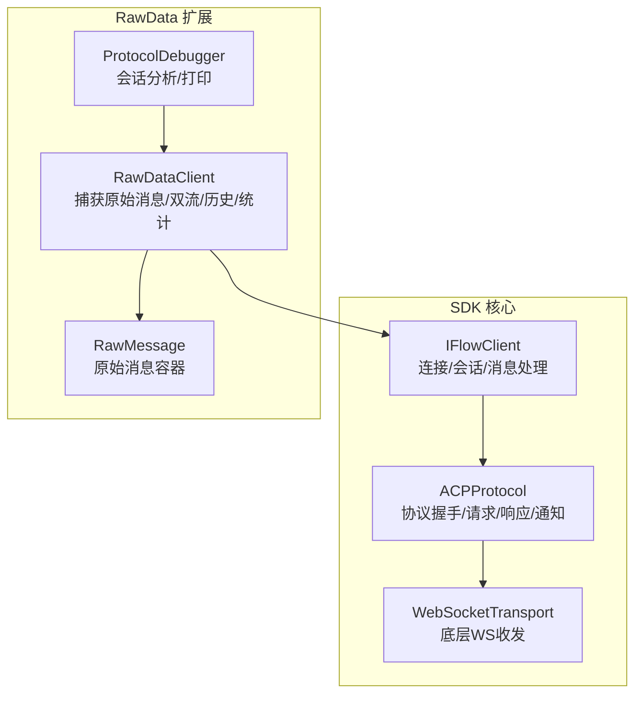
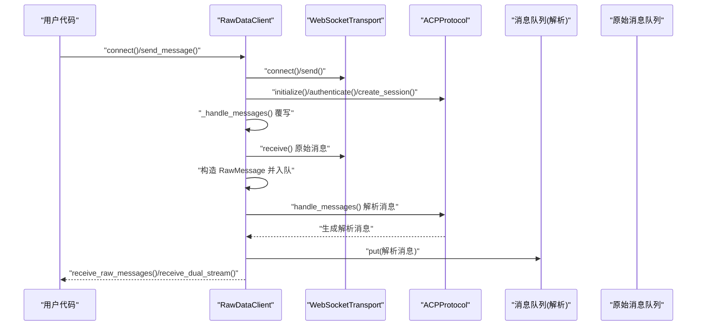
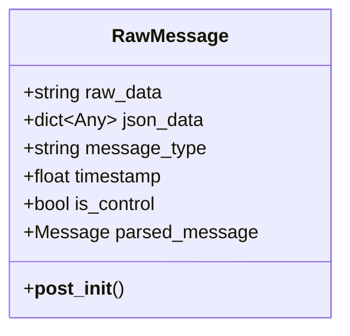
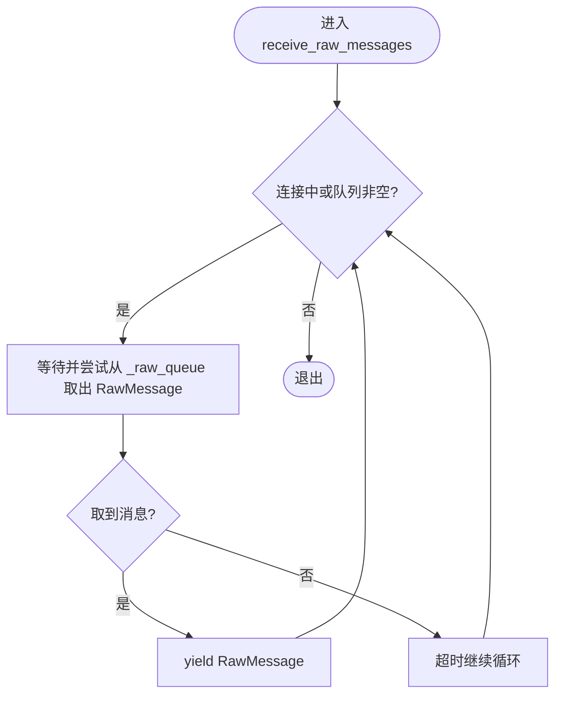
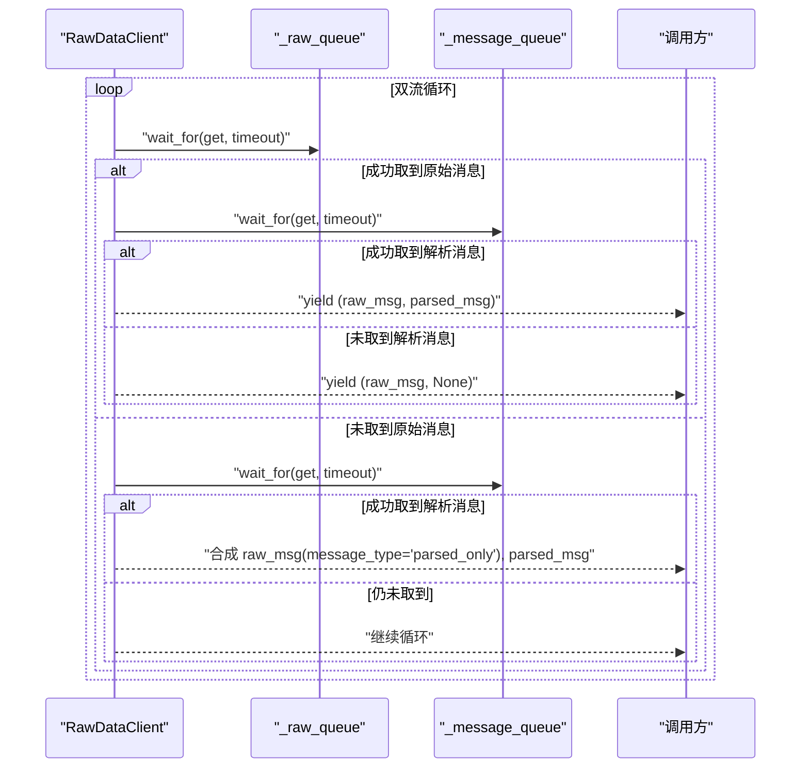
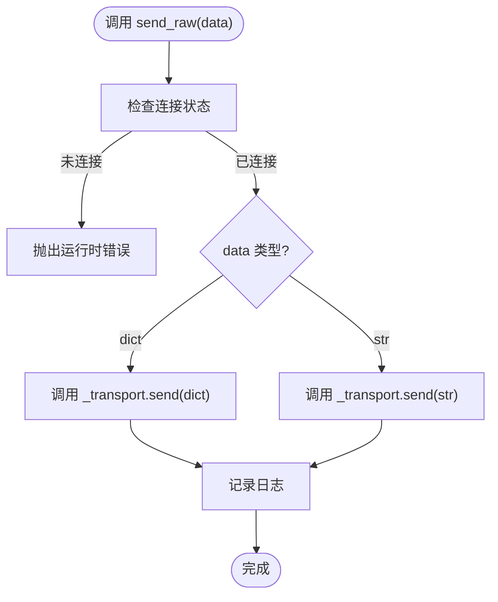
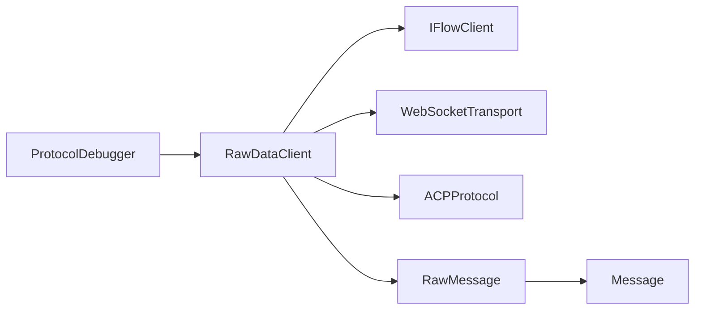

# RawDataClient

<cite>
**本文引用的文件**
- [raw_client.py](file://raw_client.py)
- [client.py](file://client.py)
- [protocol.py](file://_internal/protocol.py)
- [transport.py](file://_internal/transport.py)
- [types.py](file://types.py)
</cite>

## 目录
1. [简介](#简介)
2. [项目结构](#项目结构)
3. [核心组件](#核心组件)
4. [架构总览](#架构总览)
5. [详细组件分析](#详细组件分析)
6. [依赖关系分析](#依赖关系分析)
7. [性能考量](#性能考量)
8. [故障排查指南](#故障排查指南)
9. [结论](#结论)
10. [附录](#附录)

## 简介
本文件为 iflow_sdk 中的 RawDataClient 类提供详细的 API 文档。该类继承自 IFlowClient，并扩展了对原始 WebSocket 消息流的访问能力，使高级用户能够在协议层进行调试与分析。文档将重点说明：
- 构造函数中 capture_raw 参数的作用与使用场景
- receive_raw_messages() 如何提供原始 WebSocket 消息流及 RawMessage 的结构
- receive_dual_stream() 如何同时提供原始消息与解析后的消息元组，及其在调试与协议分析中的应用
- get_raw_history() 获取完整原始消息历史记录
- get_protocol_stats() 提供的协议统计信息（消息类型分布、错误计数等）
- send_raw() 方法的危险性：绕过协议验证直接发送原始数据，仅用于高级调试场景

## 项目结构
RawDataClient 位于模块顶层，与 IFlowClient、ACP 协议与 WebSocket 传输层紧密协作，形成“客户端扩展 + 原始消息捕获 + 双流输出 + 统计分析”的能力闭环。

图表来源
- [raw_client.py](file://raw_client.py#L72-L292)
- [client.py](file://client.py#L39-L120)
- [_internal/protocol.py](file://_internal/protocol.py#L21-L786)
- [_internal/transport.py](file://_internal/transport.py#L27-L177)

章节来源
- [raw_client.py](file://raw_client.py#L72-L120)
- [client.py](file://client.py#L39-L120)

## 核心组件
- RawDataClient：扩展 IFlowClient，提供原始消息捕获、双流输出、历史与统计能力
- RawMessage：封装原始消息的容器，包含原始文本、解析后的 JSON、消息类型、时间戳、是否控制消息、以及可选的解析后消息
- ProtocolDebugger：辅助工具，用于打印消息摘要、分析会话统计与时间线

章节来源
- [raw_client.py](file://raw_client.py#L21-L71)
- [raw_client.py](file://raw_client.py#L72-L120)
- [raw_client.py](file://raw_client.py#L293-L362)

## 架构总览
RawDataClient 在 IFlowClient 的基础上重写消息处理流程，通过直接访问 WebSocketTransport 来捕获原始消息，同时保留标准的协议解析流程，从而实现“原始 + 解析”双通道输出。

图表来源
- [raw_client.py](file://raw_client.py#L120-L173)
- [raw_client.py](file://raw_client.py#L143-L173)
- [_internal/protocol.py](file://_internal/protocol.py#L499-L533)
- [_internal/transport.py](file://_internal/transport.py#L114-L139)

## 详细组件分析

### RawDataClient 类
- 继承关系：RawDataClient 继承自 IFlowClient
- 关键字段
  - capture_raw：布尔标志，决定是否捕获原始消息
  - _raw_queue：异步队列，存放 RawMessage
  - _raw_history：列表，按顺序保存收到的所有 RawMessage
- 关键方法
  - __init__(options, capture_raw)
  - _handle_messages()：覆写 IFlowClient 的消息处理，开启原始消息捕获与解析消息处理两个并发任务
  - _capture_raw_stream()：从 WebSocketTransport 接收原始消息，构造 RawMessage，入队并追加到历史
  - _handle_parsed_stream()：从 ACPProtocol.handle_messages() 接收解析消息，经 IFlowClient._process_message() 处理后入解析消息队列
  - receive_raw_messages()：异步迭代器，从原始队列取出 RawMessage
  - receive_dual_stream()：异步迭代器，将原始消息与解析消息进行相关联输出，支持解析消息缺失时的合成原始消息
  - get_raw_history()：返回历史副本
  - get_protocol_stats()：统计总数、消息类型分布、控制消息、JSON 消息、文本消息、错误数量
  - send_raw(data)：绕过协议校验，直接向传输层发送字符串或字典
  - ProtocolDebugger：分析会话、打印消息摘要

章节来源
- [raw_client.py](file://raw_client.py#L108-L119)
- [raw_client.py](file://raw_client.py#L120-L173)
- [raw_client.py](file://raw_client.py#L143-L173)
- [raw_client.py](file://raw_client.py#L174-L229)
- [raw_client.py](file://raw_client.py#L230-L273)
- [raw_client.py](file://raw_client.py#L274-L291)
- [raw_client.py](file://raw_client.py#L293-L362)

#### RawMessage 数据结构
- 字段
  - raw_data：原始字符串
  - json_data：解析后的 JSON（若可解析）
  - message_type：消息类型（根据 JSON 结构推断；控制消息标记为 control）
  - timestamp：接收时间
  - is_control：是否为控制消息（以 “//” 开头）
  - parsed_message：可选的解析后消息（由 receive_dual_stream() 关联）

- 初始化逻辑
  - 自动设置 timestamp
  - 若 raw_data 以 “//” 开头，则标记为控制消息，类型为 control
  - 尝试解析 JSON，提取 method/result/error/type 作为 message_type
  - 解析失败则标记为 text

图表来源
- [raw_client.py](file://raw_client.py#L21-L71)

章节来源
- [raw_client.py](file://raw_client.py#L21-L71)

#### 构造函数与 capture_raw 参数
- __init__(options, capture_raw)
  - options：配置项（透传给父类）
  - capture_raw：默认 True，表示启用原始消息捕获；若设为 False，则回退到标准 IFlowClient 的消息处理路径
- 使用场景
  - 需要查看原始 JSON 或控制消息时
  - 进行协议调试、消息类型归因、错误定位
  - 需要对比原始消息与解析消息的一致性

章节来源
- [raw_client.py](file://raw_client.py#L108-L119)

#### receive_raw_messages()：原始消息流
- 行为
  - 在连接中或队列非空时持续消费 _raw_queue
  - 使用超时轮询避免阻塞
- 返回
  - 异步迭代器，逐个产出 RawMessage
- 典型用法
  - 遍历原始消息，打印原始文本与解析后的 JSON
  - 用于协议分析与问题复现

图表来源
- [raw_client.py](file://raw_client.py#L174-L186)

章节来源
- [raw_client.py](file://raw_client.py#L174-L186)

#### receive_dual_stream()：原始 + 解析双流
- 行为
  - 同时从 _raw_queue 和解析消息队列 _message_queue 拉取消息
  - 优先关联最近的原始消息与其对应的解析消息
  - 若解析消息先到，会构造一个特殊类型的合成原始消息（message_type 为 parsed_only）以保持双流一致性
- 返回
  - 异步迭代器，逐个产出 (RawMessage, Optional[Message]) 元组
- 应用
  - 协议调试：核对原始 JSON 与解析消息的对应关系
  - 错误定位：当解析消息为空时，检查原始消息的类型与内容
  - 事件追踪：结合时间戳与消息类型，构建交互时间线

图表来源
- [raw_client.py](file://raw_client.py#L187-L229)

章节来源
- [raw_client.py](file://raw_client.py#L187-L229)

#### get_raw_history()：原始历史记录
- 行为
  - 返回内部 _raw_history 的副本，保证外部不修改内部状态
- 用途
  - 会话回顾、离线分析、导出原始消息集

章节来源
- [raw_client.py](file://raw_client.py#L230-L237)

#### get_protocol_stats()：协议统计
- 统计内容
  - total_messages：消息总数
  - message_types：按消息类型计数（如 method:xxx、response、control、text 等）
  - control_messages：控制消息数量
  - json_messages：可解析为 JSON 的消息数量
  - text_messages：非控制且不可解析为 JSON 的文本消息数量
  - errors：JSON 中包含 error 字段的消息数量
- 用途
  - 快速评估协议健康度、识别异常消息类型、定位错误发生频率

章节来源
- [raw_client.py](file://raw_client.py#L238-L273)

#### send_raw()：危险的原始发送
- 行为
  - 直接调用 WebSocketTransport.send() 发送字符串或字典
  - 不经过 ACPProtocol 的校验与序列化流程
- 危险性
  - 可能破坏协议一致性，导致 iFlow 无法正确解析或产生未定义行为
  - 不符合 JSON-RPC 规范时，可能引发错误或异常
- 使用建议
  - 仅在高级调试场景使用，例如模拟特定控制消息、测试边界条件
  - 发送前应确保格式正确、时机恰当

图表来源
- [raw_client.py](file://raw_client.py#L274-L291)
- [_internal/transport.py](file://_internal/transport.py#L85-L113)

章节来源
- [raw_client.py](file://raw_client.py#L274-L291)
- [_internal/transport.py](file://_internal/transport.py#L85-L113)

#### ProtocolDebugger：会话分析与消息打印
- 功能
  - print_message(msg, verbose)：打印消息的时间戳、类型、是否控制消息、JSON 摘要或完整内容
  - analyze_session()：打印统计、消息类型分布、时间线前若干条
- 适用场景
  - 快速审阅一次会话的整体情况
  - 对比原始消息与解析消息的差异

章节来源
- [raw_client.py](file://raw_client.py#L293-L362)

## 依赖关系分析
- RawDataClient 依赖 IFlowClient 的连接与会话管理
- RawDataClient 通过 WebSocketTransport 直接接收原始消息
- RawDataClient 通过 ACPProtocol.handle_messages() 接收解析消息
- RawMessage 依赖 types.Message 作为 parsed_message 的类型标注
- ProtocolDebugger 依赖 RawDataClient 的历史与统计接口

图表来源
- [raw_client.py](file://raw_client.py#L72-L120)
- [client.py](file://client.py#L39-L120)
- [_internal/transport.py](file://_internal/transport.py#L27-L177)
- [_internal/protocol.py](file://_internal/protocol.py#L499-L533)
- [types.py](file://types.py#L455-L688)

章节来源
- [raw_client.py](file://raw_client.py#L72-L120)
- [client.py](file://client.py#L39-L120)
- [_internal/protocol.py](file://_internal/protocol.py#L499-L533)
- [_internal/transport.py](file://_internal/transport.py#L27-L177)
- [types.py](file://types.py#L455-L688)

## 性能考量
- 并发处理
  - _handle_messages() 同时启动原始消息捕获与解析消息处理两个任务，避免阻塞
- 队列与内存
  - _raw_queue 与 _message_queue 采用异步队列，避免阻塞 IO
  - _raw_history 会累积所有原始消息，长时间会占用内存；建议在长会话中定期清理或导出
- 超时策略
  - receive_raw_messages() 与 receive_dual_stream() 使用短超时轮询，降低阻塞风险
- JSON 解析
  - RawMessage 在构造时尝试解析 JSON，解析失败则标记为 text；避免重复解析

[本节为通用指导，无需列出具体文件来源]

## 故障排查指南
- 无法获取原始消息
  - 检查 capture_raw 是否为 True
  - 确认连接成功且 WebSocketTransport 已建立
- receive_dual_stream() 输出为空
  - 可能解析消息尚未到达；等待一段时间或检查协议层是否正常产生解析消息
  - 若解析消息缺失，会生成 message_type 为 parsed_only 的合成原始消息
- send_raw() 导致异常
  - 确保发送的是合法 JSON-RPC 或控制消息格式
  - 避免在不合适的时机发送，以免破坏协议状态
- 统计结果异常
  - 检查是否存在大量 text 消息（非 JSON），这会提升 text_messages 计数
  - 错误计数仅统计包含 error 字段的 JSON 消息

章节来源
- [raw_client.py](file://raw_client.py#L120-L173)
- [raw_client.py](file://raw_client.py#L174-L229)
- [raw_client.py](file://raw_client.py#L238-L273)
- [raw_client.py](file://raw_client.py#L274-L291)

## 结论
RawDataClient 为 iflow_sdk 提供了强大的协议级调试与分析能力。通过 capture_raw、receive_raw_messages、receive_dual_stream、get_raw_history、get_protocol_stats 与 send_raw，开发者可以在不改变上层业务逻辑的前提下，深入理解 iFlow 的 WebSocket 通信细节，快速定位问题并优化交互体验。使用 send_raw 时务必谨慎，仅在必要时用于高级调试。

[本节为总结性内容，无需列出具体文件来源]

## 附录
- 示例参考（请在实际代码中替换为真实路径）
  - 原始消息流示例：参见 [raw_client.py](file://raw_client.py#L81-L91)
  - 双流示例：参见 [raw_client.py](file://raw_client.py#L93-L105)
  - 历史与统计示例：参见 [raw_client.py](file://raw_client.py#L230-L273)
  - 原始发送示例：参见 [raw_client.py](file://raw_client.py#L274-L291)

[本节为指引性内容，无需列出具体文件来源]