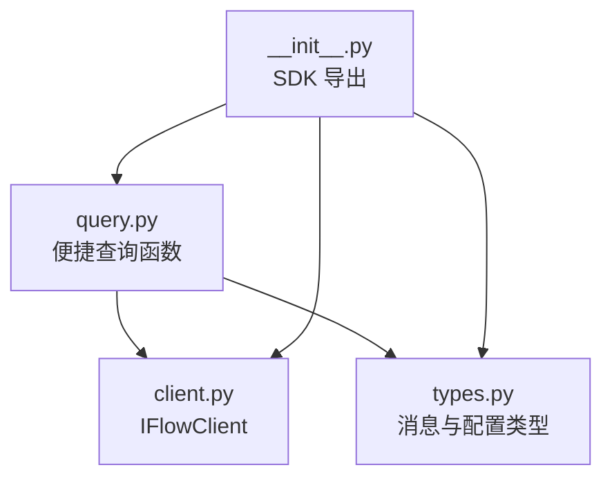
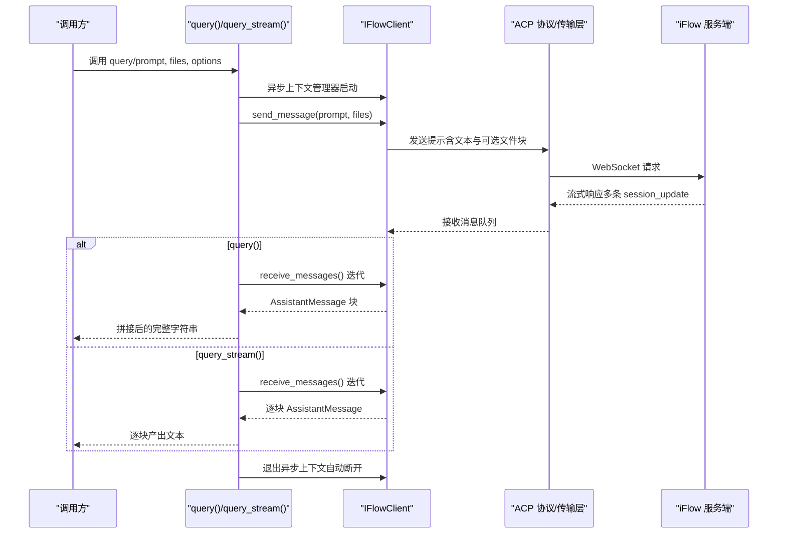
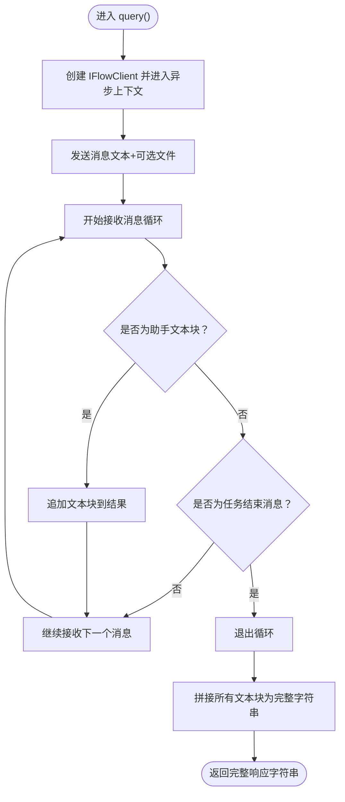
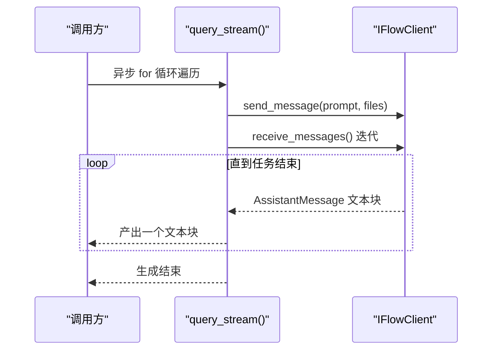
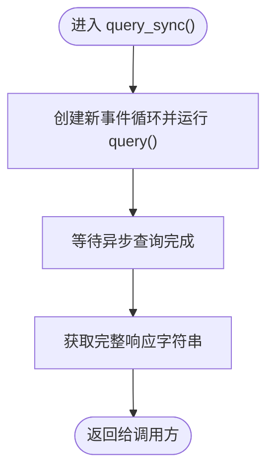
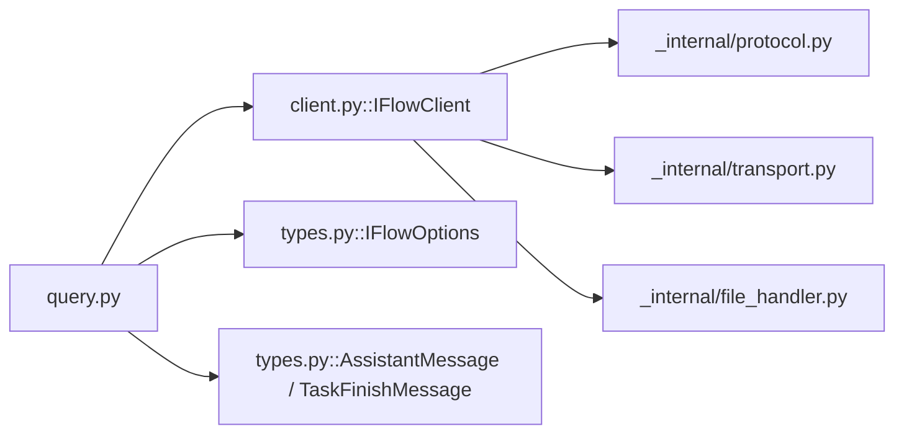

# 查询函数

<cite>
**本文引用的文件**
- [query.py](file://query.py)
- [client.py](file://client.py)
- [types.py](file://types.py)
- [__init__.py](file://__init__.py)
</cite>

## 目录
1. [简介](#简介)
2. [项目结构](#项目结构)
3. [核心组件](#核心组件)
4. [架构总览](#架构总览)
5. [详细组件分析](#详细组件分析)
6. [依赖关系分析](#依赖关系分析)
7. [性能考量](#性能考量)
8. [故障排查指南](#故障排查指南)
9. [结论](#结论)

## 简介
本文件面向 iflow_sdk 中的查询函数模块，系统性地文档化以下三个便捷函数：
- query(): 一次性查询的便捷方法，封装连接、发送消息、收集响应并断开连接，返回完整响应字符串。
- query_stream(): 异步生成器，按块流式返回响应文本，适合实时处理或边到边显示。
- query_sync(): 同步包装器，在同步代码中阻塞式调用异步查询功能，内部使用 asyncio.run()。

同时，我们将对比这些便捷函数与 IFlowClient 的差异，帮助用户在“简单查询”和“复杂交互式会话”之间做出合适选择，并提供来自源码的使用路径示例，避免直接粘贴代码内容。

## 项目结构
- query.py 提供三个顶层便捷函数，内部依赖 IFlowClient 和类型定义。
- client.py 定义 IFlowClient，负责连接、消息收发、工具调用确认、中断等完整交互能力。
- types.py 定义消息类型、配置选项（如 IFlowOptions）及枚举（如 ApprovalMode、StopReason）。
- __init__.py 将 query 模块导出为 SDK 的公共 API。

图表来源
- [query.py](file://query.py#L1-L137)
- [client.py](file://client.py#L1-L120)
- [types.py](file://types.py#L1-L120)
- [__init__.py](file://__init__.py#L20-L30)

章节来源
- [query.py](file://query.py#L1-L137)
- [client.py](file://client.py#L1-L120)
- [types.py](file://types.py#L1-L120)
- [__init__.py](file://__init__.py#L20-L30)

## 核心组件
- query(prompt, files=None, options=None) -> str
  - 功能：一次性查询，返回完整响应字符串。
  - 参数：
    - prompt: str，要发送的消息文本。
    - files: 可选，文件路径列表（支持 str 或 Path），用于附带资源。
    - options: 可选，IFlowOptions 配置对象。
  - 返回：str，完整助手响应文本。
  - 异常：ConnectionError、TimeoutError（由底层 IFlowClient 抛出并在 query 中传播）。
  - 使用场景：简单问答、批处理、无需交互的自动化脚本。
  - 示例路径：参见 query 函数注释中的示例片段路径。

- query_stream(prompt, files=None, options=None)
  - 功能：异步生成器，逐块产出响应文本，适合实时显示或边到边处理。
  - 参数：同上。
  - 产出：逐块文本（字符串），直到任务结束消息到达。
  - 使用场景：聊天界面、流式日志、实时反馈。
  - 示例路径：参见 query_stream 函数注释中的示例片段路径。

- query_sync(prompt, files=None, options=None) -> str
  - 功能：同步包装器，阻塞当前线程等待异步查询完成。
  - 参数：同上。
  - 返回：str，完整响应字符串。
  - 内部机制：通过 asyncio.run() 在新事件循环中运行 query()。
  - 使用场景：传统同步代码中需要使用便捷查询功能。
  - 示例路径：参见 query_sync 函数注释中的示例片段路径。

章节来源
- [query.py](file://query.py#L15-L137)
- [types.py](file://types.py#L996-L1065)

## 架构总览
下图展示了便捷查询函数与 IFlowClient 的协作关系，以及数据流向。

图表来源
- [query.py](file://query.py#L56-L109)
- [client.py](file://client.py#L399-L528)

## 详细组件分析

### query() 函数
- 设计要点
  - 使用异步上下文管理器确保连接生命周期可控，自动断开。
  - 先发送消息，再迭代接收消息，仅拼接 AssistantMessage 的文本块，遇到任务结束消息即停止。
  - 对文件参数进行类型与存在性检查，支持图片、音频与通用资源链接。
- 数据结构与复杂度
  - 文本拼接为 O(N) 字符串拼接，N 为响应块数；若需更高性能可考虑使用列表累积后 join。
- 错误处理
  - 底层异常（如连接失败、超时）向上抛出，调用方应捕获 ConnectionError、TimeoutError。
- 适用场景
  - 一次性问答、批处理、无状态脚本。
- 使用示例路径
  - 简单查询：参见 [query.py](file://query.py#L40-L54)
  - 附带文件：参见 [query.py](file://query.py#L45-L50)
  - 自定义选项（沙箱模式）：参见 [query.py](file://query.py#L51-L54)

图表来源
- [query.py](file://query.py#L56-L70)

章节来源
- [query.py](file://query.py#L15-L71)
- [client.py](file://client.py#L399-L528)
- [types.py](file://types.py#L481-L507)

### query_stream() 函数
- 设计要点
  - 与 query 类似，但不拼接，而是逐块产出文本，适合实时渲染或流式处理。
  - 当收到任务结束消息时停止生成。
- 适用场景
  - 实时聊天、边到边显示、流式日志。
- 使用示例路径
  - 流式输出：参见 [query.py](file://query.py#L92-L96)

图表来源
- [query.py](file://query.py#L73-L109)
- [client.py](file://client.py#L510-L528)

章节来源
- [query.py](file://query.py#L73-L109)
- [client.py](file://client.py#L510-L528)

### query_sync() 函数
- 设计要点
  - 在同步环境中运行异步查询，内部通过 asyncio.run() 创建新的事件循环执行 query()。
  - 适合传统同步代码（如 CLI 工具、批处理脚本）快速使用便捷查询。
- 注意事项
  - 若当前线程已存在事件循环，直接使用 asyncio.run() 可能引发错误；建议在独立线程或进程内调用。
- 使用示例路径
  - 同步调用：参见 [query.py](file://query.py#L129-L135)

图表来源
- [query.py](file://query.py#L111-L137)

章节来源
- [query.py](file://query.py#L111-L137)

### 与 IFlowClient 的对比与选择
- 何时使用便捷查询函数
  - 一次性、无状态、不需要交互或中断控制的场景。
  - 批量处理、自动化脚本、简单问答。
- 何时使用 IFlowClient
  - 需要双向对话、多轮交互、动态发送后续消息。
  - 需要实时流式处理、中断、工具调用确认、会话加载/保存。
  - 需要细粒度控制（如沙箱模式、权限策略、文件访问、MCP 服务器等）。
- 便捷函数与 IFlowClient 的关系
  - query/query_stream/query_sync 内部均基于 IFlowClient 实现，前者提供“开箱即用”的简化接口，后者提供“全功能”的交互式客户端。

章节来源
- [client.py](file://client.py#L39-L108)
- [query.py](file://query.py#L15-L71)

## 依赖关系分析
- query.py 依赖
  - IFlowClient：连接、发送消息、接收消息、断开连接。
  - IFlowOptions：配置连接、会话、工具调用权限、认证等。
  - AssistantMessage、TaskFinishMessage：识别响应块与结束信号。
- IFlowClient 依赖
  - ACP 协议与 WebSocket 传输层（内部模块），负责实际通信。
  - 文件系统处理器（当启用文件访问时）。
  - 多种消息类型（AssistantMessage、ToolCallMessage、PlanMessage、TaskFinishMessage、ErrorMessage 等）。

图表来源
- [query.py](file://query.py#L1-L20)
- [client.py](file://client.py#L1-L40)
- [types.py](file://types.py#L996-L1065)

章节来源
- [query.py](file://query.py#L1-L20)
- [client.py](file://client.py#L1-L40)
- [types.py](file://types.py#L996-L1065)

## 性能考量
- 文本拼接
  - query() 使用字符串拼接累积响应块，块数较多时建议使用列表累积后一次 join，减少中间字符串对象数量。
- 事件循环
  - query_sync() 通过 asyncio.run() 创建新事件循环，频繁调用可能带来额外开销；在高并发或长驻进程中建议复用事件循环或直接使用 query/query_stream。
- I/O 与网络
  - query_stream() 更适合实时场景，避免一次性等待全部响应；对延迟敏感的应用优先考虑流式接口。
- 文件处理
  - 附带文件时，图片/音频会被编码为 base64，可能增加传输体积；仅在必要时附带大文件。

## 故障排查指南
- 常见异常
  - ConnectionError：连接失败（网络、URL 不可达、iFlow 未启动等）。
  - TimeoutError：请求超时（网络慢、服务忙、超时设置过短）。
  - ProtocolError：协议初始化或认证失败（配置错误、版本不兼容）。
- 定位建议
  - 检查 IFlowOptions.url、认证信息、超时设置。
  - 确认 iFlow 是否正常运行，或启用 auto_start_process 让 SDK 自动启动。
  - 在同步环境中使用 query_sync() 时，确保当前线程没有正在运行的事件循环。
- 相关类型与配置
  - IFlowOptions：连接地址、工作目录、MCP 服务器、钩子、命令、代理、会话设置、审批模式、文件访问、自动启动、认证方式等。
  - ApprovalMode：控制工具调用权限策略（默认请求确认、自动编辑、YOLO、只读计划）。
  - StopReason：提示回合结束原因（正常结束、达到最大 token、拒绝、取消）。

章节来源
- [client.py](file://client.py#L132-L322)
- [types.py](file://types.py#L996-L1065)
- [types.py](file://types.py#L56-L73)
- [types.py](file://types.py#L85-L92)

## 结论
- query()/query_stream()/query_sync() 提供了从简单到流式的三种便捷查询方式，覆盖大多数“一次性、无状态”的使用场景。
- 当需要多轮交互、实时流式处理、工具调用确认、会话管理或细粒度控制时，请直接使用 IFlowClient。
- 通过合理选择查询函数与 IFlowClient，可以在易用性与灵活性之间取得平衡，满足从自动化脚本到复杂应用的多样化需求。