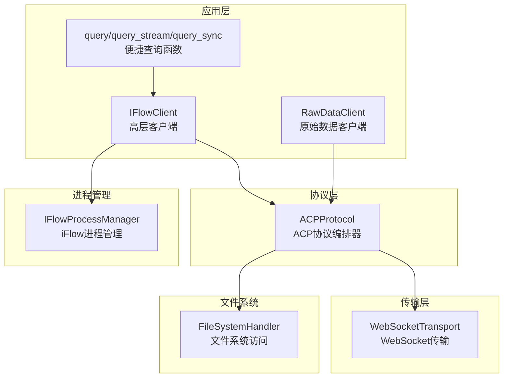
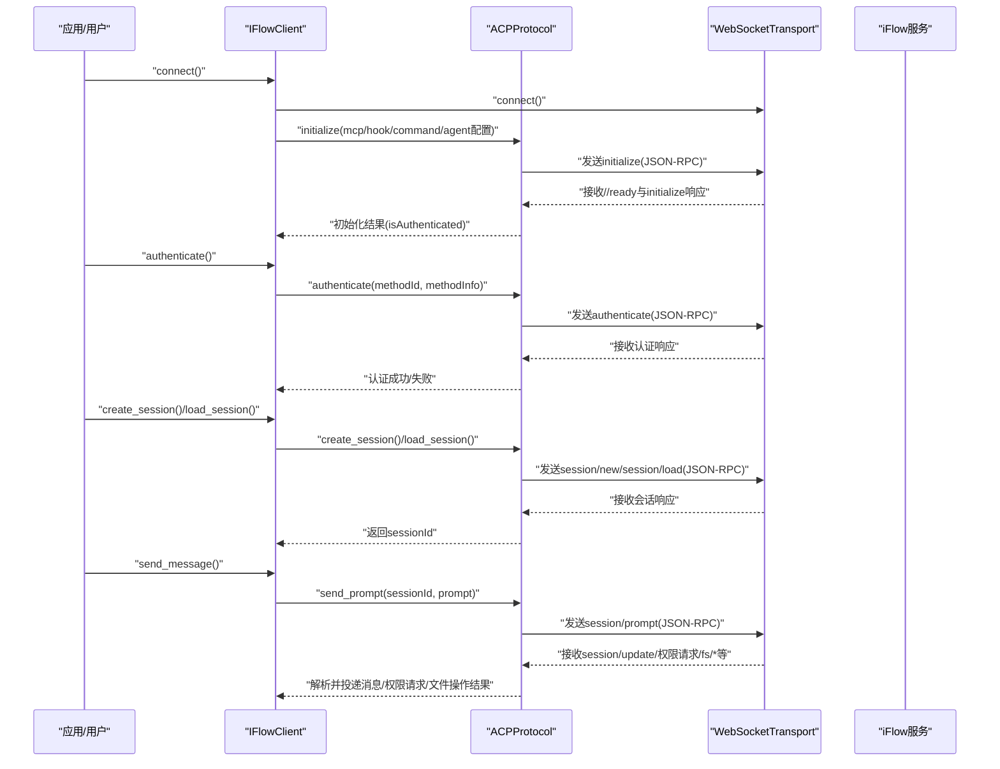
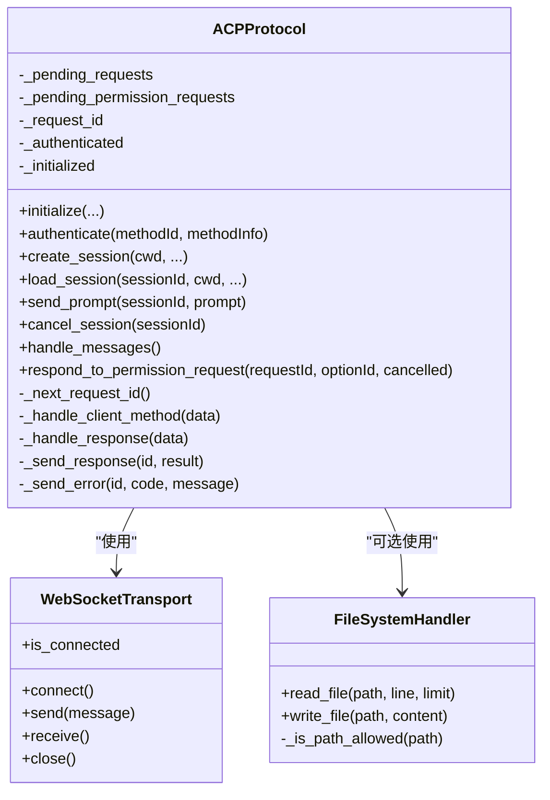
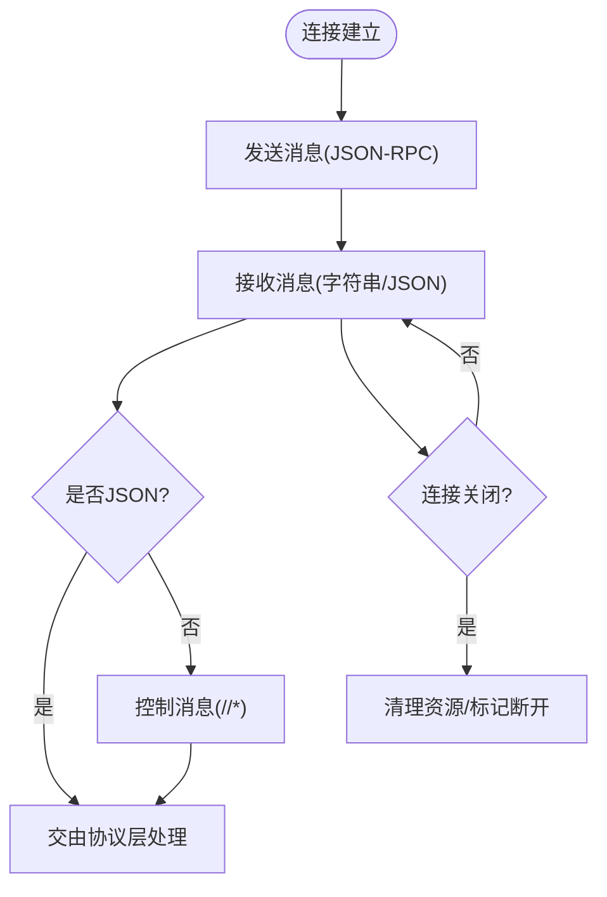
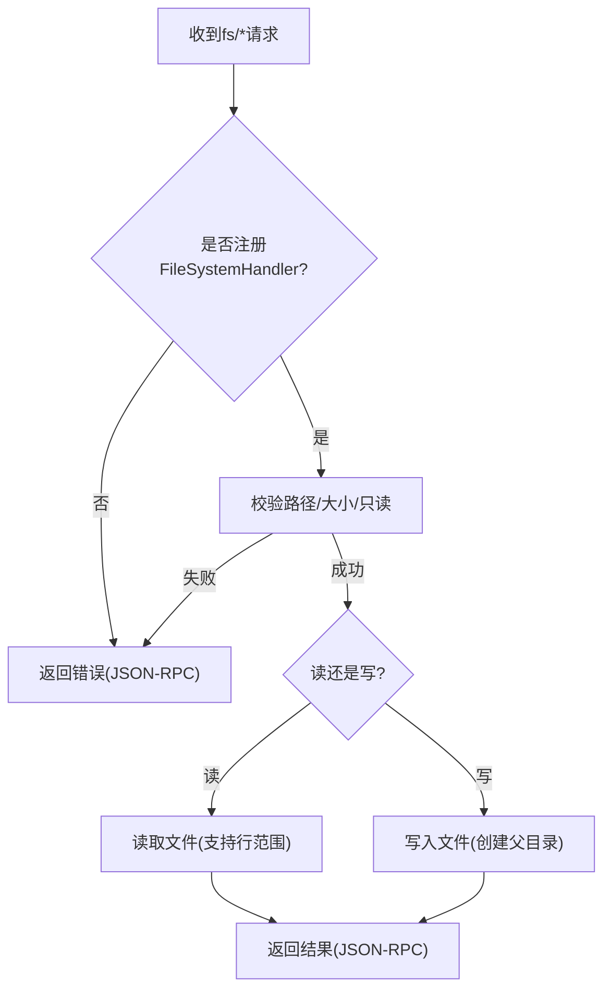
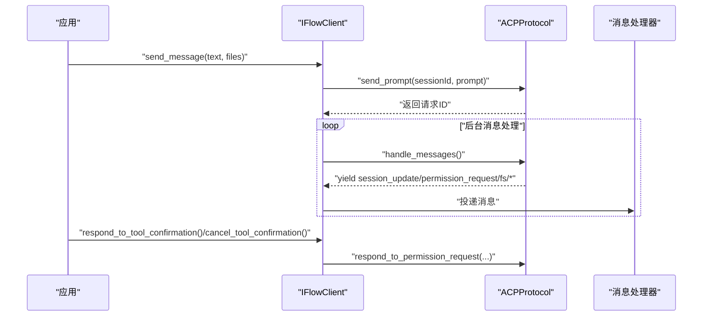
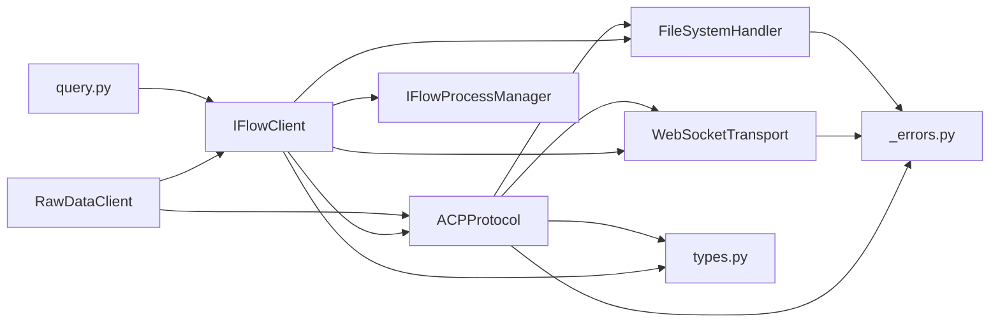

# ACP协议

<cite>
**本文引用的文件**
- [protocol.py](file://_internal/protocol.py)
- [transport.py](file://_internal/transport.py)
- [file_handler.py](file://_internal/file_handler.py)
- [client.py](file://client.py)
- [raw_client.py](file://raw_client.py)
- [process_manager.py](file://_internal/process_manager.py)
- [_errors.py](file://_errors.py)
- [types.py](file://types.py)
- [query.py](file://query.py)
- [__init__.py](file://__init__.py)
</cite>

## 目录
1. [简介](#简介)
2. [项目结构](#项目结构)
3. [核心组件](#核心组件)
4. [架构总览](#架构总览)
5. [详细组件分析](#详细组件分析)
6. [依赖关系分析](#依赖关系分析)
7. [性能考量](#性能考量)
8. [故障排查指南](#故障排查指南)
9. [结论](#结论)
10. [附录](#附录)

## 简介
本文件面向希望深入理解并正确使用 ACP（Agent Communication Protocol）协议的开发者，系统性阐述 iFlow SDK 中 ACP 协议的实现与集成方式。重点覆盖：
- ACPProtocol 类如何封装 Agent Communication Protocol 的逻辑，包括初始化、认证、会话管理、消息发送与权限请求处理
- 如何使用 JSON-RPC 2.0 格式化消息，并通过 WebSocketTransport 与 iFlow 服务进行双向通信
- 核心方法 initialize、authenticate、create_session、send_prompt、handle_messages 的实现细节
- 协议如何处理工具调用确认、文件系统访问请求（fs/read_text_file、fs/write_text_file）与会话更新
- 与 WebSocketTransport 和 FileSystemHandler 的交互关系，以及在 IFlowClient 中的集成方式
- 错误处理机制、请求 ID 管理、异步响应处理等技术细节

## 项目结构
SDK 采用分层设计：上层为 IFlowClient（高层客户端），中层为 ACPProtocol（协议编排器），底层为 WebSocketTransport（传输层）、FileSystemHandler（文件系统访问）、IFlowProcessManager（进程管理）等。

图表来源
- [client.py](file://client.py#L1-L120)
- [raw_client.py](file://raw_client.py#L1-L120)
- [protocol.py](file://_internal/protocol.py#L21-L786)
- [transport.py](file://_internal/transport.py#L1-L177)
- [file_handler.py](file://_internal/file_handler.py#L1-L217)
- [process_manager.py](file://_internal/process_manager.py#L1-L254)
- [query.py](file://query.py#L1-L137)

章节来源
- [__init__.py](file://__init__.py#L1-L142)
- [client.py](file://client.py#L1-L120)
- [raw_client.py](file://raw_client.py#L1-L120)
- [protocol.py](file://_internal/protocol.py#L21-L120)
- [transport.py](file://_internal/transport.py#L1-L120)
- [file_handler.py](file://_internal/file_handler.py#L1-L120)
- [process_manager.py](file://_internal/process_manager.py#L1-L120)
- [query.py](file://query.py#L1-L80)

## 核心组件
- ACPProtocol：负责 ACP 协议的握手、认证、会话生命周期、消息收发与权限请求处理；内部维护请求 ID、挂起请求队列、权限请求映射等状态。
- WebSocketTransport：提供 WebSocket 连接、发送、接收与关闭能力，统一控制消息流（以字符串或解析后的字典返回）。
- FileSystemHandler：实现 fs/read_text_file 与 fs/write_text_file 的安全访问，支持白名单目录、路径穿越防护、大小限制与只读模式。
- IFlowClient：高层客户端，封装连接、初始化、认证、会话创建、消息发送、中断、消息处理与工具调用确认等完整流程。
- RawDataClient：在 IFlowClient 基础上提供原始消息流与解析消息流的双通道输出，便于调试与高级场景。
- IFlowProcessManager：自动发现与启动本地 iFlow 进程，提供端口选择与进程生命周期管理。
- 错误体系：统一的异常基类与细分类型，便于上层捕获与处理。

章节来源
- [protocol.py](file://_internal/protocol.py#L21-L120)
- [transport.py](file://_internal/transport.py#L27-L120)
- [file_handler.py](file://_internal/file_handler.py#L16-L120)
- [client.py](file://client.py#L39-L120)
- [raw_client.py](file://raw_client.py#L72-L140)
- [process_manager.py](file://_internal/process_manager.py#L25-L120)
- [_errors.py](file://_errors.py#L1-L85)

## 架构总览
下图展示从应用到协议再到传输与文件系统的整体交互路径，以及权限请求与工具调用确认的关键流程。

图表来源
- [client.py](file://client.py#L132-L318)
- [protocol.py](file://_internal/protocol.py#L120-L210)
- [protocol.py](file://_internal/protocol.py#L257-L346)
- [protocol.py](file://_internal/protocol.py#L447-L478)
- [protocol.py](file://_internal/protocol.py#L499-L533)

章节来源
- [client.py](file://client.py#L132-L318)
- [protocol.py](file://_internal/protocol.py#L120-L210)
- [protocol.py](file://_internal/protocol.py#L257-L346)
- [protocol.py](file://_internal/protocol.py#L447-L478)
- [protocol.py](file://_internal/protocol.py#L499-L533)

## 详细组件分析

### ACPProtocol 类与协议编排
- 职责边界
  - 维护协议状态：已初始化、已认证、当前请求 ID、挂起请求映射、权限请求映射
  - 使用 JSON-RPC 2.0 封装请求与响应，严格按 id 关联请求与响应
  - 解析来自 iFlow 的通知与方法调用，转换为高层可消费的消息对象
  - 处理权限请求（requestPermission）、文件系统请求（fs/read_text_file、fs/write_text_file）、工具调用确认（pushToolCall/updateToolCall/notifyTaskFinish）
- 初始化与认证
  - initialize：等待 //ready 控制信号，随后发送 initialize 请求，携带协议版本与客户端能力声明（含 fs 能力），解析响应后设置已认证状态
  - authenticate：发送 authenticate 请求，等待响应并在超时时间内解析结果，最终标记已认证
- 会话管理
  - create_session：在已初始化且已认证前提下，发送 session/new 请求，解析响应得到 sessionId；若超时则回退为基于请求 ID 的占位标识
  - load_session：发送 session/load 请求（当前版本 iFlow 可能不支持，保留兼容）
  - cancel_session：发送 session/cancel 请求用于中断当前会话
- 消息发送与处理
  - send_prompt：构造 JSON-RPC 2.0 的 session/prompt 请求，返回请求 ID 供后续跟踪
  - handle_messages：持续监听传输层消息，区分“服务器发起的方法调用”、“对自身请求的响应”与“错误”，分别委派给内部处理器或直接产出高层消息
- 权限请求与工具调用
  - session/request_permission：当 iFlow 的 CoreToolScheduler 决定需要用户确认时，SDK 将权限请求转发给上层，同时记录 request_id 对应的 Future，待用户决策后通过 respond_to_permission_request 回传
  - pushToolCall/updateToolCall/notifyTaskFinish：生成工具调用 ID 并向 iFlow 发送确认或通知
- 文件系统访问
  - fs/read_text_file/fs/write_text_file：若注册了 FileSystemHandler，则执行安全读写；否则返回错误并发送 JSON-RPC 错误响应
- 异步响应与错误
  - _handle_response：根据 id 将响应分发到对应 Future，成功设置 result，失败抛出异常
  - _send_response/_send_error：向 iFlow 发送标准 JSON-RPC 响应/错误
  - _handle_client_error：将 iFlow 返回的错误包装为高层错误消息

图表来源
- [protocol.py](file://_internal/protocol.py#L21-L786)
- [transport.py](file://_internal/transport.py#L27-L177)
- [file_handler.py](file://_internal/file_handler.py#L16-L217)

章节来源
- [protocol.py](file://_internal/protocol.py#L21-L120)
- [protocol.py](file://_internal/protocol.py#L120-L210)
- [protocol.py](file://_internal/protocol.py#L257-L346)
- [protocol.py](file://_internal/protocol.py#L447-L478)
- [protocol.py](file://_internal/protocol.py#L499-L533)
- [protocol.py](file://_internal/protocol.py#L534-L786)

### WebSocketTransport 传输层
- 连接与断开：connect/connectivity 检查、close、上下文管理器
- 发送：将字典序列化为 JSON 字符串再发送，支持控制消息（以 // 开头）保持字符串形式
- 接收：持续从 WebSocket 接收消息，返回原始字符串或解析后的字典；对连接关闭进行优雅处理
- 错误：统一抛出 ConnectionError/TransportError/TimeoutError 等

图表来源
- [transport.py](file://_internal/transport.py#L85-L146)

章节来源
- [transport.py](file://_internal/transport.py#L27-L177)

### FileSystemHandler 文件系统访问
- 安全策略：白名单目录、绝对路径解析、路径穿越检测、文件大小限制、只读模式
- 读取：支持按行范围读取与整文件读取，编码容错处理
- 写入：在非只读模式下创建父目录并写入文本内容
- 扩展：动态增删允许目录

图表来源
- [file_handler.py](file://_internal/file_handler.py#L16-L217)
- [protocol.py](file://_internal/protocol.py#L598-L660)

章节来源
- [file_handler.py](file://_internal/file_handler.py#L16-L217)
- [protocol.py](file://_internal/protocol.py#L598-L660)

### IFlowClient 高层客户端集成
- 连接与初始化：自动启动本地 iFlow 进程（可选）、创建 WebSocketTransport 与 ACPProtocol 实例、执行 initialize 与 authenticate、创建/加载会话
- 消息发送：将文本与文件内容转换为新协议的 prompt 结构，调用 ACPProtocol.send_prompt
- 消息处理：后台任务循环调用 ACPProtocol.handle_messages，解析为高层消息对象（助手回复、工具调用、计划、完成等），投递到队列供上层消费
- 工具调用确认：提供 respond_to_tool_confirmation/cancel_tool_confirmation 两个入口，委托 ACPProtocol.respond_to_permission_request
- 断开与清理：取消后台任务、关闭传输、停止本地进程

图表来源
- [client.py](file://client.py#L399-L598)
- [client.py](file://client.py#L640-L800)
- [protocol.py](file://_internal/protocol.py#L499-L533)
- [protocol.py](file://_internal/protocol.py#L720-L768)

章节来源
- [client.py](file://client.py#L132-L318)
- [client.py](file://client.py#L399-L598)
- [client.py](file://client.py#L640-L800)

### RawDataClient 原始数据访问
- 在 IFlowClient 基础上，提供独立的原始消息流与解析消息流，支持双通道并发采集与历史记录统计
- 提供 ProtocolDebugger 辅助打印与分析会话历史

章节来源
- [raw_client.py](file://raw_client.py#L1-L120)
- [raw_client.py](file://raw_client.py#L120-L240)
- [raw_client.py](file://raw_client.py#L240-L362)

### IFlowProcessManager 自动进程管理
- 自动发现 iFlow 可执行文件、寻找可用端口、启动进程、提供 WebSocket URL
- 提供优雅与强制终止两种退出策略

章节来源
- [process_manager.py](file://_internal/process_manager.py#L25-L120)
- [process_manager.py](file://_internal/process_manager.py#L152-L210)
- [process_manager.py](file://_internal/process_manager.py#L211-L254)

### 错误处理与请求 ID 管理
- 请求 ID 管理：ACPProtocol 内部维护自增 request_id，确保每个请求唯一标识
- 挂起请求映射：_pending_requests 保存 Future，收到响应后 set_result 或 set_exception
- 权限请求映射：_pending_permission_requests 记录权限请求对应的 Future，用户确认后 resolve
- 错误类型：统一继承 IFlowError，细分 ConnectionError、ProtocolError、AuthenticationError、TimeoutError、TransportError、JSONDecodeError 等

章节来源
- [protocol.py](file://_internal/protocol.py#L45-L70)
- [protocol.py](file://_internal/protocol.py#L720-L786)
- [_errors.py](file://_errors.py#L1-L85)

## 依赖关系分析
- IFlowClient 依赖 ACPProtocol、WebSocketTransport、FileSystemHandler、IFlowProcessManager、types
- ACPProtocol 依赖 WebSocketTransport、FileSystemHandler、types、错误类型
- WebSocketTransport 依赖 websockets 库与错误类型
- FileSystemHandler 依赖路径与日志
- RawDataClient 继承 IFlowClient，扩展原始消息流
- query 函数基于 IFlowClient 提供便捷查询

图表来源
- [client.py](file://client.py#L1-L120)
- [protocol.py](file://_internal/protocol.py#L21-L120)
- [transport.py](file://_internal/transport.py#L1-L80)
- [file_handler.py](file://_internal/file_handler.py#L1-L60)
- [types.py](file://types.py#L1-L120)
- [_errors.py](file://_errors.py#L1-L85)
- [query.py](file://query.py#L1-L80)

章节来源
- [client.py](file://client.py#L1-L120)
- [protocol.py](file://_internal/protocol.py#L21-L120)
- [transport.py](file://_internal/transport.py#L1-L80)
- [file_handler.py](file://_internal/file_handler.py#L1-L60)
- [types.py](file://types.py#L1-L120)
- [_errors.py](file://_errors.py#L1-L85)
- [query.py](file://query.py#L1-L80)

## 性能考量
- 连接重试与指数退避：IFlowClient 在连接失败时进行有限次重试，避免瞬时网络波动导致的失败
- 超时控制：认证与会话创建均设置超时阈值，防止阻塞
- 流式处理：handle_messages 采用异步迭代器，边接收边处理，降低内存占用
- 大消息限制：WebSocketTransport 设置最大消息尺寸，避免内存压力
- 文件读取限制：FileSystemHandler 限制单文件大小，防止大文件读取造成阻塞

章节来源
- [client.py](file://client.py#L189-L221)
- [protocol.py](file://_internal/protocol.py#L176-L256)
- [protocol.py](file://_internal/protocol.py#L311-L345)
- [transport.py](file://_internal/transport.py#L64-L84)
- [transport.py](file://_internal/transport.py#L114-L146)
- [file_handler.py](file://_internal/file_handler.py#L16-L42)

## 故障排查指南
- 连接失败
  - 检查 URL 与端口是否可达；查看 WebSocketTransport 抛出的 ConnectionError/TimeoutError
  - 若使用自动启动，确认 IFlowProcessManager 是否成功找到可执行文件并启动
- 认证失败
  - 确认 initialize 返回 isAuthenticated=false 且 authenticate 正确调用；检查方法 ID 与方法信息
- 会话创建失败
  - 检查 create_session 前是否已完成 initialize 与 authenticate；关注超时与回退逻辑
- 权限请求未响应
  - 确认收到 permission_request 后调用 respond_to_tool_confirmation/cancel_tool_confirmation；检查 request_id 是否匹配
- 文件系统访问错误
  - 确认 FileSystemHandler 已启用且允许目录包含目标路径；检查只读模式与文件大小限制
- 原始消息调试
  - 使用 RawDataClient 的 receive_raw_messages/receive_dual_stream 获取原始 JSON 与解析消息，结合 ProtocolDebugger 分析

章节来源
- [transport.py](file://_internal/transport.py#L64-L84)
- [process_manager.py](file://_internal/process_manager.py#L152-L210)
- [protocol.py](file://_internal/protocol.py#L176-L256)
- [protocol.py](file://_internal/protocol.py#L257-L346)
- [protocol.py](file://_internal/protocol.py#L720-L768)
- [file_handler.py](file://_internal/file_handler.py#L16-L120)
- [raw_client.py](file://raw_client.py#L140-L240)

## 结论
ACPProtocol 将 iFlow 的 Agent Communication Protocol 以清晰的职责划分与严格的 JSON-RPC 2.0 规范封装起来，配合 WebSocketTransport 的可靠传输与 FileSystemHandler 的安全文件访问，构建了完整的双向通信与工具调用确认闭环。IFlowClient 在此基础上提供了简洁易用的高层接口，RawDataClient 则满足高级调试需求。通过完善的错误类型与超时/重试机制，SDK 在复杂网络环境下仍能保持稳健运行。

## 附录
- 典型工作流示例（文字描述）
  - 连接：创建 IFlowClient，自动启动本地 iFlow 进程，建立 WebSocket 连接
  - 初始化：调用 initialize，等待 //ready 并发送 initialize 请求
  - 认证：若需要则调用 authenticate
  - 会话：调用 create_session 获取 sessionId
  - 发送消息：send_message 将文本与文件转换为 prompt 并发送
  - 接收消息：receive_messages 循环消费助手回复、工具调用、计划与完成消息
  - 权限确认：当收到 ToolConfirmationRequestMessage 时，调用 respond_to_tool_confirmation 或 cancel_tool_confirmation
  - 断开：disconnect 清理资源并关闭传输

章节来源
- [client.py](file://client.py#L132-L318)
- [client.py](file://client.py#L399-L598)
- [client.py](file://client.py#L640-L800)
- [protocol.py](file://_internal/protocol.py#L499-L533)
- [protocol.py](file://_internal/protocol.py#L720-L768)