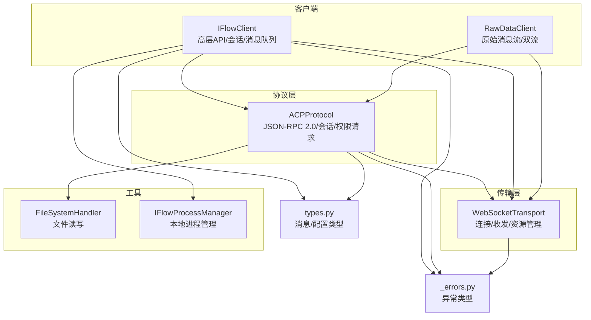
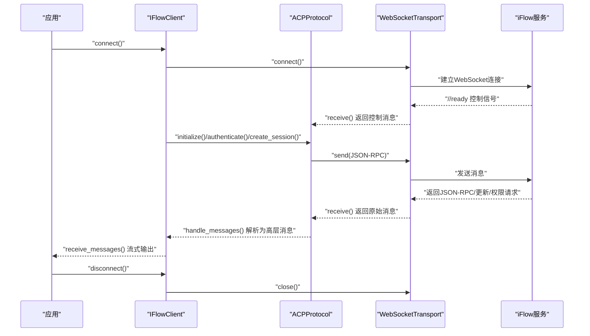
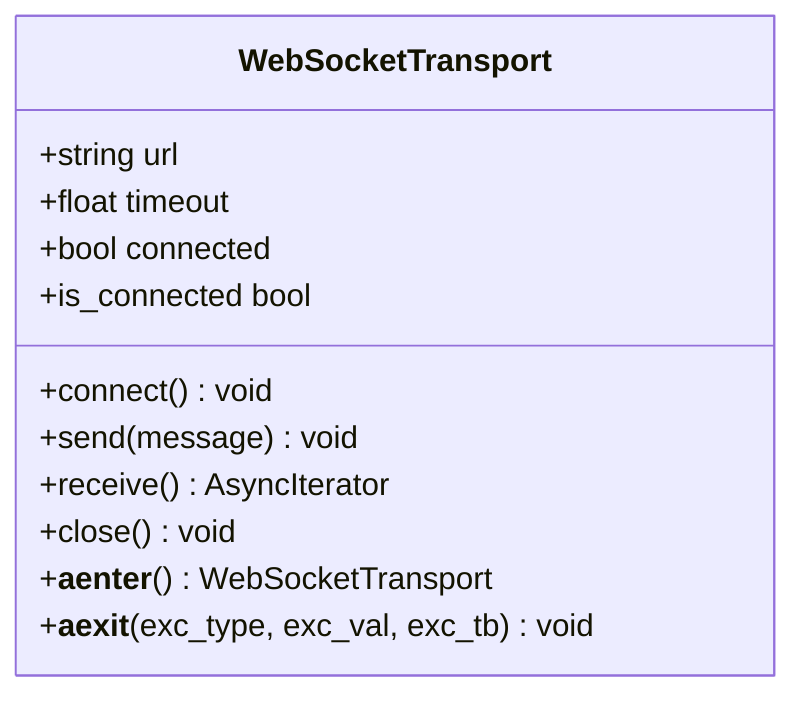
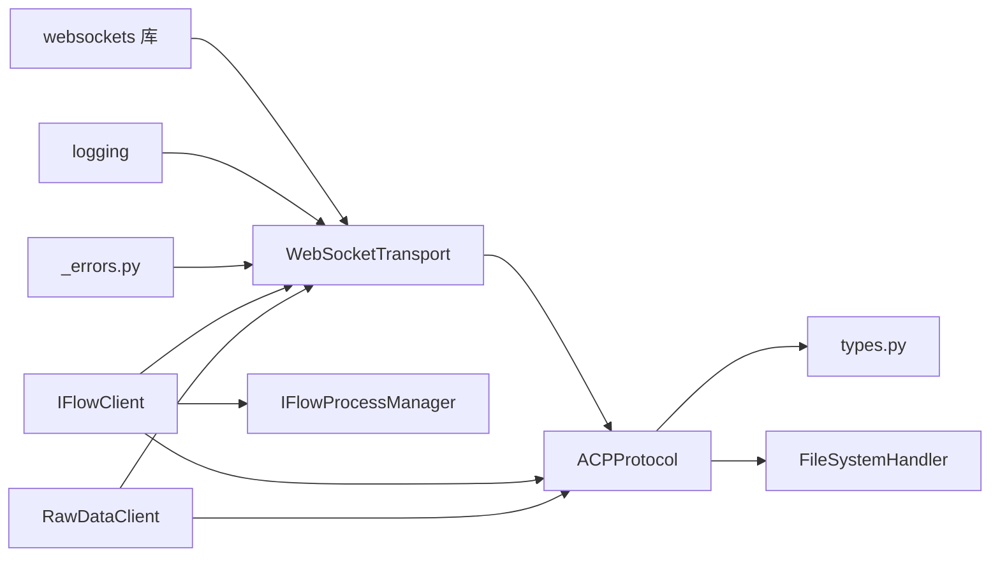

# WebSocket传输

<cite>
**本文引用的文件**
- [_internal/transport.py](file://_internal/transport.py)
- [_internal/protocol.py](file://_internal/protocol.py)
- [client.py](file://client.py)
- [raw_client.py](file://raw_client.py)
- [_errors.py](file://_errors.py)
- [_internal/file_handler.py](file://_internal/file_handler.py)
- [_internal/process_manager.py](file://_internal/process_manager.py)
- [types.py](file://types.py)
</cite>

## 目录
1. [引言](#引言)
2. [项目结构](#项目结构)
3. [核心组件](#核心组件)
4. [架构总览](#架构总览)
5. [详细组件分析](#详细组件分析)
6. [依赖关系分析](#依赖关系分析)
7. [性能考量](#性能考量)
8. [故障排查指南](#故障排查指南)
9. [结论](#结论)

## 引言
本文件聚焦于WebSocket传输层的实现，系统性阐述WebSocketTransport类如何管理与iFlow服务的WebSocket连接生命周期，覆盖连接建立、消息发送、消息接收、连接关闭；解释其如何基于websockets库进行异步I/O，处理连接超时、错误恢复与连接状态管理；说明send与receive方法的实现细节（含消息序列化、日志记录与异常处理）；解释异步上下文管理器（__aenter__与__aexit__）在资源管理中的作用；以及该组件如何为上层ACPProtocol提供可靠的通信通道，并处理网络层错误（如ConnectionClosed、WebSocketException）。同时包含连接参数配置、消息大小限制与性能考虑。

## 项目结构
- 传输层：_internal/transport.py 提供WebSocketTransport，封装底层连接、收发与资源管理。
- 协议层：_internal/protocol.py 提供ACPProtocol，基于JSON-RPC 2.0与WebSocketTransport协作完成初始化、认证、会话管理与消息处理。
- 客户端：client.py 与 raw_client.py 使用传输与协议层，提供高层API与原始数据访问能力。
- 错误体系：_errors.py 定义统一的异常类型，便于上层捕获与处理。
- 文件系统与进程管理：_internal/file_handler.py 与 _internal/process_manager.py 分别负责文件访问与本地iFlow进程启动/停止。
- 类型定义：types.py 定义消息与配置类型，支撑协议交互。

图表来源
- [_internal/transport.py](file://_internal/transport.py#L1-L177)
- [_internal/protocol.py](file://_internal/protocol.py#L1-L120)
- [client.py](file://client.py#L1-L120)
- [raw_client.py](file://raw_client.py#L1-L120)
- [_errors.py](file://_errors.py#L1-L85)
- [_internal/file_handler.py](file://_internal/file_handler.py#L1-L80)
- [_internal/process_manager.py](file://_internal/process_manager.py#L1-L80)
- [types.py](file://types.py#L1-L60)

章节来源
- [client.py](file://client.py#L1-L120)
- [raw_client.py](file://raw_client.py#L1-L120)
- [_internal/transport.py](file://_internal/transport.py#L1-L60)
- [_internal/protocol.py](file://_internal/protocol.py#L1-L60)

## 核心组件
- WebSocketTransport：低层WebSocket接口，负责连接管理、消息序列化/反序列化、错误转换与资源清理。
- ACPProtocol：基于JSON-RPC 2.0的协议编排，与WebSocketTransport配合完成初始化、认证、会话与消息分发。
- IFlowClient/RawDataClient：高层客户端，封装连接、会话、消息处理与可选的原始消息流。
- FileSystemHandler：文件系统访问代理，被ACPProtocol在需要时调用。
- IFlowProcessManager：本地iFlow进程生命周期管理，用于自动启动/停止。

章节来源
- [_internal/transport.py](file://_internal/transport.py#L27-L177)
- [_internal/protocol.py](file://_internal/protocol.py#L21-L120)
- [client.py](file://client.py#L110-L220)
- [raw_client.py](file://raw_client.py#L108-L170)
- [_internal/file_handler.py](file://_internal/file_handler.py#L16-L60)
- [_internal/process_manager.py](file://_internal/process_manager.py#L25-L80)

## 架构总览
WebSocketTransport作为最底层传输抽象，向上提供connect/send/receive/close与异步上下文管理；ACPProtocol在其之上构建JSON-RPC语义与会话控制；客户端通过ACPProtocol与Transport协同工作，形成“协议-传输-应用”的清晰分层。

图表来源
- [_internal/transport.py](file://_internal/transport.py#L53-L177)
- [_internal/protocol.py](file://_internal/protocol.py#L94-L175)
- [client.py](file://client.py#L132-L220)

## 详细组件分析

### WebSocketTransport：连接生命周期与异步I/O
- 连接建立
  - connect() 使用websockets.connect()建立WS连接，设置超时与最大消息大小限制；成功后置connected标志。
  - 超时与异常：对连接超时、WebSocketException与通用异常分别映射到TimeoutError、ConnectionError等。
- 消息发送
  - send()支持字符串或字典；字典将被json.dumps序列化后再发送；对ConnectionClosed进行状态重置并抛出ConnectionError；其他异常包装为TransportError。
- 消息接收
  - receive()为异步迭代器，持续从底层recv()读取；对ConnectionClosed进行状态重置并退出循环；其他异常记录日志并抛出TransportError。
- 关闭与资源管理
  - close()优雅关闭连接，捕获并抑制关闭过程中的异常，最终重置connected与websocket引用。
- 异步上下文管理器
  - __aenter__()委托connect()；__aexit__()委托close()，确保异常路径也能释放资源。
- 状态查询
  - is_connected属性返回连接状态与句柄有效性组合判断。

图表来源
- [_internal/transport.py](file://_internal/transport.py#L40-L177)

章节来源
- [_internal/transport.py](file://_internal/transport.py#L53-L177)

### 发送流程细节（send）
- 输入类型判定：若为字典则序列化为字符串；否则直接发送。
- 连接校验：未连接或句柄为空时抛出ConnectionError。
- 异常处理：捕获ConnectionClosed重置状态并抛出ConnectionError；其他异常包装为TransportError。
- 日志记录：对发送内容进行安全截断记录，避免日志膨胀。

章节来源
- [_internal/transport.py](file://_internal/transport.py#L85-L113)

### 接收流程细节（receive）
- 迭代消费：在connected为真时循环recv()，对收到的消息进行日志记录。
- 控制消息：以“//”开头的控制消息由上层协议层处理，传输层仅透传原始字符串。
- JSON解析：传输层不解析JSON，保持原始字符串/字典，交由上层协议层处理。
- 异常处理：ConnectionClosed触发状态重置并退出；其他异常记录日志并抛出TransportError。

章节来源
- [_internal/transport.py](file://_internal/transport.py#L114-L158)

### 连接关闭与资源回收（close）
- 仅当存在有效连接时执行关闭。
- 捕获关闭过程中的异常并记录警告，保证最终状态一致（connected=False，websocket=None）。

章节来源
- [_internal/transport.py](file://_internal/transport.py#L147-L158)

### 异步上下文管理器（__aenter__/__aexit__）
- __aenter__()：进入时自动connect()，失败时外层可捕获并处理。
- __aexit__()：退出时自动close()，确保即使发生异常也能释放资源。

章节来源
- [_internal/transport.py](file://_internal/transport.py#L159-L168)

### 与ACPProtocol的协作
- ACPProtocol通过transport.receive()获取原始消息，再进行JSON解析与协议分发。
- ACPProtocol通过transport.send()发送JSON-RPC请求，如initialize、authenticate、session/new等。
- 两者共同维护连接状态：当receive()检测到ConnectionClosed时，ACPProtocol与上层客户端均能感知并进行重连/降级处理。

章节来源
- [_internal/protocol.py](file://_internal/protocol.py#L94-L175)
- [_internal/protocol.py](file://_internal/protocol.py#L499-L533)

### 上层客户端如何利用传输层
- IFlowClient在connect()中创建WebSocketTransport实例，随后进行协议初始化与会话创建。
- RawDataClient在需要时直接使用transport.receive()获取原始消息流，实现“原始+解析”双流。

章节来源
- [client.py](file://client.py#L190-L220)
- [raw_client.py](file://raw_client.py#L120-L170)

## 依赖关系分析
- 传输层依赖
  - websockets库：提供WebSocket连接、ping/pong、最大消息大小等参数。
  - 内置logging：用于连接、收发、错误的日志记录。
  - 自定义错误类型：ConnectionError、TimeoutError、TransportError等。
- 协议层依赖
  - 传输层：ACPProtocol依赖transport.send()/receive()。
  - 文件系统：FileSystemHandler在ACPProtocol处理fs/*方法时被调用。
- 客户端依赖
  - 传输与协议：IFlowClient与RawDataClient均依赖二者。
  - 进程管理：IFlowProcessManager用于自动启动本地iFlow进程。

图表来源
- [_internal/transport.py](file://_internal/transport.py#L1-L25)
- [_errors.py](file://_errors.py#L1-L85)
- [_internal/protocol.py](file://_internal/protocol.py#L1-L20)
- [_internal/file_handler.py](file://_internal/file_handler.py#L1-L20)
- [client.py](file://client.py#L1-L40)
- [raw_client.py](file://raw_client.py#L1-L20)
- [_internal/process_manager.py](file://_internal/process_manager.py#L1-L25)

章节来源
- [_internal/transport.py](file://_internal/transport.py#L1-L25)
- [_internal/protocol.py](file://_internal/protocol.py#L1-L20)
- [_internal/file_handler.py](file://_internal/file_handler.py#L1-L20)
- [client.py](file://client.py#L1-L40)
- [raw_client.py](file://raw_client.py#L1-L20)
- [_internal/process_manager.py](file://_internal/process_manager.py#L1-L25)

## 性能考量
- 连接超时与重试
  - 传输层connect()使用超时参数，避免长时间阻塞；上层客户端在连接失败时可进行有限次重试与指数回退。
- 消息大小限制
  - 传输层在连接时设置max_size=10MB，适合大消息场景；上层应根据业务需求评估是否需要调整。
- 异步I/O与并发
  - 传输层与协议层均采用异步迭代与await模式，避免阻塞事件循环；上层客户端通过后台任务处理消息，提升吞吐。
- 日志开销
  - 传输层对发送/接收内容进行截断记录，降低日志体积；建议在生产环境适当降低日志级别。

章节来源
- [_internal/transport.py](file://_internal/transport.py#L64-L76)
- [client.py](file://client.py#L204-L221)

## 故障排查指南
- 常见异常与定位
  - 连接失败：检查URL、端口占用与防火墙；查看ConnectionError与TimeoutError的具体原因。
  - 连接中断：receive()捕获ConnectionClosed并重置状态；上层应触发重连或降级策略。
  - 发送失败：检查connected状态与消息格式；TransportError通常表示底层发送异常。
- 日志辅助
  - 传输层在连接、收发、关闭等关键节点记录日志；结合上层日志可快速定位问题。
- 诊断步骤
  - 确认iFlow服务可达且返回“//ready”控制消息。
  - 检查协议握手（initialize/initializeResponse）是否成功。
  - 若启用文件系统访问，确认FileSystemHandler的允许目录与只读配置正确。
  - 对于本地进程，确认IFlowProcessManager已成功启动并监听指定端口。

章节来源
- [_internal/transport.py](file://_internal/transport.py#L78-L113)
- [_internal/protocol.py](file://_internal/protocol.py#L94-L175)
- [_internal/file_handler.py](file://_internal/file_handler.py#L16-L60)
- [_internal/process_manager.py](file://_internal/process_manager.py#L152-L210)

## 结论
WebSocketTransport提供了稳定、可复用的WebSocket传输抽象，通过明确的连接生命周期管理、完善的异常映射与异步上下文支持，为上层ACPProtocol与客户端提供了可靠的通信基础。结合协议层的JSON-RPC编排、文件系统代理与本地进程管理，整体架构实现了从连接建立到消息流转再到资源回收的完整闭环，满足实时、可扩展的交互需求。