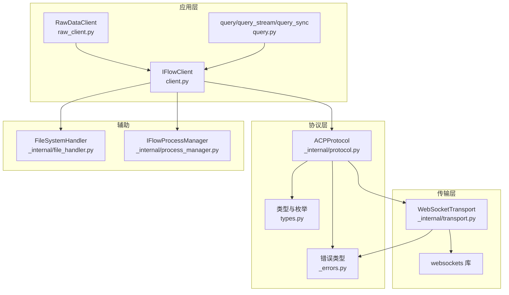
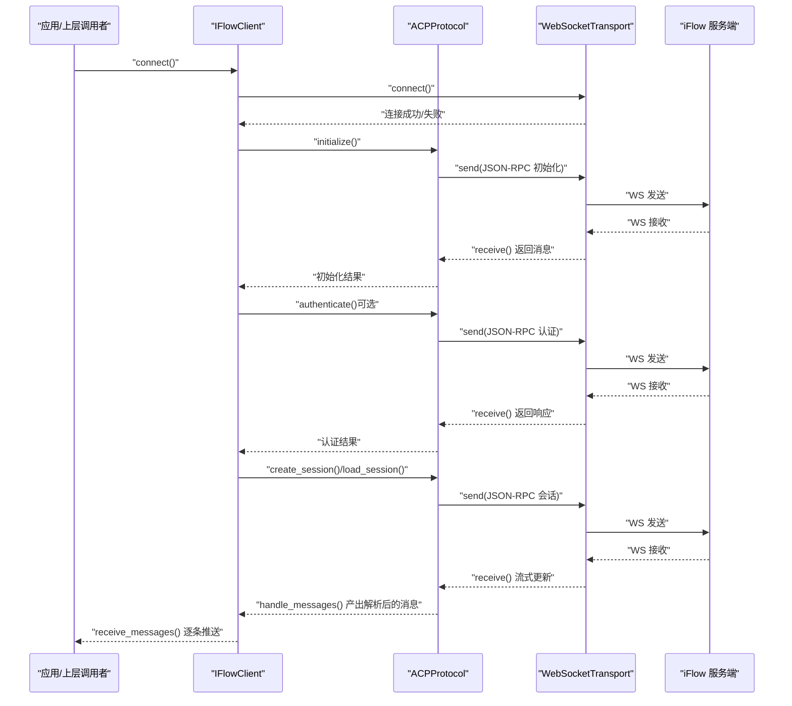
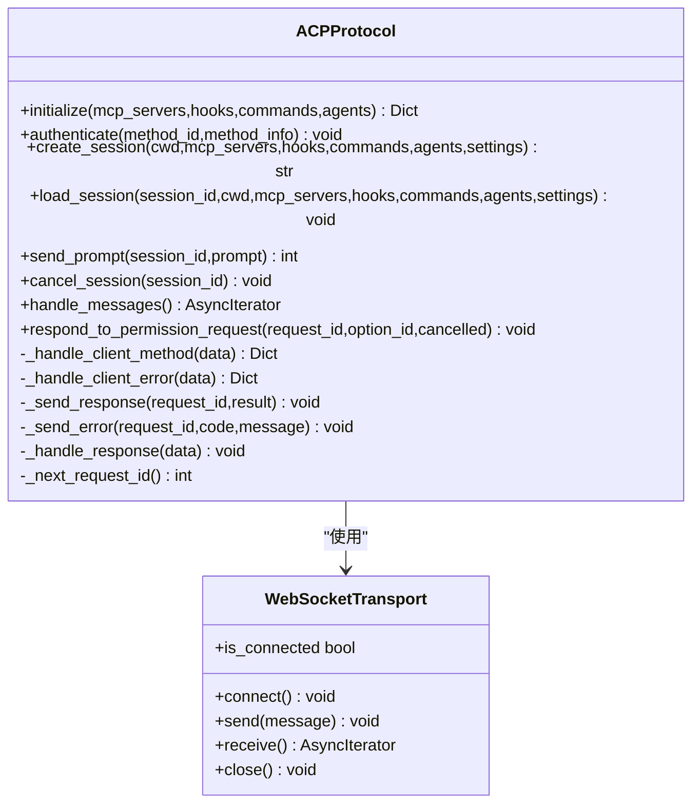
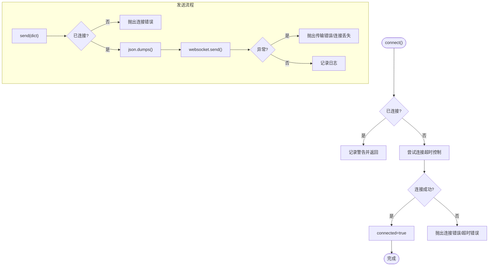
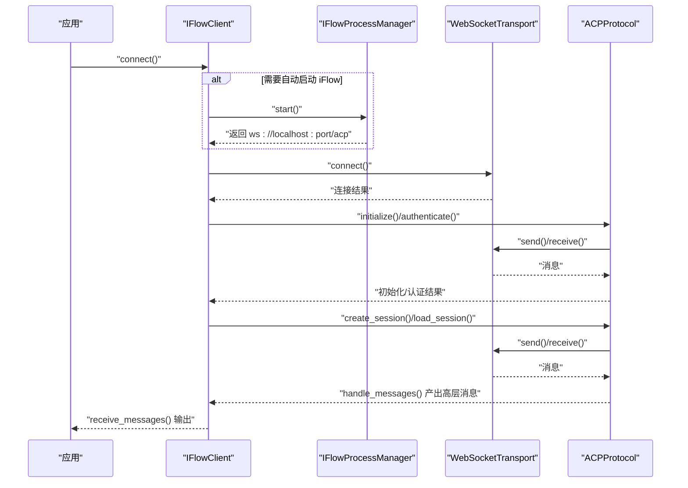
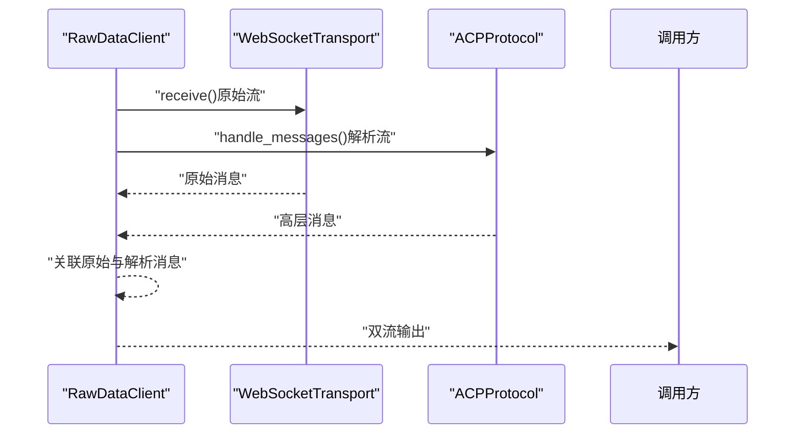
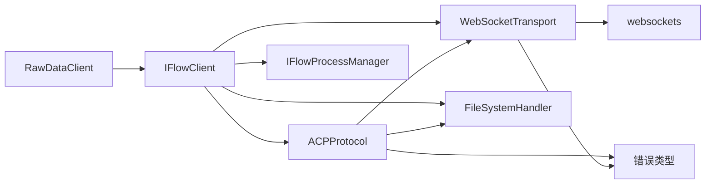

# 协议实现

<cite>
**本文引用的文件**
- [protocol.py](file://_internal/protocol.py)
- [transport.py](file://_internal/transport.py)
- [client.py](file://client.py)
- [raw_client.py](file://raw_client.py)
- [query.py](file://query.py)
- [file_handler.py](file://_internal/file_handler.py)
- [process_manager.py](file://_internal/process_manager.py)
- [_errors.py](file://_errors.py)
- [types.py](file://types.py)
</cite>

## 目录
1. [简介](#简介)
2. [项目结构](#项目结构)
3. [核心组件](#核心组件)
4. [架构总览](#架构总览)
5. [详细组件分析](#详细组件分析)
6. [依赖关系分析](#依赖关系分析)
7. [性能考量](#性能考量)
8. [故障排查指南](#故障排查指南)
9. [结论](#结论)
10. [附录](#附录)

## 简介
本文件面向 iFlow SDK 的架构文档，重点阐述 ACP（Agent Communication Protocol）协议与 WebSocket 传输层的实现方式。文档围绕以下目标展开：
- 解释 ACPProtocol 类如何封装协议逻辑、处理消息的编码与解码，并与 WebSocketTransport 协作。
- 描述 WebSocketTransport 如何管理 WebSocket 连接生命周期（连接、发送、接收、关闭）。
- 展示 IFlowClient 如何协调上述两个组件，向上层提供可靠的双向通信通道。
- 提供系统上下文图，说明从 IFlowClient 到网络层的数据流。
- 讨论实现中的技术决策（如使用 asyncio 异步 I/O）、错误处理与重试机制。

## 项目结构
SDK 采用分层设计：上层是面向用户的客户端接口（IFlowClient），中间层是协议封装（ACPProtocol），底层是传输适配（WebSocketTransport）。另有工具模块负责文件访问（FileSystemHandler）与进程管理（IFlowProcessManager），以及类型与错误定义。

图表来源
- [client.py](file://client.py#L1-L200)
- [protocol.py](file://_internal/protocol.py#L1-L120)
- [transport.py](file://_internal/transport.py#L1-L120)
- [raw_client.py](file://raw_client.py#L1-L120)
- [query.py](file://query.py#L1-L80)
- [file_handler.py](file://_internal/file_handler.py#L1-L80)
- [process_manager.py](file://_internal/process_manager.py#L1-L80)
- [_errors.py](file://_errors.py#L1-L85)
- [types.py](file://types.py#L1-L120)

章节来源
- [client.py](file://client.py#L1-L200)
- [protocol.py](file://_internal/protocol.py#L1-L120)
- [transport.py](file://_internal/transport.py#L1-L120)
- [raw_client.py](file://raw_client.py#L1-L120)
- [query.py](file://query.py#L1-L80)
- [file_handler.py](file://_internal/file_handler.py#L1-L80)
- [process_manager.py](file://_internal/process_manager.py#L1-L80)
- [_errors.py](file://_errors.py#L1-L85)
- [types.py](file://types.py#L1-L120)

## 核心组件
- ACPProtocol：实现 ACP 协议 v0.0.9，基于 JSON-RPC 2.0 的消息格式，负责初始化握手、认证、会话管理、权限请求处理、文件系统方法调用等。
- WebSocketTransport：封装 WebSocket 连接、消息收发与基本错误处理，向上层返回原始字符串或已解析 JSON。
- IFlowClient：高层客户端，负责连接建立、协议初始化与认证、会话创建、消息收发与解析、工具调用确认、中断控制等。
- RawDataClient：在 IFlowClient 基础上提供原始消息捕获与双流输出能力，便于调试与高级场景。
- FileSystemHandler：实现 fs/* 方法，受白名单目录、路径穿越防护、大小限制与只读模式约束。
- IFlowProcessManager：自动发现并启动本地 iFlow 进程，提供端口选择与优雅关停。
- 错误体系：统一异常基类与细分类型，覆盖连接、协议、认证、超时、传输、JSON 解析等。

章节来源
- [protocol.py](file://_internal/protocol.py#L1-L120)
- [transport.py](file://_internal/transport.py#L1-L120)
- [client.py](file://client.py#L1-L200)
- [raw_client.py](file://raw_client.py#L1-L120)
- [file_handler.py](file://_internal/file_handler.py#L1-L80)
- [process_manager.py](file://_internal/process_manager.py#L1-L80)
- [_errors.py](file://_errors.py#L1-L85)
- [types.py](file://types.py#L1-L120)

## 架构总览
下图展示了从 IFlowClient 到网络层的数据流与职责边界。

图表来源
- [client.py](file://client.py#L130-L320)
- [protocol.py](file://_internal/protocol.py#L120-L220)
- [transport.py](file://_internal/transport.py#L80-L160)

## 详细组件分析

### ACPProtocol 组件分析
- 职责与边界
  - 协议握手：等待 //ready 控制信号，发送 initialize 请求，解析响应，记录协议版本与认证状态。
  - 认证流程：按需发送 authenticate 请求，带超时与错误处理。
  - 会话管理：支持创建新会话与加载会话（当前服务端不支持 loadSession 时返回提示）。
  - 消息处理：对服务器下发的方法调用（client interface）进行分派与应答；对客户端请求响应进行回传；对错误进行包装。
  - 权限请求：当服务端要求用户确认工具调用时，保存待决请求并等待上层响应。
  - 文件系统方法：fs/read_text_file 与 fs/write_text_file 的调用与回传。
- 编码与解码
  - 发送：将字典序列化为 JSON 字符串后通过传输层发送。
  - 接收：原样返回字符串或字典，由协议层自行解析 JSON 并区分控制消息与 JSON-RPC 消息。
- 与 WebSocketTransport 的交互
  - 使用 transport.send() 发送 JSON-RPC 请求。
  - 使用 transport.receive() 异步迭代收到的消息，跳过控制消息，解析 JSON 后分派处理。
- 关键数据结构
  - pending_requests：用于跟踪客户端发起的请求并回填结果或异常。
  - pending_permission_requests：用于跟踪服务端发起的权限请求，等待上层响应。
  - request_id：自增请求 ID，确保请求-响应匹配。
- 错误处理
  - 对 JSON 解析失败抛出 JSONDecodeError。
  - 对认证失败抛出 AuthenticationError。
  - 对协议错误抛出 ProtocolError。
  - 对超时抛出 TimeoutError。
- 复杂度与性能
  - 单次请求往返时间取决于网络与服务端处理时间；接收侧采用异步迭代器，避免阻塞。
  - 权限请求采用 Future 等待，避免阻塞主消息循环。

图表来源
- [protocol.py](file://_internal/protocol.py#L1-L220)
- [transport.py](file://_internal/transport.py#L1-L120)

章节来源
- [protocol.py](file://_internal/protocol.py#L1-L220)
- [_errors.py](file://_errors.py#L1-L85)

### WebSocketTransport 组件分析
- 职责与边界
  - 连接管理：建立 WebSocket 连接，设置超时与错误处理。
  - 消息收发：发送前将字典序列化为 JSON；接收侧返回原始字符串或字典，交由上层解析。
  - 生命周期：提供异步上下文管理器入口与出口，确保资源释放。
- 技术细节
  - 使用 websockets 客户端库，启用大消息上限（10MB）。
  - 连接超时与异常转换为 SDK 自定义错误类型。
  - 接收循环在连接关闭时退出并置位连接状态。
- 错误处理
  - 连接失败、超时、发送失败、接收失败均转换为 ConnectionError/TransportError/TimeoutError 等。

图表来源
- [transport.py](file://_internal/transport.py#L50-L120)

章节来源
- [transport.py](file://_internal/transport.py#L1-L177)
- [_errors.py](file://_errors.py#L1-L85)

### IFlowClient 组件分析
- 职责与边界
  - 连接与初始化：自动启动本地 iFlow 进程（可选）、建立 WebSocket 连接、执行协议握手与认证、创建会话。
  - 消息编排：将用户输入转换为多内容块（文本、图片、音频、资源链接），发送到会话；接收并解析为高层消息对象。
  - 工具调用确认：转发服务端的权限请求给上层，上层决定批准或拒绝。
  - 中断控制：向会话发送取消请求。
  - 资源清理：优雅关闭传输与进程。
- 与 ACPProtocol/Transport 的协作
  - 通过 ACPProtocol 执行协议步骤，通过 WebSocketTransport 进行底层通信。
  - 在连接阶段对异常进行捕获与清理。
- 可靠性与可用性
  - 连接阶段具备有限次数的重试与指数退避。
  - 会话创建与加载具备超时保护与降级策略（如 session/load 不支持时的提示）。

图表来源
- [client.py](file://client.py#L130-L320)
- [process_manager.py](file://_internal/process_manager.py#L150-L210)
- [protocol.py](file://_internal/protocol.py#L120-L220)
- [transport.py](file://_internal/transport.py#L80-L160)

章节来源
- [client.py](file://client.py#L1-L320)
- [process_manager.py](file://_internal/process_manager.py#L1-L210)
- [protocol.py](file://_internal/protocol.py#L1-L220)
- [transport.py](file://_internal/transport.py#L1-L177)

### RawDataClient 组件分析
- 职责与边界
  - 在标准解析流之外，提供原始消息捕获与双流输出（原始 + 解析）。
  - 支持历史记录与统计分析，便于调试与审计。
- 实现要点
  - 同时运行两条任务：一条直接从传输层接收原始消息，另一条经由 ACPProtocol 解析高层消息。
  - 通过队列与超时机制保证两路流的并发与低延迟。

图表来源
- [raw_client.py](file://raw_client.py#L120-L210)
- [protocol.py](file://_internal/protocol.py#L490-L540)
- [transport.py](file://_internal/transport.py#L110-L146)

章节来源
- [raw_client.py](file://raw_client.py#L1-L210)
- [protocol.py](file://_internal/protocol.py#L490-L540)
- [transport.py](file://_internal/transport.py#L110-L146)

### 文件系统与进程管理
- FileSystemHandler
  - 白名单目录、路径穿越检测、文件大小限制、只读模式。
  - 提供 fs/read_text_file 与 fs/write_text_file 的安全实现。
- IFlowProcessManager
  - 自动发现 iFlow 可执行文件、寻找可用端口、启动进程、优雅关停。
  - 提供 URL 生成与错误信息构建。

章节来源
- [file_handler.py](file://_internal/file_handler.py#L1-L217)
- [process_manager.py](file://_internal/process_manager.py#L1-L254)

## 依赖关系分析
- 组件耦合
  - IFlowClient 依赖 ACPProtocol 与 WebSocketTransport，形成“高层客户端-协议-传输”的清晰分层。
  - ACPProtocol 依赖 WebSocketTransport 进行消息收发，依赖 FileSystemHandler 处理 fs/* 方法。
  - RawDataClient 继承 IFlowClient，扩展原始消息捕获能力。
- 外部依赖
  - websockets：WebSocket 客户端库。
  - asyncio：异步 I/O 与任务调度。
- 错误传播
  - 传输层异常转换为 SDK 错误类型，上层统一处理。

图表来源
- [client.py](file://client.py#L1-L200)
- [protocol.py](file://_internal/protocol.py#L1-L120)
- [transport.py](file://_internal/transport.py#L1-L120)
- [raw_client.py](file://raw_client.py#L1-L120)
- [file_handler.py](file://_internal/file_handler.py#L1-L80)
- [process_manager.py](file://_internal/process_manager.py#L1-L80)
- [_errors.py](file://_errors.py#L1-L85)

章节来源
- [client.py](file://client.py#L1-L200)
- [protocol.py](file://_internal/protocol.py#L1-L120)
- [transport.py](file://_internal/transport.py#L1-L120)
- [raw_client.py](file://raw_client.py#L1-L120)
- [file_handler.py](file://_internal/file_handler.py#L1-L80)
- [process_manager.py](file://_internal/process_manager.py#L1-L80)
- [_errors.py](file://_errors.py#L1-L85)

## 性能考量
- 异步 I/O 与非阻塞
  - 使用 asyncio 与异步迭代器，避免阻塞主线程，提升吞吐与响应性。
- 超时与重试
  - 认证与会话创建具有超时保护；连接阶段具备有限次数重试与指数退避，降低瞬时故障影响。
- 消息大小与序列化
  - 传输层设置较大消息上限，协议层对 JSON 进行严格解析，避免无效负载。
- 资源管理
  - 异步上下文管理器确保连接与进程的正确关闭，减少资源泄漏风险。

## 故障排查指南
- 连接失败
  - 检查 URL 是否可达、端口是否被占用；查看连接超时与异常类型。
  - 若使用自动启动，确认 iFlow 可执行文件存在且可执行。
- 认证失败
  - 确认认证参数与方法 ID 正确；检查服务端返回的错误信息。
- 会话创建/加载失败
  - 当前服务端可能不支持 loadSession，建议回退到创建新会话。
- 权限请求未响应
  - 确保上层及时调用 respond_to_tool_confirmation 或 cancel_tool_confirmation。
- 文件系统访问被拒
  - 检查允许目录列表、路径穿越防护与只读模式配置。
- 调试原始消息
  - 使用 RawDataClient 的原始消息流与统计功能，定位协议问题。

章节来源
- [client.py](file://client.py#L360-L420)
- [protocol.py](file://_internal/protocol.py#L170-L220)
- [protocol.py](file://_internal/protocol.py#L330-L360)
- [protocol.py](file://_internal/protocol.py#L560-L690)
- [file_handler.py](file://_internal/file_handler.py#L80-L160)
- [raw_client.py](file://raw_client.py#L180-L260)

## 结论
该 SDK 将 ACP 协议与 WebSocket 传输清晰分离，通过 IFlowClient 提供高层易用接口，同时保留 RawDataClient 的原始消息能力以满足调试与高级需求。协议层专注于消息编解码与业务流程，传输层专注连接与消息收发，二者通过异步 I/O 与严格的错误处理共同构成可靠、可维护的通信通道。

## 附录
- 典型使用场景
  - 交互式对话：通过 IFlowClient 发送消息并实时接收响应。
  - 简单查询：使用 query/query_stream 快速获取完整或分片响应。
  - 高级调试：使用 RawDataClient 获取原始消息与解析消息的双流输出。
- 最佳实践
  - 明确审批模式（ApprovalMode），合理配置权限请求策略。
  - 为文件访问设置白名单目录与大小限制，确保安全性。
  - 在生产环境启用连接重试与超时策略，提升鲁棒性。