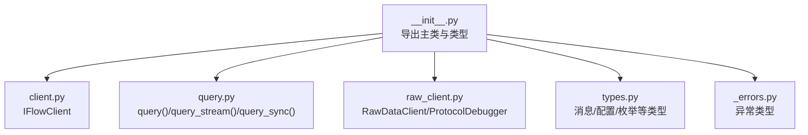
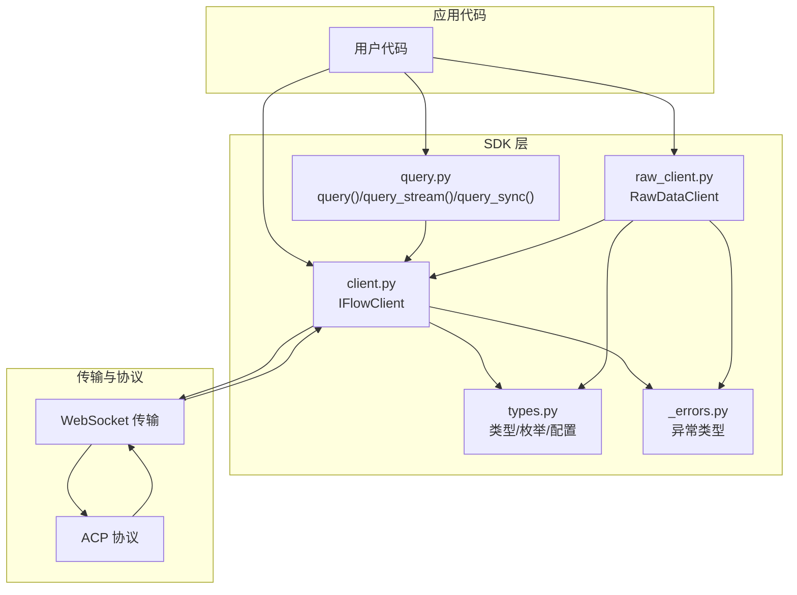
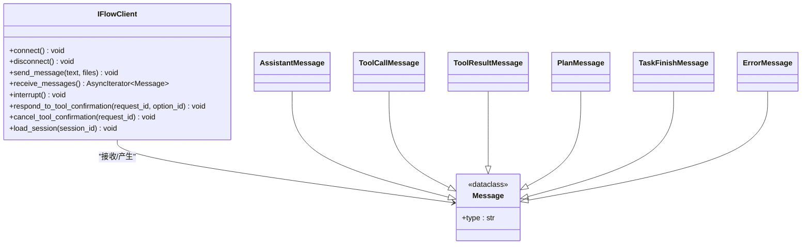
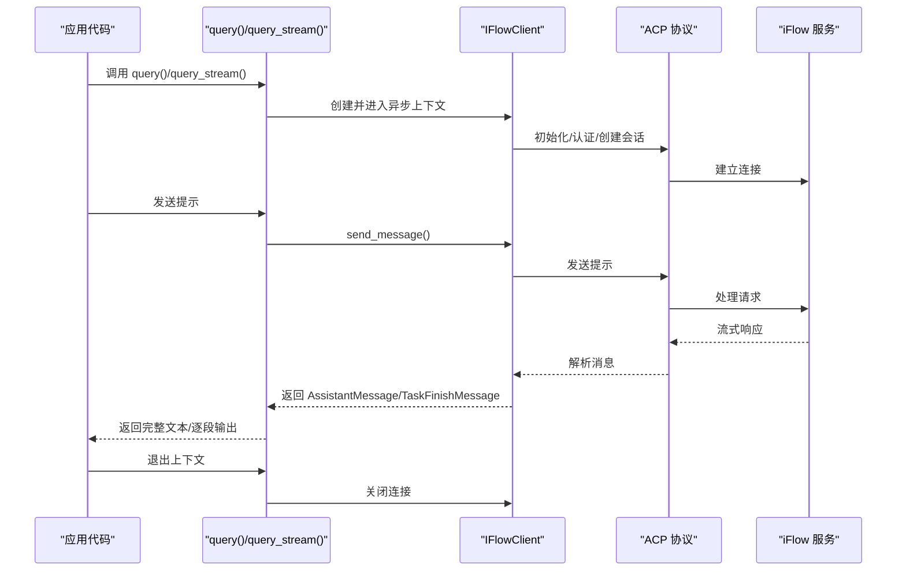
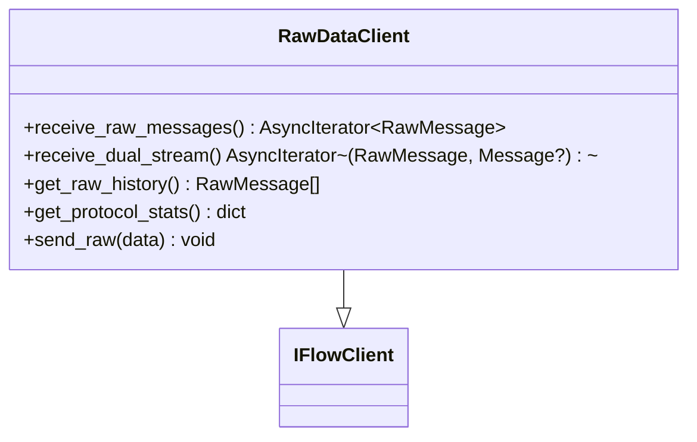
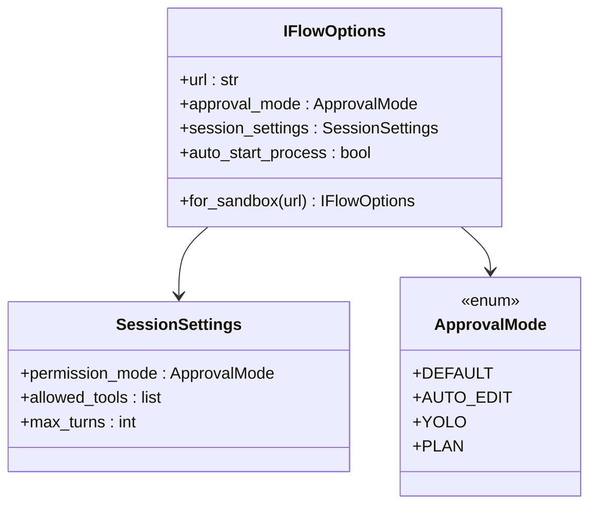
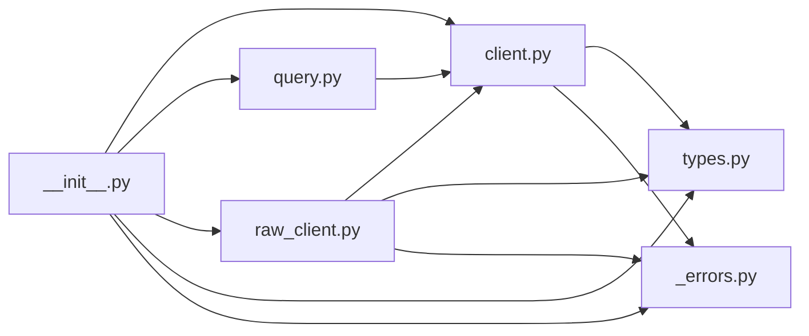

# 快速开始

<cite>
**本文引用的文件列表**
- [__init__.py](file://__init__.py)
- [client.py](file://client.py)
- [query.py](file://query.py)
- [raw_client.py](file://raw_client.py)
- [types.py](file://types.py)
- [_errors.py](file://_errors.py)
</cite>

## 目录
1. [简介](#简介)
2. [项目结构](#项目结构)
3. [核心组件](#核心组件)
4. [架构总览](#架构总览)
5. [详细组件解析](#详细组件解析)
6. [依赖关系分析](#依赖关系分析)
7. [性能与并发特性](#性能与并发特性)
8. [故障排查指南](#故障排查指南)
9. [结论](#结论)
10. [附录：安装与示例路径](#附录安装与示例路径)

## 简介
本指南面向希望快速上手 iFlow SDK 的开发者，涵盖安装方式、依赖管理、基础用法与最佳实践。你将学会：
- 使用 pip 安装 SDK 并管理依赖
- 通过 query() 函数进行一次性查询
- 使用 IFlowClient 进行多轮交互与流式响应
- 在异步上下文中正确使用 async with
- 区分 query() 与 IFlowClient 的适用场景

## 项目结构
SDK 采用模块化设计，核心入口导出主要能力；核心功能由客户端、便捷查询函数、原始数据客户端与类型定义组成。

图表来源
- [__init__.py](file://__init__.py#L1-L142)
- [client.py](file://client.py#L1-L120)
- [query.py](file://query.py#L1-L137)
- [raw_client.py](file://raw_client.py#L1-L120)
- [types.py](file://types.py#L1-L120)
- [_errors.py](file://_errors.py#L1-L85)

章节来源
- [__init__.py](file://__init__.py#L1-L142)

## 核心组件
- IFlowClient：双向、有状态的交互式客户端，支持流式输出、工具调用确认、中断控制、会话管理等。
- query()/query_stream()/query_sync()：便捷查询函数，适合一次性、无状态操作。
- RawDataClient：在 IFlowClient 基础上提供原始协议消息访问，便于调试与高级定制。
- 类型系统：统一的消息、配置、权限与枚举定义，贯穿客户端与协议层。
- 异常体系：统一的 IFlowError 及其子类，便于错误处理与定位。

章节来源
- [client.py](file://client.py#L1-L120)
- [query.py](file://query.py#L1-L137)
- [raw_client.py](file://raw_client.py#L1-L120)
- [types.py](file://types.py#L1-L120)
- [_errors.py](file://_errors.py#L1-L85)

## 架构总览
SDK 通过 WebSocket 与 iFlow 通信，遵循 ACP 协议。IFlowClient 负责连接、认证、会话创建、消息收发与工具调用处理；query() 等便捷函数基于 IFlowClient 实现一次性流程封装。

图表来源
- [client.py](file://client.py#L1-L120)
- [query.py](file://query.py#L1-L137)
- [raw_client.py](file://raw_client.py#L1-L120)
- [types.py](file://types.py#L1-L120)
- [_errors.py](file://_errors.py#L1-L85)

## 详细组件解析

### IFlowClient：交互式对话与流式响应
- 连接与认证：自动检测并可选启动本地 iFlow 进程，建立 WebSocket 连接，初始化 ACP 协议，按需执行认证与会话创建。
- 发送消息：支持文本与多种媒体类型（图片、音频）作为内容块，自动识别文件类型并编码。
- 接收消息：异步迭代器返回解析后的消息对象（如助手回复、工具调用、计划、完成等）。
- 工具调用确认：当需要用户授权时，可对请求进行批准或拒绝。
- 中断与会话：支持中断生成、加载/创建会话、清理资源。
- 适用场景：聊天界面、交互式探索、多轮对话、实时应用、需要中断控制与工具确认的场景。

图表来源
- [client.py](file://client.py#L1-L200)
- [types.py](file://types.py#L450-L720)

章节来源
- [client.py](file://client.py#L1-L200)
- [types.py](file://types.py#L450-L720)

### query()/query_stream()/query_sync()：一次性查询与流式输出
- query()：发送消息并聚合完整响应文本，适合简单问答与批处理。
- query_stream()：边到边地产出响应片段，适合实时显示与增量渲染。
- query_sync()：同步包装，便于在阻塞环境中使用。

图表来源
- [query.py](file://query.py#L1-L137)
- [client.py](file://client.py#L1-L200)

章节来源
- [query.py](file://query.py#L1-L137)

### RawDataClient：原始协议访问与调试
- 提供原始消息流、双流（原始+解析）与历史记录统计，便于协议调试与诊断。
- 支持发送原始数据（谨慎使用）与协议分析器。

图表来源
- [raw_client.py](file://raw_client.py#L1-L200)

章节来源
- [raw_client.py](file://raw_client.py#L1-L200)

### 类型系统与权限模型
- 消息类型：用户消息、助手消息、工具调用、工具结果、计划、任务完成、错误等。
- 配置与枚举：工具调用状态、确认结果、审批模式、停止原因、会话设置、认证信息等。
- 权限控制：通过 ApprovalMode 控制工具调用是否需要确认，影响 iFlow 的权限请求行为。

图表来源
- [types.py](file://types.py#L56-L120)
- [types.py](file://types.py#L893-L923)
- [types.py](file://types.py#L996-L1065)

章节来源
- [types.py](file://types.py#L56-L120)
- [types.py](file://types.py#L893-L923)
- [types.py](file://types.py#L996-L1065)

## 依赖关系分析
- 导出与入口：__init__.py 统一导出 IFlowClient、便捷查询函数、类型与错误。
- 内部依赖：client.py 依赖 types、错误模块与内部协议/传输模块；query.py 依赖 client 与 types；raw_client.py 扩展 client 并提供原始消息访问。
- 错误体系：统一继承自 IFlowError，便于捕获与区分。

图表来源
- [__init__.py](file://__init__.py#L1-L142)
- [client.py](file://client.py#L1-L120)
- [query.py](file://query.py#L1-L137)
- [raw_client.py](file://raw_client.py#L1-L120)
- [types.py](file://types.py#L1-L120)
- [_errors.py](file://_errors.py#L1-L85)

章节来源
- [__init__.py](file://__init__.py#L1-L142)

## 性能与并发特性
- 异步 I/O：基于 asyncio 的异步客户端，适合高并发与低延迟场景。
- 流式响应：query_stream() 与 IFlowClient.receive_messages() 支持边到边输出，降低首字节延迟。
- 资源管理：使用 async with 自动连接/断开，避免资源泄漏。
- 重试与超时：连接阶段具备重试与指数退避策略，提升稳定性。

章节来源
- [client.py](file://client.py#L132-L220)
- [query.py](file://query.py#L73-L110)

## 故障排查指南
- 连接失败：检查 URL、网络连通性与 iFlow 是否已启动；必要时启用自动启动选项。
- 认证失败：核对认证方法 ID 与认证信息；确认权限模式与会话设置。
- 工具调用被阻：根据审批模式选择 DEFAULT 或 AUTO_EDIT；在 DEFAULT 模式下及时响应工具确认请求。
- 超时与中断：合理设置超时；在长耗时任务中使用 interrupt() 主动取消。
- 原始协议调试：使用 RawDataClient 获取原始消息与统计，结合 ProtocolDebugger 分析会话。

章节来源
- [client.py](file://client.py#L132-L220)
- [raw_client.py](file://raw_client.py#L1-L200)
- [_errors.py](file://_errors.py#L1-L85)

## 结论
- 若只需一次性、无状态的问答或批处理，优先使用 query()/query_stream()。
- 若需要多轮对话、实时交互、工具调用确认、中断控制或流式增量输出，请使用 IFlowClient。
- 初学者可从 query() 入门，进阶者可切换到 IFlowClient 并结合 RawDataClient 进行协议调试。

## 附录：安装与示例路径

### 安装与依赖
- 使用 pip 安装 SDK（建议使用虚拟环境）
- 依赖项
  - Python 异步运行时与标准库（asyncio、pathlib、typing、logging 等）
  - WebSocket 传输（由内部模块负责）
  - 可选：在 sandbox 模式下使用 wss 地址
- 依赖管理建议
  - 使用 requirements.txt 或 pyproject.toml 管理版本
  - 如需文件系统访问，启用相关选项并限制允许目录

章节来源
- [__init__.py](file://__init__.py#L1-L142)
- [types.py](file://types.py#L996-L1065)

### 示例：一次性查询（query）
- 功能：发送单条消息并等待完整响应
- 适用：简单问答、批量处理、脚本化任务
- 示例路径
  - [query() 文档与示例](file://query.py#L15-L71)

章节来源
- [query.py](file://query.py#L15-L71)

### 示例：交互式对话（IFlowClient）
- 功能：异步上下文管理、发送消息、接收流式响应、工具调用确认、中断
- 适用：聊天界面、交互式探索、实时应用
- 示例路径
  - [IFlowClient 文档与示例](file://client.py#L39-L120)
  - [发送消息与接收消息](file://client.py#L399-L528)
  - [工具调用确认](file://client.py#L529-L598)

章节来源
- [client.py](file://client.py#L39-L120)
- [client.py](file://client.py#L399-L528)
- [client.py](file://client.py#L529-L598)

### 示例：流式响应（query_stream）
- 功能：边到边输出响应片段，适合实时显示
- 示例路径
  - [query_stream() 文档与示例](file://query.py#L73-L109)

章节来源
- [query.py](file://query.py#L73-L109)

### 示例：同步包装（query_sync）
- 功能：在同步代码中使用异步查询
- 示例路径
  - [query_sync() 文档与示例](file://query.py#L111-L137)

章节来源
- [query.py](file://query.py#L111-L137)

### 示例：原始协议调试（RawDataClient）
- 功能：获取原始消息、双流（原始+解析）、历史统计与协议分析
- 示例路径
  - [RawDataClient 文档与示例](file://raw_client.py#L72-L120)
  - [原始消息与双流](file://raw_client.py#L174-L229)
  - [协议分析器](file://raw_client.py#L293-L362)

章节来源
- [raw_client.py](file://raw_client.py#L72-L120)
- [raw_client.py](file://raw_client.py#L174-L229)
- [raw_client.py](file://raw_client.py#L293-L362)

### 何时使用 IFlowClient vs query()
- 使用 IFlowClient 当你需要：
  - 多轮对话与上下文保持
  - 实时流式响应与增量渲染
  - 工具调用确认与权限控制
  - 中断与会话管理
- 使用 query()/query_stream() 当你需要：
  - 一次性、无状态的问答
  - 批量处理与脚本化
  - 最简流程与最少依赖

章节来源
- [client.py](file://client.py#L54-L81)
- [query.py](file://query.py#L20-L35)