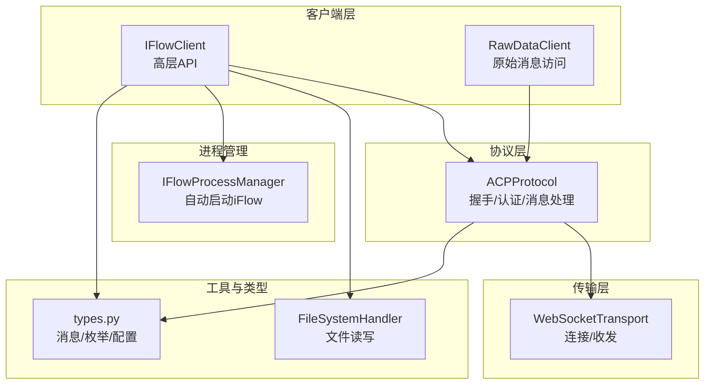
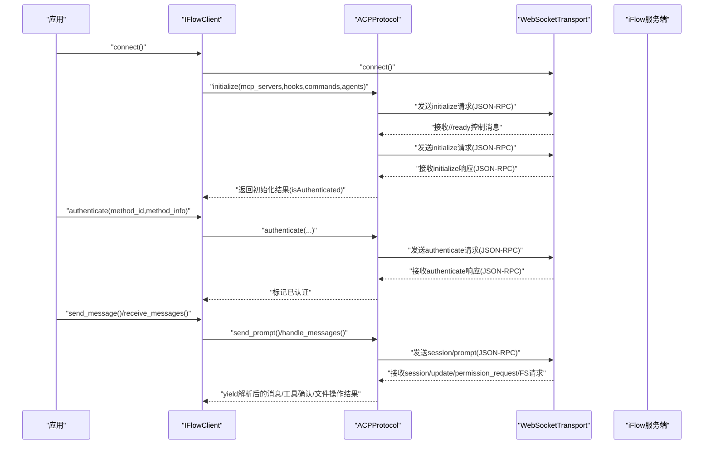
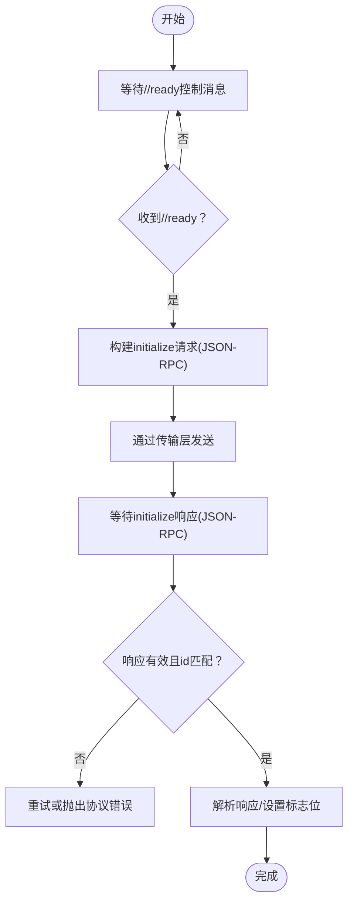
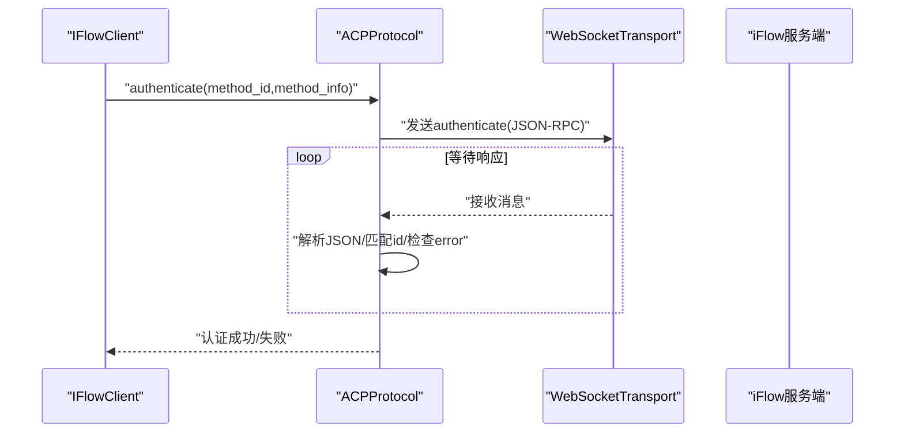
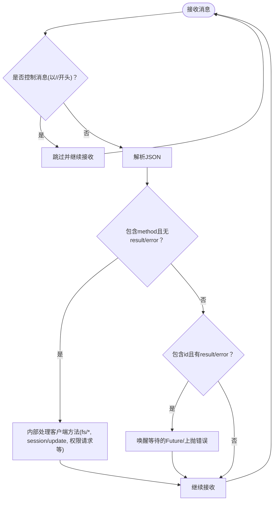
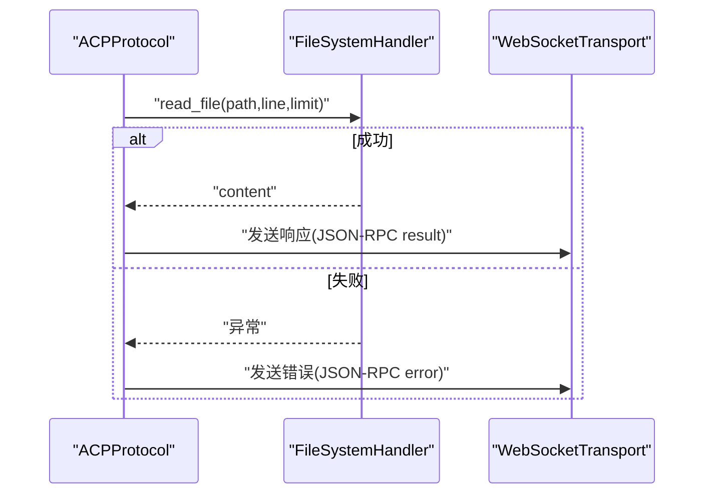
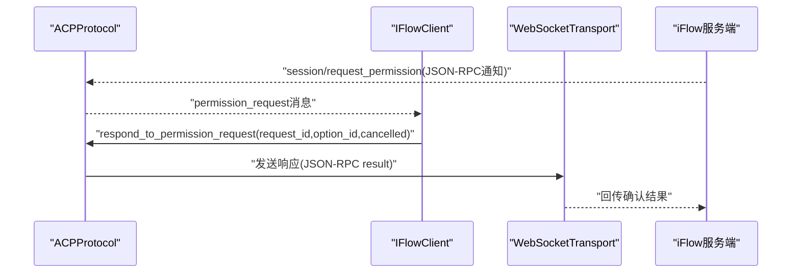
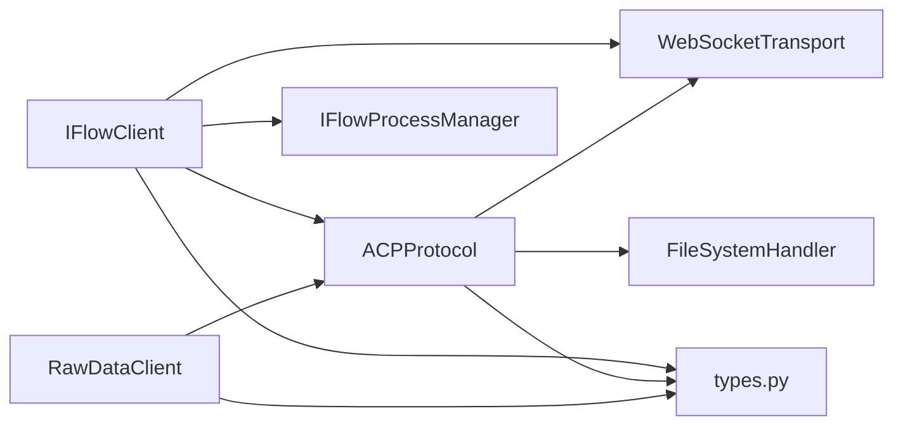

# ACP协议

<cite>
**本文引用的文件**
- [protocol.py](file://_internal/protocol.py)
- [client.py](file://client.py)
- [raw_client.py](file://raw_client.py)
- [transport.py](file://_internal/transport.py)
- [file_handler.py](file://_internal/file_handler.py)
- [process_manager.py](file://_internal/process_manager.py)
- [_errors.py](file://_errors.py)
- [types.py](file://types.py)
</cite>

## 目录
1. [引言](#引言)
2. [项目结构](#项目结构)
3. [核心组件](#核心组件)
4. [架构总览](#架构总览)
5. [详细组件分析](#详细组件分析)
6. [依赖关系分析](#依赖关系分析)
7. [性能与可靠性考量](#性能与可靠性考量)
8. [故障排查指南](#故障排查指南)
9. [结论](#结论)
10. [附录：术语与JSON-RPC 2.0规范](#附录术语与json-rpc-20规范)

## 引言
本文件面向初学者与高级用户，系统性解析iflow_sdk中的ACP（Agent Communication Protocol）协议实现，重点覆盖：
- 协议初始化流程（等待//ready信号、发送initialize请求、处理响应）
- JSON-RPC 2.0消息格式在协议中的应用（请求、响应、通知）
- 协议版本管理与客户端/服务器能力协商
- initialize()、authenticate()、handle_messages()方法如何协同工作
- 错误处理策略与超时机制
- 关键术语定义（request_id、method、params等）

ACP协议基于WebSocket传输，采用JSON-RPC 2.0进行消息编解码，并通过客户端状态机与服务器交互，支持会话创建、工具调用确认、文件系统访问等能力。

## 项目结构
SDK采用分层设计：
- 传输层：WebSocketTransport负责连接、收发与错误处理
- 协议层：ACPProtocol封装协议握手、认证、消息处理与工具调用确认
- 客户端层：IFlowClient提供高层API，封装连接、会话、消息流与工具确认
- 工具与类型：FileSystemHandler提供安全的文件读写；types定义消息与配置类型
- 进程管理：IFlowProcessManager用于自动启动本地iFlow进程

图表来源
- [client.py](file://client.py#L1-L200)
- [raw_client.py](file://raw_client.py#L1-L120)
- [protocol.py](file://_internal/protocol.py#L1-L120)
- [transport.py](file://_internal/transport.py#L1-L120)
- [file_handler.py](file://_internal/file_handler.py#L1-L80)
- [process_manager.py](file://_internal/process_manager.py#L1-L80)
- [types.py](file://types.py#L1-L60)

章节来源
- [client.py](file://client.py#L1-L200)
- [protocol.py](file://_internal/protocol.py#L1-L120)
- [transport.py](file://_internal/transport.py#L1-L120)
- [file_handler.py](file://_internal/file_handler.py#L1-L80)
- [process_manager.py](file://_internal/process_manager.py#L1-L80)
- [types.py](file://types.py#L1-L60)

## 核心组件
- ACPProtocol：实现协议握手、认证、会话管理、消息处理与工具确认
- WebSocketTransport：WebSocket连接、消息收发与异常处理
- IFlowClient：高层API，封装连接、会话、消息流、工具确认
- FileSystemHandler：受控的文件读写接口，供ACP协议调用
- IFlowProcessManager：自动发现与启动iFlow进程
- types：消息类型、权限选项、枚举与配置结构
- _errors：统一的异常体系

章节来源
- [protocol.py](file://_internal/protocol.py#L1-L120)
- [transport.py](file://_internal/transport.py#L1-L120)
- [client.py](file://client.py#L1-L120)
- [file_handler.py](file://_internal/file_handler.py#L1-L80)
- [process_manager.py](file://_internal/process_manager.py#L1-L80)
- [types.py](file://types.py#L1-L60)
- [_errors.py](file://_errors.py#L1-L85)

## 架构总览
下图展示从客户端到协议层再到传输层的消息流转，以及工具调用确认与文件系统访问的协作关系。

图表来源
- [client.py](file://client.py#L120-L320)
- [protocol.py](file://_internal/protocol.py#L110-L260)
- [transport.py](file://_internal/transport.py#L80-L160)

## 详细组件分析

### 初始化流程（initialize）
- 等待//ready控制消息：协议层在收到字符串且以“//”开头的控制消息时，仅记录日志；只有当收到“//ready”时才继续
- 发送initialize请求：构造JSON-RPC 2.0请求，包含protocolVersion与clientCapabilities（含fs能力声明），并可附加mcp_servers、hooks、commands、agents等配置
- 处理响应：解析JSON，匹配id字段，若存在error则抛出协议错误；成功时设置_initialized与_isAuthenticated标志并返回结果

图表来源
- [protocol.py](file://_internal/protocol.py#L110-L170)

章节来源
- [protocol.py](file://_internal/protocol.py#L110-L170)

### 认证流程（authenticate）
- 当initialize返回isAuthenticated=false时，客户端调用authenticate
- 构造JSON-RPC 2.0请求，包含methodId与可选methodInfo
- 超时控制：默认10秒；超时抛出超时错误
- 响应校验：若error存在则抛出认证错误；若methodId匹配则标记已认证

图表来源
- [protocol.py](file://_internal/protocol.py#L176-L256)

章节来源
- [protocol.py](file://_internal/protocol.py#L176-L256)

### 消息处理与工具确认（handle_messages）
- 接收消息：遍历传输层receive迭代器，跳过控制消息
- 方法调用（客户端接口）：当消息包含method且无result/error时，判定为服务器对客户端的调用请求，协议层内部处理并按需回发响应
- 请求响应：当消息包含id且有result或error时，作为请求响应处理，唤醒等待的Future
- 通知与错误：对session/update、fs/*、pushToolCall、updateToolCall、notifyTaskFinish等进行分类处理；对error进行包装并上抛

图表来源
- [protocol.py](file://_internal/protocol.py#L499-L533)

章节来源
- [protocol.py](file://_internal/protocol.py#L499-L533)

### 文件系统访问（fs/*）
- fs/read_text_file：若注册了FileSystemHandler，则读取文件内容；否则返回错误；成功后按需回发result
- fs/write_text_file：若注册了FileSystemHandler且非只读模式，则写入文件；否则返回错误；成功后按需回发result
- 安全控制：路径白名单、大小限制、只读模式

图表来源
- [protocol.py](file://_internal/protocol.py#L598-L660)
- [file_handler.py](file://_internal/file_handler.py#L89-L160)

章节来源
- [protocol.py](file://_internal/protocol.py#L598-L660)
- [file_handler.py](file://_internal/file_handler.py#L89-L160)

### 工具调用确认（request_permission）
- 服务器通过ACP协议下发session/request_permission通知，协议层将其转换为上层可消费的消息
- 上层根据ApprovalMode决定是否需要用户确认；用户确认后调用respond_to_permission_request
- 协议层将用户选择封装为JSON-RPC响应并回发给服务器

图表来源
- [protocol.py](file://_internal/protocol.py#L567-L600)
- [protocol.py](file://_internal/protocol.py#L720-L768)
- [client.py](file://client.py#L529-L598)

章节来源
- [protocol.py](file://_internal/protocol.py#L567-L600)
- [protocol.py](file://_internal/protocol.py#L720-L768)
- [client.py](file://client.py#L529-L598)

### 会话管理与消息发送
- create_session/load_session：创建或加载会话，携带cwd、mcp_servers、hooks、commands、agents、settings等参数
- send_prompt：向指定会话发送多模态提示（文本、图片、音频、资源链接）
- cancel_session：中断当前生成

章节来源
- [protocol.py](file://_internal/protocol.py#L257-L446)
- [client.py](file://client.py#L399-L509)

## 依赖关系分析
- IFlowClient依赖ACPProtocol与WebSocketTransport，负责高层生命周期管理与消息流
- ACPProtocol依赖WebSocketTransport与FileSystemHandler，负责协议语义与消息编解码
- RawDataClient扩展IFlowClient，提供原始消息与双流输出能力
- IFlowProcessManager与client.py集成，用于自动启动本地iFlow进程
- types提供消息类型、权限选项、枚举与配置结构，贯穿客户端与协议层

图表来源
- [client.py](file://client.py#L1-L120)
- [raw_client.py](file://raw_client.py#L1-L120)
- [protocol.py](file://_internal/protocol.py#L1-L120)
- [transport.py](file://_internal/transport.py#L1-L120)
- [file_handler.py](file://_internal/file_handler.py#L1-L80)
- [process_manager.py](file://_internal/process_manager.py#L1-L80)
- [types.py](file://types.py#L1-L60)

章节来源
- [client.py](file://client.py#L1-L120)
- [raw_client.py](file://raw_client.py#L1-L120)
- [protocol.py](file://_internal/protocol.py#L1-L120)
- [transport.py](file://_internal/transport.py#L1-L120)
- [file_handler.py](file://_internal/file_handler.py#L1-L80)
- [process_manager.py](file://_internal/process_manager.py#L1-L80)
- [types.py](file://types.py#L1-L60)

## 性能与可靠性考量
- 超时与重试
  - 认证阶段默认10秒超时，超过时间抛出超时错误
  - 会话创建/加载阶段同样内置10秒超时，超时后返回回退会话ID
  - 连接建立阶段具备重试与指数回退策略
- 控制消息与JSON解析
  - 协议层对“//”前缀的控制消息进行过滤，避免干扰JSON解析
  - 对无效JSON抛出JSONDecodeError并终止解析
- 并发与队列
  - 客户端使用异步队列承载消息，避免阻塞
  - 协议层维护pending_requests字典，确保请求-响应一一对应
- 安全与容错
  - 文件系统访问通过白名单、路径规范化与大小限制保护
  - 传输层捕获连接关闭与异常，向上抛出统一错误类型

章节来源
- [protocol.py](file://_internal/protocol.py#L213-L256)
- [protocol.py](file://_internal/protocol.py#L311-L344)
- [protocol.py](file://_internal/protocol.py#L412-L445)
- [client.py](file://client.py#L149-L221)
- [transport.py](file://_internal/transport.py#L85-L160)
- [file_handler.py](file://_internal/file_handler.py#L89-L160)
- [_errors.py](file://_errors.py#L1-L85)

## 故障排查指南
- 连接失败
  - 检查URL与端口是否可达；确认WebSocketTransport连接超时与异常
  - 若使用自动启动，确认IFlowProcessManager已找到可执行文件并成功启动
- 初始化失败
  - 确认收到“//ready”后再发送initialize请求
  - 检查initialize返回的error字段，定位服务器端能力不匹配或参数问题
- 认证失败
  - 检查method_id与method_info是否正确
  - 注意认证超时与错误响应
- 工具确认未触发
  - 检查ApprovalMode与服务器端策略
  - 确认handle_messages循环正常运行
- 文件系统访问失败
  - 检查allowed_dirs、read_only与max_file_size配置
  - 确认路径未越权访问

章节来源
- [transport.py](file://_internal/transport.py#L85-L160)
- [process_manager.py](file://_internal/process_manager.py#L152-L209)
- [protocol.py](file://_internal/protocol.py#L110-L170)
- [protocol.py](file://_internal/protocol.py#L176-L256)
- [protocol.py](file://_internal/protocol.py#L499-L533)
- [file_handler.py](file://_internal/file_handler.py#L89-L160)

## 结论
ACP协议在iflow_sdk中通过清晰的分层设计实现了与iFlow的稳定交互。协议层负责握手、认证、消息编解码与工具确认，传输层提供可靠的WebSocket通信，客户端层提供易用的高层API。配合严格的错误处理与超时控制，SDK能够满足从简单对话到复杂工具链交互的多种场景需求。

## 附录：术语与JSON-RPC 2.0规范
- request_id：每个JSON-RPC请求的唯一标识符，用于关联请求与响应
- method：方法名，标识具体操作（如initialize、authenticate、session/new、fs/read_text_file等）
- params：方法参数对象，包含调用所需的键值对
- JSON-RPC 2.0消息格式要点
  - 请求：包含jsonrpc、id、method、params
  - 响应：包含jsonrpc、id、result或error
  - 通知：仅包含jsonrpc、method、params，无id与响应

章节来源
- [protocol.py](file://_internal/protocol.py#L130-L170)
- [protocol.py](file://_internal/protocol.py#L176-L256)
- [protocol.py](file://_internal/protocol.py#L257-L346)
- [protocol.py](file://_internal/protocol.py#L598-L660)