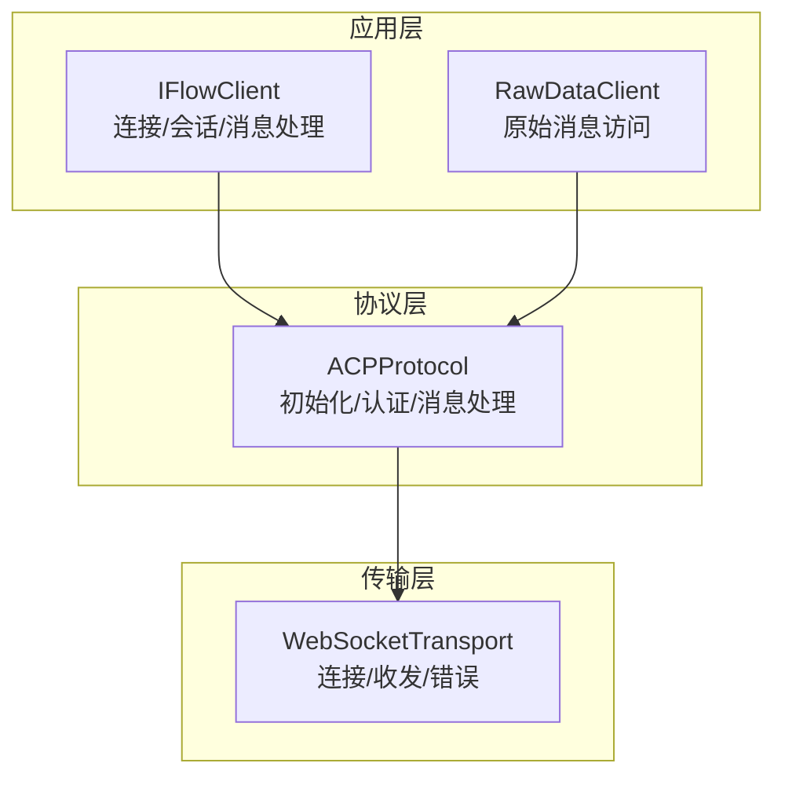
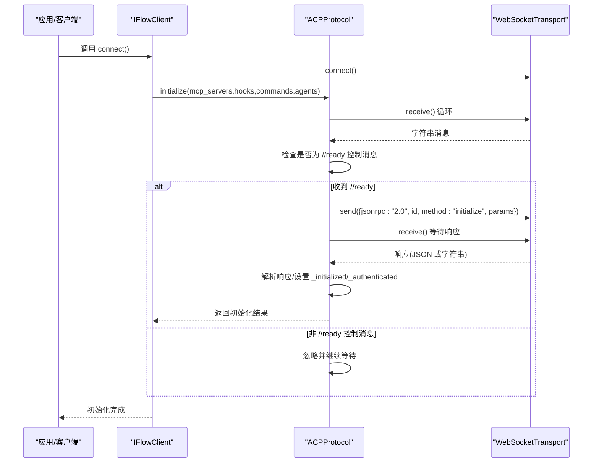
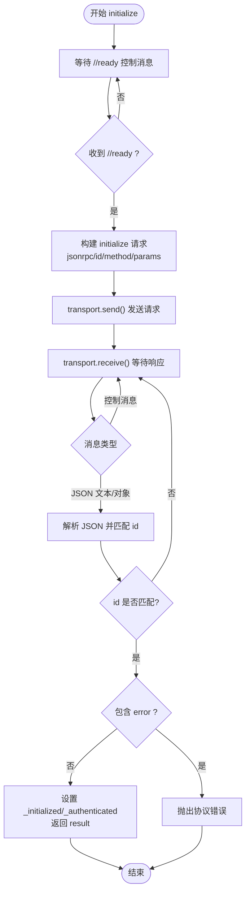
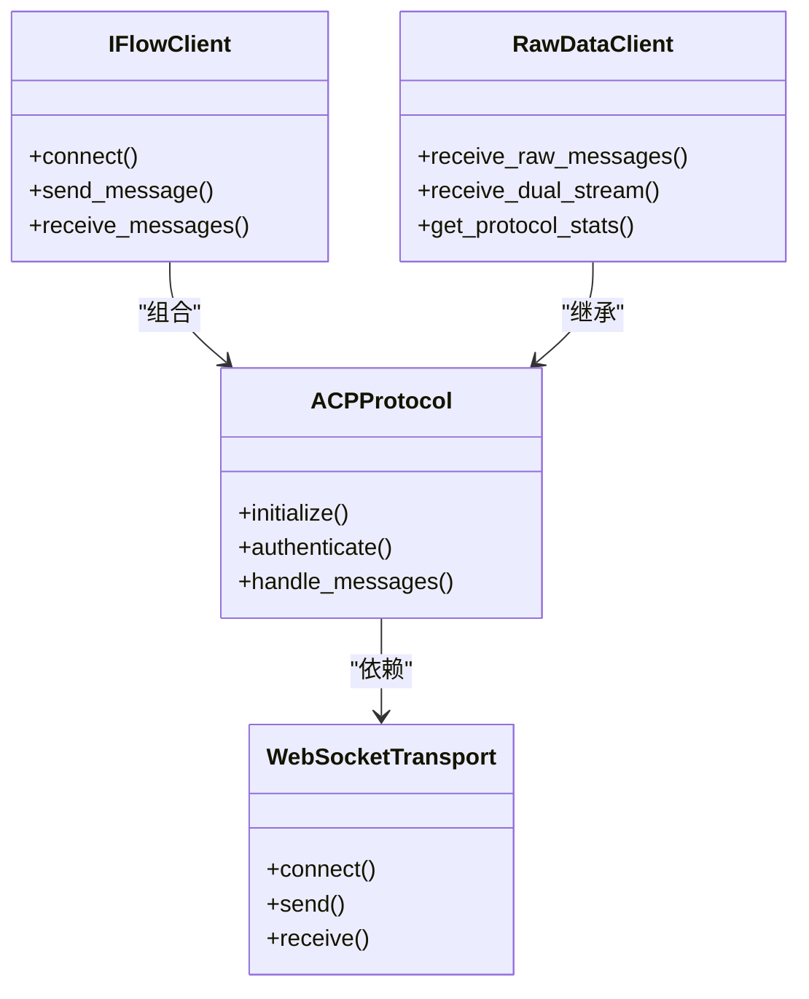

# 协议初始化

<cite>
**本文引用的文件**
- [protocol.py](file://_internal/protocol.py)
- [transport.py](file://_internal/transport.py)
- [client.py](file://client.py)
- [raw_client.py](file://raw_client.py)
- [_errors.py](file://_errors.py)
- [types.py](file://types.py)
</cite>

## 目录
1. [简介](#简介)
2. [项目结构](#项目结构)
3. [核心组件](#核心组件)
4. [架构总览](#架构总览)
5. [详细组件分析](#详细组件分析)
6. [依赖关系分析](#依赖关系分析)
7. [性能考量](#性能考量)
8. [故障排查指南](#故障排查指南)
9. [结论](#结论)

## 简介
本节聚焦于 ACP（Agent Communication Protocol）协议的初始化流程，系统性解释以下关键点：
- 如何通过 transport.receive() 监听控制消息并等待 //ready 信号
- initialize() 方法如何构建 JSON-RPC 2.0 格式的初始化请求，包含 protocolVersion 和 clientCapabilities 等参数
- 初始化响应的处理过程，包括协议版本协商与认证状态确定
- 错误处理与超时机制在初始化阶段的体现
- request_id 的作用、生成方式与调试建议

该文档既面向初学者解释基本概念，也为高级用户提供调试与优化建议。

## 项目结构
SDK 采用分层设计：上层客户端负责连接、会话与消息处理；中间层协议层实现 ACP 协议握手与消息编解码；底层传输层封装 WebSocket 连接与收发。

图表来源
- [client.py](file://client.py#L132-L322)
- [protocol.py](file://_internal/protocol.py#L21-L786)
- [transport.py](file://_internal/transport.py#L27-L177)

章节来源
- [client.py](file://client.py#L132-L322)
- [protocol.py](file://_internal/protocol.py#L21-L786)
- [transport.py](file://_internal/transport.py#L27-L177)

## 核心组件
- WebSocketTransport：提供连接建立、消息发送与接收、连接关闭与错误处理。
- ACPProtocol：实现 ACP 协议，包含 initialize()、authenticate()、handle_messages() 等方法。
- IFlowClient：高层客户端，负责连接、初始化、认证、会话创建与消息流处理。
- RawDataClient：扩展客户端，提供原始消息访问与协议调试能力。
- 错误体系：统一异常类型，便于定位问题。

章节来源
- [transport.py](file://_internal/transport.py#L27-L177)
- [protocol.py](file://_internal/protocol.py#L21-L786)
- [client.py](file://client.py#L132-L322)
- [raw_client.py](file://raw_client.py#L72-L200)
- [_errors.py](file://_errors.py#L10-L85)

## 架构总览
下面以序列图展示初始化握手的关键步骤：等待 //ready、发送 initialize 请求、解析响应并更新状态。

图表来源
- [client.py](file://client.py#L254-L261)
- [protocol.py](file://_internal/protocol.py#L101-L171)
- [transport.py](file://_internal/transport.py#L114-L146)

章节来源
- [client.py](file://client.py#L254-L261)
- [protocol.py](file://_internal/protocol.py#L101-L171)
- [transport.py](file://_internal/transport.py#L114-L146)

## 详细组件分析

### 初始化握手流程（等待 //ready 与 initialize）
- 等待 //ready 信号
  - 协议层通过 transport.receive() 异步迭代接收消息。
  - 当收到字符串且内容为“//ready”时，认为服务端已就绪，停止等待。
  - 其他以“//”开头的控制消息会被记录日志但不中断等待。
- 发送 initialize 请求
  - 生成自增 request_id，构造 JSON-RPC 2.0 请求：
    - jsonrpc: "2.0"
    - id: request_id
    - method: "initialize"
    - params: 包含 protocolVersion 与 clientCapabilities，以及可选的 mcpServers、hooks、commands、agents
  - 通过 transport.send() 发送请求。
- 处理初始化响应
  - 继续从 transport.receive() 接收消息，跳过控制消息。
  - 尝试解析 JSON；若 id 与当前 request_id 匹配：
    - 若包含 error 字段，抛出协议错误
    - 否则提取 result，设置 _initialized 为 True，_authenticated 来自 result 中的 isAuthenticated
    - 返回 result 供上层使用

图表来源
- [protocol.py](file://_internal/protocol.py#L101-L171)

章节来源
- [protocol.py](file://_internal/protocol.py#L101-L171)

### JSON-RPC 2.0 初始化请求参数
- protocolVersion：固定为数值型协议版本号（由类常量定义），用于与服务端进行版本协商。
- clientCapabilities：声明客户端支持的能力，例如文件系统读写能力。
- 可选参数：
  - mcpServers：MCP 服务器配置列表
  - hooks：事件钩子配置
  - commands：命令配置
  - agents：代理配置

这些参数在 initialize() 中被拼装到 params 字段中，随后作为 JSON-RPC 请求发送。

章节来源
- [protocol.py](file://_internal/protocol.py#L114-L129)
- [types.py](file://types.py#L13-L15)

### 认证状态与协议版本协商
- 协议版本协商：initialize() 返回值包含 protocolVersion 字段，客户端据此判断与服务端的兼容性。
- 认证状态：initialize() 返回值包含 isAuthenticated 字段，指示是否需要后续 authenticate() 流程。
- 上层逻辑：IFlowClient 在 initialize() 成功后，若 isAuthenticated 为 False，则调用 authenticate() 完成认证。

章节来源
- [protocol.py](file://_internal/protocol.py#L147-L166)
- [client.py](file://client.py#L263-L276)

### 错误处理与超时机制
- 错误处理
  - JSON 解析失败：捕获 JSONDecodeError 并记录日志，继续等待下一条消息。
  - 初始化失败：当响应包含 error 字段时，抛出协议错误。
  - 连接断开：transport 层在 receive() 中检测到连接关闭，会标记连接状态并终止循环。
- 超时机制
  - initialize() 本身未显式设置超时，但会持续等待 //ready 与响应。
  - 其他操作（如认证、会话创建/加载）在各自方法内设置了超时时间（例如认证默认 10 秒）。
  - 传输层 connect() 提供连接超时控制（由 IFlowOptions.timeout 决定）。

章节来源
- [protocol.py](file://_internal/protocol.py#L147-L171)
- [transport.py](file://_internal/transport.py#L64-L84)
- [client.py](file://client.py#L204-L221)

### request_id 的作用与生成方式
- 作用
  - 用于关联请求与响应，确保响应能够正确路由到对应的请求上下文。
  - 在协议层内部维护 pending_requests 映射，以便在收到响应时取出 Future 并设置结果或异常。
- 生成方式
  - 使用自增整数作为 request_id，每次请求前调用 _next_request_id() 获取下一个唯一 ID。
  - 协议层还维护 _pending_permission_requests，用于工具调用权限请求的用户响应跟踪。

章节来源
- [protocol.py](file://_internal/protocol.py#L48-L63)
- [protocol.py](file://_internal/protocol.py#L769-L786)

### 初学者要点与高级调试指南
- 初学者要点
  - //ready 是服务端的“握手就绪”信号，必须先收到再发送 initialize 请求。
  - initialize 请求遵循 JSON-RPC 2.0 规范，务必保证 id 唯一且与响应匹配。
  - 认证状态由 isAuthenticated 决定，若为 False 需要执行 authenticate()。
- 高级调试
  - 使用 RawDataClient 获取原始消息流，核对控制消息与 JSON 消息类型。
  - 使用 ProtocolDebugger 打印消息摘要与统计信息，辅助定位问题。
  - 结合日志级别与异常类型（ConnectionError、ProtocolError、TimeoutError、JSONDecodeError）快速定位问题根因。

章节来源
- [raw_client.py](file://raw_client.py#L120-L200)
- [raw_client.py](file://raw_client.py#L293-L362)
- [_errors.py](file://_errors.py#L10-L85)

## 依赖关系分析
- IFlowClient 依赖 ACPProtocol 与 WebSocketTransport，负责高层连接、初始化、认证与会话管理。
- ACPProtocol 依赖 WebSocketTransport 进行消息收发，内部维护 request_id、pending_requests、认证状态等。
- RawDataClient 继承 IFlowClient，增强原始消息捕获与调试能力。
- 错误体系统一由 _errors.py 定义，便于跨层传递与处理。

图表来源
- [client.py](file://client.py#L132-L322)
- [raw_client.py](file://raw_client.py#L72-L200)
- [protocol.py](file://_internal/protocol.py#L21-L786)
- [transport.py](file://_internal/transport.py#L27-L177)

章节来源
- [client.py](file://client.py#L132-L322)
- [raw_client.py](file://raw_client.py#L72-L200)
- [protocol.py](file://_internal/protocol.py#L21-L786)
- [transport.py](file://_internal/transport.py#L27-L177)

## 性能考量
- 初始化阶段的消息处理为异步迭代，避免阻塞事件循环。
- 对控制消息与 JSON 消息分别处理，减少不必要的解析开销。
- 传输层对大消息设置了上限，防止内存压力过大。
- 建议在高延迟网络环境下适当增大 IFlowOptions.timeout，以降低连接失败概率。

章节来源
- [transport.py](file://_internal/transport.py#L64-L84)
- [transport.py](file://_internal/transport.py#L114-L146)
- [client.py](file://client.py#L204-L221)

## 故障排查指南
- 无 //ready 信号
  - 检查服务端是否正确发送控制消息；确认 transport.receive() 是否被正确消费。
  - 使用 RawDataClient 的原始消息流查看实际收到的消息。
- 初始化请求未得到响应
  - 核对 request_id 是否唯一且与响应 id 匹配。
  - 检查 JSON 解析是否成功，关注 JSONDecodeError。
- 认证超时
  - 认证方法内置 10 秒超时，必要时增加等待时间或检查网络连通性。
- 连接失败
  - 检查 IFlowOptions.timeout 与网络状况；观察连接重试策略。
- 日志与异常
  - 结合 IFlowError 子类定位问题：ConnectionError、ProtocolError、TimeoutError、JSONDecodeError。

章节来源
- [protocol.py](file://_internal/protocol.py#L147-L171)
- [protocol.py](file://_internal/protocol.py#L213-L256)
- [transport.py](file://_internal/transport.py#L64-L84)
- [raw_client.py](file://raw_client.py#L120-L200)
- [_errors.py](file://_errors.py#L10-L85)

## 结论
ACP 协议初始化流程以“//ready”控制消息为起点，通过 JSON-RPC 2.0 的 initialize 请求完成协议版本协商与能力声明。协议层严格区分控制消息与 JSON 消息，利用 request_id 实现请求-响应的可靠关联。错误处理与超时机制贯穿其中，配合 RawDataClient 的原始消息访问能力，为初学者提供了清晰的学习路径，也为高级用户提供了强大的调试手段。建议在生产环境中合理配置超时与日志级别，以提升稳定性与可观测性。