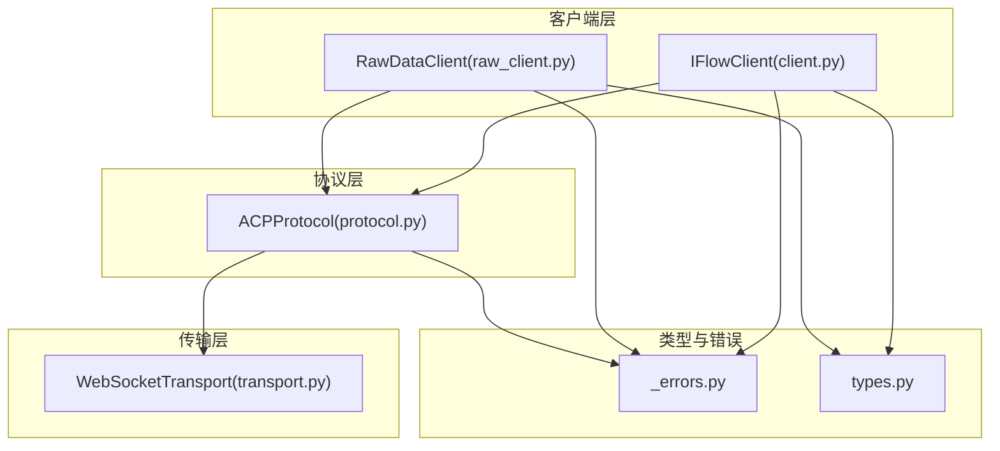
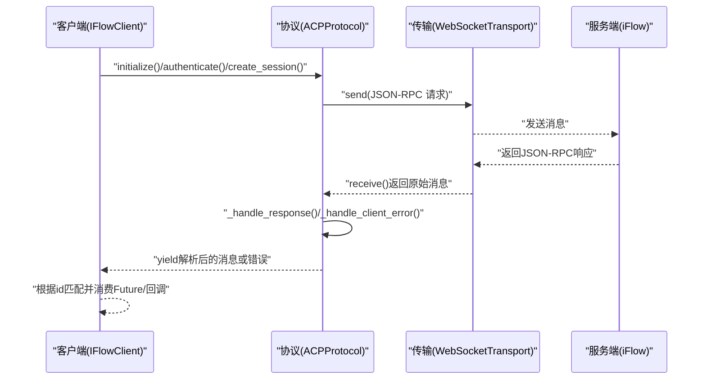
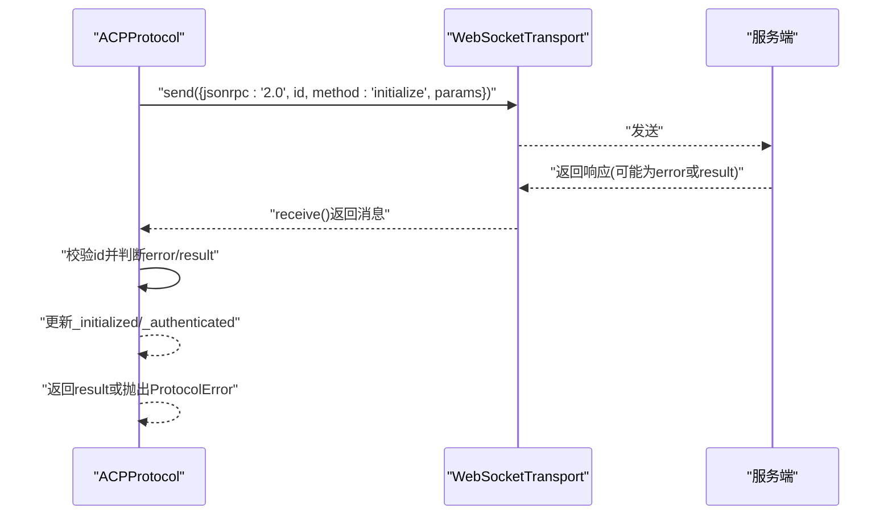
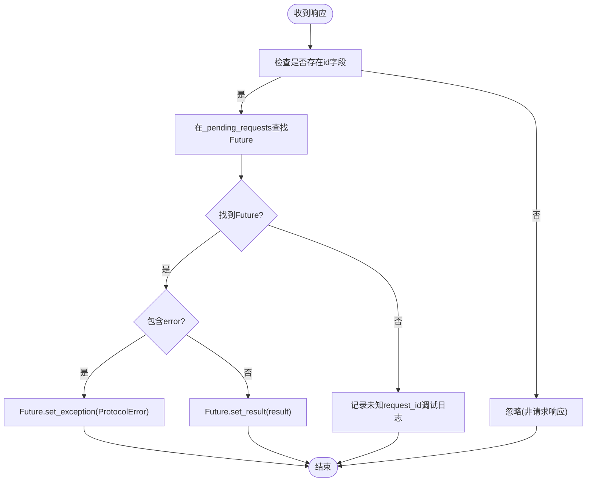
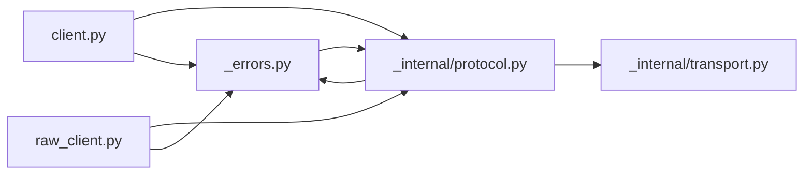

# 响应消息

<cite>
**本文引用的文件列表**
- [protocol.py](file://_internal/protocol.py)
- [_errors.py](file://_errors.py)
- [client.py](file://client.py)
- [raw_client.py](file://raw_client.py)
- [transport.py](file://_internal/transport.py)
- [types.py](file://types.py)
</cite>

## 目录
1. [简介](#简介)
2. [项目结构](#项目结构)
3. [核心组件](#核心组件)
4. [架构总览](#架构总览)
5. [详细组件分析](#详细组件分析)
6. [依赖关系分析](#依赖关系分析)
7. [性能考量](#性能考量)
8. [故障排查指南](#故障排查指南)
9. [结论](#结论)
10. [附录](#附录)

## 简介
本节聚焦于ACP协议中服务器返回的JSON-RPC 2.0响应消息格式，系统性阐述：
- 成功响应中的result字段：包含协议版本、会话ID、认证状态等关键信息的解析与使用规范
- 错误响应中的error字段：包含code、message和可选data子字段的语义与处理策略
- 结合protocol.py中的_handle_response与_initialize方法，说明SDK如何处理响应并解析result数据（如session ID、协议版本）
- 展示如何捕获和处理不同类型的错误响应（如ProtocolError、AuthenticationError）
- 解释响应消息中id字段如何与原始请求匹配，确保异步调用的正确性
- 提供响应解析的最佳实践与常见陷阱（如超时、未知request_id）的解决方案

## 项目结构
围绕响应消息处理的关键模块与职责如下：
- 协议层：负责JSON-RPC消息的发送、接收、解析与路由，以及错误映射
- 客户端层：封装连接、初始化、认证、会话管理与消息流处理
- 传输层：提供WebSocket连接、收发与基础异常类型
- 类型与错误定义：统一错误类型与消息模型

图表来源
- [client.py](file://client.py#L1-L120)
- [raw_client.py](file://raw_client.py#L1-L120)
- [_internal/protocol.py](file://_internal/protocol.py#L1-L120)
- [_internal/transport.py](file://_internal/transport.py#L1-L120)
- [_errors.py](file://_errors.py#L1-L85)
- [types.py](file://types.py#L1-L120)

章节来源
- [client.py](file://client.py#L1-L200)
- [_internal/protocol.py](file://_internal/protocol.py#L1-L120)
- [_internal/transport.py](file://_internal/transport.py#L1-L120)
- [_errors.py](file://_errors.py#L1-L85)
- [types.py](file://types.py#L1-L120)

## 核心组件
- ACPProtocol：实现JSON-RPC 2.0消息的发送与接收，维护请求ID映射，处理服务端响应与客户端方法调用
- IFlowClient/RawDataClient：高层客户端，负责连接、初始化、认证、会话创建与消息流处理；RawDataClient提供原始消息访问能力
- WebSocketTransport：底层WebSocket通信，负责连接、收发与异常
- 错误体系：IFlowError及其子类（ProtocolError、AuthenticationError、TimeoutError、JSONDecodeError等）

章节来源
- [_internal/protocol.py](file://_internal/protocol.py#L1-L120)
- [client.py](file://client.py#L1-L120)
- [_internal/transport.py](file://_internal/transport.py#L1-L120)
- [_errors.py](file://_errors.py#L1-L85)

## 架构总览
下图展示了从客户端到协议层再到传输层的消息流转，重点标注了JSON-RPC响应的处理路径与错误映射。

图表来源
- [client.py](file://client.py#L240-L320)
- [_internal/protocol.py](file://_internal/protocol.py#L514-L533)
- [_internal/protocol.py](file://_internal/protocol.py#L769-L786)
- [_internal/transport.py](file://_internal/transport.py#L114-L146)

## 详细组件分析

### JSON-RPC 2.0响应格式与字段规范
- 成功响应（result字段）
  - 字段结构：包含result对象，其中可能包含协议版本、会话ID、认证状态等
  - 典型键值：
    - protocolVersion：服务器声明的协议版本
    - isAuthenticated：是否已认证
    - sessionId：会话标识符
    - stopReason：提示停止的原因（在某些完成通知中出现）
- 错误响应（error字段）
  - 字段结构：包含error对象，至少包含code与message；可选data子对象
  - 常见code范围：
    - -32700：解析错误
    - -32600：无效请求（如缺少必要字段）
    - -32601：方法未找到
    - -32602：参数错误
    - -32603：内部错误
    - 自定义业务错误码：由服务端定义
  - data子字段：用于携带额外上下文（如details），便于诊断

章节来源
- [_internal/protocol.py](file://_internal/protocol.py#L514-L533)
- [_internal/protocol.py](file://_internal/protocol.py#L694-L698)
- [_errors.py](file://_errors.py#L1-L85)

### 初始化流程中的响应解析（initialize）
- 请求构造：包含jsonrpc、id、method与params（含protocolVersion与clientCapabilities）
- 响应匹配：基于id字段与本地生成的请求ID进行匹配
- 成功解析：
  - result包含protocolVersion与isAuthenticated
  - 更新内部状态，记录认证状态
- 失败处理：若error存在，抛出ProtocolError

图表来源
- [_internal/protocol.py](file://_internal/protocol.py#L113-L171)

章节来源
- [_internal/protocol.py](file://_internal/protocol.py#L113-L171)

### 认证流程中的响应解析（authenticate）
- 请求构造：包含method与params（methodId与可选methodInfo）
- 响应匹配：基于id字段匹配
- 成功解析：
  - 若error存在，抛出AuthenticationError
  - 若result包含methodId且与请求一致，则标记为已认证
- 超时处理：超过设定阈值后抛出TimeoutError

章节来源
- [_internal/protocol.py](file://_internal/protocol.py#L176-L256)

### 会话创建与加载中的响应解析（create_session/load_session）
- 请求构造：包含method与params（cwd、mcpServers、hooks、commands、agents、settings等）
- 响应匹配：基于id字段匹配
- 成功解析：
  - 若error存在，抛出ProtocolError
  - 若result包含sessionId，返回该ID；否则回退为“session_{request_id}”
- 超时处理：超过阈值后回退并记录警告

章节来源
- [_internal/protocol.py](file://_internal/protocol.py#L257-L346)
- [_internal/protocol.py](file://_internal/protocol.py#L347-L446)

### 响应消息id字段与异步匹配机制
- 请求ID生成：每次请求调用_next_request_id()生成唯一id
- 响应匹配：协议层收到消息后，若包含id字段则与_pending_requests字典中的Future进行匹配
- 异常分支：若error存在，Future.set_exception(ProtocolError(...))；否则Future.set_result(result)
- 未知id：若id不在_pending_requests中，记录调试日志（避免阻塞）

图表来源
- [_internal/protocol.py](file://_internal/protocol.py#L769-L786)

章节来源
- [_internal/protocol.py](file://_internal/protocol.py#L45-L63)
- [_internal/protocol.py](file://_internal/protocol.py#L769-L786)

### 错误响应的捕获与处理
- 协议层错误映射：
  - _handle_client_error：从error对象提取code/message，并可读取data.details
  - _send_error：向服务端发送标准JSON-RPC错误响应
- 客户端层错误传播：
  - IFlowClient在处理消息时，将错误转换为ErrorMessage并入队
  - RawDataClient提供原始消息访问，便于调试与统计

章节来源
- [_internal/protocol.py](file://_internal/protocol.py#L694-L718)
- [client.py](file://client.py#L640-L660)
- [raw_client.py](file://raw_client.py#L1-L120)

### result字段解析最佳实践
- 初始化结果：
  - 读取protocolVersion与isAuthenticated，用于后续流程控制
- 会话结果：
  - 优先使用result.sessionId；若缺失，采用回退策略（如“session_{request_id}”）
- 完成通知：
  - 某些完成响应可能包含stopReason，用于指示停止原因（如取消、最大token等）

章节来源
- [_internal/protocol.py](file://_internal/protocol.py#L140-L171)
- [_internal/protocol.py](file://_internal/protocol.py#L328-L346)
- [client.py](file://client.py#L784-L820)

### 常见陷阱与解决方案
- 超时：
  - 认证与会话操作均设置超时阈值，超时后抛出TimeoutError或回退策略
- 未知request_id：
  - 收到未知id的响应时，记录调试日志，避免阻塞；建议上层重试或重建连接
- JSON解析失败：
  - 传输层返回原始字符串，协议层尝试解析；解析失败时抛出JSONDecodeError
- 控制消息干扰：
  - 协议层跳过以“//”开头的控制消息，避免误判为JSON-RPC响应

章节来源
- [_internal/protocol.py](file://_internal/protocol.py#L176-L256)
- [_internal/protocol.py](file://_internal/protocol.py#L328-L446)
- [_internal/protocol.py](file://_internal/protocol.py#L514-L533)
- [_internal/transport.py](file://_internal/transport.py#L114-L146)

## 依赖关系分析
- 协议层依赖传输层进行消息收发
- 客户端层依赖协议层进行业务操作
- 错误体系被协议层与客户端层共同使用，保证错误语义一致

图表来源
- [_internal/protocol.py](file://_internal/protocol.py#L1-L120)
- [_internal/transport.py](file://_internal/transport.py#L1-L120)
- [client.py](file://client.py#L1-L120)
- [raw_client.py](file://raw_client.py#L1-L120)
- [_errors.py](file://_errors.py#L1-L85)

章节来源
- [_internal/protocol.py](file://_internal/protocol.py#L1-L120)
- [_internal/transport.py](file://_internal/transport.py#L1-L120)
- [client.py](file://client.py#L1-L120)
- [raw_client.py](file://raw_client.py#L1-L120)
- [_errors.py](file://_errors.py#L1-L85)

## 性能考量
- 异步I/O：使用asyncio与WebSocket异步收发，降低阻塞
- 超时控制：针对认证与会话操作设置合理超时，避免长时间挂起
- 日志级别：在调试阶段使用更详细的日志，生产环境适当降级
- 消息过滤：跳过控制消息，减少无意义解析开销

[本节为通用指导，不直接分析具体文件]

## 故障排查指南
- 如何识别错误响应：
  - 在协议层，若收到包含error字段的JSON-RPC响应，将触发错误处理逻辑
  - 在客户端层，错误会被封装为ErrorMessage并入队，可通过receive_messages()消费
- 常见错误类型与定位：
  - ProtocolError：通常来自协议层对error字段的封装
  - AuthenticationError：认证失败时抛出
  - TimeoutError：超时场景（认证、会话等）
  - JSONDecodeError：传输层返回的原始字符串无法解析为JSON
- 原始消息辅助诊断：
  - 使用RawDataClient的receive_raw_messages()或receive_dual_stream()获取原始JSON与解析后的消息，便于定位问题

章节来源
- [_internal/protocol.py](file://_internal/protocol.py#L514-L533)
- [_internal/protocol.py](file://_internal/protocol.py#L694-L718)
- [client.py](file://client.py#L640-L660)
- [raw_client.py](file://raw_client.py#L120-L220)
- [_errors.py](file://_errors.py#L1-L85)

## 结论
- JSON-RPC 2.0响应在ACP协议中承担着关键角色：成功响应通过result字段提供协议版本、会话ID与认证状态等信息；错误响应通过error字段提供code、message与可选data，便于精确定位问题
- 协议层通过id字段与请求ID精确匹配，确保异步调用的正确性；同时提供超时与未知id的健壮处理
- 客户端层将协议层的响应转换为高层消息模型，简化上层开发
- 建议遵循本文的最佳实践，充分利用错误映射与原始消息工具，提升稳定性与可观测性

[本节为总结性内容，不直接分析具体文件]

## 附录
- 关键实现位置参考：
  - 初始化响应解析：[initialize](file://_internal/protocol.py#L113-L171)
  - 认证响应解析与超时：[authenticate](file://_internal/protocol.py#L176-L256)
  - 会话创建/加载响应解析与超时：[create_session](file://_internal/protocol.py#L257-L346)，[load_session](file://_internal/protocol.py#L347-L446)
  - 响应id匹配与Future管理：[_handle_response](file://_internal/protocol.py#L769-L786)
  - 错误映射与发送：[_handle_client_error](file://_internal/protocol.py#L694-L698)，[_send_error](file://_internal/protocol.py#L709-L718)
  - 客户端错误入队与消息处理：[receive_messages](file://client.py#L510-L528)，[_handle_messages](file://client.py#L640-L660)
  - 原始消息访问与统计：[RawDataClient](file://raw_client.py#L120-L220)，[get_protocol_stats](file://raw_client.py#L238-L273)