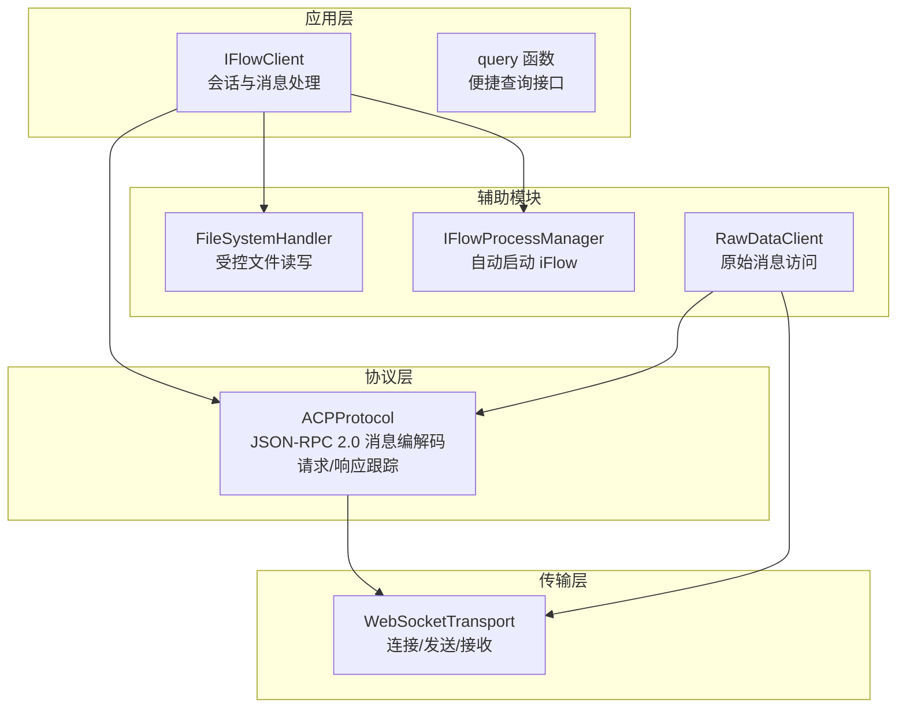
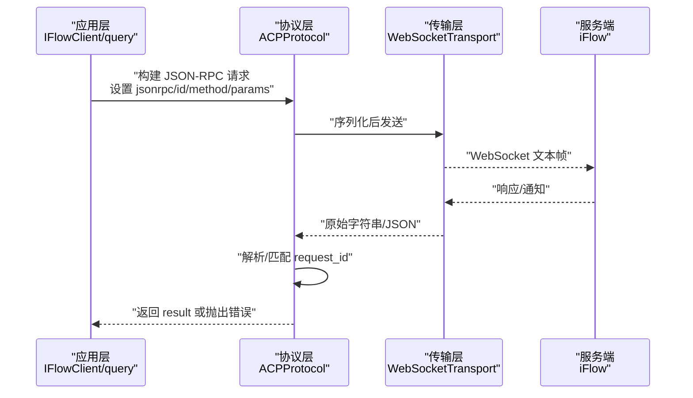
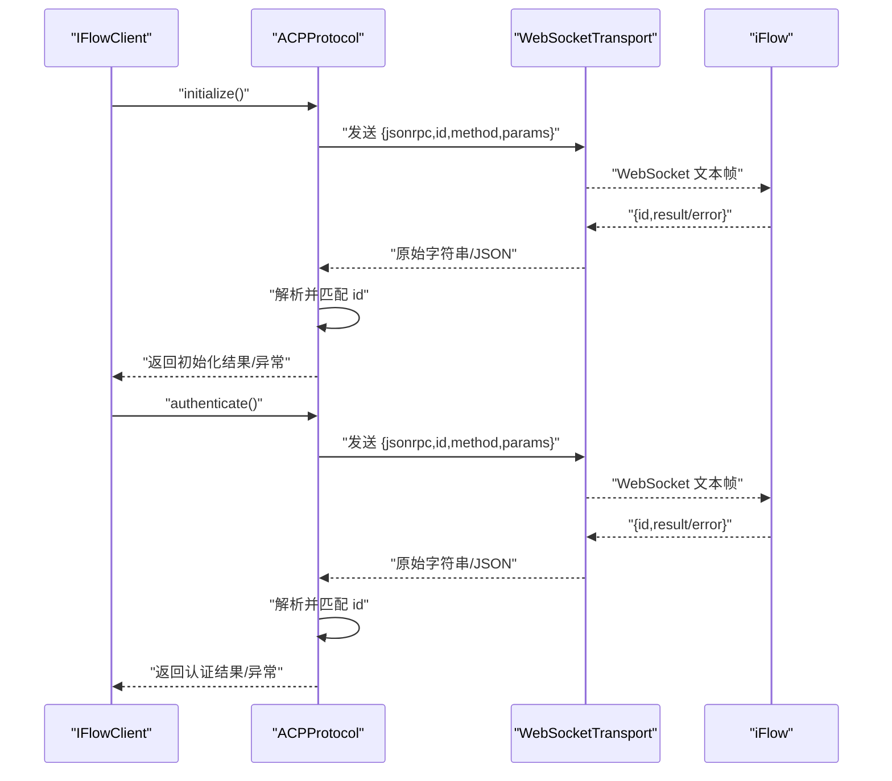
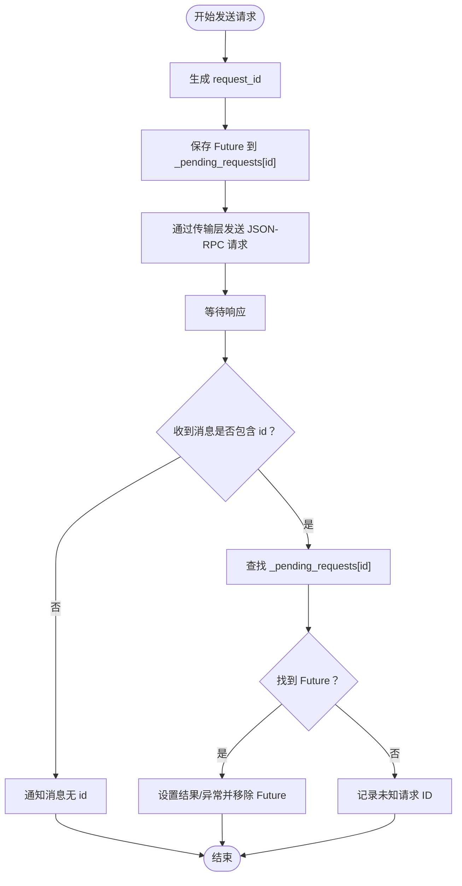
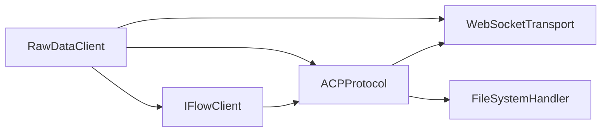

# 消息格式

<cite>
**本文引用的文件**
- [_internal/protocol.py](file://_internal/protocol.py)
- [client.py](file://client.py)
- [raw_client.py](file://raw_client.py)
- [types.py](file://types.py)
- [_errors.py](file://_errors.py)
- [_internal/transport.py](file://_internal/transport.py)
- [_internal/file_handler.py](file://_internal/file_handler.py)
- [_internal/process_manager.py](file://_internal/process_manager.py)
- [query.py](file://query.py)
</cite>

## 目录
1. [简介](#简介)
2. [项目结构](#项目结构)
3. [核心组件](#核心组件)
4. [架构总览](#架构总览)
5. [详细组件分析](#详细组件分析)
6. [依赖关系分析](#依赖关系分析)
7. [性能考量](#性能考量)
8. [故障排查指南](#故障排查指南)
9. [结论](#结论)
10. [附录](#附录)

## 简介
本节面向初学者与高级用户，系统阐述 ACP 协议中 JSON-RPC 2.0 消息格式在 SDK 中的应用。我们将从基础概念入手，逐步深入到请求、响应与通知三类消息的结构规范；并通过 session/prompt、session/update 等关键方法调用的构建与解析流程，解释 request_id 的跟踪机制及其在异步通信中的重要性。最后提供性能优化建议与常见错误排查方法，帮助读者高效、稳定地使用 SDK。

## 项目结构
SDK 采用分层设计：上层客户端负责会话管理与消息流处理，底层协议层负责 JSON-RPC 2.0 消息编解码与请求/响应跟踪，传输层封装 WebSocket 连接与收发，文件访问层提供受控的本地文件操作能力，进程管理器负责自动启动 iFlow 进程。

图表来源
- [client.py](file://client.py#L1-L120)
- [_internal/protocol.py](file://_internal/protocol.py#L1-L120)
- [_internal/transport.py](file://_internal/transport.py#L1-L120)
- [_internal/file_handler.py](file://_internal/file_handler.py#L1-L80)
- [_internal/process_manager.py](file://_internal/process_manager.py#L1-L80)
- [raw_client.py](file://raw_client.py#L1-L80)

章节来源
- [client.py](file://client.py#L1-L120)
- [_internal/protocol.py](file://_internal/protocol.py#L1-L120)
- [_internal/transport.py](file://_internal/transport.py#L1-L120)
- [_internal/file_handler.py](file://_internal/file_handler.py#L1-L80)
- [_internal/process_manager.py](file://_internal/process_manager.py#L1-L80)
- [raw_client.py](file://raw_client.py#L1-L80)

## 核心组件
- JSON-RPC 2.0 基础
  - 请求（Request）：包含 jsonrpc、id、method、params 字段，用于向服务端发起调用。
  - 响应（Response）：包含 jsonrpc、id、result 或 error 字段，用于返回调用结果或错误。
  - 通知（Notification）：仅包含 jsonrpc、method 字段，无 id，表示单向消息，不期望响应。
- ACP 协议中的消息类型
  - 请求：如 initialize、authenticate、session/new、session/prompt、session/cancel 等。
  - 响应：对上述请求的 result 或 error。
  - 通知：如 session/update（会话更新）、fs/read_text_file、fs/write_text_file 等由服务端发起的调用请求。
- request_id 跟踪
  - 客户端生成自增 request_id 并保存在挂起请求映射中，收到响应时按 id 匹配并完成 Future，实现请求/响应一一对应。

章节来源
- [_internal/protocol.py](file://_internal/protocol.py#L1-L120)
- [_internal/protocol.py](file://_internal/protocol.py#L447-L533)
- [_internal/protocol.py](file://_internal/protocol.py#L769-L786)

## 架构总览
下图展示了从应用层到传输层的消息流转路径，以及 JSON-RPC 2.0 在各层的职责分工。

图表来源
- [client.py](file://client.py#L399-L518)
- [_internal/protocol.py](file://_internal/protocol.py#L447-L533)
- [_internal/transport.py](file://_internal/transport.py#L85-L146)

章节来源
- [client.py](file://client.py#L399-L518)
- [_internal/protocol.py](file://_internal/protocol.py#L447-L533)
- [_internal/transport.py](file://_internal/transport.py#L85-L146)

## 详细组件分析

### JSON-RPC 2.0 基础与字段规范
- jsonrpc：固定为 "2.0"，标识遵循 JSON-RPC 2.0 规范。
- id：整数或字符串，用于唯一标识一次请求；通知消息不含 id。
- method：字符串，指定要调用的方法名。
- params：对象，方法参数集合；可选。
- result：对象或基本类型，表示成功响应的结果；仅出现在响应中。
- error：对象，包含 code、message 等字段，表示失败原因；仅出现在响应中。

章节来源
- [_internal/protocol.py](file://_internal/protocol.py#L447-L533)
- [_internal/protocol.py](file://_internal/protocol.py#L699-L719)

### 请求与响应：initialize 与 authenticate
- initialize
  - 请求：设置 jsonrpc、id、method 为 "initialize"，params 包含 protocolVersion 与 clientCapabilities。
  - 响应：若 error 存在则抛出协议错误；否则记录 isAuthenticated 与 protocolVersion。
- authenticate
  - 请求：设置 method 为 "authenticate"，params 包含 methodId 与可选 methodInfo。
  - 响应：校验返回的 methodId 与请求一致，标记认证状态。

图表来源
- [_internal/protocol.py](file://_internal/protocol.py#L113-L171)
- [_internal/protocol.py](file://_internal/protocol.py#L176-L256)

章节来源
- [_internal/protocol.py](file://_internal/protocol.py#L113-L171)
- [_internal/protocol.py](file://_internal/protocol.py#L176-L256)

### 会话管理：session/new 与 session/load
- session/new
  - 请求：method 为 "session/new"，params 包含 cwd、mcpServers、hooks、commands、agents、settings 等。
  - 响应：提取 sessionId；若未返回则回退为 "session_{request_id}"。
- session/load
  - 请求：method 为 "session/load"，params 包含 sessionId、cwd、mcpServers、hooks、commands、agents、settings 等。
  - 响应：与 session/new 类似，当前版本存在兼容性限制。

章节来源
- [_internal/protocol.py](file://_internal/protocol.py#L257-L346)
- [_internal/protocol.py](file://_internal/protocol.py#L347-L446)

### 发送提示：session/prompt
- 请求：method 为 "session/prompt"，params 包含 sessionId 与 prompt（内容块列表）。
- 响应：此方法为通知式调用，服务端可能直接返回 session/update 通知，无需显式响应。
- 返回值：返回本次请求使用的 request_id，便于外部跟踪。

章节来源
- [_internal/protocol.py](file://_internal/protocol.py#L447-L478)

### 会话更新通知：session/update
- 通知：method 为 "session/update"，params 包含 update（会话更新内容）与 sessionId。
- 处理：协议层将其转换为内部消息类型 "session_update"，并携带 update_type、agentId 等字段，供上层消费。

章节来源
- [_internal/protocol.py](file://_internal/protocol.py#L548-L566)

### 取消会话：session/cancel
- 请求：method 为 "session/cancel"，params 包含 sessionId。
- 响应：无显式响应，属于通知式调用。

章节来源
- [_internal/protocol.py](file://_internal/protocol.py#L479-L498)

### 文件系统调用：fs/read_text_file 与 fs/write_text_file
- fs/read_text_file
  - 服务器端请求：method 为 "fs/read_text_file"，params 包含 path、sessionId、limit、line 等。
  - 处理：若配置了 FileSystemHandler，则读取文件并返回 content；否则发送错误响应。
- fs/write_text_file
  - 服务器端请求：method 为 "fs/write_text_file"，params 包含 path、content、sessionId 等。
  - 处理：若允许写入且路径合法，则写入文件并返回 success；否则发送错误响应。

章节来源
- [_internal/protocol.py](file://_internal/protocol.py#L598-L660)
- [_internal/file_handler.py](file://_internal/file_handler.py#L89-L193)

### 工具调用与任务通知
- pushToolCall/updateToolCall/notifyTaskFinish
  - 服务器端请求：分别触发工具调用生成、更新与任务完成通知。
  - 处理：根据方法类型发送相应响应或直接返回内部消息类型，供上层处理。

章节来源
- [_internal/protocol.py](file://_internal/protocol.py#L661-L684)

### request_id 跟踪机制
- 生成：每次发起请求时递增 request_id，并存入挂起请求映射。
- 匹配：收到响应时按 id 查找对应 Future，设置结果或异常。
- 通知：通知消息不含 id，因此不会进入挂起映射，也不会阻塞 Future。
- 异步通信：通过 asyncio.Future 实现请求与响应的异步绑定，避免阻塞。

图表来源
- [_internal/protocol.py](file://_internal/protocol.py#L447-L533)
- [_internal/protocol.py](file://_internal/protocol.py#L769-L786)

章节来源
- [_internal/protocol.py](file://_internal/protocol.py#L447-L533)
- [_internal/protocol.py](file://_internal/protocol.py#L769-L786)

### 原始消息访问与调试
- RawDataClient
  - 提供原始 WebSocket 文本与解析后的消息双流，便于调试与审计。
  - 支持历史记录统计与打印，帮助定位问题。
- 使用场景
  - 开发阶段观察 JSON-RPC 消息细节。
  - 排查响应超时、乱序或重复等问题。

章节来源
- [raw_client.py](file://raw_client.py#L1-L120)
- [raw_client.py](file://raw_client.py#L120-L237)
- [raw_client.py](file://raw_client.py#L238-L362)

## 依赖关系分析
- 组件耦合
  - IFlowClient 依赖 ACPProtocol 与 WebSocketTransport，负责高层会话与消息处理。
  - ACPProtocol 依赖 WebSocketTransport 进行消息收发，依赖 FileSystemHandler 处理文件请求。
  - RawDataClient 扩展 IFlowClient，增加原始消息捕获与统计功能。
- 错误传播
  - 传输层异常向上抛出为 ConnectionError/TransportError/TimeoutError。
  - 协议层异常向上抛出为 ProtocolError/AuthenticationError/JSONDecodeError。
  - 应用层统一捕获并转换为业务语义化的错误信息。

图表来源
- [client.py](file://client.py#L1-L120)
- [_internal/protocol.py](file://_internal/protocol.py#L1-L120)
- [_internal/transport.py](file://_internal/transport.py#L1-L120)
- [_internal/file_handler.py](file://_internal/file_handler.py#L1-L80)
- [raw_client.py](file://raw_client.py#L1-L80)

章节来源
- [client.py](file://client.py#L1-L120)
- [_internal/protocol.py](file://_internal/protocol.py#L1-L120)
- [_internal/transport.py](file://_internal/transport.py#L1-L120)
- [_internal/file_handler.py](file://_internal/file_handler.py#L1-L80)
- [raw_client.py](file://raw_client.py#L1-L80)

## 性能考量
- 序列化与反序列化
  - 传输层在发送前进行 JSON 序列化，接收后按需解析；建议在高频调用场景减少不必要的中间对象创建。
  - 协议层对每个消息进行 JSON 解析，建议在上层合并小消息以降低解析开销。
- 流水线与并发
  - 使用 asyncio.Future 管理请求/响应匹配，避免阻塞；合理设置超时时间，防止挂起。
  - 对于大文件读写，FileSystemHandler 已内置大小限制与编码容错，避免内存峰值。
- 日志与可观测性
  - 传输层与协议层均记录调试日志，建议在生产环境调整日志级别，避免 I/O 影响。
- 资源清理
  - 断开连接时确保关闭 WebSocket、停止进程与释放队列资源，防止句柄泄漏。

[本节为通用指导，不直接分析具体文件]

## 故障排查指南
- 连接失败
  - 检查 WebSocket URL 与端口是否正确；确认 iFlow 是否已启动或启用自动启动。
  - 关注连接超时与连接关闭事件，必要时重试或增大超时。
- JSON 解析错误
  - 若收到非 JSON 文本或格式错误，协议层会抛出 JSONDecodeError；检查传输层是否正确序列化与反序列化。
- 认证失败
  - authenticate 返回 error 时，查看错误消息并核对 methodId 与 methodInfo 配置。
- 请求未响应
  - 检查 request_id 是否正确生成与匹配；确认 _pending_requests 映射中是否存在该 id。
  - 若长时间无响应，考虑超时策略与网络状况。
- 文件访问受限
  - FileSystemHandler 默认只允许当前目录；若报权限错误，请添加允许目录或调整只读模式。
- 会话加载不可用
  - 当前版本 iFlow 可能不支持 session/load，建议改用 session/new 创建新会话。

章节来源
- [_errors.py](file://_errors.py#L1-L85)
- [_internal/transport.py](file://_internal/transport.py#L85-L146)
- [_internal/protocol.py](file://_internal/protocol.py#L176-L256)
- [_internal/protocol.py](file://_internal/protocol.py#L447-L533)
- [_internal/file_handler.py](file://_internal/file_handler.py#L1-L80)
- [_internal/process_manager.py](file://_internal/process_manager.py#L152-L209)

## 结论
本文件系统性梳理了 ACP 协议中 JSON-RPC 2.0 的消息格式与实现要点，明确了请求、响应与通知的结构规范，并结合 session/prompt、session/update 等关键方法展示了消息构建与解析流程。通过 request_id 的跟踪机制，SDK 在异步通信中实现了可靠的请求/响应匹配。配合 RawDataClient 的原始消息访问能力与完善的错误体系，开发者可以高效地开发、调试与维护基于 ACP 的应用。

[本节为总结性内容，不直接分析具体文件]

## 附录

### JSON-RPC 2.0 消息示例（路径参考）
- 初始化请求
  - 参考路径：[_internal/protocol.py](file://_internal/protocol.py#L113-L135)
- 认证请求
  - 参考路径：[_internal/protocol.py](file://_internal/protocol.py#L198-L208)
- 会话创建请求
  - 参考路径：[_internal/protocol.py](file://_internal/protocol.py#L288-L306)
- 发送提示请求
  - 参考路径：[_internal/protocol.py](file://_internal/protocol.py#L466-L472)
- 会话取消请求
  - 参考路径：[_internal/protocol.py](file://_internal/protocol.py#L488-L494)
- 会话更新通知
  - 参考路径：[_internal/protocol.py](file://_internal/protocol.py#L548-L566)
- 文件读取请求
  - 参考路径：[_internal/protocol.py](file://_internal/protocol.py#L598-L629)
- 文件写入请求
  - 参考路径：[_internal/protocol.py](file://_internal/protocol.py#L631-L659)

### 常用方法与字段对照
- initialize
  - 方法名："initialize"
  - 参数：protocolVersion、clientCapabilities、可选 mcpServers、hooks、commands、agents
  - 返回：protocolVersion、isAuthenticated、agentCapabilities
- authenticate
  - 方法名："authenticate"
  - 参数：methodId、可选 methodInfo
  - 返回：认证结果（通常为 null 或包含 methodId）
- session/new
  - 方法名："session/new"
  - 参数：cwd、mcpServers、hooks、commands、agents、settings
  - 返回：sessionId
- session/prompt
  - 方法名："session/prompt"
  - 参数：sessionId、prompt（内容块数组）
  - 返回：request_id
- session/update
  - 方法名："session/update"
  - 参数：sessionId、update（包含 update_type、agentId 等）
  - 返回：内部消息类型 "session_update"
- fs/read_text_file
  - 方法名："fs/read_text_file"
  - 参数：path、sessionId、limit、line
  - 返回：content
- fs/write_text_file
  - 方法名："fs/write_text_file"
  - 参数：path、content、sessionId
  - 返回：success

章节来源
- [_internal/protocol.py](file://_internal/protocol.py#L113-L171)
- [_internal/protocol.py](file://_internal/protocol.py#L176-L256)
- [_internal/protocol.py](file://_internal/protocol.py#L257-L346)
- [_internal/protocol.py](file://_internal/protocol.py#L447-L498)
- [_internal/protocol.py](file://_internal/protocol.py#L548-L660)