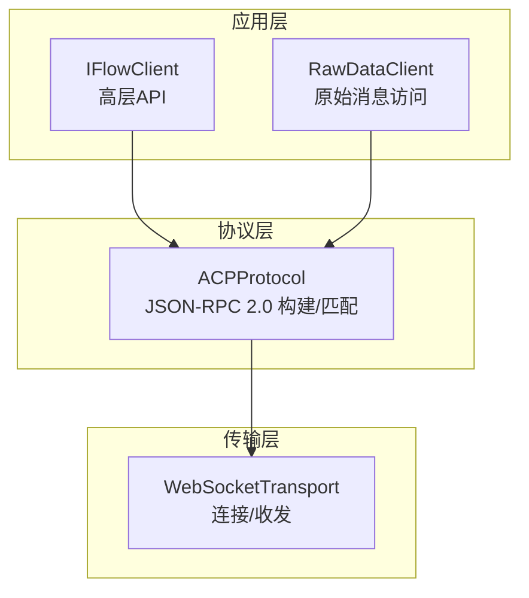
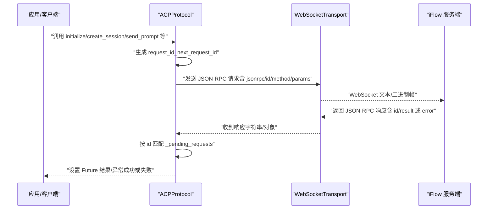
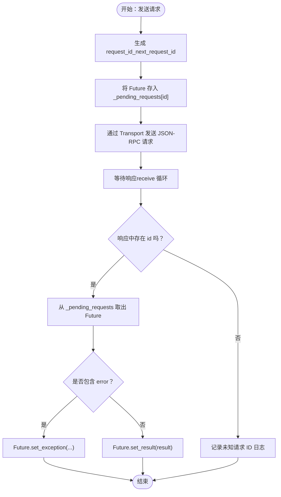
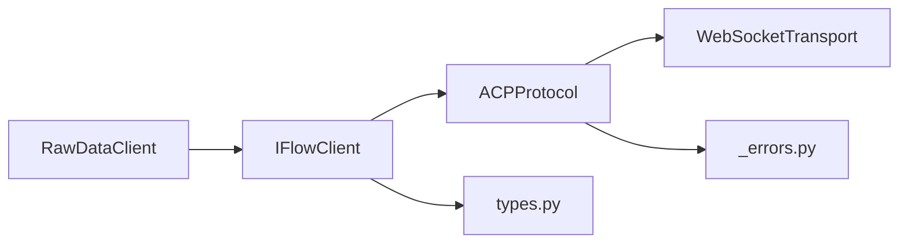

# 请求消息

<cite>
**本文引用的文件**
- [protocol.py](file://_internal/protocol.py)
- [client.py](file://client.py)
- [transport.py](file://_internal/transport.py)
- [types.py](file://types.py)
- [raw_client.py](file://raw_client.py)
- [_errors.py](file://_errors.py)
</cite>

## 目录
1. [简介](#简介)
2. [项目结构](#项目结构)
3. [核心组件](#核心组件)
4. [架构总览](#架构总览)
5. [详细组件分析](#详细组件分析)
6. [依赖关系分析](#依赖关系分析)
7. [性能考量](#性能考量)
8. [故障排查指南](#故障排查指南)
9. [结论](#结论)
10. [附录](#附录)

## 简介
本节面向初学者与高级用户，系统讲解 ACP 协议中基于 JSON-RPC 2.0 的请求消息结构。重点说明四要素：jsonrpc（固定为“2.0”）、id（唯一请求标识符，用于匹配请求与响应）、method（调用的方法名，如 initialize、authenticate、session/new、session/prompt 等）、params（参数对象）。文档结合 SDK 实现，给出在 initialize、create_session、send_prompt 等方法中如何构建合法请求消息；解释 request_id 的生成机制（_next_request_id）及其在异步通信中匹配请求与响应的关键作用；并提供参数校验、错误构造与性能优化建议。

## 项目结构
SDK 采用分层设计：
- 传输层：WebSocketTransport 负责连接、收发消息（字符串或字典），并在协议层解析 JSON。
- 协议层：ACPProtocol 封装 ACP 协议，负责消息构建、发送、接收、响应匹配、错误处理与客户端方法分发。
- 客户端封装：IFlowClient 提供高层 API（连接、会话管理、消息发送、工具确认等）。
- 类型与错误：types.py 定义消息类型与枚举；_errors.py 定义异常体系。
- 原始访问：RawDataClient 提供原始消息流与调试能力。

图表来源
- [client.py](file://client.py#L1-L120)
- [protocol.py](file://_internal/protocol.py#L21-L70)
- [transport.py](file://_internal/transport.py#L27-L120)

章节来源
- [client.py](file://client.py#L1-L120)
- [protocol.py](file://_internal/protocol.py#L21-L70)
- [transport.py](file://_internal/transport.py#L27-L120)

## 核心组件
- JSON-RPC 2.0 请求四要素
  - jsonrpc：固定为“2.0”
  - id：唯一请求标识符，由 _next_request_id 生成，用于匹配响应
  - method：方法名，如 initialize、authenticate、session/new、session/prompt、session/cancel 等
  - params：参数对象，包含该方法所需的参数键值对
- request_id 生成机制
  - ACPProtocol 内部维护自增计数器 _request_id，每次调用 _next_request_id 返回下一个整数作为请求 ID
  - 所有对外发送的请求均携带该 id 字段
- 响应匹配与异步通信
  - 协议层使用 _pending_requests 字典保存 Future，以 id 为键，等待服务器返回对应 id 的响应
  - 收到响应后按 id 匹配 Future 并设置结果或异常，从而完成异步通信闭环

章节来源
- [protocol.py](file://_internal/protocol.py#L45-L70)
- [protocol.py](file://_internal/protocol.py#L55-L63)
- [protocol.py](file://_internal/protocol.py#L775-L786)

## 架构总览
下面的时序图展示了典型请求流程：客户端发起请求（携带 jsonrpc、id、method、params），服务器返回响应（包含 id 与 result 或 error），协议层根据 id 匹配并完成异步通知。

图表来源
- [protocol.py](file://_internal/protocol.py#L113-L165)
- [protocol.py](file://_internal/protocol.py#L300-L346)
- [protocol.py](file://_internal/protocol.py#L447-L478)
- [protocol.py](file://_internal/protocol.py#L775-L786)
- [transport.py](file://_internal/transport.py#L85-L138)

## 详细组件分析

### JSON-RPC 2.0 请求消息结构
- 固定字段
  - jsonrpc：固定为“2.0”
  - id：整数型唯一请求标识符
- 方法与参数
  - initialize：初始化握手，params 可包含 protocolVersion、clientCapabilities、mcpServers、hooks、commands、agents 等
  - authenticate：认证，params 包含 methodId 与可选 methodInfo
  - session/new：创建会话，params 包含 cwd、mcpServers、hooks、commands、agents、settings 等
  - session/prompt：发送提示词，params 包含 sessionId 与 prompt（内容块列表）
  - session/cancel：取消当前会话，params 包含 sessionId
- 响应格式
  - 成功：包含 id 与 result
  - 失败：包含 id 与 error（包含 code 与 message）

章节来源
- [protocol.py](file://_internal/protocol.py#L113-L165)
- [protocol.py](file://_internal/protocol.py#L198-L210)
- [protocol.py](file://_internal/protocol.py#L288-L307)
- [protocol.py](file://_internal/protocol.py#L447-L478)
- [protocol.py](file://_internal/protocol.py#L488-L498)
- [protocol.py](file://_internal/protocol.py#L706-L718)

### request_id 的生成与匹配机制
- 生成：_next_request_id 每次调用将内部计数器加一并返回新 ID
- 存储：协议层维护 _pending_requests，以 id 为键存储 Future
- 匹配：收到响应时提取 id，若存在于 _pending_requests 中则取出并设置结果或异常
- 异步通信：调用方通过等待 Future 获取结果，避免阻塞

图表来源
- [protocol.py](file://_internal/protocol.py#L55-L63)
- [protocol.py](file://_internal/protocol.py#L775-L786)

章节来源
- [protocol.py](file://_internal/protocol.py#L45-L70)
- [protocol.py](file://_internal/protocol.py#L55-L63)
- [protocol.py](file://_internal/protocol.py#L775-L786)

### 在 initialize 中构建请求消息
- 步骤
  - 等待 //ready 控制信号
  - 生成 request_id
  - 组装 params：protocolVersion、clientCapabilities、可选 mcpServers、hooks、commands、agents
  - 构造请求：jsonrpc=“2.0”、id=request_id、method=“initialize”、params=params
  - 发送请求并等待响应
  - 解析响应：按 id 匹配，若 error 则抛出协议错误，否则记录初始化状态与认证状态
- 参数校验要点
  - protocolVersion 必填且需与服务端兼容
  - clientCapabilities 中 fs 权限声明需与实际能力一致
  - 可选配置（mcpServers、hooks、commands、agents）按需传入

章节来源
- [protocol.py](file://_internal/protocol.py#L101-L171)

### 在 create_session 中构建请求消息
- 步骤
  - 校验已初始化与已认证
  - 生成 request_id
  - 组装 params：cwd、mcpServers（可选）、hooks（可选）、commands（可选）、agents（可选）、settings（可选）
  - 构造请求：method=“session/new”
  - 发送请求并等待响应
  - 解析响应：按 id 匹配，若 error 抛出协议错误；若 result 中包含 sessionId 则返回，否则回退为“session_{request_id}”
- 参数校验要点
  - cwd 必须有效
  - settings 中 permission_mode 可通过 ApprovalMode 传递给服务端

章节来源
- [protocol.py](file://_internal/protocol.py#L257-L346)
- [types.py](file://types.py#L56-L73)

### 在 send_prompt 中构建请求消息
- 步骤
  - 校验已初始化与已认证
  - 生成 request_id
  - 组装 params：sessionId、prompt（内容块列表）
  - 构造请求：method=“session/prompt”
  - 发送请求并返回 request_id（用于后续匹配）
- 参数校验要点
  - prompt 内容块需符合协议定义（文本、图片、音频、资源链接等）
  - IFlowClient 已在高层封装中将文本与文件转换为内容块列表

章节来源
- [protocol.py](file://_internal/protocol.py#L447-L478)
- [client.py](file://client.py#L399-L497)

### 在 authenticate 中构建请求消息
- 步骤
  - 若已认证则直接返回
  - 生成 request_id
  - 组装 params：methodId（如 “iflow”）、可选 methodInfo（包含 apiKey、baseUrl、modelName 等）
  - 构造请求：method=“authenticate”
  - 发送请求并等待响应
  - 解析响应：按 id 匹配，若 error 抛出认证错误，否则记录认证状态
- 错误构造要点
  - 认证失败时抛出 AuthenticationError，并从 error.message 提取原因

章节来源
- [protocol.py](file://_internal/protocol.py#L176-L256)

### 在 cancel_session 中构建请求消息
- 步骤
  - 生成 request_id
  - 组装 params：sessionId
  - 构造请求：method=“session/cancel”
  - 发送请求（无等待返回）
- 使用场景
  - 用户中断生成或取消当前会话

章节来源
- [protocol.py](file://_internal/protocol.py#L488-L498)

### 响应处理与错误构造
- 响应处理
  - 协议层在 handle_messages 中解析 JSON，区分“方法调用”“响应”“错误”
  - 对于响应，按 id 匹配 _pending_requests 并设置结果或异常
- 错误构造
  - _send_error 构造标准 JSON-RPC 错误响应（包含 code 与 message）
  - _handle_client_error 将服务端错误映射为 SDK 层错误消息
  - _errors.py 定义了 ConnectionError、ProtocolError、AuthenticationError、TimeoutError、JSONDecodeError 等异常类型

章节来源
- [protocol.py](file://_internal/protocol.py#L514-L533)
- [protocol.py](file://_internal/protocol.py#L694-L718)
- [_errors.py](file://_errors.py#L10-L85)

### 高级用法：RawDataClient 与原始消息流
- RawDataClient 提供原始消息访问能力，包括：
  - receive_raw_messages：输出 RawMessage（包含 raw_data、json_data、message_type、is_control、parsed_message 等）
  - receive_dual_stream：将原始消息与解析后的消息进行关联
  - get_raw_history：获取历史消息
  - get_protocol_stats：统计消息类型与错误数量
  - send_raw：向传输层发送原始数据（绕过协议校验，谨慎使用）
- 应用场景
  - 调试协议交互、分析消息类型、定位问题

章节来源
- [raw_client.py](file://raw_client.py#L1-L120)
- [raw_client.py](file://raw_client.py#L120-L237)
- [raw_client.py](file://raw_client.py#L238-L362)

## 依赖关系分析
- 组件耦合
  - IFlowClient 依赖 ACPProtocol 与 WebSocketTransport
  - ACPProtocol 依赖 WebSocketTransport、错误类型与文件系统处理器（可选）
  - RawDataClient 继承 IFlowClient，扩展原始消息访问
- 关键依赖链
  - IFlowClient.connect → ACPProtocol.initialize/authenticate → WebSocketTransport.send/receive
  - ACPProtocol.handle_messages → _handle_response/_handle_client_error → _send_response/_send_error

图表来源
- [client.py](file://client.py#L1-L120)
- [protocol.py](file://_internal/protocol.py#L21-L70)
- [transport.py](file://_internal/transport.py#L27-L120)
- [types.py](file://types.py#L1-L60)
- [_errors.py](file://_errors.py#L10-L85)

章节来源
- [client.py](file://client.py#L1-L120)
- [protocol.py](file://_internal/protocol.py#L21-L70)
- [transport.py](file://_internal/transport.py#L27-L120)
- [types.py](file://types.py#L1-L60)
- [_errors.py](file://_errors.py#L10-L85)

## 性能考量
- 请求 ID 生成
  - 自增计数器简单高效，避免并发冲突；若需要更强健的唯一性，可在更高层引入 UUID 或时间戳前缀策略
- 响应匹配
  - 使用字典按 id 查找 Future，平均 O(1) 匹配；注意清理 _pending_requests，防止内存泄漏
- 超时控制
  - create_session、authenticate、load_session 等方法内置超时逻辑；建议在上层业务中结合 asyncio.wait_for 设置更细粒度的超时
- 消息大小
  - WebSocketTransport 默认最大消息大小约 10MB；大文件或长文本需分片或使用资源链接方式
- 流式处理
  - 服务端推送的 session/update 是流式通知，协议层在 handle_messages 中逐条处理，避免阻塞

章节来源
- [protocol.py](file://_internal/protocol.py#L300-L346)
- [protocol.py](file://_internal/protocol.py#L176-L256)
- [transport.py](file://_internal/transport.py#L60-L120)

## 故障排查指南
- 连接与传输
  - 连接失败：检查 URL、网络、防火墙；查看 ConnectionError 与 TimeoutError
  - 传输异常：查看 TransportError；确认连接未被关闭
- 协议错误
  - 初始化失败：检查 //ready 控制信号与 initialize 参数；查看 ProtocolError
  - 认证失败：检查 methodId 与 methodInfo；查看 AuthenticationError
  - 会话管理：检查 sessionId 是否正确；查看 ProtocolError
- JSON 解析
  - 无效 JSON：查看 JSONDecodeError，检查消息是否为字符串或字典
- 响应未达
  - 检查 _pending_requests 中是否存在对应 id；确认 id 未被重复使用
- 原始消息调试
  - 使用 RawDataClient 的 receive_raw_messages 或 receive_dual_stream，打印消息类型与内容，定位问题

章节来源
- [_errors.py](file://_errors.py#L10-L85)
- [protocol.py](file://_internal/protocol.py#L514-L533)
- [protocol.py](file://_internal/protocol.py#L176-L256)
- [protocol.py](file://_internal/protocol.py#L257-L346)
- [raw_client.py](file://raw_client.py#L120-L237)

## 结论
ACP 协议基于 JSON-RPC 2.0 的请求消息结构清晰、稳定：固定 jsonrpc 版本、唯一 id、明确 method 与 params。SDK 通过 ACPProtocol 统一封装请求构建、异步响应匹配与错误处理，使上层调用简洁可靠。初学者可直接使用 IFlowClient 的高层 API；高级用户可通过 RawDataClient 获取原始消息流，深入分析协议交互细节。遵循参数校验与错误构造规范，并结合超时与内存清理策略，可获得更稳健的性能表现。

## 附录
- 常见方法与参数要点
  - initialize：protocolVersion、clientCapabilities、mcpServers、hooks、commands、agents
  - authenticate：methodId、methodInfo（apiKey、baseUrl、modelName 等）
  - session/new：cwd、mcpServers、hooks、commands、agents、settings（permission_mode）
  - session/prompt：sessionId、prompt（内容块列表）
  - session/cancel：sessionId
- request_id 生成与匹配
  - 生成：_next_request_id 每次自增
  - 匹配：按 id 从 _pending_requests 中取出 Future 并设置结果/异常

章节来源
- [protocol.py](file://_internal/protocol.py#L113-L165)
- [protocol.py](file://_internal/protocol.py#L198-L210)
- [protocol.py](file://_internal/protocol.py#L288-L307)
- [protocol.py](file://_internal/protocol.py#L447-L478)
- [protocol.py](file://_internal/protocol.py#L488-L498)
- [protocol.py](file://_internal/protocol.py#L55-L63)
- [protocol.py](file://_internal/protocol.py#L775-L786)