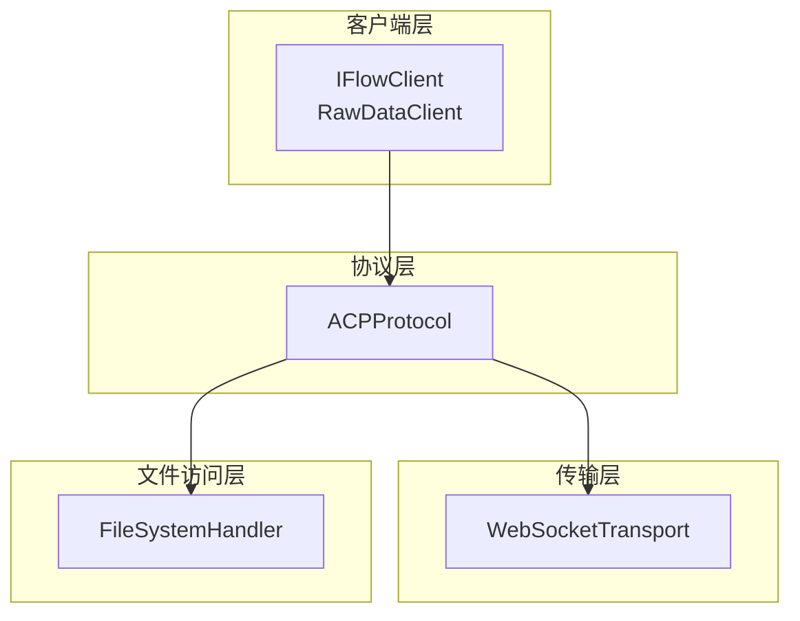
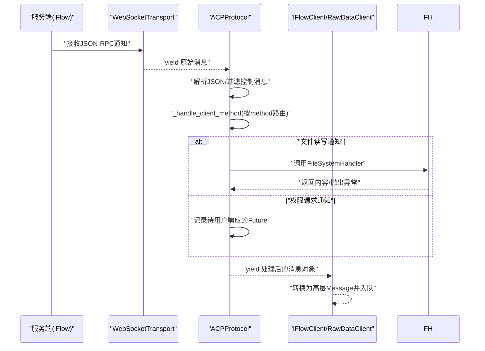
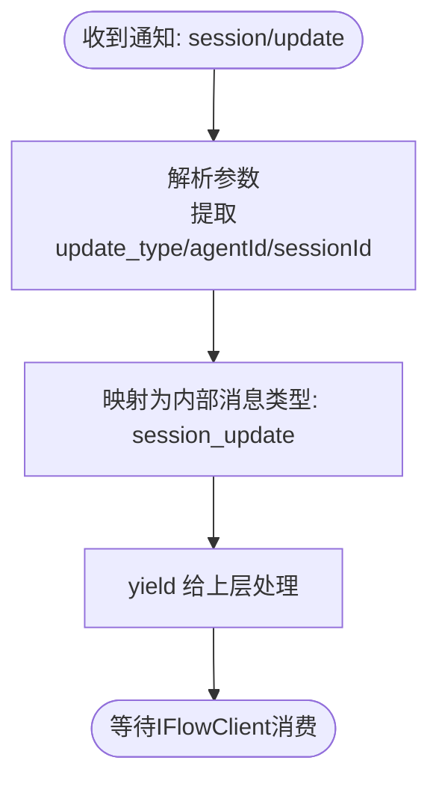
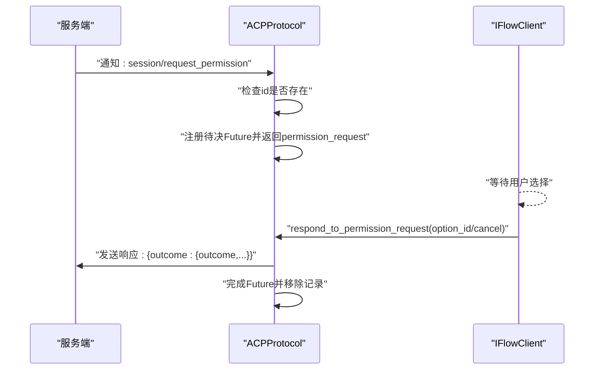
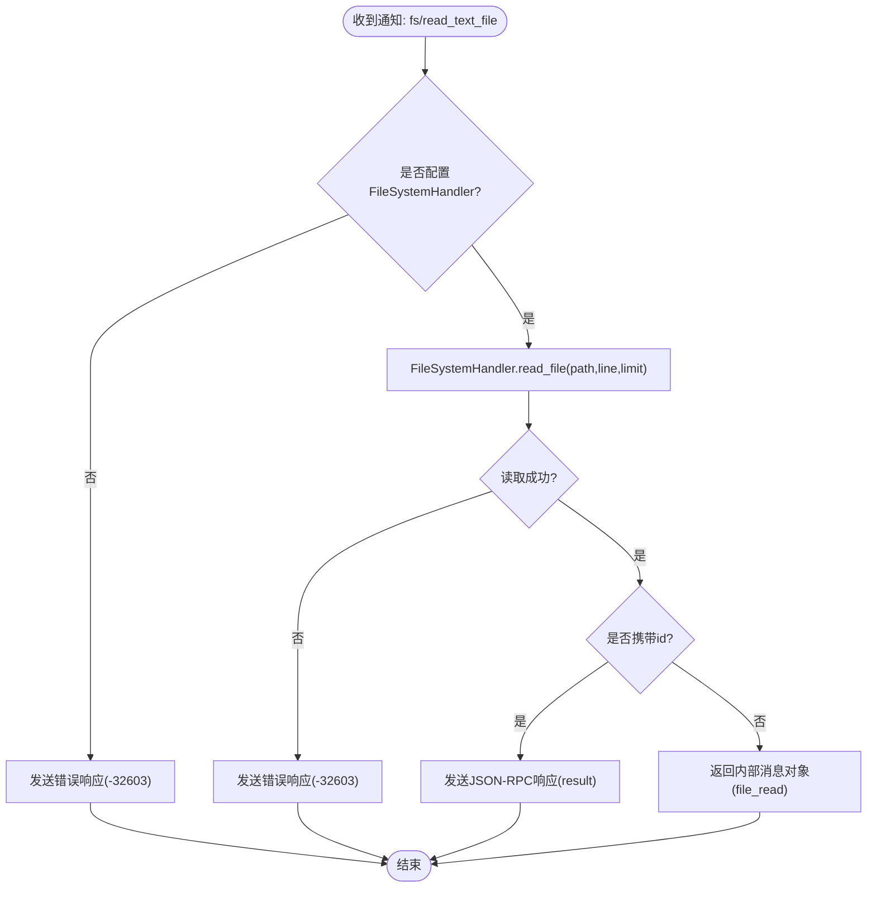
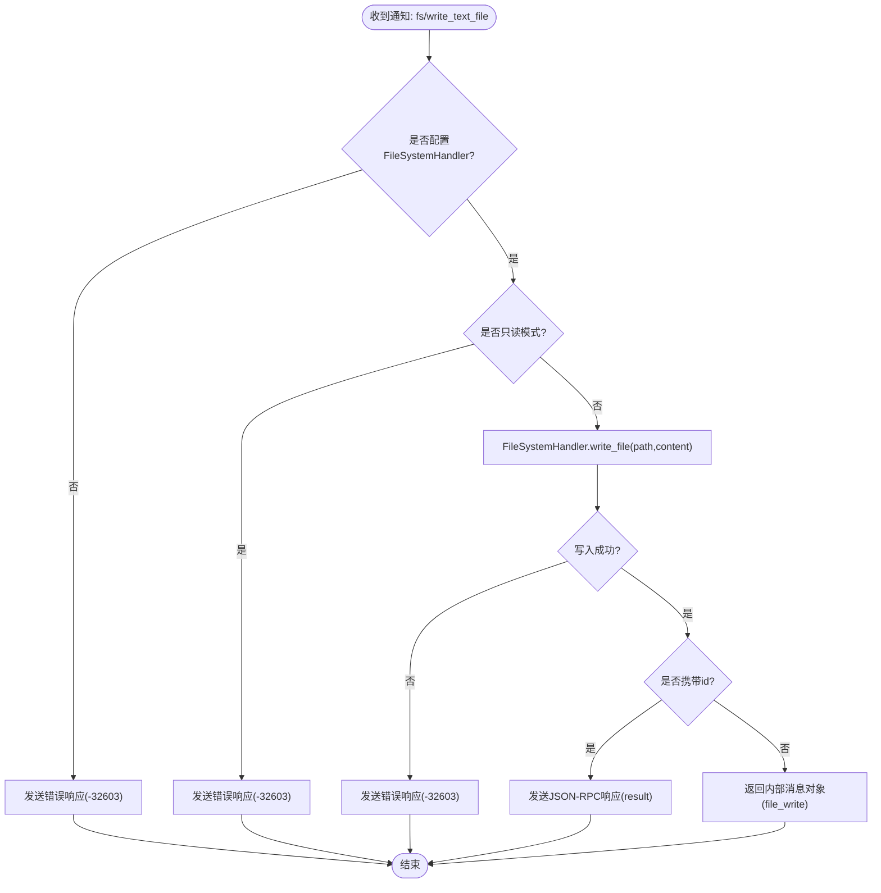
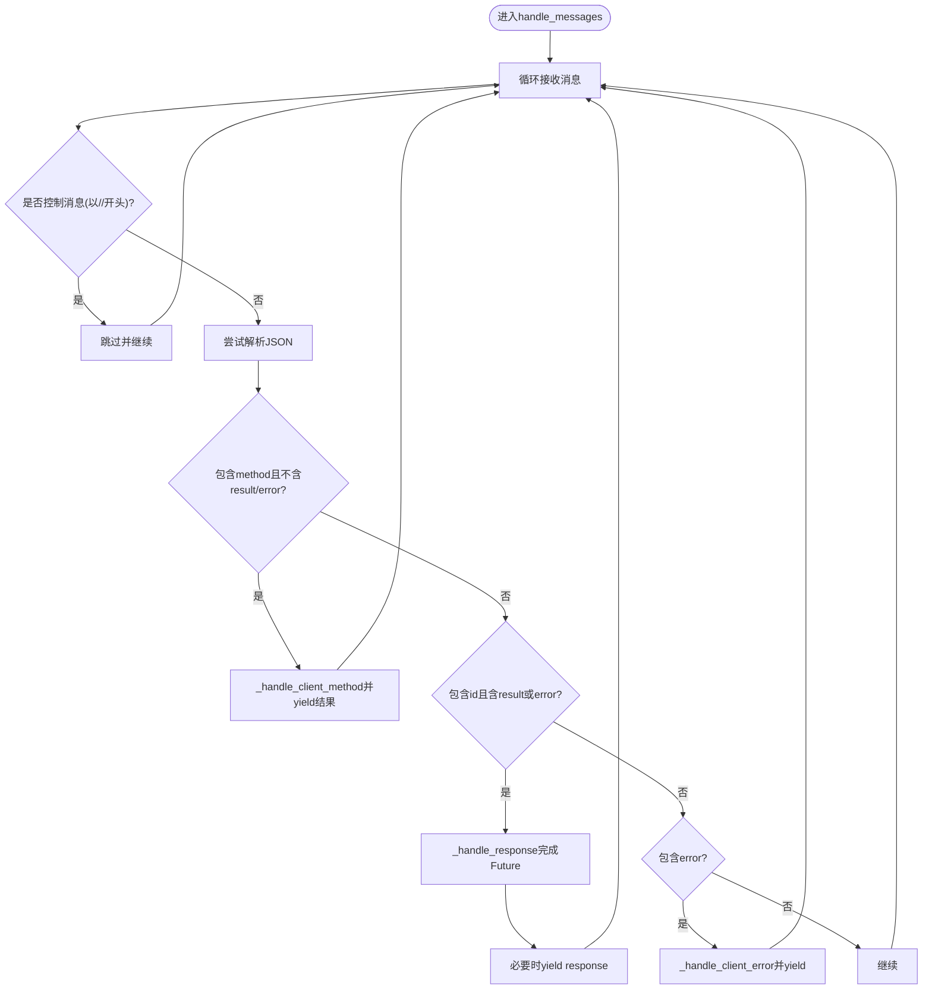
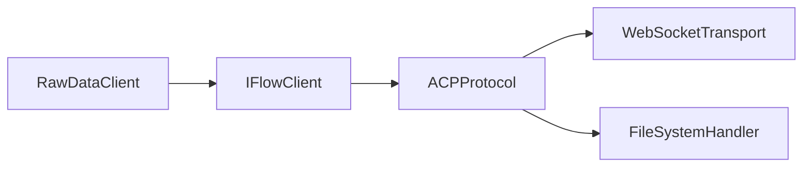
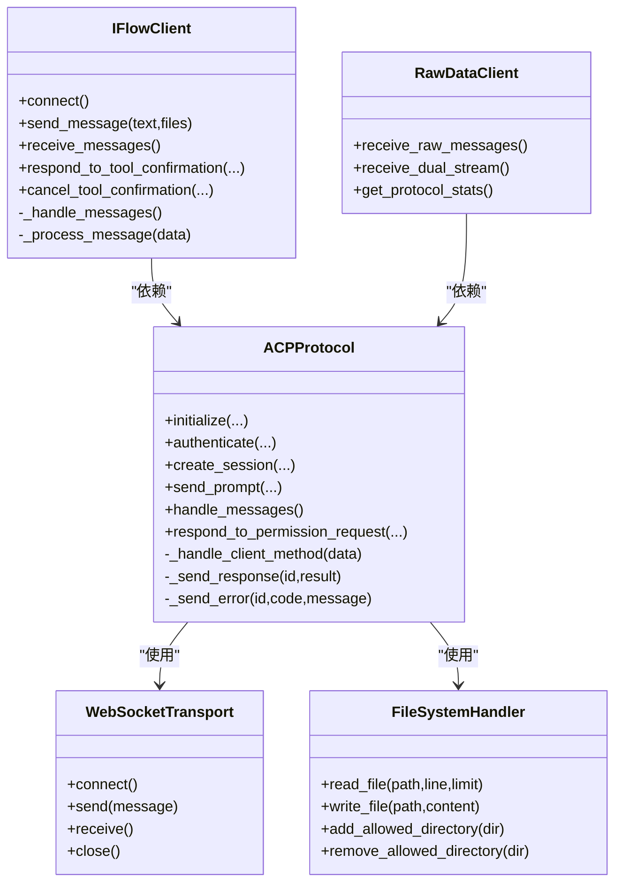

# 通知消息

<cite>
**本文引用的文件**
- [protocol.py](file://_internal/protocol.py)
- [file_handler.py](file://_internal/file_handler.py)
- [client.py](file://client.py)
- [raw_client.py](file://raw_client.py)
- [transport.py](file://_internal/transport.py)
- [types.py](file://types.py)
</cite>

## 目录
1. [引言](#引言)
2. [项目结构](#项目结构)
3. [核心组件](#核心组件)
4. [架构总览](#架构总览)
5. [详细组件分析](#详细组件分析)
6. [依赖关系分析](#依赖关系分析)
7. [性能考量](#性能考量)
8. [故障排查指南](#故障排查指南)
9. [结论](#结论)
10. [附录](#附录)

## 引言
本节聚焦于ACP协议中基于JSON-RPC 2.0的通知消息机制。通知消息是单向、无需响应的客户端接口调用，由服务端发起，SDK负责接收并处理。本文将系统阐述：
- 通知消息与请求/响应的区别：无id字段、无需响应。
- 核心通知类型：session/update（会话状态更新）、session/request_permission（工具调用权限请求）、fs/read_text_file（文件读取请求）、fs/write_text_file（文件写入请求）。
- 基于_handle_client_method的路由与处理流程，包括FileSystemHandler对文件操作的处理与权限确认响应的生成。
- 通知消息的JSON示例及其在双向通信与实时交互中的关键作用。
- 开发者使用异步迭代器handle_messages进行通知处理的实践指南。

## 项目结构
SDK采用分层设计：
- 协议层：ACPProtocol负责JSON-RPC解析、消息路由、请求/响应管理与错误处理。
- 传输层：WebSocketTransport负责底层连接、收发与控制消息过滤。
- 文件访问层：FileSystemHandler封装文件读写与安全策略。
- 客户端层：IFlowClient与RawDataClient提供高层API与原始消息访问能力。

图表来源
- [client.py](file://client.py#L1-L120)
- [protocol.py](file://_internal/protocol.py#L1-L120)
- [transport.py](file://_internal/transport.py#L1-L120)
- [file_handler.py](file://_internal/file_handler.py#L1-L60)

章节来源
- [client.py](file://client.py#L1-L120)
- [protocol.py](file://_internal/protocol.py#L1-L120)
- [transport.py](file://_internal/transport.py#L1-L120)
- [file_handler.py](file://_internal/file_handler.py#L1-L60)

## 核心组件
- ACPProtocol.handle_messages：异步迭代器，从传输层接收消息，区分“方法调用”（通知）与“响应”，并产出可被上层消费的消息对象。
- ACPProtocol._handle_client_method：根据method路由到具体处理逻辑，如session/update、session/request_permission、fs/read_text_file、fs/write_text_file等。
- FileSystemHandler：提供安全的文件读写能力，支持白名单目录、路径穿越防护、大小限制与只读模式。
- WebSocketTransport：提供WebSocket连接、发送、接收与控制消息过滤。

章节来源
- [protocol.py](file://_internal/protocol.py#L499-L533)
- [protocol.py](file://_internal/protocol.py#L534-L719)
- [file_handler.py](file://_internal/file_handler.py#L16-L60)
- [transport.py](file://_internal/transport.py#L114-L146)

## 架构总览
下图展示了通知消息从服务端到SDK再到应用层的完整链路。

图表来源
- [protocol.py](file://_internal/protocol.py#L508-L533)
- [protocol.py](file://_internal/protocol.py#L534-L719)
- [file_handler.py](file://_internal/file_handler.py#L90-L170)
- [client.py](file://client.py#L640-L670)

## 详细组件分析

### 通知消息与请求/响应的区别
- 请求/响应：包含id字段，服务端返回result或error；SDK通过_pending_requests跟踪并完成Future。
- 通知：不包含id字段，服务端仅单向推送，SDK无需响应。ACPProtocol在handle_messages中通过检测“存在method且不存在result/error”来识别通知。

章节来源
- [protocol.py](file://_internal/protocol.py#L508-L533)

### 核心通知类型与处理流程

#### 1) session/update（会话状态更新）
- 触发场景：服务端推送会话状态变化，如助手消息片段、思考过程、工具调用开始/更新、计划更新、用户消息回显等。
- 处理逻辑：ACPProtocol._handle_client_method将原始update映射为内部消息类型（如session_update），并携带agentId等上下文信息。
- 上层消费：IFlowClient._process_message将session_update转换为高层Message（如AssistantMessage、ToolCallMessage、PlanMessage等）。

图表来源
- [protocol.py](file://_internal/protocol.py#L548-L566)
- [client.py](file://client.py#L668-L784)

章节来源
- [protocol.py](file://_internal/protocol.py#L548-L566)
- [client.py](file://client.py#L668-L784)

#### 2) session/request_permission（工具调用权限请求）
- 触发场景：当ApprovalMode要求用户确认时，服务端发起权限请求通知。
- 处理逻辑：若通知携带id，则SDK创建Future用于等待用户决策；若未携带id，SDK记录错误（通知不应无id）。
- 用户决策：上层调用respond_to_permission_request，SDK构造outcome并发送响应，同时完成对应的Future。

图表来源
- [protocol.py](file://_internal/protocol.py#L567-L597)
- [protocol.py](file://_internal/protocol.py#L720-L768)
- [client.py](file://client.py#L529-L598)

章节来源
- [protocol.py](file://_internal/protocol.py#L567-L597)
- [protocol.py](file://_internal/protocol.py#L720-L768)
- [client.py](file://client.py#L529-L598)

#### 3) fs/read_text_file（文件读取请求）
- 触发场景：服务端需要读取本地文本文件。
- 处理逻辑：ACPProtocol._handle_client_method检查是否配置FileSystemHandler；若存在则调用read_file；若发生异常则发送错误响应；若携带id则同步发送结果响应。
- 返回值：若携带id，SDK会发送标准JSON-RPC响应；否则仅返回内部消息对象。

图表来源
- [protocol.py](file://_internal/protocol.py#L598-L630)
- [file_handler.py](file://_internal/file_handler.py#L90-L150)

章节来源
- [protocol.py](file://_internal/protocol.py#L598-L630)
- [file_handler.py](file://_internal/file_handler.py#L90-L150)

#### 4) fs/write_text_file（文件写入请求）
- 触发场景：服务端需要写入本地文本文件。
- 处理逻辑：ACPProtocol._handle_client_method检查FileSystemHandler与只读模式；若异常则发送错误响应；若携带id则同步发送结果响应。

图表来源
- [protocol.py](file://_internal/protocol.py#L631-L660)
- [file_handler.py](file://_internal/file_handler.py#L160-L193)

章节来源
- [protocol.py](file://_internal/protocol.py#L631-L660)
- [file_handler.py](file://_internal/file_handler.py#L160-L193)

### 异步迭代器模式（handle_messages）使用指南
- I/O模型：ACPProtocol.handle_messages是一个异步迭代器，持续从WebSocketTransport.receive()拉取消息。
- 过滤与解析：跳过控制消息（以//开头），尝试解析JSON；区分“方法调用”（通知）与“响应”两类。
- 通知路由：调用_internal方法将通知映射为内部消息对象，供上层消费。
- 响应处理：对于包含id且有result/error的消息，触发对应Future完成。
- 错误处理：JSON解析失败时抛出ProtocolError；未知方法时发送-32601错误响应。

图表来源
- [protocol.py](file://_internal/protocol.py#L508-L533)
- [protocol.py](file://_internal/protocol.py#L534-L719)

章节来源
- [protocol.py](file://_internal/protocol.py#L508-L533)
- [protocol.py](file://_internal/protocol.py#L534-L719)

### 通知消息的JSON示例与实时交互
- session/update示例要点
  - method: "session/update"
  - params.update.sessionUpdate: "agent_message_chunk"/"tool_call"/"tool_call_update"/"plan"等
  - 可选params.sessionId与update.agentId
- session/request_permission示例要点
  - method: "session/request_permission"
  - params.toolCall: 工具调用描述
  - params.options: 权限选项列表
  - 若为通知，通常不带id；若为请求，需带id以便SDK响应
- fs/read_text_file示例要点
  - method: "fs/read_text_file"
  - params.path: 文件路径
  - params.sessionId: 会话标识
  - params.limit/line: 可选行范围
- fs/write_text_file示例要点
  - method: "fs/write_text_file"
  - params.path: 文件路径
  - params.content: 文本内容
  - params.sessionId: 会话标识

这些通知构成了SDK与服务端之间的实时通道：服务端在工具调用、会话状态、文件操作等事件发生时主动推送，SDK通过handle_messages异步消费并驱动UI或业务逻辑更新。

章节来源
- [protocol.py](file://_internal/protocol.py#L548-L660)
- [client.py](file://client.py#L640-L784)

## 依赖关系分析
- IFlowClient依赖ACPProtocol进行消息处理，通过_background任务运行handle_messages并将结果转换为高层Message。
- ACPProtocol依赖WebSocketTransport进行网络I/O，并依赖FileSystemHandler执行文件操作。
- RawDataClient扩展了消息流，提供原始消息与解析消息的双流输出，便于调试与审计。

图表来源
- [client.py](file://client.py#L640-L670)
- [raw_client.py](file://raw_client.py#L120-L174)
- [protocol.py](file://_internal/protocol.py#L1-L60)
- [transport.py](file://_internal/transport.py#L1-L60)
- [file_handler.py](file://_internal/file_handler.py#L1-L40)

章节来源
- [client.py](file://client.py#L640-L670)
- [raw_client.py](file://raw_client.py#L120-L174)
- [protocol.py](file://_internal/protocol.py#L1-L60)

## 性能考量
- 异步I/O：handle_messages与WebSocketTransport均采用异步模型，避免阻塞主线程。
- 消息解析：仅在非控制消息时进行JSON解析，减少无效开销。
- 文件操作：FileSystemHandler对文件大小与路径进行限制，防止大文件与越权访问带来的资源消耗。
- 超时与重试：连接层具备超时与指数退避策略，提升稳定性。

[本节为通用建议，不直接分析具体文件]

## 故障排查指南
- 通知未到达上层
  - 检查是否为控制消息（以//开头）被过滤。
  - 确认消息是否为JSON格式，解析失败会抛出ProtocolError。
- 权限请求无响应
  - 确认通知是否携带id；若无id，SDK无法追踪用户响应。
  - 使用respond_to_permission_request正确提交用户选择。
- 文件读写失败
  - 确认FileSystemHandler已启用且允许目标目录。
  - 检查只读模式与文件大小限制。
  - 查看错误响应码（-32603）与日志。
- 响应未触发Future
  - 确保请求消息包含id，且响应消息id匹配。
  - 检查_pending_requests表是否被清理。

章节来源
- [protocol.py](file://_internal/protocol.py#L508-L533)
- [protocol.py](file://_internal/protocol.py#L720-L768)
- [file_handler.py](file://_internal/file_handler.py#L110-L193)

## 结论
ACP协议的通知机制通过JSON-RPC 2.0的“方法调用”形式实现了服务端到SDK的单向推送。SDK通过ACPProtocol.handle_messages与_internal路由机制，将不同通知映射为统一的内部消息对象，再由IFlowClient转换为高层Message，从而支撑实时、交互式的会话体验。文件系统通知与权限请求通知分别体现了SDK在安全边界内的协作能力与用户可控性。

[本节为总结性内容，不直接分析具体文件]

## 附录
- 类关系概览（基于源码）

图表来源
- [protocol.py](file://_internal/protocol.py#L1-L120)
- [transport.py](file://_internal/transport.py#L1-L120)
- [file_handler.py](file://_internal/file_handler.py#L1-L60)
- [client.py](file://client.py#L1-L120)
- [raw_client.py](file://raw_client.py#L72-L120)