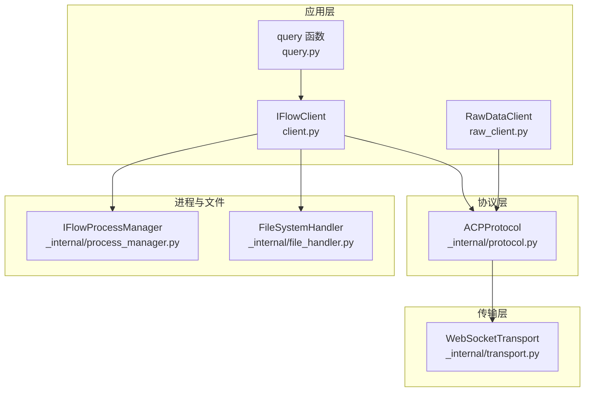
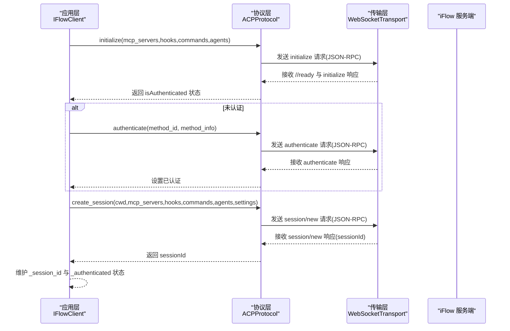
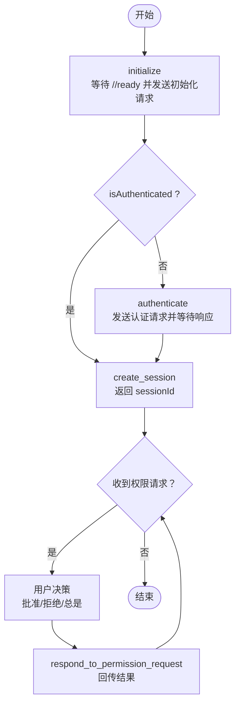
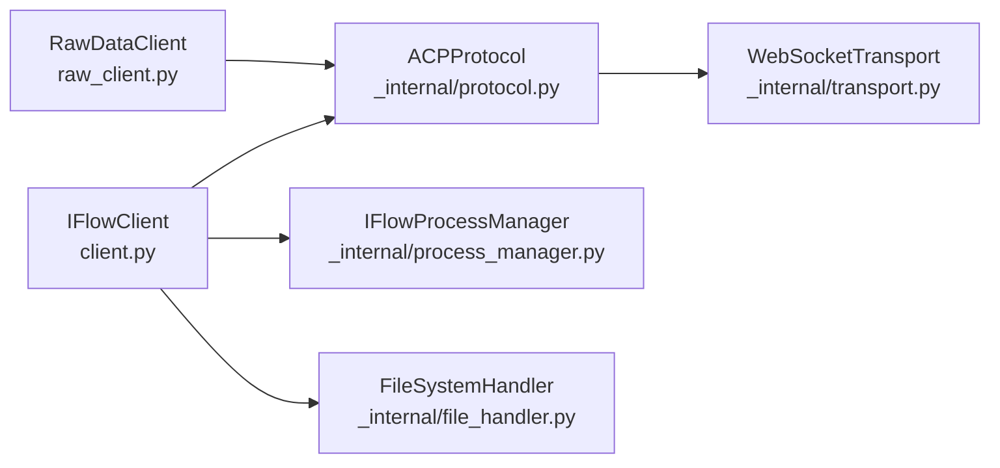

# 令牌生命周期管理

<cite>
**本文引用的文件**
- [client.py](file://client.py)
- [raw_client.py](file://raw_client.py)
- [types.py](file://types.py)
- [_internal/protocol.py](file://_internal/protocol.py)
- [_internal/transport.py](file://_internal/transport.py)
- [_internal/file_handler.py](file://_internal/file_handler.py)
- [_internal/process_manager.py](file://_internal/process_manager.py)
- [query.py](file://query.py)
- [_errors.py](file://_errors.py)
</cite>

## 目录
1. [引言](#引言)
2. [项目结构](#项目结构)
3. [核心组件](#核心组件)
4. [架构总览](#架构总览)
5. [详细组件分析](#详细组件分析)
6. [依赖关系分析](#依赖关系分析)
7. [性能考量](#性能考量)
8. [故障排查指南](#故障排查指南)
9. [结论](#结论)
10. [附录](#附录)

## 引言
本文件围绕 ACP（Agent Communication Protocol）认证令牌的完整生命周期进行系统化分析，重点覆盖：
- 令牌生成策略：安全随机数生成与令牌格式设计
- 刷新机制：刷新时机、刷新流程与异常处理
- 撤销流程：主动撤销与被动失效场景
- 过期策略与续期机制
- 令牌状态管理最佳实践
- 系统管理员的审计与监控指导

在当前代码库中，认证令牌并非以“字符串或字节序列”的形式直接暴露；SDK 的认证流程通过 ACP 协议的 initialize 与 authenticate 方法完成握手与认证，随后由服务端颁发会话级能力与权限。因此，本文将从“会话与权限”视角解读令牌生命周期，并给出可落地的管理建议与审计方案。

## 项目结构
SDK 采用分层架构：
- 应用层：客户端封装（IFlowClient、RawDataClient）、便捷查询函数（query）
- 协议层：ACP 协议实现（ACPProtocol），负责 JSON-RPC 交互、消息编解码、权限请求转发
- 传输层：WebSocketTransport，负责连接、收发、错误处理
- 进程与文件：进程管理（IFlowProcessManager）、文件访问（FileSystemHandler）
- 类型与错误：统一的消息类型定义与异常体系

图表来源
- [client.py](file://client.py#L110-L318)
- [_internal/protocol.py](file://_internal/protocol.py#L64-L171)
- [_internal/transport.py](file://_internal/transport.py#L53-L146)
- [_internal/process_manager.py](file://_internal/process_manager.py#L152-L209)
- [_internal/file_handler.py](file://_internal/file_handler.py#L16-L58)
- [raw_client.py](file://raw_client.py#L108-L173)
- [query.py](file://query.py#L15-L71)

章节来源
- [client.py](file://client.py#L110-L318)
- [_internal/protocol.py](file://_internal/protocol.py#L64-L171)
- [_internal/transport.py](file://_internal/transport.py#L53-L146)
- [_internal/process_manager.py](file://_internal/process_manager.py#L152-L209)
- [_internal/file_handler.py](file://_internal/file_handler.py#L16-L58)
- [raw_client.py](file://raw_client.py#L108-L173)
- [query.py](file://query.py#L15-L71)

## 核心组件
- IFlowClient：主客户端，负责连接、认证、会话创建、消息收发、工具调用确认等
- ACPProtocol：ACP 协议实现，负责 initialize/authenticate、会话管理、权限请求转发、响应处理
- WebSocketTransport：WebSocket 传输层，负责连接、发送、接收、关闭与错误处理
- RawDataClient：扩展客户端，提供原始消息流与解析消息流的双通道，便于审计与调试
- IFlowProcessManager：iFlow 进程管理器，负责自动启动/停止本地 iFlow 实例
- FileSystemHandler：文件系统访问控制，限制目录白名单、路径穿越、大小限制与只读模式
- query：便捷查询函数，简化一次性对话

章节来源
- [client.py](file://client.py#L110-L318)
- [_internal/protocol.py](file://_internal/protocol.py#L21-L786)
- [_internal/transport.py](file://_internal/transport.py#L27-L177)
- [raw_client.py](file://raw_client.py#L72-L237)
- [_internal/process_manager.py](file://_internal/process_manager.py#L25-L254)
- [_internal/file_handler.py](file://_internal/file_handler.py#L16-L217)
- [query.py](file://query.py#L15-L137)

## 架构总览
下图展示认证与会话建立的关键交互，以及令牌（会话权限）如何在各层流转。

图表来源
- [_internal/protocol.py](file://_internal/protocol.py#L64-L171)
- [_internal/protocol.py](file://_internal/protocol.py#L176-L256)
- [_internal/protocol.py](file://_internal/protocol.py#L257-L346)
- [client.py](file://client.py#L255-L310)

章节来源
- [_internal/protocol.py](file://_internal/protocol.py#L64-L171)
- [_internal/protocol.py](file://_internal/protocol.py#L176-L256)
- [_internal/protocol.py](file://_internal/protocol.py#L257-L346)
- [client.py](file://client.py#L255-L310)

## 详细组件分析

### 认证与会话生命周期（令牌视角）
- 初始化与认证
  - initialize：等待服务端控制信号，发送初始化请求，返回协议版本与是否已认证
  - authenticate：当 isAuthenticated 为假时，发送认证请求，等待响应并设置认证状态
- 会话创建
  - create_session：在认证后创建会话，返回 sessionId；若超时则回退到基于请求ID的标识
- 权限请求与工具调用
  - handle_messages：接收服务端推送的权限请求（如 requestPermission），SDK 将其转交上层用户决策
  - respond_to_permission_request：根据用户选择（允许一次/总是/拒绝）向服务端回传结果

图表来源
- [_internal/protocol.py](file://_internal/protocol.py#L64-L171)
- [_internal/protocol.py](file://_internal/protocol.py#L176-L256)
- [_internal/protocol.py](file://_internal/protocol.py#L257-L346)
- [_internal/protocol.py](file://_internal/protocol.py#L567-L597)
- [_internal/protocol.py](file://_internal/protocol.py#L720-L768)

章节来源
- [_internal/protocol.py](file://_internal/protocol.py#L64-L171)
- [_internal/protocol.py](file://_internal/protocol.py#L176-L256)
- [_internal/protocol.py](file://_internal/protocol.py#L257-L346)
- [_internal/protocol.py](file://_internal/protocol.py#L567-L597)
- [_internal/protocol.py](file://_internal/protocol.py#L720-L768)

### 令牌生成策略
- 安全随机数生成
  - 代码库未直接暴露“令牌生成器”。认证与会话建立由服务端负责，SDK 仅执行握手与回传用户决策
  - 若需自定义令牌生成策略，应在应用侧引入安全随机源（如操作系统提供的 CSPRNG），并与服务端约定格式与签名
- 令牌格式设计
  - 当前 SDK 不直接操作令牌字符串；会话标识以 sessionId 形式在协议层传递
  - 建议：令牌采用紧凑、不可逆的短标识（如 UUID 或随机字节编码），并携带签名校验字段，便于服务端快速校验与审计

章节来源
- [_internal/protocol.py](file://_internal/protocol.py#L257-L346)
- [_internal/protocol.py](file://_internal/protocol.py#L347-L446)

### 刷新机制
- 刷新时机
  - 代码库未实现自动刷新逻辑。通常由服务端在认证失败或会话过期时触发重新认证
- 刷新流程
  - 若认证失败，SDK 将抛出认证异常；上层可捕获并触发重新 authenticate 流程
  - 会话层面：若会话被服务端回收，需重新 create_session 获取新的 sessionId
- 异常处理
  - 认证超时与连接中断在协议层有明确的超时与异常类型，上层应重试并记录日志

章节来源
- [_internal/protocol.py](file://_internal/protocol.py#L176-L256)
- [_internal/protocol.py](file://_internal/protocol.py#L257-L346)
- [_errors.py](file://_errors.py#L10-L85)

### 撤销流程
- 主动撤销
  - SDK 提供取消会话的能力（cancel_session），用于中断当前任务，不等同于撤销认证令牌
  - 对于权限请求，可通过 respond_to_permission_request 传入取消选项，拒绝工具调用
- 被动失效
  - 会话超时、连接断开、服务端策略变更等导致的失效，SDK 通过异常与状态位提示上层重建会话

章节来源
- [_internal/protocol.py](file://_internal/protocol.py#L479-L498)
- [_internal/protocol.py](file://_internal/protocol.py#L720-L768)

### 过期策略与续期机制
- 过期策略
  - 代码库未显式配置过期时间；会话有效期由服务端策略决定
- 续期机制
  - SDK 未内置自动续期；建议上层在收到认证失败或会话无效时，按指数退避重试 authenticate 与 create_session

章节来源
- [_internal/protocol.py](file://_internal/protocol.py#L64-L171)
- [_internal/protocol.py](file://_internal/protocol.py#L176-L256)
- [_internal/protocol.py](file://_internal/protocol.py#L257-L346)

### 令牌状态管理最佳实践
- 状态位维护
  - 客户端维护 _authenticated 与 _session_id，避免重复认证与非法请求
- 会话隔离
  - 每个 IFlowClient 实例独立管理自己的会话；多实例并发时注意 sessionId 的唯一性与作用域
- 权限最小化
  - 使用 ApprovalMode 控制工具调用权限，减少高危操作的自动执行
- 可观测性
  - 使用 RawDataClient 的原始消息流与统计接口，记录消息类型分布、错误计数与时间线，辅助审计

章节来源
- [client.py](file://client.py#L110-L128)
- [types.py](file://types.py#L56-L73)
- [raw_client.py](file://raw_client.py#L238-L273)

### 审计与监控指导（面向系统管理员）
- 原始消息采集
  - 使用 RawDataClient 的 receive_raw_messages 与 receive_dual_stream，捕获原始 JSON 与解析后的消息，形成审计轨迹
- 统计与告警
  - 使用 get_protocol_stats 统计消息类型、控制消息、JSON 文本与错误数量，结合阈值触发告警
- 会话分析
  - 使用 ProtocolDebugger 打印消息摘要与时间线，定位异常请求与权限决策点
- 日志与追踪
  - 结合 SDK 日志级别与异常类型，建立统一的日志聚合与检索体系，支持按会话 ID、方法名、错误码过滤

章节来源
- [raw_client.py](file://raw_client.py#L143-L237)
- [raw_client.py](file://raw_client.py#L238-L273)
- [raw_client.py](file://raw_client.py#L293-L362)
- [_errors.py](file://_errors.py#L10-L85)

## 依赖关系分析
- 组件耦合
  - IFlowClient 依赖 ACPProtocol 与 WebSocketTransport；RawDataClient 继承 IFlowClient 并增强消息流
  - ACPProtocol 依赖 WebSocketTransport；FileSystemHandler 作为可选组件注入到协议层
- 外部依赖
  - WebSocketTransport 依赖 websockets 库；IFlowProcessManager 依赖子进程与系统套接字
- 循环依赖
  - 无循环依赖；模块职责清晰，接口边界明确

图表来源
- [client.py](file://client.py#L110-L318)
- [_internal/protocol.py](file://_internal/protocol.py#L21-L786)
- [_internal/transport.py](file://_internal/transport.py#L27-L177)
- [_internal/process_manager.py](file://_internal/process_manager.py#L152-L209)
- [_internal/file_handler.py](file://_internal/file_handler.py#L16-L58)
- [raw_client.py](file://raw_client.py#L72-L173)

章节来源
- [client.py](file://client.py#L110-L318)
- [_internal/protocol.py](file://_internal/protocol.py#L21-L786)
- [_internal/transport.py](file://_internal/transport.py#L27-L177)
- [_internal/process_manager.py](file://_internal/process_manager.py#L152-L209)
- [_internal/file_handler.py](file://_internal/file_handler.py#L16-L58)
- [raw_client.py](file://raw_client.py#L72-L173)

## 性能考量
- 连接与重试
  - 传输层提供连接超时与异常处理；客户端在连接失败时进行有限次重试与指数回退
- 消息吞吐
  - 传输层对大消息设置上限；协议层对 JSON 解析失败进行容错
- 会话并发
  - 多客户端实例并行时，建议为每个实例分配独立端口与会话，避免资源争用

章节来源
- [_internal/transport.py](file://_internal/transport.py#L53-L146)
- [client.py](file://client.py#L204-L221)

## 故障排查指南
- 连接失败
  - 检查 URL 与端口；确认服务端可达；查看连接超时与异常类型
- 认证失败
  - 核对认证方法 ID 与参数；关注认证超时与错误响应；必要时重新发起 authenticate
- 会话无效
  - 触发 session/new 重试；检查 sessionId 是否正确；关注权限请求未决队列
- 文件访问问题
  - 确认 FileSystemHandler 的目录白名单与只读模式；检查路径穿越与文件大小限制

章节来源
- [_errors.py](file://_errors.py#L10-L85)
- [_internal/transport.py](file://_internal/transport.py#L53-L146)
- [_internal/protocol.py](file://_internal/protocol.py#L176-L256)
- [_internal/protocol.py](file://_internal/protocol.py#L257-L346)
- [_internal/file_handler.py](file://_internal/file_handler.py#L16-L217)

## 结论
- 代码库中的“令牌”以会话与权限的形式存在，而非显式的字符串令牌
- 生命周期管理的关键在于：正确的初始化与认证、会话创建与维护、权限请求的及时处理与撤销
- 建议在应用层引入自定义令牌生成与签名校验，并结合 RawDataClient 与统计接口构建完善的审计与监控体系
- 对于刷新与续期，建议采用指数退避与幂等重试策略，确保在服务端策略变化时保持稳健

## 附录
- 关键流程路径参考
  - 初始化与认证：[client.py](file://client.py#L255-L276)，[_internal/protocol.py](file://_internal/protocol.py#L64-L171)，[_internal/protocol.py](file://_internal/protocol.py#L176-L256)
  - 会话创建：[_internal/protocol.py](file://_internal/protocol.py#L257-L346)
  - 权限请求与回传：[_internal/protocol.py](file://_internal/protocol.py#L567-L597)，[_internal/protocol.py](file://_internal/protocol.py#L720-L768)
  - 原始消息与统计：[raw_client.py](file://raw_client.py#L143-L237)，[raw_client.py](file://raw_client.py#L238-L273)
  - 进程管理与 URL：[_internal/process_manager.py](file://_internal/process_manager.py#L152-L209)