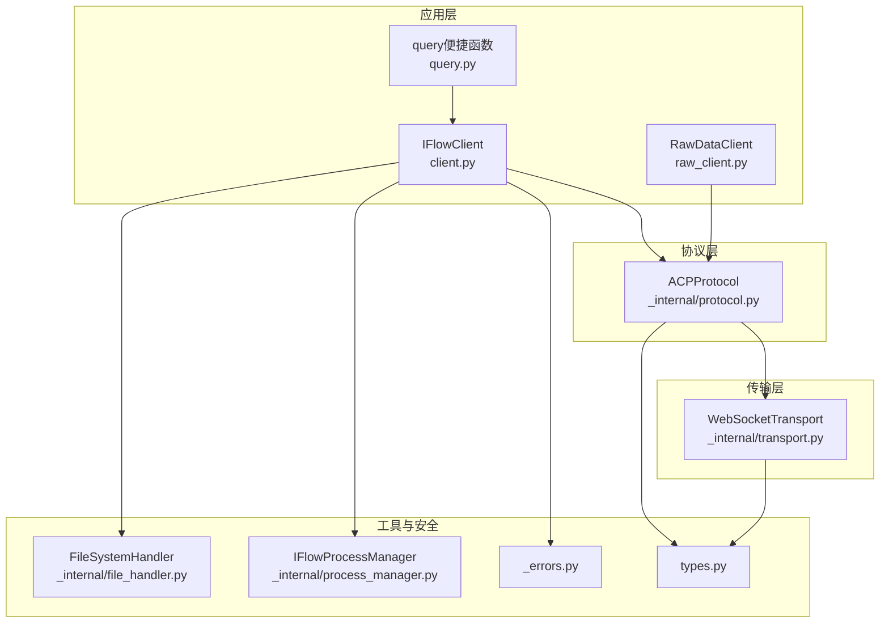
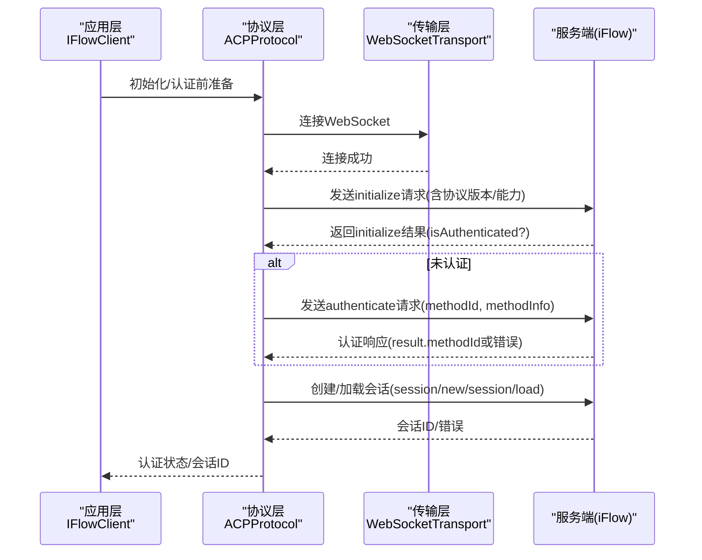
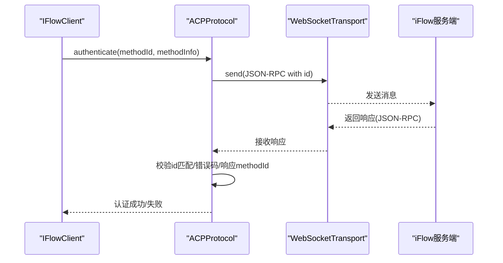
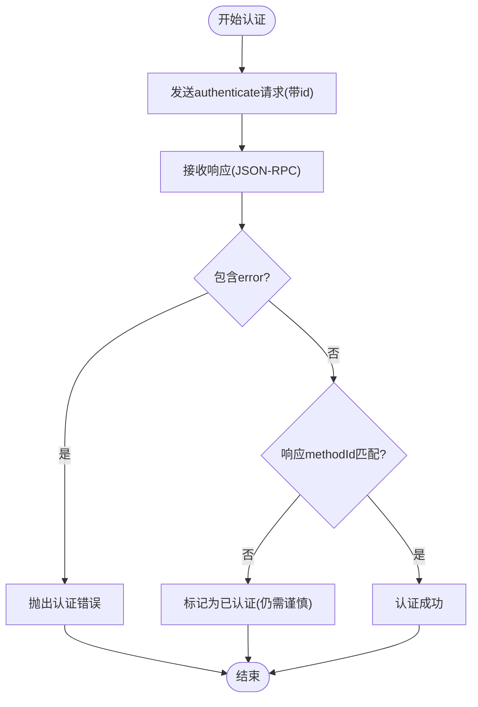
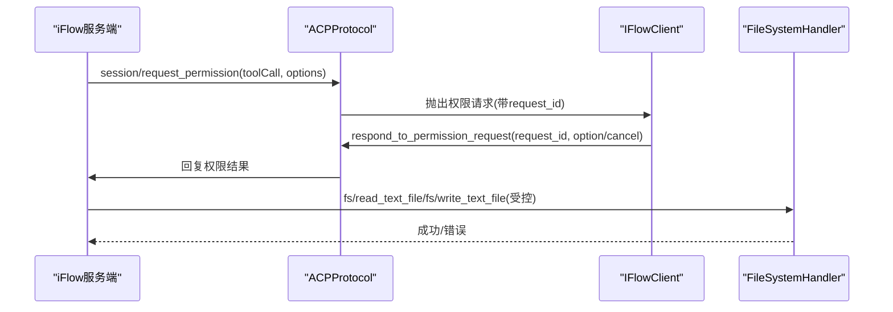
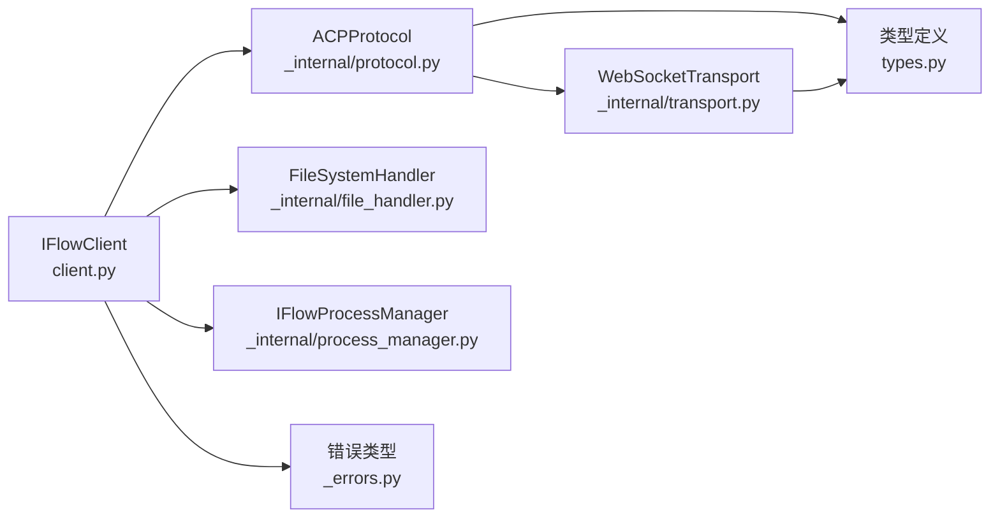

# 安全威胁防护

<cite>
**本文引用的文件**
- [client.py](file://client.py)
- [protocol.py](file://_internal/protocol.py)
- [transport.py](file://_internal/transport.py)
- [types.py](file://types.py)
- [_errors.py](file://_errors.py)
- [raw_client.py](file://raw_client.py)
- [query.py](file://query.py)
- [file_handler.py](file://_internal/file_handler.py)
- [process_manager.py](file://_internal/process_manager.py)
</cite>

## 目录
1. [引言](#引言)
2. [项目结构](#项目结构)
3. [核心组件](#核心组件)
4. [架构总览](#架构总览)
5. [详细组件分析](#详细组件分析)
6. [依赖关系分析](#依赖关系分析)
7. [性能与安全特性](#性能与安全特性)
8. [故障排查指南](#故障排查指南)
9. [结论](#结论)
10. [附录：安全配置建议](#附录安全配置建议)

## 引言
本文件聚焦于ACP（Agent Communication Protocol）认证机制在iFlow SDK中的实现与安全实践，系统性分析可能面临的重放攻击、中间人攻击、暴力破解等威胁，并结合代码实现给出针对性的防护策略与配置建议，帮助构建纵深防御体系。

## 项目结构
SDK采用分层设计：
- 应用层：客户端封装（IFlowClient、RawDataClient、query便捷函数）
- 协议层：ACP协议处理（JSON-RPC 2.0封装、请求ID管理、权限请求跟踪）
- 传输层：WebSocket传输（连接、收发、错误处理）
- 工具与安全：文件访问控制、进程管理、错误类型定义

图表来源
- [client.py](file://client.py#L1-L120)
- [_internal/protocol.py](file://_internal/protocol.py#L1-L120)
- [_internal/transport.py](file://_internal/transport.py#L1-L120)
- [_internal/file_handler.py](file://_internal/file_handler.py#L1-L80)
- [_internal/process_manager.py](file://_internal/process_manager.py#L1-L80)
- [_errors.py](file://_errors.py#L1-L85)
- [types.py](file://types.py#L1-L120)

章节来源
- [client.py](file://client.py#L1-L120)
- [_internal/protocol.py](file://_internal/protocol.py#L1-L120)
- [_internal/transport.py](file://_internal/transport.py#L1-L120)
- [_internal/file_handler.py](file://_internal/file_handler.py#L1-L80)
- [_internal/process_manager.py](file://_internal/process_manager.py#L1-L80)
- [_errors.py](file://_errors.py#L1-L85)
- [types.py](file://types.py#L1-L120)

## 核心组件
- IFlowClient：对外暴露的主客户端，负责连接、会话创建、消息发送与接收、工具调用确认、生命周期管理。
- ACPProtocol：实现ACP协议握手、认证、会话管理、消息处理与权限请求跟踪；内置请求ID生成器，确保请求/响应匹配。
- WebSocketTransport：WebSocket连接、收发、超时与错误处理。
- FileSystemHandler：文件系统访问白名单、路径遍历防护、大小限制、只读模式。
- IFlowProcessManager：自动启动/停止本地iFlow进程，提供安全的本地回环连接URL。
- 错误类型：统一的异常层次，便于上层进行安全相关的错误分类与处理。
- 类型定义：认证方法信息、会话设置、审批模式等，支撑安全策略落地。

章节来源
- [client.py](file://client.py#L110-L220)
- [_internal/protocol.py](file://_internal/protocol.py#L35-L120)
- [_internal/transport.py](file://_internal/transport.py#L40-L120)
- [_internal/file_handler.py](file://_internal/file_handler.py#L16-L60)
- [_internal/process_manager.py](file://_internal/process_manager.py#L25-L80)
- [_errors.py](file://_errors.py#L10-L85)
- [types.py](file://types.py#L925-L1065)

## 架构总览
下图展示认证与消息流的关键交互，以及安全控制点。

图表来源
- [_internal/protocol.py](file://_internal/protocol.py#L113-L256)
- [_internal/transport.py](file://_internal/transport.py#L53-L120)
- [client.py](file://client.py#L240-L318)

章节来源
- [_internal/protocol.py](file://_internal/protocol.py#L113-L256)
- [_internal/transport.py](file://_internal/transport.py#L53-L120)
- [client.py](file://client.py#L240-L318)

## 详细组件分析

### 组件A：认证流程与重放防护
- 唯一请求ID与时间戳
  - 请求ID：ACPProtocol内部维护自增请求ID，用于请求与响应匹配，天然具备防重放基础。
  - 时间戳：当前实现未显式在认证请求中携带时间戳字段；若需更强的抗重放能力，可在认证参数中加入时间戳字段并在服务端校验窗口。
- 中间人攻击防护
  - 使用WebSocket安全连接（wss://）而非ws://，可有效抵御中间人窃听与篡改。
  - 本地回环连接默认使用ws://，存在风险，建议在生产环境强制使用wss。
- 认证响应严格验证
  - 协议层在认证响应中校验返回的methodId与请求一致，避免被恶意替换。
  - 超时与错误处理明确，失败即抛出认证错误，防止静默失败导致绕过。

图表来源
- [_internal/protocol.py](file://_internal/protocol.py#L176-L256)
- [_internal/transport.py](file://_internal/transport.py#L85-L146)
- [client.py](file://client.py#L263-L276)

章节来源
- [_internal/protocol.py](file://_internal/protocol.py#L176-L256)
- [_internal/transport.py](file://_internal/transport.py#L85-L146)
- [client.py](file://client.py#L263-L276)

### 组件B：消息完整性与中间人攻击抵御
- 消息完整性
  - WebSocket层负责底层传输，SDK未在消息体层面实现额外签名/摘要校验。
  - 建议：在应用层对关键消息（如认证、工具调用确认）增加基于密钥的HMAC签名，并在服务端进行校验。
- 中间人攻击
  - 优先使用wss://，并校验证书链路。
  - 本地开发可使用自签证书，但务必在生产环境启用TLS校验与证书固定策略。

章节来源
- [_internal/transport.py](file://_internal/transport.py#L1-L120)
- [types.py](file://types.py#L1046-L1065)

### 组件C：速率限制与异常检测（对抗暴力破解）
- 当前实现
  - SDK未内置速率限制与异常检测逻辑。
- 建议方案
  - 在应用层引入限流器（令牌桶/滑动窗口），对认证接口进行速率限制。
  - 对连续失败的认证尝试进行异常检测与阻断（如临时封禁IP或账户）。
  - 结合日志审计，记录认证事件与失败原因，支持事后分析。

章节来源
- [client.py](file://client.py#L132-L221)
- [_internal/protocol.py](file://_internal/protocol.py#L176-L256)

### 组件D：认证响应严格验证与绕过防护
- 方法ID一致性校验：认证响应必须包含methodId且与请求一致，否则视为异常。
- 错误处理：收到error字段时立即抛出认证错误，避免进入后续流程。
- 超时保护：认证过程有超时控制，防止长时间挂起。

图表来源
- [_internal/protocol.py](file://_internal/protocol.py#L176-L256)

章节来源
- [_internal/protocol.py](file://_internal/protocol.py#L176-L256)

### 组件E：工具调用确认与权限控制
- 权限请求跟踪：协议层维护待用户响应的权限请求Future，确保确认/取消操作与请求一一对应。
- 用户决策：客户端根据用户选择调用“批准/取消”接口，协议层将结果回传给服务端。
- 文件访问控制：FileSystemHandler提供白名单、路径遍历防护、大小限制与只读模式，降低工具执行带来的文件系统风险。

图表来源
- [_internal/protocol.py](file://_internal/protocol.py#L567-L768)
- [_internal/file_handler.py](file://_internal/file_handler.py#L16-L60)

章节来源
- [_internal/protocol.py](file://_internal/protocol.py#L567-L768)
- [_internal/file_handler.py](file://_internal/file_handler.py#L16-L60)

### 组件F：本地进程与安全边界
- 自动启动：IFlowProcessManager负责查找可执行文件、寻找可用端口并启动本地进程。
- 本地回环：默认URL为ws://localhost，仅限本地访问，降低外网暴露面。
- 建议：生产环境应通过反向代理或网关提供wss入口，并在代理层做TLS终止与访问控制。

章节来源
- [_internal/process_manager.py](file://_internal/process_manager.py#L58-L151)
- [client.py](file://client.py#L150-L188)

## 依赖关系分析
- IFlowClient依赖ACPProtocol与WebSocketTransport，负责高层会话与消息编排。
- ACPProtocol依赖WebSocketTransport进行消息收发，依赖FileSystemHandler处理文件类方法。
- 错误类型统一由_IFlowError派生，便于上层进行安全相关错误分类与处理。
- 类型定义贯穿各模块，确保认证方法信息、会话设置、审批模式等配置的一致性。

图表来源
- [client.py](file://client.py#L110-L220)
- [_internal/protocol.py](file://_internal/protocol.py#L35-L120)
- [_internal/transport.py](file://_internal/transport.py#L1-L120)
- [_internal/file_handler.py](file://_internal/file_handler.py#L1-L80)
- [_internal/process_manager.py](file://_internal/process_manager.py#L1-L80)
- [_errors.py](file://_errors.py#L1-L85)
- [types.py](file://types.py#L1-L120)

章节来源
- [client.py](file://client.py#L110-L220)
- [_internal/protocol.py](file://_internal/protocol.py#L35-L120)
- [_internal/transport.py](file://_internal/transport.py#L1-L120)
- [_internal/file_handler.py](file://_internal/file_handler.py#L1-L80)
- [_internal/process_manager.py](file://_internal/process_manager.py#L1-L80)
- [_errors.py](file://_errors.py#L1-L85)
- [types.py](file://types.py#L1-L120)

## 性能与安全特性
- 连接与重试：客户端对WebSocket连接提供有限次重试与指数退避，提升稳定性。
- 超时控制：认证与会话创建均设置超时，避免资源长期占用。
- 日志与审计：模块内广泛使用日志记录，便于问题定位与安全审计。
- 文件访问最小化：默认关闭文件访问，开启后严格白名单与大小限制，降低工具执行风险。

章节来源
- [client.py](file://client.py#L205-L221)
- [_internal/protocol.py](file://_internal/protocol.py#L176-L256)
- [_internal/file_handler.py](file://_internal/file_handler.py#L16-L60)

## 故障排查指南
- 连接失败
  - 检查URL是否为wss://（生产环境），或本地ws://（开发环境）。
  - 查看连接超时与网络异常，必要时调整超时参数。
- 认证失败
  - 确认methodId与methodInfo正确，服务端返回的methodId需与请求一致。
  - 关注认证超时与错误码，及时重试或切换认证方式。
- 工具调用无响应
  - 检查权限请求是否被正确跟踪与回复。
  - 若涉及文件读写，检查FileSystemHandler的白名单与大小限制。
- 本地进程无法启动
  - 确认iflow可执行文件存在且可执行，端口可用。
  - 检查平台差异与安装路径。

章节来源
- [_internal/transport.py](file://_internal/transport.py#L53-L120)
- [_internal/protocol.py](file://_internal/protocol.py#L176-L256)
- [_internal/file_handler.py](file://_internal/file_handler.py#L16-L60)
- [_internal/process_manager.py](file://_internal/process_manager.py#L152-L210)

## 结论
iFlow SDK在认证与消息处理方面具备清晰的分层与严格的错误处理，请求ID与响应匹配机制为抗重放提供了基础。通过强制使用wss、在应用层引入时间戳与签名、部署速率限制与异常检测、强化文件访问控制与本地进程边界，可进一步完善ACP认证机制的纵深防御体系，有效抵御重放、中间人与暴力破解等威胁。

## 附录：安全配置建议
- 传输安全
  - 生产环境一律使用wss://，并启用证书校验与证书固定策略。
  - 本地开发可使用自签证书，但严禁在生产暴露明文ws://。
- 认证增强
  - 在认证参数中加入时间戳字段，并在服务端校验时间窗口（例如±5分钟）。
  - 对认证消息增加HMAC签名，服务端校验签名与密钥。
- 速率限制与异常检测
  - 对认证接口实施令牌桶限流，设定失败阈值触发临时封禁。
  - 记录认证事件与失败原因，定期审计。
- 权限与访问控制
  - 默认关闭文件访问；如需开启，严格配置白名单目录、只读模式与最大文件大小。
  - 审批模式选择DEFAULT或PLAN以减少高危工具自动执行风险。
- 本地进程与边界
  - 通过反向代理或网关提供wss入口，代理层做TLS终止与访问控制。
  - 限制本地回环连接仅用于可信环境，避免跨网络暴露。

章节来源
- [_internal/transport.py](file://_internal/transport.py#L1-L120)
- [_internal/file_handler.py](file://_internal/file_handler.py#L16-L60)
- [types.py](file://types.py#L925-L1065)
- [_internal/process_manager.py](file://_internal/process_manager.py#L58-L151)