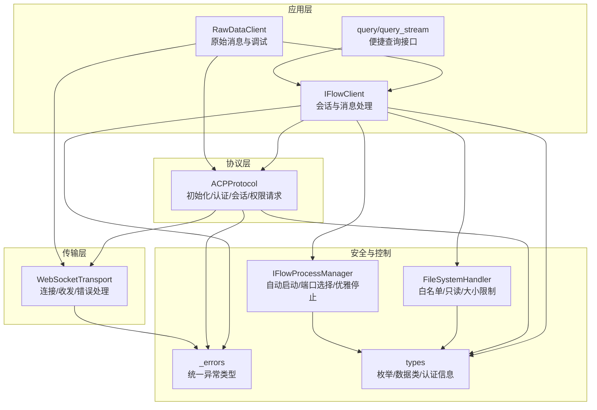
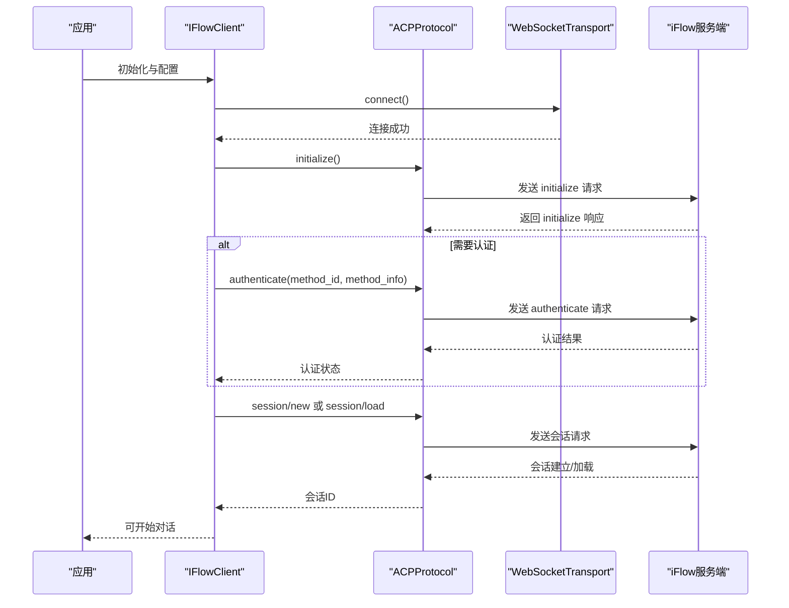
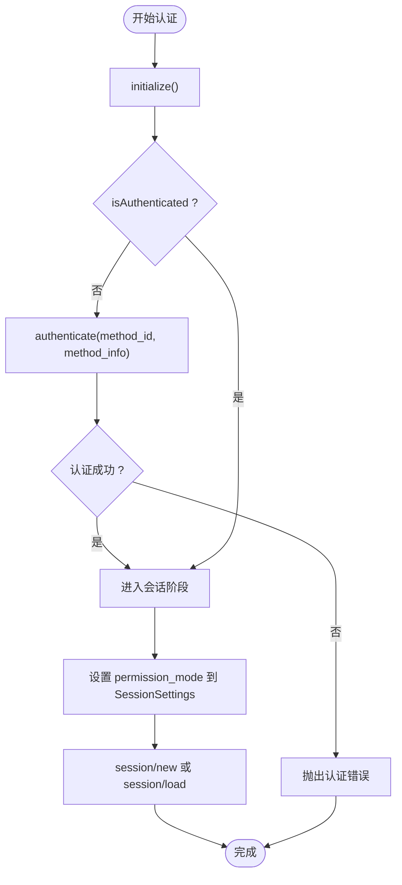
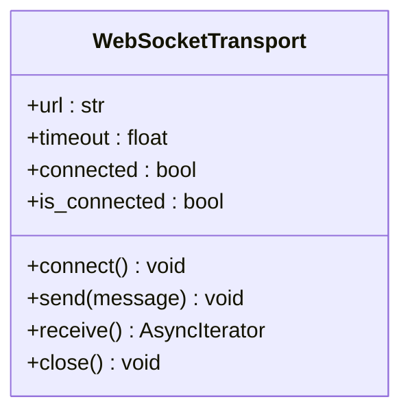
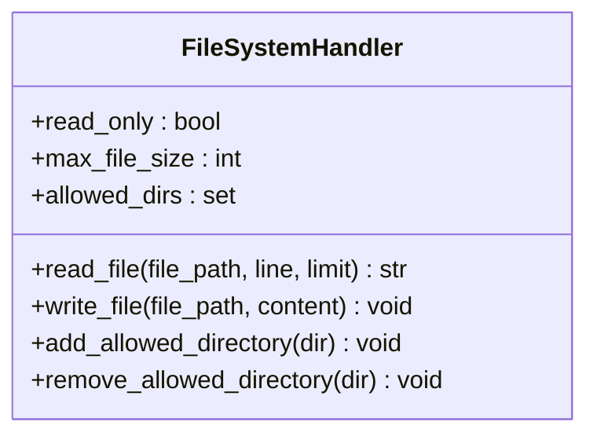
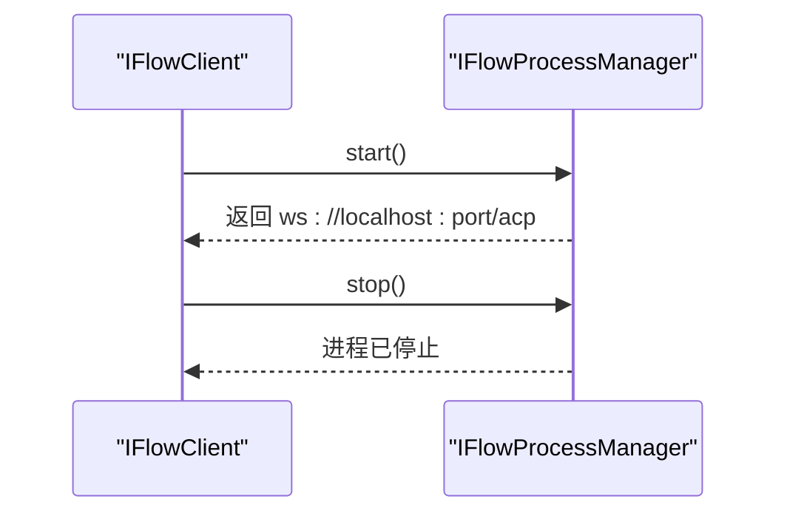
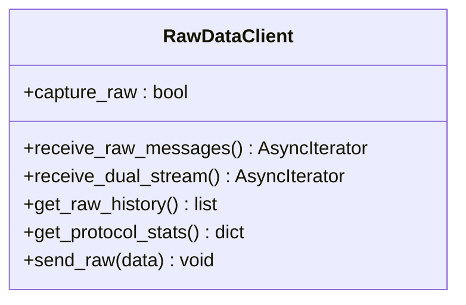
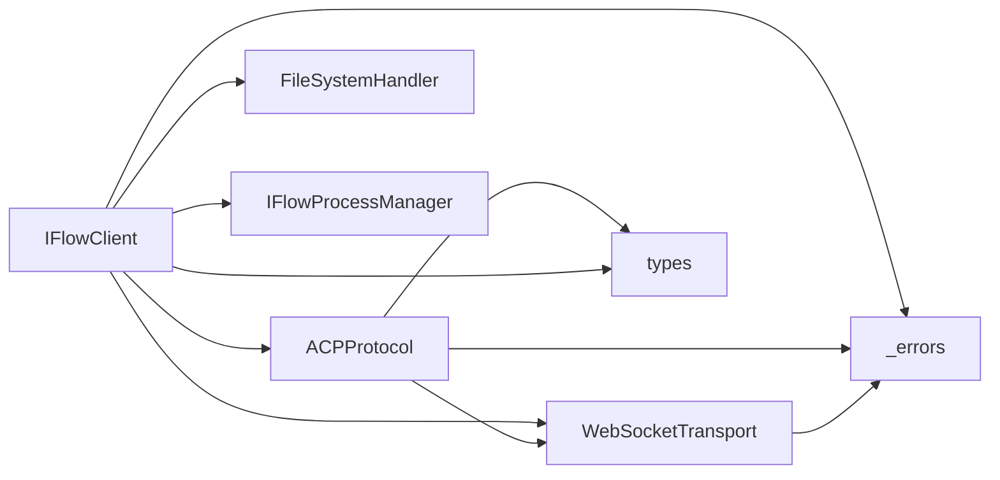

# 安全最佳实践

<cite>
**本文引用的文件**
- [client.py](file://client.py)
- [_internal/protocol.py](file://_internal/protocol.py)
- [_internal/transport.py](file://_internal/transport.py)
- [_internal/file_handler.py](file://_internal/file_handler.py)
- [_internal/process_manager.py](file://_internal/process_manager.py)
- [types.py](file://types.py)
- [_errors.py](file://_errors.py)
- [raw_client.py](file://raw_client.py)
- [query.py](file://query.py)
</cite>

## 目录
1. [引言](#引言)
2. [项目结构](#项目结构)
3. [核心组件](#核心组件)
4. [架构总览](#架构总览)
5. [详细组件分析](#详细组件分析)
6. [依赖关系分析](#依赖关系分析)
7. [性能与安全特性](#性能与安全特性)
8. [故障排查指南](#故障排查指南)
9. [结论](#结论)
10. [附录：安全检查清单与审计建议](#附录安全检查清单与审计建议)

## 引言
本文件面向安全专家与开发团队，系统总结基于 ACP（Agent Communication Protocol）的认证与会话安全最佳实践。重点覆盖：
- 最小权限原则在认证与工具调用中的落地
- 凭据轮换策略（自动与手动）的实施路径
- 传输安全、存储安全、使用安全的配置检查清单
- 安全审计与日志监控要点
- 威胁建模与风险评估方法论

## 项目结构
SDK 采用分层设计：高层客户端负责会话生命周期与消息编解码；协议层封装 ACP 协议交互；传输层提供 WebSocket 连接与收发；文件访问通过受控文件处理器实现；进程管理负责本地 iFlow 的启动与关闭。

图表来源
- [client.py](file://client.py#L1-L320)
- [_internal/protocol.py](file://_internal/protocol.py#L1-L200)
- [_internal/transport.py](file://_internal/transport.py#L1-L120)
- [_internal/file_handler.py](file://_internal/file_handler.py#L1-L120)
- [_internal/process_manager.py](file://_internal/process_manager.py#L1-L120)
- [types.py](file://types.py#L1-L120)
- [_errors.py](file://_errors.py#L1-L85)
- [raw_client.py](file://raw_client.py#L1-L120)
- [query.py](file://query.py#L1-L80)

章节来源
- [client.py](file://client.py#L1-L320)
- [_internal/protocol.py](file://_internal/protocol.py#L1-L200)
- [_internal/transport.py](file://_internal/transport.py#L1-L120)
- [_internal/file_handler.py](file://_internal/file_handler.py#L1-L120)
- [_internal/process_manager.py](file://_internal/process_manager.py#L1-L120)
- [types.py](file://types.py#L1-L120)
- [_errors.py](file://_errors.py#L1-L85)
- [raw_client.py](file://raw_client.py#L1-L120)
- [query.py](file://query.py#L1-L80)

## 核心组件
- IFlowClient：高层会话与消息处理，负责连接、认证、会话创建、消息收发、工具确认等。
- ACPProtocol：ACP 协议实现，包含 initialize、authenticate、session/new、session/load、权限请求转发与响应等。
- WebSocketTransport：WebSocket 传输层，负责连接、发送、接收、超时与错误处理。
- FileSystemHandler：文件系统访问控制，支持白名单目录、只读模式、最大文件大小限制。
- IFlowProcessManager：本地 iFlow 进程管理，自动查找可执行文件、端口探测、启动与优雅停止。
- types：认证信息、权限选项、审批模式、会话设置等类型定义。
- _errors：统一异常体系，便于安全审计与告警。

章节来源
- [client.py](file://client.py#L1-L320)
- [_internal/protocol.py](file://_internal/protocol.py#L1-L200)
- [_internal/transport.py](file://_internal/transport.py#L1-L120)
- [_internal/file_handler.py](file://_internal/file_handler.py#L1-L120)
- [_internal/process_manager.py](file://_internal/process_manager.py#L1-L120)
- [types.py](file://types.py#L1-L120)
- [_errors.py](file://_errors.py#L1-L85)

## 架构总览
下图展示认证与最小权限在整体流程中的位置与交互。

图表来源
- [client.py](file://client.py#L120-L320)
- [_internal/protocol.py](file://_internal/protocol.py#L90-L200)
- [_internal/transport.py](file://_internal/transport.py#L50-L120)

章节来源
- [client.py](file://client.py#L120-L320)
- [_internal/protocol.py](file://_internal/protocol.py#L90-L200)
- [_internal/transport.py](file://_internal/transport.py#L50-L120)

## 详细组件分析

### 组件A：认证与最小权限（IFlowClient + ACPProtocol）
- 认证流程：initialize 成功后，若服务端要求认证，则调用 authenticate 并等待响应；认证成功后进入会话阶段。
- 最小权限原则：
  - 审批模式 ApprovalMode 控制工具调用是否需要用户确认。DEFAULT 模式下每次工具调用均触发权限请求；AUTO_EDIT/YOLO 允许自动执行；PLAN 仅允许只读工具。
  - 会话设置 SessionSettings.permission_mode 将审批模式传递给服务端，由服务端的 CoreToolScheduler 决定是否发起 requestPermission。
  - 工具确认请求 ToolConfirmationRequestMessage 提供多种选项（一次性允许、永久允许、拒绝），用户可在收到请求后决定授权范围与次数，从而实现“按次/按类型”的最小授权。

图表来源
- [_internal/protocol.py](file://_internal/protocol.py#L176-L256)
- [_internal/protocol.py](file://_internal/protocol.py#L257-L346)
- [types.py](file://types.py#L56-L73)
- [types.py](file://types.py#L893-L922)
- [client.py](file://client.py#L280-L310)

章节来源
- [_internal/protocol.py](file://_internal/protocol.py#L176-L256)
- [_internal/protocol.py](file://_internal/protocol.py#L257-L346)
- [types.py](file://types.py#L56-L73)
- [types.py](file://types.py#L893-L922)
- [client.py](file://client.py#L280-L310)

### 组件B：传输与连接安全（WebSocketTransport）
- 连接与超时：connect() 支持超时控制；receive() 循环读取消息；close() 优雅关闭。
- 错误处理：对连接断开、JSON 解析失败、发送失败等进行分类处理，便于上层捕获与重试。
- 建议：
  - 使用 wss:// 端点（在 IFlowOptions 中可切换到沙箱或生产环境的安全端点）。
  - 在企业网络中启用代理与 TLS 终止，避免明文传输。
  - 对长连接配置心跳与超时策略，防止僵尸连接。

图表来源
- [_internal/transport.py](file://_internal/transport.py#L1-L120)

章节来源
- [_internal/transport.py](file://_internal/transport.py#L1-L120)

### 组件C：文件访问控制（FileSystemHandler）
- 白名单目录：仅允许在指定目录内读写，防止越权访问。
- 路径遍历防护：解析绝对路径并判断是否位于允许目录之下。
- 只读模式：当启用只读时，禁止写操作。
- 文件大小限制：防止大文件读取导致资源耗尽。
- 建议：
  - 默认禁用文件访问（file_access=False），按需开启并限定目录。
  - 对写入操作增加二次确认或审计记录。

图表来源
- [_internal/file_handler.py](file://_internal/file_handler.py#L1-L120)

章节来源
- [_internal/file_handler.py](file://_internal/file_handler.py#L1-L120)

### 组件D：本地进程管理（IFlowProcessManager）
- 自动发现与启动：根据平台查找 iFlow 可执行文件，探测可用端口并启动进程。
- 优雅停止：优先终止，超时后强制杀死，清理资源。
- 建议：
  - 仅在本地开发/测试环境启用 auto_start_process，生产环境建议外部托管 iFlow。
  - 限制启动端口范围，避免冲突与被扫描。

图表来源
- [_internal/process_manager.py](file://_internal/process_manager.py#L150-L210)
- [_internal/process_manager.py](file://_internal/process_manager.py#L210-L254)

章节来源
- [_internal/process_manager.py](file://_internal/process_manager.py#L1-L120)
- [_internal/process_manager.py](file://_internal/process_manager.py#L150-L210)
- [_internal/process_manager.py](file://_internal/process_manager.py#L210-L254)

### 组件E：原始消息与调试（RawDataClient）
- 提供原始 WebSocket 消息流与解析后的消息流，便于审计与问题定位。
- 支持统计与历史记录，辅助安全事件回溯。

图表来源
- [raw_client.py](file://raw_client.py#L1-L120)
- [raw_client.py](file://raw_client.py#L120-L240)

章节来源
- [raw_client.py](file://raw_client.py#L1-L120)
- [raw_client.py](file://raw_client.py#L120-L240)

## 依赖关系分析
- IFlowClient 依赖 ACPProtocol 与 WebSocketTransport，同时可选依赖 FileSystemHandler 与 IFlowProcessManager。
- ACPProtocol 依赖 WebSocketTransport，并通过 types 定义的枚举与数据类组织消息结构。
- _errors 提供统一异常类型，贯穿各层，便于集中处理与审计。

图表来源
- [client.py](file://client.py#L1-L120)
- [_internal/protocol.py](file://_internal/protocol.py#L1-L60)
- [_internal/transport.py](file://_internal/transport.py#L1-L60)
- [_internal/file_handler.py](file://_internal/file_handler.py#L1-L60)
- [_internal/process_manager.py](file://_internal/process_manager.py#L1-L60)
- [types.py](file://types.py#L1-L60)
- [_errors.py](file://_errors.py#L1-L60)

章节来源
- [client.py](file://client.py#L1-L120)
- [_internal/protocol.py](file://_internal/protocol.py#L1-L60)
- [_internal/transport.py](file://_internal/transport.py#L1-L60)
- [_internal/file_handler.py](file://_internal/file_handler.py#L1-L60)
- [_internal/process_manager.py](file://_internal/process_manager.py#L1-L60)
- [types.py](file://types.py#L1-L60)
- [_errors.py](file://_errors.py#L1-L60)

## 性能与安全特性
- 连接重试与指数退避：IFlowClient 在连接失败时进行有限次重试，降低瞬时故障影响。
- 超时控制：协议层与传输层均设置超时，避免阻塞与资源泄漏。
- 日志分级：默认 INFO 级别，便于生产环境按需调整。
- 最小权限：通过 ApprovalMode 与 SessionSettings.permission_mode 实现细粒度授权，减少潜在攻击面。

章节来源
- [client.py](file://client.py#L200-L260)
- [_internal/protocol.py](file://_internal/protocol.py#L176-L256)
- [_internal/transport.py](file://_internal/transport.py#L50-L120)
- [types.py](file://types.py#L56-L73)
- [types.py](file://types.py#L893-L922)

## 故障排查指南
- 连接失败：检查 URL、端口占用、TLS 端点；查看 WebSocketTransport 的超时与错误日志。
- 认证失败：核对 method_id 与 method_info；确认服务端返回的错误信息；必要时使用 RawDataClient 获取原始消息进行分析。
- 权限请求未触发：确认 ApprovalMode 与 SessionSettings.permission_mode 设置；检查服务端能力与版本。
- 文件访问被拒：检查 FileSystemHandler 的 allowed_dirs、read_only、max_file_size；确认路径是否在白名单内。
- 进程无法启动：确认 iFlow 可执行文件存在且可执行；检查端口占用与防火墙；查看 IFlowProcessManager 的启动日志。

章节来源
- [_internal/transport.py](file://_internal/transport.py#L50-L120)
- [_internal/protocol.py](file://_internal/protocol.py#L176-L256)
- [_internal/file_handler.py](file://_internal/file_handler.py#L1-L120)
- [_internal/process_manager.py](file://_internal/process_manager.py#L150-L210)
- [raw_client.py](file://raw_client.py#L120-L240)

## 结论
该 SDK 在认证与权限控制方面提供了清晰的最小权限实现路径：通过 ApprovalMode 与 SessionSettings.permission_mode 将授权决策下沉至服务端，结合工具确认请求实现“按次/按类型”的细粒度授权。传输层与文件访问控制进一步强化了运行时安全。建议在生产环境中：
- 默认禁用文件访问与自动启动本地进程
- 使用 wss:// 端点并启用 TLS
- 严格限制 allowed_dirs 与只读模式
- 建立完善的日志与审计机制，定期复盘

## 附录：安全检查清单与审计建议

- 传输安全
  - 是否使用 wss:// 端点？（参考 IFlowOptions.url）
  - 是否启用代理/TLS 终止？（企业网络）
  - 是否配置合理的 ping/超时参数？（WebSocketTransport）

- 存储安全
  - 文件访问是否默认关闭？（IFlowOptions.file_access）
  - allowed_dirs 是否最小化？（FileSystemHandler.allowed_dirs）
  - 是否启用只读模式？（FileSystemHandler.read_only）
  - 是否设置合理最大文件大小？（FileSystemHandler.max_file_size）

- 使用安全
  - 审批模式是否符合业务需求？（ApprovalMode 与 SessionSettings.permission_mode）
  - 工具确认请求是否得到用户明确授权？（ToolConfirmationRequestMessage）
  - 是否对敏感凭据进行最小化暴露？（AuthMethodInfo）

- 凭据轮换策略
  - 自动轮换：在认证方法支持的情况下，定期更新 apiKey/baseUrl/modelName；在 SDK 层通过重新构造 AuthMethodInfo 并触发重新认证。
  - 手动轮换：在发生泄露或到期时，更新凭据后立即重建会话并验证连通性。

- 安全审计与日志监控
  - 使用 RawDataClient 获取原始消息流，记录关键事件（认证、权限请求、会话变更）。
  - 建立告警规则：认证失败率、权限拒绝率、异常超时、连接断开频次。
  - 定期导出日志并进行离线分析，识别异常行为模式。

- 威胁建模与风险评估
  - 识别关键资产：认证凭据、会话上下文、工具调用权限。
  - 威胁场景：凭据泄露、越权工具调用、中间人攻击、本地进程滥用。
  - 控制措施：最小权限、凭据轮换、传输加密、访问控制、审计与告警。
  - 风险评估：量化威胁概率与影响，优先处理高风险项并持续改进。

章节来源
- [types.py](file://types.py#L925-L994)
- [types.py](file://types.py#L893-L922)
- [types.py](file://types.py#L56-L73)
- [_internal/file_handler.py](file://_internal/file_handler.py#L1-L120)
- [_internal/transport.py](file://_internal/transport.py#L50-L120)
- [raw_client.py](file://raw_client.py#L120-L240)