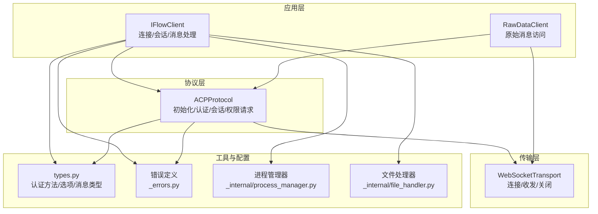
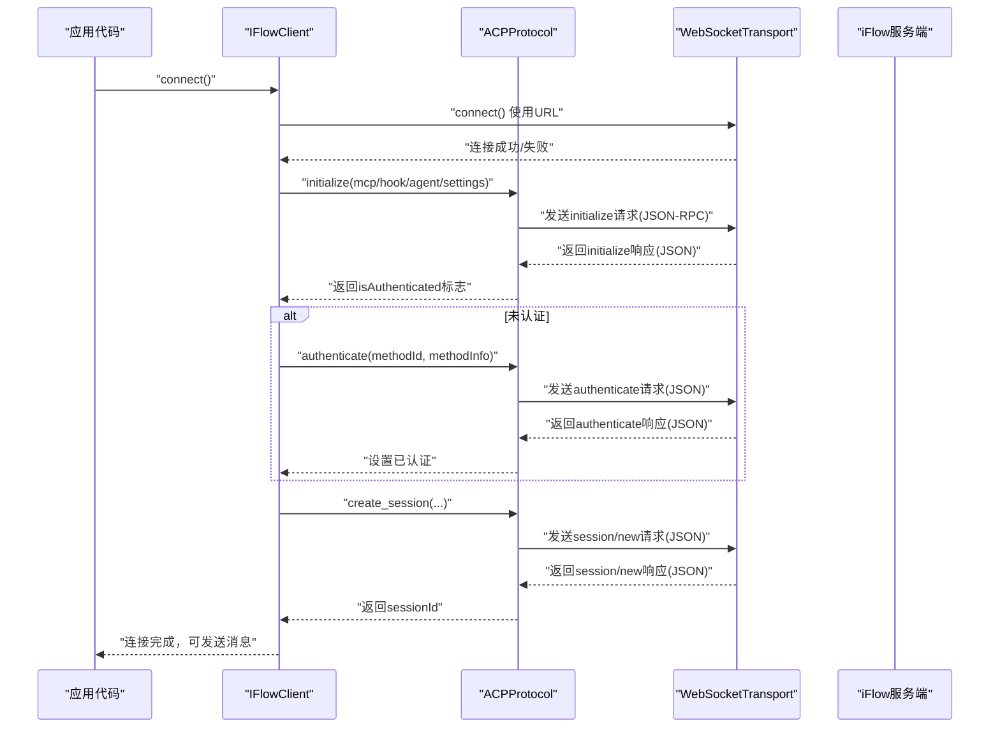
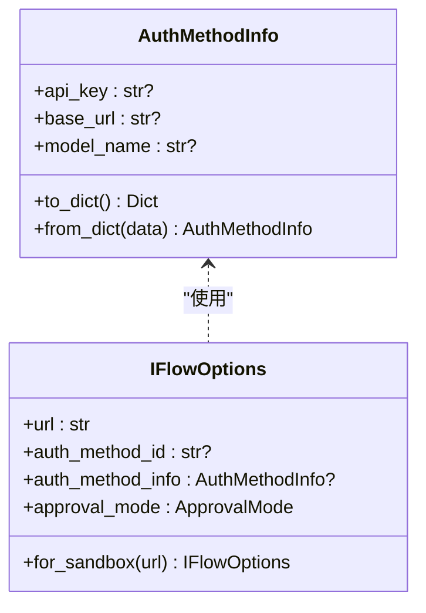
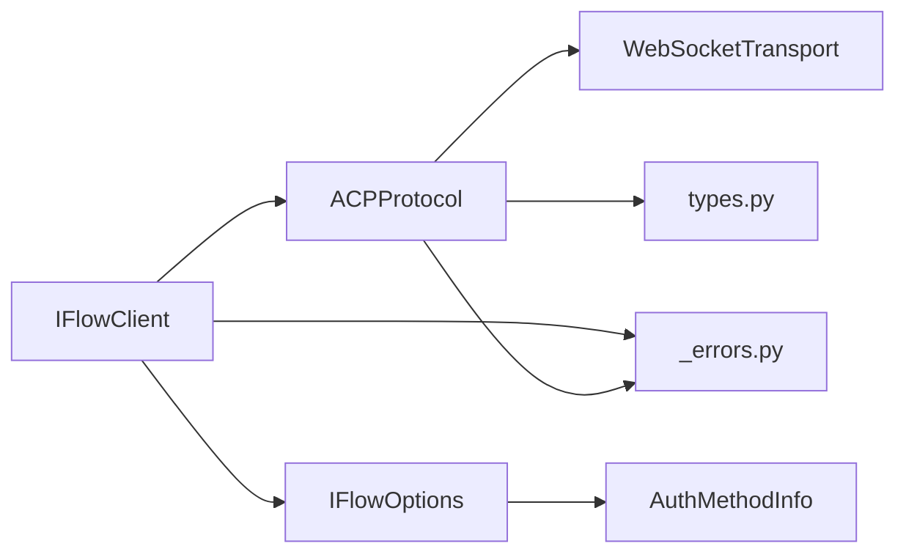

# 认证凭据安全

<cite>
**本文引用的文件**
- [client.py](file://client.py)
- [raw_client.py](file://raw_client.py)
- [_internal/protocol.py](file://_internal/protocol.py)
- [_internal/transport.py](file://_internal/transport.py)
- [types.py](file://types.py)
- [_errors.py](file://_errors.py)
- [_internal/process_manager.py](file://_internal/process_manager.py)
- [_internal/file_handler.py](file://_internal/file_handler.py)
</cite>

## 目录
1. [简介](#简介)
2. [项目结构](#项目结构)
3. [核心组件](#核心组件)
4. [架构总览](#架构总览)
5. [详细组件分析](#详细组件分析)
6. [依赖关系分析](#依赖关系分析)
7. [性能考量](#性能考量)
8. [故障排查指南](#故障排查指南)
9. [结论](#结论)
10. [附录：安全最佳实践清单](#附录安全最佳实践清单)

## 简介
本文件聚焦于 ACP 协议中“认证凭据”的安全传输与存储机制，围绕以下目标展开：
- 解释认证凭据在 WebSocket 通信中的加密保护（TLS）使用现状与建议
- 分析凭据在内存中的安全存储策略（最小化持有、及时清除）
- 说明序列化与反序列化过程中的安全防护，防止信息泄露
- 提供安全编码实践，避免凭据被意外记录到日志
- 给出开发者在凭据管理上的最佳实践指南

## 项目结构
SDK 采用分层设计：客户端层负责会话生命周期与消息流；协议层封装 ACP JSON-RPC 流程；传输层基于 WebSocket；类型与错误模块提供数据模型与异常体系；进程与文件处理器提供本地能力扩展。

图表来源
- [client.py](file://client.py#L1-L120)
- [_internal/protocol.py](file://_internal/protocol.py#L1-L120)
- [_internal/transport.py](file://_internal/transport.py#L1-L120)
- [types.py](file://types.py#L925-L1065)
- [_errors.py](file://_errors.py#L1-L85)
- [_internal/process_manager.py](file://_internal/process_manager.py#L1-L120)
- [_internal/file_handler.py](file://_internal/file_handler.py#L1-L120)

章节来源
- [client.py](file://client.py#L1-L120)
- [_internal/protocol.py](file://_internal/protocol.py#L1-L120)
- [_internal/transport.py](file://_internal/transport.py#L1-L120)
- [types.py](file://types.py#L925-L1065)

## 核心组件
- IFlowClient：负责连接建立、协议初始化、认证、会话创建与消息处理；维护认证状态与会话上下文。
- ACPProtocol：实现 ACP 初始化、认证、会话管理、权限请求等 JSON-RPC 流程；对收到的消息进行解析与路由。
- WebSocketTransport：提供 WebSocket 连接、发送、接收与关闭；支持超时与连接状态管理。
- AuthMethodInfo：封装认证方法所需的凭据字段（如 API Key、基础 URL、模型名），并提供序列化/反序列化映射。
- IFlowOptions：包含认证方法 ID 与认证方法信息，以及连接 URL、超时、日志级别等配置项。
- RawDataClient：在标准解析之外提供原始消息访问，便于调试与审计。

章节来源
- [client.py](file://client.py#L110-L220)
- [_internal/protocol.py](file://_internal/protocol.py#L1-L120)
- [_internal/transport.py](file://_internal/transport.py#L1-L120)
- [types.py](file://types.py#L925-L1065)
- [raw_client.py](file://raw_client.py#L1-L120)

## 架构总览
下图展示认证凭据在端到端流程中的流转与保护要点。

图表来源
- [client.py](file://client.py#L132-L318)
- [_internal/protocol.py](file://_internal/protocol.py#L120-L255)
- [_internal/transport.py](file://_internal/transport.py#L53-L120)

## 详细组件分析

### 1) 认证凭据在 WebSocket 通信中的加密保护
- 当前实现
  - WebSocketTransport 默认使用 websockets 库发起连接，未显式启用 TLS 参数；URL 支持 ws:// 与 wss://。
  - IFlowOptions 提供 for_sandbox 方法，默认使用 wss:// 沙箱地址，体现对 TLS 的推荐用法。
- 安全建议
  - 生产环境优先使用 wss://，确保 TLS 握手与证书校验生效。
  - 若必须使用 ws://，应在网关或代理层强制升级至 TLS，避免明文传输。
  - 对于本地回环连接，仍建议使用 wss:// 以统一安全基线。

章节来源
- [_internal/transport.py](file://_internal/transport.py#L53-L120)
- [client.py](file://client.py#L192-L220)
- [types.py](file://types.py#L1046-L1065)

### 2) 凭据在内存中的安全存储策略
- 最小化持有
  - 认证方法信息仅在需要时传入 authenticate 请求参数；认证完成后不长期驻留内存。
  - IFlowOptions 中的 auth_method_info 仅在连接阶段参与握手，随后不再保存敏感字段。
- 及时清除
  - 断开连接时，清理连接对象、协议对象与后台任务，释放资源。
  - 文件处理器与进程管理器在断开时也会被关闭，避免残留句柄。
- 日志最小化
  - 日志输出中避免打印完整凭据；SDK 已对敏感字段进行过滤与截断处理（例如发送日志仅打印消息片段）。

章节来源
- [client.py](file://client.py#L372-L398)
- [_internal/protocol.py](file://_internal/protocol.py#L176-L255)
- [_internal/transport.py](file://_internal/transport.py#L85-L120)
- [_internal/file_handler.py](file://_internal/file_handler.py#L1-L120)
- [_internal/process_manager.py](file://_internal/process_manager.py#L211-L254)

### 3) 序列化与反序列化过程中的安全防护
- 发送侧
  - 所有 JSON-RPC 请求通过字典构造后序列化为字符串再发送；避免直接拼接字符串导致注入风险。
  - 认证方法信息在 to_dict 中仅保留非空字段，并按协议约定的驼峰命名发送。
- 接收侧
  - 响应解析严格检查 id、result/error 字段，未匹配到 id 的响应会被忽略或作为通知处理。
  - 对 JSON 解析异常进行捕获并转换为专用错误类型，避免异常泄漏。
- 防止信息泄露
  - 对日志中的消息进行长度截断，避免将完整凭据写入日志。
  - 控制消息（以 // 开头）与 JSON 消息分别处理，减少误判与误记录。

章节来源
- [_internal/protocol.py](file://_internal/protocol.py#L120-L255)
- [_internal/protocol.py](file://_internal/protocol.py#L499-L566)
- [_internal/transport.py](file://_internal/transport.py#L85-L120)
- [_errors.py](file://_errors.py#L73-L85)

### 4) 认证方法与凭据模型
- AuthMethodInfo
  - 字段：api_key、base_url、model_name
  - 序列化：to_dict 将 snake_case 映射为 camelCase，仅发送非空字段
  - 反序列化：from_dict 支持 camelCase 与 snake_case 键
- IFlowOptions
  - 包含 auth_method_id 与 auth_method_info；默认 approval_mode 为 YOLO，可在会话设置中覆盖

图表来源
- [types.py](file://types.py#L925-L1065)

章节来源
- [types.py](file://types.py#L925-L1065)

### 5) 权限请求与用户确认（间接涉及凭据）
- 当 ApprovalMode 设置为 DEFAULT 时，iFlow 可能通过 ACP 的权限请求机制要求用户确认工具调用。
- SDK 通过协议层转发权限请求给上层，由上层决定是否批准或拒绝；该流程不直接暴露或传递认证凭据。

章节来源
- [_internal/protocol.py](file://_internal/protocol.py#L567-L620)
- [types.py](file://types.py#L56-L73)

### 6) 原始消息访问与调试（降低泄露风险）
- RawDataClient 提供原始消息访问，便于调试；但默认仅打印摘要，避免泄露完整凭据。
- 建议在生产环境禁用原始消息打印，或仅在受控环境下开启。

章节来源
- [raw_client.py](file://raw_client.py#L1-L120)
- [raw_client.py](file://raw_client.py#L293-L362)

## 依赖关系分析
- IFlowClient 依赖 ACPProtocol 与 WebSocketTransport，负责高层控制流与会话管理。
- ACPProtocol 依赖 WebSocketTransport 进行底层通信，依赖 types 提供数据模型。
- WebSocketTransport 依赖第三方 websockets 库，负责实际网络收发。
- IFlowOptions 与 AuthMethodInfo 为配置与凭据载体，贯穿连接与认证阶段。

图表来源
- [client.py](file://client.py#L110-L220)
- [_internal/protocol.py](file://_internal/protocol.py#L1-L120)
- [_internal/transport.py](file://_internal/transport.py#L1-L120)
- [types.py](file://types.py#L925-L1065)
- [_errors.py](file://_errors.py#L1-L85)

章节来源
- [client.py](file://client.py#L110-L220)
- [_internal/protocol.py](file://_internal/protocol.py#L1-L120)
- [_internal/transport.py](file://_internal/transport.py#L1-L120)
- [types.py](file://types.py#L925-L1065)
- [_errors.py](file://_errors.py#L1-L85)

## 性能考量
- 连接重试与指数退避：连接失败时进行有限次重试，避免忙轮询。
- 大消息限制：传输层设置最大消息大小，防止内存压力。
- 异步处理：消息收发与权限请求均采用异步模式，提升吞吐。

章节来源
- [client.py](file://client.py#L205-L221)
- [_internal/transport.py](file://_internal/transport.py#L64-L84)
- [_internal/transport.py](file://_internal/transport.py#L114-L146)

## 故障排查指南
- 认证失败
  - 检查 initialize 返回的 isAuthenticated 与可用认证方法列表
  - 确认 authenticate 请求的 methodId 与 methodInfo 是否正确
  - 关注超时与 JSON 解析错误
- 连接问题
  - 检查 URL 是否为 wss://（生产环境）
  - 查看连接超时与 WebSocket 异常
- 日志定位
  - 使用 RawDataClient 获取原始消息，结合协议统计进行分析
  - 注意日志中对敏感信息的截断与过滤

章节来源
- [_internal/protocol.py](file://_internal/protocol.py#L120-L255)
- [_errors.py](file://_errors.py#L73-L85)
- [raw_client.py](file://raw_client.py#L238-L292)

## 结论
- 传输层：建议在生产环境使用 wss:// 并启用 TLS；本地开发可评估代理层强制升级。
- 内存与日志：凭据仅在必要时进入内存，且日志输出已做截断与最小化；断开连接时彻底清理。
- 序列化与反序列化：严格遵循 JSON-RPC 规范，对异常进行分类与降级处理。
- 最佳实践：最小化持有、及时清除、避免记录、统一 TLS、最小权限与白名单。

## 附录：安全最佳实践清单
- 传输层
  - 优先使用 wss://；在网关/代理层强制 TLS
  - 校验证书链与主机名，避免自签名证书绕过
- 凭据管理
  - 不在代码中硬编码凭据；使用环境变量或密钥管理服务
  - 最小化持有：仅在认证阶段使用，认证后立即丢弃
  - 及时清除：断开连接时清理所有敏感对象与句柄
- 日志与审计
  - 对日志中的敏感字段进行脱敏与截断
  - 禁用生产环境的原始消息打印
- 序列化与反序列化
  - 严格校验 JSON-RPC 字段（id、method/result/error）
  - 对异常进行分类并转换为专用错误类型
- 权限与最小权限
  - 使用 ApprovalMode 控制工具调用权限
  - 文件系统访问启用白名单与只读模式