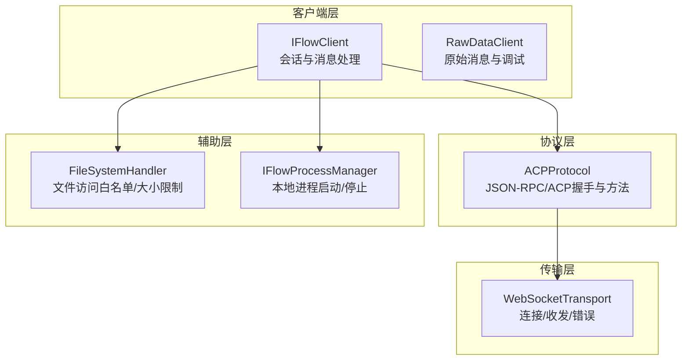
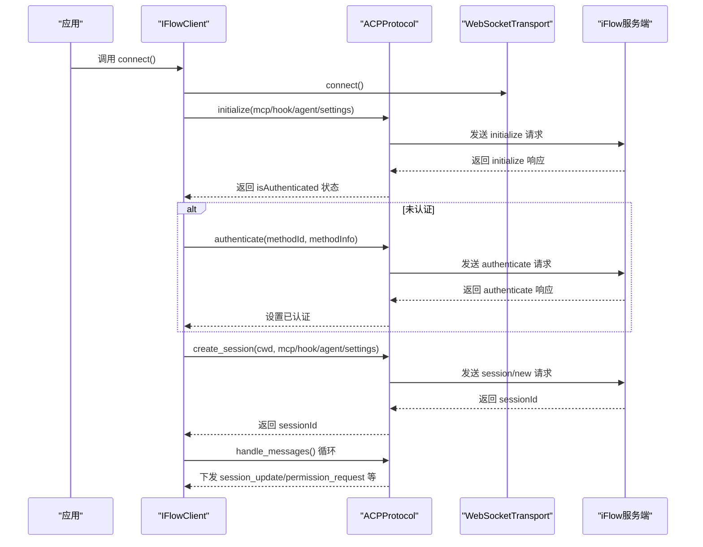
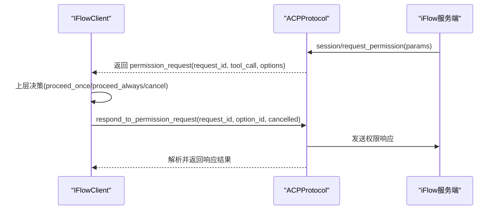
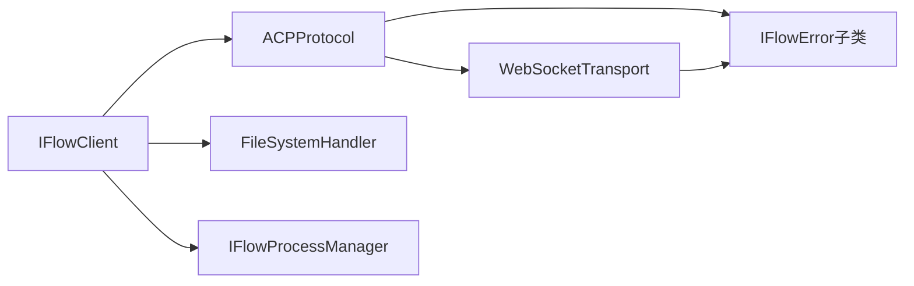

# 认证安全机制

<cite>
**本文引用的文件**
- [client.py](file://client.py)
- [raw_client.py](file://raw_client.py)
- [types.py](file://types.py)
- [_internal/protocol.py](file://_internal/protocol.py)
- [_internal/transport.py](file://_internal/transport.py)
- [_internal/file_handler.py](file://_internal/file_handler.py)
- [_internal/process_manager.py](file://_internal/process_manager.py)
- [_errors.py](file://_errors.py)
</cite>

## 目录
1. [引言](#引言)
2. [项目结构](#项目结构)
3. [核心组件](#核心组件)
4. [架构总览](#架构总览)
5. [详细组件分析](#详细组件分析)
6. [依赖关系分析](#依赖关系分析)
7. [性能与安全特性](#性能与安全特性)
8. [故障排查指南](#故障排查指南)
9. [结论](#结论)
10. [附录：威胁模型与最佳实践](#附录威胁模型与最佳实践)

## 引言
本文件聚焦于ACP（Agent Communication Protocol）协议在iFlow SDK中的认证安全机制，系统阐述认证凭据的传输安全、存储安全与使用安全策略；解析认证令牌的生命周期管理（生成、刷新、撤销）；说明如何防范重放攻击、中间人攻击等常见威胁；并给出安全配置的最佳实践（最小权限原则、凭据轮换策略等），以及面向安全专家的威胁模型与审计要点。

## 项目结构
SDK采用分层设计：
- 客户端层：对外暴露易用接口，负责会话建立、消息收发、工具调用确认等。
- 协议层：实现ACP协议v0.0.9，封装JSON-RPC消息格式与控制流。
- 传输层：基于WebSocket，负责连接、收发与错误处理。
- 文件访问层：可选的本地文件系统访问控制。
- 进程管理层：可选的本地iFlow进程启动与关闭。
- 错误体系：统一异常类型，便于上层处理。

图表来源
- [client.py](file://client.py#L110-L318)
- [_internal/protocol.py](file://_internal/protocol.py#L21-L171)
- [_internal/transport.py](file://_internal/transport.py#L27-L177)
- [_internal/file_handler.py](file://_internal/file_handler.py#L16-L58)
- [_internal/process_manager.py](file://_internal/process_manager.py#L25-L88)

章节来源
- [client.py](file://client.py#L110-L318)
- [_internal/protocol.py](file://_internal/protocol.py#L21-L171)
- [_internal/transport.py](file://_internal/transport.py#L27-L177)
- [_internal/file_handler.py](file://_internal/file_handler.py#L16-L58)
- [_internal/process_manager.py](file://_internal/process_manager.py#L25-L88)

## 核心组件
- IFlowClient：负责连接、认证、会话创建、消息收发、工具调用确认等。
- ACPProtocol：实现ACP初始化、认证、会话管理、权限请求转发与响应等。
- WebSocketTransport：提供WebSocket连接、发送、接收与错误处理。
- FileSystemHandler：可选的文件系统访问控制（白名单、路径穿越防护、大小限制、只读模式）。
- IFlowProcessManager：可选的本地iFlow进程管理（自动发现、端口选择、启动/停止）。
- RawDataClient：扩展原始消息流与调试能力，便于审计与取证。

章节来源
- [client.py](file://client.py#L110-L318)
- [_internal/protocol.py](file://_internal/protocol.py#L21-L171)
- [_internal/transport.py](file://_internal/transport.py#L27-L177)
- [_internal/file_handler.py](file://_internal/file_handler.py#L16-L58)
- [_internal/process_manager.py](file://_internal/process_manager.py#L25-L88)
- [raw_client.py](file://raw_client.py#L72-L120)

## 架构总览
下图展示认证与会话建立的关键流程，包括初始化、认证、会话创建与消息处理。

图表来源
- [client.py](file://client.py#L132-L318)
- [_internal/protocol.py](file://_internal/protocol.py#L101-L171)
- [_internal/protocol.py](file://_internal/protocol.py#L176-L256)
- [_internal/protocol.py](file://_internal/protocol.py#L257-L346)

章节来源
- [client.py](file://client.py#L132-L318)
- [_internal/protocol.py](file://_internal/protocol.py#L101-L171)
- [_internal/protocol.py](file://_internal/protocol.py#L176-L256)
- [_internal/protocol.py](file://_internal/protocol.py#L257-L346)

## 详细组件分析

### 认证凭据的传输安全
- 传输通道：通过WebSocket进行通信，建议在生产环境使用wss（TLS加密）以抵御中间人攻击与窃听。
- 凭据载体：认证方法由方法ID与方法信息组成，方法信息可包含密钥、基础URL、模型名等字段，具体取决于后端实现。
- 传输策略：
  - 使用TLS加密通道（wss://）。
  - 对敏感字段进行最小化暴露，避免在日志中打印完整凭据。
  - 在客户端侧对凭据进行脱敏记录（仅显示必要片段）。

章节来源
- [_internal/protocol.py](file://_internal/protocol.py#L176-L256)
- [client.py](file://client.py#L263-L276)

### 认证凭据的存储安全
- 存储位置：SDK不内置持久化存储逻辑；凭据通常来自调用方配置或运行时注入。
- 建议实践：
  - 将凭据存放在受控的机密管理器（如KMS、Vault、操作系统密钥链）中。
  - 避免将凭据写入源码或配置文件；使用环境变量或安全挂载。
  - 对缓存的凭据设置超时与清理策略，退出时释放内存中的敏感数据。

章节来源
- [client.py](file://client.py#L110-L131)
- [_internal/protocol.py](file://_internal/protocol.py#L176-L256)

### 认证凭据的使用安全
- 使用范围：认证成功后，SDK通过ACP协议进行后续操作；凭据不再在SDK内部重复使用。
- 权限控制：通过ApprovalMode与会话设置影响工具调用权限，减少不必要的授权面。
- 最小权限：仅授予完成任务所需的最小权限集合，避免一次性授予全局权限。

章节来源
- [types.py](file://types.py#L56-L73)
- [client.py](file://client.py#L285-L310)

### 认证令牌生命周期管理
- 生成：认证成功后，SDK记录已认证状态；后续会话使用该状态进行会话创建。
- 刷新：SDK未实现自动刷新逻辑；若后端支持，需由上层在过期前重新发起认证。
- 撤销：SDK未提供显式撤销接口；可通过关闭连接、终止会话或重启进程实现失效。

章节来源
- [_internal/protocol.py](file://_internal/protocol.py#L101-L171)
- [_internal/protocol.py](file://_internal/protocol.py#L176-L256)
- [client.py](file://client.py#L368-L398)

### 工具调用确认与权限请求
- 审计与控制：当iFlow需要用户确认工具调用时，ACP协议下发权限请求；SDK将请求转发给上层，上层据此决定“一次性允许”、“总是允许”或“拒绝”。
- 请求跟踪：SDK维护待处理权限请求映射，确保响应与请求ID一一对应，避免错配。

图表来源
- [_internal/protocol.py](file://_internal/protocol.py#L567-L597)
- [_internal/protocol.py](file://_internal/protocol.py#L720-L768)
- [client.py](file://client.py#L529-L598)

章节来源
- [_internal/protocol.py](file://_internal/protocol.py#L567-L597)
- [_internal/protocol.py](file://_internal/protocol.py#L720-L768)
- [client.py](file://client.py#L529-L598)

### 重放攻击防护
- 请求ID与跟踪：ACPProtocol为每个请求分配自增ID，严格匹配响应ID，降低重放风险。
- 时间窗口：认证与会话创建均设置超时，超时未响应则视为失败，缩短重放窗口。
- 会话隔离：每个会话拥有独立ID，避免跨会话重放。

章节来源
- [_internal/protocol.py](file://_internal/protocol.py#L55-L63)
- [_internal/protocol.py](file://_internal/protocol.py#L176-L256)
- [_internal/protocol.py](file://_internal/protocol.py#L257-L346)

### 中间人攻击防护
- 传输加密：建议使用wss（TLS）通道，校验证书链与主机名，防止中间人窃听与篡改。
- 控制消息：传输层保留原始字符串消息，协议层再解析JSON，避免在传输层做不必要解析。

章节来源
- [_internal/transport.py](file://_internal/transport.py#L27-L177)
- [_internal/protocol.py](file://_internal/protocol.py#L508-L533)

### 文件系统访问安全
- 白名单目录：仅允许在指定目录内进行读写，防止越权访问。
- 路径穿越：对输入路径进行绝对化与相对化检查，阻断路径穿越。
- 大小限制：限制最大读取文件大小，防止资源滥用。
- 只读模式：可强制只读，避免意外写入。

章节来源
- [_internal/file_handler.py](file://_internal/file_handler.py#L16-L58)
- [_internal/file_handler.py](file://_internal/file_handler.py#L89-L159)
- [_internal/file_handler.py](file://_internal/file_handler.py#L160-L193)

### 本地进程与URL控制
- 自动启动：当URL指向本地回环地址且未检测到服务监听时，SDK可尝试启动本地iFlow进程。
- 端口选择：自动寻找可用端口，避免冲突。
- URL构造：默认构造ws://localhost:port/acp，建议在生产环境改为wss://。

章节来源
- [client.py](file://client.py#L150-L188)
- [_internal/process_manager.py](file://_internal/process_manager.py#L152-L205)
- [_internal/process_manager.py](file://_internal/process_manager.py#L58-L88)

## 依赖关系分析
- 客户端依赖协议层，协议层依赖传输层。
- 文件访问与进程管理为可选依赖，按配置启用。
- 错误类型统一继承自IFlowError，便于上层捕获与分类处理。

图表来源
- [client.py](file://client.py#L110-L318)
- [_internal/protocol.py](file://_internal/protocol.py#L21-L171)
- [_internal/transport.py](file://_internal/transport.py#L27-L177)
- [_internal/file_handler.py](file://_internal/file_handler.py#L16-L58)
- [_internal/process_manager.py](file://_internal/process_manager.py#L25-L88)
- [_errors.py](file://_errors.py#L10-L85)

章节来源
- [client.py](file://client.py#L110-L318)
- [_internal/protocol.py](file://_internal/protocol.py#L21-L171)
- [_internal/transport.py](file://_internal/transport.py#L27-L177)
- [_internal/file_handler.py](file://_internal/file_handler.py#L16-L58)
- [_internal/process_manager.py](file://_internal/process_manager.py#L25-L88)
- [_errors.py](file://_errors.py#L10-L85)

## 性能与安全特性
- 连接重试与指数退避：客户端在连接失败时进行有限次重试，避免瞬时抖动导致长时间不可用。
- 消息队列与异步处理：使用队列与后台任务处理消息，降低阻塞风险。
- 超时控制：认证、会话创建、文件读写等关键路径均设置超时，防止资源占用。
- 日志最小化：敏感字段不在日志中打印，避免泄露。

章节来源
- [client.py](file://client.py#L204-L221)
- [_internal/protocol.py](file://_internal/protocol.py#L176-L256)
- [_internal/protocol.py](file://_internal/protocol.py#L257-L346)
- [_internal/file_handler.py](file://_internal/file_handler.py#L160-L193)

## 故障排查指南
- 连接失败：检查URL是否正确、端口是否开放、是否使用wss、证书是否有效。
- 认证失败：核对methodId与methodInfo是否匹配后端要求；查看认证响应中的错误信息。
- 会话创建失败：确认已初始化且已认证；检查cwd与mcp/hook/agent配置。
- 权限请求未响应：确认上层是否正确调用respond_to_permission_request并传入正确的request_id。
- 文件访问被拒：检查allowed_dirs、路径是否越权、文件大小是否超过限制、是否处于只读模式。
- 进程启动失败：检查iflow可执行文件是否存在、端口是否被占用、平台兼容性。

章节来源
- [_errors.py](file://_errors.py#L10-L85)
- [_internal/protocol.py](file://_internal/protocol.py#L176-L256)
- [_internal/protocol.py](file://_internal/protocol.py#L257-L346)
- [_internal/file_handler.py](file://_internal/file_handler.py#L89-L159)
- [_internal/process_manager.py](file://_internal/process_manager.py#L152-L205)

## 结论
本SDK在ACP协议之上提供了清晰的认证与会话管理框架，结合文件访问控制与进程管理，形成较为完整的安全边界。认证凭据的传输建议使用TLS加密；存储与使用遵循最小权限原则；生命周期管理依赖上层策略；通过请求ID与超时控制降低重放与悬挂风险。建议在生产环境中强化TLS、密钥管理与审计日志，持续监控与轮换凭据。

## 附录：威胁模型与最佳实践

### 威胁模型
- 中间人攻击：通过非TLS通道窃听或篡改消息。
- 重放攻击：利用旧请求ID或会话信息重复发起请求。
- 权限提升：工具调用未经用户确认或权限配置不当。
- 资源滥用：大文件读取、频繁请求导致资源耗尽。
- 本地提权：文件系统越权写入或本地进程被恶意利用。

章节来源
- [_internal/transport.py](file://_internal/transport.py#L27-L177)
- [_internal/protocol.py](file://_internal/protocol.py#L508-L533)
- [_internal/file_handler.py](file://_internal/file_handler.py#L89-L159)

### 安全审计要点
- 传输层：核查是否使用wss；证书链与主机名校验；日志中是否出现敏感字段。
- 认证层：核对methodId与methodInfo；认证响应是否包含预期字段；超时与重试策略。
- 会话层：会话ID唯一性与生命周期；权限模式配置；工具调用确认流程。
- 文件层：白名单目录、路径穿越检查、大小限制、只读模式。
- 进程层：可执行文件来源可信；端口选择与防火墙；进程退出清理。

章节来源
- [client.py](file://client.py#L132-L318)
- [_internal/protocol.py](file://_internal/protocol.py#L101-L171)
- [_internal/protocol.py](file://_internal/protocol.py#L176-L256)
- [_internal/file_handler.py](file://_internal/file_handler.py#L16-L58)
- [_internal/process_manager.py](file://_internal/process_manager.py#L152-L205)

### 最佳实践清单
- 传输安全
  - 使用wss（TLS）通道；校验证书链与主机名。
  - 对日志进行脱敏，避免输出完整凭据。
- 凭据管理
  - 使用受控密钥管理器；避免硬编码；定期轮换。
  - 仅在必要时注入凭据，退出时清理内存。
- 权限控制
  - 采用最小权限原则；按任务动态授权。
  - 使用ApprovalMode与会话设置细化工具调用权限。
- 生命周期管理
  - 明确认证与会话超时策略；在过期前主动刷新。
  - 提供显式的撤销与清理流程（关闭连接、终止会话）。
- 审计与监控
  - 记录关键事件（认证、会话创建、权限请求、文件访问）。
  - 监控异常（超时、错误率、资源使用）并告警。

章节来源
- [_internal/transport.py](file://_internal/transport.py#L27-L177)
- [_internal/protocol.py](file://_internal/protocol.py#L176-L256)
- [_internal/protocol.py](file://_internal/protocol.py#L257-L346)
- [_internal/file_handler.py](file://_internal/file_handler.py#L16-L58)
- [types.py](file://types.py#L56-L73)