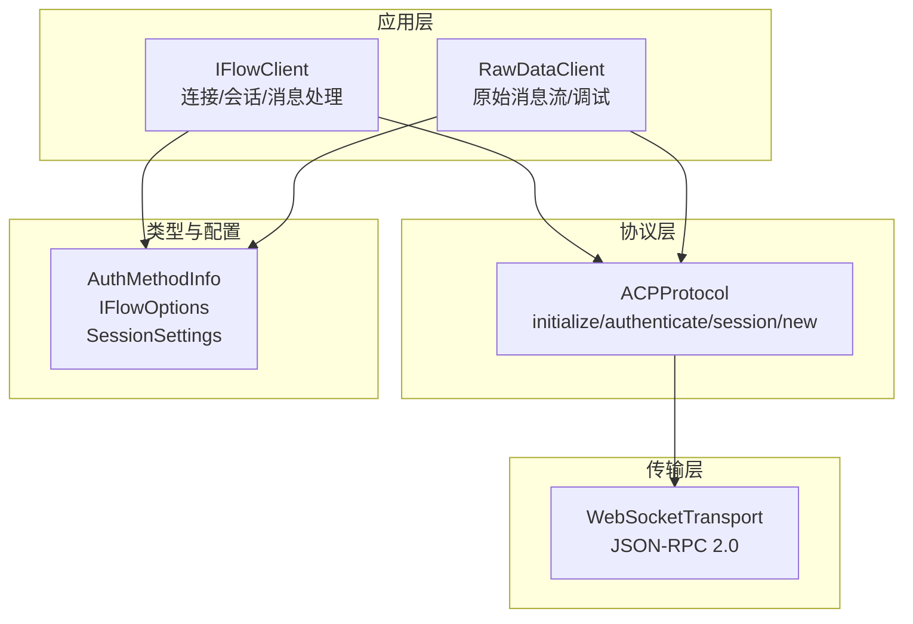
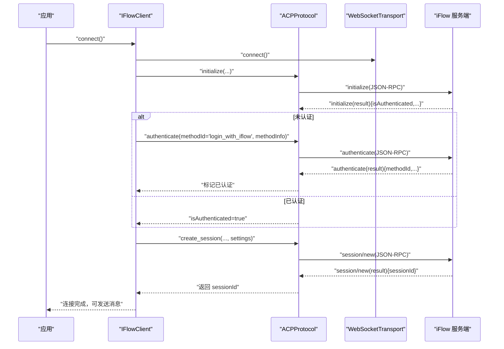
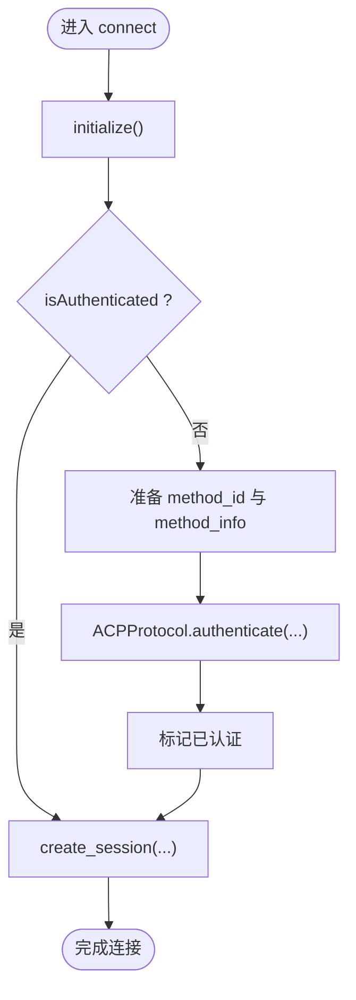
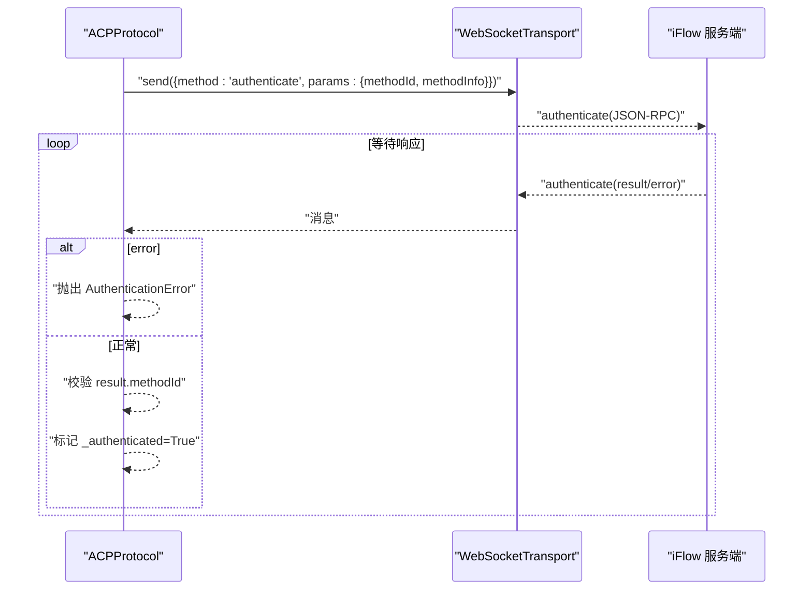
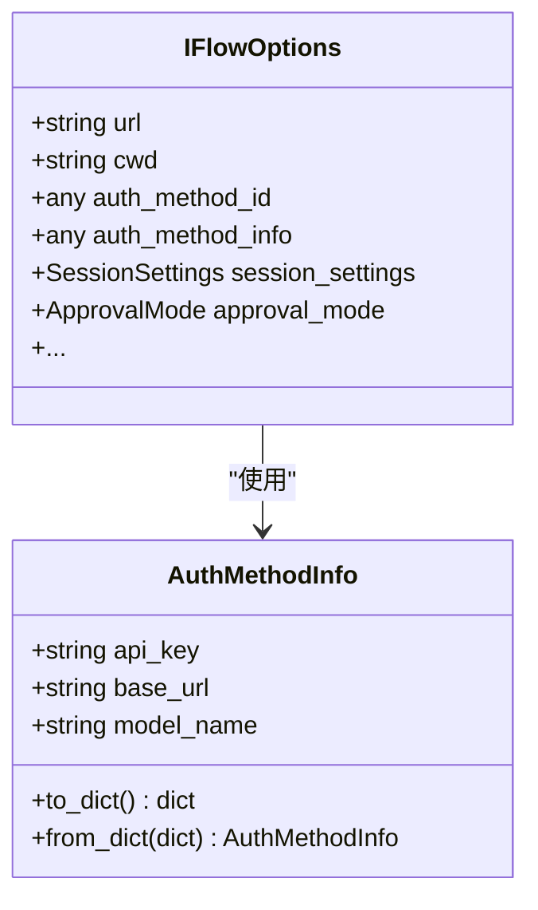
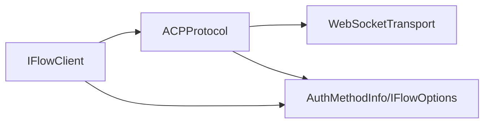

# login_with_iflow 认证方法

<cite>
**本文引用的文件**
- [client.py](file://client.py)
- [types.py](file://types.py)
- [_internal/protocol.py](file://_internal/protocol.py)
- [raw_client.py](file://raw_client.py)
- [__init__.py](file://__init__.py)
</cite>

## 目录
1. [简介](#简介)
2. [项目结构](#项目结构)
3. [核心组件](#核心组件)
4. [架构总览](#架构总览)
5. [详细组件分析](#详细组件分析)
6. [依赖关系分析](#依赖关系分析)
7. [性能与可靠性考量](#性能与可靠性考量)
8. [故障排查指南](#故障排查指南)
9. [结论](#结论)
10. [附录：使用示例与最佳实践](#附录使用示例与最佳实践)

## 简介
本文件围绕“login_with_iflow”认证方法进行系统化说明，重点阐述其在 iFlow SDK 中的使用场景、配置要求、工作流程以及与 ACP 协议的交互细节。文档同时解释如何通过 IFlowOptions 的 auth_method_id 与 auth_method_info 参数传递认证信息，并结合实际代码路径展示认证调用链路，最后提供常见问题的定位与解决建议。

## 项目结构
- 客户端层：IFlowClient 负责连接、会话管理、消息收发与工具调用确认等。
- 协议层：ACPProtocol 实现 ACP v0.0.9 的 JSON-RPC 通信，包含 initialize、authenticate、session/new 等方法。
- 类型定义：types 模块提供认证信息 AuthMethodInfo、会话设置 SessionSettings、选项 IFlowOptions 等。
- 原始数据客户端：RawDataClient 提供原始消息流与调试能力，便于深入理解认证交互。

图表来源
- [client.py](file://client.py#L132-L318)
- [_internal/protocol.py](file://_internal/protocol.py#L64-L175)
- [types.py](file://types.py#L925-L1065)

章节来源
- [client.py](file://client.py#L132-L318)
- [_internal/protocol.py](file://_internal/protocol.py#L64-L175)
- [types.py](file://types.py#L925-L1065)

## 核心组件
- IFlowClient.connect：负责建立连接、初始化协议、按需执行认证、创建会话并启动消息处理任务。
- ACPProtocol.authenticate：向服务端发送 authenticate 请求，携带 methodId 与可选的 methodInfo；等待响应并标记认证状态。
- AuthMethodInfo：封装认证所需字段（如 apiKey、baseUrl、modelName），并提供 to_dict/from_dict 以适配 ACP 协议格式。
- IFlowOptions：承载全局配置，其中 auth_method_id 与 auth_method_info 决定认证方式与参数。

章节来源
- [client.py](file://client.py#L263-L276)
- [_internal/protocol.py](file://_internal/protocol.py#L176-L255)
- [types.py](file://types.py#L925-L1065)

## 架构总览
下图展示了 login_with_iflow 认证在 SDK 中的端到端调用路径，从 IFlowClient.connect 到 ACPProtocol.authenticate，再到服务端返回结果。

图表来源
- [client.py](file://client.py#L132-L318)
- [_internal/protocol.py](file://_internal/protocol.py#L64-L175)
- [_internal/protocol.py](file://_internal/protocol.py#L176-L255)
- [_internal/protocol.py](file://_internal/protocol.py#L257-L345)

## 详细组件分析

### IFlowClient.connect 中的认证触发逻辑
- 当 initialize 返回 isAuthenticated=false 时，SDK 将根据 IFlowOptions.auth_method_id 与 auth_method_info 执行认证。
- 若 auth_method_info 是 AuthMethodInfo 对象，会先转换为字典（to_dict）再传入 authenticate。
- 认证成功后，SDK 标记 _authenticated 并继续创建会话。

图表来源
- [client.py](file://client.py#L263-L310)
- [_internal/protocol.py](file://_internal/protocol.py#L176-L255)

章节来源
- [client.py](file://client.py#L263-L310)
- [_internal/protocol.py](file://_internal/protocol.py#L176-L255)

### ACPProtocol.authenticate 的实现要点
- 发送 authenticate 请求时，params 包含 methodId 与可选的 methodInfo 字典。
- 等待响应，解析 JSON-RPC 结果，若 result 中包含 methodId 且匹配，则标记认证成功。
- 若出现 error 或超时，抛出相应异常（AuthenticationError/TimeoutError）。

图表来源
- [_internal/protocol.py](file://_internal/protocol.py#L176-L255)

章节来源
- [_internal/protocol.py](file://_internal/protocol.py#L176-L255)

### AuthMethodInfo 与 IFlowOptions 的字段映射
- AuthMethodInfo.to_dict 将 snake_case 字段映射为 camelCase（apiKey/baseUrl/modelName），以满足 ACP 协议格式。
- IFlowOptions.auth_method_id 用于指定认证方法 ID（例如 "login_with_iflow"），auth_method_info 可为字典或 AuthMethodInfo 对象。

图表来源
- [types.py](file://types.py#L925-L1065)

章节来源
- [types.py](file://types.py#L925-L1065)

### RawDataClient 的原始消息访问
- RawDataClient 在标准 IFlowClient 基础上，提供原始 WebSocket 文本/JSON 流与解析后的消息流，便于调试认证交互。
- 支持 receive_raw_messages、receive_dual_stream 与 get_protocol_stats 等能力。

章节来源
- [raw_client.py](file://raw_client.py#L120-L237)

## 依赖关系分析
- IFlowClient 依赖 ACPProtocol 与 WebSocketTransport 完成连接与认证。
- ACPProtocol 依赖 WebSocketTransport 进行 JSON-RPC 通信，并在认证阶段等待服务端响应。
- AuthMethodInfo 作为认证参数载体，被 IFlowOptions 持有并在 connect 时传递给 ACPProtocol.authenticate。

图表来源
- [client.py](file://client.py#L132-L318)
- [_internal/protocol.py](file://_internal/protocol.py#L64-L175)
- [types.py](file://types.py#L925-L1065)

章节来源
- [client.py](file://client.py#L132-L318)
- [_internal/protocol.py](file://_internal/protocol.py#L64-L175)
- [types.py](file://types.py#L925-L1065)

## 性能与可靠性考量
- 连接重试：IFlowClient.connect 在建立传输连接时采用指数回退策略，提升网络不稳定环境下的成功率。
- 认证超时：ACPProtocol.authenticate 设置了固定超时时间，避免长时间阻塞。
- 会话设置：IFlowClient.connect 会将 ApprovalMode 映射到 session_settings.permission_mode，影响工具调用权限策略。

章节来源
- [client.py](file://client.py#L204-L221)
- [_internal/protocol.py](file://_internal/protocol.py#L213-L255)
- [client.py](file://client.py#L285-L288)

## 故障排查指南
- 认证失败
  - 症状：收到 AuthenticationError 或服务端返回 error。
  - 排查要点：
    - 确认 IFlowOptions.auth_method_id 是否为 "login_with_iflow"。
    - 确认 AuthMethodInfo.to_dict 输出的字段名是否为 camelCase（apiKey/baseUrl/modelName）。
    - 使用 RawDataClient 查看原始 authenticate 请求与响应，核对 methodId 与错误信息。
  - 参考路径：
    - [client.py](file://client.py#L263-L276)
    - [_internal/protocol.py](file://_internal/protocol.py#L176-L255)
    - [raw_client.py](file://raw_client.py#L174-L237)

- 认证超时
  - 症状：等待 authenticate 响应超过阈值，抛出 TimeoutError。
  - 排查要点：
    - 检查网络连通性与服务端可达性。
    - 确认服务端支持 login_with_iflow 方法。
  - 参考路径：
    - [_internal/protocol.py](file://_internal/protocol.py#L213-L255)

- 初始化失败
  - 症状：initialize 阶段收到 error 或无法接收 //ready。
  - 排查要点：
    - 确认 WebSocket URL 正确（默认 ws://localhost:8090/acp）。
    - 检查服务端版本与协议兼容性。
  - 参考路径：
    - [_internal/protocol.py](file://_internal/protocol.py#L64-L175)

## 结论
login_with_iflow 认证方法通过 IFlowOptions.auth_method_id 与 auth_method_info 两个关键字段进行配置，SDK 在 connect 阶段自动判断是否需要认证，并调用 ACPProtocol.authenticate 完成认证。AuthMethodInfo 提供了字段格式转换，确保与 ACP 协议兼容。借助 RawDataClient，开发者可以深入观察认证请求与响应，快速定位问题。

## 附录：使用示例与最佳实践
- 使用场景
  - 需要以“login_with_iflow”方法进行认证的集成场景。
  - 通过 IFlowOptions.auth_method_id 指定方法 ID，auth_method_info 提供 apiKey/baseUrl/modelName 等必要参数。
- 配置要点
  - 将 auth_method_id 设为 "login_with_iflow"。
  - 使用 AuthMethodInfo.to_dict 输出的字典作为 methodInfo，确保字段名为 camelCase。
  - 如需细粒度控制，可在 SessionSettings 中设置 permission_mode（由 ApprovalMode 映射）。
- 最佳实践
  - 在 connect 前准备好认证信息，避免运行时动态修改导致的不一致。
  - 使用 RawDataClient 的 receive_dual_stream 同时观察原始与解析消息，辅助诊断。
  - 对于生产环境，建议开启日志并记录认证相关事件，便于审计与排障。

章节来源
- [client.py](file://client.py#L263-L310)
- [types.py](file://types.py#L925-L1065)
- [raw_client.py](file://raw_client.py#L174-L237)
- [__init__.py](file://__init__.py#L21-L75)