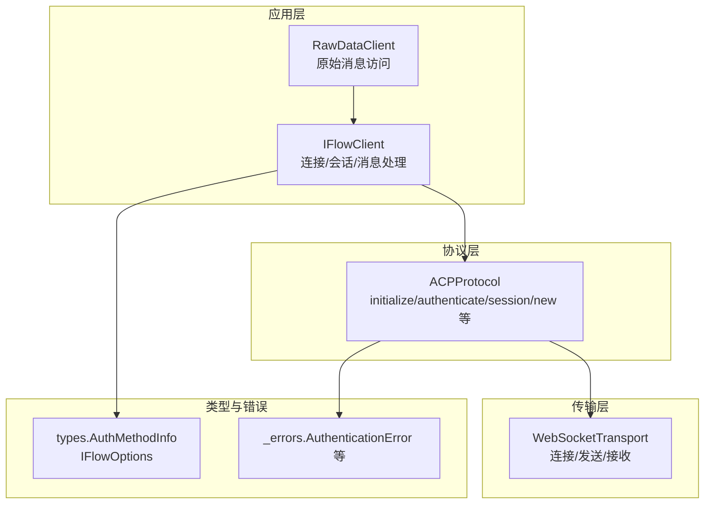
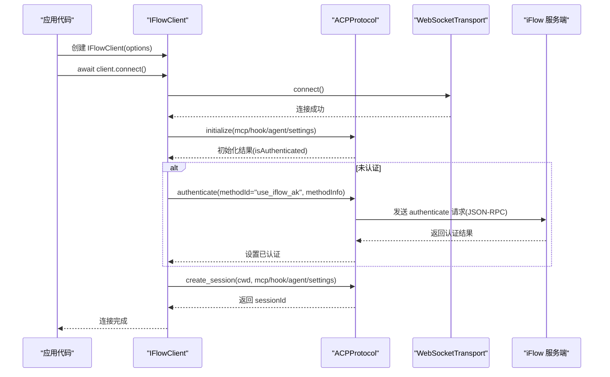
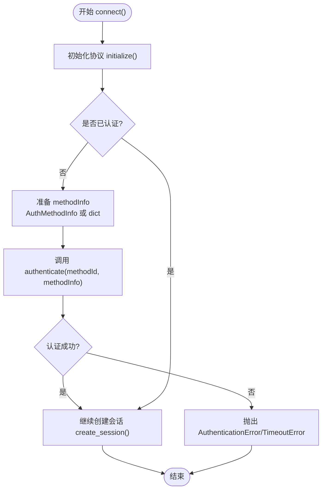
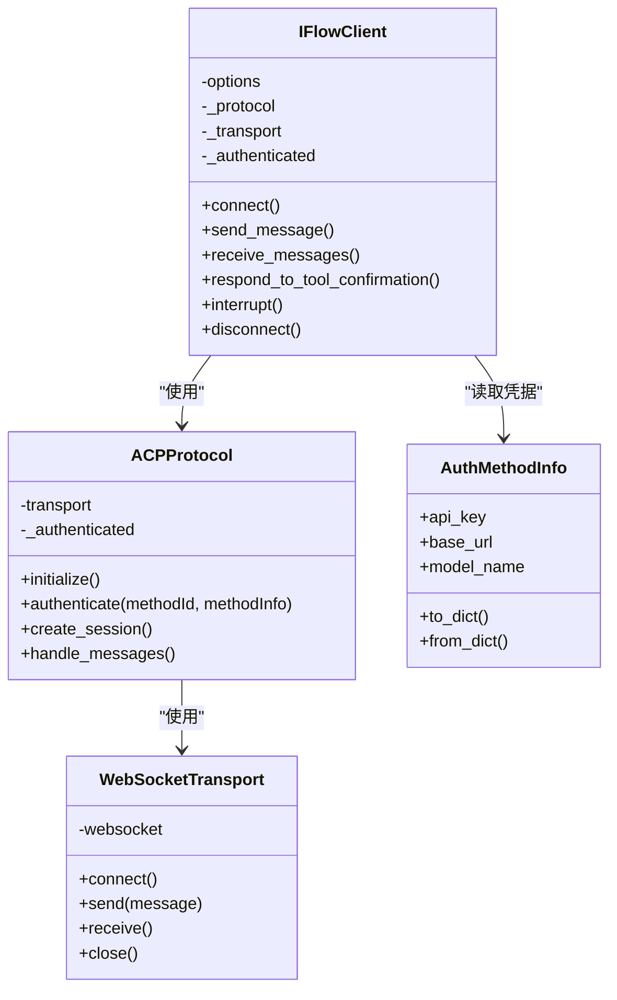

# use_iflow_ak 认证方法

<cite>
**本文引用的文件**
- [client.py](file://client.py)
- [types.py](file://types.py)
- [_internal/protocol.py](file://_internal/protocol.py)
- [_internal/transport.py](file://_internal/transport.py)
- [_errors.py](file://_errors.py)
- [query.py](file://query.py)
</cite>

## 目录
1. [简介](#简介)
2. [项目结构](#项目结构)
3. [核心组件](#核心组件)
4. [架构总览](#架构总览)
5. [详细组件分析](#详细组件分析)
6. [依赖关系分析](#依赖关系分析)
7. [性能考量](#性能考量)
8. [故障排查指南](#故障排查指南)
9. [结论](#结论)
10. [附录](#附录)

## 简介
本文件聚焦于 SDK 中的“use_iflow_ak”认证方法，系统性解析其在连接流程中的触发机制、method_info 参数（apiKey、baseUrl、modelName）的作用与格式要求，并结合代码路径给出正确的凭据配置方式。同时，从安全与适用场景角度提供最佳实践建议，帮助开发者在不同部署环境中安全地使用该认证方式。

## 项目结构
SDK 采用分层设计：高层客户端负责会话生命周期与消息收发；协议层封装 ACP 协议的 JSON-RPC 消息；传输层抽象 WebSocket 通信；类型定义集中于 types 模块；错误类型统一由 _errors 模块提供。

图表来源
- [client.py](file://client.py#L132-L318)
- [_internal/protocol.py](file://_internal/protocol.py#L176-L256)
- [_internal/transport.py](file://_internal/transport.py#L53-L146)
- [types.py](file://types.py#L926-L1065)
- [_errors.py](file://_errors.py#L10-L85)

章节来源
- [client.py](file://client.py#L132-L318)
- [_internal/protocol.py](file://_internal/protocol.py#L176-L256)
- [_internal/transport.py](file://_internal/transport.py#L53-L146)
- [types.py](file://types.py#L926-L1065)
- [_errors.py](file://_errors.py#L10-L85)

## 核心组件
- IFlowClient：负责连接建立、认证、会话创建、消息收发与资源清理。
- ACPProtocol：实现 ACP 协议握手、认证、会话管理与消息处理。
- WebSocketTransport：提供 WebSocket 连接、消息收发与错误处理。
- AuthMethodInfo：封装认证所需凭据（apiKey、baseUrl、modelName），并支持字典序列化/反序列化。
- IFlowOptions：承载全局配置，包括认证方法 ID 与认证信息对象。

章节来源
- [client.py](file://client.py#L110-L128)
- [_internal/protocol.py](file://_internal/protocol.py#L176-L256)
- [_internal/transport.py](file://_internal/transport.py#L53-L146)
- [types.py](file://types.py#L926-L1065)

## 架构总览
下图展示了 use_iflow_ak 认证在连接流程中的调用链与数据流。

图表来源
- [client.py](file://client.py#L132-L318)
- [_internal/protocol.py](file://_internal/protocol.py#L176-L256)
- [_internal/transport.py](file://_internal/transport.py#L53-L146)

## 详细组件分析

### use_iflow_ak 认证方法的触发与流程
- 触发时机：在 IFlowClient.connect() 内部，完成初始化后若发现未认证，则根据 options.auth_method_id 与 options.auth_method_info 调用 ACPProtocol.authenticate()。
- method_id：传入字符串标识认证方法，如 "use_iflow_ak"。
- method_info：传入字典或 AuthMethodInfo 对象，包含 apiKey、baseUrl、modelName 等字段（按需提供）。

图表来源
- [client.py](file://client.py#L263-L276)
- [_internal/protocol.py](file://_internal/protocol.py#L176-L256)
- [_errors.py](file://_errors.py#L37-L46)

章节来源
- [client.py](file://client.py#L263-L276)
- [_internal/protocol.py](file://_internal/protocol.py#L176-L256)
- [_errors.py](file://_errors.py#L37-L46)

### method_info 参数详解（apiKey、baseUrl、modelName）
- 字段定义与映射：
  - apiKey：API 密钥，用于服务端验证身份。
  - baseUrl：认证服务的基础地址，通常指向鉴权接口或网关。
  - modelName：模型名称，用于区分不同模型或租户场景。
- 字段命名转换：
  - 在 AuthMethodInfo.to_dict() 中，snake_case 字段会被映射为 camelCase 键（apiKey、baseUrl、modelName），以适配 ACP 协议的 JSON-RPC 请求。
  - 反向转换：from_dict() 支持 camelCase 与 snake_case 两种键名，便于兼容不同来源的数据。
- 使用建议：
  - 仅提供必要的字段；若某字段不参与当前认证方案，可省略。
  - 建议通过 AuthMethodInfo 对象构造，再交由 IFlowClient 自动转换为字典。

章节来源
- [types.py](file://types.py#L926-L1065)

### IFlowOptions 与认证配置
- 关键字段：
  - auth_method_id：认证方法 ID，例如 "use_iflow_ak"。
  - auth_method_info：认证信息对象或字典，内容即 method_info。
- 默认行为：
  - 若 initialize() 返回 isAuthenticated=false，则 IFlowClient 会在 connect() 中自动发起 authenticate()。
  - 若已认证或未设置 auth_method_id，则跳过认证步骤。

章节来源
- [client.py](file://client.py#L263-L276)
- [types.py](file://types.py#L1024-L1065)

### 安全性考虑与适用场景
- 安全性：
  - 凭据应避免硬编码在源码中，优先使用环境变量或密钥管理服务注入。
  - 传输通道建议使用 wss（WebSocket Secure）以防止明文泄露。
  - 限制文件系统访问与工具调用权限，结合 ApprovalMode 控制工具执行策略。
- 适用场景：
  - 需要服务端鉴权的私有部署或企业内网环境。
  - 多租户或多模型隔离场景，通过 modelName 区分。
  - 与自有认证体系集成时，通过 baseUrl 指向内部网关或 OIDC 提供者。

章节来源
- [client.py](file://client.py#L132-L318)
- [types.py](file://types.py#L926-L1065)

### 凭据管理最佳实践
- 最小权限原则：仅授予业务所需的最小权限范围。
- 机密存储：使用环境变量或平台密钥管理（如云厂商 KMS、Vault）。
- 轮换策略：定期轮换 apiKey，确保旧密钥及时失效。
- 日志脱敏：避免在日志中输出完整凭据；必要时对敏感字段进行掩码处理。
- 网络隔离：在受控网络内访问 iFlow，限制暴露面。

章节来源
- [client.py](file://client.py#L132-L318)
- [types.py](file://types.py#L926-L1065)

## 依赖关系分析

图表来源
- [client.py](file://client.py#L110-L128)
- [_internal/protocol.py](file://_internal/protocol.py#L176-L256)
- [_internal/transport.py](file://_internal/transport.py#L53-L146)
- [types.py](file://types.py#L926-L1065)

章节来源
- [client.py](file://client.py#L110-L128)
- [_internal/protocol.py](file://_internal/protocol.py#L176-L256)
- [_internal/transport.py](file://_internal/transport.py#L53-L146)
- [types.py](file://types.py#L926-L1065)

## 性能考量
- 连接重试与指数退避：IFlowClient.connect() 对底层连接失败采用有限次数重试与延迟增长策略，有助于在网络波动时提升稳定性。
- 认证超时控制：ACPProtocol.authenticate() 设定固定超时时间，避免阻塞等待。
- 会话复用：成功认证后复用同一会话，减少重复握手成本。
- 流式处理：RawDataClient 提供原始消息访问能力，便于诊断与性能分析。

章节来源
- [client.py](file://client.py#L189-L221)
- [_internal/protocol.py](file://_internal/protocol.py#L176-L256)
- [raw_client.py](file://raw_client.py#L120-L173)

## 故障排查指南
- 认证失败
  - 现象：抛出 AuthenticationError。
  - 排查要点：确认 method_id 是否正确；检查 method_info 的字段命名与值；核对服务端返回的错误消息。
  - 参考路径：[认证请求与响应处理](file://_internal/protocol.py#L176-L256)
- 连接超时
  - 现象：抛出 TimeoutError。
  - 排查要点：检查网络连通性、URL 正确性、服务端负载与防火墙策略。
  - 参考路径：[连接与认证超时](file://_internal/transport.py#L53-L84), [认证超时](file://_internal/protocol.py#L213-L256)
- 会话创建异常
  - 现象：抛出 ProtocolError。
  - 排查要点：确认已认证且 initialize 成功；检查 cwd、mcp/hook/agent 配置是否合法。
  - 参考路径：[会话创建](file://_internal/protocol.py#L257-L346)
- 原始消息定位问题
  - 建议：使用 RawDataClient 同时追踪原始消息与解析后的消息，辅助定位协议交互异常。
  - 参考路径：[RawDataClient](file://raw_client.py#L120-L219)

章节来源
- [_errors.py](file://_errors.py#L37-L85)
- [_internal/protocol.py](file://_internal/protocol.py#L176-L256)
- [_internal/transport.py](file://_internal/transport.py#L53-L84)
- [raw_client.py](file://raw_client.py#L120-L219)

## 结论
use_iflow_ak 认证方法通过 IFlowClient 在连接阶段自动触发，借助 ACPProtocol 将 method_id 与 method_info（apiKey、baseUrl、modelName）封装为 JSON-RPC 请求发送至服务端。开发者应遵循最小权限、机密存储与网络隔离等安全实践，并结合 IFlowOptions 与 AuthMethodInfo 正确配置凭据。对于复杂场景，可利用 RawDataClient 获取原始消息以进行深入诊断。

## 附录
- 快速配置参考
  - 设置认证方法 ID 与认证信息对象：[IFlowOptions 字段](file://types.py#L1024-L1065)
  - 认证信息对象与字段映射：[AuthMethodInfo](file://types.py#L926-L1065)
  - 认证流程入口：[IFlowClient.connect() 中的认证逻辑](file://client.py#L263-L276)
  - 认证请求发送与响应处理：[ACPProtocol.authenticate()](file://_internal/protocol.py#L176-L256)