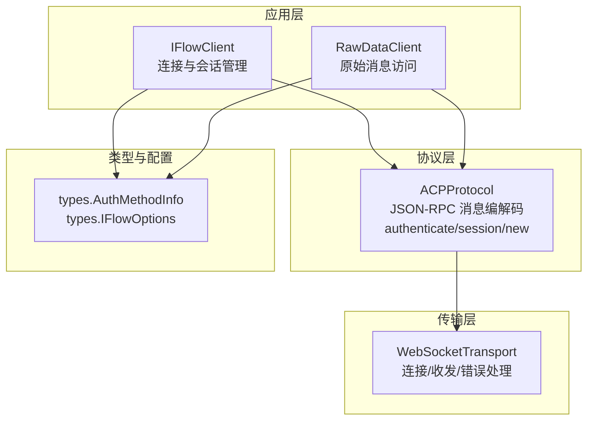
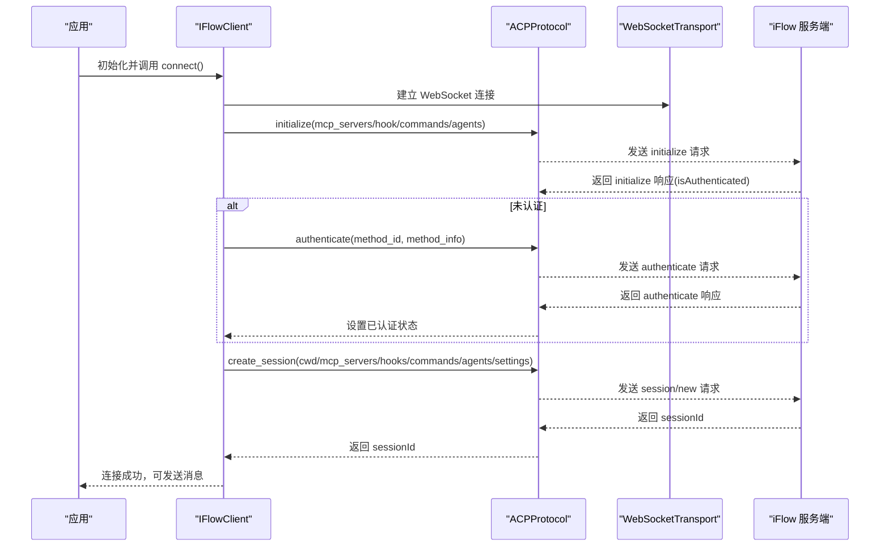
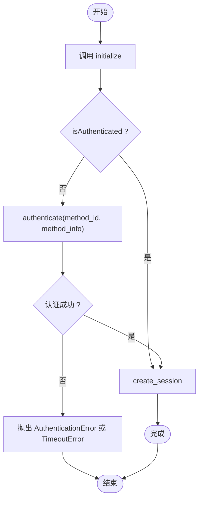
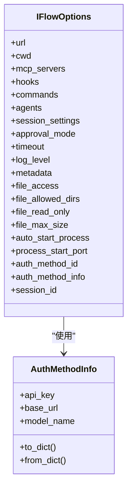
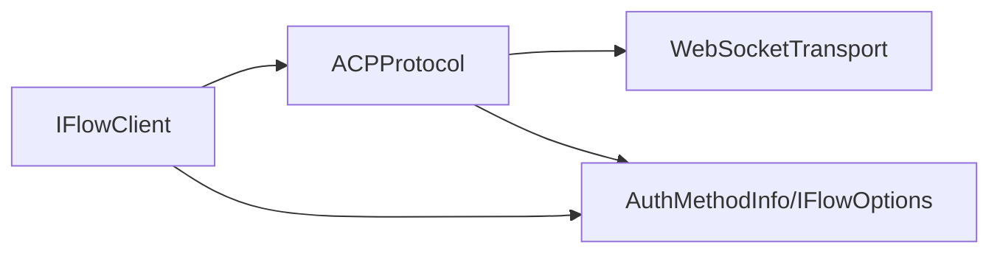

# 认证方法

<cite>
**本文引用的文件**
- [client.py](file://client.py)
- [raw_client.py](file://raw_client.py)
- [types.py](file://types.py)
- [_internal/protocol.py](file://_internal/protocol.py)
- [_internal/transport.py](file://_internal/transport.py)
- [_errors.py](file://_errors.py)
</cite>

## 目录
1. [简介](#简介)
2. [项目结构](#项目结构)
3. [核心组件](#核心组件)
4. [架构总览](#架构总览)
5. [详细组件分析](#详细组件分析)
6. [依赖关系分析](#依赖关系分析)
7. [性能与安全考量](#性能与安全考量)
8. [故障排查指南](#故障排查指南)
9. [结论](#结论)
10. [附录：认证方法选择决策树与最佳实践](#附录认证方法选择决策树与最佳实践)

## 简介
本文件聚焦于 ACP 协议在 iFlow SDK 中的认证方法支持，系统性解析以下内容：
- method_id 的可选值与使用场景（例如 use_iflow_ak、login_with_iflow）
- method_info 参数中 apiKey、baseUrl、modelName 等字段的作用与格式要求
- 不同认证方式的实现细节与调用流程
- 凭据的安全管理建议
- 面向初学者的认证方法选择决策树
- 面向高级用户的扩展与自定义最佳实践

## 项目结构
SDK 采用分层设计，认证相关逻辑集中在客户端初始化阶段，通过 ACP 协议与 iFlow 服务端交互完成认证与会话创建。

图表来源
- [client.py](file://client.py#L110-L318)
- [_internal/protocol.py](file://_internal/protocol.py#L176-L256)
- [_internal/transport.py](file://_internal/transport.py#L53-L146)
- [types.py](file://types.py#L925-L1065)

章节来源
- [client.py](file://client.py#L110-L318)
- [_internal/protocol.py](file://_internal/protocol.py#L176-L256)
- [_internal/transport.py](file://_internal/transport.py#L53-L146)
- [types.py](file://types.py#L925-L1065)

## 核心组件
- IFlowClient：负责连接、认证、会话创建、消息收发与工具调用确认。
- ACPProtocol：封装 ACP 协议的 JSON-RPC 调用，包括 initialize、authenticate、session/new 等。
- WebSocketTransport：提供 WebSocket 连接、发送、接收与错误处理。
- AuthMethodInfo：封装认证所需凭据与配置（apiKey、baseUrl、modelName），并提供字典转换。
- IFlowOptions：包含 auth_method_id 与 auth_method_info 字段，用于在连接时传递认证信息。

章节来源
- [client.py](file://client.py#L110-L318)
- [_internal/protocol.py](file://_internal/protocol.py#L176-L256)
- [_internal/transport.py](file://_internal/transport.py#L53-L146)
- [types.py](file://types.py#L925-L1065)

## 架构总览
下面以序列图展示认证流程的关键步骤与组件交互。

图表来源
- [client.py](file://client.py#L255-L310)
- [_internal/protocol.py](file://_internal/protocol.py#L176-L256)
- [_internal/transport.py](file://_internal/transport.py#L53-L146)

## 详细组件分析

### 认证方法与参数详解
- method_id 可选值
  - 支持的值在协议注释中有明确说明，例如 use_iflow_ak、login_with_iflow 等。
  - 在实际使用中，method_id 应与服务端支持的方法一致；若不匹配，协议层会记录警告但仍标记为“已认证”（以兼容响应）。
- method_info 字段
  - 由 AuthMethodInfo 提供，包含 apiKey、baseUrl、modelName 等字段。
  - 字段映射遵循 ACP 协议的大小写约定（camelCase），SDK 内部会自动进行 snake_case 与 camelCase 的双向转换。
  - 字段格式要求
    - apiKey：字符串形式的密钥或令牌，用于服务端验证身份。
    - baseUrl：认证服务的基础地址，通常指向提供认证能力的服务端点。
    - modelName：特定认证方案下的模型名称标识，用于区分不同模型或部署。

章节来源
- [_internal/protocol.py](file://_internal/protocol.py#L186-L211)
- [types.py](file://types.py#L925-L1000)

### 认证流程与实现细节
- 客户端侧触发时机
  - IFlowClient 在完成 initialize 后检查 isAuthenticated，若为 False，则根据 IFlowOptions.auth_method_id 与 auth_method_info 调用 ACPProtocol.authenticate。
- 协议层行为
  - ACPProtocol.authenticate 将 method_id 与 method_info 组装为 JSON-RPC 请求，等待服务端响应。
  - 若收到错误，抛出 AuthenticationError；超时则抛出 TimeoutError。
- 会话创建
  - 认证成功后，客户端调用 create_session 并返回 sessionId，随后进入消息处理循环。

图表来源
- [client.py](file://client.py#L255-L310)
- [_internal/protocol.py](file://_internal/protocol.py#L176-L256)

章节来源
- [client.py](file://client.py#L255-L310)
- [_internal/protocol.py](file://_internal/protocol.py#L176-L256)

### 凭据安全与管理
- AuthMethodInfo.to_dict/from_dict
  - 自动将 Python 风格的 snake_case 字段转换为 ACP 协议要求的 camelCase 字段，避免手动拼写错误。
- IFlowOptions.auth_method_id/auth_method_info
  - 通过 IFlowOptions 在连接前注入认证信息，避免在运行时暴露敏感数据。
- 最佳实践
  - 将 apiKey 存储在环境变量或受控密钥管理服务中，不要硬编码到源码。
  - 使用只读权限与最小权限原则，仅授予必要的 baseUrl/modelName。
  - 对 method_info 进行严格校验与脱敏输出，避免日志泄露。

章节来源
- [types.py](file://types.py#L925-L1000)
- [client.py](file://client.py#L255-L310)

### 类型与配置关系

图表来源
- [types.py](file://types.py#L925-L1065)

章节来源
- [types.py](file://types.py#L925-L1065)

## 依赖关系分析
- IFlowClient 依赖 ACPProtocol 与 WebSocketTransport 完成连接、认证与会话管理。
- ACPProtocol 依赖 WebSocketTransport 进行底层通信。
- AuthMethodInfo 作为 IFlowOptions 的组成部分，贯穿认证流程。

图表来源
- [client.py](file://client.py#L110-L318)
- [_internal/protocol.py](file://_internal/protocol.py#L176-L256)
- [_internal/transport.py](file://_internal/transport.py#L53-L146)
- [types.py](file://types.py#L925-L1065)

章节来源
- [client.py](file://client.py#L110-L318)
- [_internal/protocol.py](file://_internal/protocol.py#L176-L256)
- [_internal/transport.py](file://_internal/transport.py#L53-L146)
- [types.py](file://types.py#L925-L1065)

## 性能与安全考量
- 性能
  - 认证请求有固定超时时间，避免阻塞；建议在高延迟网络下适当调整 IFlowOptions.timeout。
  - 会话创建与消息发送均基于 JSON-RPC，注意控制消息体大小，避免大文件直接内联导致传输开销。
- 安全
  - 仅在必要时启用 file_access，并限制允许目录与只读模式。
  - 对 method_info 的输出进行脱敏，避免在日志中打印明文 apiKey。
  - 使用 HTTPS/WSS 通道与受信的 baseUrl，防止中间人攻击。

[本节为通用指导，无需列出具体文件来源]

## 故障排查指南
- 常见异常
  - AuthenticationError：认证失败，检查 method_id 与 method_info 是否正确。
  - TimeoutError：认证或会话创建超时，检查网络连通性与服务端状态。
  - ProtocolError：协议握手或响应异常，查看 initialize/initialize 响应。
  - TransportError/ConnectionError：底层连接问题，检查 WebSocket URL 与防火墙设置。
- 排查步骤
  - 使用 RawDataClient 获取原始消息流，核对 authenticate 请求与响应的字段是否符合预期。
  - 开启更详细的日志级别，定位具体失败环节。
  - 确认 IFlowOptions.auth_method_id 与服务端支持的方法一致。

章节来源
- [_errors.py](file://_errors.py#L1-L85)
- [raw_client.py](file://raw_client.py#L1-L120)
- [_internal/protocol.py](file://_internal/protocol.py#L176-L256)

## 结论
- ACP 协议在 SDK 中提供了清晰的认证入口：method_id 与 method_info 通过 IFlowOptions 注入，经由 ACPProtocol.authenticate 完成。
- AuthMethodInfo 提供了字段映射与序列化能力，确保与服务端的兼容性。
- 建议在生产环境中严格管理凭据，最小权限授权，并通过 RawDataClient 与 ProtocolDebugger 辅助调试。

[本节为总结性内容，无需列出具体文件来源]

## 附录：认证方法选择决策树与最佳实践

### 认证方法选择决策树
- 是否需要服务端认证？
  - 是：设置 IFlowOptions.auth_method_id 与 auth_method_info。
  - 否：保持 auth_method_id 为空，按服务端默认策略处理。
- 服务端支持哪些 method_id？
  - 若服务端支持 use_iflow_ak：选择该方法，method_info 填写 apiKey、baseUrl、modelName。
  - 若服务端支持 login_with_iflow：选择该方法，method_info 填写对应凭据。
  - 其他方法：参考服务端文档与 SDK 注释，确保字段与大小写一致。
- 凭据管理
  - 使用环境变量或密钥管理服务存储 apiKey。
  - 仅在开发/沙箱环境使用宽松的 baseUrl；生产环境使用受信域名。
  - 对 method_info 进行脱敏输出，避免泄露。

### 扩展与自定义最佳实践（高级用户）
- 新增认证方法
  - 在服务端新增 method_id 后，在客户端通过 IFlowOptions.auth_method_id 指定新方法名。
  - 在 method_info 中添加新字段（如新的模型标识或服务端参数），保持 camelCase 映射。
- 自定义凭据序列化
  - 如需扩展 AuthMethodInfo，可在 to_dict/from_dict 中增加字段映射，确保与服务端契约一致。
- 会话级权限控制
  - 通过 IFlowOptions.session_settings.permission_mode 控制工具调用权限策略，配合 ApprovalMode 与权限选项使用。
- 调试与可观测性
  - 使用 RawDataClient 与 ProtocolDebugger 分析原始消息，快速定位认证与会话问题。
  - 在日志中避免输出完整 method_info，仅输出必要摘要信息。

[本节为概念性内容，无需列出具体文件来源]