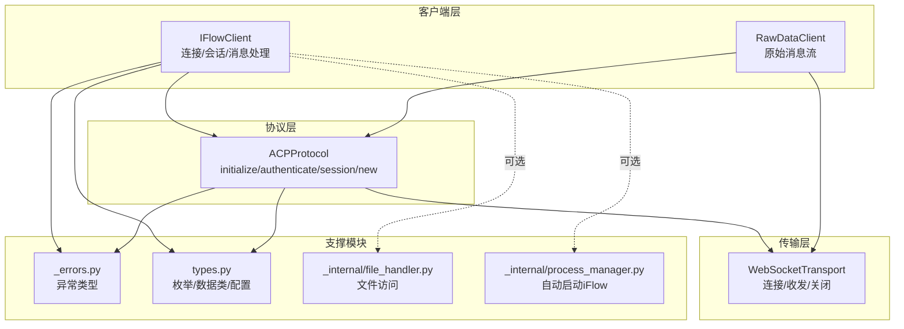
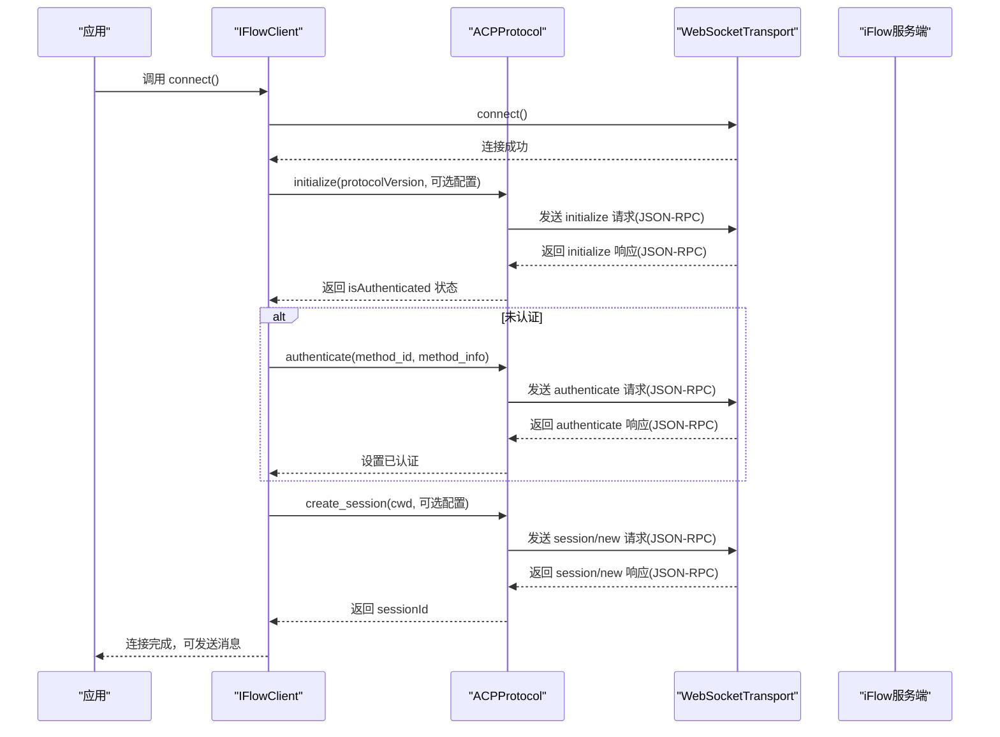
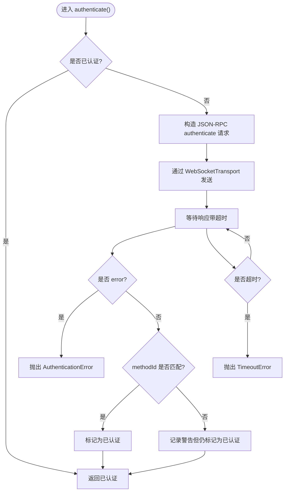
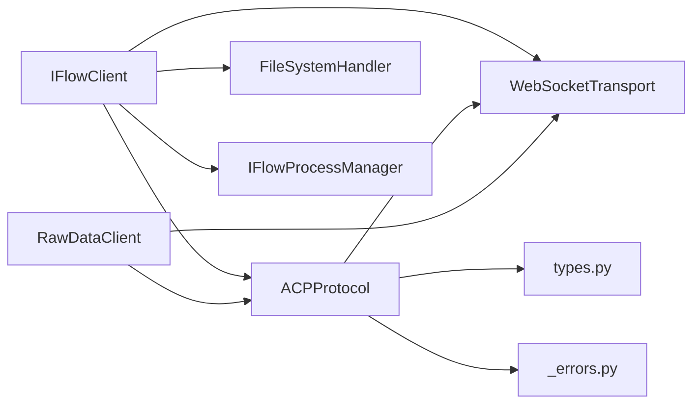
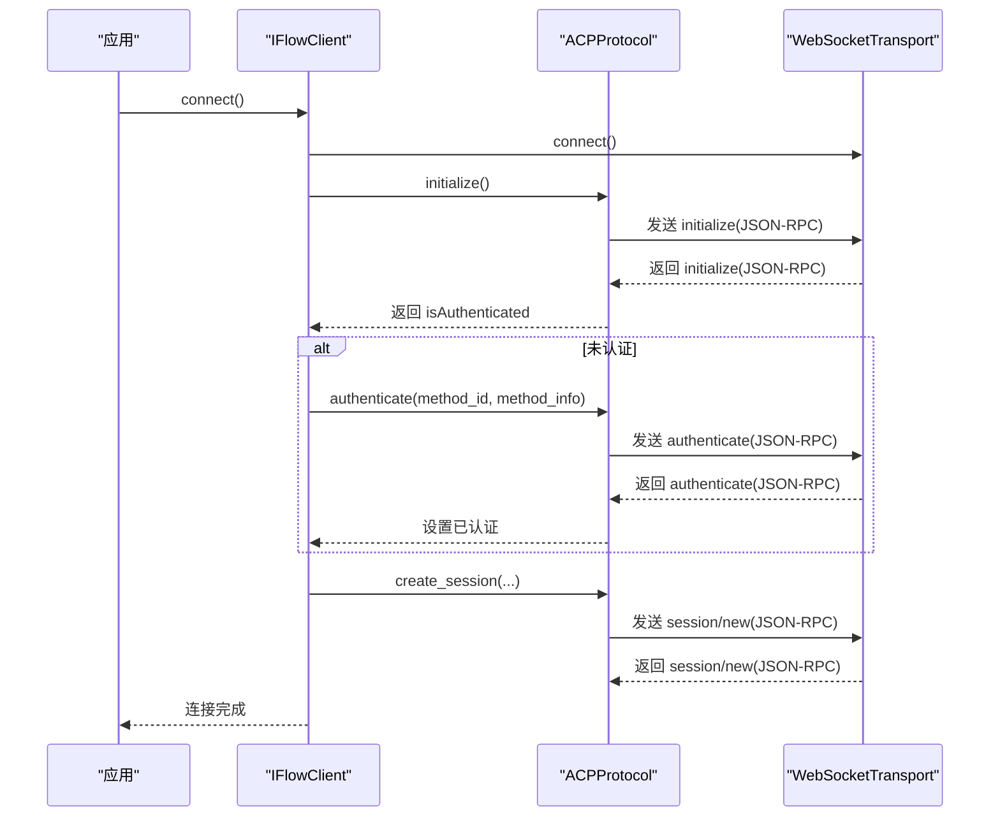

# 认证流程

<cite>
**本文引用的文件**
- [client.py](file://client.py)
- [raw_client.py](file://raw_client.py)
- [_internal/protocol.py](file://_internal/protocol.py)
- [_internal/transport.py](file://_internal/transport.py)
- [types.py](file://types.py)
- [_errors.py](file://_errors.py)
- [_internal/file_handler.py](file://_internal/file_handler.py)
- [_internal/process_manager.py](file://_internal/process_manager.py)
</cite>

## 目录
1. [简介](#简介)
2. [项目结构](#项目结构)
3. [核心组件](#核心组件)
4. [架构总览](#架构总览)
5. [详细组件分析](#详细组件分析)
6. [依赖关系分析](#依赖关系分析)
7. [性能考量](#性能考量)
8. [故障排查指南](#故障排查指南)
9. [结论](#结论)
10. [附录](#附录)

## 简介
本文件围绕 ACP 协议的认证机制展开，重点解析 authenticate() 方法的工作流程与状态管理，说明 initialize() 响应中的 isAuthenticated 标志如何驱动是否执行认证；解释 method_id 与 method_info 的作用及不同认证方式的配置；梳理认证请求与响应的 JSON-RPC 消息结构；给出超时与错误恢复策略；并提供面向初学者的时序图与面向高级用户的最佳实践建议。

## 项目结构
SDK 采用分层设计：客户端层负责会话生命周期与消息处理；协议层实现 ACP 协议（JSON-RPC）；传输层封装 WebSocket；类型与错误模块提供数据结构与异常体系；可选的文件访问与进程管理模块增强功能。

图表来源
- [client.py](file://client.py#L110-L320)
- [_internal/protocol.py](file://_internal/protocol.py#L21-L120)
- [_internal/transport.py](file://_internal/transport.py#L27-L120)
- [types.py](file://types.py#L996-L1065)
- [_errors.py](file://_errors.py#L10-L85)
- [_internal/file_handler.py](file://_internal/file_handler.py#L16-L60)
- [_internal/process_manager.py](file://_internal/process_manager.py#L25-L60)

章节来源
- [client.py](file://client.py#L110-L320)
- [_internal/protocol.py](file://_internal/protocol.py#L21-L120)
- [_internal/transport.py](file://_internal/transport.py#L27-L120)
- [types.py](file://types.py#L996-L1065)
- [_errors.py](file://_errors.py#L10-L85)
- [_internal/file_handler.py](file://_internal/file_handler.py#L16-L60)
- [_internal/process_manager.py](file://_internal/process_manager.py#L25-L60)

## 核心组件
- IFlowClient：高层客户端，负责连接、初始化、认证、会话创建、消息收发与清理。
- ACPProtocol：ACP 协议实现，包含 initialize()、authenticate()、session/new 等方法，负责 JSON-RPC 消息编解码与状态管理。
- WebSocketTransport：WebSocket 传输层，负责连接、发送、接收与关闭。
- RawDataClient：扩展客户端，提供原始消息流与双流对齐能力，便于调试。
- 类型与错误：IFlowOptions、AuthMethodInfo、ApprovalMode、各种消息类型与异常类型。
- 文件访问与进程管理：可选的安全控制与自动启动能力。

章节来源
- [client.py](file://client.py#L110-L320)
- [_internal/protocol.py](file://_internal/protocol.py#L21-L120)
- [_internal/transport.py](file://_internal/transport.py#L27-L120)
- [raw_client.py](file://raw_client.py#L72-L120)
- [types.py](file://types.py#L996-L1065)
- [_errors.py](file://_errors.py#L10-L85)
- [_internal/file_handler.py](file://_internal/file_handler.py#L16-L60)
- [_internal/process_manager.py](file://_internal/process_manager.py#L25-L60)

## 架构总览
下面的时序图展示了从连接到认证再到会话创建的关键步骤，以及 authenticate() 的工作路径。

图表来源
- [client.py](file://client.py#L254-L310)
- [_internal/protocol.py](file://_internal/protocol.py#L120-L171)
- [_internal/protocol.py](file://_internal/protocol.py#L176-L256)
- [_internal/protocol.py](file://_internal/protocol.py#L257-L346)
- [_internal/transport.py](file://_internal/transport.py#L53-L120)

## 详细组件分析

### authenticate() 方法工作流程
- 触发条件：initialize() 返回的 isAuthenticated 为 False 时，IFlowClient 在 connect() 中调用 authenticate()。
- 参数：
  - method_id：认证方法标识，如 "use_iflow_ak" 或 "login_with_iflow"。
  - method_info：认证信息字典，通常包含 apiKey、baseUrl、modelName 等键，由 AuthMethodInfo.to_dict() 序列化后传入。
- 请求消息结构（JSON-RPC）：
  - jsonrpc: "2.0"
  - id: 自增请求 ID
  - method: "authenticate"
  - params.methodId: method_id
  - params.methodInfo: method_info（可选）
- 响应处理：
  - 若收到 error 字段，抛出 AuthenticationError。
  - 若 result 中包含 methodId 且与请求一致或兼容，则标记为已认证。
  - 超时处理：authenticate() 内部设置固定超时时间，超时抛出 TimeoutError。
- 成功后的状态管理：
  - IFlowClient 将内部 _authenticated 置为 True，后续 create_session() 才会被允许。
  - ACPProtocol 同步维护 _authenticated 状态，供其他方法校验。

图表来源
- [_internal/protocol.py](file://_internal/protocol.py#L176-L256)

章节来源
- [_internal/protocol.py](file://_internal/protocol.py#L176-L256)
- [client.py](file://client.py#L263-L276)

### initialize() 与 isAuthenticated 标志
- initialize() 通过 JSON-RPC "initialize" 方法与服务端握手，返回结果包含 protocolVersion、isAuthenticated、authMethods 等字段。
- IFlowClient 在 connect() 中读取 isAuthenticated 并据此决定是否调用 authenticate()。
- ACPProtocol.initialize() 也维护自身的 _authenticated 状态，用于后续方法的前置校验。

章节来源
- [_internal/protocol.py](file://_internal/protocol.py#L64-L171)
- [client.py](file://client.py#L254-L276)

### method_id 与 method_info 参数详解
- method_id：指定使用的认证方法 ID，例如 "use_iflow_ak"、"login_with_iflow" 等。该值直接写入 authenticate 请求的 params.methodId。
- method_info：认证附加信息，通常包含：
  - apiKey：API 密钥
  - baseUrl：认证服务基础地址
  - modelName：模型名称（某些方案需要）
- IFlowClient 在 connect() 中将 types.AuthMethodInfo 对象转换为字典后传递给 ACPProtocol.authenticate()。

章节来源
- [client.py](file://client.py#L263-L276)
- [types.py](file://types.py#L926-L994)
- [_internal/protocol.py](file://_internal/protocol.py#L176-L209)

### 认证请求与响应的 JSON-RPC 结构
- 请求（authenticate）：
  - jsonrpc: "2.0"
  - id: 数字
  - method: "authenticate"
  - params.methodId: 字符串
  - params.methodInfo: 字典（可选）
- 响应（authenticate）：
  - jsonrpc: "2.0"
  - id: 数字
  - result.methodId: 字符串（与请求一致或兼容）
  - 或 error: 包含错误信息的对象
- initialize 响应包含：
  - result.isAuthenticated: 布尔
  - result.protocolVersion: 数字
  - result.authMethods: 列表（可用认证方法）

章节来源
- [_internal/protocol.py](file://_internal/protocol.py#L120-L171)
- [_internal/protocol.py](file://_internal/protocol.py#L176-L256)

### 认证成功后的状态管理
- IFlowClient：
  - _authenticated：布尔，表示当前会话是否已认证。
  - 仅在认证成功后才允许创建会话。
- ACPProtocol：
  - _authenticated：布尔，与客户端同步。
  - _pending_requests：用于跟踪请求响应。
  - _pending_permission_requests：用于工具调用权限请求的用户响应。
- 会话创建前的前置校验：
  - create_session() 会在未初始化或未认证时抛出 ProtocolError。

章节来源
- [client.py](file://client.py#L254-L310)
- [_internal/protocol.py](file://_internal/protocol.py#L257-L346)
- [_internal/protocol.py](file://_internal/protocol.py#L720-L786)

### 超时与错误恢复策略
- 认证超时：authenticate() 内置固定超时，超时抛出 TimeoutError。
- 连接重试：IFlowClient.connect() 对底层 WebSocket 连接进行有限次重试与指数回退。
- 错误传播：认证失败抛出 AuthenticationError；协议层在解析错误时抛出相应异常；传输层在连接丢失时抛出 ConnectionError。
- 清理与断开：IFlowClient._cleanup() 会取消消息处理任务、关闭传输、停止自动启动的 iFlow 进程。

章节来源
- [_internal/protocol.py](file://_internal/protocol.py#L213-L256)
- [client.py](file://client.py#L189-L221)
- [_errors.py](file://_errors.py#L10-L85)
- [client.py](file://client.py#L368-L398)

### 不同认证方式的配置
- 使用 AuthMethodInfo：
  - IFlowOptions.auth_method_info 支持传入 AuthMethodInfo 对象或字典。
  - IFlowClient 在 connect() 中将其转换为字典并传给 authenticate()。
- method_id 示例：
  - "use_iflow_ak"、"login_with_iflow" 等，具体取决于服务端支持的方法列表（initialize 返回的 authMethods）。
- 安全建议：
  - 优先使用受控环境变量或安全存储管理 apiKey。
  - 限制 baseUrl 与 modelName 的范围，避免泄露敏感信息。

章节来源
- [client.py](file://client.py#L263-L276)
- [types.py](file://types.py#L926-L994)
- [_internal/protocol.py](file://_internal/protocol.py#L120-L171)

### 高级：RawDataClient 与原始消息流
- RawDataClient 提供：
  - receive_raw_messages()：原始字符串/JSON 流。
  - receive_dual_stream()：原始与解析消息的对齐输出。
  - get_raw_history()/get_protocol_stats()：调试统计。
- 适合在认证阶段观察 authenticate 请求/响应与控制消息（//ready、//error 等）。

章节来源
- [raw_client.py](file://raw_client.py#L120-L238)
- [_internal/transport.py](file://_internal/transport.py#L114-L146)

## 依赖关系分析
- IFlowClient 依赖 ACPProtocol 与 WebSocketTransport；可选依赖 FileSystemHandler 与 IFlowProcessManager。
- ACPProtocol 依赖 WebSocketTransport；依赖 types 中的 ApprovalMode、AuthMethodInfo 等类型；依赖 _errors 异常类型。
- WebSocketTransport 依赖 websockets 库；提供连接、发送、接收、关闭等能力。
- RawDataClient 继承 IFlowClient，扩展原始消息能力。

图表来源
- [client.py](file://client.py#L110-L320)
- [_internal/protocol.py](file://_internal/protocol.py#L21-L120)
- [_internal/transport.py](file://_internal/transport.py#L27-L120)
- [types.py](file://types.py#L996-L1065)
- [_errors.py](file://_errors.py#L10-L85)
- [raw_client.py](file://raw_client.py#L72-L120)

章节来源
- [client.py](file://client.py#L110-L320)
- [_internal/protocol.py](file://_internal/protocol.py#L21-L120)
- [_internal/transport.py](file://_internal/transport.py#L27-L120)
- [types.py](file://types.py#L996-L1065)
- [_errors.py](file://_errors.py#L10-L85)
- [raw_client.py](file://raw_client.py#L72-L120)

## 性能考量
- 连接与认证：
  - WebSocket 连接具备超时与重试策略，避免长时间阻塞。
  - 认证请求内置超时，防止阻塞会话创建。
- 消息处理：
  - IFlowClient 使用异步队列与后台任务处理消息，降低主线程压力。
  - RawDataClient 双流并发采集，注意内存占用与历史记录长度。
- 文件访问：
  - FileSystemHandler 限制目录白名单、大小限制与只读模式，减少 IO 开销与风险。

[本节为通用指导，不涉及具体文件分析]

## 故障排查指南
- 认证失败：
  - 检查 method_id 是否在 initialize 返回的 authMethods 中。
  - 确认 method_info 字段完整（apiKey、baseUrl、modelName），必要时使用 AuthMethodInfo.from_dict() 兼容不同命名风格。
  - 查看 RawDataClient 的原始消息流，定位 error 字段与错误详情。
- 超时问题：
  - 认证超时：增大超时或检查网络连通性。
  - 会话创建超时：确认 initialize 已成功且 isAuthenticated 为真。
- 连接问题：
  - WebSocket 连接失败：检查 URL、防火墙与端口占用。
  - 连接中断：查看传输层日志与连接状态。
- 断开与清理：
  - 使用 IFlowClient.disconnect() 或上下文管理器确保资源释放。

章节来源
- [_internal/protocol.py](file://_internal/protocol.py#L176-L256)
- [_internal/protocol.py](file://_internal/protocol.py#L257-L346)
- [_internal/transport.py](file://_internal/transport.py#L53-L120)
- [raw_client.py](file://raw_client.py#L120-L238)
- [client.py](file://client.py#L368-L398)

## 结论
本文件系统性解析了 ACP 协议的认证机制：从 initialize 的 isAuthenticated 标志到 authenticate 的 JSON-RPC 流程，再到认证成功后的状态管理与会话创建。结合超时与错误恢复策略、原始消息调试能力与安全配置建议，既适合初学者快速上手，也为高级用户提供了深入的技术细节与最佳实践参考。

[本节为总结性内容，不涉及具体文件分析]

## 附录

### 认证流程时序图（概念版）

[本图为概念示意，不映射具体源文件]