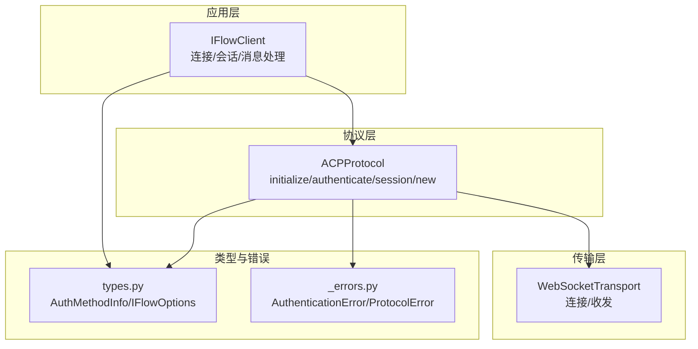
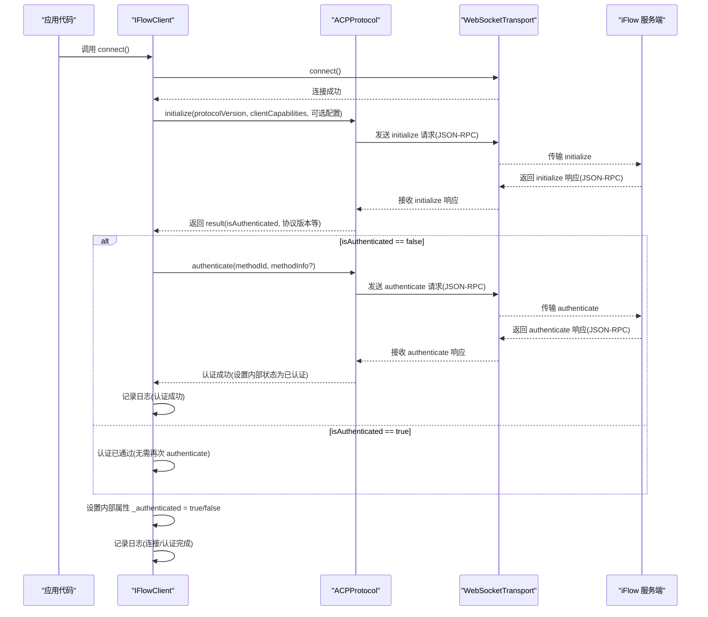
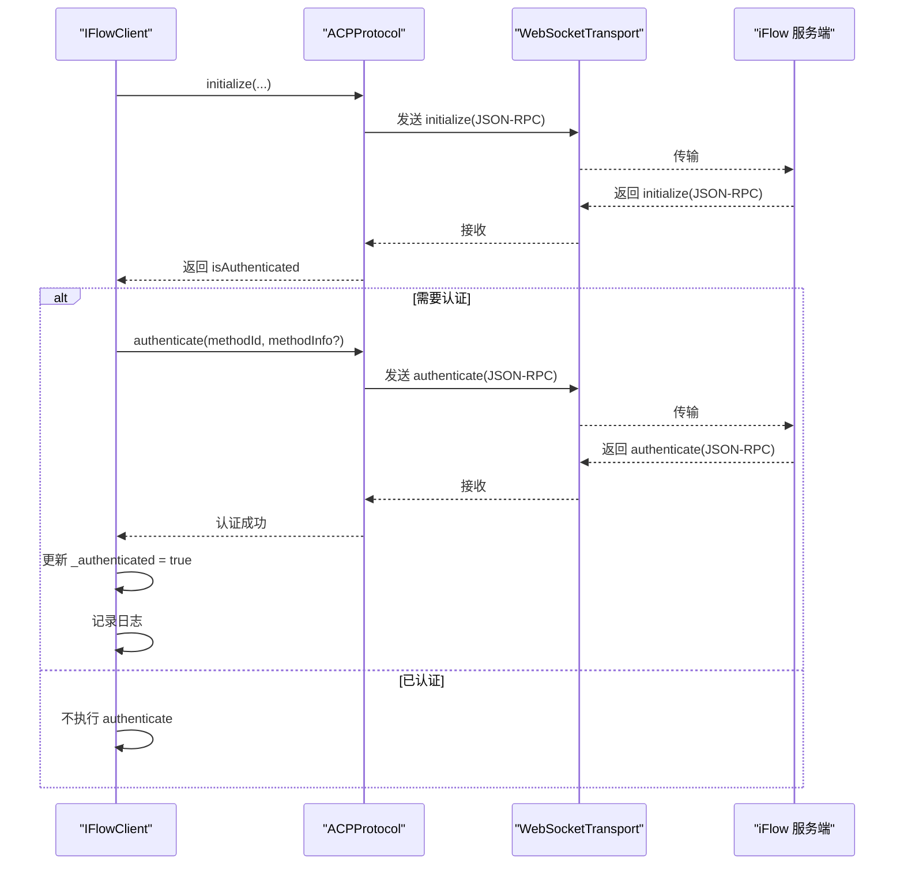
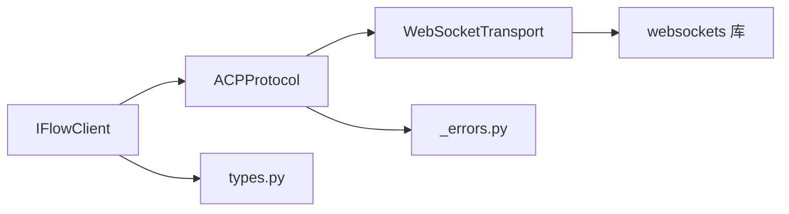

# 正常认证流程

<cite>
**本文引用的文件**
- [client.py](file://client.py)
- [_internal/protocol.py](file://_internal/protocol.py)
- [_internal/transport.py](file://_internal/transport.py)
- [types.py](file://types.py)
- [_errors.py](file://_errors.py)
</cite>

## 目录
1. [简介](#简介)
2. [项目结构](#项目结构)
3. [核心组件](#核心组件)
4. [架构总览](#架构总览)
5. [详细组件分析](#详细组件分析)
6. [依赖关系分析](#依赖关系分析)
7. [性能考量](#性能考量)
8. [故障排查指南](#故障排查指南)
9. [结论](#结论)

## 简介
本文件以时序图形式详细展示 ACP 协议的“正常认证流程”。从客户端调用连接入口开始，到 initialize() 返回 isAuthenticated=false 的情形下，触发 authenticate() 发送认证请求，并最终收到认证成功的响应为止。文档明确标注每一步 JSON-RPC 消息结构（请求的 method、params 和响应的 result），并说明认证成功后的内部状态更新与日志记录行为。最后提供代码示例路径，帮助读者正确调用认证流程。

## 项目结构
SDK 采用分层设计：
- 客户端层：IFlowClient 负责高层会话管理、消息收发与工具确认等。
- 协议层：ACPProtocol 实现 ACP v0.0.9 的 JSON-RPC 交互，包含 initialize、authenticate、session/new 等方法。
- 传输层：WebSocketTransport 提供 WebSocket 连接、收发与错误处理。
- 类型与错误：types.py 定义认证信息类型 AuthMethodInfo、选项 IFlowOptions 等；_errors.py 定义异常类型。

图表来源
- [client.py](file://client.py#L110-L320)
- [_internal/protocol.py](file://_internal/protocol.py#L64-L256)
- [_internal/transport.py](file://_internal/transport.py#L27-L177)
- [types.py](file://types.py#L925-L1065)
- [_errors.py](file://_errors.py#L10-L85)

章节来源
- [client.py](file://client.py#L110-L320)
- [_internal/protocol.py](file://_internal/protocol.py#L64-L256)
- [_internal/transport.py](file://_internal/transport.py#L27-L177)
- [types.py](file://types.py#L925-L1065)
- [_errors.py](file://_errors.py#L10-L85)

## 核心组件
- IFlowClient.connect：负责建立 WebSocket 连接、初始化 ACP 协议、在需要时执行认证、创建会话并启动消息处理任务。
- ACPProtocol.initialize：发送 initialize 请求，等待服务端返回，解析 isAuthenticated 并更新内部状态。
- ACPProtocol.authenticate：当 initialize 返回 isAuthenticated=false 时，发送 authenticate 请求，等待认证结果并标记已认证。
- WebSocketTransport：提供连接、发送、接收与关闭能力，支持控制消息与 JSON 消息的区分。
- AuthMethodInfo/IFlowOptions：封装认证所需的方法标识与参数，支持 to_dict 转换。

章节来源
- [client.py](file://client.py#L132-L318)
- [_internal/protocol.py](file://_internal/protocol.py#L64-L256)
- [_internal/transport.py](file://_internal/transport.py#L85-L146)
- [types.py](file://types.py#L925-L1065)

## 架构总览
下面的时序图展示了“正常认证流程”的关键步骤与消息结构。

图表来源
- [client.py](file://client.py#L255-L276)
- [_internal/protocol.py](file://_internal/protocol.py#L64-L256)
- [_internal/transport.py](file://_internal/transport.py#L85-L146)

## 详细组件分析

### 初始化与认证握手（initialize → authenticate）
- initialize 请求
  - method: "initialize"
  - params: 包含 protocolVersion、clientCapabilities，以及可选的 mcpServers、hooks、commands、agents
  - 结果: result 中包含 protocolVersion、isAuthenticated、agentCapabilities 等
- authenticate 请求
  - method: "authenticate"
  - params: 包含 methodId（如 "iflow" 或自定义），以及可选的 methodInfo（AuthMethodInfo.to_dict()）
  - 结果: result 中包含 methodId 等字段，认证成功后内部状态标记为已认证

图表来源
- [_internal/protocol.py](file://_internal/protocol.py#L64-L256)
- [client.py](file://client.py#L255-L276)

章节来源
- [_internal/protocol.py](file://_internal/protocol.py#L64-L256)
- [client.py](file://client.py#L255-L276)

### 认证成功后的内部状态与日志
- IFlowClient 在 connect() 中根据 initialize 的返回值设置 _authenticated。
- ACPProtocol.authenticate 成功后设置内部 _authenticated = true，并记录日志。
- IFlowClient 在 connect() 成功后记录“连接/认证完成”等日志。

章节来源
- [client.py](file://client.py#L255-L276)
- [_internal/protocol.py](file://_internal/protocol.py#L176-L256)

### 认证参数与类型
- AuthMethodInfo.to_dict() 将 snake_case 字段映射为 camelCase（如 apiKey、baseUrl、modelName）用于 JSON-RPC。
- IFlowOptions.auth_method_id 与 auth_method_info 作为认证输入传递给 ACPProtocol.authenticate。

章节来源
- [types.py](file://types.py#L925-L1065)
- [client.py](file://client.py#L265-L275)

### 错误处理与超时
- ACPProtocol.authenticate 内置超时（默认约 10 秒），若响应超时或连接关闭，抛出 AuthenticationError 或 TimeoutError。
- IFlowClient.connect 对连接失败进行清理并抛出 ConnectionError。

章节来源
- [_internal/protocol.py](file://_internal/protocol.py#L176-L256)
- [client.py](file://client.py#L132-L171)
- [_errors.py](file://_errors.py#L10-L85)

## 依赖关系分析
- IFlowClient 依赖 ACPProtocol 与 WebSocketTransport，同时使用 types.py 中的 IFlowOptions、AuthMethodInfo。
- ACPProtocol 依赖 WebSocketTransport，并使用 _errors.py 中的异常类型。
- WebSocketTransport 依赖第三方 websockets 库，提供连接、收发与错误处理。

图表来源
- [client.py](file://client.py#L110-L171)
- [_internal/protocol.py](file://_internal/protocol.py#L21-L53)
- [_internal/transport.py](file://_internal/transport.py#L13-L23)

章节来源
- [client.py](file://client.py#L110-L171)
- [_internal/protocol.py](file://_internal/protocol.py#L21-L53)
- [_internal/transport.py](file://_internal/transport.py#L13-L23)

## 性能考量
- 连接重试与指数退避：IFlowClient.connect 在连接失败时最多重试若干次并采用指数退避策略，降低瞬时网络波动影响。
- 认证超时：ACPProtocol.authenticate 默认超时约 10 秒，避免阻塞。
- 日志级别：IFlowClient.__init__ 使用 options.log_level 配置日志等级，便于在生产环境降低日志开销。

章节来源
- [client.py](file://client.py#L189-L221)
- [_internal/protocol.py](file://_internal/protocol.py#L176-L256)

## 故障排查指南
- 认证失败
  - 现象：authenticate 响应包含 error 或抛出 AuthenticationError。
  - 排查：检查 methodId 与 methodInfo 是否正确；确认服务端是否允许该认证方式；查看日志中的错误消息。
- 认证超时
  - 现象：authenticate 超过默认超时时间未收到响应。
  - 排查：检查网络连通性、服务端负载与防火墙；适当增大超时或重试次数。
- 连接失败
  - 现象：connect 抛出 ConnectionError。
  - 排查：确认 WebSocket URL 正确；检查服务端是否运行；查看重试与退避策略是否生效。
- 日志定位
  - IFlowClient 与 ACPProtocol 在关键节点记录日志，建议在问题复现时开启更详细的日志级别。

章节来源
- [_internal/protocol.py](file://_internal/protocol.py#L176-L256)
- [client.py](file://client.py#L132-L171)
- [_errors.py](file://_errors.py#L10-L85)

## 结论
本文基于代码实现，系统梳理了 ACP 协议的“正常认证流程”，明确了 initialize 与 authenticate 的 JSON-RPC 消息结构、参数与响应字段，以及认证成功后的内部状态更新与日志记录。结合 IFlowClient.connect 的整体流程，读者可以准确把握从连接到认证再到会话创建的关键步骤，并据此正确调用 SDK 的认证接口。