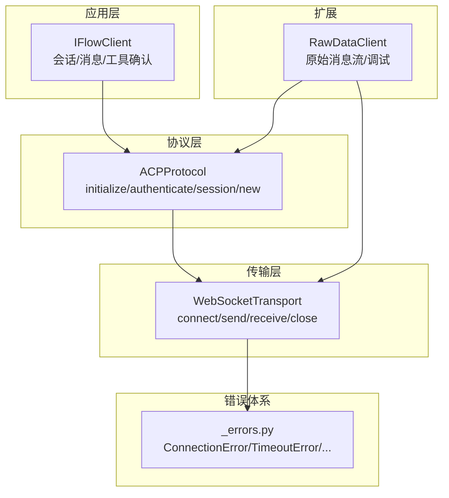
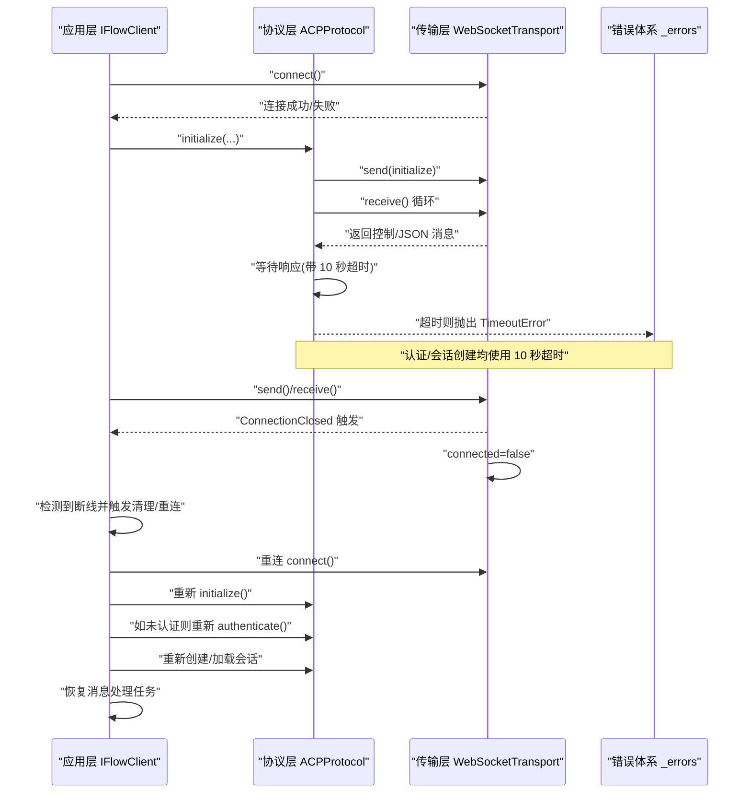
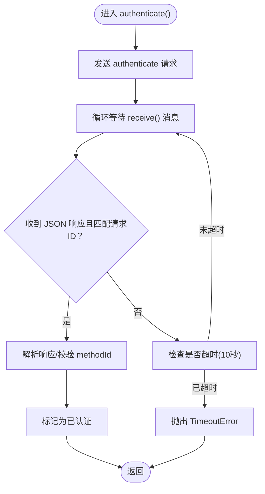
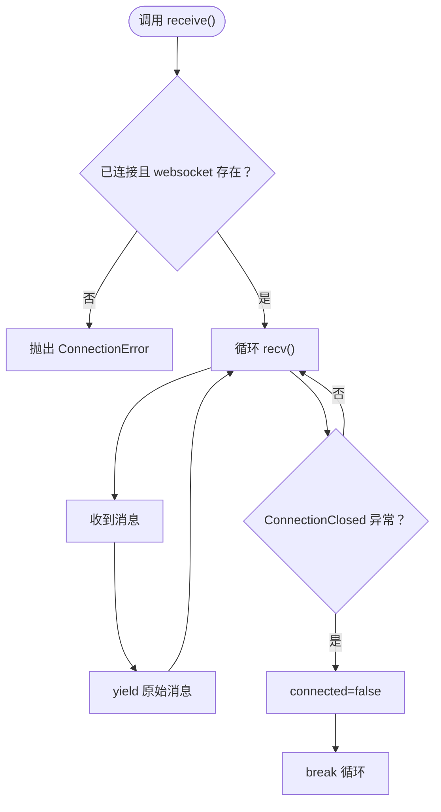
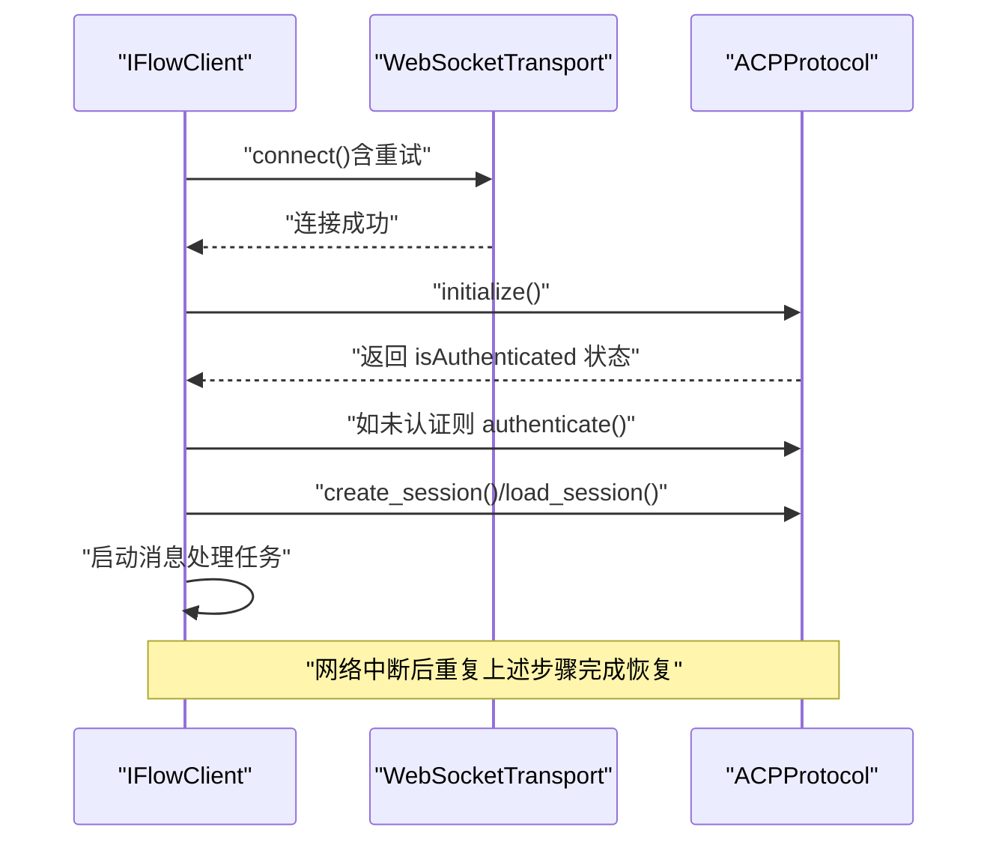
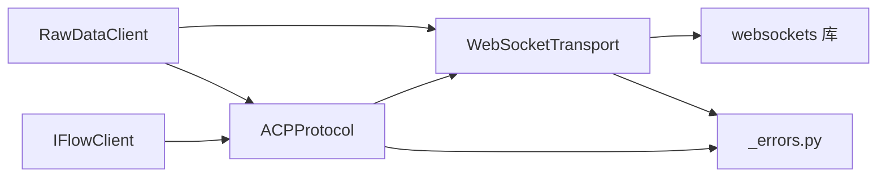

# 网络中断恢复流程

<cite>
**本文引用的文件**
- [client.py](file://client.py)
- [_internal/protocol.py](file://_internal/protocol.py)
- [_internal/transport.py](file://_internal/transport.py)
- [_errors.py](file://_errors.py)
- [raw_client.py](file://raw_client.py)
- [types.py](file://types.py)
</cite>

## 目录
1. [简介](#简介)
2. [项目结构](#项目结构)
3. [核心组件](#核心组件)
4. [架构总览](#架构总览)
5. [详细组件分析](#详细组件分析)
6. [依赖关系分析](#依赖关系分析)
7. [性能与可靠性考量](#性能与可靠性考量)
8. [故障排查指南](#故障排查指南)
9. [结论](#结论)

## 简介
本文件聚焦于网络中断场景下 ACP 协议认证流程的恢复机制，围绕以下目标展开：
- 当 WebSocket 连接断开时，如何检测超时（10 秒）并抛出 TimeoutError 异常
- 连接恢复后的处理流程：是否需要重新初始化和认证
- _transport.receive() 方法在连接中断时的行为
- 提供网络恢复后重新建立认证的完整逻辑路径与示例（连接重试、状态检查、认证重试）
- 网络问题的调试技巧与日志分析方法

## 项目结构
SDK 采用分层设计：
- 应用层：IFlowClient 负责会话管理、消息收发、工具确认等
- 协议层：ACPProtocol 实现 ACP 协议握手、认证、会话创建与消息处理
- 传输层：WebSocketTransport 封装 WebSocket 连接、发送/接收与底层错误
- 错误体系：统一的异常类型定义
- 原始数据客户端：RawDataClient 提供原始消息流与调试能力

图表来源
- [client.py](file://client.py#L132-L318)
- [_internal/protocol.py](file://_internal/protocol.py#L94-L171)
- [_internal/transport.py](file://_internal/transport.py#L53-L176)
- [_errors.py](file://_errors.py#L10-L85)
- [raw_client.py](file://raw_client.py#L120-L237)

章节来源
- [client.py](file://client.py#L132-L318)
- [_internal/protocol.py](file://_internal/protocol.py#L94-L171)
- [_internal/transport.py](file://_internal/transport.py#L53-L176)
- [_errors.py](file://_errors.py#L10-L85)
- [raw_client.py](file://raw_client.py#L120-L237)

## 核心组件
- IFlowClient：负责连接、认证、会话创建、消息收发与后台消息处理任务；提供连接重试与清理逻辑
- ACPProtocol：实现 initialize/authenticate/session/new 等协议步骤；在认证与会话创建中使用 10 秒超时
- WebSocketTransport：封装 WebSocket 连接、发送/接收、关闭；在 receive 中检测连接关闭并置位断开状态
- RawDataClient：提供原始消息流与统计分析，便于网络中断后的诊断

章节来源
- [client.py](file://client.py#L132-L318)
- [_internal/protocol.py](file://_internal/protocol.py#L176-L346)
- [_internal/transport.py](file://_internal/transport.py#L114-L176)
- [raw_client.py](file://raw_client.py#L120-L237)

## 架构总览
下面的序列图展示了“认证超时”与“网络中断恢复”的关键交互。

图表来源
- [_internal/protocol.py](file://_internal/protocol.py#L176-L346)
- [_internal/transport.py](file://_internal/transport.py#L114-L176)
- [_errors.py](file://_errors.py#L43-L47)
- [client.py](file://client.py#L132-L318)

## 详细组件分析

### 认证超时与 TimeoutError 抛出
- 认证阶段（authenticate）内部对响应等待设置了 10 秒超时窗口，若超过时间未收到响应或响应解析失败，则抛出 TimeoutError
- 会话创建（session/new）与会话加载（session/load）同样设置 10 秒超时窗口，超时后记录警告并返回回退标识

图表来源
- [_internal/protocol.py](file://_internal/protocol.py#L176-L256)

章节来源
- [_internal/protocol.py](file://_internal/protocol.py#L176-L256)

### _transport.receive() 在连接中断时的行为
- receive() 在连接断开时捕获底层 ConnectionClosed 异常，记录日志并将 connected 状态置为 False，随后退出循环
- 上层协议层与应用层通过检测连接状态或捕获 ConnectionError 来感知断线并触发重连与恢复流程

图表来源
- [_internal/transport.py](file://_internal/transport.py#L114-L176)

章节来源
- [_internal/transport.py](file://_internal/transport.py#L114-L176)

### 连接恢复后的处理流程（是否需要重新初始化与认证）
- IFlowClient 在 connect() 中执行了连接重试（指数回退），并在成功后进行 initialize、authenticate、会话创建/加载与消息处理任务启动
- 若发生网络中断，应用层应检测断线并执行：
  - 清理资源（关闭传输、停止进程、取消消息任务）
  - 重新 connect() 并按顺序执行 initialize、authenticate、会话创建/加载
  - 重启消息处理任务
- 该流程确保在恢复后具备与初始连接一致的状态

图表来源
- [client.py](file://client.py#L132-L318)
- [_internal/protocol.py](file://_internal/protocol.py#L94-L171)
- [_internal/protocol.py](file://_internal/protocol.py#L176-L346)

章节来源
- [client.py](file://client.py#L132-L318)
- [_internal/protocol.py](file://_internal/protocol.py#L94-L171)
- [_internal/protocol.py](file://_internal/protocol.py#L176-L346)

### 网络恢复后重新建立认证的完整逻辑（路径与示例）
以下为“代码片段路径”形式的参考，帮助定位实现位置，避免直接粘贴代码内容：
- 连接重试与初始化
  - [client.py](file://client.py#L204-L220) 连接重试（指数回退）
  - [client.py](file://client.py#L255-L275) initialize 返回 isAuthenticated
  - [client.py](file://client.py#L263-L275) 如未认证则调用 authenticate
- 认证超时
  - [_internal/protocol.py](file://_internal/protocol.py#L213-L256) 认证等待 10 秒超时
- 会话创建/加载超时
  - [_internal/protocol.py](file://_internal/protocol.py#L312-L344) session/new 超时
  - [_internal/protocol.py](file://_internal/protocol.py#L413-L443) session/load 超时
- 断线检测与清理
  - [_internal/transport.py](file://_internal/transport.py#L139-L142) receive() 捕获 ConnectionClosed 并置位断开
  - [client.py](file://client.py#L372-L397) _cleanup() 关闭传输、停止进程、取消消息任务
- 恢复后消息处理
  - [client.py](file://client.py#L640-L657) _handle_messages() 启动消息处理任务
  - [client.py](file://client.py#L510-L528) receive_messages() 使用队列与短超时轮询

章节来源
- [client.py](file://client.py#L204-L220)
- [client.py](file://client.py#L255-L275)
- [client.py](file://client.py#L372-L397)
- [client.py](file://client.py#L640-L657)
- [client.py](file://client.py#L510-L528)
- [_internal/protocol.py](file://_internal/protocol.py#L213-L256)
- [_internal/protocol.py](file://_internal/protocol.py#L312-L344)
- [_internal/protocol.py](file://_internal/protocol.py#L413-L443)
- [_internal/transport.py](file://_internal/transport.py#L139-L142)

### 调试技巧与日志分析
- 使用 RawDataClient 获取原始消息流与统计
  - [raw_client.py](file://raw_client.py#L144-L163) _capture_raw_stream() 捕获原始消息
  - [raw_client.py](file://raw_client.py#L174-L186) receive_raw_messages() 以短超时轮询
  - [raw_client.py](file://raw_client.py#L238-L273) get_protocol_stats() 统计消息类型、控制消息、错误数
  - [raw_client.py](file://raw_client.py#L293-L362) ProtocolDebugger 分析会话
- 日志级别建议
  - IFlowClient 初始化时使用 options.log_level 配置日志等级
  - 传输层与协议层均输出关键事件（连接、断开、控制消息、JSON 解析失败等）

章节来源
- [raw_client.py](file://raw_client.py#L144-L163)
- [raw_client.py](file://raw_client.py#L174-L186)
- [raw_client.py](file://raw_client.py#L238-L273)
- [raw_client.py](file://raw_client.py#L293-L362)
- [client.py](file://client.py#L129-L131)

## 依赖关系分析
- IFlowClient 依赖 ACPProtocol 与 WebSocketTransport，并在连接失败时抛出 ConnectionError/TimeoutError
- ACPProtocol 依赖 WebSocketTransport 的 send/receive，并在认证/会话阶段使用 10 秒超时
- WebSocketTransport 依赖 websockets 库，断线时抛出 ConnectionError 并置位断开
- RawDataClient 双通道并行：原始消息流 + 解析后的消息流

图表来源
- [client.py](file://client.py#L132-L318)
- [_internal/protocol.py](file://_internal/protocol.py#L94-L171)
- [_internal/transport.py](file://_internal/transport.py#L53-L176)
- [_errors.py](file://_errors.py#L10-L85)
- [raw_client.py](file://raw_client.py#L120-L237)

章节来源
- [client.py](file://client.py#L132-L318)
- [_internal/protocol.py](file://_internal/protocol.py#L94-L171)
- [_internal/transport.py](file://_internal/transport.py#L53-L176)
- [_errors.py](file://_errors.py#L10-L85)
- [raw_client.py](file://raw_client.py#L120-L237)

## 性能与可靠性考量
- 连接重试采用指数回退，降低瞬时网络抖动对首次连接的影响
- 认证与会话创建均设置 10 秒超时，避免长时间阻塞
- receive() 使用短轮询与队列，保证在断线后能尽快感知并退出循环
- RawDataClient 的双通道设计便于在不改变上层行为的前提下进行深入诊断

[本节为通用指导，无需特定文件引用]

## 故障排查指南
- 断线检测
  - 观察传输层日志中的“Connection closed”提示
  - 检查 IFlowClient 的 _cleanup() 是否被调用
- 超时定位
  - 认证超时：查看 ACPProtocol.authenticate() 的 10 秒超时逻辑
  - 会话创建/加载超时：查看 ACPProtocol.create_session()/load_session() 的 10 秒超时逻辑
- 重连与恢复
  - 确认 connect() 的重试与指数回退是否生效
  - 恢复后确保重新执行 initialize、authenticate、会话创建/加载与消息处理任务
- 原始消息分析
  - 使用 RawDataClient 的原始消息流与统计接口，识别控制消息、JSON 解析失败与错误条目

章节来源
- [_internal/transport.py](file://_internal/transport.py#L139-L142)
- [client.py](file://client.py#L372-L397)
- [_internal/protocol.py](file://_internal/protocol.py#L213-L256)
- [_internal/protocol.py](file://_internal/protocol.py#L312-L344)
- [_internal/protocol.py](file://_internal/protocol.py#L413-L443)
- [raw_client.py](file://raw_client.py#L144-L163)
- [raw_client.py](file://raw_client.py#L238-L273)

## 结论
- 认证与会话阶段均内置 10 秒超时，超时将抛出 TimeoutError
- _transport.receive() 在连接断开时会置位断开状态并退出循环，上层通过检测连接状态与异常完成恢复
- IFlowClient 的 connect() 已包含连接重试与初始化/认证/会话创建的完整流程，网络恢复后可按相同顺序重新执行
- 建议结合 RawDataClient 的原始消息流与统计接口进行网络中断后的快速定位与验证

[本节为总结性内容，无需特定文件引用]