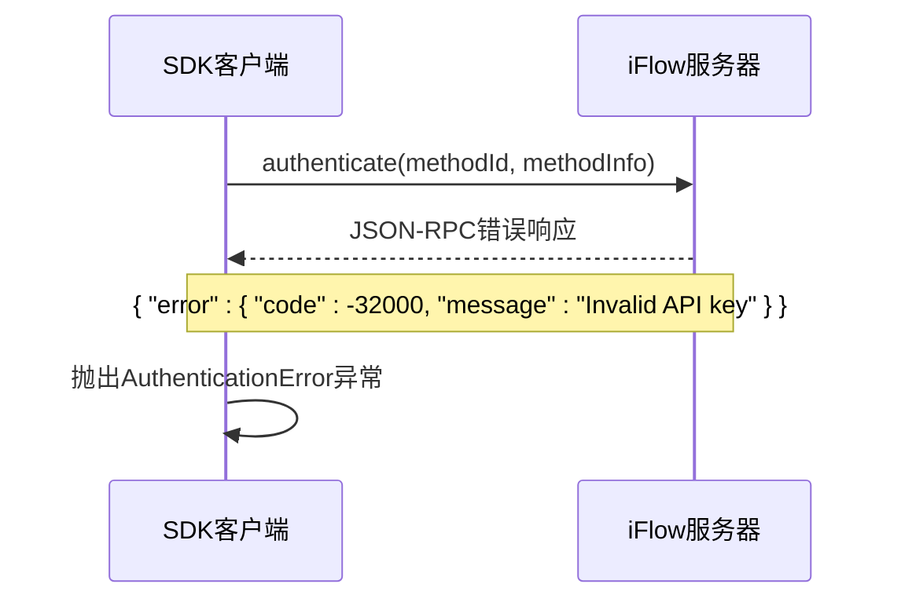
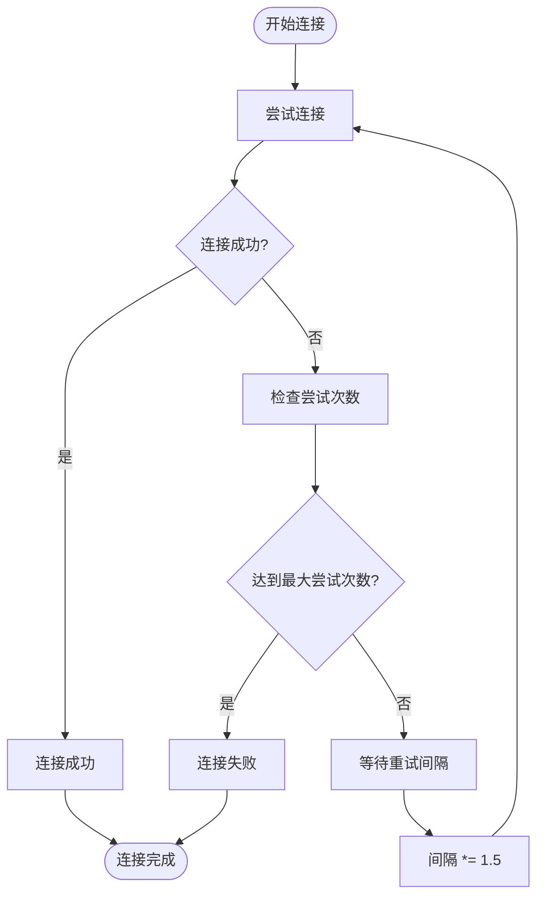

# 认证失败与重试机制

<cite>
**本文档引用的文件**   
- [client.py](file://client.py)
- [_errors.py](file://_errors.py)
- [_internal/protocol.py](file://_internal/protocol.py)
- [_internal/transport.py](file://_internal/transport.py)
- [types.py](file://types.py)
- [__init__.py](file://__init__.py)
</cite>

## 目录
1. [认证失败处理流程](#认证失败处理流程)
2. [认证错误响应结构](#认证错误响应结构)
3. [SDK重试策略](#sdk重试策略)
4. [开发者处理示例](#开发者处理示例)
5. [日志错误排查](#日志错误排查)

## 认证失败处理流程

当ACP协议的`authenticate()`方法收到错误响应时，SDK会抛出`AuthenticationError`异常。认证流程在`IFlowClient.connect()`方法中执行，具体流程如下：

1. 首先调用`initialize()`方法初始化协议连接
2. 检查初始化响应中的`isAuthenticated`标志
3. 如果未认证，则调用`authenticate()`方法进行认证
4. `authenticate()`方法发送JSON-RPC请求到服务器
5. 等待服务器响应，设置10秒超时
6. 如果收到错误响应，解析错误信息并抛出`AuthenticationError`

认证失败的处理在`_internal/protocol.py`文件的`authenticate()`方法中实现。当收到包含`error`字段的JSON-RPC响应时，会提取错误消息并抛出`AuthenticationError`异常。

**Section sources**
- [client.py](file://client.py#L132-L322)
- [_internal/protocol.py](file://_internal/protocol.py#L176-L255)

## 认证错误响应结构

当认证失败时，服务器返回标准的JSON-RPC 2.0错误响应结构。响应包含以下关键字段：

- **code**: 错误代码，通常为标准JSON-RPC错误码
- **message**: 错误消息，描述认证失败的具体原因
- **data**: 可选的附加数据，可能包含详细的错误信息

在SDK中，这些错误信息会被解析并用于构造`AuthenticationError`异常。异常的`message`属性包含格式化的错误信息，如"Authentication failed: {error_msg}"。



**Diagram sources**
- [_internal/protocol.py](file://_internal/protocol.py#L228-L230)
- [_errors.py](file://_errors.py#L37-L40)

## SDK重试策略

SDK在连接阶段实现了重试机制，但认证阶段不自动重试。连接重试策略如下：

- **重试次数**: 最大3次
- **初始间隔**: 1.0秒
- **退避算法**: 指数退避（每次间隔乘以1.5）
- **重试条件**: 连接异常时进行重试

重试逻辑在`client.py`的`connect()`方法中实现。值得注意的是，认证失败不会触发自动重试，因为认证错误通常表示凭证问题而非临时网络问题。



**Diagram sources**
- [client.py](file://client.py#L204-L220)
- [_internal/transport.py](file://_internal/transport.py#L53-L84)

## 开发者处理示例

开发者应通过捕获`AuthenticationError`异常来处理认证失败，并根据具体情况采取相应措施：

```python
from iflow_sdk import IFlowClient, AuthenticationError, ConnectionError

async def handle_authentication():
    try:
        async with IFlowClient() as client:
            # 连接会自动处理认证
            await client.connect()
            print("认证成功")
    except AuthenticationError as e:
        print(f"认证失败: {e.message}")
        # 提示用户检查API密钥或认证信息
        handle_auth_failure()
    except ConnectionError as e:
        print(f"连接失败: {e.message}")
        # 可能需要重试连接
        retry_connection()

def handle_auth_failure():
    """处理认证失败"""
    # 清除无效的认证信息
    clear_credentials()
    # 提示用户重新输入认证信息
    prompt_for_credentials()

async def retry_connection():
    """重试连接"""
    max_retries = 3
    for attempt in range(max_retries):
        try:
            async with IFlowClient() as client:
                await client.connect()
                break
        except (ConnectionError, AuthenticationError) as e:
            if attempt == max_retries - 1:
                raise
            # 等待后重试
            await asyncio.sleep(2 ** attempt)
```

**Section sources**
- [client.py](file://client.py#L132-L322)
- [_errors.py](file://_errors.py#L37-L40)
- [__init__.py](file://__init__.py#L8-L19)

## 日志错误排查

当认证失败时，SDK会记录详细的日志信息，帮助开发者排查问题。关键日志信息包括：

- **认证请求日志**: 记录发送的认证方法ID
- **认证响应日志**: 记录服务器响应（成功或失败）
- **错误详情**: 包含具体的错误消息和堆栈信息

常见的日志条目：
- "Sent authenticate request with method: {method_id}" - 认证请求已发送
- "Authentication failed: {error_msg}" - 认证失败的具体原因
- "Connection closed during authentication" - 连接在认证过程中关闭

排查步骤：
1. 检查日志中是否有"Sent authenticate request"条目
2. 查看是否有"Authentication failed"错误消息
3. 验证认证方法ID和认证信息是否正确
4. 检查网络连接是否稳定
5. 确认服务器端认证服务是否正常运行

**Section sources**
- [_internal/protocol.py](file://_internal/protocol.py#L211-L212)
- [_internal/protocol.py](file://_internal/protocol.py#L229-L230)
- [_internal/protocol.py](file://_internal/protocol.py#L254)