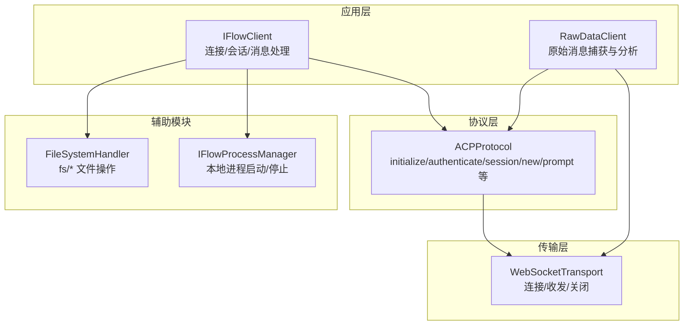
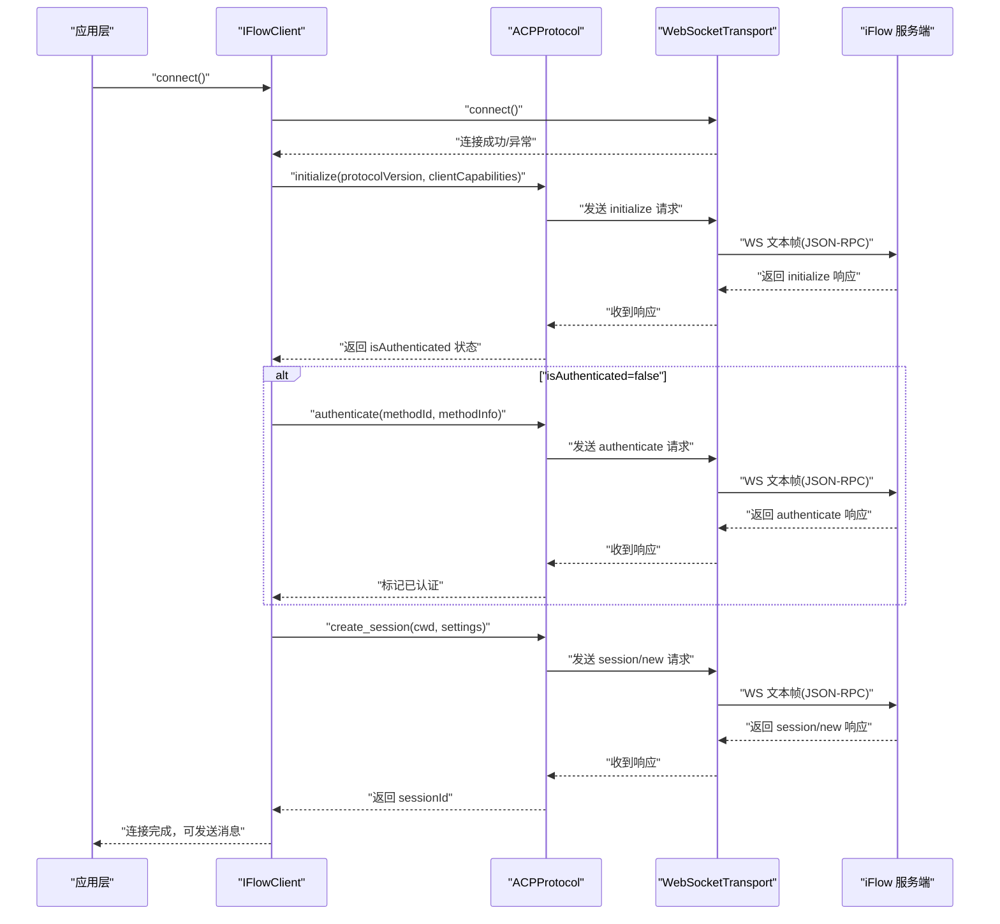
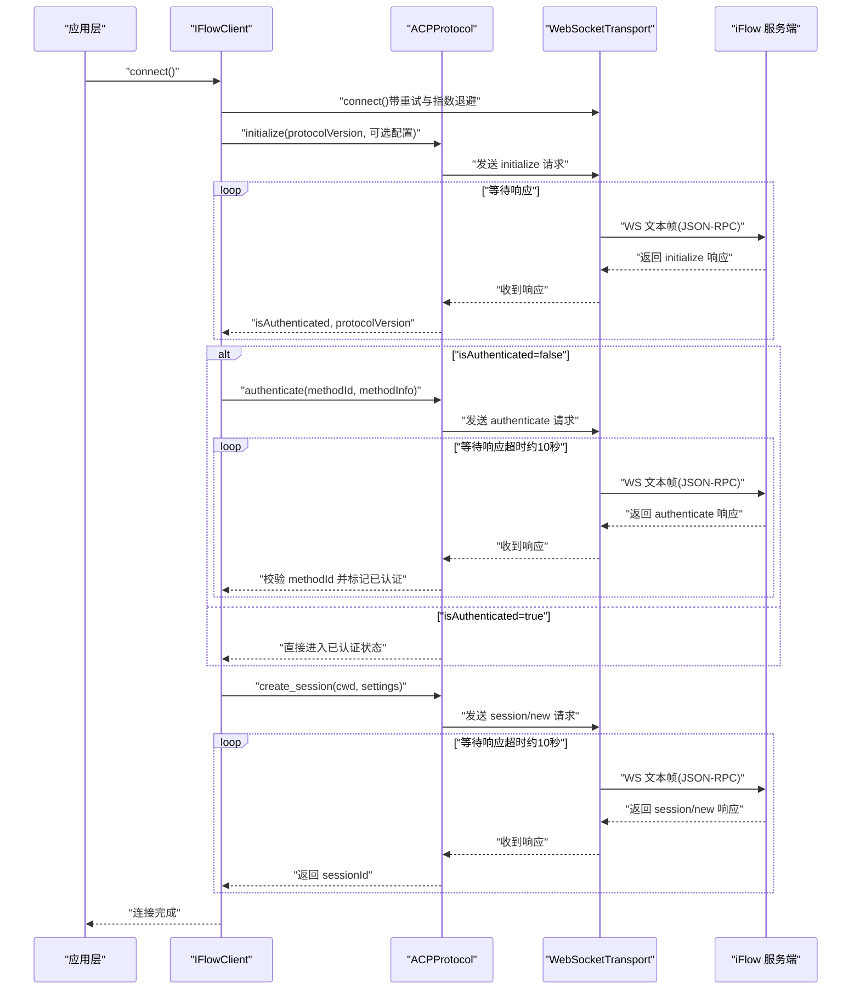
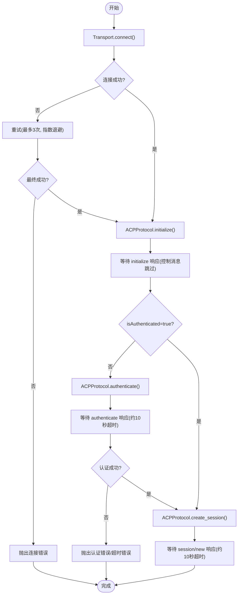
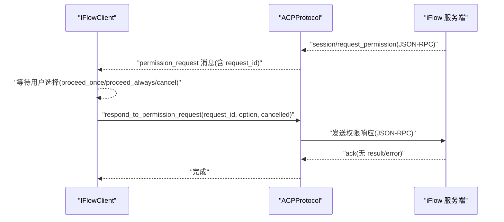
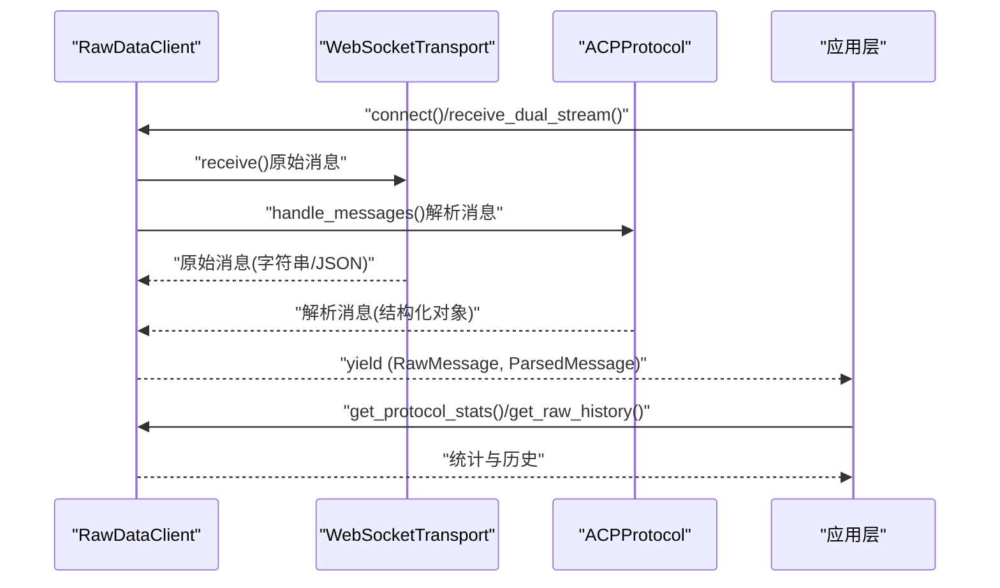
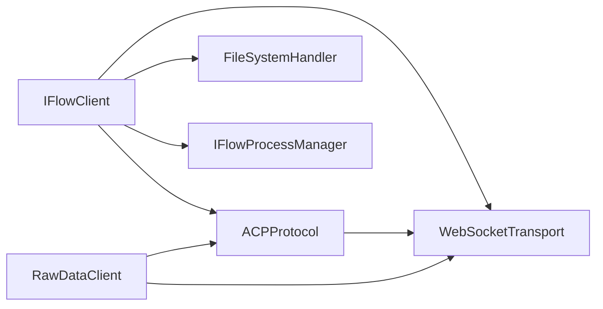

# 认证流程时序

<cite>
**本文引用的文件**
- [client.py](file://client.py)
- [raw_client.py](file://raw_client.py)
- [_internal/protocol.py](file://_internal/protocol.py)
- [_internal/transport.py](file://_internal/transport.py)
- [types.py](file://types.py)
- [_errors.py](file://_errors.py)
- [_internal/file_handler.py](file://_internal/file_handler.py)
- [_internal/process_manager.py](file://_internal/process_manager.py)
</cite>

## 目录
1. [简介](#简介)
2. [项目结构](#项目结构)
3. [核心组件](#核心组件)
4. [架构总览](#架构总览)
5. [详细组件分析](#详细组件分析)
6. [依赖关系分析](#依赖关系分析)
7. [性能与超时特性](#性能与超时特性)
8. [故障排查指南](#故障排查指南)
9. [结论](#结论)

## 简介
本文件面向开发者，以时序图形式系统化展示 ACP 协议在 iFlow SDK 中的完整认证流程，涵盖：
- initialize() 响应中的 isAuthenticated 标志判断
- authenticate() 方法调用时机与交互细节
- 认证请求与响应的 JSON-RPC 消息结构
- 超时处理机制与错误恢复策略
- 正常流程、认证失败重试、网络中断恢复等多场景时序
- 调试技巧与日志分析方法（结合 RawDataClient 的原始消息能力）

## 项目结构
SDK 采用分层设计：客户端层负责会话管理与消息编排；协议层实现 ACP 协议握手与 JSON-RPC；传输层封装 WebSocket；工具与进程管理模块提供文件访问与本地进程启动能力。

图表来源
- [client.py](file://client.py#L110-L318)
- [_internal/protocol.py](file://_internal/protocol.py#L64-L256)
- [_internal/transport.py](file://_internal/transport.py#L53-L177)
- [_internal/file_handler.py](file://_internal/file_handler.py#L16-L217)
- [_internal/process_manager.py](file://_internal/process_manager.py#L1-L254)
- [raw_client.py](file://raw_client.py#L72-L237)

章节来源
- [client.py](file://client.py#L110-L318)
- [_internal/protocol.py](file://_internal/protocol.py#L64-L256)
- [_internal/transport.py](file://_internal/transport.py#L53-L177)
- [_internal/file_handler.py](file://_internal/file_handler.py#L16-L217)
- [_internal/process_manager.py](file://_internal/process_manager.py#L1-L254)
- [raw_client.py](file://raw_client.py#L72-L237)

## 核心组件
- IFlowClient：高层客户端，负责连接、初始化、认证、会话创建、消息发送与接收、工具确认等。
- ACPProtocol：ACP 协议实现，负责 initialize/authenticate/session/new/prompt 等 JSON-RPC 请求与响应处理。
- WebSocketTransport：WebSocket 传输层，负责连接建立、消息收发、连接状态维护与基础错误处理。
- RawDataClient：扩展客户端，提供原始消息流、解析消息流、历史统计与协议调试能力。
- FileSystemHandler：文件系统访问处理器，支持 fs/read_text_file/fs/write_text_file。
- IFlowProcessManager：本地 iFlow 进程管理器，自动发现可执行文件、端口探测与启动/停止。

章节来源
- [client.py](file://client.py#L110-L318)
- [_internal/protocol.py](file://_internal/protocol.py#L64-L256)
- [_internal/transport.py](file://_internal/transport.py#L53-L177)
- [raw_client.py](file://raw_client.py#L72-L237)
- [_internal/file_handler.py](file://_internal/file_handler.py#L16-L217)
- [_internal/process_manager.py](file://_internal/process_manager.py#L1-L254)

## 架构总览
下图展示认证流程在各组件间的调用关系与数据流向。

图表来源
- [client.py](file://client.py#L132-L318)
- [_internal/protocol.py](file://_internal/protocol.py#L64-L256)
- [_internal/transport.py](file://_internal/transport.py#L53-L177)

章节来源
- [client.py](file://client.py#L132-L318)
- [_internal/protocol.py](file://_internal/protocol.py#L64-L256)
- [_internal/transport.py](file://_internal/transport.py#L53-L177)

## 详细组件分析

### 初始化与认证流程（含超时与错误）
该流程严格遵循 initialize → authenticate → create_session 的顺序，期间对超时与错误进行处理，并在需要时通过 RawDataClient 获取原始消息进行调试。

图表来源
- [client.py](file://client.py#L132-L318)
- [_internal/protocol.py](file://_internal/protocol.py#L64-L256)
- [_internal/transport.py](file://_internal/transport.py#L53-L177)

章节来源
- [client.py](file://client.py#L132-L318)
- [_internal/protocol.py](file://_internal/protocol.py#L64-L256)
- [_internal/transport.py](file://_internal/transport.py#L53-L177)

### 认证失败重试与网络中断恢复
- 连接阶段：Transport 层在 connect() 失败时抛出超时或连接错误，上层 IFlowClient 支持最多3次重试并指数退避。
- 认证阶段：authenticate() 设置固定超时窗口（约10秒），若超时则抛出超时错误；若收到错误响应则抛出认证错误。
- 网络中断恢复：Transport 层在 receive() 捕获连接关闭事件后置连接状态为断开；上层在异常时清理资源并可重新尝试连接。

图表来源
- [_internal/transport.py](file://_internal/transport.py#L53-L177)
- [_internal/protocol.py](file://_internal/protocol.py#L64-L256)
- [client.py](file://client.py#L132-L318)

章节来源
- [_internal/transport.py](file://_internal/transport.py#L53-L177)
- [_internal/protocol.py](file://_internal/protocol.py#L64-L256)
- [client.py](file://client.py#L132-L318)

### JSON-RPC 消息结构要点
- initialize 请求
  - jsonrpc: "2.0"
  - method: "initialize"
  - params: 包含 protocolVersion、clientCapabilities、可选 mcpServers/hooks/commands/agents
- initialize 响应
  - result: 包含 protocolVersion、isAuthenticated、authMethods、agentCapabilities 等
- authenticate 请求
  - jsonrpc: "2.0"
  - method: "authenticate"
  - params: 包含 methodId、可选 methodInfo
- authenticate 响应
  - result: 包含 methodId 等字段（即使失败也返回响应对象，错误通过 error 字段体现）
- session/new 请求
  - jsonrpc: "2.0"
  - method: "session/new"
  - params: 包含 cwd、mcpServers、hooks、commands、agents、settings
- session/new 响应
  - result: 包含 sessionId 或回退标识

章节来源
- [_internal/protocol.py](file://_internal/protocol.py#L114-L171)
- [_internal/protocol.py](file://_internal/protocol.py#L176-L256)
- [_internal/protocol.py](file://_internal/protocol.py#L257-L346)

### 工具确认与权限请求（补充流程）
当 ApprovalMode 配置为 DEFAULT 时，iFlow 可能通过 ACP 协议向 SDK 发起权限请求，SDK 将其转换为上层消息并等待用户决策。

图表来源
- [_internal/protocol.py](file://_internal/protocol.py#L548-L597)
- [_internal/protocol.py](file://_internal/protocol.py#L720-L768)

章节来源
- [_internal/protocol.py](file://_internal/protocol.py#L548-L597)
- [_internal/protocol.py](file://_internal/protocol.py#L720-L768)

### 原始消息捕获与调试（RawDataClient）
RawDataClient 提供：
- 接收原始 WebSocket 文本/JSON 消息
- 双流输出（原始消息与解析后的消息）
- 历史记录与协议统计
- 手动发送原始数据的能力

图表来源
- [raw_client.py](file://raw_client.py#L120-L237)
- [_internal/transport.py](file://_internal/transport.py#L114-L146)
- [_internal/protocol.py](file://_internal/protocol.py#L499-L533)

章节来源
- [raw_client.py](file://raw_client.py#L120-L237)
- [_internal/transport.py](file://_internal/transport.py#L114-L146)
- [_internal/protocol.py](file://_internal/protocol.py#L499-L533)

## 依赖关系分析
- IFlowClient 依赖 ACPProtocol 与 WebSocketTransport 完成连接、初始化、认证与会话管理。
- ACPProtocol 依赖 WebSocketTransport 发送/接收 JSON-RPC 消息，并在内部维护请求 ID、待处理响应与权限请求 Future。
- RawDataClient 继承 IFlowClient，同时持有独立的原始消息队列与历史记录，便于调试。
- FileSystemHandler 仅在启用文件访问时注入到 ACPProtocol，用于处理 fs/* 方法调用。
- IFlowProcessManager 在本地开发场景下自动启动 iFlow 进程，简化连接流程。

图表来源
- [client.py](file://client.py#L110-L318)
- [_internal/protocol.py](file://_internal/protocol.py#L64-L256)
- [_internal/transport.py](file://_internal/transport.py#L53-L177)
- [_internal/file_handler.py](file://_internal/file_handler.py#L16-L217)
- [_internal/process_manager.py](file://_internal/process_manager.py#L1-L254)
- [raw_client.py](file://raw_client.py#L72-L237)

章节来源
- [client.py](file://client.py#L110-L318)
- [_internal/protocol.py](file://_internal/protocol.py#L64-L256)
- [_internal/transport.py](file://_internal/transport.py#L53-L177)
- [_internal/file_handler.py](file://_internal/file_handler.py#L16-L217)
- [_internal/process_manager.py](file://_internal/process_manager.py#L1-L254)
- [raw_client.py](file://raw_client.py#L72-L237)

## 性能与超时特性
- 连接重试：IFlowClient 在 connect() 中对 Transport.connect() 进行最多3次重试，每次延迟按指数退避增长。
- 认证超时：ACPProtocol.authenticate() 设置约10秒超时窗口，超过时间抛出超时错误。
- 会话创建超时：ACPProtocol.create_session()/load_session() 设置约10秒超时窗口，超时后返回回退标识。
- 传输层限制：WebSocketTransport 使用最大消息大小限制，避免过大消息导致内存压力。
- 日志粒度：各层均输出关键事件日志，便于定位问题。

章节来源
- [client.py](file://client.py#L204-L221)
- [_internal/protocol.py](file://_internal/protocol.py#L213-L256)
- [_internal/protocol.py](file://_internal/protocol.py#L312-L344)
- [_internal/protocol.py](file://_internal/protocol.py#L413-L444)
- [_internal/transport.py](file://_internal/transport.py#L64-L83)

## 故障排查指南
- 使用 RawDataClient 获取原始消息
  - 通过 receive_raw_messages() 获取原始文本/JSON
  - 通过 receive_dual_stream() 对齐原始与解析消息
  - 通过 get_protocol_stats() 查看消息类型分布与错误计数
  - 通过 get_raw_history() 获取历史消息以便复盘
- 关键日志点
  - initialize 成功/失败、isAuthenticated 状态
  - authenticate 成功/失败、超时、methodId 校验
  - session/new 成功/失败、超时
  - 连接丢失、重连、指数退避
- 常见问题与建议
  - 认证失败：检查 methodId 与 methodInfo 是否正确；查看 authenticate 响应中的错误信息；必要时增加日志级别
  - 超时：检查网络状况与服务端负载；适当增大超时参数（如 Transport.timeout）
  - 连接中断：观察 Transport 层连接关闭事件；在上层触发重连逻辑
  - 文件访问：确保 FileSystemHandler 的 allowed_dirs 配置正确且路径合法

章节来源
- [raw_client.py](file://raw_client.py#L174-L237)
- [_internal/protocol.py](file://_internal/protocol.py#L140-L171)
- [_internal/protocol.py](file://_internal/protocol.py#L176-L256)
- [_internal/protocol.py](file://_internal/protocol.py#L257-L346)
- [_internal/transport.py](file://_internal/transport.py#L114-L146)
- [_internal/file_handler.py](file://_internal/file_handler.py#L16-L217)

## 结论
本文基于仓库源码梳理了 ACP 协议在 iFlow SDK 中的认证与会话建立流程，明确了 initialize → authenticate → create_session 的关键步骤、JSON-RPC 消息结构、超时与错误处理策略，并提供了使用 RawDataClient 进行调试与日志分析的方法。开发者可据此快速定位问题、优化重试与超时策略，并在复杂网络环境下实现稳健的连接与认证。