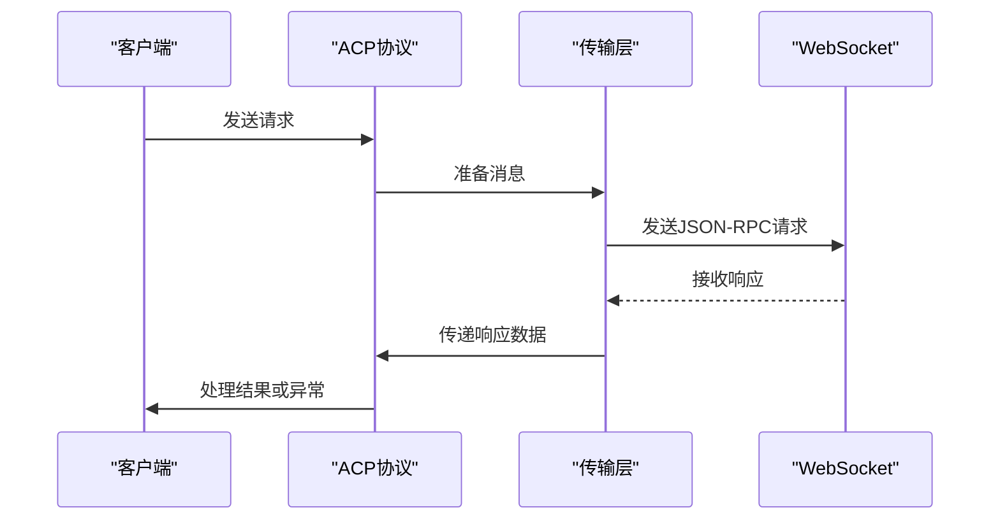
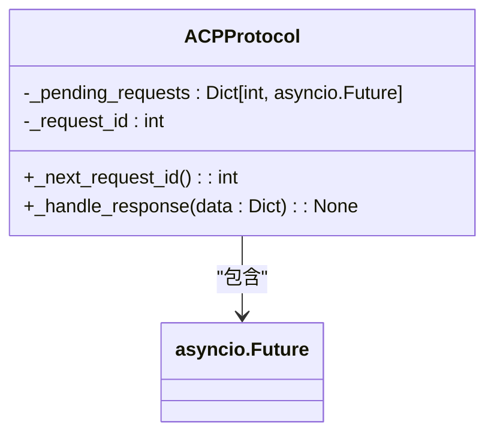
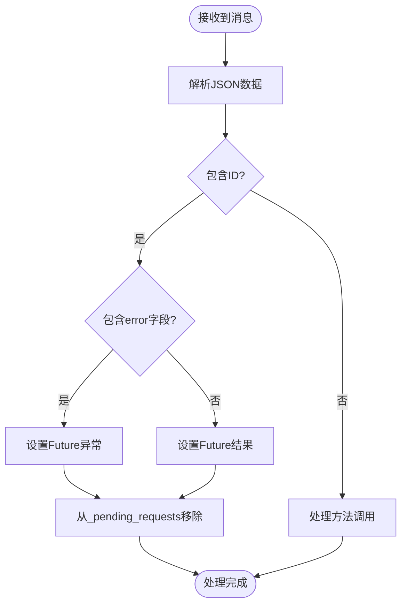
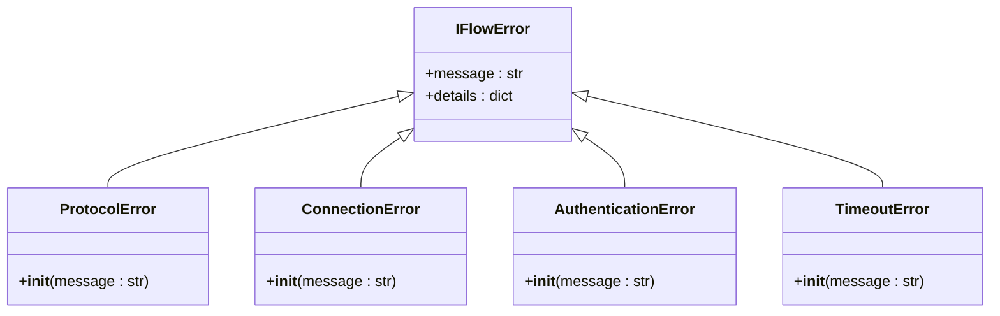
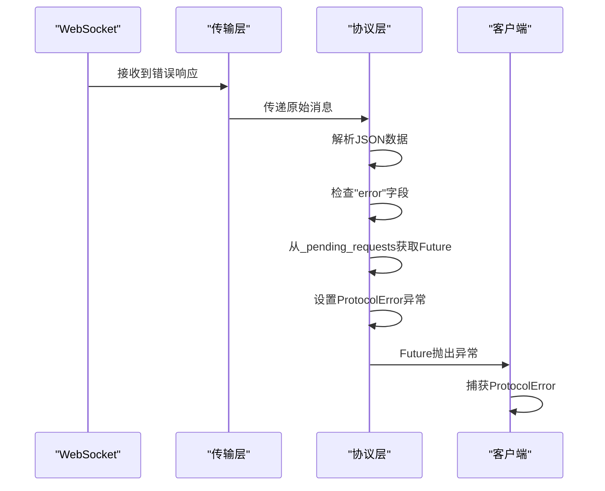

# 响应解析与错误转换

<cite>
**本文档引用的文件**   
- [protocol.py](file://_internal\protocol.py)
- [client.py](file://client.py)
- [transport.py](file://_internal\transport.py)
- [_errors.py](file://_errors.py)
</cite>

## 目录
1. [简介](#简介)
2. [核心机制](#核心机制)
3. [_pending_requests字典的作用](#_pending_requests字典的作用)
4. [错误响应处理流程](#错误响应处理流程)
5. [异常转换机制](#异常转换机制)
6. [完整流程示例](#完整流程示例)
7. [最佳实践](#最佳实践)

## 简介
本节将深入解析ACP协议中`_handle_response()`方法如何处理JSON-RPC格式的错误响应。我们将详细说明`_pending_requests`字典如何关联请求与响应，以及当收到包含'error'字段的响应时，SDK如何将其转换为相应的Python异常。通过代码示例展示从WebSocket接收到错误消息到抛出ProtocolError的完整流程，帮助开发者理解底层错误传播机制。

## 核心机制
ACP协议使用JSON-RPC 2.0作为消息格式，通过WebSocket进行通信。协议的核心是请求-响应模型，其中每个请求都有一个唯一的ID，用于匹配相应的响应。这种机制确保了异步通信中的消息正确关联。



**Diagram sources**
- [protocol.py](file://_internal\protocol.py#L21-L786)
- [transport.py](file://_internal\transport.py#L27-L177)

**Section sources**
- [protocol.py](file://_internal\protocol.py#L21-L786)
- [transport.py](file://_internal\transport.py#L27-L177)

## _pending_requests字典的作用
`_pending_requests`字典是ACP协议中实现请求-响应匹配的核心数据结构。它存储了所有已发送但尚未收到响应的请求，使用请求ID作为键，`asyncio.Future`对象作为值。



**Diagram sources**
- [protocol.py](file://_internal\protocol.py#L49-L50)
- [protocol.py](file://_internal\protocol.py#L55-L62)

**Section sources**
- [protocol.py](file://_internal\protocol.py#L49-L62)

### 请求ID生成
每个请求都会通过`_next_request_id()`方法生成唯一的ID，该ID递增并作为请求的标识符：

```python
def _next_request_id(self) -> int:
    """生成下一个请求ID."""
    self._request_id += 1
    return self._request_id
```

### 请求存储
当发送请求时，系统会创建一个`Future`对象并将其存储在`_pending_requests`字典中：

```python
request_id = self._next_request_id()
future = asyncio.Future()
self._pending_requests[request_id] = future
```

## 错误响应处理流程
当WebSocket接收到消息时，协议层会解析JSON数据并根据消息类型进行处理。对于包含'error'字段的响应，系统会触发异常转换机制。



**Diagram sources**
- [protocol.py](file://_internal\protocol.py#L769-L786)
- [protocol.py](file://_internal\protocol.py#L514-L532)

**Section sources**
- [protocol.py](file://_internal\protocol.py#L769-L786)

### 响应处理方法
`_handle_response()`方法是处理响应的核心，它根据响应内容决定是完成Future还是设置异常：

```python
async def _handle_response(self, data: Dict[str, Any]) -> None:
    """处理对我们的请求的响应."""
    request_id = data.get("id")

    if request_id in self._pending_requests:
        future = self._pending_requests.pop(request_id)

        if "error" in data:
            future.set_exception(ProtocolError(f"Request failed: {data['error']}"))
        else:
            future.set_result(data.get("result"))
    else:
        logger.debug("Received response for unknown request ID: %s", request_id)
```

## 异常转换机制
当收到错误响应时，SDK会将JSON-RPC错误转换为相应的Python异常。这种转换机制确保了错误信息能够以开发者友好的方式呈现。



**Diagram sources**
- [_errors.py](file://_errors.py#L10-L85)
- [protocol.py](file://_internal\protocol.py#L781-L782)

**Section sources**
- [_errors.py](file://_errors.py#L10-L85)

### 错误类型映射
SDK定义了多种错误类型，每种类型都继承自基类`IFlowError`：

- **ProtocolError**: 协议通信失败
- **ConnectionError**: 连接失败
- **AuthenticationError**: 认证失败
- **TimeoutError**: 操作超时

## 完整流程示例
以下是从WebSocket接收到错误消息到抛出ProtocolError的完整流程示例：



**Diagram sources**
- [transport.py](file://_internal\transport.py#L114-L146)
- [protocol.py](file://_internal\protocol.py#L769-L786)
- [client.py](file://client.py#L132-L322)

**Section sources**
- [transport.py](file://_internal\transport.py#L114-L146)
- [protocol.py](file://_internal\protocol.py#L769-L786)

## 最佳实践
在使用ACP协议时，开发者应遵循以下最佳实践来处理错误响应：

1. **始终处理异常**: 确保所有异步调用都被适当的异常处理包围
2. **检查连接状态**: 在发送请求前验证连接是否正常
3. **设置超时**: 为所有操作设置合理的超时时间
4. **日志记录**: 记录关键的错误信息以便调试

```python
try:
    result = await protocol.some_request()
except ProtocolError as e:
    logger.error(f"协议错误: {e.message}")
    # 处理协议错误
except ConnectionError as e:
    logger.error(f"连接错误: {e.message}")
    # 处理连接错误
except TimeoutError as e:
    logger.error(f"超时错误: {e.message}")
    # 处理超时错误
```

**Section sources**
- [client.py](file://client.py#L145-L322)
- [_errors.py](file://_errors.py#L10-L85)