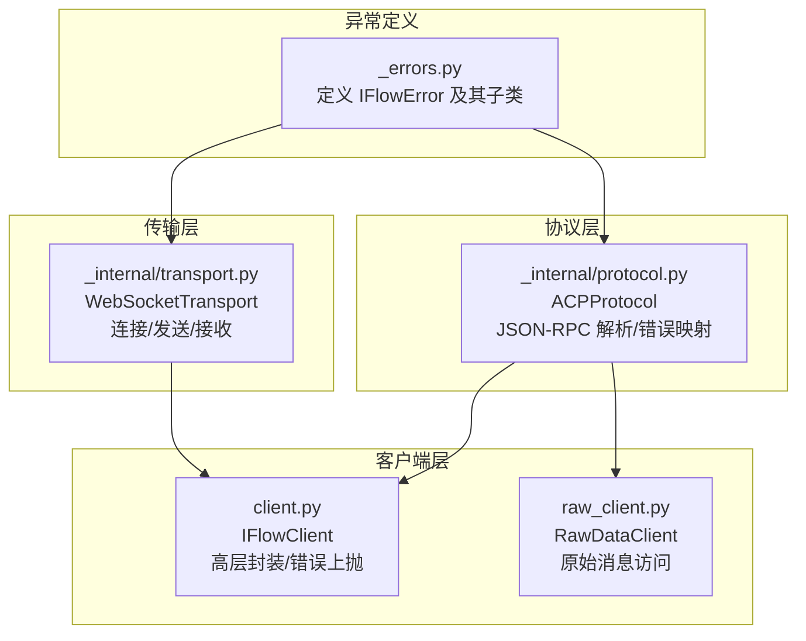
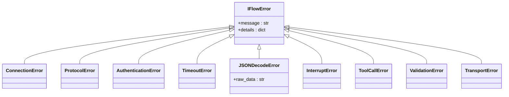
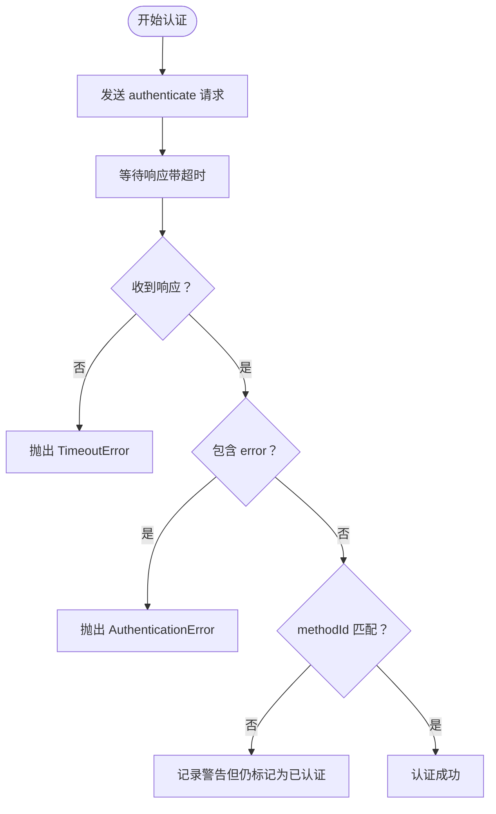
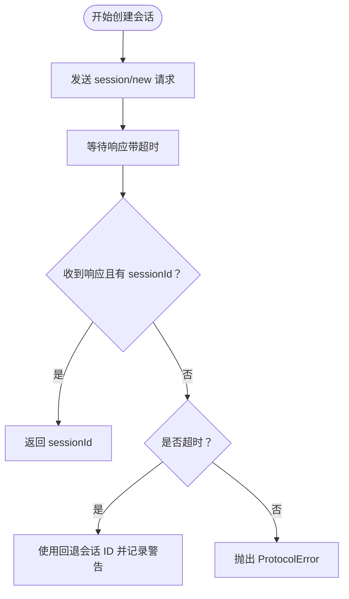
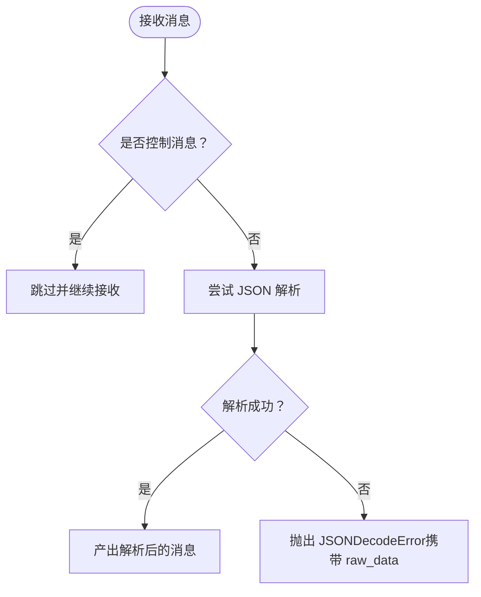
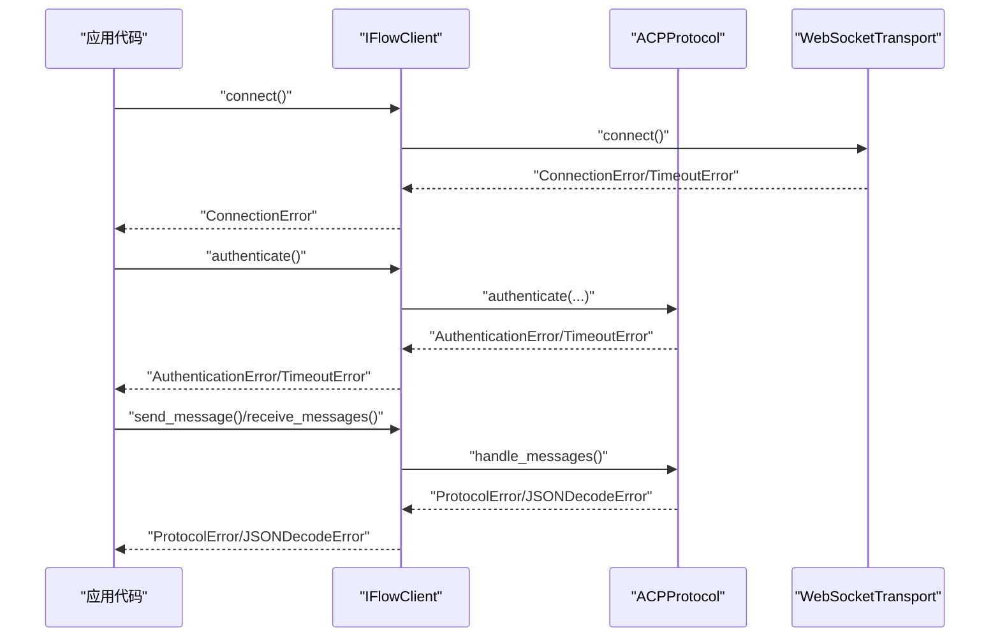
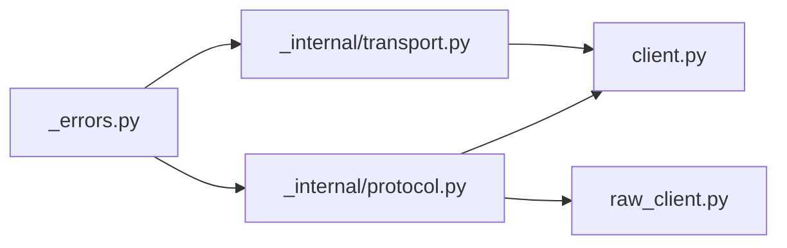

# 异常类型

<cite>
**本文引用的文件**
- [_errors.py](file://_errors.py)
- [protocol.py](file://_internal/protocol.py)
- [transport.py](file://_internal/transport.py)
- [client.py](file://client.py)
- [raw_client.py](file://raw_client.py)
- [types.py](file://types.py)
</cite>

## 目录
1. [简介](#简介)
2. [项目结构与异常体系定位](#项目结构与异常体系定位)
3. [核心异常类型总览](#核心异常类型总览)
4. [架构与继承关系图](#架构与继承关系图)
5. [关键异常详解](#关键异常详解)
6. [异常触发流程与典型场景](#异常触发流程与典型场景)
7. [依赖与耦合分析](#依赖与耦合分析)
8. [性能与健壮性考量](#性能与健壮性考量)
9. [故障排查与最佳实践](#故障排查与最佳实践)
10. [结论](#结论)

## 简介
本章节系统梳理 iFlow SDK 中与 ACP 协议相关的异常类型，重点覆盖 IFlowError 基类及其子类（如 ProtocolError、AuthenticationError、TimeoutError、ConnectionError、JSONDecodeError 等）。我们将从继承关系、触发条件、典型使用场景、错误语义映射、到如何在代码中捕获与处理异常进行逐层展开，并辅以流程图与类图帮助理解。

## 项目结构与异常体系定位
- 异常定义集中在独立模块中，便于统一管理与跨组件复用。
- 协议层（ACPProtocol）负责将网络与协议层面的问题转换为语义明确的异常类型。
- 传输层（WebSocketTransport）负责底层连接与消息收发，并在失败时抛出对应异常。
- 客户端层（IFlowClient）在高层封装中对异常进行归一化与上抛，便于调用方按语义处理。

图表来源
- [_errors.py](file://_errors.py#L1-L85)
- [_internal/protocol.py](file://_internal/protocol.py#L1-L120)
- [_internal/transport.py](file://_internal/transport.py#L1-L177)
- [client.py](file://client.py#L1-L120)
- [raw_client.py](file://raw_client.py#L1-L120)

章节来源
- [client.py](file://client.py#L1-L120)
- [_internal/protocol.py](file://_internal/protocol.py#L1-L120)
- [_internal/transport.py](file://_internal/transport.py#L1-L120)
- [_errors.py](file://_errors.py#L1-L85)

## 核心异常类型总览
- IFlowError：所有 SDK 异常的基类，提供统一的消息与详情字段。
- ConnectionError：连接失败或连接丢失时抛出。
- ProtocolError：协议交互失败（如初始化/认证/请求响应错误）。
- AuthenticationError：认证失败。
- TimeoutError：超时（连接超时、认证超时、会话创建超时等）。
- JSONDecodeError：JSON 解码失败，携带原始数据以便诊断。
- 其他：InterruptError、ToolCallError、ValidationError、TransportError 等，用于更细粒度的错误语义。

章节来源
- [_errors.py](file://_errors.py#L1-L85)

## 架构与继承关系图
下图展示了异常类型的继承关系与主要依赖点，体现“传输层 -> 协议层 -> 客户端层”的错误传播路径。

图表来源
- [_errors.py](file://_errors.py#L1-L85)

## 关键异常详解

### IFlowError（基类）
- 作用：统一承载错误信息与可选详情字典，便于上层一致处理与日志记录。
- 字段：
  - message：错误描述文本。
  - details：附加细节（如 raw_data、错误码、上下文等），在子类中按需扩展。
- 使用建议：
  - 捕获 IFlowError 后，优先读取 details 获取上下文，再根据具体子类做差异化处理。
  - 在构造函数中传入 message 与 details，确保错误信息完整。

章节来源
- [_errors.py](file://_errors.py#L10-L23)

### ConnectionError（连接相关）
- 触发条件：
  - 传输层连接建立失败（超时、网络异常）。
  - 连接被远端关闭或底层异常导致连接丢失。
- 典型场景：
  - 初始化阶段连接 iFlow 失败。
  - 发送/接收消息过程中连接断开。
- 处理建议：
  - 区分“连接失败”与“连接已断开”，前者可重试/降级，后者需重建会话。
  - 记录 details 中的底层错误原因，辅助定位网络问题。

章节来源
- [_internal/transport.py](file://_internal/transport.py#L53-L84)
- [_internal/transport.py](file://_internal/transport.py#L108-L113)
- [client.py](file://client.py#L132-L171)

### ProtocolError（协议交互失败）
- 触发条件：
  - 初始化/认证/请求响应中出现错误对象或非预期结果。
  - JSON-RPC 错误、未初始化/未认证即发起请求。
- 典型场景：
  - initialize 返回 error 或未收到响应。
  - authenticate 返回 error 或连接关闭。
  - session/new/session/load 请求返回 error。
- 处理建议：
  - 将 ProtocolError 与连接/认证/超时区分开来，避免误判。
  - 对于可恢复的协议错误，尝试重新初始化或认证。

章节来源
- [_internal/protocol.py](file://_internal/protocol.py#L140-L171)
- [_internal/protocol.py](file://_internal/protocol.py#L223-L256)
- [_internal/protocol.py](file://_internal/protocol.py#L321-L346)
- [_internal/protocol.py](file://_internal/protocol.py#L422-L446)

### AuthenticationError（认证失败）
- 触发条件：
  - 认证响应包含错误或方法不匹配。
  - 认证过程中连接关闭。
- 典型场景：
  - 服务端拒绝认证方法或凭据无效。
  - 超时后仍未收到认证响应。
- 处理建议：
  - 明确区分“认证失败”与“未认证”，前者通常不可重试，后者可重试认证。
  - 检查 method_id 与 method_info 的一致性。

章节来源
- [_internal/protocol.py](file://_internal/protocol.py#L223-L256)
- [client.py](file://client.py#L263-L276)

### TimeoutError（超时）
- 触发条件：
  - 连接建立超时（传输层）。
  - 认证等待超时（协议层）。
  - 会话创建/加载等待超时（协议层）。
- 典型场景：
  - iFlow 未及时响应 //ready。
  - 认证响应超过阈值。
  - 会话创建/加载长时间无响应。
- 处理建议：
  - 针对不同阶段设置合理超时时间并分级处理。
  - 超时后可选择重试或回退策略（如使用回退会话 ID）。

章节来源
- [_internal/transport.py](file://_internal/transport.py#L78-L83)
- [_internal/protocol.py](file://_internal/protocol.py#L251-L256)
- [_internal/protocol.py](file://_internal/protocol.py#L340-L344)

### JSONDecodeError（JSON 解码失败）
- 触发条件：
  - 传输层收到的字符串无法解析为 JSON。
- 典型场景：
  - 服务器返回非标准 JSON 或半包消息。
  - 控制消息与业务消息混杂导致解析异常。
- 处理建议：
  - 记录 raw_data 以便后续诊断。
  - 对控制消息与业务消息进行区分处理，避免误解析。

章节来源
- [_internal/protocol.py](file://_internal/protocol.py#L530-L533)
- [_errors.py](file://_errors.py#L73-L85)

### 其他异常（TransportError、InterruptError、ToolCallError、ValidationError）
- TransportError：传输层发送/接收失败（除连接丢失外的其他传输错误）。
- InterruptError：操作被中断（如取消会话）。
- ToolCallError：工具调用失败（如文件系统访问失败、权限不足等）。
- ValidationError：参数或输入校验失败。
- 典型场景：
  - 文件读写异常、权限配置缺失。
  - 用户主动中断生成过程。
  - 输入格式不符合协议要求。

章节来源
- [_errors.py](file://_errors.py#L49-L85)
- [_internal/protocol.py](file://_internal/protocol.py#L608-L629)
- [_internal/protocol.py](file://_internal/protocol.py#L639-L659)

## 异常触发流程与典型场景

### 流程图：认证超时与失败

图表来源
- [_internal/protocol.py](file://_internal/protocol.py#L213-L256)

### 流程图：会话创建超时

图表来源
- [_internal/protocol.py](file://_internal/protocol.py#L311-L344)

### 流程图：JSON 解码失败

图表来源
- [_internal/protocol.py](file://_internal/protocol.py#L508-L533)

### 序列图：客户端层异常上抛

图表来源
- [client.py](file://client.py#L132-L171)
- [_internal/protocol.py](file://_internal/protocol.py#L140-L171)
- [_internal/transport.py](file://_internal/transport.py#L53-L84)

## 依赖与耦合分析
- 继承关系清晰：所有异常均继承自 IFlowError，便于统一捕获与处理。
- 分层职责明确：
  - 传输层负责连接与收发，抛出 ConnectionError/TimeoutError/TransportError/JSONDecodeError。
  - 协议层负责 JSON-RPC 解析与错误映射，抛出 ProtocolError/AuthenticationError/TimeoutError。
  - 客户端层负责高层封装与错误上抛，便于上层按语义处理。
- 依赖方向：
  - _errors.py 为纯定义模块，被 protocol.py、transport.py、client.py、raw_client.py 引用。
  - protocol.py 与 transport.py 互为依赖，共同完成协议与传输。
  - client.py 与 raw_client.py 依赖 protocol.py 与 transport.py，提供高层能力。

图表来源
- [_errors.py](file://_errors.py#L1-L85)
- [_internal/protocol.py](file://_internal/protocol.py#L1-L120)
- [_internal/transport.py](file://_internal/transport.py#L1-L120)
- [client.py](file://client.py#L1-L120)
- [raw_client.py](file://raw_client.py#L1-L120)

章节来源
- [_errors.py](file://_errors.py#L1-L85)
- [_internal/protocol.py](file://_internal/protocol.py#L1-L120)
- [_internal/transport.py](file://_internal/transport.py#L1-L120)
- [client.py](file://client.py#L1-L120)
- [raw_client.py](file://raw_client.py#L1-L120)

## 性能与健壮性考量
- 超时策略：为连接、认证、会话操作分别设置合理超时，避免阻塞。
- 重试机制：对瞬时性连接失败可采用指数退避重试，但对认证失败与协议错误应谨慎重试。
- 日志与详情：充分利用 details 字段记录 raw_data、错误码、上下文，提升可观测性。
- 资源清理：在异常发生时确保连接关闭与进程管理器停止，避免资源泄漏。

[本节为通用建议，无需特定文件来源]

## 故障排查与最佳实践

- 如何捕获与处理异常
  - 建议先捕获 IFlowError，再根据具体子类进行差异化处理。
  - 对于 JSONDecodeError，优先检查 raw_data 并确认消息边界与编码。
  - 对于认证失败，核对 method_id 与 method_info 是否正确。
  - 对于超时，结合日志与网络状况判断是否需要调整超时阈值或重试策略。

- 常见排查步骤
  - 检查连接状态与 URL 正确性（传输层）。
  - 查看协议握手与响应内容（协议层）。
  - 校验 JSON 结构与字段完整性（协议层）。
  - 记录并比对 raw_data 与 parsed 数据（原始客户端）。

- 代码示例路径（不直接展示代码，仅给出定位）
  - 认证超时与失败：参见 [认证流程](file://_internal/protocol.py#L213-L256)
  - 会话创建超时与回退：参见 [会话创建流程](file://_internal/protocol.py#L311-L344)
  - JSON 解码失败：参见 [消息解析与异常](file://_internal/protocol.py#L508-L533)
  - 客户端层异常上抛：参见 [连接与认证异常](file://client.py#L132-L171)

章节来源
- [_internal/protocol.py](file://_internal/protocol.py#L213-L256)
- [_internal/protocol.py](file://_internal/protocol.py#L311-L344)
- [_internal/protocol.py](file://_internal/protocol.py#L508-L533)
- [client.py](file://client.py#L132-L171)

## 结论
iFlow SDK 的异常体系以 IFlowError 为基座，结合传输层、协议层与客户端层的职责划分，实现了从底层网络到高层业务的全链路错误语义表达。通过 ConnectionError、ProtocolError、AuthenticationError、TimeoutError、JSONDecodeError 等子类，开发者可以快速识别错误来源与性质，并据此采取针对性的恢复策略。建议在实际工程中遵循“先捕获基类、再细分处理”的原则，配合详细的日志与错误详情，持续优化系统的稳定性与可维护性。