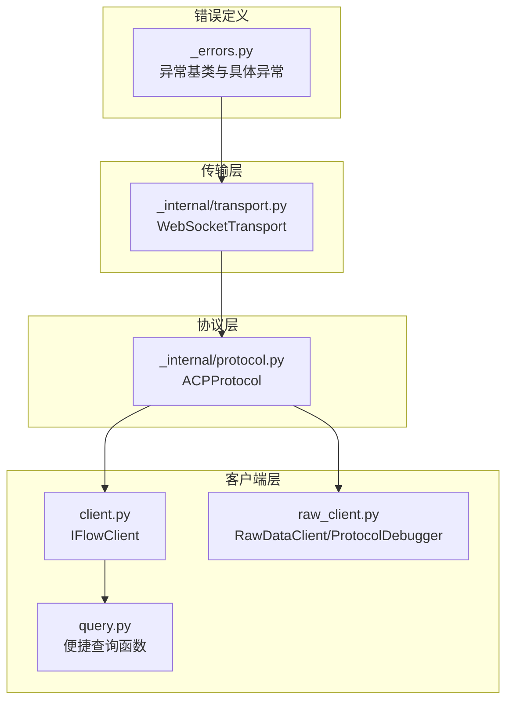
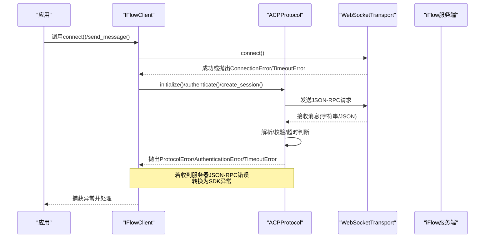
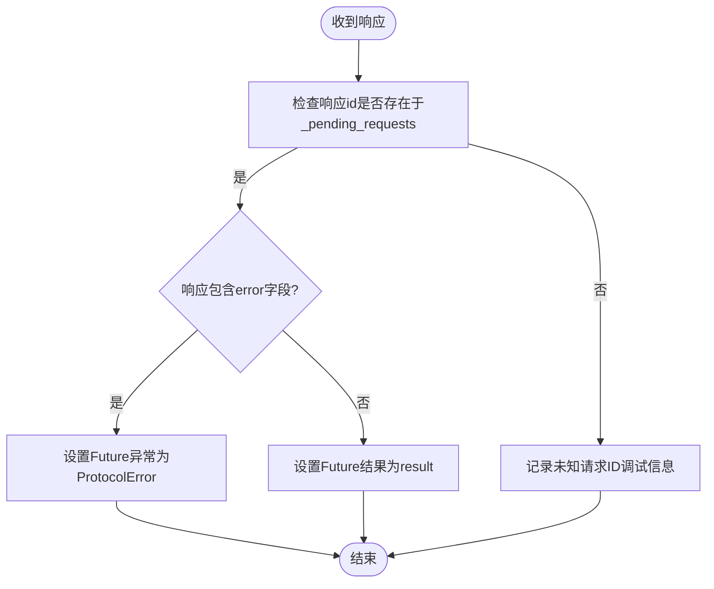
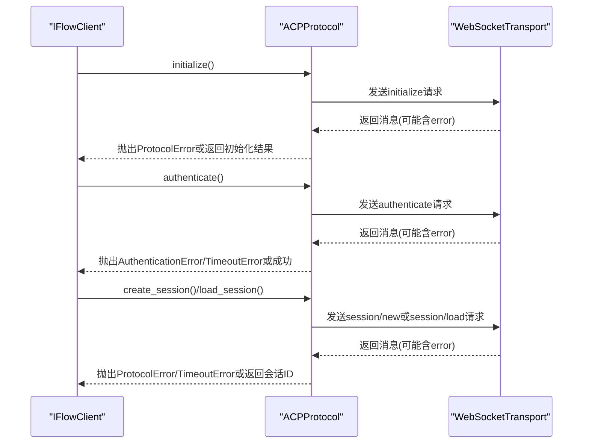
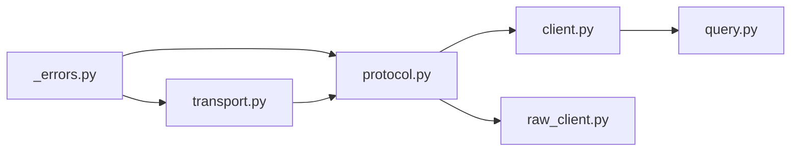

# 错误处理

<cite>
**本文引用的文件**
- [_errors.py](file://_errors.py)
- [protocol.py](file://_internal/protocol.py)
- [transport.py](file://_internal/transport.py)
- [client.py](file://client.py)
- [raw_client.py](file://raw_client.py)
- [query.py](file://query.py)
- [types.py](file://types.py)
- [__init__.py](file://__init__.py)
</cite>

## 目录
1. [简介](#简介)
2. [项目结构](#项目结构)
3. [核心组件](#核心组件)
4. [架构总览](#架构总览)
5. [详细组件分析](#详细组件分析)
6. [依赖关系分析](#依赖关系分析)
7. [性能考量](#性能考量)
8. [故障排查指南](#故障排查指南)
9. [结论](#结论)
10. [附录](#附录)

## 简介
本章节系统性梳理 iFlow SDK 的错误处理机制，重点覆盖以下方面：
- 异常类型：ProtocolError、AuthenticationError、TimeoutError、ConnectionError、JSONDecodeError 等的触发条件与处理策略
- JSON-RPC 错误响应结构：错误码与错误消息的含义及来源
- 协议层如何将服务器错误转换为 SDK 异常，并通过 _pending_requests 字典实现请求与响应的关联
- 在初始化、认证、会话创建等关键流程中的错误捕获与恢复模式
- 针对初学者的常见问题解决方案与针对高级用户的协议级调试方法

## 项目结构
围绕错误处理的相关模块与职责如下：
- 错误定义：统一的异常层次结构，便于上层按类型进行捕获与处理
- 传输层：负责底层 WebSocket 连接与消息收发，抛出连接、超时、传输类错误
- 协议层：基于 JSON-RPC 的 ACP 协议实现，负责握手、认证、会话管理、消息分发与错误转换
- 客户端层：对外暴露易用接口，封装错误处理与恢复逻辑
- 原始数据客户端：面向高级用户，提供原始消息流与协议调试能力

图表来源
- [protocol.py](file://_internal/protocol.py#L1-L120)
- [transport.py](file://_internal/transport.py#L1-L120)
- [client.py](file://client.py#L1-L120)
- [raw_client.py](file://raw_client.py#L1-L120)
- [_errors.py](file://_errors.py#L1-L85)

章节来源
- [protocol.py](file://_internal/protocol.py#L1-L120)
- [transport.py](file://_internal/transport.py#L1-L120)
- [client.py](file://client.py#L1-L120)
- [raw_client.py](file://raw_client.py#L1-L120)
- [_errors.py](file://_errors.py#L1-L85)

## 核心组件
- 异常层次结构：IFlowError 为基类，派生出 ConnectionError、ProtocolError、AuthenticationError、TimeoutError、TransportError、JSONDecodeError 等，便于精确捕获与区分
- 传输层错误：WebSocketTransport 在连接、发送、接收阶段抛出 ConnectionError、TimeoutError、TransportError、JSONDecodeError
- 协议层错误：ACPProtocol 在 initialize/authenticate/create_session 等关键步骤中抛出 ProtocolError、AuthenticationError、TimeoutError；并将服务器 JSON-RPC 错误转换为 SDK 异常
- 客户端层错误：IFlowClient 在连接、认证、会话创建等流程中进行错误捕获与恢复，并在消息处理中将错误转化为 ErrorMessage 消息对象
- 原始数据客户端：RawDataClient 提供原始消息流与统计分析，辅助协议级调试

章节来源
- [_errors.py](file://_errors.py#L1-L85)
- [transport.py](file://_internal/transport.py#L1-L177)
- [protocol.py](file://_internal/protocol.py#L1-L200)
- [client.py](file://client.py#L1-L200)
- [raw_client.py](file://raw_client.py#L1-L120)

## 架构总览
下图展示了从传输到协议再到客户端的错误传播路径与转换策略。

图表来源
- [client.py](file://client.py#L132-L322)
- [protocol.py](file://_internal/protocol.py#L120-L200)
- [transport.py](file://_internal/transport.py#L60-L146)

## 详细组件分析

### 异常类型与触发条件
- IFlowError：所有 SDK 异常的基类，提供 message 与 details 字段
- ConnectionError：连接失败（如 WebSocket 连接超时、连接断开）
- ProtocolError：协议通信失败（如初始化/认证/会话创建失败、未知请求ID、服务器返回错误）
- AuthenticationError：认证失败（服务器拒绝或认证过程异常）
- TimeoutError：操作超时（如认证等待超时、会话创建等待超时）
- TransportError：传输层错误（发送/接收过程中出现非连接断开的异常）
- JSONDecodeError：JSON 解析失败（收到无法解析的消息）

章节来源
- [_errors.py](file://_errors.py#L1-L85)
- [transport.py](file://_internal/transport.py#L70-L146)
- [protocol.py](file://_internal/protocol.py#L140-L200)

### JSON-RPC 错误响应结构与含义
- 结构要点
  - id：请求标识，用于关联请求与响应
  - error：包含 code 与 message 字段
  - code：标准 JSON-RPC 错误码
  - message：错误描述
- 典型错误码
  - -32601：方法未找到（method not found）
  - -32603：服务器内部错误（internal error）
  - -32700：解析错误（parse error）
  - -32000 到 -32099：自定义范围（由服务端定义）
- 协议层转换
  - 当收到包含 error 的 JSON-RPC 响应时，ACPProtocol 将其转换为 SDK 异常（如 ProtocolError），并在必要时记录 details
  - 对于服务器主动发起的错误通知，协议层也会将其转换为统一的错误消息结构，便于上层处理

章节来源
- [protocol.py](file://_internal/protocol.py#L694-L719)
- [protocol.py](file://_internal/protocol.py#L520-L533)

### _handle_response() 如何将服务器错误转换为 SDK 异常
- 关键点
  - 使用 _pending_requests 字典以 request_id 为键保存 asyncio.Future
  - 收到响应后，若存在对应 Future，则根据是否存在 error 字段决定 set_exception 或 set_result
  - 若不存在对应 Future，记录调试日志（未知请求ID）
- 影响
  - 保证请求与响应的严格关联，避免错配
  - 将服务器错误映射为 SDK 异常，便于上层统一处理

图表来源
- [protocol.py](file://_internal/protocol.py#L769-L786)

章节来源
- [protocol.py](file://_internal/protocol.py#L769-L786)

### _pending_requests 字典的请求-响应关联机制
- 初始化
  - ACPProtocol 在构造函数中创建 _pending_requests: Dict[int, asyncio.Future]
- 请求发送
  - 每个 JSON-RPC 请求生成唯一 request_id，并创建 Future 存入 _pending_requests
- 响应处理
  - _handle_response() 取出 Future 并设置结果或异常
- 作用
  - 实现严格的请求-响应匹配，支持超时与错误传播

章节来源
- [protocol.py](file://_internal/protocol.py#L35-L54)
- [protocol.py](file://_internal/protocol.py#L769-L786)

### 初始化、认证、会话创建的关键错误捕获与恢复
- 初始化 initialize()
  - 触发条件：未收到 //ready 控制信号、JSON 解析失败、服务器返回 error、超时
  - 恢复策略：重试连接、记录日志、抛出 ProtocolError
- 认证 authenticate()
  - 触发条件：服务器返回 error、认证超时、连接断开
  - 恢复策略：提示用户重新认证、切换认证方式、抛出 AuthenticationError/TimeoutError
- 会话创建 create_session()/load_session()
  - 触发条件：未初始化/未认证、服务器返回 error、超时、连接断开
  - 恢复策略：先执行 initialize()/authenticate()、降级为回退会话ID、抛出 ProtocolError/TimeoutError

图表来源
- [protocol.py](file://_internal/protocol.py#L120-L200)
- [protocol.py](file://_internal/protocol.py#L257-L346)
- [protocol.py](file://_internal/protocol.py#L347-L446)

章节来源
- [protocol.py](file://_internal/protocol.py#L120-L200)
- [protocol.py](file://_internal/protocol.py#L257-L346)
- [protocol.py](file://_internal/protocol.py#L347-L446)
- [client.py](file://client.py#L132-L322)

### 客户端层的错误捕获与恢复
- 连接 connect()
  - 处理连接失败、进程启动失败、认证失败等
  - 通过指数退避重试提升稳定性
- 消息处理 _handle_messages()
  - 捕获异常并转换为 ErrorMessage，避免中断消息流
- 工具确认 respond_to_tool_confirmation()/cancel_tool_confirmation()
  - 对无效 request_id 抛出 ProtocolError，确保安全边界

章节来源
- [client.py](file://client.py#L132-L322)
- [client.py](file://client.py#L640-L657)
- [protocol.py](file://_internal/protocol.py#L720-L768)

### 原始数据客户端与协议级调试
- RawDataClient
  - 提供 receive_raw_messages()/receive_dual_stream()，输出原始消息与解析后的消息
  - 维护历史消息列表与统计信息，便于分析
- ProtocolDebugger
  - 提供打印与会话分析功能，帮助定位问题

章节来源
- [raw_client.py](file://raw_client.py#L1-L200)
- [raw_client.py](file://raw_client.py#L200-L362)

## 依赖关系分析
- 异常定义被传输层与协议层广泛使用，形成一致的错误语义
- 协议层依赖传输层提供的连接与消息收发能力
- 客户端层依赖协议层的高层 API，并在上层进行错误包装与恢复
- 原始数据客户端依赖协议层的消息处理管道，提供额外的可观测性

图表来源
- [_errors.py](file://_errors.py#L1-L85)
- [transport.py](file://_internal/transport.py#L1-L177)
- [protocol.py](file://_internal/protocol.py#L1-L120)
- [client.py](file://client.py#L1-L120)
- [raw_client.py](file://raw_client.py#L1-L120)
- [query.py](file://query.py#L1-L137)

章节来源
- [_errors.py](file://_errors.py#L1-L85)
- [transport.py](file://_internal/transport.py#L1-L177)
- [protocol.py](file://_internal/protocol.py#L1-L120)
- [client.py](file://client.py#L1-L120)
- [raw_client.py](file://raw_client.py#L1-L120)
- [query.py](file://query.py#L1-L137)

## 性能考量
- 超时控制：认证与会话创建均设置了固定超时阈值，避免长时间阻塞
- 重试策略：连接阶段采用指数退避重试，提高在网络波动下的成功率
- 日志粒度：在关键路径记录调试信息，便于定位问题但不造成性能负担
- 消息处理：对 JSON 解析失败直接抛出 JSONDecodeError，避免无意义的重试循环

[本节为通用建议，无需列出具体文件来源]

## 故障排查指南

### 初学者常见问题与解决
- 连接失败
  - 现象：抛出 ConnectionError
  - 排查：确认 URL 正确、网络可达、iFlow 是否已启动
  - 处理：查看日志、重试连接、检查防火墙
- 认证失败
  - 现象：抛出 AuthenticationError
  - 排查：核对认证参数、令牌有效期、服务端策略
  - 处理：更换认证方式、更新凭据、重试认证
- 会话创建超时
  - 现象：抛出 TimeoutError 或 ProtocolError
  - 排查：检查服务端负载、网络延迟、配置项
  - 处理：增加超时时间、优化配置、稍后重试
- JSON 解析错误
  - 现象：抛出 JSONDecodeError
  - 排查：查看原始消息内容、确认服务端版本兼容性
  - 处理：升级 SDK 或服务端、修正消息格式

章节来源
- [transport.py](file://_internal/transport.py#L70-L146)
- [protocol.py](file://_internal/protocol.py#L140-L200)
- [protocol.py](file://_internal/protocol.py#L257-L346)
- [protocol.py](file://_internal/protocol.py#L520-L533)

### 高级用户协议级调试
- 使用 RawDataClient
  - 同时获取原始消息与解析后的消息，对比差异
  - 使用 get_protocol_stats() 获取消息类型分布与错误计数
- 使用 ProtocolDebugger
  - 打印消息摘要与完整 JSON，快速定位问题
  - 分析会话统计与时间线，还原交互过程
- 关注 _pending_requests
  - 若出现“未知请求ID”日志，检查请求ID生成与响应匹配逻辑
- 关注 JSON-RPC 错误码
  - -32601：方法未找到，检查方法名与服务端能力
  - -32603：内部错误，检查服务端日志与资源限制

章节来源
- [raw_client.py](file://raw_client.py#L120-L200)
- [raw_client.py](file://raw_client.py#L200-L362)
- [protocol.py](file://_internal/protocol.py#L769-L786)

## 结论
iFlow SDK 的错误处理体系以清晰的异常层次为基础，结合传输层与协议层的严格错误转换与恢复策略，在关键流程中提供了稳健的容错能力。通过 _pending_requests 的请求-响应关联与 RawDataClient 的协议级可观测性，开发者既能快速定位问题，也能在复杂场景中实现优雅降级与重试。

[本节为总结性内容，无需列出具体文件来源]

## 附录

### JSON-RPC 错误码速查
- -32601：方法未找到（method not found）
- -32603：服务器内部错误（internal error）
- -32700：解析错误（parse error）
- -32000 到 -32099：自定义范围（由服务端定义）

章节来源
- [protocol.py](file://_internal/protocol.py#L694-L719)

### 导出与使用
- SDK 通过 __init__.py 将错误类型与主要组件导出，便于外部直接使用
- 建议在业务层按异常类型进行分支处理，避免捕获过宽导致掩盖问题

章节来源
- [__init__.py](file://__init__.py#L1-L142)
- [types.py](file://types.py#L674-L687)