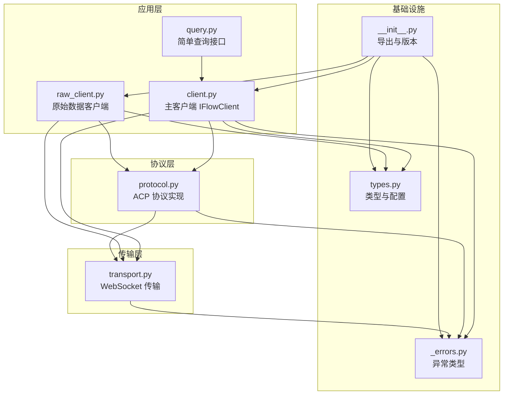
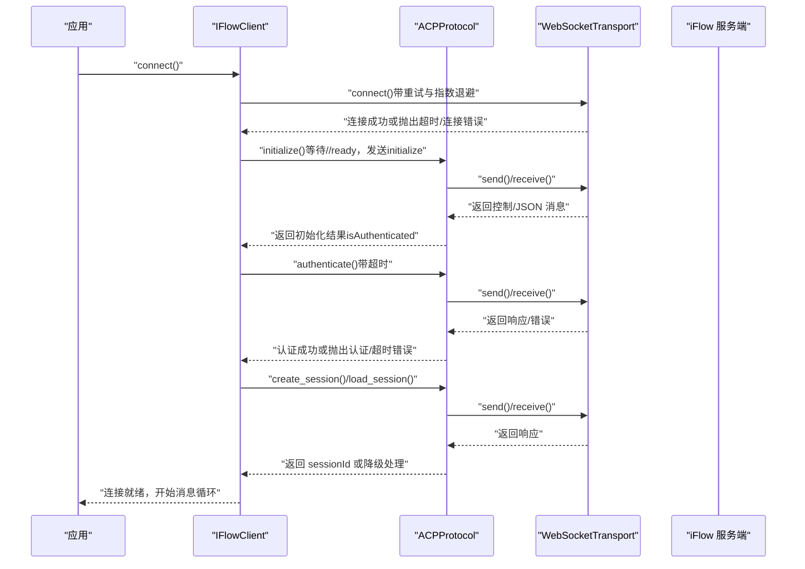
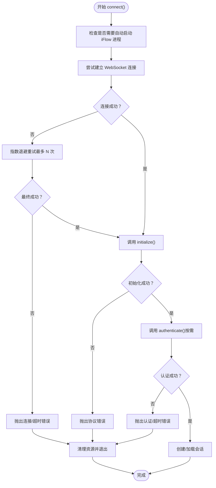
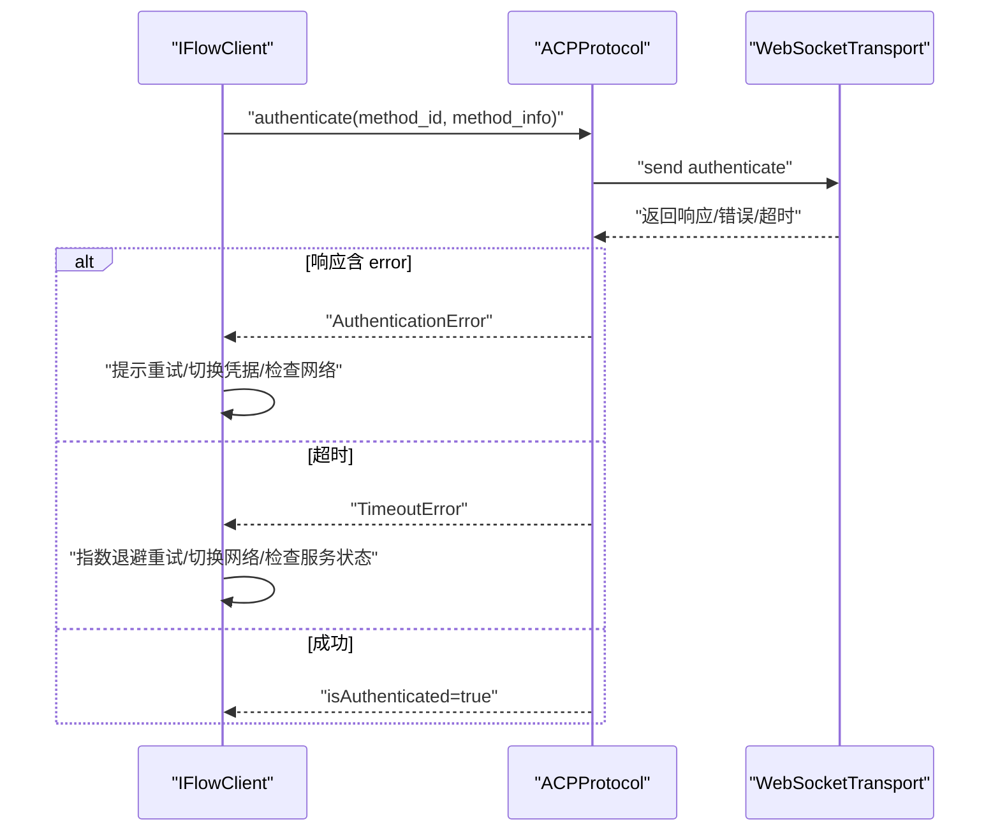
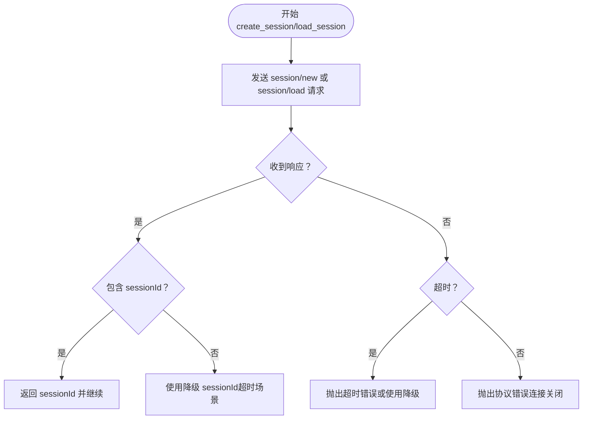
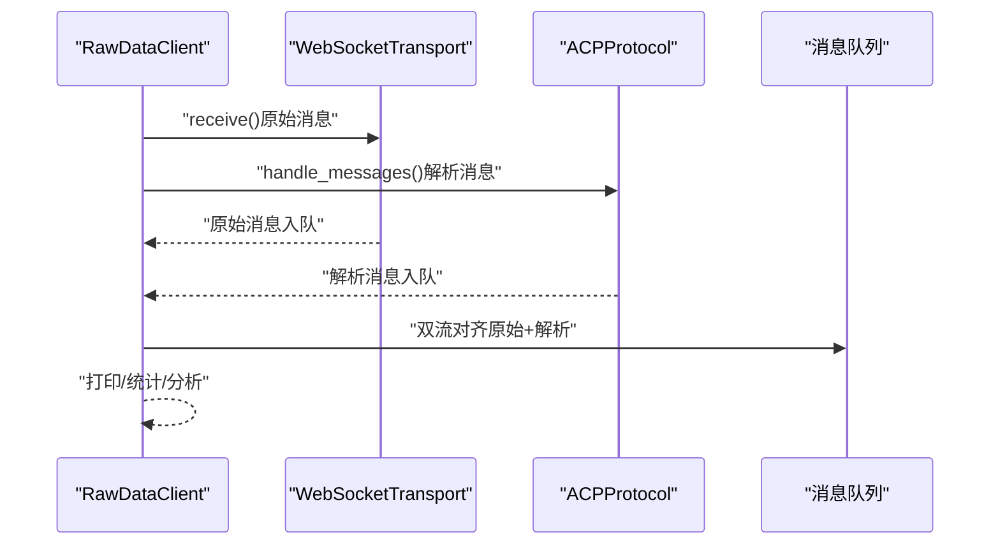
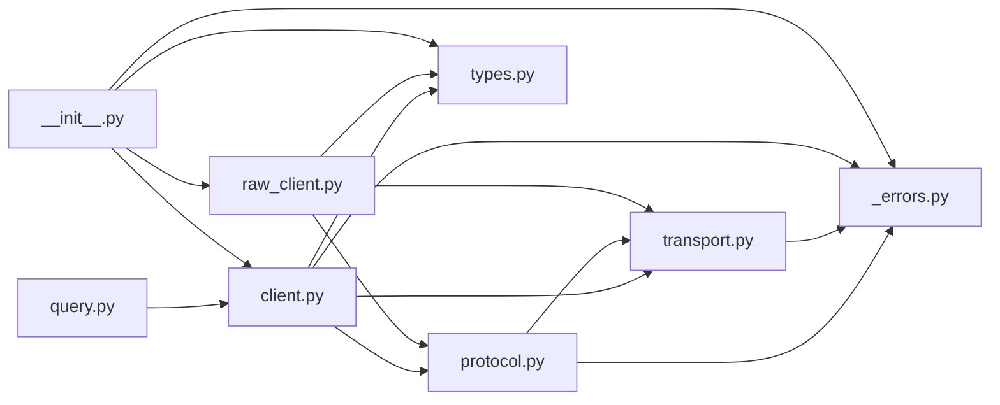

# 错误恢复策略

<cite>
**本文引用的文件**
- [client.py](file://client.py)
- [raw_client.py](file://raw_client.py)
- [_errors.py](file://_errors.py)
- [_internal/protocol.py](file://_internal/protocol.py)
- [_internal/transport.py](file://_internal/transport.py)
- [query.py](file://query.py)
- [types.py](file://types.py)
- [__init__.py](file://__init__.py)
</cite>

## 目录
1. [简介](#简介)
2. [项目结构](#项目结构)
3. [核心组件](#核心组件)
4. [架构总览](#架构总览)
5. [详细组件分析](#详细组件分析)
6. [依赖关系分析](#依赖关系分析)
7. [性能与可靠性考量](#性能与可靠性考量)
8. [故障排查指南](#故障排查指南)
9. [结论](#结论)

## 简介
本文件聚焦于 iFlow SDK 在“初始化、认证、会话创建”等关键阶段出现错误时的恢复策略，结合源码中的异常类型、重试机制、超时处理与日志记录，给出可落地的错误分类与恢复建议，并提供基于 try-catch 的实践路径与协议级调试方法，帮助开发者构建健壮的应用。

## 项目结构
SDK 采用分层设计：高层客户端负责生命周期管理与消息流；底层协议实现 ACP 协议；传输层封装 WebSocket 通信；错误类型统一定义；工具类与查询函数提供便捷入口。

图表来源
- [client.py](file://client.py#L1-L120)
- [raw_client.py](file://raw_client.py#L1-L120)
- [_internal/protocol.py](file://_internal/protocol.py#L1-L120)
- [_internal/transport.py](file://_internal/transport.py#L1-L120)
- [query.py](file://query.py#L1-L80)
- [types.py](file://types.py#L1-L120)
- [__init__.py](file://__init__.py#L1-L120)

章节来源
- [client.py](file://client.py#L1-L120)
- [raw_client.py](file://raw_client.py#L1-L120)
- [_internal/protocol.py](file://_internal/protocol.py#L1-L120)
- [_internal/transport.py](file://_internal/transport.py#L1-L120)
- [query.py](file://query.py#L1-L80)
- [types.py](file://types.py#L1-L120)
- [__init__.py](file://__init__.py#L1-L120)

## 核心组件
- 异常体系：统一继承自基础异常，覆盖连接、协议、认证、超时、传输、JSON 解析等场景，便于精准捕获与恢复。
- 客户端 IFlowClient：封装连接、初始化、认证、会话创建、消息收发、中断与清理流程，内置指数退避重试与自动进程启动。
- ACP 协议 ACPProtocol：实现 initialize、authenticate、session/new、权限请求等协议步骤，包含超时与 JSON 解析错误处理。
- WebSocketTransport：封装连接、发送、接收与关闭，提供连接超时与连接断开检测。
- RawDataClient：扩展原始消息流与解析，支持双流对齐、历史记录与协议统计，辅助协议级调试。
- 查询函数 query/query_stream：简化一次性交互，内部复用 IFlowClient 生命周期。

章节来源
- [_errors.py](file://_errors.py#L1-L85)
- [client.py](file://client.py#L120-L320)
- [_internal/protocol.py](file://_internal/protocol.py#L120-L260)
- [_internal/transport.py](file://_internal/transport.py#L40-L120)
- [raw_client.py](file://raw_client.py#L108-L200)
- [query.py](file://query.py#L15-L71)

## 架构总览
下图展示从应用调用到协议与传输的关键路径，以及错误传播与恢复点。

图表来源
- [client.py](file://client.py#L132-L320)
- [_internal/protocol.py](file://_internal/protocol.py#L120-L345)
- [_internal/transport.py](file://_internal/transport.py#L53-L120)

章节来源
- [client.py](file://client.py#L132-L320)
- [_internal/protocol.py](file://_internal/protocol.py#L120-L345)
- [_internal/transport.py](file://_internal/transport.py#L53-L120)

## 详细组件分析

### 初始化与连接恢复
- 连接重试与指数退避：客户端在建立传输连接时进行最多 N 次重试，每次失败后等待递增的延迟时间，最后一次失败则向上抛出异常，由上层决定是否继续重试或回退。
- 自动启动 iFlow 进程：当 URL 指向本地且未监听时，客户端尝试启动进程并更新 URL，随后等待服务就绪。
- 超时控制：传输层对连接设置超时，协议层对 initialize/authorize/session/new 设置超时阈值，避免长时间阻塞。
- 清理与回滚：任何一步失败都会触发清理流程，确保资源释放与进程停止。

图表来源
- [client.py](file://client.py#L132-L320)
- [_internal/transport.py](file://_internal/transport.py#L53-L120)
- [_internal/protocol.py](file://_internal/protocol.py#L120-L260)

章节来源
- [client.py](file://client.py#L132-L320)
- [_internal/transport.py](file://_internal/transport.py#L53-L120)
- [_internal/protocol.py](file://_internal/protocol.py#L120-L260)

### 认证失败的恢复策略
- 认证超时与错误：协议层在认证阶段设置固定超时，若响应超时或返回错误，将抛出相应异常；客户端捕获后可选择重新认证或切换认证方式。
- 重试与降级：若认证失败但非致命，可在上层进行有限次数重试；若服务端明确拒绝，应提示用户检查凭据或网络。
- 降级处理：当认证失败但协议仍可用时，可继续以匿名或受限模式运行，但需显式告知用户权限限制。

图表来源
- [_internal/protocol.py](file://_internal/protocol.py#L176-L256)
- [_internal/transport.py](file://_internal/transport.py#L85-L146)

章节来源
- [_internal/protocol.py](file://_internal/protocol.py#L176-L256)
- [_internal/transport.py](file://_internal/transport.py#L85-L146)

### 会话创建与加载的恢复策略
- 新建会话：协议层在超时情况下返回降级 sessionId，客户端继续运行；若连接关闭，抛出协议错误，由上层决定回退策略。
- 加载会话：当前版本存在能力限制，加载可能不被支持；客户端捕获协议错误并记录警告，可回退为新建会话。
- 会话中断：支持取消当前会话，用于快速恢复。

图表来源
- [_internal/protocol.py](file://_internal/protocol.py#L257-L346)
- [_internal/protocol.py](file://_internal/protocol.py#L347-L446)
- [client.py](file://client.py#L323-L367)

章节来源
- [_internal/protocol.py](file://_internal/protocol.py#L257-L346)
- [_internal/protocol.py](file://_internal/protocol.py#L347-L446)
- [client.py](file://client.py#L323-L367)

### 原始消息与协议调试
- 双流对齐：RawDataClient 同时维护原始消息队列与解析消息队列，支持将两者相关联输出，便于定位协议问题。
- 历史与统计：提供历史消息列表与消息类型统计，辅助分析错误分布与异常模式。
- 协议分析器：打印消息摘要与详细内容，支持按时间线查看会话。

图表来源
- [raw_client.py](file://raw_client.py#L120-L200)
- [_internal/protocol.py](file://_internal/protocol.py#L499-L533)
- [_internal/transport.py](file://_internal/transport.py#L114-L146)

章节来源
- [raw_client.py](file://raw_client.py#L120-L200)
- [_internal/protocol.py](file://_internal/protocol.py#L499-L533)
- [_internal/transport.py](file://_internal/transport.py#L114-L146)

## 依赖关系分析
- 客户端依赖协议与传输：connect() 中组合调用，异常向上抛出，由上层捕获与恢复。
- 协议依赖传输：initialize/authorize/session/new 均通过 transport 发送/接收消息，JSON 解析失败抛出 JSONDecodeError。
- 传输依赖外部库：websockets，连接/发送/接收异常映射为 SDK 内部异常类型。
- 导出与类型：__init__.py 统一导出错误类型与客户端，types 提供配置与消息类型。

图表来源
- [client.py](file://client.py#L1-L120)
- [_internal/protocol.py](file://_internal/protocol.py#L1-L120)
- [_internal/transport.py](file://_internal/transport.py#L1-L120)
- [raw_client.py](file://raw_client.py#L1-L120)
- [query.py](file://query.py#L1-L80)
- [__init__.py](file://__init__.py#L1-L120)
- [types.py](file://types.py#L1-L120)

章节来源
- [client.py](file://client.py#L1-L120)
- [_internal/protocol.py](file://_internal/protocol.py#L1-L120)
- [_internal/transport.py](file://_internal/transport.py#L1-L120)
- [raw_client.py](file://raw_client.py#L1-L120)
- [query.py](file://query.py#L1-L80)
- [__init__.py](file://__init__.py#L1-L120)
- [types.py](file://types.py#L1-L120)

## 性能与可靠性考量
- 连接重试：指数退避降低拥塞，避免雪崩；最大重试次数限制防止无限等待。
- 超时策略：传输层与协议层分别设置超时，确保在不可用状态下尽快失败并进入恢复路径。
- 日志粒度：INFO/WARNING/ERROR 分级记录关键事件与异常，便于定位问题。
- 资源清理：异常路径统一清理任务、传输与进程，避免资源泄漏。

章节来源
- [client.py](file://client.py#L132-L320)
- [_internal/protocol.py](file://_internal/protocol.py#L120-L260)
- [_internal/transport.py](file://_internal/transport.py#L53-L120)

## 故障排查指南

### 常见错误类型与恢复建议
- 连接失败/超时
  - 表现：连接超时、WebSocket 异常、连接断开。
  - 恢复：指数退避重试；检查网络与服务端可达性；必要时切换 URL 或代理。
  - 参考路径：[连接与重试](file://client.py#L132-L320)，[传输连接超时](file://_internal/transport.py#L53-L84)。

- 协议初始化失败
  - 表现：未收到 //ready、initialize 响应错误、JSON 解析失败。
  - 恢复：确认服务端版本兼容；检查握手参数；重试或回退到降级行为。
  - 参考路径：[initialize 流程与错误](file://_internal/protocol.py#L120-L175)，[JSON 解析错误](file://_internal/protocol.py#L520-L533)。

- 认证失败/超时
  - 表现：认证响应错误、超时、连接关闭。
  - 恢复：检查凭据与鉴权方式；重试或切换认证方法；必要时降级运行。
  - 参考路径：[authenticate 超时与错误](file://_internal/protocol.py#L176-L256)。

- 会话创建/加载失败
  - 表现：超时、连接关闭、能力不支持（加载会话）。
  - 恢复：使用降级 sessionId；回退为新建会话；记录并上报。
  - 参考路径：[create_session 降级](file://_internal/protocol.py#L257-L346)，[load_session 能力限制](file://_internal/protocol.py#L347-L446)，[客户端回退](file://client.py#L323-L367)。

- 原始消息与协议调试
  - 使用 RawDataClient 获取原始消息与解析消息，结合历史与统计进行分析。
  - 参考路径：[双流与历史](file://raw_client.py#L120-L200)，[统计与分析](file://raw_client.py#L238-L362)。

### 实战：使用 try-catch 执行恢复逻辑（示例路径）
- 连接与初始化
  - 在调用 connect() 前后使用 try-catch 捕获 ConnectionError/ProtocolError/TimeoutError，执行指数退避重试或回退到备用 URL。
  - 参考路径：[连接重试与异常抛出](file://client.py#L132-L320)，[传输异常映射](file://_internal/transport.py#L53-L120)，[协议异常映射](file://_internal/protocol.py#L120-L260)。

- 认证
  - 捕获 AuthenticationError/TimeoutError，提示用户检查凭据或网络，必要时切换认证方式。
  - 参考路径：[认证异常](file://_internal/protocol.py#L176-L256)。

- 会话
  - 捕获 ProtocolError/TimeoutError，记录降级 sessionId 或回退为新建会话。
  - 参考路径：[会话异常](file://_internal/protocol.py#L257-L346)，[客户端回退](file://client.py#L323-L367)。

- 原始消息调试
  - 使用 RawDataClient 的 receive_raw_messages/receive_dual_stream 获取原始与解析消息，结合 get_protocol_stats/print_message 进行分析。
  - 参考路径：[原始消息与统计](file://raw_client.py#L120-L200)，[分析器](file://raw_client.py#L293-L362)。

### 错误日志分析技巧
- 关注关键日志：连接建立、//ready、initialize/authorize 响应、会话创建结果、错误与异常堆栈。
- 结合时间线：利用 RawDataClient 的时间戳与消息类型统计，定位异常发生阶段。
- 识别模式：重复的超时、认证失败或 JSON 解析错误，有助于判断是网络波动还是服务端问题。

章节来源
- [client.py](file://client.py#L132-L320)
- [_internal/protocol.py](file://_internal/protocol.py#L120-L260)
- [_internal/transport.py](file://_internal/transport.py#L53-L120)
- [raw_client.py](file://raw_client.py#L120-L200)

## 结论
iFlow SDK 在关键路径上提供了完善的异常类型、重试与超时控制、以及协议级调试能力。通过在应用层使用 try-catch 捕获特定异常并结合指数退避、降级与回退策略，可以显著提升系统的鲁棒性。配合原始消息与统计分析，能够快速定位问题根因并制定针对性修复方案。