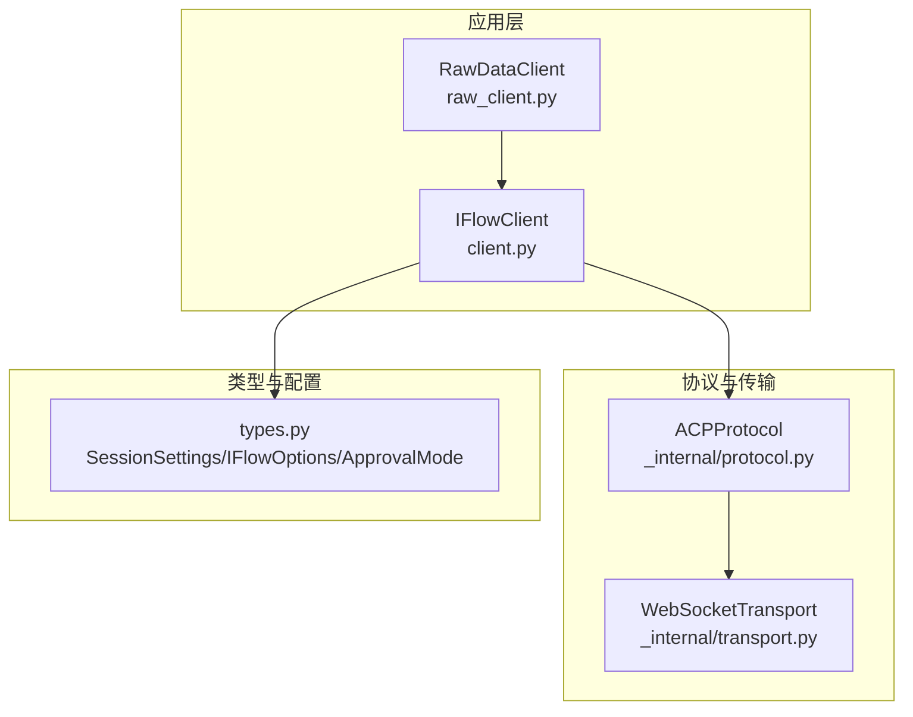
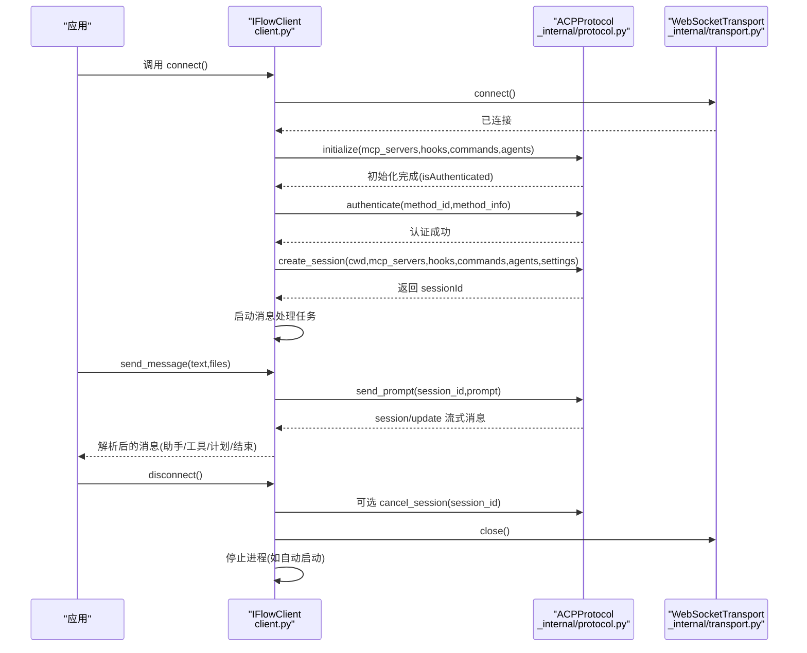
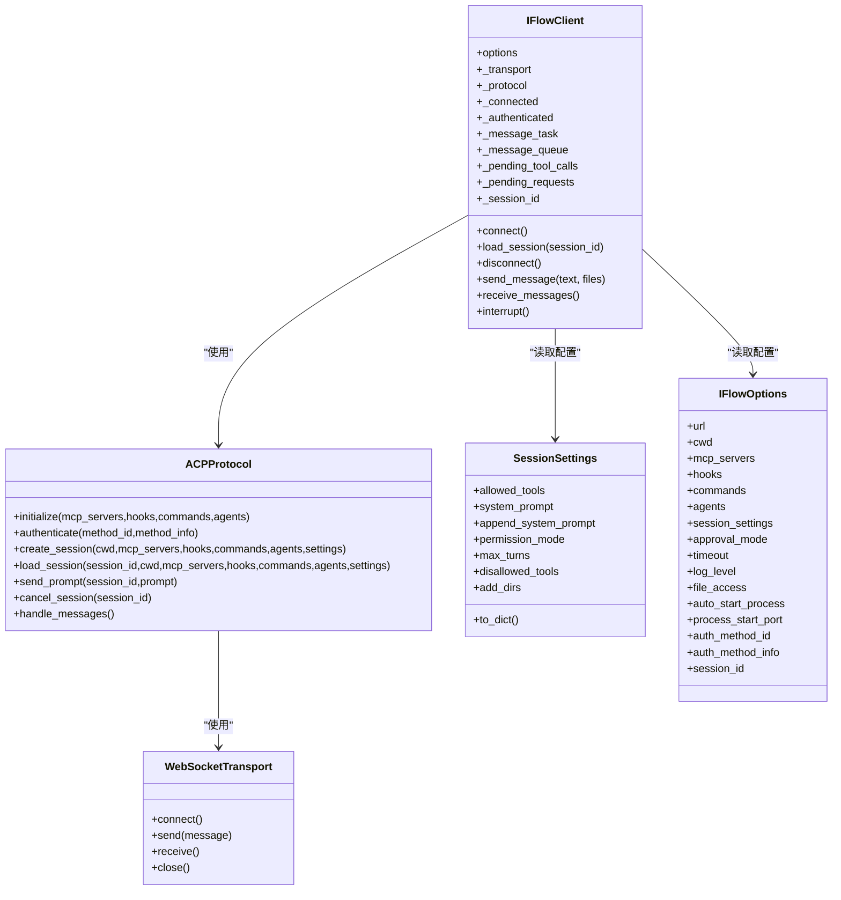
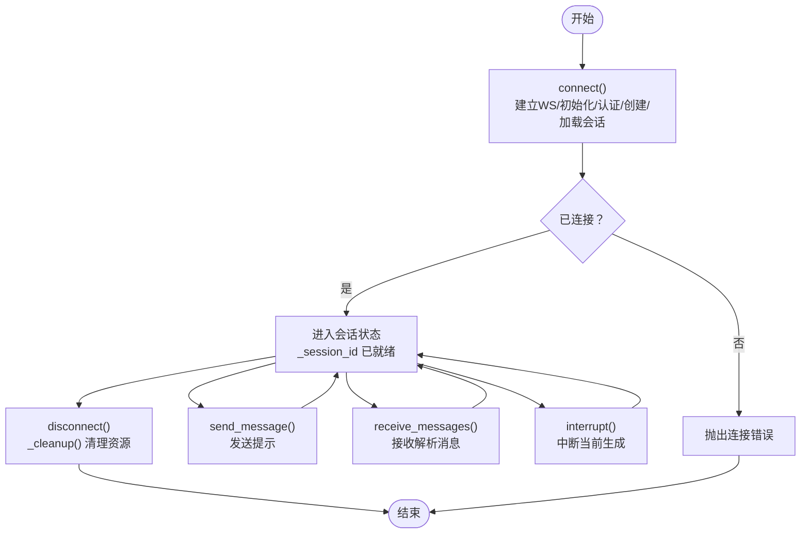

# 会话管理

<cite>
**本文引用的文件**
- [client.py](file://client.py)
- [raw_client.py](file://raw_client.py)
- [types.py](file://types.py)
- [_internal/protocol.py](file://_internal/protocol.py)
- [_internal/transport.py](file://_internal/transport.py)
- [__init__.py](file://__init__.py)
</cite>

## 目录
1. [简介](#简介)
2. [项目结构](#项目结构)
3. [核心组件](#核心组件)
4. [架构总览](#架构总览)
5. [详细组件分析](#详细组件分析)
6. [依赖关系分析](#依赖关系分析)
7. [性能与可靠性](#性能与可靠性)
8. [故障排查指南](#故障排查指南)
9. [结论](#结论)
10. [附录：会话生命周期流程图](#附录会话生命周期流程图)

## 简介
本文件系统性阐述 iflow_sdk 中的“会话管理”机制，重点围绕 IFlowClient 如何通过 create_session() 和 load_session() 管理对话上下文，解释 _session_id 在维护对话状态中的作用，以及会话设置（session_settings）如何影响 AI 代理行为。文档还覆盖会话生命周期（连接、消息交互、断开连接）的状态变化，并结合 client.py 的实现路径说明 connect() 如何创建新会话、disconnect() 如何清理资源；最后给出状态化通信的概念解释与会话恢复机制的技术细节及当前限制。

## 项目结构
- 客户端入口与高层 API：IFlowClient（位于 client.py），提供双向、有状态、可中断的对话能力。
- 协议与传输层：ACPProtocol（位于 _internal/protocol.py）负责 JSON-RPC 2.0 的 ACP 协议交互；WebSocketTransport（位于 _internal/transport.py）负责底层 WebSocket 连接与收发。
- 类型与配置：types.py 定义 ApprovalMode、SessionSettings、IFlowOptions 等类型，用于控制权限模式、会话参数与客户端选项。
- 高级调试：RawDataClient（位于 raw_client.py）扩展 IFlowClient，提供原始消息流与解析消息流的双通道输出，便于调试协议细节。

图表来源
- [client.py](file://client.py#L110-L130)
- [_internal/protocol.py](file://_internal/protocol.py#L21-L53)
- [_internal/transport.py](file://_internal/transport.py#L27-L52)
- [types.py](file://types.py#L893-L923)

章节来源
- [client.py](file://client.py#L110-L130)
- [_internal/protocol.py](file://_internal/protocol.py#L21-L53)
- [_internal/transport.py](file://_internal/transport.py#L27-L52)
- [types.py](file://types.py#L893-L923)

## 核心组件
- IFlowClient：面向用户的主客户端，封装连接、会话创建/加载、消息发送/接收、工具调用确认、中断等能力。
- ACPProtocol：实现 ACP 协议（JSON-RPC 2.0），负责 initialize/authenticate/session/new/session/load/session/prompt 等方法的请求与响应处理。
- WebSocketTransport：提供 WebSocket 连接、发送、接收与关闭能力，支持超时与错误处理。
- SessionSettings/IFlowOptions/ApprovalMode：定义会话参数、权限模式与客户端配置，影响工具调用策略与代理行为。

章节来源
- [client.py](file://client.py#L110-L130)
- [_internal/protocol.py](file://_internal/protocol.py#L21-L53)
- [_internal/transport.py](file://_internal/transport.py#L27-L52)
- [types.py](file://types.py#L893-L923)
- [types.py](file://types.py#L996-L1065)

## 架构总览
下图展示 IFlowClient 与协议/传输层的交互，以及会话创建与消息流转的关键步骤。

图表来源
- [client.py](file://client.py#L132-L318)
- [_internal/protocol.py](file://_internal/protocol.py#L64-L171)
- [_internal/protocol.py](file://_internal/protocol.py#L176-L256)
- [_internal/protocol.py](file://_internal/protocol.py#L257-L346)
- [_internal/protocol.py](file://_internal/protocol.py#L447-L478)
- [_internal/protocol.py](file://_internal/protocol.py#L479-L498)
- [_internal/transport.py](file://_internal/transport.py#L53-L84)
- [_internal/transport.py](file://_internal/transport.py#L147-L158)

## 详细组件分析

### IFlowClient 会话管理要点
- _session_id：IFlowClient 内部保存的会话标识符，贯穿一次连接内的所有消息交互。未设置或未连接时，发送消息会抛出连接异常。
- create_session()：在 connect() 中由 IFlowClient 调用 ACPProtocol.create_session() 创建新会话，返回 sessionId 并赋值给 _session_id。
- load_session()：尝试加载已有会话；当前版本中，iFlow 尚不支持 session/load 能力，因此该方法会记录警告并建议回退到创建新会话。
- connect()：负责建立 WebSocket 连接、初始化协议、认证、准备会话设置、创建/加载会话、启动消息处理任务。
- disconnect()/_cleanup()：优雅断开，取消消息处理任务、关闭传输、停止自动启动的 iFlow 进程。

章节来源
- [client.py](file://client.py#L110-L130)
- [client.py](file://client.py#L132-L318)
- [client.py](file://client.py#L323-L367)
- [client.py](file://client.py#L368-L398)

### 会话设置（session_settings）对 AI 行为的影响
- SessionSettings：允许配置 allowed_tools、system_prompt、append_system_prompt、permission_mode、max_turns、disallowed_tools、add_dirs 等。
- IFlowOptions.session_settings：IFlowClient 在 connect() 时将 IFlowOptions.session_settings 转换为字典传入 create_session()/load_session()。
- ApprovalMode：IFlowClient 会将 IFlowOptions.approval_mode 映射为 settings.permission_mode，从而影响 iFlow 对工具调用的权限决策（例如是否需要用户确认）。

章节来源
- [types.py](file://types.py#L893-L923)
- [types.py](file://types.py#L996-L1065)
- [client.py](file://client.py#L277-L310)

### 状态化通信与会话上下文
- 状态化通信意味着客户端与服务端之间维持一个“会话上下文”，后续消息可以基于该上下文进行多轮对话、工具调用、计划执行等。IFlowClient 通过 _session_id 绑定该上下文，确保 send_message()、interrupt()、工具确认等操作都作用于同一会话。
- IFlowClient 内部使用队列与后台任务处理消息，保证实时性与并发安全。

章节来源
- [client.py](file://client.py#L110-L130)
- [client.py](file://client.py#L499-L518)
- [client.py](file://client.py#L640-L657)

### 会话生命周期（连接-交互-断开）
- 连接阶段：connect() 建立 WebSocket，初始化协议，认证，准备会话设置，创建/加载会话，启动消息处理任务。
- 消息交互：send_message() 发送提示；receive_messages() 从内部队列消费解析后的消息；interrupt() 可中断当前生成。
- 断开阶段：disconnect() 调用 _cleanup()，取消消息任务、关闭传输、停止自动启动的进程。

章节来源
- [client.py](file://client.py#L132-L318)
- [client.py](file://client.py#L368-L398)
- [client.py](file://client.py#L399-L518)

### 会话恢复机制的技术细节与当前限制
- IFlowClient.load_session()：尝试加载已有会话；根据协议注释，当前 iFlow 版本尚未支持 session/load 能力，因此会记录警告并建议回退到创建新会话。
- IFlowClient.connect()：当 IFlowOptions.session_id 存在时，优先尝试 load_session()；否则直接 create_session()。
- 当前限制：由于 iFlow 不支持 session/load，SDK 无法实现真正的“会话恢复”。建议在业务侧自行持久化关键上下文信息（如历史消息摘要、工具调用结果等），以便在新会话中重建语境。

章节来源
- [client.py](file://client.py#L291-L310)
- [client.py](file://client.py#L323-L367)
- [_internal/protocol.py](file://_internal/protocol.py#L347-L446)

### RawDataClient 的原始消息访问
- RawDataClient 扩展 IFlowClient，提供 receive_raw_messages() 与 receive_dual_stream()，便于开发者观察原始协议消息与解析后消息的对应关系，辅助调试会话与工具调用流程。

章节来源
- [raw_client.py](file://raw_client.py#L108-L173)
- [raw_client.py](file://raw_client.py#L174-L229)

## 依赖关系分析
- IFlowClient 依赖 ACPProtocol 与 WebSocketTransport 实现协议与网络通信。
- ACPProtocol 依赖 WebSocketTransport 进行消息收发，并依赖 types 中的枚举与数据结构（如 ApprovalMode、SessionSettings）。
- IFlowClient 依赖 types 中的 IFlowOptions、SessionSettings、ApprovalMode 等配置项。

图表来源
- [client.py](file://client.py#L110-L130)
- [_internal/protocol.py](file://_internal/protocol.py#L21-L53)
- [_internal/transport.py](file://_internal/transport.py#L27-L52)
- [types.py](file://types.py#L893-L923)
- [types.py](file://types.py#L996-L1065)

## 性能与可靠性
- 连接重试与指数退避：IFlowClient.connect() 在建立传输连接时包含最多三次重试与指数退避，提升弱网环境下的稳定性。
- 超时与取消：ACPProtocol 在关键请求（如认证、会话创建/加载）设置了超时检测；IFlowClient 的消息处理任务可在断开时被取消。
- 异步队列与后台任务：IFlowClient 使用 asyncio.Queue 与 asyncio.Task 管理消息流，避免阻塞主线程。
- 文件系统访问：IFlowClient 可按 IFlowOptions 配置启用文件系统访问，但默认关闭以保障安全。

章节来源
- [client.py](file://client.py#L204-L221)
- [_internal/protocol.py](file://_internal/protocol.py#L176-L256)
- [_internal/protocol.py](file://_internal/protocol.py#L257-L346)
- [_internal/protocol.py](file://_internal/protocol.py#L347-L446)

## 故障排查指南
- 连接失败
  - 检查 IFlowOptions.url 是否正确，确认 iFlow 服务可达。
  - 查看 connect() 的重试日志与异常堆栈。
- 认证失败
  - 确认 IFlowOptions.auth_method_id 与 auth_method_info 配置正确。
  - 关注 authenticate() 的超时与错误响应。
- 会话创建/加载失败
  - create_session() 失败通常由未初始化或未认证导致；检查 initialize()/authenticate() 结果。
  - load_session() 当前不受支持，会收到“不支持”的错误；请改用 create_session()。
- 消息接收异常
  - receive_messages() 会在连接断开后退出；检查 _connected 状态与消息处理任务是否仍在运行。
- 资源清理
  - disconnect() 会取消消息任务、关闭传输、停止自动启动的进程；若出现资源泄漏，检查异常分支是否触发了 _cleanup()。

章节来源
- [client.py](file://client.py#L132-L318)
- [client.py](file://client.py#L323-L367)
- [client.py](file://client.py#L368-L398)
- [_internal/protocol.py](file://_internal/protocol.py#L64-L171)
- [_internal/protocol.py](file://_internal/protocol.py#L176-L256)
- [_internal/protocol.py](file://_internal/protocol.py#L257-L346)
- [_internal/protocol.py](file://_internal/protocol.py#L347-L446)

## 结论
- IFlowClient 通过 _session_id 维护会话上下文，结合 ACPProtocol 的 JSON-RPC 方法实现完整的会话生命周期管理。
- 会话设置（SessionSettings）与权限模式（ApprovalMode）直接影响工具调用策略与代理行为，应在 IFlowOptions 中合理配置。
- 当前版本中，iFlow 尚不支持 session/load 能力，SDK 的 load_session() 仅作为未来兼容预留；实际开发中应以 create_session() 为主。
- 建议在业务层对关键上下文进行持久化，以弥补当前不支持会话恢复的限制。

## 附录：会话生命周期流程图

图表来源
- [client.py](file://client.py#L132-L318)
- [client.py](file://client.py#L368-L398)
- [client.py](file://client.py#L399-L518)