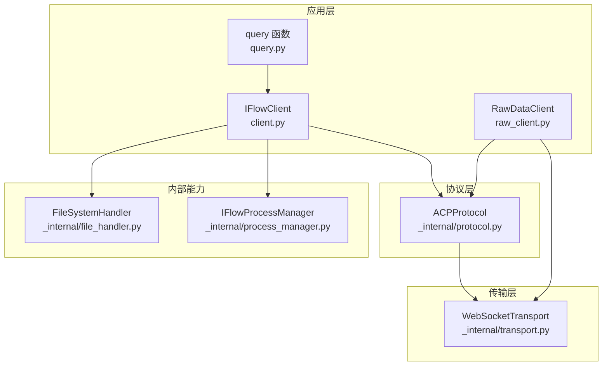
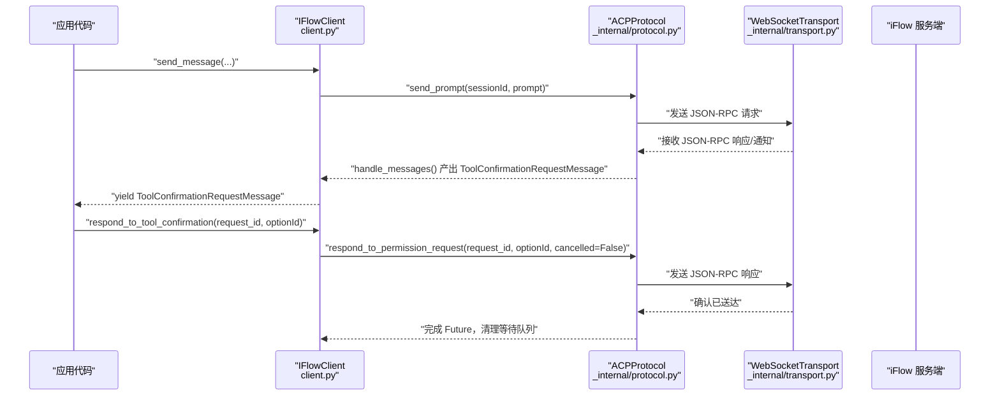
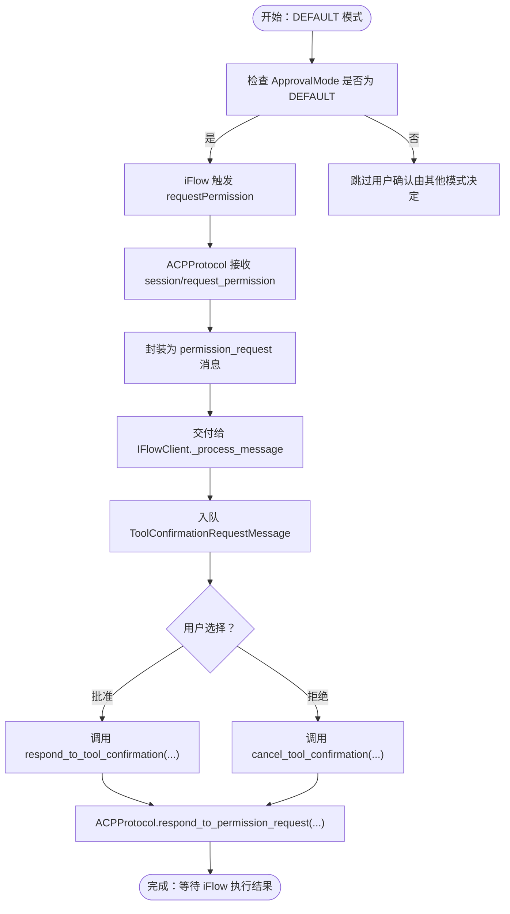
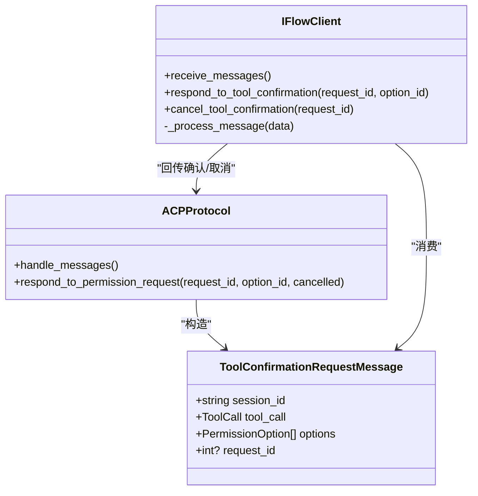
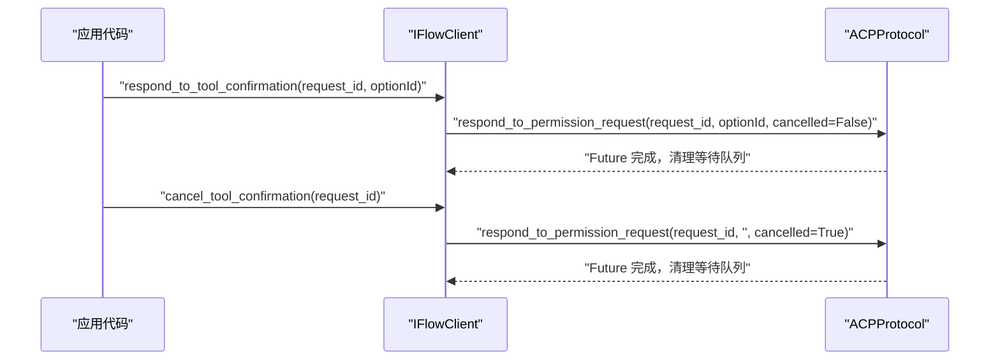
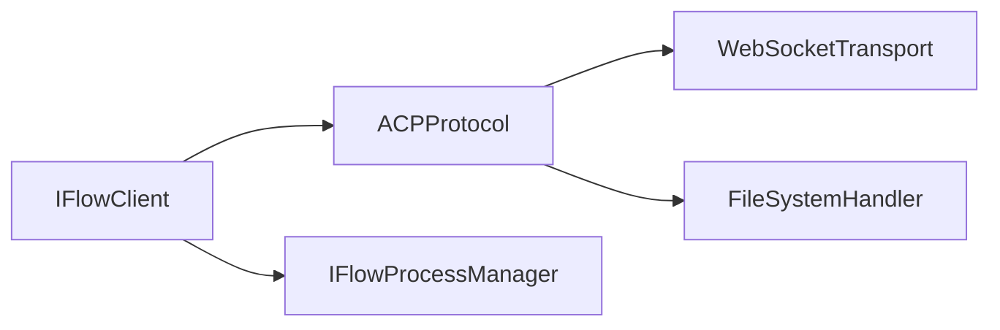

# 工具调用

<cite>
**本文引用的文件**
- [client.py](file://client.py)
- [types.py](file://types.py)
- [_internal/protocol.py](file://_internal/protocol.py)
- [_internal/transport.py](file://_internal/transport.py)
- [_internal/file_handler.py](file://_internal/file_handler.py)
- [_internal/process_manager.py](file://_internal/process_manager.py)
- [raw_client.py](file://raw_client.py)
- [query.py](file://query.py)
</cite>

## 目录
1. [简介](#简介)
2. [项目结构](#项目结构)
3. [核心组件](#核心组件)
4. [架构总览](#架构总览)
5. [详细组件分析](#详细组件分析)
6. [依赖关系分析](#依赖关系分析)
7. [性能考量](#性能考量)
8. [故障排查指南](#故障排查指南)
9. [结论](#结论)
10. [附录](#附录)

## 简介
本文件围绕 iflow_sdk 的“工具调用”机制进行深入解析，重点覆盖：
- 在 DEFAULT 和 YOLO 模式下工具使用确认的工作流程
- ToolConfirmationRequestMessage 的生成与处理路径
- IFlowClient 如何通过 respond_to_tool_confirmation() 与 cancel_tool_confirmation() 与用户交互以批准或拒绝工具调用
- _pending_tool_calls 字典在跟踪待处理工具调用中的作用（历史遗留）
- 完整生命周期：从接收请求到发送响应
- 初学者视角的安全性概念与高级用户的协议级权限请求处理细节

## 项目结构
iflow_sdk 采用分层设计：
- 应用层：IFlowClient、RawDataClient、query 辅助函数
- 协议层：ACPProtocol（实现 ACP v0.0.9，负责 JSON-RPC 通信与权限请求转发）
- 传输层：WebSocketTransport（WebSocket 连接与消息收发）
- 内部能力：FileSystemHandler（文件系统访问）、IFlowProcessManager（自动启动本地 iFlow 进程）

图表来源
- [client.py](file://client.py#L1-L120)
- [_internal/protocol.py](file://_internal/protocol.py#L21-L70)
- [_internal/transport.py](file://_internal/transport.py#L27-L77)
- [_internal/file_handler.py](file://_internal/file_handler.py#L16-L58)
- [_internal/process_manager.py](file://_internal/process_manager.py#L25-L60)

章节来源
- [client.py](file://client.py#L1-L120)
- [_internal/protocol.py](file://_internal/protocol.py#L21-L70)
- [_internal/transport.py](file://_internal/transport.py#L27-L77)
- [_internal/file_handler.py](file://_internal/file_handler.py#L16-L58)
- [_internal/process_manager.py](file://_internal/process_manager.py#L25-L60)

## 核心组件
- IFlowClient：面向用户的客户端，封装连接、会话、消息收发、工具调用确认等能力；维护 _pending_tool_calls 字典用于历史兼容。
- ACPProtocol：实现 ACP 协议，负责与 iFlow 的 JSON-RPC 通信；在收到 session/request_permission 请求时，将权限请求转发给上层，并通过 _pending_permission_requests 跟踪等待用户响应的请求。
- WebSocketTransport：低层 WebSocket 传输，负责连接、收发消息与错误处理。
- FileSystemHandler：受控的文件系统访问器，用于处理 iFlow 发起的 fs/* 方法请求。
- RawDataClient：扩展 IFlowClient，提供原始消息流与解析消息的双通道输出，便于调试协议交互。
- query：简化的一次性查询接口，适合非交互场景。

章节来源
- [client.py](file://client.py#L110-L140)
- [_internal/protocol.py](file://_internal/protocol.py#L35-L70)
- [_internal/transport.py](file://_internal/transport.py#L27-L77)
- [_internal/file_handler.py](file://_internal/file_handler.py#L16-L58)
- [raw_client.py](file://raw_client.py#L72-L110)
- [query.py](file://query.py#L15-L71)

## 架构总览
工具调用确认的端到端流程如下：
- 客户端发送提示（send_message）后，iFlow 可能触发工具调用
- 若当前 ApprovalMode 为 DEFAULT，则 iFlow 通过 ACP 的 session/request_permission 主动向 SDK 请求用户确认
- ACPProtocol 将该请求转换为 ToolConfirmationRequestMessage 并返回给 IFlowClient
- IFlowClient 将请求投递到应用层队列，等待用户决策
- 用户调用 respond_to_tool_confirmation 或 cancel_tool_confirmation
- IFlowClient 通过 ACPProtocol.respond_to_permission_request 将结果回传给 iFlow，并清理等待队列

图表来源
- [client.py](file://client.py#L529-L598)
- [_internal/protocol.py](file://_internal/protocol.py#L567-L597)
- [_internal/protocol.py](file://_internal/protocol.py#L720-L768)
- [_internal/transport.py](file://_internal/transport.py#L85-L113)

章节来源
- [client.py](file://client.py#L529-L598)
- [_internal/protocol.py](file://_internal/protocol.py#L567-L597)
- [_internal/protocol.py](file://_internal/protocol.py#L720-L768)
- [_internal/transport.py](file://_internal/transport.py#L85-L113)

## 详细组件分析

### DEFAULT 模式下的工具确认工作流
- ApprovalMode.DEFAULT：iFlow 的 CoreToolScheduler 会在需要时调用 requestPermission，SDK 通过 ACPProtocol 接收 session/request_permission 请求
- ACPProtocol 将请求包装为 permission_request 类型的消息，携带 request_id、session_id、tool_call 与 options
- IFlowClient._process_message 将其转换为 ToolConfirmationRequestMessage 并入队
- 应用层收到 ToolConfirmationRequestMessage 后，调用 IFlowClient.respond_to_tool_confirmation 或 cancel_tool_confirmation
- IFlowClient 将请求转发至 ACPProtocol.respond_to_permission_request，SDK 侧记录“已响应”，等待 iFlow 的后续更新

图表来源
- [types.py](file://types.py#L56-L73)
- [_internal/protocol.py](file://_internal/protocol.py#L567-L597)
- [_internal/protocol.py](file://_internal/protocol.py#L720-L768)
- [client.py](file://client.py#L814-L830)

章节来源
- [types.py](file://types.py#L56-L73)
- [_internal/protocol.py](file://_internal/protocol.py#L567-L597)
- [_internal/protocol.py](file://_internal/protocol.py#L720-L768)
- [client.py](file://client.py#L814-L830)

### YOLO 模式下的工具确认工作流
- ApprovalMode.YOLO：iFlow 自动执行工具调用，无需用户确认；若工具调用失败，可自动回退（具体行为由 iFlow 决定）
- SDK 不会收到 session/request_permission 请求，因此不会产生 ToolConfirmationRequestMessage
- 应用层无需处理工具确认，直接关注工具执行结果与任务结束消息

章节来源
- [types.py](file://types.py#L56-L73)
- [_internal/protocol.py](file://_internal/protocol.py#L567-L597)

### ToolConfirmationRequestMessage 的生成与处理
- 生成路径：ACPProtocol._handle_client_method 在收到 session/request_permission 时，构造 permission_request 消息并返回
- 处理路径：IFlowClient._process_message 将 permission_request 转换为 ToolConfirmationRequestMessage 并入队
- 应用层消费：通过 IFlowClient.receive_messages() 获取 ToolConfirmationRequestMessage，再调用 respond_to_tool_confirmation()/cancel_tool_confirmation()

图表来源
- [types.py](file://types.py#L590-L626)
- [_internal/protocol.py](file://_internal/protocol.py#L567-L597)
- [_internal/protocol.py](file://_internal/protocol.py#L720-L768)
- [client.py](file://client.py#L529-L598)
- [client.py](file://client.py#L814-L830)

章节来源
- [types.py](file://types.py#L590-L626)
- [_internal/protocol.py](file://_internal/protocol.py#L567-L597)
- [_internal/protocol.py](file://_internal/protocol.py#L720-L768)
- [client.py](file://client.py#L529-L598)
- [client.py](file://client.py#L814-L830)

### IFlowClient 的用户交互方法
- respond_to_tool_confirmation(request_id, option_id)：批准工具调用，option_id 可选值见 ToolCallConfirmationOutcome
- cancel_tool_confirmation(request_id)：拒绝工具调用
- approve_tool_call(tool_id, outcome) 与 reject_tool_call(tool_id)：历史遗留方法，已标注弃用

图表来源
- [client.py](file://client.py#L529-L598)
- [_internal/protocol.py](file://_internal/protocol.py#L720-L768)

章节来源
- [client.py](file://client.py#L529-L598)
- [_internal/protocol.py](file://_internal/protocol.py#L720-L768)

### _pending_tool_calls 字典的作用（历史遗留）
- IFlowClient.__init__ 中定义了 _pending_tool_calls: Dict[str, ToolCallMessage]，用于存储待处理工具调用
- approve_tool_call(tool_id) 与 reject_tool_call(tool_id) 会从该字典移除对应项
- 注意：在新协议中，工具调用确认由 ACPProtocol 的 _pending_permission_requests 跟踪，且 approve/reject 方法已标记弃用
- 建议：优先使用 respond_to_tool_confirmation()/cancel_tool_confirmation()，避免依赖历史字段

章节来源
- [client.py](file://client.py#L110-L140)
- [client.py](file://client.py#L599-L639)

### 工具调用确认的完整生命周期（从接收请求到发送响应）
- 发送提示：IFlowClient.send_message -> ACPProtocol.send_prompt
- 接收确认请求：ACPProtocol.handle_messages -> _handle_client_method(session/request_permission) -> permission_request -> IFlowClient._process_message -> ToolConfirmationRequestMessage
- 用户决策：应用层调用 respond_to_tool_confirmation 或 cancel_tool_confirmation
- 回传确认：IFlowClient -> ACPProtocol.respond_to_permission_request -> WebSocketTransport -> iFlow
- 清理等待：ACPProtocol 解析 Future，清理 _pending_permission_requests

章节来源
- [client.py](file://client.py#L399-L497)
- [_internal/protocol.py](file://_internal/protocol.py#L447-L477)
- [_internal/protocol.py](file://_internal/protocol.py#L567-L597)
- [_internal/protocol.py](file://_internal/protocol.py#L720-L768)
- [_internal/transport.py](file://_internal/transport.py#L85-L113)

### 安全性概念与协议级权限请求
- 安全性（初学者）：工具调用可能对文件系统、网络或外部进程造成影响。DEFAULT 模式强制用户确认，确保每次潜在危险操作都经过明确授权；YOLO 模式自动执行，风险更高，需谨慎配置
- 协议级权限（高级）：iFlow 的 CoreToolScheduler 基于 ApprovalMode 决定是否请求权限；SDK 仅作为代理，将权限请求转发给上层并回传用户选择。FileSystemHandler 提供受控文件访问，防止越权写入
- 权限选项：ToolCallConfirmationOutcome 定义了“一次性允许”、“永久允许（工具/服务器）”、“拒绝”等选项，对应 iFlow 的 permission optionId

章节来源
- [types.py](file://types.py#L31-L54)
- [types.py](file://types.py#L56-L73)
- [_internal/file_handler.py](file://_internal/file_handler.py#L16-L58)

## 依赖关系分析
- IFlowClient 依赖 ACPProtocol 与 WebSocketTransport 实现会话与消息流转
- ACPProtocol 依赖 WebSocketTransport 进行 JSON-RPC 通信，并通过 _pending_permission_requests 维护权限请求等待状态
- FileSystemHandler 作为可选能力被 ACPProtocol 注入，用于处理 fs/* 请求
- IFlowProcessManager 用于自动启动本地 iFlow 进程，便于开发测试

图表来源
- [client.py](file://client.py#L110-L140)
- [_internal/protocol.py](file://_internal/protocol.py#L35-L70)
- [_internal/transport.py](file://_internal/transport.py#L27-L77)
- [_internal/file_handler.py](file://_internal/file_handler.py#L16-L58)
- [_internal/process_manager.py](file://_internal/process_manager.py#L25-L60)

章节来源
- [client.py](file://client.py#L110-L140)
- [_internal/protocol.py](file://_internal/protocol.py#L35-L70)
- [_internal/transport.py](file://_internal/transport.py#L27-L77)
- [_internal/file_handler.py](file://_internal/file_handler.py#L16-L58)
- [_internal/process_manager.py](file://_internal/process_manager.py#L25-L60)

## 性能考量
- 异步消息循环：IFlowClient 使用 asyncio.Queue 与后台任务处理消息，避免阻塞
- 重试与指数退避：连接阶段对 WebSocket 连接失败进行有限重试与延迟增长
- 文件大小限制：FileSystemHandler 默认最大读取 10MB，防止大文件导致内存压力
- 传输层缓冲：WebSocketTransport 设置合理超时与消息大小上限，避免异常流量

章节来源
- [client.py](file://client.py#L132-L221)
- [_internal/transport.py](file://_internal/transport.py#L60-L84)
- [_internal/transport.py](file://_internal/transport.py#L114-L146)
- [_internal/file_handler.py](file://_internal/file_handler.py#L30-L42)

## 故障排查指南
- 连接失败：检查 URL、端口占用与本地 iFlow 进程；必要时启用 IFlowProcessManager 自动启动
- 认证失败：确认 initialize 返回的 isAuthenticated 与 authenticate 流程；核对 methodId 与 methodInfo
- 权限请求未到达：确认 ApprovalMode 设置为 DEFAULT；检查 ACPProtocol._pending_permission_requests 是否正确创建与清理
- 文件访问被拒：检查 FileSystemHandler 的 allowed_dirs、read_only 与文件大小限制
- RawDataClient 调试：使用 receive_raw_messages 或 receive_dual_stream 对比原始与解析消息，定位协议问题

章节来源
- [_internal/transport.py](file://_internal/transport.py#L60-L84)
- [_internal/protocol.py](file://_internal/protocol.py#L176-L256)
- [_internal/protocol.py](file://_internal/protocol.py#L567-L597)
- [_internal/file_handler.py](file://_internal/file_handler.py#L16-L58)
- [raw_client.py](file://raw_client.py#L174-L237)

## 结论
- DEFAULT 模式通过 ACP 的权限请求机制实现“每次工具调用均需用户确认”的安全策略
- IFlowClient 提供简洁的 respond_to_tool_confirmation()/cancel_tool_confirmation() 接口，屏蔽底层协议细节
- YOLO 模式强调自动化与回退策略，适合受控环境；需严格评估风险
- _pending_tool_calls 属于历史兼容字段，建议使用新的确认 API
- 通过 RawDataClient 可深入观察协议交互，辅助诊断复杂问题

## 附录
- 示例用法参考：IFlowClient 文档字符串中的 DEFAULT 模式示例
- 查询接口：query/query_stream 适合一次性、非交互式场景

章节来源
- [client.py](file://client.py#L83-L108)
- [query.py](file://query.py#L15-L71)