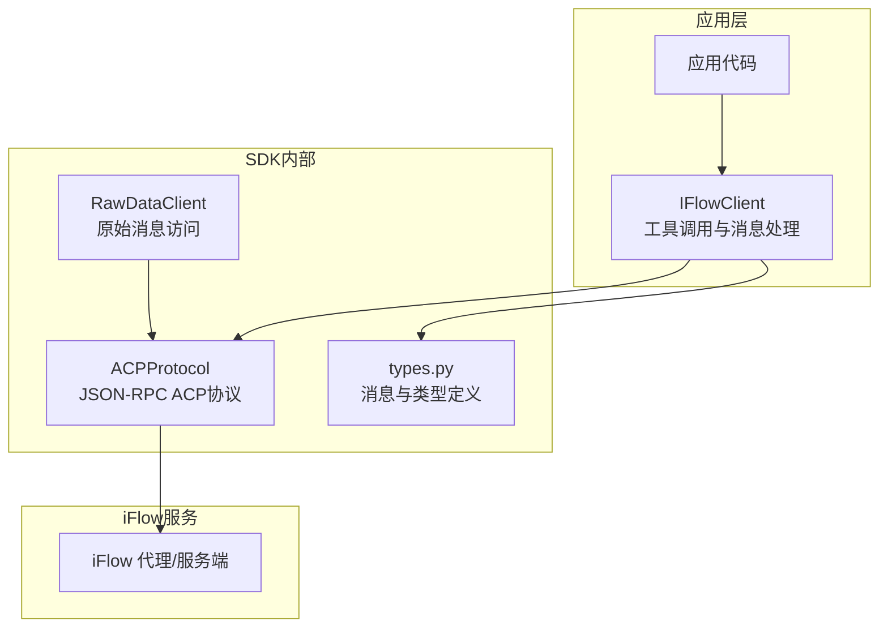
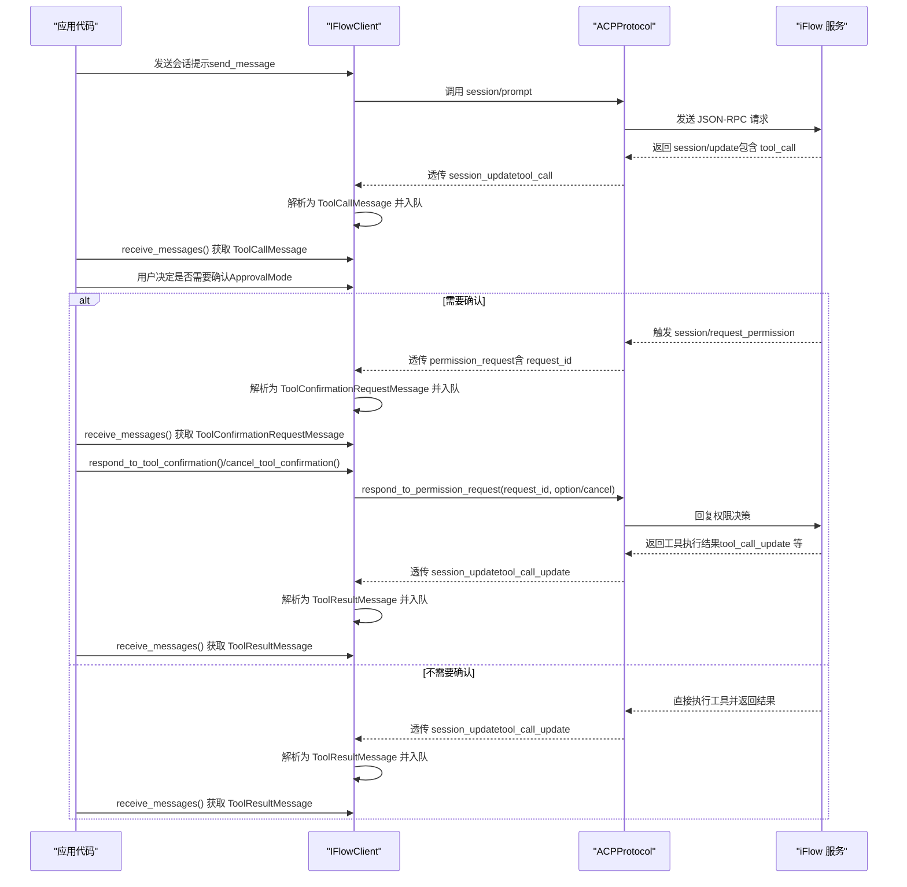
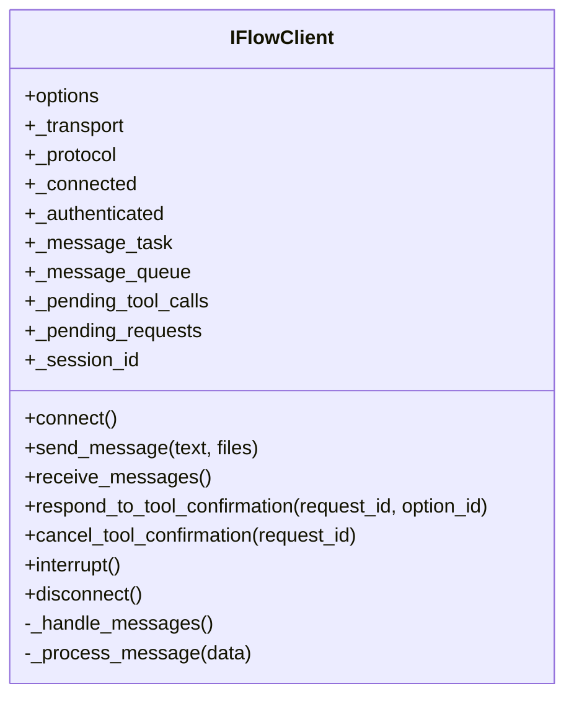
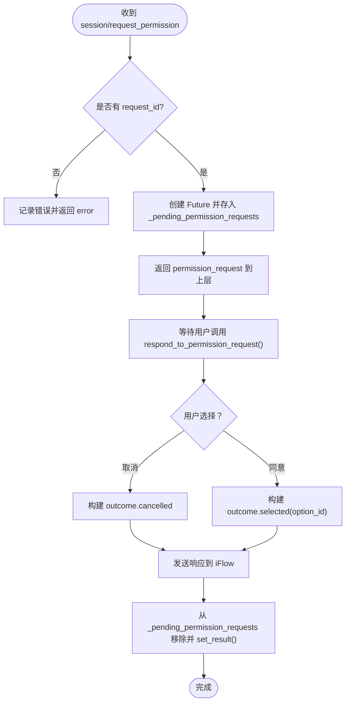
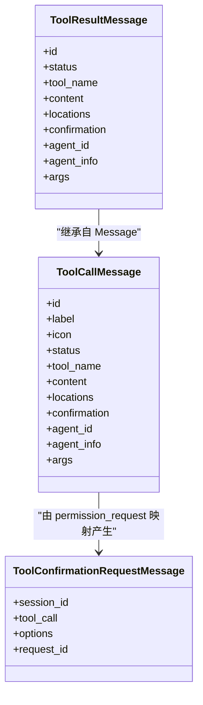
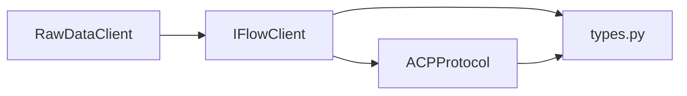

# 工具调用生命周期

<cite>
**本文引用的文件**
- [client.py](file://client.py)
- [types.py](file://types.py)
- [_internal/protocol.py](file://_internal/protocol.py)
- [raw_client.py](file://raw_client.py)
</cite>

## 目录
1. [引言](#引言)
2. [项目结构](#项目结构)
3. [核心组件](#核心组件)
4. [架构总览](#架构总览)
5. [详细组件分析](#详细组件分析)
6. [依赖关系分析](#依赖关系分析)
7. [性能考量](#性能考量)
8. [故障排查指南](#故障排查指南)
9. [结论](#结论)
10. [附录](#附录)

## 引言
本文件围绕 iflow_sdk 中“工具调用”的完整生命周期进行深入解析，覆盖从 iFlow 代理在会话中发起工具调用，到 ACP 协议生成 permission_request，再到 IFlowClient 将请求暴露给应用层的全过程。重点解释 _pending_tool_calls 字典的作用及其对状态一致性的保障；阐述用户批准后，响应如何通过 respond_to_permission_request() 方法发送回 iFlow 服务，并进一步触发工具执行与结果返回。结合 types.py 中的 ToolCallMessage 与 ToolConfirmationRequestMessage，说明各阶段消息类型转换与数据流。最后给出面向开发者的监控与调试策略。

## 项目结构
- 客户端入口：IFlowClient（负责连接、会话管理、消息收发、工具确认）
- 协议层：ACPProtocol（负责与 iFlow 的 ACP 协议交互，包括初始化、认证、会话创建、消息分发、权限请求处理等）
- 类型定义：types.py（定义消息、工具调用、权限选项、状态枚举等）
- 原始数据客户端：RawDataClient（提供原始协议消息访问能力，便于调试）

图表来源
- [client.py](file://client.py#L110-L130)
- [_internal/protocol.py](file://_internal/protocol.py#L21-L53)
- [types.py](file://types.py#L1-L60)
- [raw_client.py](file://raw_client.py#L72-L120)

章节来源
- [client.py](file://client.py#L110-L130)
- [_internal/protocol.py](file://_internal/protocol.py#L21-L53)
- [types.py](file://types.py#L1-L60)
- [raw_client.py](file://raw_client.py#L72-L120)

## 核心组件
- IFlowClient：负责连接、会话创建、消息发送与接收、工具调用确认、错误处理与资源清理。
- ACPProtocol：实现 ACP 协议（JSON-RPC）与 iFlow 通信，处理初始化、认证、会话、权限请求、文件系统请求等。
- types.py：定义消息类型（如 ToolCallMessage、ToolResultMessage、ToolConfirmationRequestMessage）、权限选项、工具调用状态等。
- RawDataClient：扩展 IFlowClient，提供原始消息流与统计信息，便于调试。

章节来源
- [client.py](file://client.py#L110-L130)
- [_internal/protocol.py](file://_internal/protocol.py#L21-L53)
- [types.py](file://types.py#L455-L626)
- [raw_client.py](file://raw_client.py#L72-L120)

## 架构总览
下图展示工具调用生命周期的关键步骤与组件交互：

图表来源
- [client.py](file://client.py#L399-L518)
- [_internal/protocol.py](file://_internal/protocol.py#L547-L600)
- [_internal/protocol.py](file://_internal/protocol.py#L720-L768)
- [types.py](file://types.py#L510-L587)
- [types.py](file://types.py#L590-L626)

## 详细组件分析

### IFlowClient：工具调用生命周期的协调者
- 连接与会话管理：connect() 初始化传输与协议，创建或加载会话，启动消息处理任务。
- 消息收发：send_message() 将用户提示发送至会话；receive_messages() 提供异步迭代器，按顺序产出解析后的消息对象。
- 工具确认接口：
  - respond_to_tool_confirmation()：向协议层提交用户选择（proceed_once/proceed_always/cancel 等）。
  - cancel_tool_confirmation()：拒绝工具调用。
- 内部状态：
  - _pending_tool_calls：用于兼容旧版 API 的遗留字段（已标记为弃用），当前主要通过协议层的 _pending_permission_requests 维护权限请求状态。
  - _pending_requests：用于维护 SDK 主动发起的请求等待结果。
  - _message_queue：解析后的消息队列，供 receive_messages() 消费。

图表来源
- [client.py](file://client.py#L110-L130)
- [client.py](file://client.py#L399-L518)
- [client.py](file://client.py#L529-L598)
- [client.py](file://client.py#L640-L657)
- [client.py](file://client.py#L658-L840)

章节来源
- [client.py](file://client.py#L110-L130)
- [client.py](file://client.py#L399-L518)
- [client.py](file://client.py#L529-L598)
- [client.py](file://client.py#L640-L657)
- [client.py](file://client.py#L658-L840)

### ACPProtocol：权限请求与工具调用的桥接
- 权限请求处理：
  - session/request_permission：当 iFlow 的 CoreToolScheduler 基于 ApprovalMode 决定请求权限时，ACPProtocol 将该请求转为 SDK 可消费的 permission_request，并记录 request_id 对应的 Future，等待用户决策。
  - respond_to_permission_request()：根据用户选择（option_id 或 cancelled）构造响应并发送回 iFlow，同时解除 Future，保证消息处理流程可继续。
- 工具调用更新：
  - session/update：包含 tool_call/tool_call_update 等，ACPProtocol 将其映射为 SDK 内部消息类型，由上层解析为 ToolCallMessage/ToolResultMessage。
- 其他职责：initialize/authenticate/session/new/session/cancel 等 JSON-RPC 方法封装。

图表来源
- [_internal/protocol.py](file://_internal/protocol.py#L567-L596)
- [_internal/protocol.py](file://_internal/protocol.py#L720-L768)

章节来源
- [_internal/protocol.py](file://_internal/protocol.py#L547-L600)
- [_internal/protocol.py](file://_internal/protocol.py#L720-L768)

### 类型系统：ToolCallMessage 与 ToolConfirmationRequestMessage
- ToolCallMessage：表示工具调用开始或更新，包含 id、label、icon、status、tool_name、agent_id/agent_info、args 等字段，用于在会话更新中反映工具调用状态与参数。
- ToolResultMessage：表示工具调用结果或中间状态更新，包含 status、content（markdown/diff）、locations、agent_id/agent_info 等。
- ToolConfirmationRequestMessage：当工具调用需要用户确认时，SDK 将 ACP 层的 permission_request 转换为该消息，携带 session_id、tool_call、options、request_id 等，供应用层处理。

图表来源
- [types.py](file://types.py#L510-L587)
- [types.py](file://types.py#L590-L626)

章节来源
- [types.py](file://types.py#L510-L587)
- [types.py](file://types.py#L590-L626)

### _pending_tool_calls 的作用与状态一致性
- 当前实现中，_pending_tool_calls 主要用于兼容旧版 API（approve_tool_call/reject_tool_call）。这些方法在 IFlowClient 中被标记为弃用，实际的工具调用确认流程由协议层的 _pending_permission_requests 管理。
- 保持状态一致性的方式：
  - 协议层在收到权限请求时，以 request_id 为键存储 Future，确保每条权限请求都能被唯一追踪与响应。
  - IFlowClient 在解析 permission_request 时，将其转换为 ToolConfirmationRequestMessage 并入队，应用层在收到后调用 respond_to_tool_confirmation()/cancel_tool_confirmation()，最终通过 ACPProtocol 的 respond_to_permission_request() 完成闭环。
  - 工具调用更新（tool_call/tool_call_update）通过 session_update 传递，SDK 解析为 ToolCallMessage/ToolResultMessage，维持工具调用的状态流转。

章节来源
- [client.py](file://client.py#L122-L128)
- [client.py](file://client.py#L599-L639)
- [_internal/protocol.py](file://_internal/protocol.py#L567-L596)
- [_internal/protocol.py](file://_internal/protocol.py#L720-L768)
- [client.py](file://client.py#L697-L756)

### 用户批准后的响应链路
- 应用层收到 ToolConfirmationRequestMessage 后，调用 respond_to_tool_confirmation()/cancel_tool_confirmation()。
- IFlowClient 将调用转发至 ACPProtocol.respond_to_permission_request()，构造响应并发送回 iFlow。
- iFlow 执行工具调用，随后通过 session/update 返回工具执行结果（tool_call_update），SDK 解析为 ToolResultMessage 并入队，应用层继续消费。

章节来源
- [client.py](file://client.py#L529-L598)
- [_internal/protocol.py](file://_internal/protocol.py#L720-L768)
- [client.py](file://client.py#L697-L756)

### RawDataClient：原始消息与调试
- RawDataClient 在 IFlowClient 基础上提供：
  - receive_raw_messages()：直接输出原始 WebSocket 文本或 JSON。
  - receive_dual_stream()：将原始消息与解析后的消息进行相关联输出，便于对照分析。
  - get_raw_history()/get_protocol_stats()：统计消息类型、控制消息、错误数量等。
- 适合在复杂问题定位时启用，观察权限请求与工具调用的完整协议往返。

章节来源
- [raw_client.py](file://raw_client.py#L120-L237)
- [raw_client.py](file://raw_client.py#L238-L362)

## 依赖关系分析
- IFlowClient 依赖 ACPProtocol 进行协议交互，依赖 types.py 的消息与配置类型。
- ACPProtocol 依赖 WebSocketTransport（未在本文件中展开）与 FileSystemHandler（未在本文件中展开）。
- RawDataClient 继承 IFlowClient，扩展了原始消息访问能力。

图表来源
- [client.py](file://client.py#L110-L130)
- [_internal/protocol.py](file://_internal/protocol.py#L21-L53)
- [types.py](file://types.py#L1-L60)
- [raw_client.py](file://raw_client.py#L72-L120)

章节来源
- [client.py](file://client.py#L110-L130)
- [_internal/protocol.py](file://_internal/protocol.py#L21-L53)
- [types.py](file://types.py#L1-L60)
- [raw_client.py](file://raw_client.py#L72-L120)

## 性能考量
- 异步消息处理：IFlowClient 使用 asyncio.Queue 和异步任务处理消息，避免阻塞主线程。
- 超时与重试：连接阶段具备指数退避重试机制，降低网络抖动影响。
- 日志粒度：协议层与客户端均包含日志记录，便于定位性能瓶颈与异常路径。
- 文件系统访问：仅在启用 file_access 时创建 FileSystemHandler，避免不必要的开销。

章节来源
- [client.py](file://client.py#L150-L221)
- [client.py](file://client.py#L640-L657)
- [_internal/protocol.py](file://_internal/protocol.py#L1-L20)

## 故障排查指南
- 权限请求未返回：检查 ACPProtocol 是否正确记录 _pending_permission_requests，确认应用层是否调用了 respond_to_tool_confirmation()/cancel_tool_confirmation()。
- 工具调用无结果：确认 session/update 中是否存在 tool_call_update，若缺失，可能是 iFlow 未执行工具或网络中断。
- 消息乱序或丢失：使用 RawDataClient 的 receive_dual_stream() 对比原始消息与解析消息，定位协议层或传输层问题。
- 认证失败：查看 initialize/authenticate 的错误码与消息，核对鉴权参数与超时设置。
- 资源清理：断开连接时确保 _cleanup() 被调用，释放传输与进程管理器。

章节来源
- [_internal/protocol.py](file://_internal/protocol.py#L567-L596)
- [_internal/protocol.py](file://_internal/protocol.py#L720-L768)
- [client.py](file://client.py#L368-L398)
- [raw_client.py](file://raw_client.py#L174-L237)

## 结论
iflow_sdk 通过 IFlowClient 与 ACPProtocol 的协作，实现了从 iFlow 代理发起工具调用到应用层确认与执行的完整生命周期。协议层以 request_id 为核心，确保每一条权限请求均可被唯一追踪与响应；SDK 层则通过 ToolCallMessage/ToolResultMessage/ToolConfirmationRequestMessage 等类型，清晰地表达工具调用的状态与数据流。_pending_tool_calls 字段虽已标记为弃用，但协议层的 _pending_permission_requests 有效保障了状态一致性。配合 RawDataClient 的原始消息访问能力，开发者可以高效地监控与调试工具调用生命周期。

## 附录
- 关键 API 路径参考：
  - IFlowClient.connect()：[client.py](file://client.py#L132-L318)
  - IFlowClient.send_message()：[client.py](file://client.py#L399-L497)
  - IFlowClient.receive_messages()：[client.py](file://client.py#L510-L528)
  - IFlowClient.respond_to_tool_confirmation()：[client.py](file://client.py#L529-L567)
  - IFlowClient.cancel_tool_confirmation()：[client.py](file://client.py#L568-L598)
  - ACPProtocol.handle_messages()：[_internal/protocol.py](file://_internal/protocol.py#L499-L533)
  - ACPProtocol._handle_client_method()（权限请求与工具调用）：[_internal/protocol.py](file://_internal/protocol.py#L547-L600)
  - ACPProtocol.respond_to_permission_request()：[_internal/protocol.py](file://_internal/protocol.py#L720-L768)
  - ToolCallMessage/ToolResultMessage/ToolConfirmationRequestMessage：[types.py](file://types.py#L510-L626)
  - RawDataClient 原始消息访问：[raw_client.py](file://raw_client.py#L120-L237)