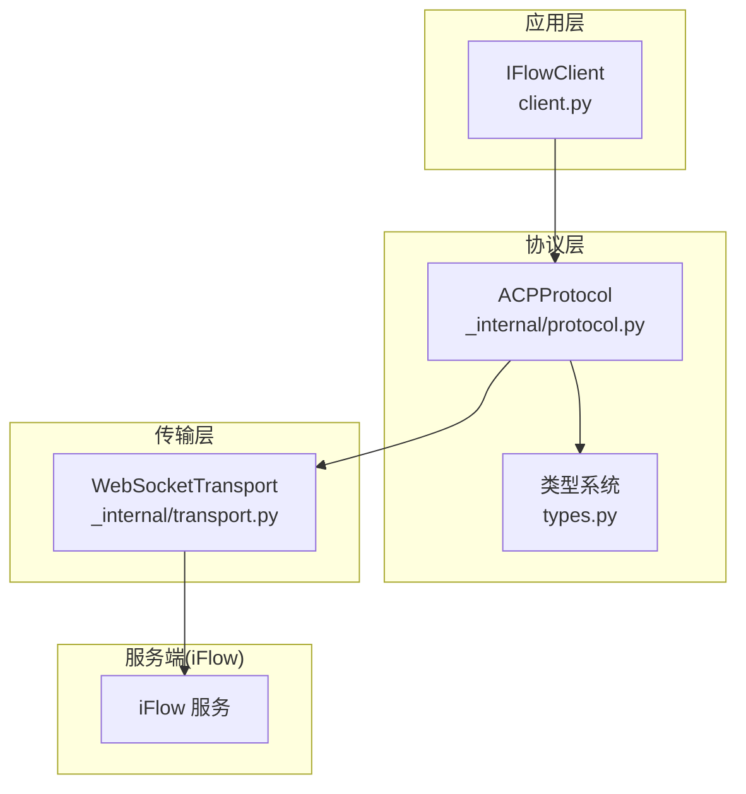
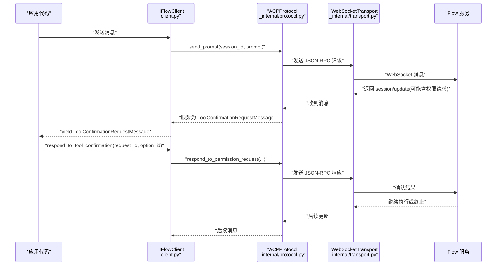
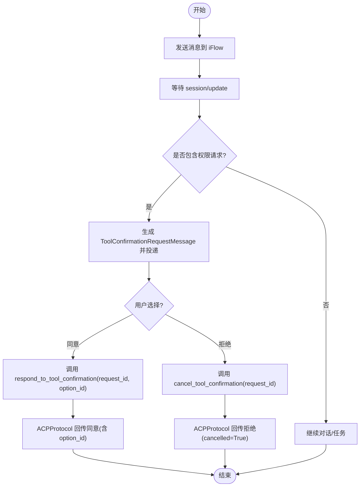
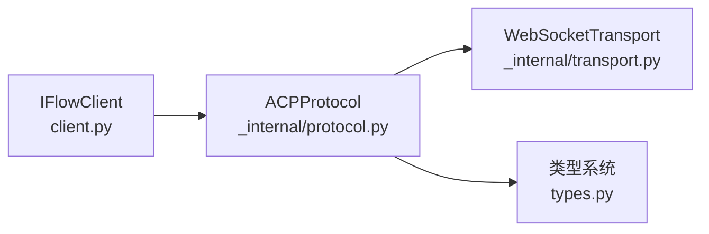

# 用户交互流程

<cite>
**本文引用的文件**
- [client.py](file://client.py)
- [_internal/protocol.py](file://_internal/protocol.py)
- [types.py](file://types.py)
- [_internal/transport.py](file://_internal/transport.py)
- [raw_client.py](file://raw_client.py)
</cite>

## 目录
1. [简介](#简介)
2. [项目结构](#项目结构)
3. [核心组件](#核心组件)
4. [架构总览](#架构总览)
5. [详细组件分析](#详细组件分析)
6. [依赖关系分析](#依赖关系分析)
7. [性能考量](#性能考量)
8. [故障排查指南](#故障排查指南)
9. [结论](#结论)

## 简介
本节聚焦于 iflow_sdk 中“工具调用确认”的用户交互流程，围绕 IFlowClient 如何接收 ToolConfirmationRequestMessage、开发者如何通过 respond_to_tool_confirmation() 和 cancel_tool_confirmation() 做出响应，以及 ACP 协议中的 request_id 在客户端与 iFlow 服务之间的关联机制展开说明。同时提供完整交互循环示例、异步处理的最佳实践与常见陷阱。

## 项目结构
- 客户端入口与高层 API：client.py
- 协议实现（ACP v0.0.9）：_internal/protocol.py
- 类型定义与消息模型：types.py
- 传输层（WebSocket）：_internal/transport.py
- 高级调试与原始数据访问：raw_client.py

图表来源
- [client.py](file://client.py#L1-L120)
- [_internal/protocol.py](file://_internal/protocol.py#L1-L120)
- [_internal/transport.py](file://_internal/transport.py#L1-L80)
- [types.py](file://types.py#L1-L120)

章节来源
- [client.py](file://client.py#L1-L120)
- [_internal/protocol.py](file://_internal/protocol.py#L1-L120)
- [_internal/transport.py](file://_internal/transport.py#L1-L80)
- [types.py](file://types.py#L1-L120)

## 核心组件
- IFlowClient：对外暴露连接、发送消息、接收消息、工具确认等能力；内部维护会话、队列、待处理请求等状态。
- ACPProtocol：实现 ACP 协议，负责 JSON-RPC 消息编解码、权限请求转发、响应跟踪等。
- WebSocketTransport：底层 WebSocket 通信，负责连接、收发、错误处理。
- 类型系统：包含 ToolCall、PermissionOption、ToolConfirmationRequestMessage 等消息类型，用于在 SDK 内部进行强类型建模。

章节来源
- [client.py](file://client.py#L110-L180)
- [_internal/protocol.py](file://_internal/protocol.py#L21-L70)
- [_internal/transport.py](file://_internal/transport.py#L27-L80)
- [types.py](file://types.py#L225-L326)

## 架构总览
下图展示了从 IFlowClient 发送消息到 iFlow，再到权限请求下发、用户决策、最终回传确认的完整链路。

图表来源
- [client.py](file://client.py#L399-L597)
- [_internal/protocol.py](file://_internal/protocol.py#L447-L533)
- [_internal/protocol.py](file://_internal/protocol.py#L567-L596)
- [_internal/protocol.py](file://_internal/protocol.py#L720-L768)
- [_internal/transport.py](file://_internal/transport.py#L114-L145)

## 详细组件分析

### 工具调用确认交互流程
- 触发条件：当 iFlow 的 CoreToolScheduler 判定需要用户确认时，会通过 ACP 的 session/request_permission 方法发起权限请求。
- 请求映射：ACPProtocol 将该方法转换为 SDK 内部的 permission_request，并记录 request_id，等待上层用户决策。
- 上层决策：IFlowClient 将 permission_request 映射为 ToolConfirmationRequestMessage 并投递到消息队列；应用侧读取后调用 respond_to_tool_confirmation() 或 cancel_tool_confirmation()。
- 确认回传：IFlowClient 调用 ACPProtocol 的 respond_to_permission_request()，携带 request_id 与选项，发送给 iFlow；随后清理待处理状态。

图表来源
- [client.py](file://client.py#L529-L597)
- [client.py](file://client.py#L814-L830)
- [_internal/protocol.py](file://_internal/protocol.py#L567-L596)
- [_internal/protocol.py](file://_internal/protocol.py#L720-L768)

章节来源
- [client.py](file://client.py#L529-L597)
- [client.py](file://client.py#L814-L830)
- [_internal/protocol.py](file://_internal/protocol.py#L567-L596)
- [_internal/protocol.py](file://_internal/protocol.py#L720-L768)

### request_id 在 ACP 协议中的作用
- request_id 由 ACPProtocol 维护，用于区分一次权限请求与其对应的响应。ACPProtocol 在收到 session/request_permission 时，若存在 request_id，则将其存入 _pending_permission_requests，并在上层调用 respond_to_permission_request() 时取出并发送对应响应。
- IFlowClient 通过 receive_messages() 将 permission_request 转换为 ToolConfirmationRequestMessage，并将 request_id 一并传递给应用侧，确保应用侧能正确回传确认。

章节来源
- [_internal/protocol.py](file://_internal/protocol.py#L48-L63)
- [_internal/protocol.py](file://_internal/protocol.py#L567-L596)
- [_internal/protocol.py](file://_internal/protocol.py#L720-L768)
- [client.py](file://client.py#L814-L830)

### IFlowClient 的工具确认 API
- respond_to_tool_confirmation(request_id, option_id)：用于批准工具调用，option_id 可选枚举值见 ToolCallConfirmationOutcome。
- cancel_tool_confirmation(request_id)：用于拒绝工具调用。
- 内部均委托给 ACPProtocol 的 respond_to_permission_request() 完成实际回传。

章节来源
- [client.py](file://client.py#L529-L597)
- [types.py](file://types.py#L31-L54)

### 类型模型与消息映射
- ToolCall：封装工具调用元信息（名称、种类、位置、内容等）。
- PermissionOption：封装用户可选的确认选项（如一次性允许、总是允许、拒绝等）。
- ToolConfirmationRequestMessage：SDK 内部对权限请求的高层表示，包含 session_id、tool_call、options、request_id。

章节来源
- [types.py](file://types.py#L225-L326)
- [types.py](file://types.py#L590-L626)
- [client.py](file://client.py#L814-L830)

### 异步处理中的常见陷阱与最佳实践
- 超时与取消
  - 传输层对连接与收发设置了超时与异常处理，避免阻塞。
  - 若用户长时间未决策，建议在应用侧设置超时逻辑，防止资源泄漏。
- 错误恢复
  - 协议层对未知请求 ID 抛出 ProtocolError，应用侧需捕获并进行重试或降级。
  - 传输层断开时，客户端应具备重连与重试策略。
- 并发与队列
  - IFlowClient 使用 asyncio.Queue 存储消息，receive_messages() 采用轮询+超时避免阻塞。
  - 处理权限请求时，应确保 request_id 与响应一一对应，避免错配。
- 日志与可观测性
  - 建议在关键路径增加日志，便于定位 request_id 不匹配、响应丢失等问题。

章节来源
- [_internal/transport.py](file://_internal/transport.py#L78-L113)
- [_internal/protocol.py](file://_internal/protocol.py#L769-L786)
- [client.py](file://client.py#L510-L528)

## 依赖关系分析
- IFlowClient 依赖 ACPProtocol 进行协议编解码与权限请求处理。
- ACPProtocol 依赖 WebSocketTransport 进行网络收发。
- 类型系统贯穿于协议与客户端之间，保证消息结构一致。

图表来源
- [client.py](file://client.py#L1-L40)
- [_internal/protocol.py](file://_internal/protocol.py#L1-L40)
- [_internal/transport.py](file://_internal/transport.py#L1-L40)
- [types.py](file://types.py#L1-L40)

章节来源
- [client.py](file://client.py#L1-L40)
- [_internal/protocol.py](file://_internal/protocol.py#L1-L40)
- [_internal/transport.py](file://_internal/transport.py#L1-L40)
- [types.py](file://types.py#L1-L40)

## 性能考量
- 流式接收：IFlowClient 的 receive_messages() 使用短超时轮询，适合低延迟场景；在高并发或多会话场景中，建议合理设置队列容量与消费节奏。
- 序列化成本：WebSocketTransport 对字典消息进行 JSON 序列化，注意避免过大的单次消息体。
- 超时与重试：协议层与传输层均内置超时与重试机制，应用侧可根据业务需求调整 IFlowOptions 的超时参数。

## 故障排查指南
- “未知权限请求 ID”
  - 现象：调用 respond_to_tool_confirmation()/cancel_tool_confirmation() 抛出 ProtocolError。
  - 排查：确认 request_id 是否来自最近一次 ToolConfirmationRequestMessage；检查是否重复使用或被清理。
  - 参考
    - [_internal/protocol.py](file://_internal/protocol.py#L739-L740)
- “连接失败/超时”
  - 现象：connect() 或 send() 抛出 ConnectionError/TimeoutError。
  - 排查：检查 URL、防火墙、网络连通性；查看传输层日志；必要时启用 RawDataClient 获取原始消息进行诊断。
  - 参考
    - [_internal/transport.py](file://_internal/transport.py#L78-L113)
    - [raw_client.py](file://raw_client.py#L144-L163)
- “无权限请求 ID”
  - 现象：收到权限请求但缺少 request_id，无法跟踪响应。
  - 排查：确认 iFlow 版本与协议一致性；检查 ACPProtocol 的权限请求处理分支。
  - 参考
    - [_internal/protocol.py](file://_internal/protocol.py#L593-L596)
- “消息解析失败”
  - 现象：收到非 JSON 文本或格式错误。
  - 排查：使用 RawDataClient 的 receive_raw_messages() 或 receive_dual_stream() 获取原始消息，定位问题。
  - 参考
    - [raw_client.py](file://raw_client.py#L174-L203)
    - [_internal/transport.py](file://_internal/transport.py#L114-L145)

章节来源
- [_internal/protocol.py](file://_internal/protocol.py#L739-L740)
- [_internal/transport.py](file://_internal/transport.py#L78-L113)
- [raw_client.py](file://raw_client.py#L144-L203)
- [_internal/protocol.py](file://_internal/protocol.py#L593-L596)

## 结论
- IFlowClient 通过 ToolConfirmationRequestMessage 与 respond_to_tool_confirmation()/cancel_tool_confirmation() 提供了清晰的工具调用确认接口。
- ACPProtocol 以 request_id 为核心纽带，将 iFlow 的权限请求与 SDK 的用户决策绑定，确保请求-响应的可追踪性。
- 在异步环境中，建议结合超时控制、错误恢复与可观测性手段，构建稳健的用户交互流程。