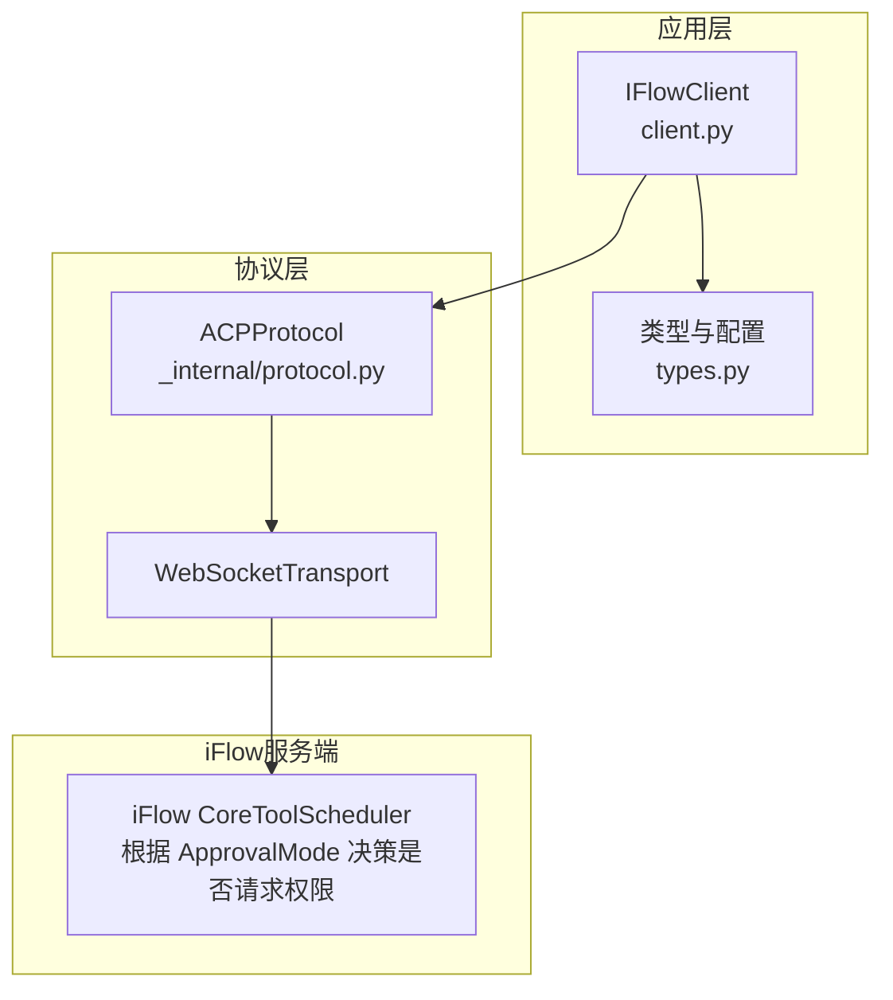
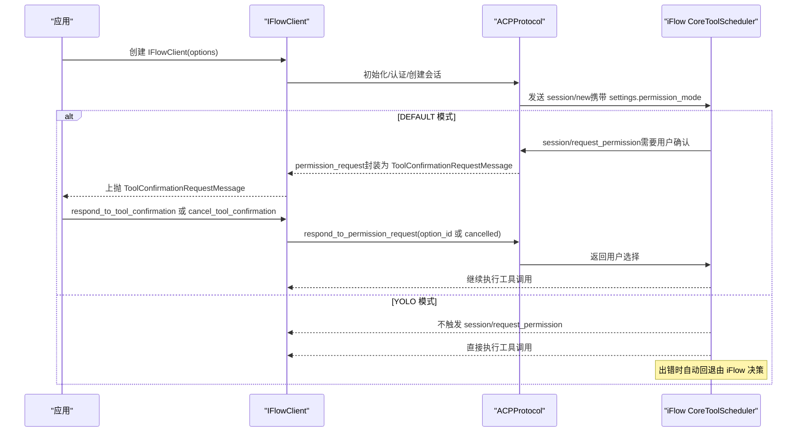
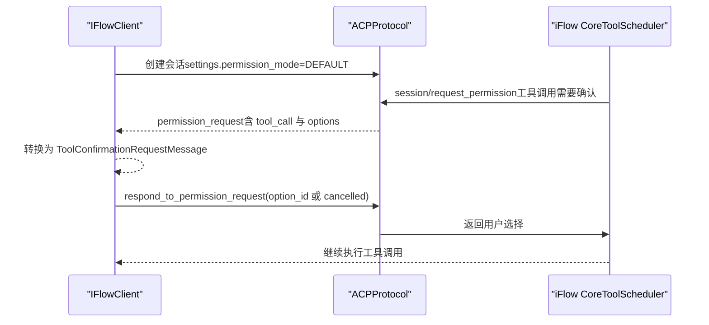
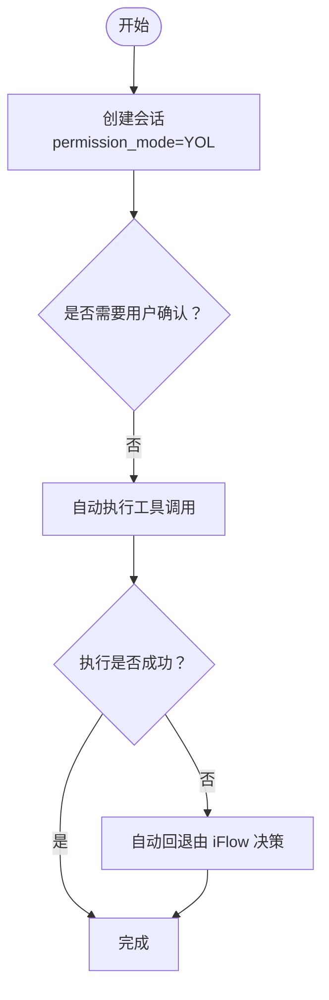
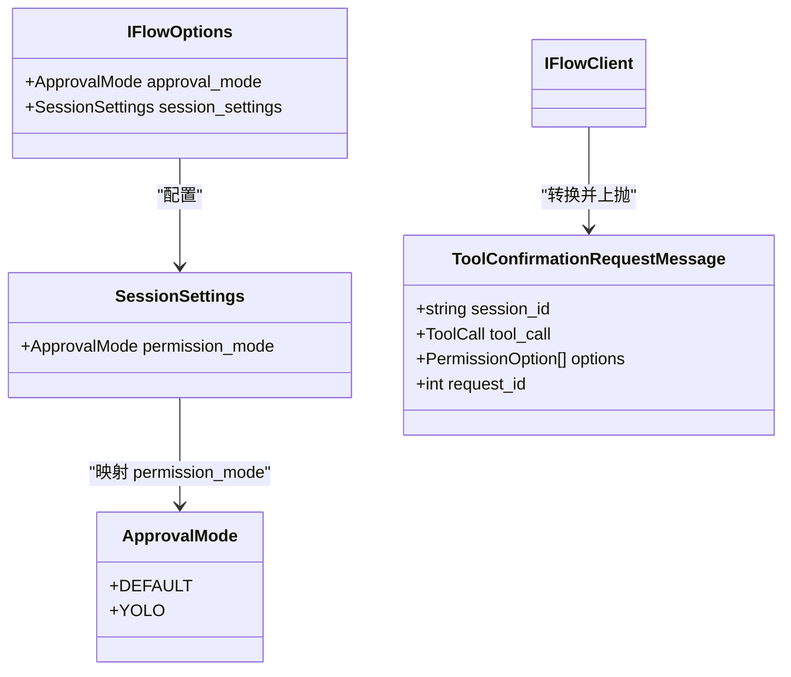
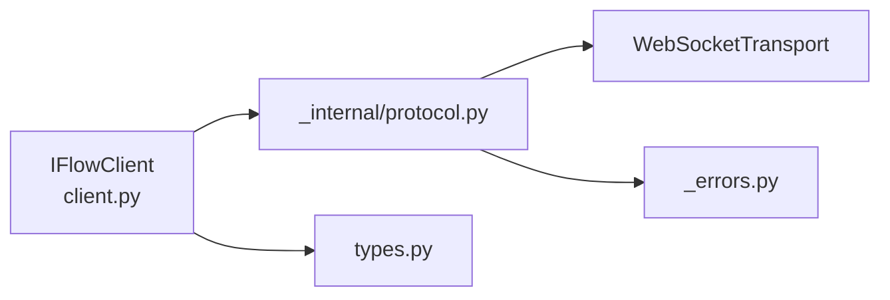

# 确认模式

<cite>
**本文引用的文件**
- [client.py](file://client.py)
- [types.py](file://types.py)
- [_internal/protocol.py](file://_internal/protocol.py)
- [_errors.py](file://_errors.py)
- [__init__.py](file://__init__.py)
</cite>

## 目录
1. [简介](#简介)
2. [项目结构](#项目结构)
3. [核心组件](#核心组件)
4. [架构总览](#架构总览)
5. [详细组件分析](#详细组件分析)
6. [依赖关系分析](#依赖关系分析)
7. [性能考量](#性能考量)
8. [故障排查指南](#故障排查指南)
9. [结论](#结论)
10. [附录](#附录)

## 简介
本节聚焦于 iflow_sdk 中“工具调用的两种确认模式”：DEFAULT 和 YOLO。我们将从协议与 SDK 的协作角度，解释：
- 在 DEFAULT 模式下，当 iFlow 代理需要执行工具调用时，会通过 ACP 协议发送 session/request_permission 请求；SDK 将其转换为 ToolConfirmationRequestMessage 并等待用户批准。
- 在 YOLO 模式下，所有工具调用都会自动获得批准，无需用户干预。
- 结合 IFlowOptions 中的 approval_mode 参数，说明如何配置这两种模式，并讨论它们各自的安全性与适用场景。最后给出初学者与高级用户的实践建议与协议层面的处理细节。

## 项目结构
围绕确认模式的关键文件与职责如下：
- client.py：对外暴露 IFlowClient，负责连接、会话管理、消息收发、工具确认响应等；在创建会话时将 approval_mode 映射到 session_settings.permission_mode。
- types.py：定义 ApprovalMode、IFlowOptions、SessionSettings、ToolConfirmationRequestMessage 等类型；明确 DEFAULT 与 YOLO 的语义及枚举值。
- _internal/protocol.py：实现 ACP 协议层，负责与 iFlow 的 JSON-RPC 通信；当收到 session/request_permission 时，封装为 permission_request 并交由上层处理；支持 respond_to_permission_request 回传用户选择。
- _errors.py：统一异常类型，便于在不同模式下进行错误处理与调试。
- __init__.py：导出主要类型与客户端，供外部使用。

图表来源
- [client.py](file://client.py#L278-L310)
- [types.py](file://types.py#L56-L73)
- [_internal/protocol.py](file://_internal/protocol.py#L567-L597)

章节来源
- [client.py](file://client.py#L278-L310)
- [types.py](file://types.py#L56-L73)
- [_internal/protocol.py](file://_internal/protocol.py#L567-L597)

## 核心组件
- ApprovalMode（确认模式枚举）
  - DEFAULT：请求用户确认（通过 ACP 的 session/request_permission），每次工具调用均需批准。
  - YOLO：自动批准所有工具调用，出现错误时自动回退。
- IFlowOptions（客户端配置）
  - approval_mode：控制 iFlow 的工具调用权限策略，SDK 会将其映射到 session_settings.permission_mode。
- SessionSettings（会话设置）
  - permission_mode：最终传递给 iFlow 的权限模式键值。
- ToolConfirmationRequestMessage（工具确认请求消息）
  - 当 iFlow 需要用户确认时，SDK 将 ACP 的 permission_request 转换为该消息类型，包含工具信息与可选操作列表。
- ACPProtocol（协议处理器）
  - 处理 session/request_permission 方法调用，生成 permission_request 并等待用户响应；随后通过 respond_to_permission_request 将结果回传 iFlow。

章节来源
- [types.py](file://types.py#L56-L73)
- [types.py](file://types.py#L893-L922)
- [types.py](file://types.py#L590-L626)
- [_internal/protocol.py](file://_internal/protocol.py#L567-L597)
- [_internal/protocol.py](file://_internal/protocol.py#L720-L768)
- [client.py](file://client.py#L278-L310)

## 架构总览
下面以序列图展示 DEFAULT 与 YOLO 两种模式下的关键交互流程。

图表来源
- [client.py](file://client.py#L278-L310)
- [_internal/protocol.py](file://_internal/protocol.py#L567-L597)
- [_internal/protocol.py](file://_internal/protocol.py#L720-L768)

## 详细组件分析

### DEFAULT 模式：每次工具调用都需要用户批准
- 配置入口
  - IFlowOptions.approval_mode 设置为 DEFAULT。
  - 客户端在创建会话时，将 options.approval_mode.value 写入 settings.permission_mode，从而影响 iFlow 的 CoreToolScheduler 行为。
- 协议交互
  - 当 iFlow 判定某工具调用需要权限时，会通过 ACP 的 session/request_permission 方法向 SDK 发起请求。
  - ACPProtocol 将该请求封装为 permission_request，并返回给上层。
  - IFlowClient 将 permission_request 转换为 ToolConfirmationRequestMessage，供应用层消费。
- 用户决策与回传
  - 应用层根据业务逻辑决定批准或拒绝，并调用 IFlowClient 的 respond_to_tool_confirmation 或 cancel_tool_confirmation。
  - IFlowClient 将用户选择通过 ACPProtocol 的 respond_to_permission_request 回传给 iFlow。
- 适用场景
  - 对安全性要求高、需要对每次工具调用进行审计与控制的生产环境。
  - 需要细粒度权限控制（如仅允许一次性、或永久允许某类工具）。
- 安全性
  - 优点：最小授权原则，降低误操作风险。
  - 风险：可能增加交互成本，影响自动化效率。

图表来源
- [client.py](file://client.py#L278-L310)
- [_internal/protocol.py](file://_internal/protocol.py#L567-L597)
- [_internal/protocol.py](file://_internal/protocol.py#L720-L768)
- [types.py](file://types.py#L590-L626)

章节来源
- [client.py](file://client.py#L278-L310)
- [_internal/protocol.py](file://_internal/protocol.py#L567-L597)
- [_internal/protocol.py](file://_internal/protocol.py#L720-L768)
- [types.py](file://types.py#L590-L626)

### YOLO 模式：自动批准，错误时自动回退
- 配置入口
  - IFlowOptions.approval_mode 设置为 YOLO。
  - 客户端同样将 approval_mode.value 写入 settings.permission_mode。
- 协议交互
  - iFlow 的 CoreToolScheduler 在 YOLO 模式下不发起 session/request_permission，直接执行工具调用。
  - 若执行过程中发生错误，iFlow 可能自动回退（例如取消或提示），具体行为由 iFlow 决策。
- 适用场景
  - 快速原型、开发调试、自动化脚本等追求效率与低交互成本的场景。
- 安全性
  - 优点：提升自动化效率。
  - 风险：缺少人工审核，存在误操作风险；应配合严格的工具白名单与沙箱策略。

图表来源
- [types.py](file://types.py#L56-L73)
- [client.py](file://client.py#L278-L310)

章节来源
- [types.py](file://types.py#L56-L73)
- [client.py](file://client.py#L278-L310)

### 类型与消息模型
- ApprovalMode
  - DEFAULT：default
  - YOLO：yolo
- ToolCallConfirmationOutcome
  - PROCEED_ONCE、PROCEED_ALWAYS、PROCEED_ALWAYS_SERVER、PROCEED_ALWAYS_TOOL、CANCEL
- ToolConfirmationRequestMessage
  - 包含 session_id、tool_call、options、request_id 等字段，用于承载权限请求详情。
- SessionSettings.permission_mode
  - 由 IFlowOptions.approval_mode.value 转换而来，作为 iFlow 的权限策略键值。

图表来源
- [types.py](file://types.py#L56-L73)
- [types.py](file://types.py#L893-L922)
- [types.py](file://types.py#L590-L626)
- [client.py](file://client.py#L278-L310)

章节来源
- [types.py](file://types.py#L56-L73)
- [types.py](file://types.py#L893-L922)
- [types.py](file://types.py#L590-L626)
- [client.py](file://client.py#L278-L310)

## 依赖关系分析
- IFlowClient 依赖 ACPProtocol 进行会话创建与消息处理；在创建会话时，将 IFlowOptions.approval_mode.value 写入 settings.permission_mode。
- ACPProtocol 依赖 WebSocketTransport 进行网络传输；在收到 session/request_permission 时，构造 permission_request 并等待用户响应。
- ToolConfirmationRequestMessage 由 ACPProtocol 的 _handle_client_method 生成，再由 IFlowClient 转换为上层可见的消息类型。

图表来源
- [client.py](file://client.py#L278-L310)
- [_internal/protocol.py](file://_internal/protocol.py#L567-L597)
- [_errors.py](file://_errors.py#L1-L85)

章节来源
- [client.py](file://client.py#L278-L310)
- [_internal/protocol.py](file://_internal/protocol.py#L567-L597)
- [_errors.py](file://_errors.py#L1-L85)

## 性能考量
- DEFAULT 模式
  - 增加了权限请求与用户交互的往返开销，适合对安全敏感但交互频率较低的场景。
  - 建议在应用层缓存常用工具的“永久允许”策略，减少重复确认。
- YOLO 模式
  - 无权限请求阻塞，整体吞吐更高，适合批处理与自动化任务。
  - 建议严格限制 allowed_tools/disallowed_tools 与文件系统访问范围，降低风险。

## 故障排查指南
- 无法收到 ToolConfirmationRequestMessage
  - 检查 IFlowOptions.approval_mode 是否为 DEFAULT，且 settings.permission_mode 已正确写入。
  - 确认 iFlow 的 CoreToolScheduler 是否启用了权限请求逻辑。
- respond_to_permission_request 报错
  - 确保 request_id 有效且未过期；若已超时或被其他流程覆盖，将无法回传。
  - 检查 option_id 是否属于 ToolCallConfirmationOutcome 的合法枚举值。
- 权限模式未生效
  - 确认 session/new 请求中携带了正确的 permission_mode。
  - 如使用自定义 SessionSettings，请确保 to_dict 输出的键名为 permission_mode。

章节来源
- [client.py](file://client.py#L278-L310)
- [_internal/protocol.py](file://_internal/protocol.py#L720-L768)
- [types.py](file://types.py#L42-L54)

## 结论
- DEFAULT 模式强调“最小授权”，通过 ACP 的 session/request_permission 机制实现逐次确认，适合生产与高安全场景。
- YOLO 模式强调“高效自动化”，在 iFlow 决策下自动执行并可在错误时自动回退，适合开发与批处理场景。
- 通过 IFlowOptions.approval_mode 与 SessionSettings.permission_mode 的映射，SDK 将模式配置无缝传递至 iFlow，使权限策略在协议层得到一致执行。

## 附录
- 模式选择建议
  - 初学者：优先 DEFAULT，逐步学习工具类型与权限选项；在确定安全策略后再切换至 YOLO。
  - 高级用户：在 DEFAULT 下使用“永久允许”策略优化高频工具；在 YOLO 下配合工具白名单与沙箱，确保可控自动化。