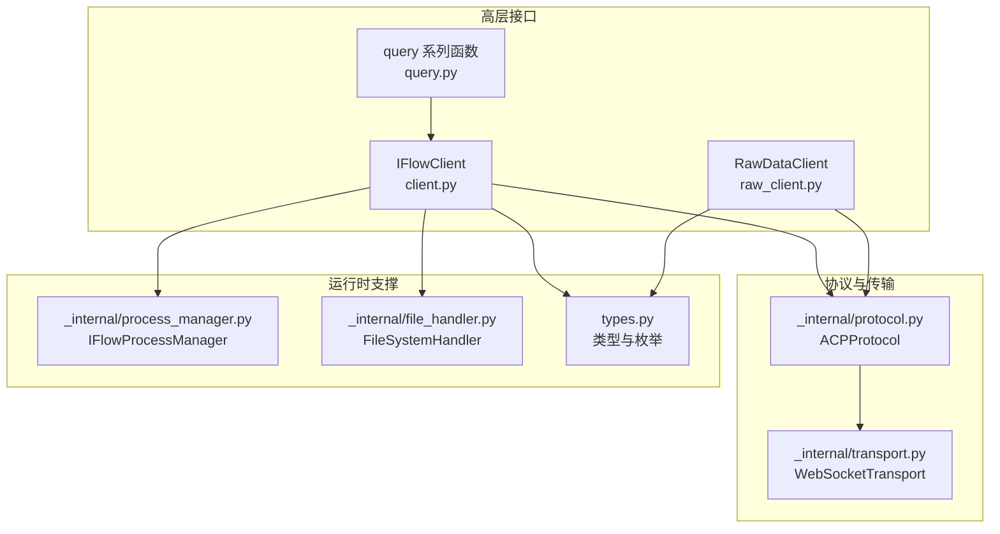
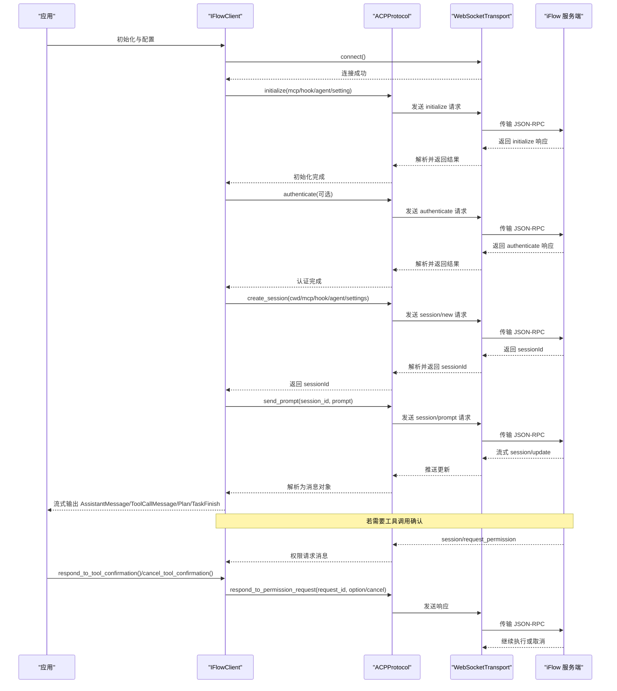
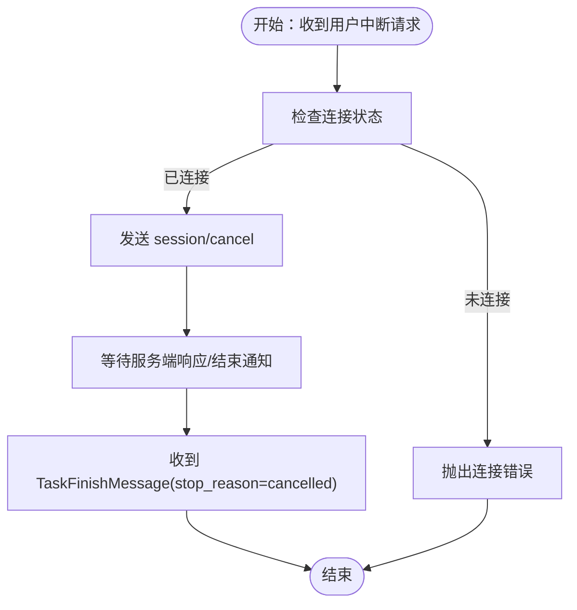
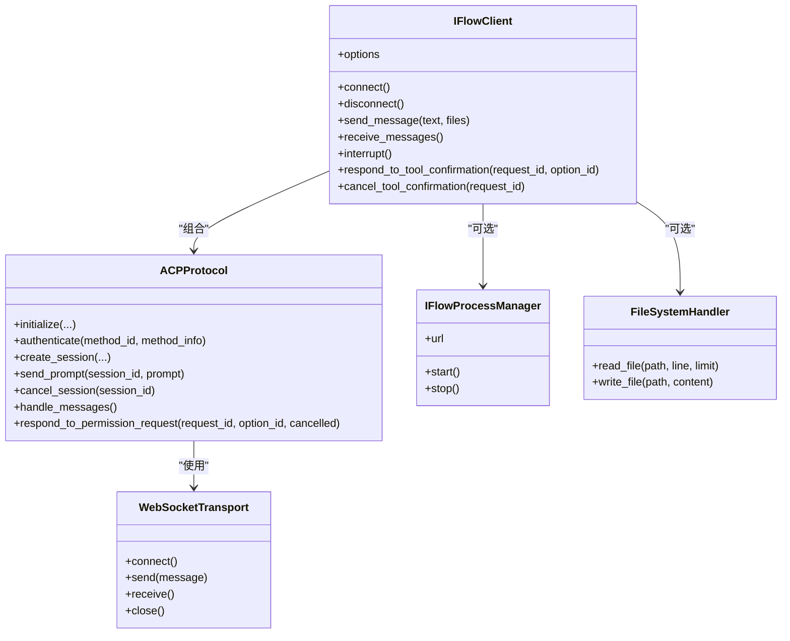

# 核心概念

<cite>
**本文引用的文件**
- [client.py](file://client.py)
- [raw_client.py](file://raw_client.py)
- [types.py](file://types.py)
- [_internal/protocol.py](file://_internal/protocol.py)
- [_internal/transport.py](file://_internal/transport.py)
- [_internal/process_manager.py](file://_internal/process_manager.py)
- [_internal/file_handler.py](file://_internal/file_handler.py)
- [query.py](file://query.py)
- [__init__.py](file://__init__.py)
</cite>

## 目录
1. [引言](#引言)
2. [项目结构](#项目结构)
3. [核心组件](#核心组件)
4. [架构总览](#架构总览)
5. [详细组件分析](#详细组件分析)
6. [依赖关系分析](#依赖关系分析)
7. [性能与并发特性](#性能与并发特性)
8. [故障排查指南](#故障排查指南)
9. [结论](#结论)
10. [附录：术语表](#附录术语表)

## 引言
本文件面向初学者与高级用户，系统性地解释 iflow_sdk 的核心概念与实现要点，重点覆盖：
- ACP 协议的工作原理（消息格式、会话管理、认证流程）
- IFlowClient 如何维护对话状态并支持流式响应
- 工具调用机制（DEFAULT 与 YOLO 模式下的权限请求与处理）
- 中断会话（interrupt）在控制流中的作用
- 结合 client.py 中的代码路径说明关键流程

目标是帮助读者从“能用”到“懂原理”，既能快速上手，也能深入理解 SDK 的内部协作方式。

## 项目结构
SDK 采用分层设计：高层客户端负责交互与状态管理；协议层封装 ACP 协议；传输层提供 WebSocket 通信；进程与文件访问由辅助模块提供安全能力。

图表来源
- [client.py](file://client.py#L1-L120)
- [_internal/protocol.py](file://_internal/protocol.py#L1-L120)
- [_internal/transport.py](file://_internal/transport.py#L1-L120)
- [_internal/process_manager.py](file://_internal/process_manager.py#L1-L120)
- [_internal/file_handler.py](file://_internal/file_handler.py#L1-L120)
- [types.py](file://types.py#L1-L120)
- [query.py](file://query.py#L1-L60)

章节来源
- [client.py](file://client.py#L1-L120)
- [raw_client.py](file://raw_client.py#L1-L120)
- [query.py](file://query.py#L1-L60)
- [_internal/protocol.py](file://_internal/protocol.py#L1-L120)
- [_internal/transport.py](file://_internal/transport.py#L1-L120)
- [_internal/process_manager.py](file://_internal/process_manager.py#L1-L120)
- [_internal/file_handler.py](file://_internal/file_handler.py#L1-L120)
- [types.py](file://types.py#L1-L120)

## 核心组件
- IFlowClient：双向、有状态、可中断的对话客户端，支持流式响应、工具调用确认、会话管理与自动进程启动。
- ACPProtocol：实现 ACP v0.0.9 的 JSON-RPC 基础消息格式，负责初始化、认证、会话创建/加载、提示发送、权限请求转发与响应、错误处理等。
- WebSocketTransport：低层 WebSocket 传输，负责连接、收发、控制消息识别与错误传播。
- IFlowProcessManager：自动发现并启动本地 iFlow 进程，提供端口选择与生命周期管理。
- FileSystemHandler：受控的文件系统访问器，用于处理 iFlow 发起的 fs/* 请求。
- RawDataClient：在 IFlowClient 基础上提供原始消息流与解析流的双通道，便于调试与协议级观察。
- 类型系统（types.py）：统一的消息、状态、配置与枚举定义，确保跨模块一致的数据契约。

章节来源
- [client.py](file://client.py#L110-L220)
- [_internal/protocol.py](file://_internal/protocol.py#L21-L70)
- [_internal/transport.py](file://_internal/transport.py#L27-L80)
- [_internal/process_manager.py](file://_internal/process_manager.py#L25-L70)
- [_internal/file_handler.py](file://_internal/file_handler.py#L16-L58)
- [raw_client.py](file://raw_client.py#L72-L120)
- [types.py](file://types.py#L17-L120)

## 架构总览
下面以序列图展示一次典型对话的端到端流程，包括初始化、认证、会话创建、提示发送、流式响应与工具调用确认。

图表来源
- [client.py](file://client.py#L313-L368)
- [_internal/protocol.py](file://_internal/protocol.py#L113-L171)
- [_internal/protocol.py](file://_internal/protocol.py#L176-L256)
- [_internal/protocol.py](file://_internal/protocol.py#L257-L346)
- [_internal/protocol.py](file://_internal/protocol.py#L447-L478)
- [_internal/protocol.py](file://_internal/protocol.py#L548-L597)
- [_internal/protocol.py](file://_internal/protocol.py#L720-L768)

章节来源
- [client.py](file://client.py#L313-L368)
- [_internal/protocol.py](file://_internal/protocol.py#L113-L171)
- [_internal/protocol.py](file://_internal/protocol.py#L176-L256)
- [_internal/protocol.py](file://_internal/protocol.py#L257-L346)
- [_internal/protocol.py](file://_internal/protocol.py#L447-L478)
- [_internal/protocol.py](file://_internal/protocol.py#L548-L597)
- [_internal/protocol.py](file://_internal/protocol.py#L720-L768)

## 详细组件分析

### ACP 协议与消息格式
- 协议版本与握手
  - 协议版本号在协议层定义，初始化阶段通过 JSON-RPC 2.0 发送 initialize 请求，等待服务端的 //ready 控制信号后进行后续握手。
  - 初始化参数可包含客户端能力声明、MCP 服务器、钩子、命令与代理配置等。
- 认证流程
  - 若初始化返回未认证，则发送 authenticate 请求，携带方法标识与可选信息；超时与错误将被转换为特定异常。
- 会话管理
  - 创建会话：发送 session/new，返回 sessionId；若服务端不支持 session/load，SDK 提供对应方法但当前版本可能不可用。
  - 取消会话：发送 session/cancel，用于中断当前生成。
- 消息与事件
  - session/prompt：向指定会话发送提示，支持多内容块（文本、图片、音频、资源链接）。
  - session/update：服务端推送的增量更新，SDK 将其映射为多种消息类型（助手文本/思考、工具调用、计划、任务结束等）。
  - session/request_permission：当 ApprovalMode 决定需要用户确认时，SDK 转发权限请求给上层，等待用户决策后再回传结果。
  - 文件系统方法：fs/read_text_file、fs/write_text_file，配合 FileSystemHandler 实现受控文件访问。

章节来源
- [_internal/protocol.py](file://_internal/protocol.py#L35-L54)
- [_internal/protocol.py](file://_internal/protocol.py#L113-L171)
- [_internal/protocol.py](file://_internal/protocol.py#L176-L256)
- [_internal/protocol.py](file://_internal/protocol.py#L257-L346)
- [_internal/protocol.py](file://_internal/protocol.py#L447-L478)
- [_internal/protocol.py](file://_internal/protocol.py#L548-L597)
- [_internal/protocol.py](file://_internal/protocol.py#L598-L660)
- [_internal/protocol.py](file://_internal/protocol.py#L661-L684)

### IFlowClient 的对话状态与流式响应
- 状态字段
  - 连接与认证状态、会话 ID、消息队列、待处理工具调用映射、待处理请求映射、进程管理器与启动标记等。
- 流式接收
  - receive_messages 通过后台任务持续从协议层解码消息并入队，上层异步迭代消费；遇到错误时注入 ErrorMessage。
- 工具调用确认
  - 当收到 ToolConfirmationRequestMessage 时，上层根据 ApprovalMode 决策是否需要用户确认；确认后调用 respond_to_tool_confirmation 或 cancel_tool_confirmation。
- 中断控制
  - interrupt 调用 cancel_session，向服务端发送 session/cancel，从而中断当前生成。

章节来源
- [client.py](file://client.py#L110-L128)
- [client.py](file://client.py#L510-L528)
- [client.py](file://client.py#L529-L598)
- [client.py](file://client.py#L498-L509)
- [client.py](file://client.py#L640-L657)
- [client.py](file://client.py#L658-L800)
- [_internal/protocol.py](file://_internal/protocol.py#L479-L498)

### 工具调用机制：DEFAULT 与 YOLO 模式
- DEFAULT 模式
  - iFlow 在需要时通过 session/request_permission 主动请求用户确认；SDK 将该请求透传给上层，上层决定 proceed_once、proceed_always、proceed_always_server、proceed_always_tool 或 cancel。
  - 上层调用 respond_to_tool_confirmation 或 cancel_tool_confirmation，SDK 通过 respond_to_permission_request 回传给服务端。
- YOLO 模式
  - iFlow 自动执行工具调用，无需用户确认；若出现错误，SDK 会自动回退策略（由服务端调度器决定），上层无需干预。
- AUTO_EDIT/PLAN 模式
  - AUTO_EDIT：自动执行所有工具，不触发权限请求。
  - PLAN：仅允许只读工具，阻断写操作。

章节来源
- [types.py](file://types.py#L56-L73)
- [_internal/protocol.py](file://_internal/protocol.py#L567-L597)
- [_internal/protocol.py](file://_internal/protocol.py#L720-L768)
- [client.py](file://client.py#L529-L598)

### 中断会话（interrupt）控制流
- 触发点：用户在对话过程中调用 interrupt。
- 行为：SDK 调用 ACPProtocol.cancel_session，发送 session/cancel 请求至服务端。
- 影响：服务端停止当前生成，SDK 收到 TaskFinishMessage 并携带 stop_reason（如 cancelled）。

图表来源
- [client.py](file://client.py#L498-L509)
- [_internal/protocol.py](file://_internal/protocol.py#L479-L498)
- [types.py](file://types.py#L85-L93)

章节来源
- [client.py](file://client.py#L498-L509)
- [_internal/protocol.py](file://_internal/protocol.py#L479-L498)
- [types.py](file://types.py#L85-L93)

### RawDataClient：原始消息与双流
- 原始消息捕获：在 capture_raw 开启时，RawDataClient 同时维护原始消息队列与解析消息队列，支持 receive_raw_messages 与 receive_dual_stream。
- 协议统计与调试：提供 get_protocol_stats 与 ProtocolDebugger，便于分析消息类型、控制消息数量与错误分布。

章节来源
- [raw_client.py](file://raw_client.py#L108-L174)
- [raw_client.py](file://raw_client.py#L175-L237)
- [raw_client.py](file://raw_client.py#L238-L362)

### 查询便捷函数：query/query_stream/query_sync
- query：一次性发送提示并聚合完整响应文本。
- query_stream：边到达边产出文本片段，适合实时显示。
- query_sync：同步包装，便于在非异步环境中使用。

章节来源
- [query.py](file://query.py#L15-L71)
- [query.py](file://query.py#L73-L110)
- [query.py](file://query.py#L111-L137)

## 依赖关系分析

图表来源
- [client.py](file://client.py#L110-L220)
- [_internal/protocol.py](file://_internal/protocol.py#L21-L70)
- [_internal/transport.py](file://_internal/transport.py#L27-L80)
- [_internal/process_manager.py](file://_internal/process_manager.py#L25-L70)
- [_internal/file_handler.py](file://_internal/file_handler.py#L16-L58)

章节来源
- [client.py](file://client.py#L110-L220)
- [_internal/protocol.py](file://_internal/protocol.py#L21-L70)
- [_internal/transport.py](file://_internal/transport.py#L27-L80)
- [_internal/process_manager.py](file://_internal/process_manager.py#L25-L70)
- [_internal/file_handler.py](file://_internal/file_handler.py#L16-L58)

## 性能与并发特性
- 异步与并发
  - 所有网络与 I/O 操作均基于 asyncio，避免阻塞；后台任务负责消息接收与处理，上层通过队列解耦。
- 超时与重试
  - 连接建立具备指数回退重试；认证与会话创建设置超时保护。
- 资源清理
  - 断开连接时取消后台任务、关闭传输、必要时停止本地进程，防止资源泄漏。
- 大消息与编码
  - 传输层限制单次消息大小；文件读取支持按行与上限限制，避免内存压力。

章节来源
- [client.py](file://client.py#L189-L221)
- [_internal/transport.py](file://_internal/transport.py#L60-L84)
- [_internal/transport.py](file://_internal/transport.py#L114-L146)
- [_internal/protocol.py](file://_internal/protocol.py#L213-L256)
- [_internal/protocol.py](file://_internal/protocol.py#L311-L345)
- [_internal/file_handler.py](file://_internal/file_handler.py#L89-L159)

## 故障排查指南
- 连接失败
  - 检查 URL 是否正确、端口是否开放；若启用 auto_start_process，确认本地 iFlow 是否安装且可执行。
- 认证失败
  - 确认 authenticate 方法与方法信息正确；查看协议层返回的错误信息与超时日志。
- 会话创建/加载失败
  - session/new 与 session/load 的响应解析与超时处理；若服务端不支持 load，需改为创建新会话。
- 工具调用未触发确认
  - 检查 ApprovalMode 设置；DEFAULT 模式下必须显式处理权限请求。
- 中断无效
  - 确认已连接且存在有效会话 ID；检查 cancel_session 是否被调用。
- 原始消息调试
  - 使用 RawDataClient 的 receive_raw_messages 或 receive_dual_stream，结合 ProtocolDebugger 分析消息类型与错误计数。

章节来源
- [client.py](file://client.py#L189-L221)
- [_internal/protocol.py](file://_internal/protocol.py#L176-L256)
- [_internal/protocol.py](file://_internal/protocol.py#L257-L346)
- [_internal/protocol.py](file://_internal/protocol.py#L479-L498)
- [raw_client.py](file://raw_client.py#L238-L362)

## 结论
iflow_sdk 通过清晰的分层设计与严格的协议实现，为 iFlow 提供了稳定、可扩展的 Python 客户端能力。IFlowClient 作为高层入口，将 ACP 协议、WebSocket 传输、进程与文件访问等底层能力整合为一体，既满足简单查询场景，也支持复杂交互与调试需求。理解 DEFAULT 与 YOLO 等 ApprovalMode 的差异，有助于在安全性与自动化之间取得平衡；掌握 interrupt 的控制流，可提升用户体验与系统可控性。

## 附录：术语表
- ACP（Agent Communication Protocol）：iFlow 的代理通信协议，基于 JSON-RPC 2.0，定义了初始化、认证、会话、提示、权限请求与文件系统等方法。
- 会话（Session）：一次对话上下文，由 sessionId 标识，承载提示、工具调用与状态。
- 权限请求（Permission Request）：当工具调用需要用户确认时，服务端发起的请求，SDK 负责转发与回传。
- DEFAULT 模式：每次工具调用前请求用户确认。
- YOLO 模式：自动执行工具调用并自动回退错误。
- AUTO_EDIT/PLAN 模式：分别表示自动执行与只读限制。
- 流式响应：服务端通过 session/update 逐步推送消息，SDK 解析为消息对象供上层消费。
- RawDataClient：提供原始消息与解析消息的双通道，便于协议调试。