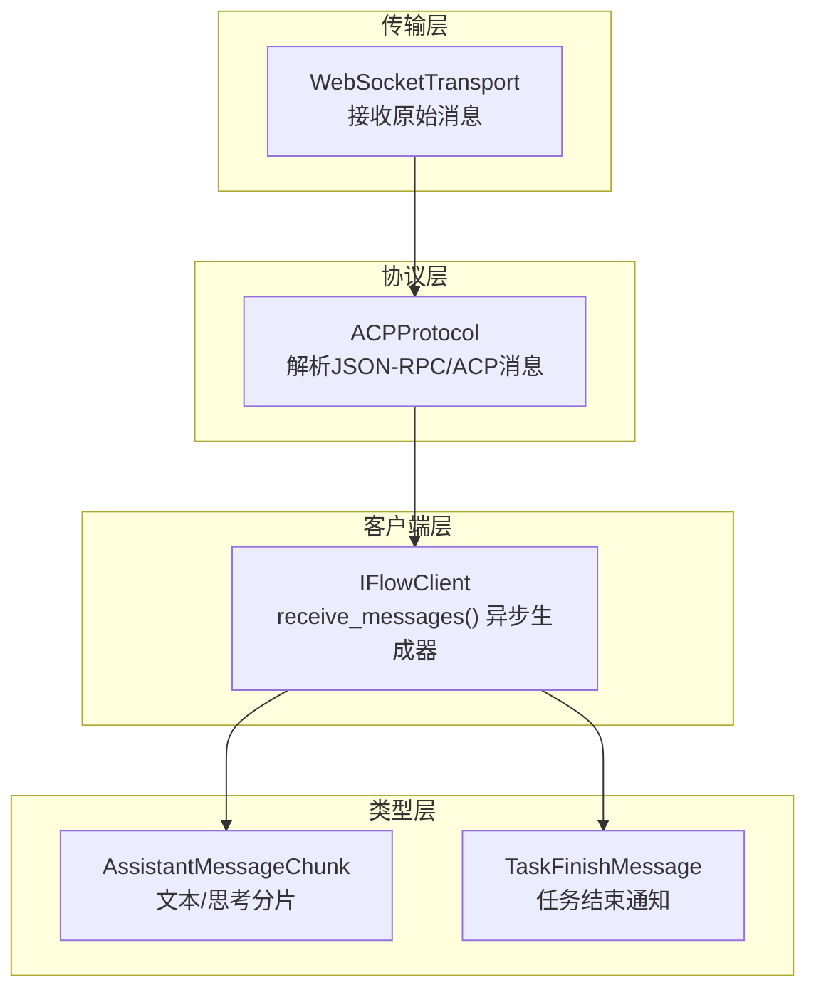
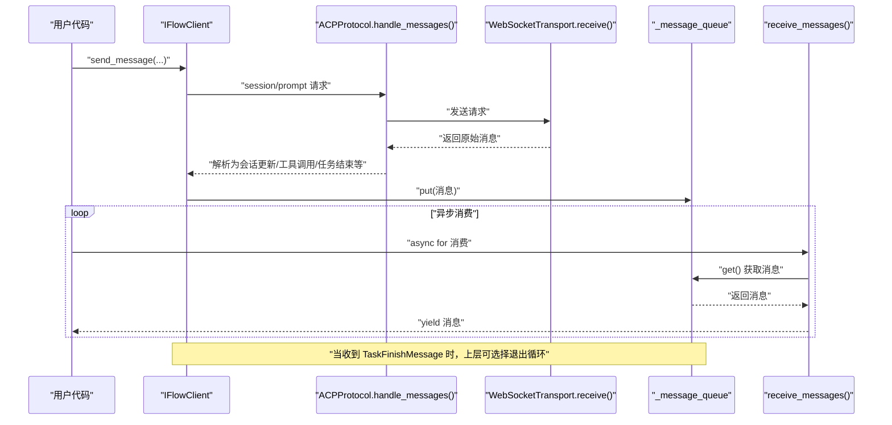
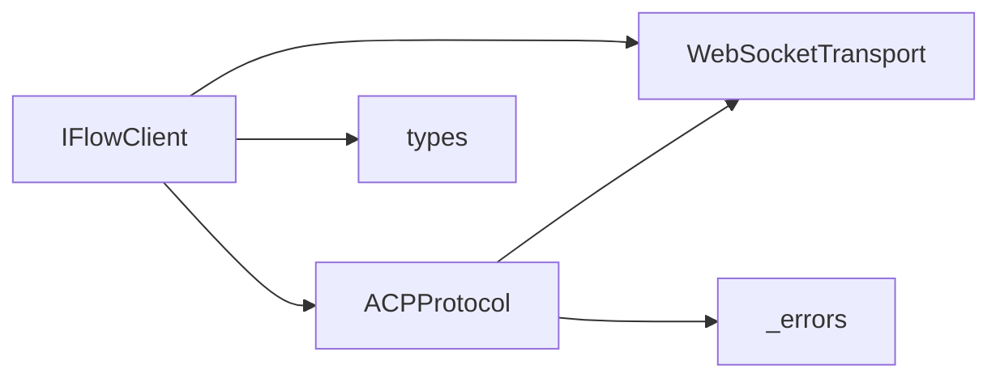
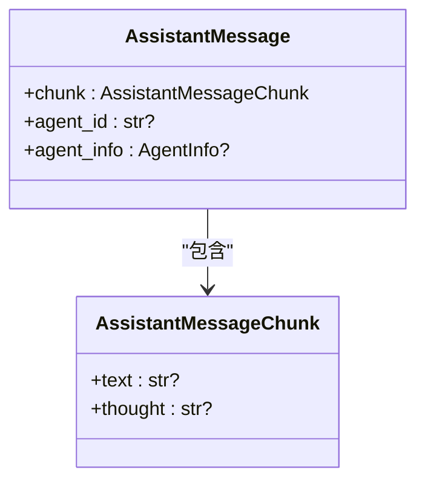
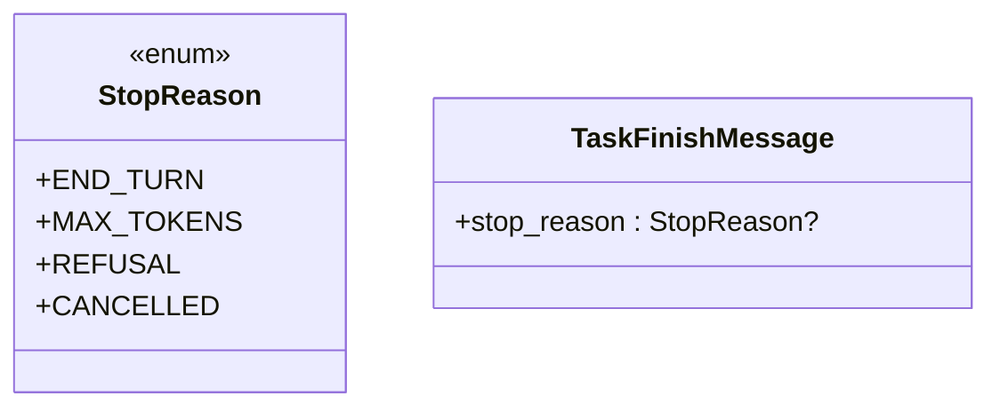
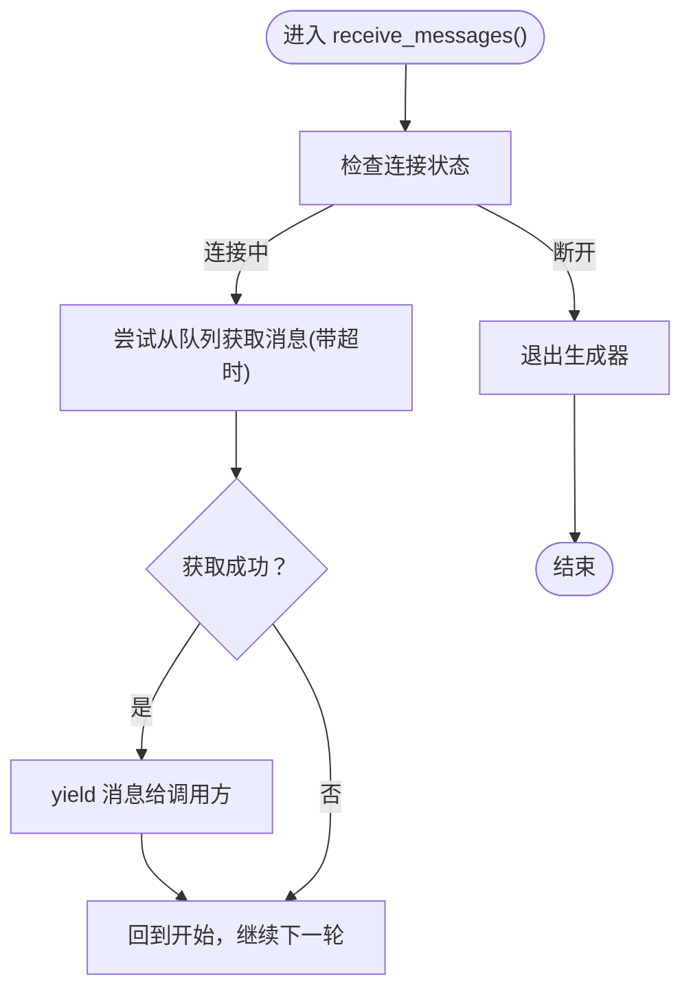

# 流式响应

<cite>
**本文引用的文件**
- [client.py](file://client.py)
- [types.py](file://types.py)
- [protocol.py](file://_internal/protocol.py)
- [transport.py](file://_internal/transport.py)
- [query.py](file://query.py)
- [raw_client.py](file://raw_client.py)
- [_errors.py](file://_errors.py)
</cite>

## 目录
1. [简介](#简介)
2. [项目结构](#项目结构)
3. [核心组件](#核心组件)
4. [架构总览](#架构总览)
5. [详细组件分析](#详细组件分析)
6. [依赖关系分析](#依赖关系分析)
7. [性能考量](#性能考量)
8. [故障排查指南](#故障排查指南)
9. [结论](#结论)
10. [附录](#附录)

## 简介
本节聚焦于 iflow_sdk 中的“流式响应”机制，解释 IFlowClient 如何通过 receive_messages() 异步生成器实时接收助手的响应；阐述 _message_queue 在缓冲与传递流式消息中的作用；说明 _message_task 后台任务如何处理传入的消息；解释 AssistantMessageChunk 如何实现文本的逐块传输以提供即时反馈；结合 client.py 的示例，说明如何使用 async for 循环处理流式响应并在 TaskFinishMessage 到达时终止接收。同时为初学者解释流式传输的优势，为高级用户提供消息处理管道的技术细节与性能考虑。

## 项目结构
iflow_sdk 的流式响应由多层协作完成：
- 底层传输：WebSocketTransport 负责连接与收发原始消息
- 协议层：ACPProtocol 解析 JSON-RPC 消息、映射到 SDK 内部消息类型
- 客户端层：IFlowClient 提供高层 API，包括 receive_messages() 异步生成器
- 类型层：types.py 定义消息与分片类型（如 AssistantMessageChunk）
- 工具函数：query.py 提供便捷的一次性查询与流式查询函数

图表来源
- [transport.py](file://_internal/transport.py#L114-L146)
- [protocol.py](file://_internal/protocol.py#L499-L533)
- [client.py](file://client.py#L510-L528)
- [types.py](file://types.py#L95-L122)
- [types.py](file://types.py#L656-L671)

章节来源
- [client.py](file://client.py#L1-L120)
- [protocol.py](file://_internal/protocol.py#L1-L120)
- [transport.py](file://_internal/transport.py#L1-L80)
- [types.py](file://types.py#L1-L120)

## 核心组件
- IFlowClient.receive_messages(): 返回一个异步迭代器，持续从内部队列取出消息，直到连接断开或收到任务结束信号
- IFlowClient._message_queue: asyncio.Queue，作为后台任务与上层消费之间的缓冲区
- IFlowClient._message_task: 后台任务，从 ACPProtocol.handle_messages() 接收解析后的消息，转换为 SDK 类型后放入队列
- ACPProtocol.handle_messages(): 从 WebSocketTransport.receive() 读取原始消息，解析为 SDK 可识别的消息结构
- AssistantMessageChunk: 表示助手输出的文本或思考片段，支持增量推送
- TaskFinishMessage: 表示一次对话回合的结束及停止原因

章节来源
- [client.py](file://client.py#L510-L528)
- [client.py](file://client.py#L640-L657)
- [protocol.py](file://_internal/protocol.py#L499-L533)
- [types.py](file://types.py#L95-L122)
- [types.py](file://types.py#L656-L671)

## 架构总览
下面的序列图展示了从发送提示到流式接收响应的关键流程，重点体现 receive_messages() 的异步生成器行为与后台消息处理任务的协作。

图表来源
- [client.py](file://client.py#L510-L528)
- [client.py](file://client.py#L640-L657)
- [protocol.py](file://_internal/protocol.py#L499-L533)
- [transport.py](file://_internal/transport.py#L114-L146)

## 详细组件分析

### IFlowClient.receive_messages() 异步生成器
- 功能：持续从内部队列取出消息，使用超时轮询避免阻塞，遇到连接断开时退出
- 关键点：
  - 使用 asyncio.wait_for(timeout=0.1) 实现非阻塞轮询
  - 当队列为空且连接仍处于活跃状态时，继续等待
  - 上层通过 isinstance 判断消息类型，例如 AssistantMessage 或 TaskFinishMessage
- 终止条件：当收到 TaskFinishMessage 时，上层逻辑应 break，从而停止消费

章节来源
- [client.py](file://client.py#L510-L528)

### _message_queue 缓冲与传递
- 类型：asyncio.Queue[Message]
- 角色：
  - 作为后台任务与上层消费之间的缓冲，解耦网络接收速度与应用消费速度
  - 支持高并发场景下的消息积压与平滑处理
- 注意事项：
  - 队列容量无显式上限，建议在上层消费侧及时处理，避免内存压力
  - 若队列过大，可能延迟最新消息的可见性

章节来源
- [client.py](file://client.py#L110-L130)

### _message_task 后台任务与消息处理
- 启动：connect() 成功后创建后台任务，开始监听协议消息
- 处理流程：
  - 从 ACPProtocol.handle_messages() 异步迭代解析出的消息
  - 调用 _process_message() 将原始数据映射为 SDK 类型（如 AssistantMessage、ToolCallMessage、TaskFinishMessage 等）
  - 将消息放入 _message_queue
- 错误处理：
  - 捕获取消与异常，必要时向队列放入 ErrorMessage，以便上层感知

章节来源
- [client.py](file://client.py#L313-L318)
- [client.py](file://client.py#L640-L657)
- [client.py](file://client.py#L658-L812)
- [_errors.py](file://_errors.py#L1-L85)

### AssistantMessageChunk 与逐块传输
- 定义：AssistantMessageChunk 支持 text 或 thought 字段之一存在，用于表示助手输出的文本片段或思考片段
- 流式语义：
  - 当 ACPProtocol.handle_messages() 解析到 session_update.update_type 为 agent_message_chunk 或 agent_thought_chunk 时，构造 AssistantMessage 并携带 AssistantMessageChunk
  - 上层在 async for 循环中即可逐步接收增量文本，实现“所见即所得”的即时反馈
- 典型使用：在 UI 中边收边显示，提升交互体验

章节来源
- [types.py](file://types.py#L95-L122)
- [client.py](file://client.py#L667-L706)
- [client.py](file://client.py#L688-L696)

### TaskFinishMessage 与终止策略
- 来源：当 ACPProtocol.handle_messages() 解析到 notifyTaskFinish 或包含 stopReason 的 response 时，映射为 TaskFinishMessage
- 停止原因枚举：end_turn、max_tokens、refusal、cancelled
- 使用方式：上层在 async for 循环中检测 TaskFinishMessage 并 break，结束接收

章节来源
- [protocol.py](file://_internal/protocol.py#L678-L683)
- [client.py](file://client.py#L793-L812)
- [types.py](file://types.py#L85-L93)
- [types.py](file://types.py#L656-L671)

### 传输层与协议层协作
- WebSocketTransport.receive() 持续从底层 WebSocket 接收原始消息（字符串或 JSON）
- ACPProtocol.handle_messages() 解析 JSON-RPC 方法调用与响应，产出 SDK 可消费的消息结构
- 二者配合确保消息的可靠流转与错误传播

章节来源
- [transport.py](file://_internal/transport.py#L114-L146)
- [protocol.py](file://_internal/protocol.py#L499-L533)

### 示例：使用 async for 处理流式响应
- 基础用法：发送消息后，使用 async for 遍历 receive_messages()，根据消息类型处理文本分片或工具调用请求
- 结束条件：遇到 TaskFinishMessage 时 break
- 参考路径：
  - [client.py](file://client.py#L69-L90)
  - [query.py](file://query.py#L56-L71)
  - [query.py](file://query.py#L98-L109)

章节来源
- [client.py](file://client.py#L69-L90)
- [query.py](file://query.py#L56-L71)
- [query.py](file://query.py#L98-L109)

### RawDataClient 的双流能力（高级调试）
- RawDataClient 在标准 IFlowClient 基础上，同时维护 _raw_queue 与 _message_queue，支持：
  - receive_raw_messages()：仅原始消息流
  - receive_dual_stream()：将原始消息与解析消息进行相关联的双流输出
- 适合需要深入理解协议细节的开发者

章节来源
- [raw_client.py](file://raw_client.py#L108-L173)
- [raw_client.py](file://raw_client.py#L174-L239)

## 依赖关系分析
- IFlowClient 依赖：
  - WebSocketTransport：建立与 iFlow 的 WebSocket 连接
  - ACPProtocol：解析 ACP 协议消息，映射为 SDK 类型
  - types：定义消息与分片类型
- ACPProtocol 依赖：
  - WebSocketTransport：底层收发
  - _errors：错误类型
- 传输层：
  - websockets：底层 WebSocket 客户端库

图表来源
- [client.py](file://client.py#L1-L120)
- [protocol.py](file://_internal/protocol.py#L1-L120)
- [transport.py](file://_internal/transport.py#L1-L80)
- [_errors.py](file://_errors.py#L1-L85)

章节来源
- [client.py](file://client.py#L1-L120)
- [protocol.py](file://_internal/protocol.py#L1-L120)
- [transport.py](file://_internal/transport.py#L1-L80)
- [_errors.py](file://_errors.py#L1-L85)

## 性能考量
- 队列与背压
  - _message_queue 作为单消费者缓冲，若上层消费不及时，可能导致队列增长
  - 建议在上层消费侧采用快速处理与批量渲染策略，避免阻塞
- 轮询与超时
  - receive_messages() 使用短超时轮询，降低阻塞风险，但可能增加 CPU 开销
  - 可根据实际吞吐量调整超时值或引入事件驱动（如队列空闲事件）优化
- 解析与映射
  - _process_message() 对每条消息进行类型映射，建议保持映射逻辑轻量
- 网络与协议
  - WebSocketTransport 的最大消息大小限制与 ping/超时配置需按场景调优
  - ACPProtocol 的 JSON 解析与错误处理对稳定性至关重要

[本节为通用指导，无需特定文件引用]

## 故障排查指南
- 连接失败
  - 检查 WebSocketTransport.connect() 是否抛出连接或超时异常
  - 确认 URL 正确且服务端可达
- 协议初始化失败
  - ACPProtocol.initialize()/authenticate() 失败时，检查认证信息与服务器能力
- 消息未到达
  - 确认 _message_task 是否已启动（connect() 后）
  - 检查 _process_message() 是否正确映射消息类型
  - 若出现异常，后台任务会向队列放入 ErrorMessage，可在消费侧捕获
- 任务未结束
  - 确认是否正确处理 TaskFinishMessage 并在上层循环中 break
- 原始消息调试
  - 使用 RawDataClient.receive_raw_messages()/receive_dual_stream() 辅助定位问题

章节来源
- [transport.py](file://_internal/transport.py#L53-L84)
- [protocol.py](file://_internal/protocol.py#L94-L171)
- [client.py](file://client.py#L372-L398)
- [client.py](file://client.py#L640-L657)
- [raw_client.py](file://raw_client.py#L174-L239)

## 结论
iflow_sdk 的流式响应通过“传输层-协议层-客户端层”的清晰分层，实现了从底层 WebSocket 到上层异步生成器的完整链路。IFlowClient 的 receive_messages() 以异步生成器形式提供实时消息消费体验，_message_queue 与 _message_task 协同完成缓冲与后台处理，AssistantMessageChunk 使文本能够以分片形式即时呈现，TaskFinishMessage 则为流式会话提供了明确的终止信号。对于初学者，流式传输带来即时反馈与更好的交互体验；对于高级用户，双流调试与消息映射机制提供了强大的可观测性与扩展性。

[本节为总结，无需特定文件引用]

## 附录

### AssistantMessageChunk 数据模型

图表来源
- [types.py](file://types.py#L95-L122)
- [types.py](file://types.py#L481-L507)

### TaskFinishMessage 与停止原因

图表来源
- [types.py](file://types.py#L85-L93)
- [types.py](file://types.py#L656-L671)

### 流程图：receive_messages() 的消费循环

图表来源
- [client.py](file://client.py#L510-L528)