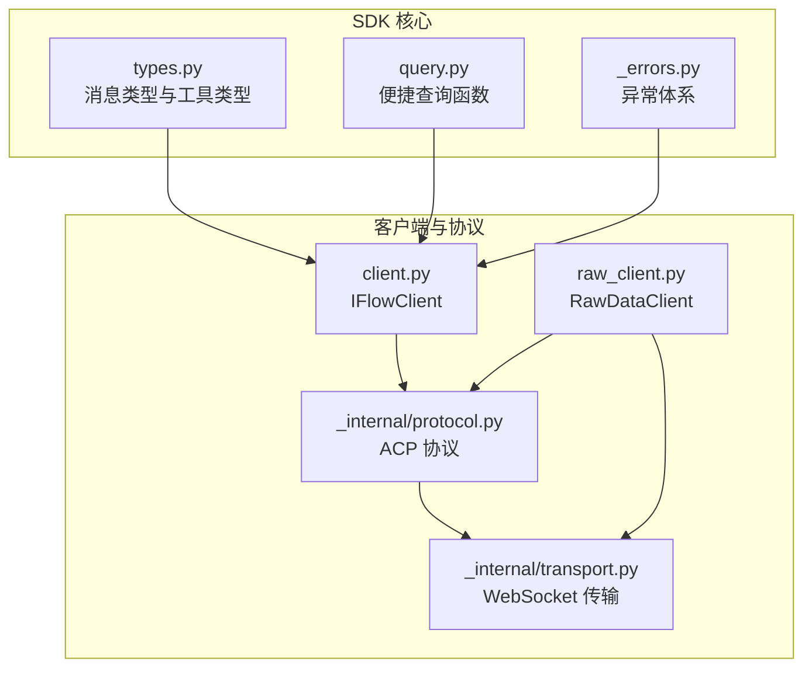
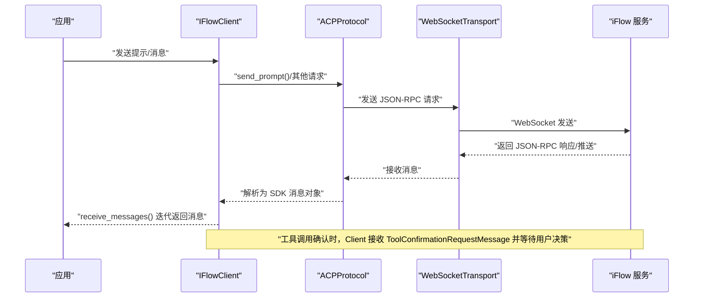
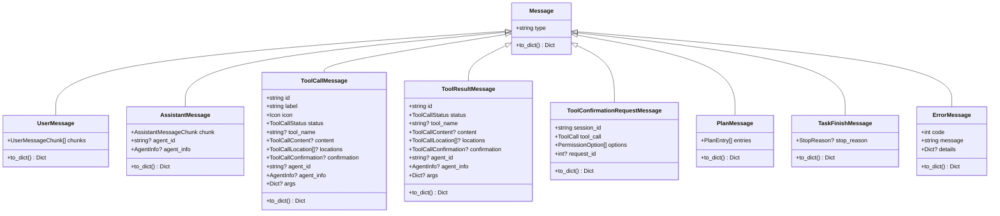
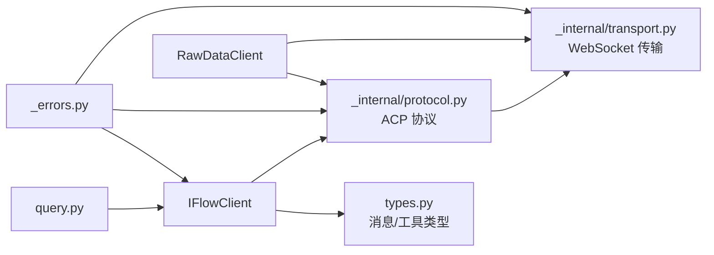
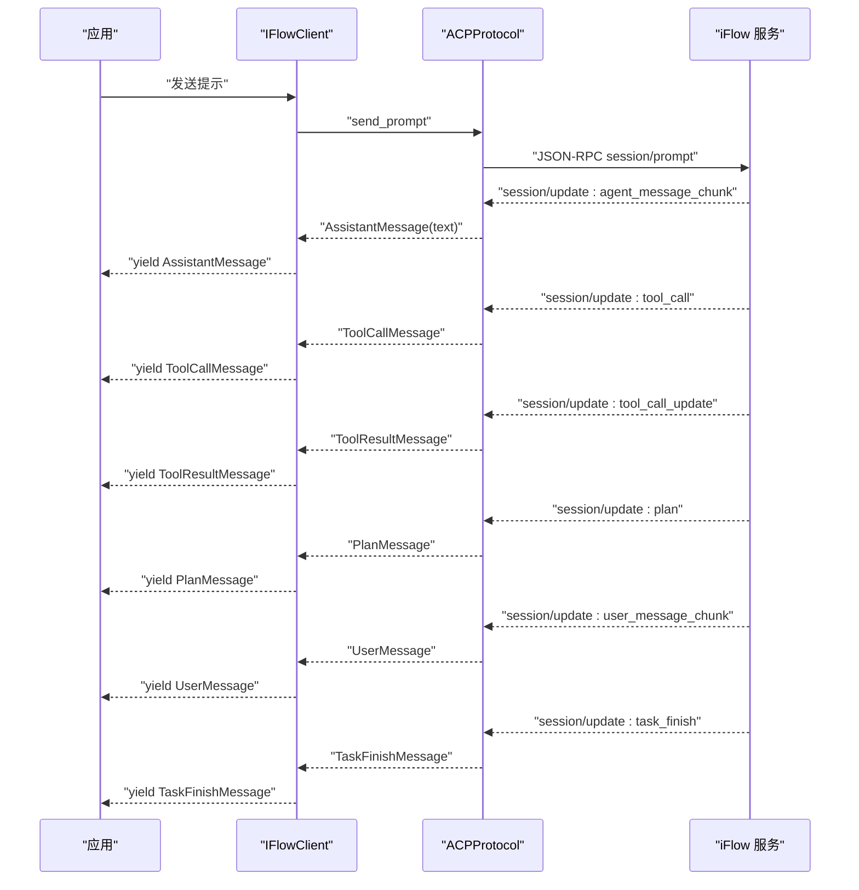

# 消息类型

<cite>
**本文引用的文件**
- [types.py](file://types.py)
- [client.py](file://client.py)
- [raw_client.py](file://raw_client.py)
- [_internal/protocol.py](file://_internal/protocol.py)
- [_internal/transport.py](file://_internal/transport.py)
- [query.py](file://query.py)
- [_errors.py](file://_errors.py)
</cite>

## 目录
1. [简介](#简介)
2. [项目结构](#项目结构)
3. [核心组件](#核心组件)
4. [架构总览](#架构总览)
5. [详细组件分析](#详细组件分析)
6. [依赖分析](#依赖分析)
7. [性能考虑](#性能考虑)
8. [故障排查指南](#故障排查指南)
9. [结论](#结论)
10. [附录](#附录)

## 简介
本文件聚焦于 iFlow SDK 中的消息类型与数据模型，系统性梳理 Message 基类及其派生类型（UserMessage、AssistantMessage、ToolCallMessage、ToolResultMessage、ToolConfirmationRequestMessage、PlanMessage、TaskFinishMessage、ErrorMessage），并说明它们在客户端与 iFlow 服务之间的数据流。同时提供在 receive_messages() 循环中识别与处理不同消息类型的实践建议，并通过序列图展示典型对话中的消息交换模式。

## 项目结构
SDK 的消息类型定义集中在 types.py；客户端与协议层分别位于 client.py、_internal/protocol.py、_internal/transport.py；query.py 提供便捷查询函数；_errors.py 定义异常体系。

图表来源
- [types.py](file://types.py#L454-L720)
- [client.py](file://client.py#L1-L120)
- [_internal/protocol.py](file://_internal/protocol.py#L1-L120)
- [_internal/transport.py](file://_internal/transport.py#L1-L80)
- [query.py](file://query.py#L1-L40)
- [_errors.py](file://_errors.py#L1-L40)

章节来源
- [types.py](file://types.py#L454-L720)
- [client.py](file://client.py#L1-L120)
- [_internal/protocol.py](file://_internal/protocol.py#L1-L120)
- [_internal/transport.py](file://_internal/transport.py#L1-L80)
- [query.py](file://query.py#L1-L40)
- [_errors.py](file://_errors.py#L1-L40)

## 核心组件
- Message 基类：统一的“type”字段标识消息类型，子类通过 to_dict 实现协议格式转换。
- 具体消息类型：
  - UserMessage：用户输入分片集合。
  - AssistantMessage：助手输出分片，可携带 agent_id 与 AgentInfo。
  - ToolCallMessage：工具调用开始或状态更新（含 id、label、icon、status、tool_name、content、locations、confirmation、agent_id、agent_info、args）。
  - ToolResultMessage：工具调用结果（与 ToolCallMessage 字段一致，用于结果通知）。
  - ToolConfirmationRequestMessage：工具确认请求（包含 session_id、tool_call、options、request_id）。
  - PlanMessage：任务计划条目列表。
  - TaskFinishMessage：任务结束通知（包含 stop_reason）。
  - ErrorMessage：错误消息（包含 code、message、details）。
- 工具与辅助类型：ToolCall、ToolCallContent、ToolCallLocation、Icon、PermissionOption、AgentInfo、StopReason、ApprovalMode 等。

章节来源
- [types.py](file://types.py#L454-L720)
- [types.py](file://types.py#L1-L120)
- [types.py](file://types.py#L120-L220)
- [types.py](file://types.py#L220-L360)
- [types.py](file://types.py#L360-L454)

## 架构总览
消息在客户端与 iFlow 服务之间的数据流如下：
- 客户端通过 WebSocketTransport 连接 iFlow，使用 ACPProtocol 处理 JSON-RPC 请求/响应与服务器推送。
- IFlowClient 将协议层的原始消息映射为 SDK 的 Message 对象，放入内部队列，供 receive_messages() 异步迭代消费。
- 当出现工具调用需要确认时，协议层会生成 ToolConfirmationRequestMessage 并等待用户响应；用户通过 IFlowClient 的方法提交选择，协议层再回传给 iFlow。

图表来源
- [client.py](file://client.py#L510-L570)
- [_internal/protocol.py](file://_internal/protocol.py#L499-L566)
- [_internal/transport.py](file://_internal/transport.py#L114-L146)

## 详细组件分析

### Message 基类与继承关系
- 基类 Message：统一 type 字段，to_dict 返回 {"type": self.type}。
- 继承类：
  - UserMessage：type="user"，chunks 为 UserMessageChunk 列表。
  - AssistantMessage：type="assistant"，chunk 为 AssistantMessageChunk，可选 agent_id 与 AgentInfo。
  - ToolCallMessage：type="tool_call"，包含 id、label、icon、status、tool_name、content、locations、confirmation、agent_id、agent_info、args。
  - ToolResultMessage：type="tool_call"，字段与 ToolCallMessage 一致，用于结果通知。
  - ToolConfirmationRequestMessage：type="tool_confirmation_request"，包含 session_id、tool_call、options、request_id。
  - PlanMessage：type="plan"，entries 为 PlanEntry 列表。
  - TaskFinishMessage：type="task_finish"，stop_reason 为 StopReason。
  - ErrorMessage：type="error"，包含 code、message、details。

图表来源
- [types.py](file://types.py#L454-L720)

章节来源
- [types.py](file://types.py#L454-L720)

### 具体消息类型详解

#### UserMessage
- 字段与用途
  - chunks：用户输入的分片列表，每个分片支持文本或文件路径。
- 转换规则
  - to_dict 输出 {"type": "user", "chunks": [...]}，其中每个分片按其类型转换为协议格式。
- 典型场景
  - 用户发送带图片/音频/资源链接的多模态消息。

章节来源
- [types.py](file://types.py#L466-L480)

#### AssistantMessage
- 字段与用途
  - chunk：AssistantMessageChunk，包含 text 或 thought 二选一。
  - agent_id：可选，标识子代理。
  - agent_info：可选，从 ACP 数据解析出的代理信息。
- 转换规则
  - to_dict 输出 {"type": "assistant", ...}，根据存在性包含 text、thought、agent_id、agent_info。
- 典型场景
  - 流式输出文本或思考过程；支持多代理场景。

章节来源
- [types.py](file://types.py#L481-L507)

#### ToolCallMessage 与 ToolResultMessage
- 字段与用途
  - id、label、icon：工具标识与显示信息。
  - status：ToolCallStatus，枚举值包括 pending、in_progress、completed、failed 等。
  - tool_name：工具名称（新字段）。
  - content：ToolCallContent，支持 markdown 或 diff 内容。
  - locations：ToolCallLocation 列表，定位到文件位置。
  - confirmation：ToolCallConfirmation，描述工具类型与参数。
  - agent_id、agent_info：代理上下文。
  - args：工具调用参数字典。
- 转换规则
  - to_dict 输出包含上述字段，必要字段按协议格式命名。
- 典型场景
  - 工具调用开始（ToolCallMessage）与中间/最终结果（ToolResultMessage）。

章节来源
- [types.py](file://types.py#L510-L587)
- [types.py](file://types.py#L553-L587)

#### ToolConfirmationRequestMessage
- 字段与用途
  - session_id：会话标识。
  - tool_call：ToolCall 对象，描述即将执行的工具调用。
  - options：PermissionOption 列表，用户可选的确认结果。
  - request_id：内部请求 ID，用于后续响应。
- 转换规则
  - to_dict 输出 {"type": "tool_confirmation_request", ...}。
- 典型场景
  - iFlow 需要用户授权某次工具调用，SDK 将该消息上抛至应用层，由应用决定 proceed_once、proceed_always 等选项。

章节来源
- [types.py](file://types.py#L590-L626)

#### PlanMessage
- 字段与用途
  - entries：PlanEntry 列表，每项包含 content、priority、status。
- 转换规则
  - to_dict 输出 {"type": "plan", "entries": [...]}。
- 典型场景
  - iFlow 在推理过程中输出阶段性计划，客户端可渲染或记录。

章节来源
- [types.py](file://types.py#L628-L654)

#### TaskFinishMessage
- 字段与用途
  - stop_reason：StopReason，表示任务结束的原因（如 end_turn、max_tokens、refusal、cancelled）。
- 转换规则
  - to_dict 输出 {"type": "task_finish", "stop_reason": ...}。
- 典型场景
  - 对话轮次结束或被中断，客户端据此停止消费消息。

章节来源
- [types.py](file://types.py#L656-L672)

#### ErrorMessage
- 字段与用途
  - code、message、details：错误码、错误信息与详情。
- 转换规则
  - to_dict 输出 {"type": "error", ...}。
- 典型场景
  - 协议解析失败、网络异常、认证失败等错误事件。

章节来源
- [types.py](file://types.py#L674-L688)

### 工具与辅助类型
- ToolCallStatus、ToolCallConfirmationOutcome、ApprovalMode、HookEventType、StopReason：枚举类型，控制工具调用权限与生命周期。
- ToolCall、ToolCallContent、ToolCallLocation、Icon、PermissionOption：工具调用的结构化描述与内容载体。
- AgentInfo：从 ACP 的 agentId 解析出的任务/实例/索引/时间戳等信息。
- PlanEntry：计划条目。

章节来源
- [types.py](file://types.py#L1-L120)
- [types.py](file://types.py#L120-L220)
- [types.py](file://types.py#L220-L360)
- [types.py](file://types.py#L360-L454)

## 依赖分析
- IFlowClient 依赖 types 中的消息类型与工具类型，负责：
  - 连接与初始化（协议握手、认证、会话创建）。
  - 将协议层的原始消息映射为 SDK 的 Message 对象，入队后供 receive_messages() 迭代消费。
  - 处理工具确认请求（respond_to_tool_confirmation/cancel_tool_confirmation）。
- ACPProtocol 依赖 WebSocketTransport，负责：
  - JSON-RPC 初始化、认证、会话管理。
  - 将服务器推送（session/update、request_permission 等）转换为 SDK 可消费的消息。
  - 处理权限请求的用户响应并回传给服务器。
- WebSocketTransport 提供底层连接、发送、接收能力，屏蔽网络细节。

图表来源
- [client.py](file://client.py#L1-L120)
- [_internal/protocol.py](file://_internal/protocol.py#L1-L120)
- [_internal/transport.py](file://_internal/transport.py#L1-L80)
- [raw_client.py](file://raw_client.py#L72-L120)
- [query.py](file://query.py#L1-L40)
- [_errors.py](file://_errors.py#L1-L40)

章节来源
- [client.py](file://client.py#L1-L120)
- [_internal/protocol.py](file://_internal/protocol.py#L1-L120)
- [_internal/transport.py](file://_internal/transport.py#L1-L80)
- [raw_client.py](file://raw_client.py#L72-L120)
- [query.py](file://query.py#L1-L40)
- [_errors.py](file://_errors.py#L1-L40)

## 性能考虑
- 流式消费：receive_messages() 使用异步迭代器与超时机制，避免阻塞；建议在应用侧尽快消费并丢弃不再需要的消息。
- 消息映射：IFlowClient._process_message 对 ACP 更新进行分类映射，尽量减少不必要的对象构造。
- 文件访问：当启用文件系统访问时，注意文件大小限制与只读模式配置，避免大文件传输带来的内存压力。
- 重连与退避：连接失败时采用指数退避策略，降低对服务端的压力。

[本节为通用指导，不直接分析具体文件]

## 故障排查指南
- 连接与认证
  - 若连接失败，检查 WebSocket URL、超时设置与网络可达性；查看 _errors.ConnectionError。
  - 认证失败时，检查认证方法 ID 与认证信息；查看 _errors.AuthenticationError。
- 协议错误
  - 初始化/会话创建失败时，查看 _errors.ProtocolError；关注 ACPProtocol 的日志输出。
  - JSON 解析失败时，查看 _errors.JSONDecodeError，确认消息格式是否符合协议。
- 工具确认
  - 收到 ToolConfirmationRequestMessage 后未及时响应会导致会话阻塞；确保调用 respond_to_tool_confirmation/cancel_tool_confirmation。
- 错误消息
  - ErrorMessage 包含 code/message/details，便于快速定位问题。

章节来源
- [_errors.py](file://_errors.py#L1-L85)
- [_internal/protocol.py](file://_internal/protocol.py#L176-L256)
- [client.py](file://client.py#L568-L639)

## 结论
本文件系统梳理了 iFlow SDK 的消息类型与数据模型，明确了 Message 基类及各派生类型的字段与用途，并结合客户端与协议层的交互流程，给出了在 receive_messages() 循环中识别与处理不同类型消息的实践建议。通过序列图与类图，读者可以快速理解消息在客户端与 iFlow 服务之间的流转方式。

[本节为总结性内容，不直接分析具体文件]

## 附录

### 在 receive_messages() 循环中识别与处理消息的实践建议
- 基本模式
  - 使用 isinstance 判断消息类型，分别处理 AssistantMessage、ToolConfirmationRequestMessage、ToolCallMessage/ToolResultMessage、PlanMessage、TaskFinishMessage、ErrorMessage。
- 工具确认
  - 收到 ToolConfirmationRequestMessage 时，读取 options 与 request_id，调用 respond_to_tool_confirmation 或 cancel_tool_confirmation。
- 任务结束
  - 收到 TaskFinishMessage 后，停止消费并清理资源。
- 错误处理
  - 收到 ErrorMessage 时，记录 details 并根据 code 决定重试或终止。

章节来源
- [client.py](file://client.py#L510-L570)
- [client.py](file://client.py#L568-L639)
- [query.py](file://query.py#L56-L71)

### 典型对话中的消息交换序列

图表来源
- [client.py](file://client.py#L640-L800)
- [_internal/protocol.py](file://_internal/protocol.py#L547-L597)