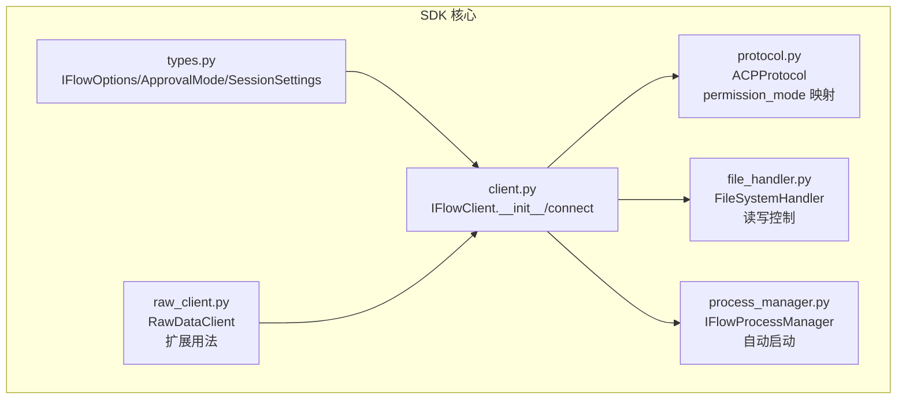
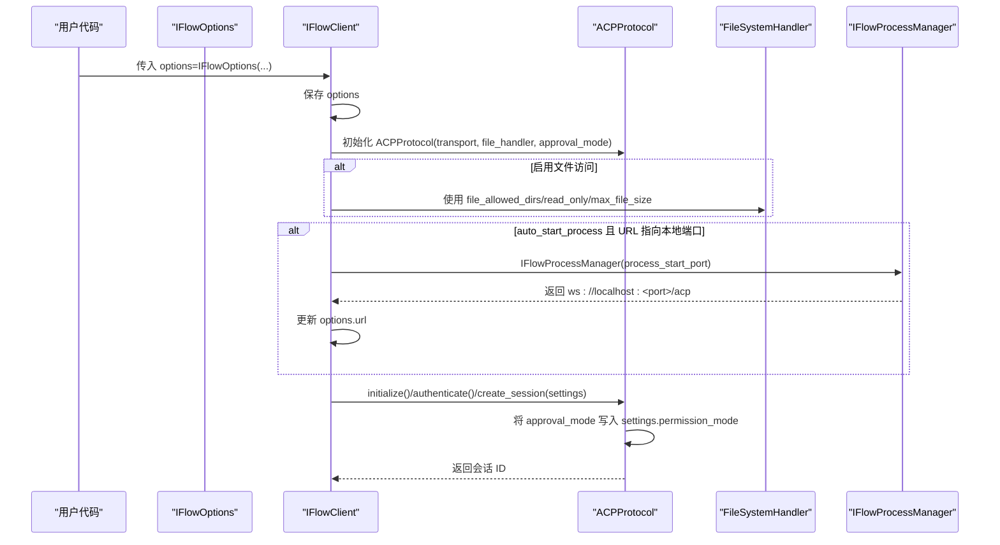
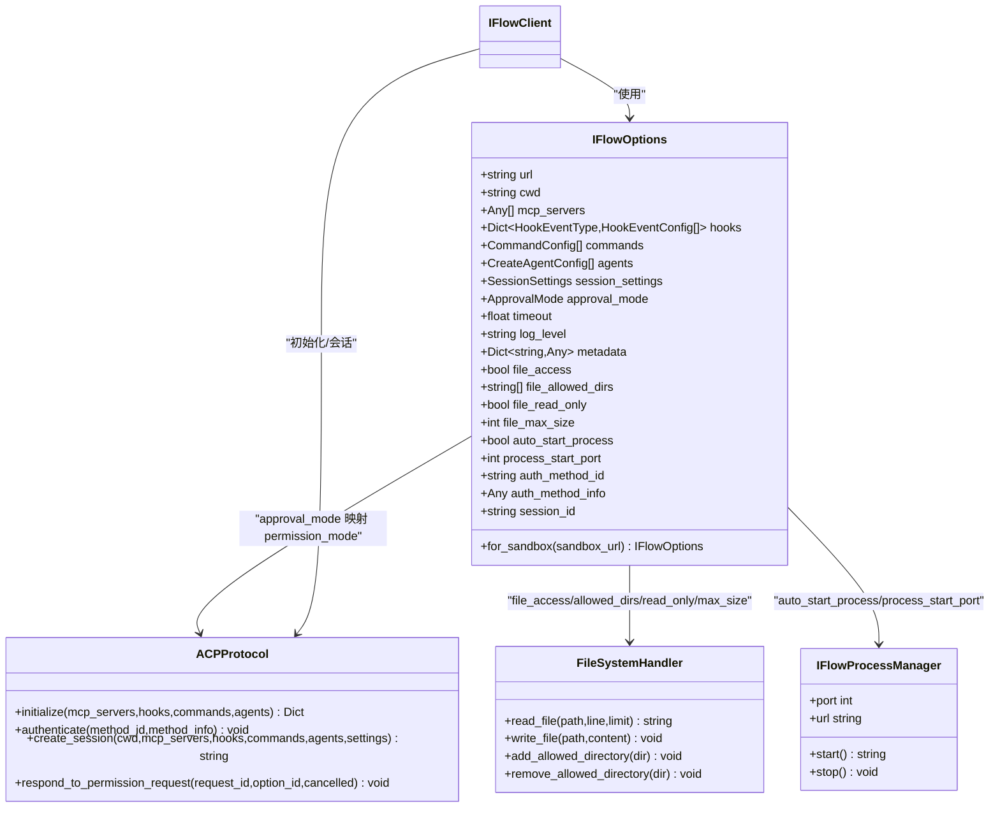

# 配置选项

<cite>
**本文引用的文件**
- [client.py](file://client.py)
- [types.py](file://types.py)
- [protocol.py](file://_internal/protocol.py)
- [file_handler.py](file://_internal/file_handler.py)
- [process_manager.py](file://_internal/process_manager.py)
- [raw_client.py](file://raw_client.py)
- [__init__.py](file://__init__.py)
</cite>

## 目录
1. [简介](#简介)
2. [项目结构](#项目结构)
3. [核心组件](#核心组件)
4. [架构总览](#架构总览)
5. [详细组件分析](#详细组件分析)
6. [依赖关系分析](#依赖关系分析)
7. [性能与安全考量](#性能与安全考量)
8. [故障排查指南](#故障排查指南)
9. [结论](#结论)
10. [附录：默认值与最佳实践](#附录默认值与最佳实践)

## 简介
本文件面向 iFlow SDK 的使用者，系统性梳理 IFlowOptions 配置类及其全部属性，并结合客户端初始化流程说明如何正确应用这些配置。重点覆盖：
- url、approval_mode、file_access、file_allowed_dirs、auto_start_process、process_start_port 等关键选项的作用与默认值
- 如何通过 for_sandbox() 创建沙箱模式配置
- 不同 ApprovalMode（如 YOLO、DEFAULT）的行为差异与适用场景
- 在 IFlowClient 初始化时如何应用配置
- 安全相关的配置项（文件访问控制、读写权限）
- 默认值与最佳实践建议

## 项目结构
围绕 IFlowOptions 的实现与使用，涉及以下关键文件：
- types.py：定义 IFlowOptions、ApprovalMode、SessionSettings 等类型
- client.py：IFlowClient 初始化与连接逻辑，消费 IFlowOptions
- protocol.py：ACP 协议层，将 approval_mode 映射为 session_settings.permission_mode
- file_handler.py：文件系统访问控制与读写策略
- process_manager.py：自动启动 iFlow 进程与端口管理
- raw_client.py：扩展 RawDataClient，展示如何以 options 为入口进行配置
- __init__.py：对外导出 IFlowOptions 类型

图表来源
- [types.py](file://types.py#L996-L1065)
- [client.py](file://client.py#L110-L318)
- [_internal/protocol.py](file://_internal/protocol.py#L21-L78)
- [_internal/file_handler.py](file://_internal/file_handler.py#L16-L217)
- [_internal/process_manager.py](file://_internal/process_manager.py#L25-L254)
- [raw_client.py](file://raw_client.py#L72-L116)

章节来源
- [types.py](file://types.py#L996-L1065)
- [client.py](file://client.py#L110-L318)
- [raw_client.py](file://raw_client.py#L72-L116)

## 核心组件
- IFlowOptions：SDK 的全局配置载体，包含连接地址、工作目录、MCP 服务器、钩子、命令、代理、会话设置、审批模式、超时、日志级别、元数据、文件访问控制、自动启动进程等。
- ApprovalMode：枚举，决定工具调用权限请求策略（DEFAULT、AUTO_EDIT、YOLO、PLAN），最终映射为 session_settings.permission_mode。
- SessionSettings：会话级配置，支持 allowed_tools、system_prompt、append_system_prompt、permission_mode、max_turns、disallowed_tools、add_dirs 等字段。
- FileSystemHandler：文件系统访问处理器，受 file_access、file_allowed_dirs、file_read_only、file_max_size 控制。
- IFlowProcessManager：自动启动 iFlow 进程，受 auto_start_process、process_start_port 控制。
- ACPProtocol：协议层，接收 approval_mode 并将其写入 session_settings.permission_mode。

章节来源
- [types.py](file://types.py#L56-L73)
- [types.py](file://types.py#L894-L923)
- [types.py](file://types.py#L996-L1065)
- [_internal/file_handler.py](file://_internal/file_handler.py#L16-L217)
- [_internal/process_manager.py](file://_internal/process_manager.py#L25-L254)
- [_internal/protocol.py](file://_internal/protocol.py#L21-L78)

## 架构总览
下图展示了 IFlowClient 初始化时如何消费 IFlowOptions，并将 ApprovalMode 映射到会话设置，以及文件系统与进程管理的集成点。

图表来源
- [client.py](file://client.py#L110-L318)
- [_internal/protocol.py](file://_internal/protocol.py#L21-L78)
- [_internal/file_handler.py](file://_internal/file_handler.py#L16-L217)
- [_internal/process_manager.py](file://_internal/process_manager.py#L152-L204)

## 详细组件分析

### IFlowOptions 属性详解
- url
  - 作用：WebSocket 连接地址，默认指向本地 8090 端口的 ACP 接口。
  - 影响：用于建立与 iFlow 的 WebSocket 连接；在 auto_start_process 生效时，若 URL 指向本地端口，客户端会尝试自动启动 iFlow 进程并更新该 URL。
  - 参考路径：[client.py](file://client.py#L150-L188)，[types.py](file://types.py#L1024-L1025)
- approval_mode
  - 作用：控制工具调用权限请求策略，最终写入 session_settings.permission_mode。
  - 行为差异：
    - DEFAULT：每次工具调用前请求用户确认（调用 requestPermission）。
    - AUTO_EDIT：自动执行所有工具，不触发权限请求。
    - YOLO：自动执行并允许错误时自动回退。
    - PLAN：仅允许只读工具，阻止写操作。
  - 参考路径：[types.py](file://types.py#L56-L73)，[client.py](file://client.py#L285-L288)，[_internal/protocol.py](file://_internal/protocol.py#L21-L78)
- file_access
  - 作用：启用/禁用文件系统访问能力。
  - 影响：启用后创建 FileSystemHandler，用于处理 fs/read_text_file 和 fs/write_text_file 请求。
  - 参考路径：[client.py](file://client.py#L189-L199)，[_internal/file_handler.py](file://_internal/file_handler.py#L16-L217)
- file_allowed_dirs
  - 作用：白名单目录列表，限制可访问的文件路径范围。
  - 默认：None 表示默认仅当前工作目录。
  - 参考路径：[client.py](file://client.py#L191-L196)，[_internal/file_handler.py](file://_internal/file_handler.py#L29-L58)
- file_read_only
  - 作用：是否启用只读模式。
  - 影响：启用后禁止写操作，写入将被拒绝。
  - 参考路径：[client.py](file://client.py#L191-L196)，[_internal/file_handler.py](file://_internal/file_handler.py#L160-L193)
- file_max_size
  - 作用：读取文件的最大字节数限制。
  - 参考路径：[client.py](file://client.py#L191-L196)，[_internal/file_handler.py](file://_internal/file_handler.py#L116-L129)
- auto_start_process
  - 作用：当 URL 指向本地端口且服务未运行时，自动启动 iFlow 进程。
  - 参考路径：[client.py](file://client.py#L150-L188)，[_internal/process_manager.py](file://_internal/process_manager.py#L152-L204)
- process_start_port
  - 作用：自动启动时的起始端口号。
  - 参考路径：[client.py](file://client.py#L174-L178)，[_internal/process_manager.py](file://_internal/process_manager.py#L152-L204)
- 其他常用属性
  - cwd：会话工作目录，默认当前工作目录。
  - mcp_servers、hooks、commands、agents：扩展配置，用于注册 MCP 服务器、钩子、命令与代理。
  - session_settings：会话级设置，包含 permission_mode 字段。
  - timeout、log_level、metadata：连接超时、日志级别、附加元数据。
  - auth_method_id、auth_method_info：认证方法标识与参数。
  - session_id：指定加载已有会话（当前版本存在兼容性限制）。

章节来源
- [types.py](file://types.py#L996-L1065)
- [client.py](file://client.py#L110-L318)
- [_internal/file_handler.py](file://_internal/file_handler.py#L16-L217)
- [_internal/process_manager.py](file://_internal/process_manager.py#L152-L204)

### for_sandbox() 方法
- 作用：快速生成沙箱模式的 IFlowOptions，适用于在线沙箱环境。
- 特点：保留 permission_mode、auto_approve_types、timeout、log_level、metadata 等字段，替换 url 为沙箱地址。
- 使用建议：在需要隔离本地资源、避免写操作或访问受限目录时优先考虑沙箱模式。

章节来源
- [types.py](file://types.py#L1046-L1065)

### ApprovalMode 行为差异
- DEFAULT
  - 适用：需要对每次工具调用进行人工确认的高安全场景。
  - 行为：ACP 层触发权限请求，等待用户选择“一次性通过”、“总是通过”或“取消”。
- AUTO_EDIT
  - 适用：自动化程度较高、信任工具行为的场景。
  - 行为：不触发权限请求，直接执行工具。
- YOLO
  - 适用：探索性实验、容错性要求高的场景。
  - 行为：自动执行并在失败时自动回退。
- PLAN
  - 适用：只读审计、安全扫描等场景。
  - 行为：仅允许只读工具，写操作被阻断。

章节来源
- [types.py](file://types.py#L56-L73)
- [client.py](file://client.py#L285-L288)
- [_internal/protocol.py](file://_internal/protocol.py#L567-L597)

### 在 IFlowClient 初始化时应用配置
- 基本用法
  - 通过构造函数传入 IFlowOptions 实例，SDK 会在 connect() 中读取并应用各项配置。
  - 示例参考：[client.py](file://client.py#L110-L131)
- 关键应用点
  - 文件系统：根据 file_access、file_allowed_dirs、file_read_only、file_max_size 创建 FileSystemHandler。
  - 进程管理：根据 auto_start_process 与 process_start_port 自动启动 iFlow 并更新 URL。
  - 会话设置：将 approval_mode 写入 session_settings.permission_mode，影响工具调用权限策略。
  - 认证与会话：按需进行 authenticate 与 create_session，并传递 mcp_servers、hooks、commands、agents、settings 等。

章节来源
- [client.py](file://client.py#L132-L318)
- [_internal/protocol.py](file://_internal/protocol.py#L257-L346)

### 安全相关配置与最佳实践
- 文件访问控制
  - 默认关闭 file_access，避免不必要的文件系统暴露。
  - 若开启，务必明确 file_allowed_dirs 白名单，避免路径穿越。
  - 设置合理的 file_max_size，防止大文件读取导致内存压力。
  - 在需要时启用 file_read_only，严格限制写操作。
- 审批模式选择
  - 开发调试：DEFAULT 或 YOLO（视容错需求）。
  - 生产环境：PLAN 或 DEFAULT，优先保证只读与人工确认。
- 进程与网络
  - auto_start_process 仅在本地 URL 场景生效，避免远程沙箱误启动本地进程。
  - 沙箱模式使用 for_sandbox()，避免本地文件系统与写操作风险。

章节来源
- [_internal/file_handler.py](file://_internal/file_handler.py#L16-L217)
- [types.py](file://types.py#L1036-L1041)
- [client.py](file://client.py#L150-L199)

## 依赖关系分析
- IFlowOptions 与 IFlowClient
  - IFlowClient 在 __init__ 中保存 options，并在 connect 中读取其字段。
- IFlowOptions 与 ACPProtocol
  - ACPProtocol 接收 approval_mode，但不直接使用其逻辑，而是由 iFlow 核心调度器基于 permission_mode 决定是否请求权限。
- IFlowOptions 与 FileSystemHandler
  - 当 file_access 为真时，FileSystemHandler 被创建并受 allowed_dirs、read_only、max_file_size 约束。
- IFlowOptions 与 IFlowProcessManager
  - auto_start_process 与 process_start_port 控制自动启动与端口分配。

图表来源
- [types.py](file://types.py#L996-L1065)
- [_internal/protocol.py](file://_internal/protocol.py#L21-L78)
- [_internal/file_handler.py](file://_internal/file_handler.py#L16-L217)
- [_internal/process_manager.py](file://_internal/process_manager.py#L25-L254)
- [client.py](file://client.py#L110-L318)

## 性能与安全考量
- 性能
  - 合理设置 timeout，避免长时间阻塞。
  - 适当降低 file_max_size，减少大文件读取带来的内存占用。
  - 在不需要时禁用 auto_start_process，避免额外进程开销。
- 安全
  - 默认关闭 file_access，必要时再开启并限定 allowed_dirs。
  - 在生产环境优先使用 DEFAULT 或 PLAN，减少自动执行风险。
  - 使用 for_sandbox() 进行隔离测试，避免污染本地文件系统。

[本节为通用指导，无需特定文件来源]

## 故障排查指南
- 连接失败
  - 检查 url 是否可达；若使用本地端口且 auto_start_process 为真，确认 iFlow 已安装并可执行。
  - 查看日志级别 log_level，必要时提升至更详细的级别。
- 权限请求频繁
  - 切换 approval_mode 为 AUTO_EDIT 或 YOLO 以减少交互成本；或在 PLAN 下仅允许只读工具。
- 文件访问被拒
  - 确认 file_allowed_dirs 是否包含目标路径；检查 file_read_only 是否启用；核对 file_max_size。
- 自动启动失败
  - 检查 process_start_port 是否可用；确认系统已安装 iFlow CLI；查看 IFlowNotInstalledError 的提示信息。

章节来源
- [client.py](file://client.py#L150-L188)
- [_internal/file_handler.py](file://_internal/file_handler.py#L110-L193)
- [_internal/process_manager.py](file://_internal/process_manager.py#L58-L114)

## 结论
IFlowOptions 是 SDK 的配置中枢，贯穿连接、会话、文件系统与进程管理等关键环节。通过合理设置 approval_mode、file_access、auto_start_process 等选项，可以在安全性与易用性之间取得平衡。推荐在开发阶段使用 DEFAULT 或 YOLO，在生产阶段采用 PLAN 或 DEFAULT，并配合 for_sandbox() 进行隔离验证。

[本节为总结，无需特定文件来源]

## 附录：默认值与最佳实践
- 默认值
  - url：ws://localhost:8090/acp
  - cwd：当前工作目录
  - approval_mode：YOLO
  - timeout：30.0 秒
  - log_level：INFO
  - file_access：False
  - file_allowed_dirs：None（默认仅当前工作目录）
  - file_read_only：False
  - file_max_size：10MB
  - auto_start_process：True
  - process_start_port：8090
  - auth_method_id：None
  - session_id：None
- 最佳实践
  - 生产环境：PLAN 或 DEFAULT；禁用 file_access；显式设置 allowed_dirs；限制 timeout。
  - 开发调试：DEFAULT 或 YOLO；按需开启 file_access 并限定目录；使用 for_sandbox() 进行隔离测试。
  - 自动化：AUTO_EDIT；谨慎使用 YOLO，注意错误回退策略。

章节来源
- [types.py](file://types.py#L1024-L1045)
- [client.py](file://client.py#L110-L131)