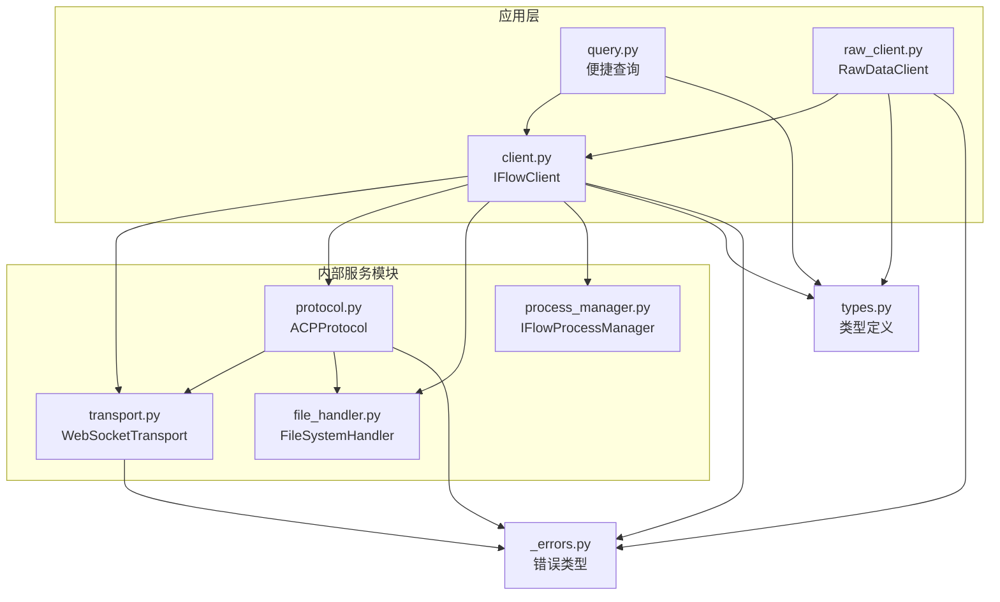
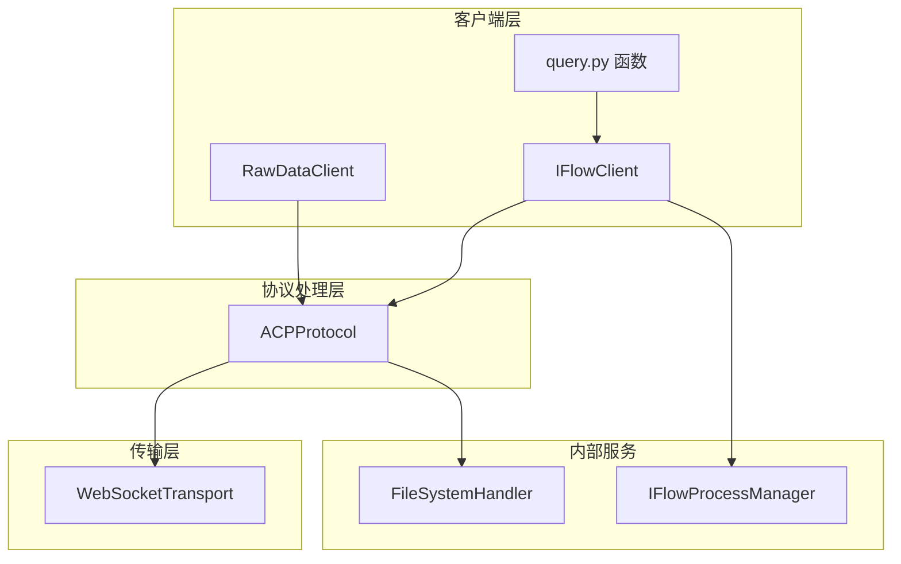
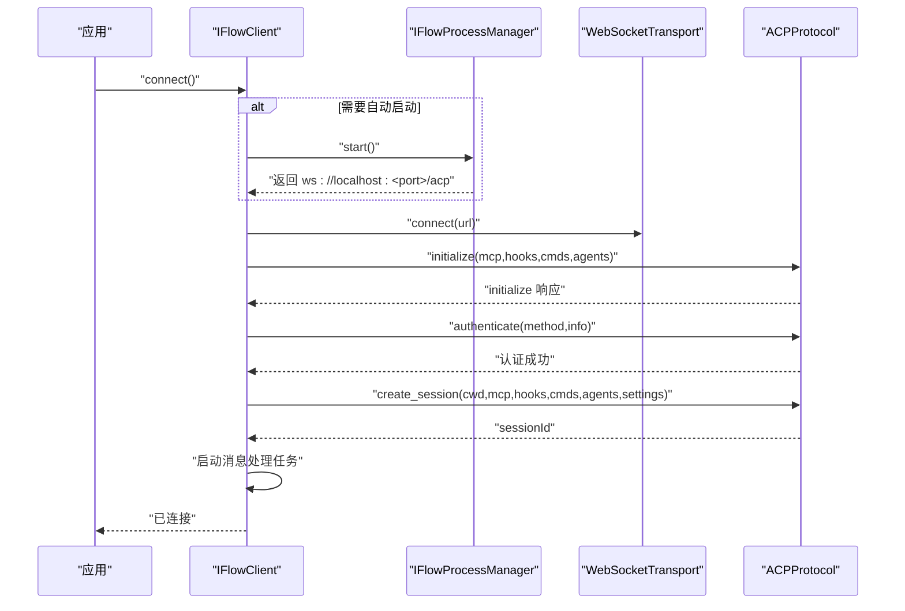
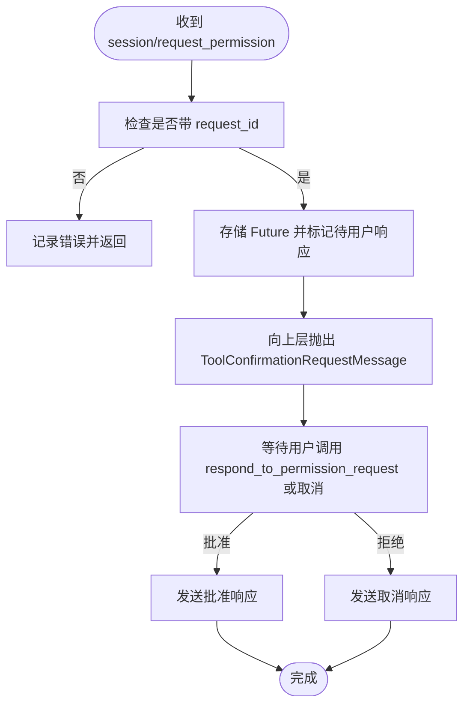
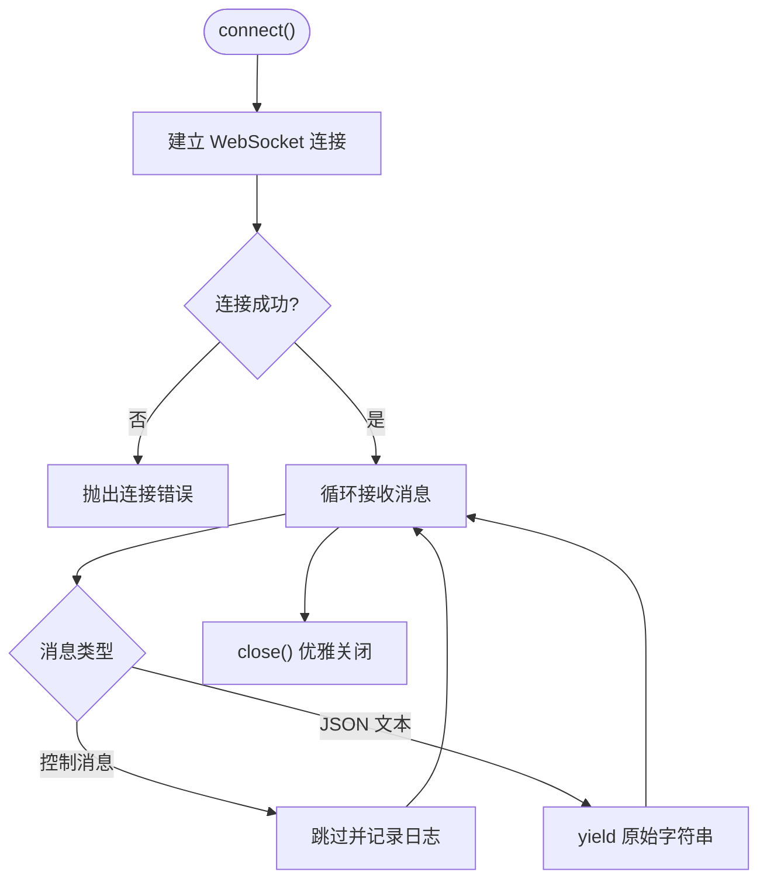
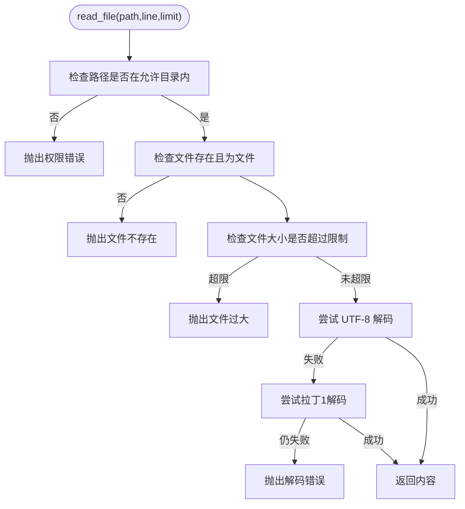
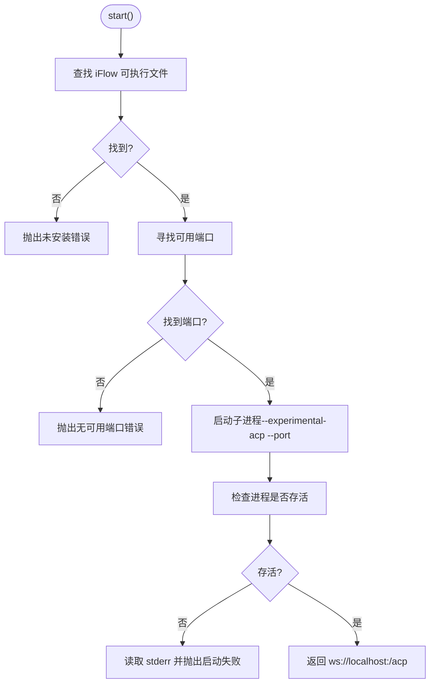
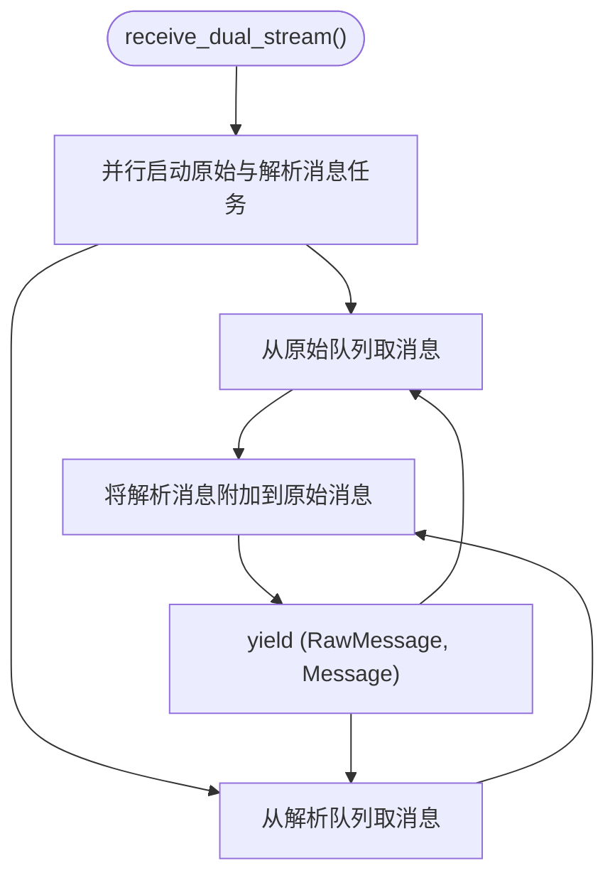
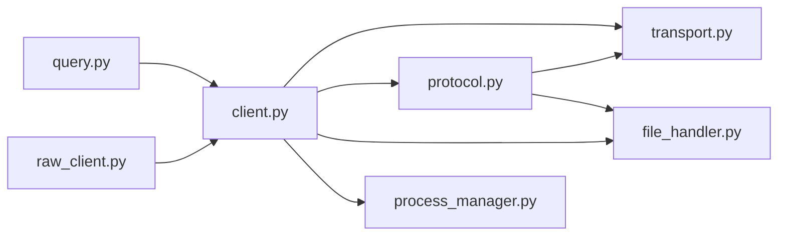

# 项目概述

<cite>
**本文引用的文件列表**
- [__init__.py](file://__init__.py)
- [client.py](file://client.py)
- [raw_client.py](file://raw_client.py)
- [query.py](file://query.py)
- [types.py](file://types.py)
- [_internal/protocol.py](file://_internal/protocol.py)
- [_internal/transport.py](file://_internal/transport.py)
- [_internal/file_handler.py](file://_internal/file_handler.py)
- [_internal/process_manager.py](file://_internal/process_manager.py)
- [_errors.py](file://_errors.py)
</cite>

## 目录
1. [引言](#引言)
2. [项目结构](#项目结构)
3. [核心组件](#核心组件)
4. [架构总览](#架构总览)
5. [详细组件分析](#详细组件分析)
6. [依赖关系分析](#依赖关系分析)
7. [性能与可扩展性](#性能与可扩展性)
8. [故障排查指南](#故障排查指南)
9. [结论](#结论)
10. [附录：典型使用场景](#附录典型使用场景)

## 引言
iflow_sdk 是一个为 iFlow AI 代理提供 Python 接口的 SDK，围绕 Agent Communication Protocol（ACP）实现双向通信。其核心目标包括：
- 实时流式响应：通过会话更新与增量消息块，提供近实时的助手输出。
- 工具调用确认：在需要时请求用户确认，支持“一次性”“总是允许”等策略。
- 自动进程管理：在本地开发场景下自动发现并启动 iFlow 进程，简化接入。
- 安全的文件系统访问：通过白名单目录、路径穿越防护、大小限制与只读模式，保障文件操作安全。

SDK 提供两类主要入口：
- IFlowClient：面向复杂交互的双向客户端，支持中断、动态消息发送、工具确认与会话管理。
- query 系列便捷函数：面向简单查询的一次性调用，适合批处理与自动化脚本。

## 项目结构
项目采用分层与按职责划分的组织方式：
- 导出入口：__init__.py 聚合导出错误类型、主客户端、原始数据客户端、便捷查询函数与类型定义。
- 核心客户端：client.py 提供 IFlowClient 的完整实现。
- 原始数据客户端：raw_client.py 在 IFlowClient 基础上提供原始消息流与调试能力。
- 便捷查询：query.py 提供 query、query_stream、query_sync 三个便捷函数。
- 类型系统：types.py 定义消息、配置、枚举与协议配置类型。
- 内部模块：
  - _internal/protocol.py：ACP 协议实现，负责初始化、认证、会话、提示发送、权限请求与文件系统方法处理。
  - _internal/transport.py：WebSocket 传输层，负责连接、收发与错误处理。
  - _internal/file_handler.py：文件系统处理器，实现 fs/read_text_file 与 fs/write_text_file 的安全访问。
  - _internal/process_manager.py：iFlow 进程管理器，负责自动发现、端口选择与进程生命周期管理。
- 错误体系：_errors.py 定义统一异常基类与各类错误类型。

图示来源
- [client.py](file://client.py#L1-L120)
- [raw_client.py](file://raw_client.py#L1-L120)
- [query.py](file://query.py#L1-L80)
- [_internal/transport.py](file://_internal/transport.py#L1-L120)
- [_internal/protocol.py](file://_internal/protocol.py#L1-L120)
- [_internal/file_handler.py](file://_internal/file_handler.py#L1-L120)
- [_internal/process_manager.py](file://_internal/process_manager.py#L1-L120)
- [_errors.py](file://_errors.py#L1-L85)
- [types.py](file://types.py#L1-L120)

章节来源
- [__init__.py](file://__init__.py#L1-L142)
- [client.py](file://client.py#L1-L120)
- [raw_client.py](file://raw_client.py#L1-L120)
- [query.py](file://query.py#L1-L80)
- [types.py](file://types.py#L1-L120)
- [_internal/transport.py](file://_internal/transport.py#L1-L120)
- [_internal/protocol.py](file://_internal/protocol.py#L1-L120)
- [_internal/file_handler.py](file://_internal/file_handler.py#L1-L120)
- [_internal/process_manager.py](file://_internal/process_manager.py#L1-L120)
- [_errors.py](file://_errors.py#L1-L85)

## 核心组件
- IFlowClient：双向交互客户端，封装连接、认证、会话创建/加载、消息发送、中断、工具确认与消息处理队列。
- ACPProtocol：ACP 协议实现，负责 initialize、authenticate、session/new、session/prompt、session/cancel、权限请求与文件系统方法的处理。
- WebSocketTransport：低层 WebSocket 传输，负责连接、收发与错误恢复。
- FileSystemHandler：安全文件系统访问，支持白名单目录、路径穿越防护、大小限制与只读模式。
- IFlowProcessManager：自动发现 iFlow 可执行文件、寻找可用端口并启动/停止进程。
- RawDataClient：在 IFlowClient 基础上提供原始消息流、双流（原始+解析）与协议统计。
- 便捷查询：query、query_stream、query_sync，简化一次性查询与流式响应。

章节来源
- [client.py](file://client.py#L110-L220)
- [_internal/protocol.py](file://_internal/protocol.py#L21-L120)
- [_internal/transport.py](file://_internal/transport.py#L27-L120)
- [_internal/file_handler.py](file://_internal/file_handler.py#L16-L120)
- [_internal/process_manager.py](file://_internal/process_manager.py#L25-L120)
- [raw_client.py](file://raw_client.py#L72-L140)
- [query.py](file://query.py#L15-L110)

## 架构总览
SDK 采用分层架构：
- 客户端层（IFlowClient、RawDataClient、query）：面向应用的高层 API。
- 协议处理层（ACPProtocol）：实现 ACP 协议语义，对接传输层。
- 传输层（WebSocketTransport）：提供 WebSocket 连接与消息编解码。
- 内部服务模块（FileSystemHandler、IFlowProcessManager）：提供文件系统与进程管理能力。

图示来源
- [client.py](file://client.py#L110-L220)
- [raw_client.py](file://raw_client.py#L72-L140)
- [query.py](file://query.py#L15-L80)
- [_internal/protocol.py](file://_internal/protocol.py#L21-L120)
- [_internal/transport.py](file://_internal/transport.py#L27-L120)
- [_internal/file_handler.py](file://_internal/file_handler.py#L16-L120)
- [_internal/process_manager.py](file://_internal/process_manager.py#L25-L120)

## 详细组件分析

### IFlowClient 组件分析
- 关键职责
  - 连接与认证：建立 WebSocket 连接，执行 ACP initialize 与 authenticate。
  - 会话管理：创建/加载会话，设置工作目录与 MCP/Hook/Agent/会话设置。
  - 消息处理：接收并解析来自协议层的消息，投递到内部队列，供外部消费。
  - 工具确认：处理 ToolConfirmationRequestMessage 并向协议层回传用户选择。
  - 中断控制：发送 session/cancel 请求以中断当前生成。
  - 文件上传：根据文件类型构造文本、图片、音频或资源链接内容块。
  - 自动进程管理：在本地默认地址且开启自动启动时，尝试启动 iFlow 进程。
- 设计要点
  - 使用 asyncio.Queue 作为消息通道，避免阻塞。
  - 使用 asyncio.Task 管理后台消息处理任务。
  - 对外暴露 receive_messages 异步迭代器，便于流式消费。
  - 对工具确认提供 respond_to_tool_confirmation/cancel_tool_confirmation 两个方法，兼容旧版 approve/reject 方法。
- 典型流程（连接与会话）

图示来源
- [client.py](file://client.py#L132-L318)
- [_internal/process_manager.py](file://_internal/process_manager.py#L152-L209)
- [_internal/transport.py](file://_internal/transport.py#L53-L84)
- [_internal/protocol.py](file://_internal/protocol.py#L113-L171)

章节来源
- [client.py](file://client.py#L110-L220)
- [client.py](file://client.py#L399-L518)
- [client.py](file://client.py#L510-L657)
- [client.py](file://client.py#L658-L850)

### ACPProtocol 组件分析
- 关键职责
  - 初始化握手：等待 //ready 控制信号，发送 initialize 请求，解析响应。
  - 认证：发送 authenticate 请求，处理超时与错误。
  - 会话：创建/加载会话，返回 sessionId。
  - 提示发送：发送 session/prompt，携带文本与文件内容块。
  - 权限请求：接收 session/request_permission，转发给上层；回传用户选择。
  - 文件系统：处理 fs/read_text_file 与 fs/write_text_file，委托 FileSystemHandler。
  - 消息处理：统一处理 server 端方法调用与响应，产出 client 方法调用事件。
- 设计要点
  - 使用 JSON-RPC 2.0 格式，严格区分通知与请求。
  - 维护 pending_requests 与 pending_permission_requests，确保请求-响应配对。
  - 对未知方法返回标准错误码，保证协议健壮性。
- 流程图（权限请求）

图示来源
- [_internal/protocol.py](file://_internal/protocol.py#L567-L600)
- [_internal/protocol.py](file://_internal/protocol.py#L720-L768)

章节来源
- [_internal/protocol.py](file://_internal/protocol.py#L21-L120)
- [_internal/protocol.py](file://_internal/protocol.py#L176-L256)
- [_internal/protocol.py](file://_internal/protocol.py#L257-L346)
- [_internal/protocol.py](file://_internal/protocol.py#L447-L478)
- [_internal/protocol.py](file://_internal/protocol.py#L567-L600)
- [_internal/protocol.py](file://_internal/protocol.py#L720-L768)

### WebSocketTransport 组件分析
- 关键职责
  - 连接管理：建立 WebSocket 连接，处理超时与异常。
  - 发送：序列化字典为 JSON，或直接发送字符串。
  - 接收：逐条返回消息，保留原始字符串以便协议层解析。
  - 关闭：优雅关闭连接，清理状态。
- 设计要点
  - 返回原始消息，交由上层协议层进行 JSON 解析与控制消息过滤。
  - 提供异步上下文管理器，简化生命周期管理。
- 流程图（连接与收发）

图示来源
- [_internal/transport.py](file://_internal/transport.py#L53-L84)
- [_internal/transport.py](file://_internal/transport.py#L114-L146)

章节来源
- [_internal/transport.py](file://_internal/transport.py#L27-L120)
- [_internal/transport.py](file://_internal/transport.py#L114-L146)

### FileSystemHandler 组件分析
- 关键职责
  - 读取文本文件：支持指定起始行与行数限制，自动检测编码。
  - 写入文本文件：在非只读模式下写入，必要时创建父目录。
  - 安全控制：白名单目录、路径穿越防护、最大文件大小限制。
- 设计要点
  - 默认允许当前工作目录，可通过构造参数扩展。
  - 对非法路径与过大文件明确抛出异常，便于上层捕获。
- 流程图（读取文件）

图示来源
- [_internal/file_handler.py](file://_internal/file_handler.py#L89-L159)

章节来源
- [_internal/file_handler.py](file://_internal/file_handler.py#L16-L120)
- [_internal/file_handler.py](file://_internal/file_handler.py#L89-L159)

### IFlowProcessManager 组件分析
- 关键职责
  - 自动发现 iFlow 可执行文件：优先 PATH，其次常见安装位置。
  - 端口探测：从指定起始端口开始寻找可用端口。
  - 进程启动与停止：以 --experimental-acp 与 --port 参数启动，支持优雅终止与强制杀死。
- 设计要点
  - 提供 url 属性用于连接 WebSocket。
  - 在 start() 成功后返回 ws://localhost:<port>/acp。
- 流程图（启动流程）

图示来源
- [_internal/process_manager.py](file://_internal/process_manager.py#L152-L209)

章节来源
- [_internal/process_manager.py](file://_internal/process_manager.py#L25-L120)
- [_internal/process_manager.py](file://_internal/process_manager.py#L152-L209)

### RawDataClient 组件分析
- 关键职责
  - 在 IFlowClient 基础上，同时维护原始消息队列与解析消息队列。
  - 提供 receive_raw_messages、receive_dual_stream 与 get_protocol_stats。
  - 提供 send_raw 直接发送原始数据（谨慎使用）。
- 设计要点
  - 通过 asyncio.gather 并行采集原始与解析消息，保持相关性。
  - RawMessage 支持控制消息识别、JSON 解析与时间戳记录。
- 流程图（双流聚合）

图示来源
- [raw_client.py](file://raw_client.py#L120-L203)

章节来源
- [raw_client.py](file://raw_client.py#L72-L140)
- [raw_client.py](file://raw_client.py#L120-L203)
- [raw_client.py](file://raw_client.py#L174-L237)

### 类型系统与消息模型
- 枚举与配置
  - ToolCallStatus、ToolCallConfirmationOutcome、ApprovalMode、HookEventType、StopReason。
  - IFlowOptions、McpServer、HookEventConfig、CommandConfig、CreateAgentConfig、SessionSettings、AuthMethodInfo。
- 消息类型
  - UserMessage、AssistantMessage（含 AssistantMessageChunk）、ToolCallMessage、ToolResultMessage、ToolConfirmationRequestMessage、PlanMessage、TaskFinishMessage、ErrorMessage。
- 设计要点
  - 所有类型均提供 to_dict，便于协议层序列化。
  - AgentInfo 支持从 agentId 解析任务、索引与时间戳。

章节来源
- [types.py](file://types.py#L1-L120)
- [types.py](file://types.py#L120-L320)
- [types.py](file://types.py#L320-L680)
- [types.py](file://types.py#L680-L1065)

## 依赖关系分析
- 模块耦合
  - IFlowClient 依赖 WebSocketTransport、ACPProtocol、FileSystemHandler、IFlowProcessManager。
  - ACPProtocol 依赖 WebSocketTransport 与 FileSystemHandler。
  - RawDataClient 继承 IFlowClient，复用其连接与协议逻辑。
  - query 依赖 IFlowClient，提供一次性查询封装。
- 外部依赖
  - websockets：WebSocket 传输。
  - asyncio：异步运行时与并发原语。
- 循环依赖
  - 未发现循环导入；各模块职责清晰，通过实例注入而非导入循环。

图示来源
- [query.py](file://query.py#L1-L80)
- [client.py](file://client.py#L1-L120)
- [raw_client.py](file://raw_client.py#L1-L120)
- [_internal/transport.py](file://_internal/transport.py#L1-L120)
- [_internal/protocol.py](file://_internal/protocol.py#L1-L120)
- [_internal/file_handler.py](file://_internal/file_handler.py#L1-L120)
- [_internal/process_manager.py](file://_internal/process_manager.py#L1-L120)

章节来源
- [query.py](file://query.py#L1-L80)
- [client.py](file://client.py#L1-L120)
- [raw_client.py](file://raw_client.py#L1-L120)
- [_internal/protocol.py](file://_internal/protocol.py#L1-L120)
- [_internal/transport.py](file://_internal/transport.py#L1-L120)
- [_internal/file_handler.py](file://_internal/file_handler.py#L1-L120)
- [_internal/process_manager.py](file://_internal/process_manager.py#L1-L120)

## 性能与可扩展性
- 性能特性
  - 异步非阻塞：基于 asyncio 与 WebSocket，高并发下吞吐良好。
  - 流式处理：消息以增量块到达，降低首包延迟。
  - 轻量传输：仅在需要时解析 JSON，减少 CPU 开销。
- 可扩展点
  - 新增 MCP 服务器：通过 IFlowOptions.mcp_servers 注入。
  - 自定义 Hook 事件：通过 IFlowOptions.hooks 注入。
  - 会话设置：通过 IFlowOptions.session_settings 控制权限模式与系统提示。
  - 文件系统扩展：FileSystemHandler 可按需扩展更多 fs/* 方法。
- 最佳实践
  - 使用 RawDataClient 进行协议调试与监控。
  - 在生产环境启用只读模式与白名单目录，降低风险。
  - 合理设置超时与重试策略，提升稳定性。

[本节为通用指导，无需特定文件引用]

## 故障排查指南
- 连接问题
  - 症状：连接超时或连接失败。
  - 排查：检查 URL 是否正确、端口是否开放、网络连通性；查看 WebSocketTransport 抛出的连接错误。
- 认证失败
  - 症状：authenticate 返回错误或超时。
  - 排查：确认 method_id 与 method_info 正确；检查服务端返回的错误信息；适当增加超时。
- 权限请求未响应
  - 症状：收到 ToolConfirmationRequestMessage 后无响应导致阻塞。
  - 排查：确保调用 respond_to_tool_confirmation 或 cancel_tool_confirmation；检查 request_id 是否匹配。
- 文件系统错误
  - 症状：读写文件时报错。
  - 排查：确认路径在 allowed_dirs 内；检查文件大小限制；确认不是只读模式；查看 FileSystemHandler 抛出的具体异常。
- 进程启动失败
  - 症状：自动启动 iFlow 失败。
  - 排查：确认 iFlow 已安装且可在 PATH 中找到；检查端口占用；查看 IFlowProcessManager 的错误信息。

章节来源
- [_internal/transport.py](file://_internal/transport.py#L53-L84)
- [_internal/protocol.py](file://_internal/protocol.py#L176-L256)
- [_internal/protocol.py](file://_internal/protocol.py#L567-L600)
- [_internal/file_handler.py](file://_internal/file_handler.py#L89-L159)
- [_internal/process_manager.py](file://_internal/process_manager.py#L152-L209)
- [_errors.py](file://_errors.py#L1-L85)

## 结论
iflow_sdk 通过清晰的分层架构与完善的错误处理，为 iFlow AI 代理提供了稳定、安全且易用的 Python 接口。其核心优势在于：
- 双向交互与实时流式响应，满足复杂对话与自动化场景。
- 完整的工具调用确认机制，兼顾安全性与灵活性。
- 自动进程管理与安全文件系统访问，降低接入门槛与风险。
- 清晰的类型系统与协议实现，便于扩展与调试。

[本节为总结，无需特定文件引用]

## 附录：典型使用场景
- 构建聊天界面
  - 使用 IFlowClient.connect() 建立连接，send_message() 发送消息，receive_messages() 流式接收响应，interrupt() 支持中断。
  - 参考路径：[client.py](file://client.py#L132-L318)、[client.py](file://client.py#L399-L518)、[client.py](file://client.py#L510-L657)
- 自动化脚本
  - 使用 query() 获取完整响应，或使用 query_stream() 实时打印响应片段。
  - 参考路径：[query.py](file://query.py#L15-L71)、[query.py](file://query.py#L73-L110)
- 协议调试与监控
  - 使用 RawDataClient.receive_raw_messages() 与 receive_dual_stream() 获取原始与解析消息，结合 ProtocolDebugger 分析会话。
  - 参考路径：[raw_client.py](file://raw_client.py#L120-L203)、[raw_client.py](file://raw_client.py#L238-L362)
- 安全文件操作
  - 通过 FileSystemHandler 的白名单目录与只读模式，安全地读写受限范围内的文件。
  - 参考路径：[_internal/file_handler.py](file://_internal/file_handler.py#L16-L120)、[_internal/file_handler.py](file://_internal/file_handler.py#L89-L159)