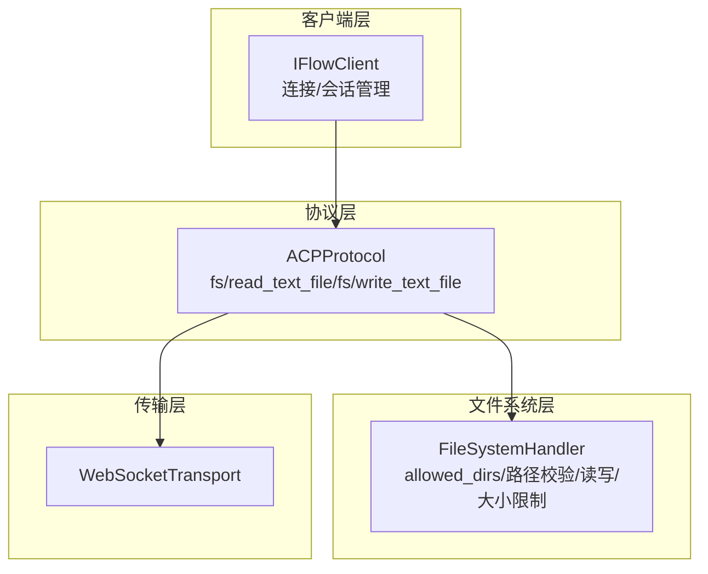
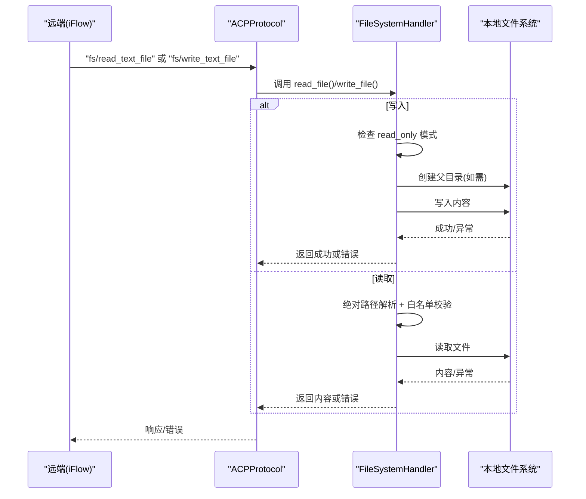
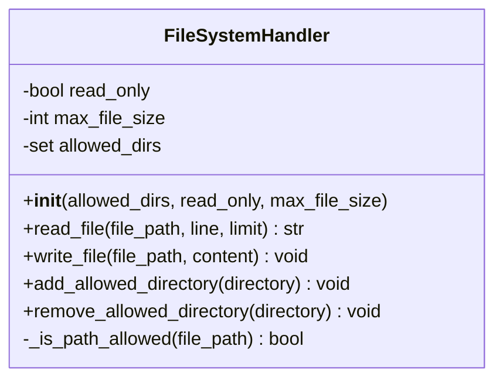
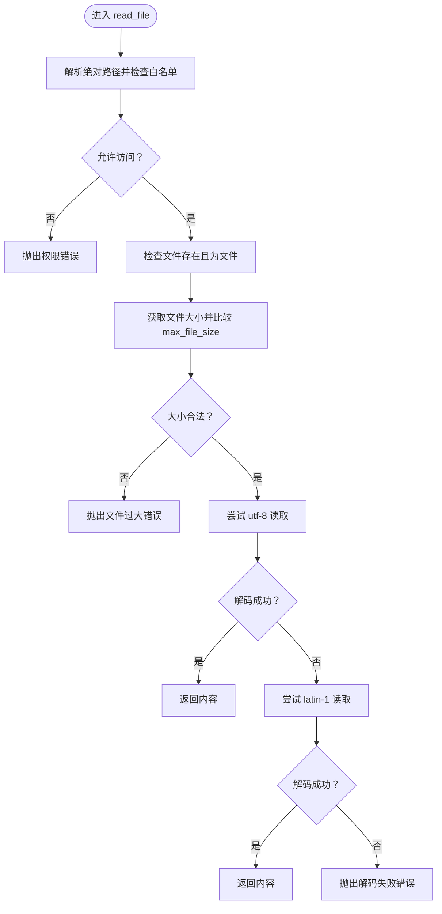
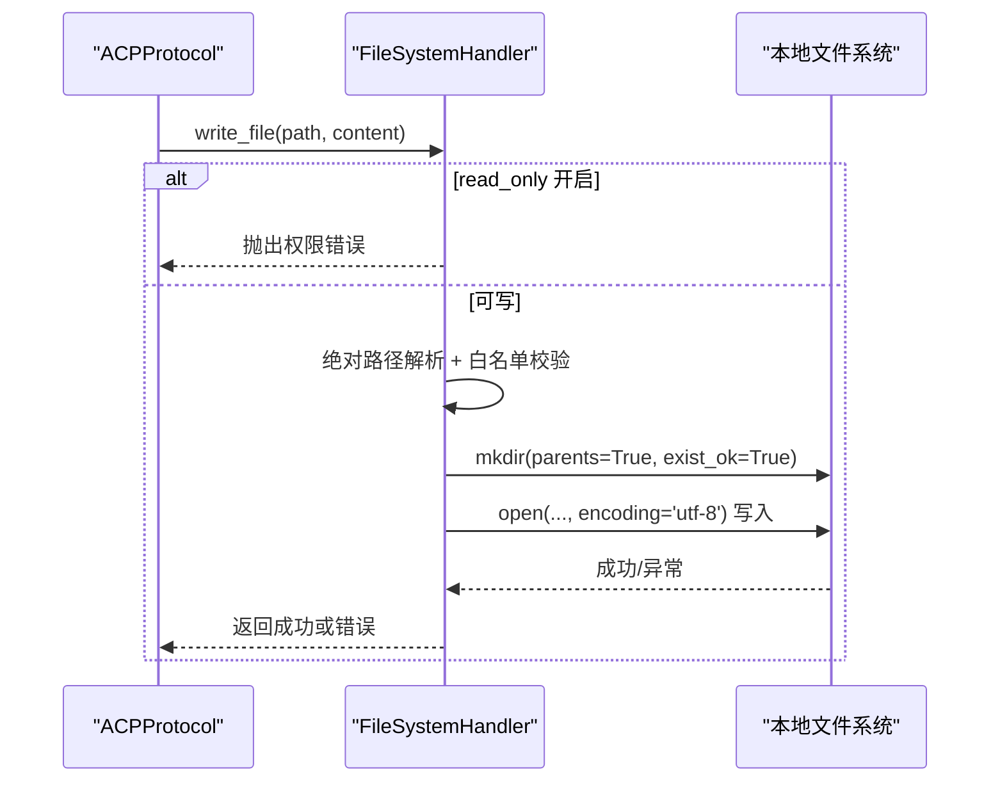
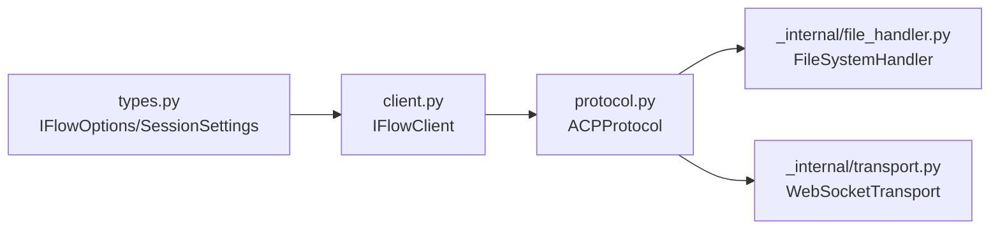

# 文件系统访问

<cite>
**本文引用的文件**
- [_internal/file_handler.py](file://_internal/file_handler.py)
- [_internal/protocol.py](file://_internal/protocol.py)
- [client.py](file://client.py)
- [types.py](file://types.py)
</cite>

## 目录
1. [简介](#简介)
2. [项目结构](#项目结构)
3. [核心组件](#核心组件)
4. [架构总览](#架构总览)
5. [详细组件分析](#详细组件分析)
6. [依赖关系分析](#依赖关系分析)
7. [性能考量](#性能考量)
8. [故障排查指南](#故障排查指南)
9. [结论](#结论)
10. [附录：安全配置最佳实践](#附录安全配置最佳实践)

## 简介
本文件系统安全访问机制围绕 FileSystemHandler 展开，重点说明以下安全与功能特性：
- 使用 allowed_dirs 白名单限制可访问目录范围
- 通过绝对路径解析与 relative_to 检查防止路径遍历攻击
- read_only 模式禁用写操作
- max_file_size 参数限制单次读取大小，避免大文件读取导致资源耗尽
- read_file 方法的分段读取（支持 line 和 limit 参数），并具备多编码容错（utf-8 回退到 latin-1）
- write_file 自动创建父目录
- 动态权限管理：add_allowed_directory 与 remove_allowed_directory
- 结合 IFlow 客户端与 ACP 协议，实现从远端请求到本地安全执行的完整链路

## 项目结构
- 核心文件系统处理器位于内部模块，负责实际的文件读写与安全校验
- 客户端在连接时根据配置实例化 FileSystemHandler，并将其注入到协议层
- 协议层接收来自远端的 fs/* 请求，转发给 FileSystemHandler 执行

图表来源
- [client.py](file://client.py#L189-L203)
- [_internal/protocol.py](file://_internal/protocol.py#L598-L659)
- [_internal/file_handler.py](file://_internal/file_handler.py#L29-L58)

章节来源
- [client.py](file://client.py#L189-L203)
- [_internal/protocol.py](file://_internal/protocol.py#L598-L659)

## 核心组件
- FileSystemHandler：实现文件系统安全访问的核心类，包含白名单、路径校验、读写控制、大小限制与动态权限管理
- ACPProtocol：接收远端 fs/* 请求，调用 FileSystemHandler 并返回结果或错误
- IFlowOptions：提供 file_access、file_allowed_dirs、file_read_only、file_max_size 等配置项，供客户端在连接时启用与初始化

章节来源
- [_internal/file_handler.py](file://_internal/file_handler.py#L29-L58)
- [_internal/protocol.py](file://_internal/protocol.py#L598-L659)
- [types.py](file://types.py#L996-L1065)

## 架构总览
下图展示从远端发起文件读写请求到本地安全执行的关键流程，包括安全检查与错误传播路径。

图表来源
- [_internal/protocol.py](file://_internal/protocol.py#L598-L659)
- [_internal/file_handler.py](file://_internal/file_handler.py#L89-L159)
- [_internal/file_handler.py](file://_internal/file_handler.py#L160-L193)

## 详细组件分析

### FileSystemHandler 类与安全策略
- 白名单 allowed_dirs
  - 初始化时将传入目录解析为绝对路径集合；若未提供则默认当前工作目录
  - 通过 _is_path_allowed 对目标路径进行绝对解析后，使用 relative_to 判断是否位于任一允许目录之下
- 防止路径遍历
  - 采用绝对路径解析与相对路径判断，拒绝越权路径
- 读写控制
  - read_only 模式下禁止写入
- 大小限制
  - 读取前检查文件大小，超过阈值直接拒绝
- 分段读取与编码容错
  - 支持按行区间读取（line/limit），并进行边界保护
  - 优先使用 utf-8 解码，失败时回退到 latin-1；仍失败则抛出错误
- 动态权限管理
  - add_allowed_directory：新增白名单目录（必须存在且为目录）
  - remove_allowed_directory：移除白名单目录

图表来源
- [_internal/file_handler.py](file://_internal/file_handler.py#L29-L58)
- [_internal/file_handler.py](file://_internal/file_handler.py#L59-L88)
- [_internal/file_handler.py](file://_internal/file_handler.py#L89-L159)
- [_internal/file_handler.py](file://_internal/file_handler.py#L160-L193)
- [_internal/file_handler.py](file://_internal/file_handler.py#L194-L217)

章节来源
- [_internal/file_handler.py](file://_internal/file_handler.py#L29-L58)
- [_internal/file_handler.py](file://_internal/file_handler.py#L59-L88)
- [_internal/file_handler.py](file://_internal/file_handler.py#L89-L159)
- [_internal/file_handler.py](file://_internal/file_handler.py#L160-L193)
- [_internal/file_handler.py](file://_internal/file_handler.py#L194-L217)

### 读取流程与分段读取逻辑
- 路径与权限检查
  - 绝对路径解析 + 白名单校验 + 存在性与类型检查
- 大小限制
  - 读取前统计文件大小并与 max_file_size 对比
- 分段读取
  - 若提供 line/limit，则将文件按行切片，进行边界保护后拼接返回
- 编码容错
  - 优先 utf-8；失败回退 latin-1；仍失败抛出错误

图表来源
- [_internal/file_handler.py](file://_internal/file_handler.py#L89-L159)

章节来源
- [_internal/file_handler.py](file://_internal/file_handler.py#L89-L159)

### 写入流程与父目录创建
- 读写模式检查
  - read_only 模式下直接拒绝写入
- 权限检查
  - 同样基于白名单与绝对路径解析
- 父目录创建
  - 使用递归创建父目录，确保写入路径可用
- 编码写入
  - 使用 utf-8 写入文本

图表来源
- [_internal/protocol.py](file://_internal/protocol.py#L631-L659)
- [_internal/file_handler.py](file://_internal/file_handler.py#L160-L193)

章节来源
- [_internal/protocol.py](file://_internal/protocol.py#L631-L659)
- [_internal/file_handler.py](file://_internal/file_handler.py#L160-L193)

### 动态权限管理
- add_allowed_directory
  - 将新目录解析为绝对路径并校验存在性与目录类型，再加入白名单
- remove_allowed_directory
  - 移除指定目录（若存在）

章节来源
- [_internal/file_handler.py](file://_internal/file_handler.py#L194-L217)

### 客户端与协议集成
- IFlowClient 在连接时根据 IFlowOptions 实例化 FileSystemHandler，并将其注入 ACPProtocol
- ACPProtocol 在收到 fs/* 请求后，委托 FileSystemHandler 执行具体操作

章节来源
- [client.py](file://client.py#L189-L203)
- [_internal/protocol.py](file://_internal/protocol.py#L598-L659)

## 依赖关系分析
- FileSystemHandler 依赖于标准库的路径解析与文件系统接口
- ACPProtocol 依赖 FileSystemHandler 进行文件操作，并通过 WebSocketTransport 发送/接收消息
- IFlowClient 作为高层封装，负责在连接阶段装配 FileSystemHandler

图表来源
- [types.py](file://types.py#L996-L1065)
- [client.py](file://client.py#L189-L203)
- [_internal/protocol.py](file://_internal/protocol.py#L598-L659)
- [_internal/file_handler.py](file://_internal/file_handler.py#L29-L58)
- [_internal/transport.py](file://_internal/transport.py#L1-L177)

章节来源
- [types.py](file://types.py#L996-L1065)
- [client.py](file://client.py#L189-L203)
- [_internal/protocol.py](file://_internal/protocol.py#L598-L659)
- [_internal/file_handler.py](file://_internal/file_handler.py#L29-L58)
- [_internal/transport.py](file://_internal/transport.py#L1-L177)

## 性能考量
- 读取策略
  - 默认整文件读取，适合较小文件；对于大文件建议使用分段读取（line/limit）以降低内存占用
  - 编码回退仅在 utf-8 失败时触发，通常影响较小
- 写入策略
  - 写入前不进行大小检查，但会创建父目录；建议结合 max_file_size 与文件大小控制策略
- I/O 复杂度
  - 路径解析与白名单检查为 O(k)（k 为 allowed_dirs 数量），相对开销较低
  - 分段读取为 O(n) 行扫描，n 为 limit 指定的行数

[本节为通用性能讨论，无需列出具体文件来源]

## 故障排查指南
- 访问被拒绝
  - 检查 allowed_dirs 是否包含目标路径；确认路径解析后未越权
  - 确认 read_only 模式是否开启
- 文件不存在或非文件
  - 确认路径存在且为普通文件
- 文件过大
  - 提升 max_file_size 或改用分段读取
- 解码失败
  - 确认文件编码；若为二进制或特殊编码，可能需要外部预处理
- 写入失败
  - 检查父目录权限与磁盘空间；确认未处于 read_only 模式

章节来源
- [_internal/file_handler.py](file://_internal/file_handler.py#L89-L159)
- [_internal/file_handler.py](file://_internal/file_handler.py#L160-L193)

## 结论
FileSystemHandler 通过白名单、绝对路径解析与大小限制等手段，构建了面向远端调用的安全文件访问通道。配合 ACP 协议与客户端层，实现了从远端请求到本地安全执行的闭环。合理配置 read_only 与 max_file_size，并结合分段读取与动态权限管理，可在保证安全性的同时满足多样化的文件操作需求。

[本节为总结性内容，无需列出具体文件来源]

## 附录：安全配置最佳实践
- 最小暴露原则
  - 明确设置 file_allowed_dirs，仅包含必要目录；避免使用根目录或过宽泛的路径
- 读写分离
  - 生产环境优先启用 read_only，仅在需要编辑时临时关闭
- 大小限制
  - 根据业务场景设置合理的 file_max_size，防止大文件读取导致资源耗尽
- 分段读取
  - 对日志或长文本文件，优先使用 line/limit 进行分段读取，降低内存压力
- 动态权限
  - 仅在运行时需要扩展访问范围时使用 add_allowed_directory；变更后及时审计
- 错误处理
  - 对解码失败、权限错误、文件过大等情况进行明确的错误提示与降级处理

章节来源
- [types.py](file://types.py#L996-L1065)
- [_internal/file_handler.py](file://_internal/file_handler.py#L29-L58)
- [_internal/file_handler.py](file://_internal/file_handler.py#L89-L159)
- [_internal/file_handler.py](file://_internal/file_handler.py#L160-L193)
- [_internal/file_handler.py](file://_internal/file_handler.py#L194-L217)