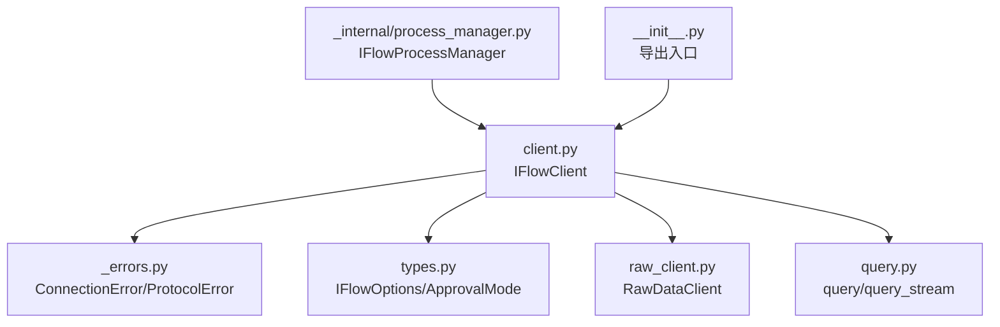
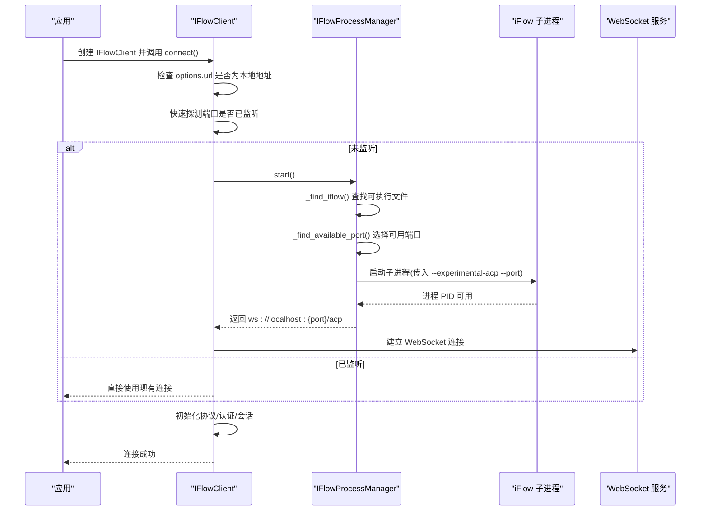
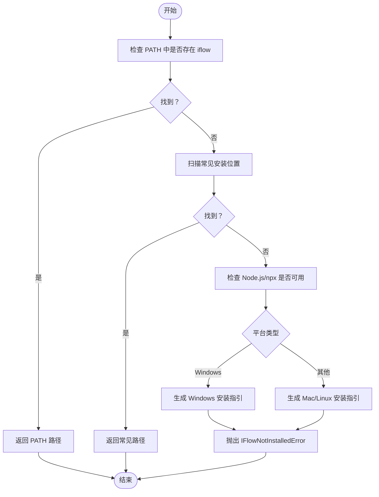
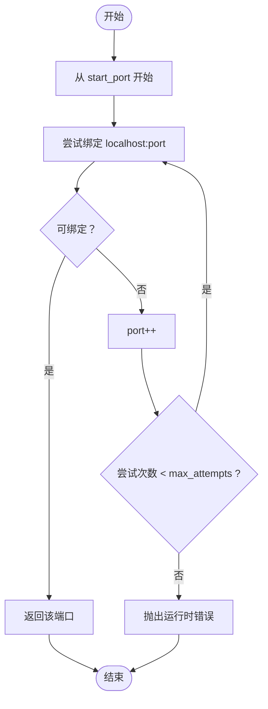
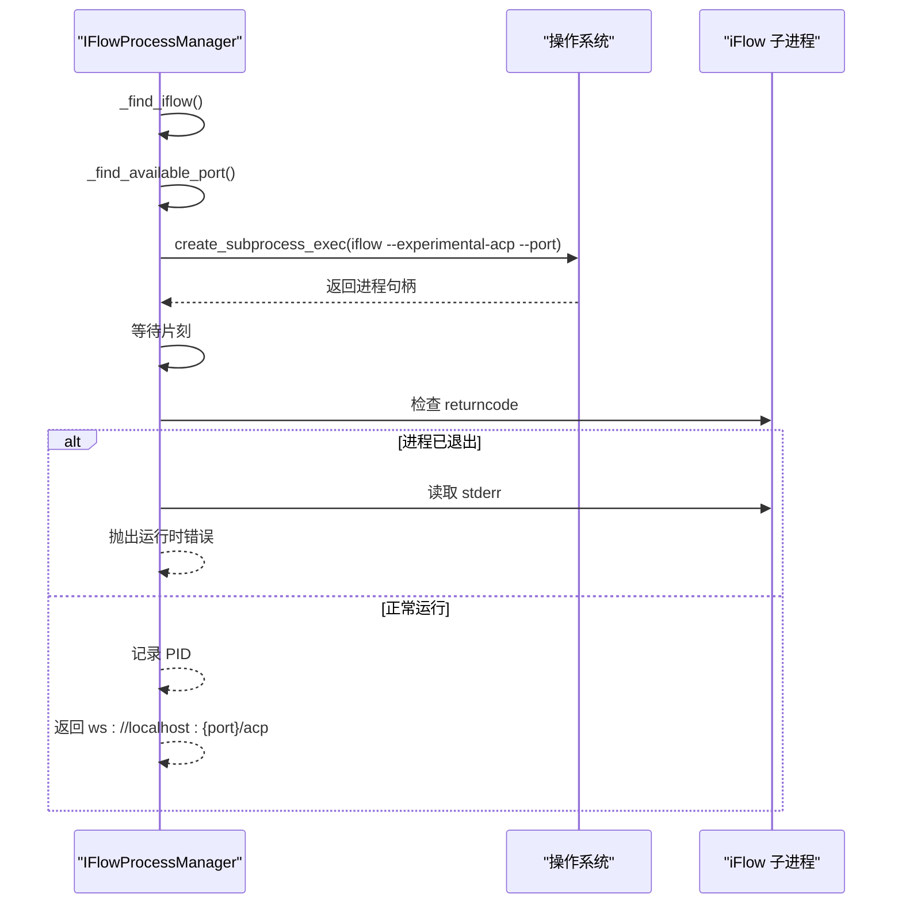
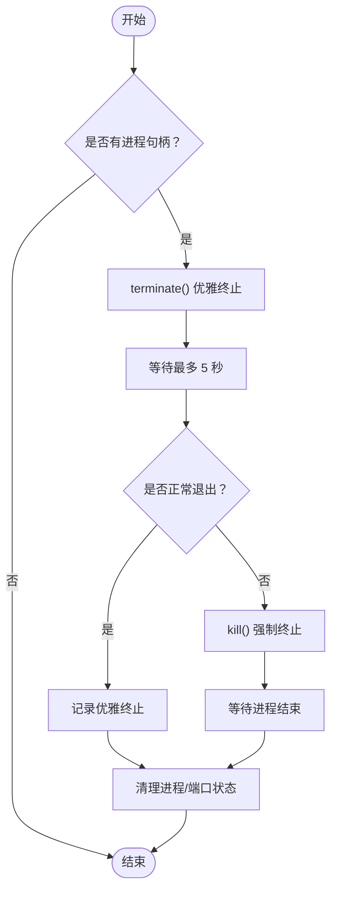
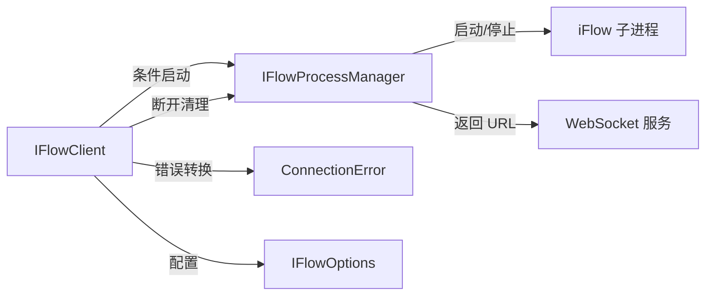

# 进程管理

<cite>
**本文引用的文件**
- [_internal/process_manager.py](file://_internal/process_manager.py)
- [client.py](file://client.py)
- [_errors.py](file://_errors.py)
- [types.py](file://types.py)
- [query.py](file://query.py)
- [raw_client.py](file://raw_client.py)
- [__init__.py](file://__init__.py)
</cite>

## 目录
1. [简介](#简介)
2. [项目结构](#项目结构)
3. [核心组件](#核心组件)
4. [架构总览](#架构总览)
5. [详细组件分析](#详细组件分析)
6. [依赖关系分析](#依赖关系分析)
7. [性能考量](#性能考量)
8. [故障排查指南](#故障排查指南)
9. [结论](#结论)
10. [附录](#附录)

## 简介
本章节聚焦于 IFlowProcessManager 的进程管理能力，系统性阐述其如何自动检测 iFlow CLI 安装、在不同操作系统中定位可执行文件、选择可用端口、启动子进程并建立 WebSocket 通信；同时说明优雅停止与超时强制终止策略，以及通过异步上下文管理器自动生命周期管理的方法。文档还包含 PID 跟踪与错误恢复策略的说明，并提供清晰的安装指引与使用建议。

## 项目结构
- IFlowProcessManager 位于内部模块，负责 iFlow CLI 的发现、端口选择、子进程启动与停止。
- IFlowClient 在连接阶段根据配置决定是否自动启动 iFlow 子进程，并在断开时负责清理。
- 错误类型定义集中于 _errors.py，用于统一异常语义。
- 类型定义与选项（如 ApprovalMode、IFlowOptions）位于 types.py，为客户端行为提供约束。
- query 与 raw_client 提供便捷查询与原始协议数据访问，便于验证 WebSocket 通信链路。

图表来源
- [client.py](file://client.py#L1-L220)
- [_internal/process_manager.py](file://_internal/process_manager.py#L1-L254)
- [_errors.py](file://_errors.py#L1-L85)
- [types.py](file://types.py#L1-L120)
- [raw_client.py](file://raw_client.py#L1-L120)
- [query.py](file://query.py#L1-L120)
- [__init__.py](file://__init__.py#L1-L80)

章节来源
- [client.py](file://client.py#L1-L220)
- [_internal/process_manager.py](file://_internal/process_manager.py#L1-L254)
- [_errors.py](file://_errors.py#L1-L85)
- [types.py](file://types.py#L1-L120)
- [raw_client.py](file://raw_client.py#L1-L120)
- [query.py](file://query.py#L1-L120)
- [__init__.py](file://__init__.py#L1-L80)

## 核心组件
- IFlowProcessManager：封装 iFlow CLI 的安装检测、端口选择、子进程启动与停止，提供 WebSocket URL 访问。
- IFlowClient：在连接阶段按需启动 iFlow 子进程，建立 WebSocket 传输与协议层，支持自动清理。
- 错误体系：ConnectionError、ProtocolError 等，用于统一错误传播。
- 类型与选项：IFlowOptions、ApprovalMode 等，控制客户端行为与会话设置。

章节来源
- [_internal/process_manager.py](file://_internal/process_manager.py#L20-L254)
- [client.py](file://client.py#L1-L220)
- [_errors.py](file://_errors.py#L1-L85)
- [types.py](file://types.py#L1-L120)

## 架构总览
下图展示 IFlowClient 与 IFlowProcessManager 的交互，以及启动流程中的关键步骤：URL 判定、端口探测、进程启动、WebSocket 建立与消息处理。

图表来源
- [client.py](file://client.py#L140-L220)
- [_internal/process_manager.py](file://_internal/process_manager.py#L152-L209)

## 详细组件分析

### IFlowProcessManager：安装检测与路径查找
- 自动检测逻辑：
  - 优先通过系统 PATH 查找可执行文件。
  - 若失败，遍历常见安装位置（跨平台），包括用户全局目录、系统默认路径、Yarn、Windows AppData 等。
  - 若仍不可用，检查 Node.js/npx 是否存在，并根据平台生成安装指引（Windows 与 Mac/Linux 分别提示）。
- 异常处理：
  - 当无法找到 iFlow CLI 且无法给出明确安装指引时，抛出 IFlowNotInstalledError，由上层捕获并转换为连接错误。

图表来源
- [_internal/process_manager.py](file://_internal/process_manager.py#L58-L114)

章节来源
- [_internal/process_manager.py](file://_internal/process_manager.py#L58-L114)

### 端口选择与可用性检测
- 可用性检测：
  - 使用 socket 绑定到 localhost:port，若绑定成功则端口空闲，否则占用。
- 端口搜索：
  - 从起始端口开始逐个尝试，最多尝试固定次数（默认 100 次），返回第一个可用端口。
  - 若超出范围仍未找到，抛出运行时错误，提示在指定范围内无可用端口。

图表来源
- [_internal/process_manager.py](file://_internal/process_manager.py#L115-L151)

章节来源
- [_internal/process_manager.py](file://_internal/process_manager.py#L115-L151)

### 启动子进程与 WebSocket URL
- 启动流程：
  - 若已有未退出的子进程，直接复用当前 URL。
  - 调用 _find_iflow 获取可执行路径，_find_available_port 获取可用端口。
  - 构造命令行参数：--experimental-acp 与 --port，并以非交互方式启动子进程（标准输入 DEVNULL）。
  - 短暂等待后检查进程是否仍在运行；若已退出，读取 stderr 并抛出运行时错误。
  - 记录进程 PID，返回 ws://localhost:{port}/acp。
- WebSocket URL：
  - 仅当进程已启动且端口有效时可用；否则抛出运行时错误。

图表来源
- [_internal/process_manager.py](file://_internal/process_manager.py#L152-L209)

章节来源
- [_internal/process_manager.py](file://_internal/process_manager.py#L152-L209)

### 停止子进程：优雅终止与强制终止
- 优雅终止：
  - 先尝试进程终止（terminate），等待最多 5 秒。
  - 若在超时前正常退出，记录“优雅终止”日志。
- 强制终止：
  - 若超时未退出，记录警告并强制 kill，随后等待进程结束。
- 异常处理：
  - 处理进程不存在等异常，确保资源释放与状态重置。
- 最终清理：
  - 将进程句柄与端口字段置空，保证后续重新启动不会误判仍在运行。

图表来源
- [_internal/process_manager.py](file://_internal/process_manager.py#L211-L246)

章节来源
- [_internal/process_manager.py](file://_internal/process_manager.py#L211-L246)

### 上下文管理器：自动生命周期管理
- __aenter__：进入异步上下文时自动启动子进程，返回自身以便继续使用。
- __aexit__：退出异步上下文时自动停止子进程，确保资源回收。
- 使用建议：
  - 在需要独立生命周期的场景中，推荐使用 async with IFlowClient(...) as client:，让 SDK 内部委托 IFlowProcessManager 管理进程。
  - 若手动控制进程，可在 __aenter__/__aexit__ 中自行调用 IFlowProcessManager.start()/stop()。

章节来源
- [_internal/process_manager.py](file://_internal/process_manager.py#L247-L254)
- [client.py](file://client.py#L368-L398)

### PID 跟踪与错误恢复策略
- PID 跟踪：
  - 启动成功后记录子进程 PID，便于后续日志与调试。
- 错误恢复：
  - 启动失败时清理进程与端口状态，避免悬挂状态。
  - 停止过程中忽略“进程不存在”等异常，保证幂等性。
  - IFlowClient 在连接失败时进行清理，避免残留进程。

章节来源
- [_internal/process_manager.py](file://_internal/process_manager.py#L180-L209)
- [_internal/process_manager.py](file://_internal/process_manager.py#L211-L246)
- [client.py](file://client.py#L368-L398)

### 安装指引与最佳实践
- 安装指引：
  - Windows：若系统缺少 Node.js，先安装 Node.js，再通过 npm 安装 iFlow CLI。
  - Mac/Linux/Ubuntu：提供一键安装脚本链接，同时提示 Windows 用户使用 npm 安装。
- 最佳实践：
  - 首次使用前确认 PATH 中存在 iflow 或安装至常见位置。
  - 如需自定义端口，可通过 IFlowOptions 指定 process_start_port。
  - 在容器或受限环境中，确保网络与权限允许子进程创建与端口绑定。

章节来源
- [_internal/process_manager.py](file://_internal/process_manager.py#L95-L114)
- [client.py](file://client.py#L140-L220)

## 依赖关系分析
- IFlowProcessManager 与 IFlowClient 的耦合：
  - IFlowClient 在 connect() 中根据 options.url 与端口监听状态决定是否启动子进程。
  - IFlowClient 在断开时调用 IFlowProcessManager.stop()，实现自动清理。
- 错误传播：
  - IFlowProcessManager 抛出 IFlowNotInstalledError，IFlowClient 捕获并转换为 ConnectionError，保持上层一致的错误语义。
- 类型与选项：
  - IFlowOptions 控制自动启动、端口起始值、会话设置等，影响 IFlowClient 的连接策略。

图表来源
- [client.py](file://client.py#L140-L220)
- [_internal/process_manager.py](file://_internal/process_manager.py#L152-L209)
- [_errors.py](file://_errors.py#L1-L85)
- [types.py](file://types.py#L1-L120)

章节来源
- [client.py](file://client.py#L140-L220)
- [_internal/process_manager.py](file://_internal/process_manager.py#L152-L209)
- [_errors.py](file://_errors.py#L1-L85)
- [types.py](file://types.py#L1-L120)

## 性能考量
- 端口探测复杂度：线性扫描，时间复杂度 O(N)，N 为尝试次数上限，默认 100，通常很快。
- 启动延迟：短暂等待（约 0.5 秒）用于确认进程存活，避免立即判断失败。
- 连接重试：IFlowClient 对 WebSocket 连接采用指数回退重试，提升稳定性。
- 资源回收：停止流程在 5 秒内尽力优雅终止，超时后强制终止，减少僵尸进程风险。

## 故障排查指南
- “未找到 iFlow CLI”
  - 检查 PATH 是否包含 iflow，或安装至常见位置。
  - 按平台指引安装 Node.js 与 iFlow CLI。
- “端口被占用”
  - 调整 IFlowOptions.process_start_port，或关闭占用端口的服务。
- “进程启动后立即退出”
  - 查看 stderr 输出，确认 iFlow CLI 版本与参数兼容。
- “连接超时或握手失败”
  - 确认 WebSocket URL 与端口正确，检查防火墙与代理。
- “优雅停止无效”
  - 等待 5 秒后强制终止属于预期行为，必要时手动重启 iFlow。

章节来源
- [_internal/process_manager.py](file://_internal/process_manager.py#L115-L151)
- [_internal/process_manager.py](file://_internal/process_manager.py#L152-L209)
- [_internal/process_manager.py](file://_internal/process_manager.py#L211-L246)
- [client.py](file://client.py#L140-L220)

## 结论
IFlowProcessManager 提供了完整的 iFlow CLI 进程生命周期管理：自动安装检测、跨平台路径查找、端口选择与可用性检测、子进程启动与 WebSocket URL 生成、优雅停止与强制终止策略。结合 IFlowClient 的自动启动与清理，开发者可以以最小成本获得稳定的本地对话体验。建议在生产环境或受限环境中，配合 IFlowOptions 显式配置端口与会话设置，以增强可控性与可观测性。

## 附录
- 使用上下文管理器的示例路径：
  - IFlowClient 的异步上下文入口与出口：[client.py](file://client.py#L368-L398)
  - IFlowProcessManager 的异步上下文入口与出口：[process_manager.py](file://_internal/process_manager.py#L247-L254)
- 端口探测与可用性检测：
  - 可用性检测：[process_manager.py](file://_internal/process_manager.py#L115-L130)
  - 端口搜索：[process_manager.py](file://_internal/process_manager.py#L131-L151)
- 启动与停止：
  - 启动流程：[process_manager.py](file://_internal/process_manager.py#L152-L209)
  - 停止流程：[process_manager.py](file://_internal/process_manager.py#L211-L246)
- 安装指引：
  - 平台安装指引与错误信息：[process_manager.py](file://_internal/process_manager.py#L95-L114)
- 错误类型：
  - 连接与协议错误：[errors.py](file://_errors.py#L1-L85)
- 类型与选项：
  - IFlowOptions、ApprovalMode 等：[types.py](file://types.py#L1-L120)
- 便捷查询与原始数据：
  - 查询函数与原始数据客户端：[query.py](file://query.py#L1-L120), [raw_client.py](file://raw_client.py#L1-L120)