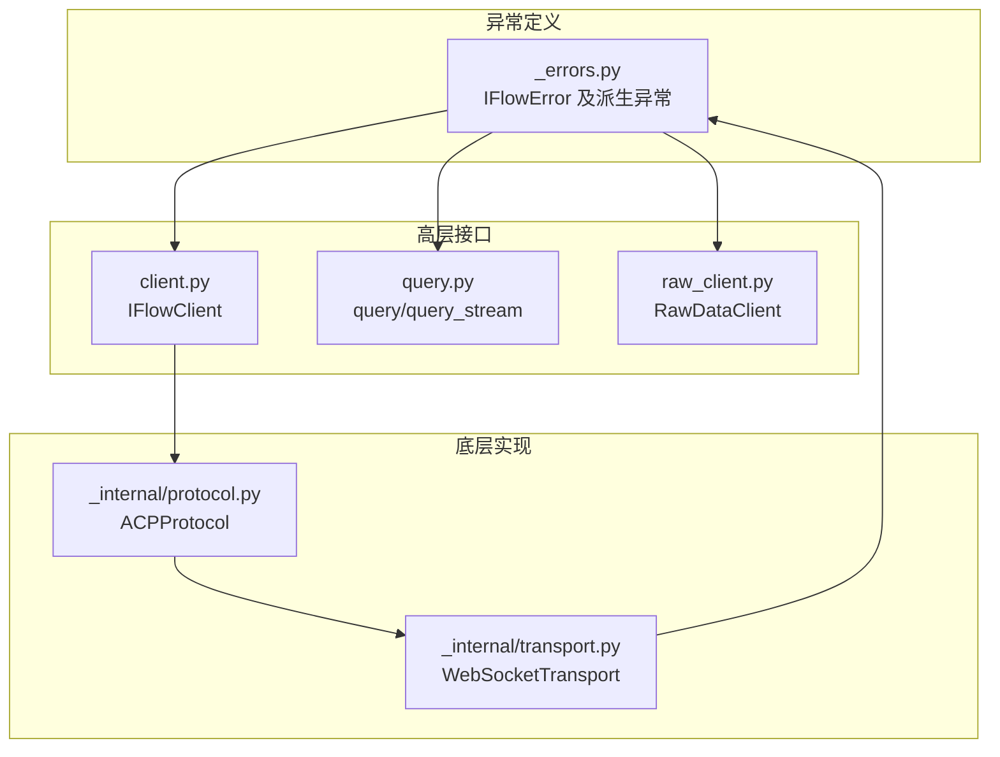
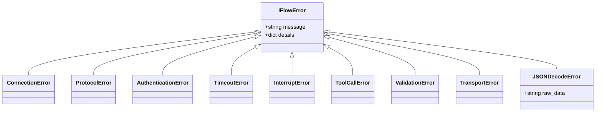
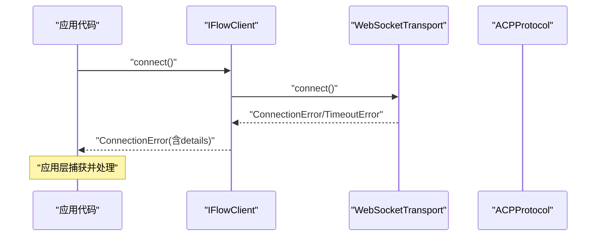
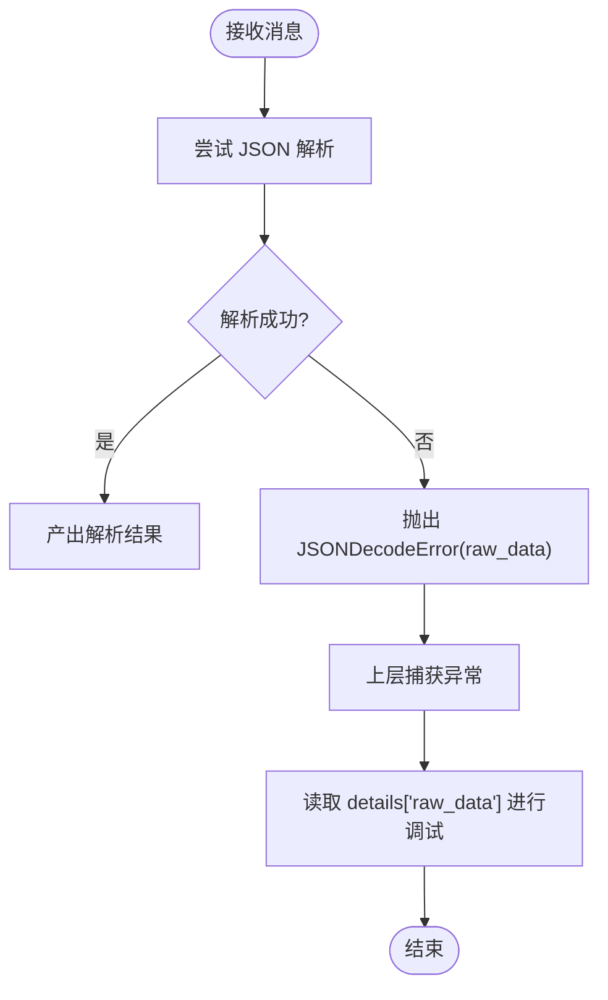

# 错误处理

<cite>
**本文引用的文件列表**
- [错误定义 _errors.py](file://_errors.py)
- [客户端 client.py](file://client.py)
- [协议实现 _internal/protocol.py](file://_internal/protocol.py)
- [传输层 _internal/transport.py](file://_internal/transport.py)
- [原始数据客户端 raw_client.py](file://raw_client.py)
- [查询函数 query.py](file://query.py)
- [包入口 __init__.py](file://__init__.py)
</cite>

## 目录
1. [简介](#简介)
2. [项目结构与异常体系概览](#项目结构与异常体系概览)
3. [核心异常类与设计](#核心异常类与设计)
4. [异常触发场景与定位](#异常触发场景与定位)
5. [JSONDecodeError 的 raw_data 设计与调试价值](#jsondecodeerror-的-raw_data-设计与调试价值)
6. [异常捕获与分层处理策略](#异常捕获与分层处理策略)
7. [恢复建议与重试逻辑示例](#恢复建议与重试逻辑示例)
8. [依赖关系与架构图](#依赖关系与架构图)
9. [结论](#结论)

## 简介
本文件系统化梳理 iFlow SDK 的异常体系，围绕 IFlowError 基类及其派生异常，解释 message 和 details 属性的设计意图；逐项说明 ConnectionError、ProtocolError、AuthenticationError、TimeoutError、InterruptError、ToolCallError、ValidationError 和 TransportError 的典型触发场景；重点阐述 JSONDecodeError 如何通过 raw_data 保留原始数据以辅助调试；最后给出异常捕获的分层策略、通过 details 获取上下文信息的方法，以及针对不同错误类型的恢复建议与重试逻辑示例。

## 项目结构与异常体系概览
SDK 将异常定义集中在独立模块中，客户端、协议层与传输层在各自职责范围内抛出或转换为统一的 SDK 异常类型，便于上层统一处理与用户感知。

图表来源
- [_errors.py](file://_errors.py#L1-L85)
- [client.py](file://client.py#L1-L120)
- [_internal/protocol.py](file://_internal/protocol.py#L1-L120)
- [_internal/transport.py](file://_internal/transport.py#L1-L120)
- [raw_client.py](file://raw_client.py#L1-L120)
- [query.py](file://query.py#L1-L80)

章节来源
- [错误定义 _errors.py](file://_errors.py#L1-L85)
- [客户端 client.py](file://client.py#L1-L120)
- [协议实现 _internal/protocol.py](file://_internal/protocol.py#L1-L120)
- [传输层 _internal/transport.py](file://_internal/transport.py#L1-L120)
- [原始数据客户端 raw_client.py](file://raw_client.py#L1-L120)
- [查询函数 query.py](file://query.py#L1-L80)
- [包入口 __init__.py](file://__init__.py#L1-L80)

## 核心异常类与设计
- IFlowError：所有 SDK 异常的基类，提供 message（人类可读消息）与 details（结构化上下文字典）两个关键字段，用于统一错误表达与扩展上下文。
- 派生异常：ConnectionError、ProtocolError、AuthenticationError、TimeoutError、InterruptError、ToolCallError、ValidationError、TransportError、JSONDecodeError。
- JSONDecodeError 特殊设计：在构造时将 raw_data 作为 details 的键值，便于在解析失败时保留原始数据，提升调试效率。

章节来源
- [错误定义 _errors.py](file://_errors.py#L10-L85)
- [包入口 __init__.py](file://__init__.py#L1-L40)

## 异常触发场景与定位
以下场景均来自各模块对异常的抛出或转换，帮助你快速定位问题来源与处理方向：

- 连接阶段
  - 连接失败/超时：传输层在连接建立阶段抛出 ConnectionError 或 TimeoutError，客户端在重试与启动本地进程失败时转换为 ConnectionError。
  - 触发位置参考：
    - 传输层连接：[_internal/transport.py](file://_internal/transport.py#L53-L84)
    - 客户端连接流程与重试：[client.py](file://client.py#L132-L221)
    - 客户端启动本地进程失败回退：[client.py](file://client.py#L172-L188)

- 协议初始化与认证
  - 初始化失败：协议层在解析响应或收到错误时抛出 ProtocolError；认证失败：抛出 AuthenticationError；认证超时：抛出 TimeoutError。
  - 触发位置参考：
    - 初始化解析与异常分支：[_internal/protocol.py](file://_internal/protocol.py#L140-L171)
    - 认证请求与响应解析：[_internal/protocol.py](file://_internal/protocol.py#L176-L256)

- 会话与消息交互
  - 发送消息前未连接：客户端抛出 ConnectionError；中断会话：客户端抛出 ConnectionError（未连接时）。
  - 触发位置参考：
    - 发送消息前置校验：[client.py](file://client.py#L399-L412)
    - 中断会话前置校验：[client.py](file://client.py#L498-L509)

- 工具调用确认
  - 需要用户确认工具调用时，客户端在收到权限请求后等待用户决策；若请求 ID 无效，协议层抛出 ProtocolError。
  - 触发位置参考：
    - 权限请求处理与响应：[_internal/protocol.py](file://_internal/protocol.py#L567-L597)
    - 客户端方法转发与校验：[client.py](file://client.py#L529-L598)

- 传输层错误
  - 发送/接收过程中连接断开或底层异常：传输层抛出 ConnectionError 或 TransportError；接收时 JSON 解析失败：抛出 JSONDecodeError。
  - 触发位置参考：
    - 发送异常分支：[_internal/transport.py](file://_internal/transport.py#L85-L113)
    - 接收异常分支与 JSONDecodeError 抛出：[_internal/transport.py](file://_internal/transport.py#L114-L146)

- 查询函数
  - query/query_stream 在超时或连接失败时分别抛出 TimeoutError/ConnectionError。
  - 触发位置参考：
    - 超时与连接异常标注：[query.py](file://query.py#L35-L40)

章节来源
- [_internal/transport.py](file://_internal/transport.py#L53-L146)
- [client.py](file://client.py#L132-L221)
- [client.py](file://client.py#L399-L509)
- [_internal/protocol.py](file://_internal/protocol.py#L140-L256)
- [_internal/protocol.py](file://_internal/protocol.py#L567-L597)
- [query.py](file://query.py#L35-L40)

## JSONDecodeError 的 raw_data 设计与调试价值
- 设计要点
  - JSONDecodeError 继承自 IFlowError，构造时将 raw_data 作为 details 字典中的键值，使上层能直接访问原始字符串，避免二次解析与丢失上下文。
  - 传输层在接收消息时若底层返回字符串但无法被 JSON 解析，会抛出 JSONDecodeError，并将原始消息作为 raw_data 传入。
- 调试价值
  - 通过 details["raw_data"] 可直接查看原始文本，结合时间戳、消息类型等上下文进行定位。
  - 原始数据可用于日志记录、协议分析器输出与问题复现。
- 触发位置参考：
  - 传输层接收并抛出 JSONDecodeError：[_internal/transport.py](file://_internal/transport.py#L114-L146)
  - 协议层在消息处理中捕获 JSONDecodeError 并向上抛出：[_internal/protocol.py](file://_internal/protocol.py#L508-L533)

章节来源
- [_errors.py](file://_errors.py#L73-L85)
- [_internal/transport.py](file://_internal/transport.py#L114-L146)
- [_internal/protocol.py](file://_internal/protocol.py#L508-L533)

## 异常捕获与分层处理策略
- 分层策略
  - 应用层（业务代码）：捕获 IFlowError 及其子类，优先根据具体异常类型执行差异化处理；同时读取 details 获取上下文信息（如 raw_data、错误码、详细原因等）。
  - SDK 外围封装（如 query/query_stream）：对外暴露统一的异常语义，必要时包装为更易理解的异常类型。
  - SDK 内部：在连接、协议、传输三个层次分别捕获并转换为 SDK 统一异常，保持上层一致性。
- details 字典使用建议
  - ConnectionError/ProtocolError/AuthenticationError/TransportError：通常不包含 details，或由上层补充；遇到 JSONDecodeError 时优先读取 details["raw_data"]。
  - 其他异常：若存在 details，可按需读取 code、message、data 等字段（例如协议层错误映射时可能携带 details）。
- 实践要点
  - 在捕获异常后，先记录 details["raw_data"]（若有），再决定是否重试或降级。
  - 对于超时类错误，结合重试策略与指数退避，避免雪崩。

章节来源
- [错误定义 _errors.py](file://_errors.py#L10-L85)
- [_internal/protocol.py](file://_internal/protocol.py#L694-L698)
- [_internal/transport.py](file://_internal/transport.py#L114-L146)

## 恢复建议与重试逻辑示例
以下为基于各异常类型的通用恢复建议与重试策略示例路径（不直接展示代码内容）：

- 连接失败（ConnectionError）
  - 建议
    - 检查网络连通性与目标地址；验证认证配置；若为本地进程模式，确认进程已启动且端口可用。
    - 对于客户端自动启动本地进程失败，回退到手动启动或更换 URL。
  - 重试
    - 使用指数退避与最大重试次数；在连接成功后继续后续流程。
  - 参考位置
    - 连接重试与指数退避：[client.py](file://client.py#L205-L221)
    - 启动本地进程失败回退：[client.py](file://client.py#L172-L188)
    - 传输层连接异常：[_internal/transport.py](file://_internal/transport.py#L53-L84)

- 协议初始化/认证失败（ProtocolError、AuthenticationError）
  - 建议
    - 校验初始化参数与认证方法；检查服务端能力与版本兼容性；关注协议层返回的错误详情。
  - 重试
    - 对于临时性错误可重试一次；若仍失败，提示用户检查配置或联系支持。
  - 参考位置
    - 初始化解析与异常：[_internal/protocol.py](file://_internal/protocol.py#L140-L171)
    - 认证响应解析与超时：[_internal/protocol.py](file://_internal/protocol.py#L176-L256)

- 超时（TimeoutError）
  - 建议
    - 提升超时阈值或优化上游性能；对长耗时操作采用异步与流式处理。
  - 重试
    - 对幂等请求进行有限次重试；对非幂等请求谨慎重试或改为补偿机制。
  - 参考位置
    - 认证超时：[_internal/protocol.py](file://_internal/protocol.py#L213-L256)
    - 会话创建超时回退：[_internal/protocol.py](file://_internal/protocol.py#L336-L344)

- 传输层错误（TransportError）
  - 建议
    - 检查连接状态与网络稳定性；对发送失败进行缓冲与重发；对接收失败进行断线重连。
  - 参考位置
    - 发送异常：[_internal/transport.py](file://_internal/transport.py#L85-L113)
    - 接收异常：[_internal/transport.py](file://_internal/transport.py#L114-L146)

- JSON 解析失败（JSONDecodeError）
  - 建议
    - 优先读取 details["raw_data"] 进行人工核对；检查服务端消息格式与编码；必要时启用原始数据客户端进行协议级调试。
  - 参考位置
    - 传输层抛出 JSONDecodeError：[_internal/transport.py](file://_internal/transport.py#L114-L146)
    - 协议层捕获并抛出 JSONDecodeError：[_internal/protocol.py](file://_internal/protocol.py#L508-L533)
    - 原始数据客户端 RawDataClient 支持查看原始消息与统计：[raw_client.py](file://raw_client.py#L1-L120)

- 中断（InterruptError）
  - 建议
    - 在中断后清理资源并重新建立会话；对中断后的状态进行一致性检查。
  - 参考位置
    - 客户端中断方法：[client.py](file://client.py#L498-L509)

- 工具调用错误（ToolCallError）
  - 建议
    - 捕获后记录工具名、参数与结果；对可重试的外部依赖进行重试；对不可重试的错误引导用户修正输入。
  - 参考位置
    - 客户端工具调用相关方法：[client.py](file://client.py#L529-L598)

- 参数/验证错误（ValidationError）
  - 建议
    - 在调用前进行严格校验；对不符合约束的数据进行修正或提示用户调整。
  - 参考位置
    - 客户端发送消息时对文件等输入进行校验：[client.py](file://client.py#L414-L493)

章节来源
- [client.py](file://client.py#L132-L221)
- [client.py](file://client.py#L399-L509)
- [_internal/protocol.py](file://_internal/protocol.py#L140-L256)
- [_internal/protocol.py](file://_internal/protocol.py#L336-L344)
- [_internal/transport.py](file://_internal/transport.py#L53-L146)
- [raw_client.py](file://raw_client.py#L1-L120)

## 依赖关系与架构图
下面的类图展示了异常体系与核心组件之间的关系：

图表来源
- [_errors.py](file://_errors.py#L10-L85)

下面的序列图展示了“连接失败”的典型调用链与异常传播：

图表来源
- [client.py](file://client.py#L132-L221)
- [_internal/transport.py](file://_internal/transport.py#L53-L84)

下面的流程图展示了“JSON 解析失败”的处理流程：

图表来源
- [_internal/transport.py](file://_internal/transport.py#L114-L146)
- [_internal/protocol.py](file://_internal/protocol.py#L508-L533)

## 结论
- IFlowError 通过 message 与 details 提供统一的错误表达与上下文扩展能力。
- 各层异常在传输层、协议层与客户端之间清晰分工，确保上层获得一致的异常语义。
- JSONDecodeError 的 raw_data 设计显著提升了调试效率，建议在捕获后优先读取该字段。
- 建议采用分层捕获与重试策略，结合 details 字典进行精准定位与恢复。