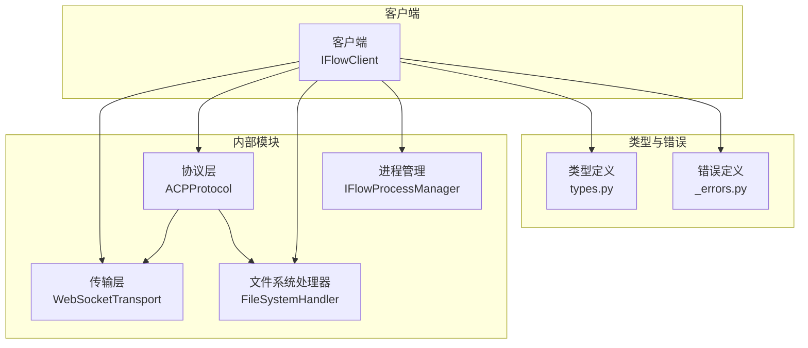
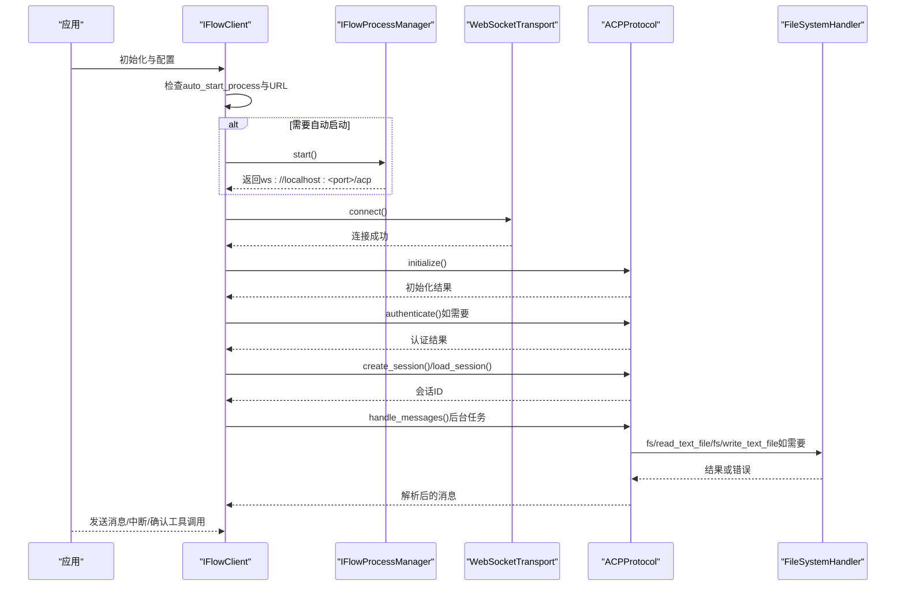
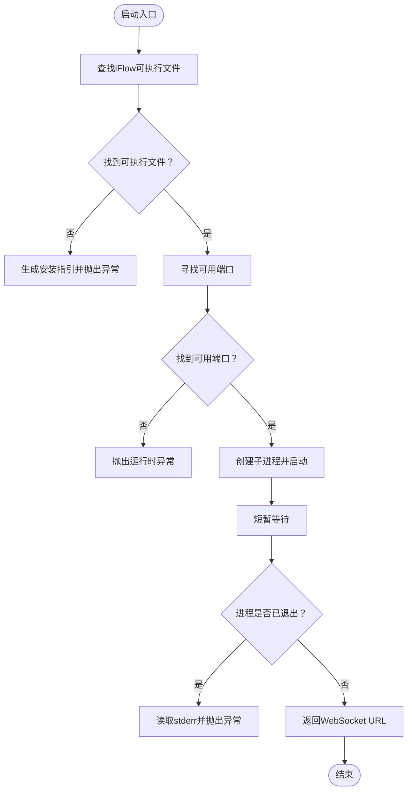
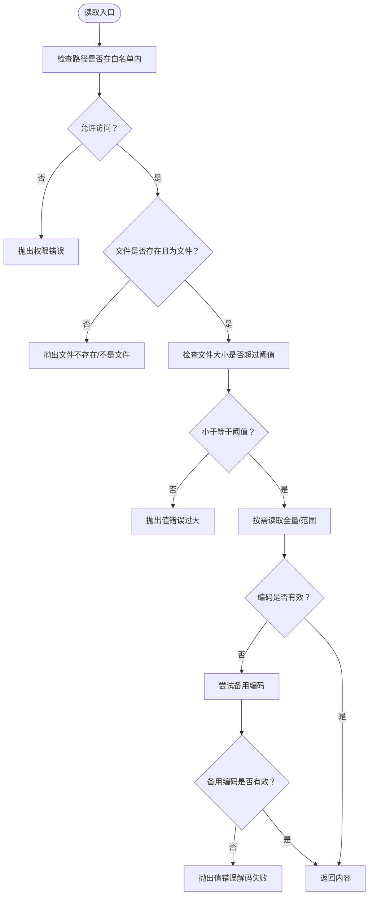
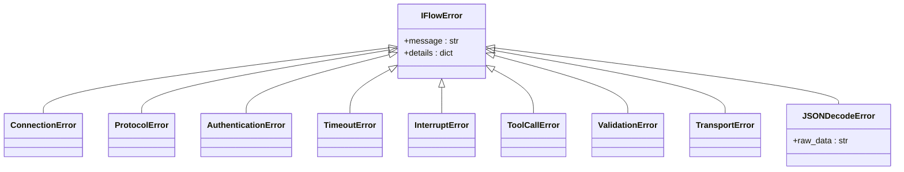
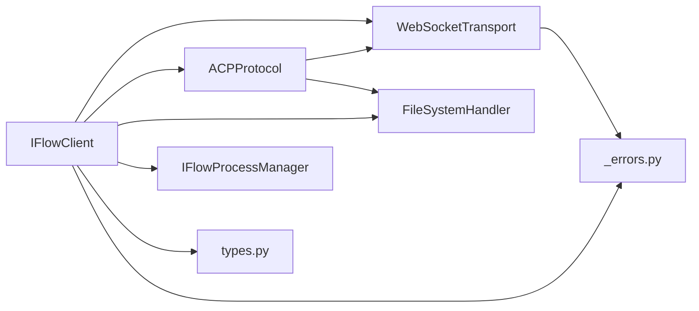

# 高级功能

<cite>
**本文引用的文件**
- [process_manager.py](file://_internal/process_manager.py)
- [file_handler.py](file://_internal/file_handler.py)
- [_errors.py](file://_errors.py)
- [client.py](file://client.py)
- [protocol.py](file://_internal/protocol.py)
- [transport.py](file://_internal/transport.py)
- [types.py](file://types.py)
</cite>

## 目录
1. [简介](#简介)
2. [项目结构](#项目结构)
3. [核心组件](#核心组件)
4. [架构总览](#架构总览)
5. [详细组件分析](#详细组件分析)
6. [依赖关系分析](#依赖关系分析)
7. [性能考量](#性能考量)
8. [故障排查指南](#故障排查指南)
9. [结论](#结论)

## 简介
本章节聚焦于SDK的三大高级能力：进程管理、文件系统访问与错误处理机制。文档将从架构视角解释各模块职责，梳理数据流与控制流，并给出可操作的故障排查建议与最佳实践，帮助开发者在本地或沙箱环境中安全、稳定地使用SDK与iFlow进行交互。

## 项目结构
SDK采用分层设计：
- 内部模块层：进程管理、文件系统、协议与传输
- 客户端层：对外暴露的高层接口与会话管理
- 类型与错误定义：统一的消息、配置与异常体系

图表来源
- [client.py](file://client.py#L1-L120)
- [_internal/process_manager.py](file://_internal/process_manager.py#L25-L60)
- [_internal/file_handler.py](file://_internal/file_handler.py#L16-L45)
- [_internal/protocol.py](file://_internal/protocol.py#L21-L45)
- [_internal/transport.py](file://_internal/transport.py#L27-L60)
- [types.py](file://types.py#L996-L1065)
- [_errors.py](file://_errors.py#L10-L85)

章节来源
- [client.py](file://client.py#L1-L120)
- [_internal/process_manager.py](file://_internal/process_manager.py#L25-L60)
- [_internal/file_handler.py](file://_internal/file_handler.py#L16-L45)
- [_internal/protocol.py](file://_internal/protocol.py#L21-L45)
- [_internal/transport.py](file://_internal/transport.py#L27-L60)
- [types.py](file://types.py#L996-L1065)
- [_errors.py](file://_errors.py#L10-L85)

## 核心组件
- 进程管理：自动发现并启动iFlow CLI，端口探测与进程生命周期管理，支持上下文管理器自动清理
- 文件系统访问：基于白名单目录的安全读写，路径穿越防护、大小限制与只读模式
- 错误处理：统一异常基类与细分异常类型，覆盖连接、协议、认证、超时、中断、工具调用、校验、传输与JSON解码等

章节来源
- [_internal/process_manager.py](file://_internal/process_manager.py#L25-L60)
- [_internal/file_handler.py](file://_internal/file_handler.py#L16-L45)
- [_errors.py](file://_errors.py#L10-L85)

## 架构总览
SDK通过客户端协调传输、协议、文件系统与进程管理模块，形成“连接—初始化—认证—会话—消息处理”的完整链路；当启用自动启动时，客户端会在连接前探测端口并按需启动iFlow进程。

图表来源
- [client.py](file://client.py#L132-L322)
- [_internal/process_manager.py](file://_internal/process_manager.py#L152-L206)
- [_internal/transport.py](file://_internal/transport.py#L53-L84)
- [_internal/protocol.py](file://_internal/protocol.py#L64-L171)
- [_internal/file_handler.py](file://_internal/file_handler.py#L89-L193)

## 详细组件分析

### 进程管理（IFlowProcessManager）
- 自动发现与启动
  - 优先从PATH查找iFlow可执行文件；若失败，遍历常见安装位置
  - 若仍不可用，根据平台生成安装指引并抛出特定异常
- 端口管理
  - 从起始端口开始探测可用端口，避免冲突
  - 超过最大尝试次数则抛出运行时异常
- 生命周期管理
  - 异步启动子进程，短暂等待后检查进程是否立即退出
  - 提供优雅关闭：先terminate，超时后强制kill，并清理状态
  - 支持异步上下文管理器，确保退出时资源回收

图表来源
- [_internal/process_manager.py](file://_internal/process_manager.py#L58-L114)
- [_internal/process_manager.py](file://_internal/process_manager.py#L131-L151)
- [_internal/process_manager.py](file://_internal/process_manager.py#L152-L206)

章节来源
- [_internal/process_manager.py](file://_internal/process_manager.py#L58-L114)
- [_internal/process_manager.py](file://_internal/process_manager.py#L131-L151)
- [_internal/process_manager.py](file://_internal/process_manager.py#L152-L206)
- [_internal/process_manager.py](file://_internal/process_manager.py#L211-L246)

### 文件系统访问（FileSystemHandler）
- 白名单目录与路径穿越防护
  - 将传入目录解析为绝对路径，仅允许位于白名单内的路径
  - 对任意输入路径均进行合法性校验，拒绝越权访问
- 读取策略
  - 支持指定行号与行数范围读取，边界保护
  - 文件大小超过阈值直接拒绝
  - 编码失败时尝试备用编码，仍失败则抛出值错误
- 写入策略
  - 只读模式下禁止写入
  - 路径不在白名单或非文件路径时拒绝
  - 自动创建父目录，UTF-8写入，异常转为IO错误
- 动态目录管理
  - 支持添加/移除白名单目录，新增目录必须存在且为目录

图表来源
- [_internal/file_handler.py](file://_internal/file_handler.py#L59-L88)
- [_internal/file_handler.py](file://_internal/file_handler.py#L89-L159)
- [_internal/file_handler.py](file://_internal/file_handler.py#L160-L193)
- [_internal/file_handler.py](file://_internal/file_handler.py#L194-L217)

章节来源
- [_internal/file_handler.py](file://_internal/file_handler.py#L59-L88)
- [_internal/file_handler.py](file://_internal/file_handler.py#L89-L159)
- [_internal/file_handler.py](file://_internal/file_handler.py#L160-L193)
- [_internal/file_handler.py](file://_internal/file_handler.py#L194-L217)

### 错误处理机制
- 异常层次
  - 基类：IFlowError
  - 细分：ConnectionError、ProtocolError、AuthenticationError、TimeoutError、InterruptError、ToolCallError、ValidationError、TransportError、JSONDecodeError
- 触发场景
  - 连接失败、握手/初始化/认证异常、协议解析错误、传输层异常、JSON解码失败、工具调用失败、参数校验失败、操作被中断
- 典型恢复策略
  - 连接失败：重试（指数退避）、检查URL与端口、确认iFlow进程状态
  - 协议错误：检查版本兼容性、参数完整性、会话状态
  - 认证失败：核对凭据、方法ID一致性、超时时间
  - 传输错误：网络波动重连、消息序列化/反序列化问题排查
  - JSON解码错误：检查消息格式、服务端版本、日志级别
  - 工具调用错误：确认白名单与只读模式、路径合法性、大小限制
  - 中断与超时：合理设置超时、在上层实现取消信号

图表来源
- [_errors.py](file://_errors.py#L10-L85)

章节来源
- [_errors.py](file://_errors.py#L10-L85)

## 依赖关系分析
- IFlowClient依赖
  - 传输层：WebSocketTransport
  - 协议层：ACPProtocol
  - 文件系统：FileSystemHandler（可选）
  - 进程管理：IFlowProcessManager（可选）
  - 类型与错误：types、_errors
- 协议层依赖
  - 传输层：WebSocketTransport
  - 文件系统：FileSystemHandler（可选）
  - 错误：_errors
- 传输层依赖
  - 错误：_errors
  - 外部库：websockets

图表来源
- [client.py](file://client.py#L1-L120)
- [_internal/protocol.py](file://_internal/protocol.py#L21-L45)
- [_internal/transport.py](file://_internal/transport.py#L27-L45)
- [_internal/file_handler.py](file://_internal/file_handler.py#L16-L45)
- [_internal/process_manager.py](file://_internal/process_manager.py#L25-L45)
- [types.py](file://types.py#L996-L1065)
- [_errors.py](file://_errors.py#L10-L85)

章节来源
- [client.py](file://client.py#L1-L120)
- [_internal/protocol.py](file://_internal/protocol.py#L21-L45)
- [_internal/transport.py](file://_internal/transport.py#L27-L45)
- [_internal/file_handler.py](file://_internal/file_handler.py#L16-L45)
- [_internal/process_manager.py](file://_internal/process_manager.py#L25-L45)
- [types.py](file://types.py#L996-L1065)
- [_errors.py](file://_errors.py#L10-L85)

## 性能考量
- 连接与重试
  - 客户端对WebSocket连接采用有限次重试与指数退避，降低瞬时故障影响
- 消息处理
  - 协议层接收消息后先做JSON解析，再分派到不同处理分支，避免阻塞
- 文件读写
  - 读取支持范围读取与大小限制，减少内存占用；写入自动创建父目录，避免多次系统调用
- 进程管理
  - 端口探测采用快速绑定验证，避免长时间占用；启动后短暂等待以确保服务就绪

章节来源
- [client.py](file://client.py#L204-L221)
- [_internal/protocol.py](file://_internal/protocol.py#L508-L533)
- [_internal/file_handler.py](file://_internal/file_handler.py#L130-L149)
- [_internal/process_manager.py](file://_internal/process_manager.py#L172-L206)

## 故障排查指南

### 连接与协议
- 症状：连接超时或连接失败
  - 排查要点：URL与端口、防火墙、iFlow进程状态、网络连通性
  - 恢复策略：增大超时、重试、确认端口可用、检查代理与安全策略
- 症状：初始化/认证失败
  - 排查要点：协议版本、客户端能力声明、认证方法ID与凭据
  - 恢复策略：核对方法ID一致性、检查凭据有效期、查看服务端返回的错误详情

章节来源
- [_internal/transport.py](file://_internal/transport.py#L53-L84)
- [_internal/protocol.py](file://_internal/protocol.py#L64-L171)
- [_internal/protocol.py](file://_internal/protocol.py#L176-L256)

### 进程管理
- 症状：iFlow未安装或无法启动
  - 排查要点：PATH环境变量、常见安装路径、Node.js与npm/npx可用性
  - 恢复策略：按提示安装iFlow CLI，确保可执行文件存在且可执行
- 症状：端口被占用
  - 排查要点：起始端口与尝试次数、其他服务监听
  - 恢复策略：调整起始端口、释放占用端口、增加尝试次数上限

章节来源
- [_internal/process_manager.py](file://_internal/process_manager.py#L58-L114)
- [_internal/process_manager.py](file://_internal/process_manager.py#L131-L151)
- [_internal/process_manager.py](file://_internal/process_manager.py#L152-L206)

### 文件系统访问
- 症状：访问被拒绝
  - 排查要点：路径是否在白名单内、是否为文件、是否处于只读模式
  - 恢复策略：将目标目录加入allowed_dirs、关闭read_only、修正路径
- 症状：文件过大或解码失败
  - 排查要点：max_file_size阈值、文件编码
  - 恢复策略：调整阈值、确认编码、分段读取

章节来源
- [_internal/file_handler.py](file://_internal/file_handler.py#L110-L159)
- [_internal/file_handler.py](file://_internal/file_handler.py#L160-L193)
- [_internal/file_handler.py](file://_internal/file_handler.py#L194-L217)

### 工具调用与权限
- 症状：工具调用需要确认但无响应
  - 排查要点：ApprovalMode配置、用户确认流程、请求ID有效性
  - 恢复策略：正确处理ToolCallConfirmationRequest消息、及时调用确认/取消接口

章节来源
- [_internal/protocol.py](file://_internal/protocol.py#L567-L597)
- [_internal/protocol.py](file://_internal/protocol.py#L720-L768)
- [client.py](file://client.py#L568-L598)

### JSON解码与传输
- 症状：JSON解码错误
  - 排查要点：消息格式、服务端版本、日志级别
  - 恢复策略：升级SDK/服务端、检查消息边界、开启更详细日志

章节来源
- [_internal/protocol.py](file://_internal/protocol.py#L530-L533)
- [_internal/transport.py](file://_internal/transport.py#L114-L146)

## 结论
本SDK通过清晰的分层设计与完善的错误体系，提供了安全可控的本地/沙箱交互能力。进程管理与文件系统访问在保证安全的前提下，提供了灵活的配置选项；错误处理机制覆盖了连接、协议、认证、传输与业务层面的常见问题，配合合理的恢复策略，能够显著提升系统的稳定性与可维护性。建议在生产环境中：
- 明确白名单目录与只读策略
- 合理设置超时与重试
- 使用ApprovalMode与权限选项控制工具调用风险
- 在出现异常时结合日志与错误详情定位根因